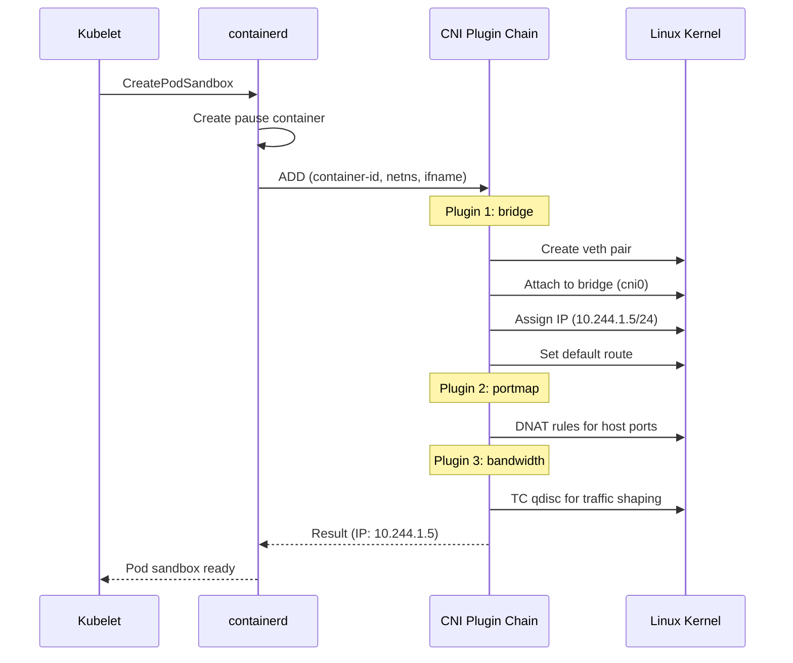
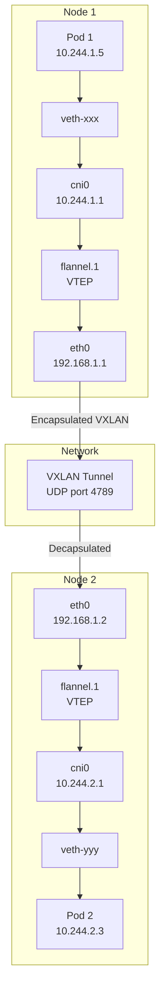
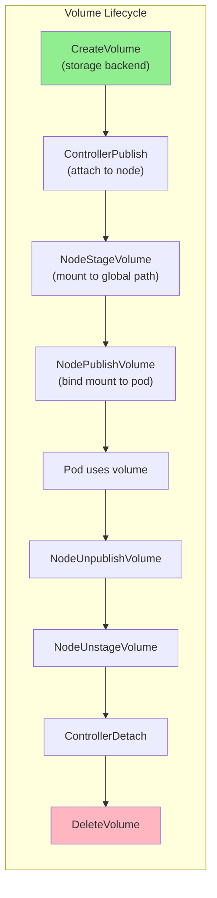

# Chapter 181: Container Networking and Storage — CNI, Overlays, and CSI

## 1. Introduction

Container networking and storage are two of the most complex aspects of container infrastructure. Networking must provide each pod with its own IP while enabling communication across nodes. Storage must persist data beyond container lifecycles while supporting dynamic provisioning. Both are implemented through plugin-based architectures — **CNI** (Container Network Interface) for networking and **CSI** (Container Storage Interface) for storage.

This chapter examines the Linux networking primitives that container networking builds upon, the major CNI plugins (bridge, flannel, calico, cilium), and how CSI plugins interact with the kernel to provide persistent storage.

## 2. Container Networking Fundamentals

### 2.1 The Linux Networking Stack for Containers

Every container networking solution uses these Linux kernel primitives:

```
┌─────────────────────────────────────────────────────────┐
│  Container Network Namespace                             │
│  ┌─────────────────────────────────────────────────────┐│
│  │  eth0 (veth pair end)                               ││
│  │  IP: 10.244.1.5/24                                 ││
│  │  Default gateway: 10.244.1.1                       ││
│  └───────────────────────┬─────────────────────────────┘│
└──────────────────────────┼──────────────────────────────┘
                           │ veth pair
┌──────────────────────────┼──────────────────────────────┐
│  Host Network Namespace  │                               │
│  ┌───────────────────────▼─────────────────────────────┐│
│  │  vethXXXX (host end of veth pair)                   ││
│  └───────────────────────┬─────────────────────────────┘│
│                          │                               │
│  ┌───────────────────────▼─────────────────────────────┐│
│  │  Bridge (cbr0 / cni0 / docker0)                    ││
│  │  IP: 10.244.1.1/24                                 ││
│  └───────────────────────┬─────────────────────────────┘│
│                          │                               │
│  ┌───────────────────────▼─────────────────────────────┐│
│  │  Routing / NAT / iptables                           ││
│  └───────────────────────┬─────────────────────────────┘│
│                          │                               │
│  ┌───────────────────────▼─────────────────────────────┐│
│  │  Physical/Virtual NIC (eth0, ens3)                  ││
│  └─────────────────────────────────────────────────────┘│
└──────────────────────────────────────────────────────────┘
```

### 2.2 Key Linux Networking Primitives

**Network Namespaces:**
```bash
# Each container gets its own network stack
ip netns add container-1
# Creates: /var/run/netns/container-1
# Includes: own routing table, iptables, /proc/net, devices
```

**veth Pairs:**
```bash
# Virtual Ethernet pair — like a cable connecting two namespaces
ip link add veth-host type veth peer name veth-container
ip link set veth-container netns container-1
# Now container-1 has "veth-container" and host has "veth-host"
```

**Linux Bridge:**
```bash
# Layer 2 switch in software
ip link add cbr0 type bridge
ip link set veth-host master cbr0
# Bridge connects multiple veth pairs
```

**iptables/nftables:**
```bash
# NAT for outbound traffic
iptables -t nat -A POSTROUTING -s 10.244.0.0/16 ! -o cbr0 -j MASQUERADE

# DNAT for service load balancing
iptables -t nat -A PREROUTING -p tcp --dport 80 -j DNAT --to 10.244.1.5:80
```

**VXLAN (for overlay networks):**
```bash
# Layer 2 over Layer 3 tunnel
ip link add vxlan0 type vxlan id 42 remote 192.168.1.2 dstport 4789 dev eth0
# Encapsulates Ethernet frames in UDP packets
```

## 3. CNI (Container Network Interface)

### 3.1 What is CNI?

CNI is a specification for container network plugins. It defines a simple interface:

- **ADD** — Add a container to a network (create interface, assign IP)
- **DEL** — Remove a container from a network
- **CHECK** — Verify container networking is configured correctly
- **GC** — Garbage collect stale network resources

### 3.2 CNI Plugin Chain

CNI plugins can be chained. A typical chain:

```
┌─────────────────────────────────────────────────────┐
│  CNI Plugin Chain                                   │
│                                                     │
│  1. bandwidth    → Apply traffic shaping            │
│  2. bridge       → Create veth pair, connect to bridge
│  3. dhcp         → Get IP from DHCP server          │
│  4. flannel      → VXLAN overlay networking         │
│  5. host-device  → Move host device into container  │
│  6. host-local   → Allocate IP from local pool      │
│  7. loopback     → Configure lo interface           │
│  8. macvlan      → Create MACVLAN interface          │
│  9. portmap      → Port forwarding (DNAT)           │
│  10. ptp         → Point-to-point veth pair         │
│  11. tuning      → Tune network interface params    │
│  12. vlan        → Create VLAN interface            │
└─────────────────────────────────────────────────────┘
```

### 3.3 CNI Configuration

```json
{
    "cniVersion": "1.0.0",
    "name": "my-network",
    "plugins": [
        {
            "type": "bridge",
            "bridge": "cni0",
            "isGateway": true,
            "ipMasq": true,
            "ipam": {
                "type": "host-local",
                "ranges": [
                    [
                        {
                            "subnet": "10.244.1.0/24",
                            "rangeStart": "10.244.1.2",
                            "rangeEnd": "10.244.1.254",
                            "gateway": "10.244.1.1"
                        }
                    ]
                ],
                "routes": [
                    { "dst": "0.0.0.0/0" }
                ]
            }
        },
        {
            "type": "portmap",
            "capabilities": {
                "portMappings": true
            }
        },
        {
            "type": "bandwidth",
            "capabilities": {
                "bandwidth": true
            }
        }
    ]
}
```

### 3.4 CNI Plugin Execution

```bash
# CNI environment variables passed to plugins
CNI_COMMAND=ADD
CNI_CONTAINER_ID=abc123def456
CNI_NETNS=/var/run/netns/container-1
CNI_IFNAME=eth0
CNI_PATH=/opt/cni/bin

# Plugin reads config from stdin, outputs result to stdout
echo '{"cniVersion":"1.0.0",...}' | CNI_COMMAND=ADD CNI_NETNS=/var/run/netns/c1 CNI_IFNAME=eth0 /opt/cni/bin/bridge

# Output:
{
    "cniVersion": "1.0.0",
    "interfaces": [
        {
            "name": "cni0",
            "mac": "..."
        },
        {
            "name": "veth1234",
            "mac": "..."
        },
        {
            "name": "eth0",
            "mac": "...",
            "sandbox": "/var/run/netns/container-1"
        }
    ],
    "ips": [
        {
            "version": "4",
            "interface": 2,
            "address": "10.244.1.5/24",
            "gateway": "10.244.1.1"
        }
    ]
}
```

## 4. Major CNI Plugins

### 4.1 Bridge CNI

The simplest CNI plugin — creates a local bridge network:

```bash
# Creates:
# 1. Linux bridge (cni0)
# 2. veth pair (one end in container, one on bridge)
# 3. IP allocation (via host-local IPAM)
# 4. NAT for outbound traffic

# Single-node only — containers on different nodes can't communicate directly
```

### 4.2 Flannel

Flannel provides overlay networking for multi-node clusters:

```
┌─────────────────────────────────────────────────────┐
│  Node 1 (192.168.1.1)                               │
│  ┌─────────────────────────────────────────────────┐│
│  │  Pod 1 (10.244.1.5)                            ││
│  │  └── eth0 ── veth ── cni0 ── flannel.1 ──┐    ││
│  └───────────────────────────────────────────┤─────┘│
│                                              │      │
│  VXLAN: UDP port 4789                        │      │
└──────────────────────────────────────────────┤──────┘
                                               │
                         ┌─────────────────────┘
                         │ Encapsulated VXLAN packet
                         │ Inner: src=10.244.1.5 dst=10.244.2.3
                         │ Outer: src=192.168.1.1 dst=192.168.1.2
                         │
┌────────────────────────▼────────────────────────────┐
│  Node 2 (192.168.1.2)                               │
│  ┌─────────────────────────────────────────────────┐│
│  │  flannel.1 ── cni0 ── veth ── eth0 ── Pod 2   ││
│  │                              (10.244.2.3)       ││
│  └─────────────────────────────────────────────────┘│
└─────────────────────────────────────────────────────┘
```

**Flannel backend options:**

| Backend | Mechanism | Performance | Encryption |
|---------|-----------|-------------|------------|
| vxlan | VXLAN encapsulation | Good | No (unless WireGuard) |
| host-gw | Direct routing | Best | No |
| wireguard | WireGuard tunnel | Good | Yes |
| udp | UDP encapsulation | Poor (legacy) | No |

```bash
# Flannel VXLAN configuration
# /etc/kube-flannel/cfg
{
    "Network": "10.244.0.0/16",
    "Backend": {
        "Type": "vxlan",
        "VNI": 1,
        "Port": 4789
    }
}
```

### 4.3 Calico

Calico uses BGP for routing and provides network policy enforcement:

```
┌─────────────────────────────────────────────────────────┐
│  Node 1                                                 │
│  ┌────────────────────────────────────────────────────┐│
│  │  Pod 1 (10.244.1.5) ── veth ── tunl0             ││
│  │                                (IP-in-IP tunnel)   ││
│  │                                                    ││
│  │  BIRD (BGP daemon) ←── BGP ──→ BIRD on Node 2    ││
│  └────────────────────────────────────────────────────┘│
└─────────────────────────────────────────────────────────┘

# Routes learned via BGP:
# 10.244.1.0/24 via 192.168.1.1 dev tunl0
# 10.244.2.0/24 via 192.168.1.2 dev tunl0
```

**Calico features:**
- **BGP routing** — Direct routing without encapsulation (host-gw mode)
- **IP-in-IP tunneling** — When nodes are on different subnets
- **VXLAN mode** — Alternative to IP-in-IP
- **Network policies** — iptables-based policy enforcement
- **eBPF dataplane** — High-performance alternative to iptables

**Calico NetworkPolicy example:**

```yaml
apiVersion: networking.k8s.io/v1
kind: NetworkPolicy
metadata:
  name: allow-web-only
  namespace: production
spec:
  podSelector:
    matchLabels:
      app: web
  policyTypes:
  - Ingress
  - Egress
  ingress:
  - from:
    - namespaceSelector:
        matchLabels:
          role: frontend
    ports:
    - protocol: TCP
      port: 80
  egress:
  - to:
    - namespaceSelector:
        matchLabels:
          role: database
    ports:
    - protocol: TCP
      port: 5432
```

**How Calico implements network policies:**

```bash
# Calico creates iptables rules in the cali-FORWARD chain
iptables -L cali-FORWARD -n
# Chain cali-FORWARD (policy ACCEPT)
# target     prot  opt  source          destination
# cali-fw-abc123  all  --  0.0.0.0/0     10.244.1.5    /* cali:abc123 */
# cali-fw-abc123  all  --  10.244.1.5    0.0.0.0/0     /* cali:abc123 */

# Per-endpoint chains enforce policies
iptables -L cali-fw-abc123 -n
# Chain cali-fw-abc123
# target     prot  opt  source          destination
# ACCEPT     tcp   --  10.244.0.0/16   10.244.1.5    tcp dpt:80 /* allow-web */
# DROP       all   --  0.0.0.0/0       0.0.0.0/0     /* default deny */
```

### 4.4 Cilium

Cilium uses eBPF for high-performance networking and observability:

```
┌─────────────────────────────────────────────────────┐
│  Cilium Architecture                                │
│                                                     │
│  ┌─────────────────────────────────────────────────┐│
│  │  eBPF programs (in kernel)                      ││
│  │  - TC (traffic control) hooks                   ││
│  │  - XDP (express data path) hooks                ││
│  │  - Socket-level hooks                           ││
│  └─────────────────────────────────────────────────┘│
│                                                     │
│  ┌─────────────────────────────────────────────────┐│
│  │  Cilium Agent (userspace)                       ││
│  │  - Policy enforcement                           ││
│  │  - Service load balancing (kube-proxy replacement)│
│  │  - Observability (Hubble)                       ││
│  └─────────────────────────────────────────────────┘│
│                                                     │
│  ┌─────────────────────────────────────────────────┐│
│  │  Datapath modes:                                ││
│  │  - VXLAN overlay                                ││
│  │  - Native routing (direct L3)                   ││
│  │  - Geneve overlay                               ││
│  └─────────────────────────────────────────────────┘│
└─────────────────────────────────────────────────────┘
```

**Cilium advantages:**
- eBPF-based packet processing (no iptables)
- Deep network observability (Hubble)
- Transparent encryption (WireGuard)
- Service mesh capabilities
- Bandwidth manager

## 5. Container Storage Interface (CSI)

### 5.1 What is CSI?

CSI is a standard for exposing storage systems to containerized workloads. It defines gRPC APIs for:

- **Node Service** — Operations on a specific node (mount, unmount)
- **Controller Service** — Volume lifecycle (create, delete, attach, detach)
- **Identity Service** — Plugin identification

### 5.2 CSI Architecture

```
┌─────────────────────────────────────────────────────────┐
│  Kubernetes Control Plane                                │
│  ┌─────────────────────────────────────────────────────┐│
│  │  CSI Controller (Deployment)                        ││
│  │  - Creates/deletes volumes                          ││
│  │  - Attaches/detaches volumes                        ││
│  │  - Snapshots, cloning                               ││
│  └─────────────────────────────────────────────────────┘│
└─────────────────────────────────────────────────────────┘
                        │ gRPC
┌─────────────────────────────────────────────────────────┐
│  Kubernetes Node                                         │
│  ┌─────────────────────────────────────────────────────┐│
│  │  CSI Node Plugin (DaemonSet)                        ││
│  │  - Stages volumes (mount to global path)            ││
│  │  - Publishes volumes (bind mount to pod path)       ││
│  │  - Unpublishes and unstages                         ││
│  └─────────────────────────────────────────────────────┘│
│  ┌─────────────────────────────────────────────────────┐│
│  │  kubelet                                            ││
│  │  - Calls CSI Node Plugin via gRPC                   ││
│  │  - Manages volume lifecycle                         ││
│  └─────────────────────────────────────────────────────┘│
└─────────────────────────────────────────────────────────┘
```

### 5.3 CSI Volume Lifecycle

```
1. CreateVolume          → Storage backend creates a volume
2. ControllerPublish     → Attach volume to a node (cloud: attach disk)
3. NodeStageVolume       → Mount volume to a global path on the node
4. NodePublishVolume     → Bind mount from global path to pod path
5. (Pod uses the volume)
6. NodeUnpublishVolume   → Unmount from pod path
7. NodeUnstageVolume     → Unmount from global path
8. ControllerDetach      → Detach volume from node
9. DeleteVolume          → Storage backend deletes the volume
```

### 5.4 CSI Driver Example (NFS)

```yaml
apiVersion: storage.k8s.io/v1
kind: StorageClass
metadata:
  name: nfs-csi
provisioner: nfs.csi.k8s.io
parameters:
  server: nfs-server.example.com
  share: /exported/path
reclaimPolicy: Delete
volumeBindingMode: Immediate
mountOptions:
  - nfsvers=4.1
```

```yaml
apiVersion: v1
kind: PersistentVolumeClaim
metadata:
  name: my-pvc
spec:
  accessModes:
    - ReadWriteOnce
  storageClassName: nfs-csi
  resources:
    requests:
      storage: 10Gi
```

### 5.5 How CSI Volumes Map to Linux Mounts

```bash
# 1. CSI creates the volume (e.g., NFS share)
# 2. NodeStageVolume mounts to global path:
mount -t nfs nfs-server:/exported/path /var/lib/kubelet/plugins/kubernetes.io/csi/pv/my-pv/globalmount

# 3. NodePublishVolume bind mounts to pod path:
mount --bind /var/lib/kubelet/plugins/kubernetes.io/csi/pv/my-pv/globalmount /var/lib/kubelet/pods/<pod-uid>/volumes/kubernetes.io~csi/my-pv/mount

# 4. Container runtime mounts this into the container's mount namespace
```

### 5.6 Volume Access Modes

| Mode | Abbreviation | Description |
|------|-------------|-------------|
| ReadWriteOnce | RWO | Single node read-write |
| ReadOnlyMany | ROX | Multiple nodes read-only |
| ReadWriteMany | RWX | Multiple nodes read-write |
| ReadWriteOncePod | RWOP | Single pod read-write (Kubernetes 1.27+) |

### 5.7 Common CSI Drivers

| Driver | Storage Backend | Features |
|--------|----------------|----------|
| aws-ebs-csi-driver | Amazon EBS | Snapshots, encryption, resize |
| gce-pd-csi-driver | Google Persistent Disk | Regional PD, snapshots |
| azure-disk-csi-driver | Azure Disk | Ultra disk, snapshots |
| ceph-csi | Ceph RBD/CephFS | Distributed storage, snapshots |
| nfs-csi | NFS | Shared storage, multiple access modes |
| local-csi-driver | Local disks | High performance, node affinity |
| longhorn | Distributed block | Replication, snapshots, backup |
| openebs | Various | Jiva, cStor, LocalPV |

### 5.8 Dynamic Volume Provisioning

```yaml
# StorageClass defines how volumes are created
apiVersion: storage.k8s.io/v1
kind: StorageClass
metadata:
  name: fast-ssd
provisioner: kubernetes.io/aws-ebs
parameters:
  type: gp3
  iopsPerGB: "50"
  encrypted: "true"
reclaimPolicy: Retain  # Retain or Delete
volumeBindingMode: WaitForFirstConsumer  # Wait for pod scheduling
allowVolumeExpansion: true
mountOptions:
  - noatime
```

```yaml
# PVC references the StorageClass
apiVersion: v1
kind: PersistentVolumeClaim
metadata:
  name: database-pvc
spec:
  accessModes:
    - ReadWriteOnce
  storageClassName: fast-ssd
  resources:
    requests:
      storage: 100Gi
```

### 5.9 Volume Snapshots

```yaml
# Create a VolumeSnapshotClass
apiVersion: snapshot.storage.k8s.io/v1
kind: VolumeSnapshotClass
metadata:
  name: csi-snapclass
driver: ebs.csi.aws.com
deletionPolicy: Delete

---
# Create a snapshot from a PVC
apiVersion: snapshot.storage.k8s.io/v1
kind: VolumeSnapshot
metadata:
  name: database-snapshot
spec:
  volumeSnapshotClassName: csi-snapclass
  source:
    persistentVolumeClaimName: database-pvc

---
# Restore from snapshot
apiVersion: v1
kind: PersistentVolumeClaim
metadata:
  name: restored-pvc
spec:
  dataSource:
    name: database-snapshot
    kind: VolumeSnapshot
    apiGroup: snapshot.storage.k8s.io
  accessModes:
    - ReadWriteOnce
  resources:
    requests:
      storage: 100Gi
```

### 5.10 Storage Encryption and Security

```bash
# Encrypted volumes (cloud-specific)
# AWS EBS encryption
kubectl get storageclass gp3 -o yaml | grep encrypted
# encrypted: "true"

# LUKS encryption for local volumes
# Requires CSI driver support

# Volume permissions
# fsGroup sets the group owner of mounted volumes
spec:
  securityContext:
    fsGroup: 2000
    fsGroupChangePolicy: OnRootMismatch  # Only change if needed
```

## 6. Mermaid Diagrams

### 6.1 CNI Plugin Chain Execution



### 6.2 Overlay Network Packet Flow



### 6.3 CSI Volume Lifecycle



### 6.4 Container Network Debugging

```bash
# Debug pod networking
kubectl exec -it pod-name -- ping 8.8.8.8
kubectl exec -it pod-name -- nslookup kubernetes.default
kubectl exec -it pod-name -- traceroute 10.96.0.100

# Check pod IP and routes
kubectl exec -it pod-name -- ip addr show
kubectl exec -it pod-name -- ip route

# Check DNS configuration
kubectl exec -it pod-name -- cat /etc/resolv.conf
# nameserver 10.96.0.10 (CoreDNS)
# search default.svc.cluster.local svc.cluster.local cluster.local

# Debug service connectivity
kubectl exec -it pod-name -- curl -v http://my-service:80
kubectl exec -it pod-name -- telnet my-service 80

# Check iptables rules on node (for services)
iptables -t nat -L KUBE-SERVICES -n
iptables -t nat -L KUBE-SVC-<hash> -n
iptables -t nat -L KUBE-SEP-<hash> -n

# Check IPVS rules (if using IPVS mode)
ipvsadm -Ln

# Check CNI plugin logs
journalctl -u kubelet | grep -i cni
# Or check containerd logs
journalctl -u containerd | grep -i cni

# Verify CNI configuration
cat /etc/cni/net.d/*.conflist
# Shows the CNI plugin chain configuration
```

### 6.5 Network Policy Debugging

```bash
# List all network policies
kubectl get networkpolicies -A

# Describe a specific policy
kubectl describe networkpolicy allow-web-only -n production

# Test connectivity (should work)
kubectl exec -it test-pod -- curl http://web-service:80

# Test blocked connectivity (should fail)
kubectl exec -it test-pod -- curl http://database-service:5432

# Check if network policy is enforced
calicoctl get networkpolicy -A  # For Calico
# Or check iptables rules
iptables -L cali-fw-<endpoint-id> -n

# Debug with tcpdump
kubectl exec -it pod-name -- tcpdump -i eth0 -nn
# Capture packets to see what's being dropped
```

### 6.6 CSI Driver Debugging

```bash
# Check CSI driver status
kubectl get csidrivers
# NAME                     ATTACHREQUIRED   PODINFOONMOUNT   MODES        AGE
# ebs.csi.aws.com         true             false            Persistent   30d

# Check CSI node plugin logs
kubectl logs -n kube-system -l app=ebs-csi-node -c ebs-plugin

# Check volume attachments
kubectl get volumeattachments
# NAME                                   ATTACHER          PV                NODE            AGE
# csi-abc123...                          ebs.csi.aws.com   pvc-def456...     node-1          30d

# Check PersistentVolume and PVC status
kubectl get pv
kubectl get pvc -A

# Debug volume mount issues
# On the node, check if volume is mounted
mount | grep kubelet
# Should show CSI volume mounts

# Check CSI socket
ls -la /var/lib/kubelet/plugins/ebs.csi.aws.com/csi.sock
# Should exist if CSI driver is running

# Restart CSI node plugin (if needed)
kubectl rollout restart daemonset ebs-csi-node -n kube-system
```

## 7. Common Pitfalls

### 7.1 MTU Issues with Overlay Networks

```bash
# VXLAN adds 50 bytes of overhead
# If host MTU is 1500, pod MTU should be 1450

# Check pod MTU
kubectl exec pod-name -- ip link show eth0
# mtu 1450

# If packets are being fragmented, reduce MTU
# Flannel: --iface-mtu=1450
# Calico: veth_mtu=1450
```

### 7.2 DNS Resolution Failures

```bash
# Pods use CoreDNS (10.96.0.10 by default)
# Check CoreDNS is running
kubectl get pods -n kube-system -l k8s-app=kube-dns

# Test DNS from a pod
kubectl exec pod-name -- nslookup kubernetes.default

# Check resolv.conf
kubectl exec pod-name -- cat /etc/resolv.conf
# nameserver 10.96.0.10
# search default.svc.cluster.local svc.cluster.local cluster.local
```

### 7.3 Network Policy Not Working

```bash
# Network policies require a CNI that supports them
# Flannel: NO network policy support
# Calico: YES
# Cilium: YES
# Weave: YES

# Check if network policies are being enforced
kubectl get networkpolicies -A
```

### 7.4 Volume Permission Issues

```bash
# fsGroup in securityContext sets volume group ownership
spec:
  securityContext:
    fsGroup: 2000  # All volume files owned by group 2000

# For NFS volumes, ensure the NFS server allows the fsGroup
```

### 7.5 Storage Class Not Found

```bash
# Check available storage classes
kubectl get storageclasses

# Check if CSI driver is installed
kubectl get csidrivers

# Check CSI node plugin logs
kubectl logs -n kube-system -l app=csi-<driver>-node
```

### 7.6 Storage Performance Tuning

```bash
# Check I/O performance in containers
kubectl exec -it pod-name -- dd if=/dev/zero of=/tmp/test bs=1M count=100 oflag=direct

# Check disk latency
kubectl exec -it pod-name -- ioping /data

# Use local SSDs for high performance
# Create a StorageClass for local volumes
apiVersion: storage.k8s.io/v1
kind: StorageClass
metadata:
  name: local-ssd
provisioner: kubernetes.io/no-provisioner
volumeBindingMode: WaitForFirstConsumer

# Use volume mode Block for raw block access
apiVersion: v1
kind: PersistentVolumeClaim
metadata:
  name: raw-block-pvc
spec:
  volumeMode: Block
  accessModes:
    - ReadWriteOnce
  resources:
    requests:
      storage: 100Gi
```

## 8. Best Practices

1. **Choose the right CNI for your needs:**
   - Small cluster, single node: Bridge
   - Multi-node, simple: Flannel
   - Multi-node, policies needed: Calico
   - High performance, observability: Cilium

2. **Set correct MTU** — Account for overlay overhead.

3. **Use network policies** — Default deny, allow specific traffic.

4. **Use CSI drivers for persistent storage** — Don't rely on hostPath.

5. **Set `reclaimPolicy: Retain` for important data** — Prevents accidental deletion.

6. **Use volume snapshots for backups** — CSI drivers that support snapshots.

7. **Monitor network latency and throughput** — Overlay networks add overhead.

8. **Use `ReadWriteOncePod` for single-pod volumes** — Prevents multi-attach issues.

9. **Test network policies thoroughly** — Use `kubectl exec` to verify connectivity.

10. **Keep CSI drivers updated** — Security patches and new features.

## 9. Exercises

### Exercise 1: Manual CNI Execution

```bash
# Create a network namespace
ip netns add test-ns

# Create an OCI CNI configuration
cat > /tmp/cni-config.json <<EOF
{
    "cniVersion": "1.0.0",
    "name": "test-network",
    "plugins": [
        {
            "type": "bridge",
            "bridge": "cni-test",
            "isGateway": true,
            "ipMasq": true,
            "ipam": {
                "type": "host-local",
                "ranges": [[{"subnet": "10.99.0.0/24"}]],
                "routes": [{"dst": "0.0.0.0/0"}]
            }
        }
    ]
}
EOF

# Execute CNI ADD
echo '{}' | CNI_COMMAND=ADD CNI_CONTAINER_ID=test CNI_NETNS=/var/run/netns/test-ns CNI_IFNAME=eth0 CNI_PATH=/opt/cni/bin /opt/cni/bin/bridge < /tmp/cni-config.json

# Check the result
ip netns exec test-ns ip addr
ip netns exec test-ns ip route

# Clean up
CNI_COMMAND=DEL CNI_CONTAINER_ID=test CNI_NETNS=/var/run/netns/test-ns CNI_IFNAME=eth0 CNI_PATH=/opt/cni/bin /opt/cni/bin/bridge < /tmp/cni-config.json
ip netns delete test-ns
```

### Exercise 2: Inspect Kubernetes Network Rules

```bash
# Find kube-proxy rules on a node
iptables -t nat -L KUBE-SERVICES -n
iptables -t nat -L KUBE-SEP-* -n

# Or with IPVS
ipvsadm -Ln

# Trace a packet through the rules
iptables -t raw -A PREROUTING -p tcp --dport 80 -j TRACE
# Check dmesg for trace output
```

### Exercise 3: CSI Volume Inspection

```bash
# List CSI drivers
kubectl get csidrivers

# Check volume attachments
kubectl get volumeattachments

# Inspect a PVC
kubectl describe pvc my-pvc

# On the node, find the mount
mount | grep kubelet
# Check the global staging path
ls /var/lib/kubelet/plugins/kubernetes.io/csi/
```

## 10. References

1. CNI specification: https://github.com/containernetworking/cni
2. CNI plugins: https://github.com/containernetworking/plugins
3. Flannel: https://github.com/flannel-io/flannel
4. Calico: https://github.com/projectcalico/calico
5. Cilium: https://github.com/cilium/cilium
6. CSI specification: https://github.com/container-storage-interface/spec
7. Kubernetes networking: https://kubernetes.io/docs/concepts/cluster-administration/networking/
8. Kubernetes storage: https://kubernetes.io/docs/concepts/storage/
9. Linux VXLAN: `man 8 ip-link` (VXLAN section)
10. iptables: `man 8 iptables`
