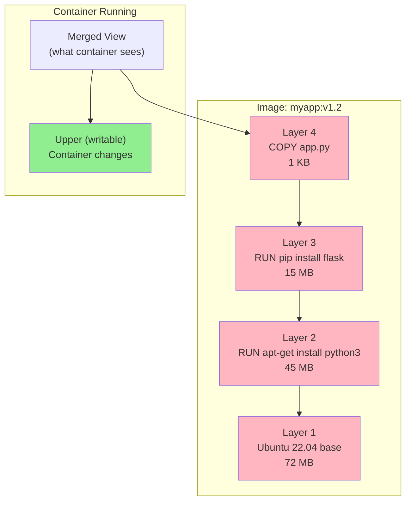
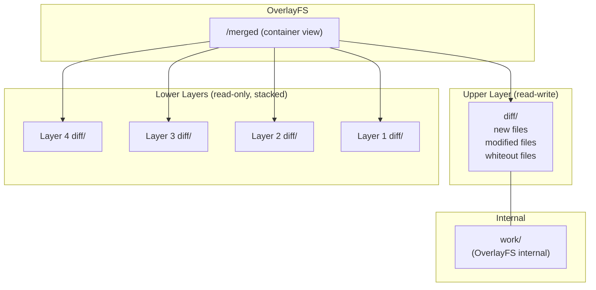
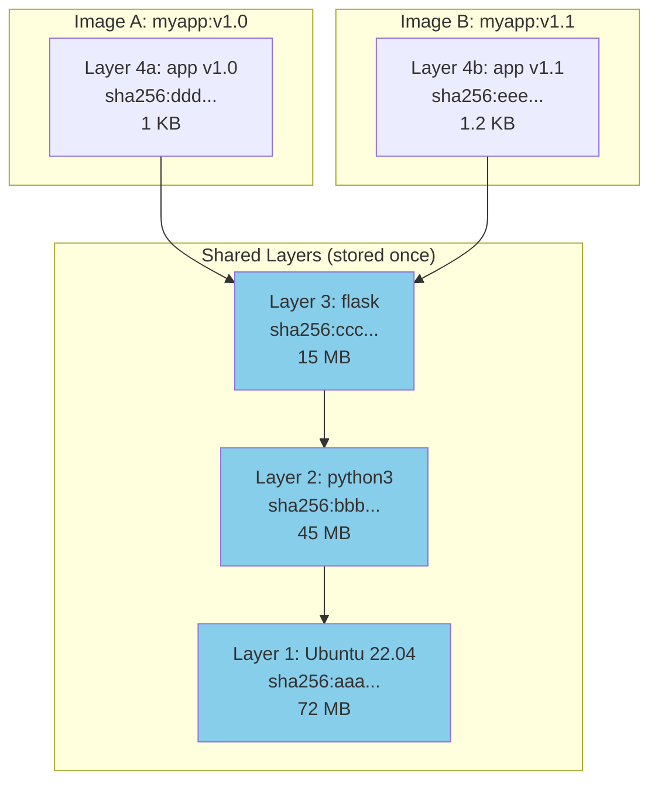

# Chapter 182: Image Layers and OverlayFS — Docker Storage Drivers, Image Format, and Layer Deduplication

## 1. Introduction

Container images are the fundamental unit of distribution in the container ecosystem. An image is not a monolithic blob — it's a stack of **layers**, each representing incremental filesystem changes. These layers are managed by the container runtime's storage driver, merged by a union filesystem (typically OverlayFS), and deduplicated across images that share common base layers.

This chapter dives deep into the image format, layer management, OverlayFS internals, storage driver selection, and the optimization techniques that make container images efficient to store, transfer, and run.

## 2. Architecture

### 2.1 The Image Layer Model

```
┌─────────────────────────────────────────────────────────┐
│  Image: myapp:v1.2                                      │
│                                                         │
│  Layer 4: COPY app.py /app/          (1 KB)            │
│  ────────────────────────────────────────────           │
│  Layer 3: RUN pip install flask      (15 MB)           │
│  ────────────────────────────────────────────           │
│  Layer 2: RUN apt-get install python3 (45 MB)           │
│  ────────────────────────────────────────────           │
│  Layer 1: Ubuntu 22.04 base          (72 MB)           │
│  ────────────────────────────────────────────           │
│                                                         │
│  Total unique: 132 MB                                  │
│  With shared base: 60 MB (if Ubuntu base cached)       │
└─────────────────────────────────────────────────────────┘
```

### 2.2 How Layers Work

Each layer is a **tar archive** containing:
- Files that were added
- Files that were modified (full copies)
- Whiteout files marking deletions

When the union filesystem merges layers, it presents a single coherent view:

```
Layer 1 (base):       Layer 2 (apt-get):     Layer 3 (pip):        Merged View:
├── bin/              ├── bin/                ├── bin/              ├── bin/
│   └── bash          │   └── bash            │   └── bash          │   └── bash
├── etc/              ├── etc/                ├── etc/              ├── etc/
│   └── apt/          │   ├── apt/            │   └── apt/          │   ├── apt/
├── usr/              │   └── python3/        ├── usr/              │   └── python3/
│   └── lib/          ├── usr/                │   ├── lib/          ├── usr/
│       └── ...       │   ├── lib/            │   │   ├── python3/  │   ├── lib/
└──                   │   │   ├── python3/    │   │   │   └── ...   │   │   ├── python3/
                      │   │   │   └── ...     │   │   └── python3/  │   │   │   └── ...
                      │   │   └── ...         │   │       └── ...   │   │   ├── site-packages/
                      │   └── bin/            │   └── bin/          │   │   │   └── flask/
                      │       └── python3     │       ├── python3   │   │   └── ...
                      └── var/                │       └── pip3      │   └── bin/
                          └── lib/            └──                   │       ├── python3
                              └── apt/              app.py          │       └── pip3
                                  └── ...                           ├── var/
                                                                    │   └── lib/
                                                                    │       └── apt/
                                                                    └── app.py
```

## 3. OCI Image Format

### 3.1 Image Manifest

The manifest describes the image's layers and configuration:

```json
{
    "schemaVersion": 2,
    "mediaType": "application/vnd.oci.image.manifest.v1+json",
    "config": {
        "mediaType": "application/vnd.oci.image.config.v1+json",
        "digest": "sha256:abc123def456...",
        "size": 1234
    },
    "layers": [
        {
            "mediaType": "application/vnd.oci.image.layer.v1.tar+gzip",
            "digest": "sha256:layer1digest...",
            "size": 75161927
        },
        {
            "mediaType": "application/vnd.oci.image.layer.v1.tar+gzip",
            "digest": "sha256:layer2digest...",
            "size": 47185920
        },
        {
            "mediaType": "application/vnd.oci.image.layer.v1.tar+gzip",
            "digest": "sha256:layer3digest...",
            "size": 15728640
        },
        {
            "mediaType": "application/vnd.oci.image.layer.v1.tar+gzip",
            "digest": "sha256:layer4digest...",
            "size": 1024
        }
    ],
    "annotations": {
        "org.opencontainers.image.created": "2024-01-15T10:30:00Z"
    }
}
```

### 3.2 Image Configuration

The configuration contains metadata, environment, and layer diffIDs:

```json
{
    "created": "2024-01-15T10:30:00Z",
    "architecture": "amd64",
    "os": "linux",
    "config": {
        "Env": [
            "PATH=/usr/local/sbin:/usr/local/bin:/usr/sbin:/usr/bin:/sbin:/bin",
            "PYTHON_VERSION=3.11"
        ],
        "Entrypoint": ["python3", "/app/app.py"],
        "WorkingDir": "/app",
        "ExposedPorts": {
            "5000/tcp": {}
        },
        "User": "1000"
    },
    "rootfs": {
        "type": "layers",
        "diff_ids": [
            "sha256:layer1uncompressed...",
            "sha256:layer2uncompressed...",
            "sha256:layer3uncompressed...",
            "sha256:layer4uncompressed..."
        ]
    },
    "history": [
        {
            "created": "2024-01-10T00:00:00Z",
            "created_by": "/bin/sh -c #(nop) FROM ubuntu:22.04"
        },
        {
            "created": "2024-01-15T10:28:00Z",
            "created_by": "/bin/sh -c apt-get update && apt-get install -y python3",
            "empty_layer": false
        },
        {
            "created": "2024-01-15T10:29:00Z",
            "created_by": "/bin/sh -c pip install flask",
            "empty_layer": false
        },
        {
            "created": "2024-01-15T10:30:00Z",
            "created_by": "COPY app.py /app/",
            "empty_layer": false
        }
    ]
}
```

### 3.3 Content-Addressable Storage

All image components are identified by their SHA256 digest:

```
Registry:
├── sha256:manifest_digest      → manifest.json
├── sha256:config_digest        → config.json
├── sha256:layer1_digest        → layer1.tar.gz
├── sha256:layer2_digest        → layer2.tar.gz
├── sha256:layer3_digest        → layer3.tar.gz
└── sha256:layer4_digest        → layer4.tar.gz

Same layer, different images? Same digest = stored once!
```

### 3.4 Layer Deduplication in Practice

```
Image A: myapp:v1.0              Image B: myapp:v1.1
├── Layer 4: app-v1.py           ├── Layer 4: app-v1.1.py    (different)
├── Layer 3: pip install flask   ├── Layer 3: pip install flask (SAME!)
├── Layer 2: apt-get python3     ├── Layer 2: apt-get python3   (SAME!)
└── Layer 1: Ubuntu 22.04        └── Layer 1: Ubuntu 22.04      (SAME!)

Storage needed:
- Layer 1: 72 MB (shared)
- Layer 2: 45 MB (shared)
- Layer 3: 15 MB (shared)
- Layer 4 (v1): 1 KB
- Layer 4 (v1.1): 1.2 KB
Total: ~132 MB (not 264 MB!)
```

## 4. OverlayFS Deep Dive

### 4.1 OverlayFS Internals

OverlayFS merges multiple directories (called "layers") into a single unified view:

```
┌─────────────────────────────────────────────────────┐
│  OverlayFS Mount                                    │
│  mount -t overlay overlay \                         │
│    -o lowerdir=lower1:lower2,upperdir=upper,\       │
│       workdir=work \                                │
│    /merged                                          │
│                                                     │
│  ┌─────────────────────────────────────────────────┐│
│  │  Merged View (/merged)                          ││
│  │  - Files from upper take priority               ││
│  │  - Files from lower1 take priority over lower2  ││
│  │  - Whiteouts in upper hide lower files          ││
│  └─────────────────────────────────────────────────┘│
│                                                     │
│  ┌──────────────────┐  ┌──────────────────┐        │
│  │ Upper (read-write)│  │ Lower 1 (ro)    │        │
│  │ /upper            │  │ /lower1         │        │
│  │ (container's      │  │ (image layer)   │        │
│  │  changes)         │  │                 │        │
│  └──────────────────┘  └──────────────────┘        │
│                                                     │
│  ┌──────────────────┐                               │
│  │ Lower 2 (ro)     │                               │
│  │ /lower2          │                               │
│  │ (base layer)     │                               │
│  └──────────────────┘                               │
│                                                     │
│  ┌──────────────────┐                               │
│  │ Work (internal)  │                               │
│  │ /work            │                               │
│  │ (OverlayFS uses) │                               │
│  └──────────────────┘                               │
└─────────────────────────────────────────────────────┘
```

### 4.2 Copy-on-Write (CoW) Behavior

When a process in the container modifies a file from a lower layer:

```bash
# 1. Process opens /etc/config for writing
# 2. OverlayFS checks: does /etc/config exist in upper?
#    - No: Copy from lower to upper (CoW)
#    - Yes: Use upper version directly
# 3. Process writes to the upper layer copy
# 4. Lower layer remains unchanged

# The CoW is file-level, not block-level
# Modifying a 1GB file copies the ENTIRE file to upper
```

**Performance implication:**
```bash
# First write to a large file is expensive
echo "update" >> /data/big-database.db
# CoW: copies entire big-database.db from lower to upper
# Then writes "update" to the upper copy

# Subsequent writes are fast (upper already has the file)
```

### 4.3 Whiteout Files

OverlayFS uses special files to represent deletions:

```bash
# Character device whiteout (major=0, minor=0)
# Hides a specific file in a lower layer
mknod /upper/path/to/deleted-file c 0 0

# In the merged view, "deleted-file" doesn't appear
# even though it exists in a lower layer

# Opaque directory (xattr)
# Hides ALL contents of a lower directory
setfattr -n trusted.overlay.opaque -v "y" /upper/path/to/dir/
# In the merged view, dir/ only shows upper contents
```

### 4.4 OverlayFS Mount Options

```bash
mount -t overlay overlay \
  -o lowerdir=/lower1:/lower2:/lower3,upperdir=/upper,workdir=/work,index=off,metacopy=off \
  /merged

# Options:
# lowerdir    - Colon-separated list of read-only layers (leftmost = highest priority)
# upperdir    - Read-write layer for container changes
# workdir     - Internal working directory (must be on same filesystem as upperdir)
# index       - Enable/disable index (for NFS export)
# metacopy    - Copy only metadata on CoW (not file data) — can improve performance
# redirect_dir - Enable directory redirects (for renamed directories)
# nfs_export  - Enable NFS export support
# xino        - Use xino for inode number stability
```

### 4.5 Docker's Overlay2 Storage Driver

```bash
# Docker's overlay2 directory structure
/var/lib/docker/overlay2/
├── l/                                    # Short symlinks for mount paths
│   ├── ABC123 -> ../abc123.../diff
│   └── DEF456 -> ../def456.../diff
├── abc123def456789.../                  # Image layer
│   ├── diff/                            # Layer contents
│   │   ├── bin/
│   │   ├── etc/
│   │   └── usr/
│   ├── link                             # Short name (for lowerdir references)
│   ├── lower                            # Parent layer references
│   │   (e.g., "l/ABC123:l/DEF456")
│   └── work/                            # OverlayFS workdir
└── def456abc789123.../                  # Container layer
    ├── diff/                            # Container's writable changes
    ├── link
    ├── lower                            # References image layers
    ├── merged/                          # The overlay mount point
    │   ├── bin/                         # Merged view of all layers
    │   ├── etc/
    │   └── usr/
    └── work/
```

### 4.6 Layer Chain Construction

```bash
# Docker builds the lowerdir string from the layer chain
# For a 4-layer image:

# Layer 1 (base): /var/lib/docker/overlay2/base/diff
# Layer 2: /var/lib/docker/overlay2/layer2/diff
# Layer 3: /var/lib/docker/overlay2/layer3/diff
# Layer 4: /var/lib/docker/overlay2/layer4/diff
# Container: /var/lib/docker/overlay2/container/diff (upperdir)

# Mount command:
mount -t overlay overlay \
  -o lowerdir=/var/lib/docker/overlay2/layer4/diff:/var/lib/docker/overlay2/layer3/diff:/var/lib/docker/overlay2/layer2/diff:/var/lib/docker/overlay2/base/diff,upperdir=/var/lib/docker/overlay2/container/diff,workdir=/var/lib/docker/overlay2/container/work \
  /var/lib/docker/overlay2/container/merged

# The lowerdir order is: top layer first, base last
# This ensures higher layers take priority
```

## 5. Docker Storage Drivers Comparison

### 5.1 Supported Drivers

| Driver | Mechanism | CoW | Performance | Notes |
|--------|-----------|-----|-------------|-------|
| overlay2 | OverlayFS | File-level | Excellent | Default, recommended |
| btrfs | Btrfs subvolumes | Block-level | Good | Requires Btrfs filesystem |
| zfs | ZFS datasets | Block-level | Good | Requires ZFS |
| devicemapper | dm-thin | Block-level | Fair | Deprecated |
| vfs | Full copy | None | Poor | No CoW, testing only |
| aufs | AUFS | File-level | Good | Deprecated, removed |

### 5.2 Choosing a Storage Driver

```
Decision tree:
1. Are you on a standard Linux filesystem (ext4/xfs)?
   → Use overlay2 (default, best performance)

2. Are you on Btrfs?
   → Consider btrfs driver (native CoW, snapshots)
   → Or use overlay2 (works on Btrfs too)

3. Are you on ZFS?
   → Consider zfs driver (native snapshots, compression)
   → Or use overlay2

4. Are you in a testing environment?
   → vfs is simplest (but uses most disk space)

5. Are you running very old Docker?
   → devicemapper (but upgrade to overlay2)
```

### 5.3 Overlay2 on Different Filesystems

```bash
# overlay2 works on:
# - ext4 (most common)
# - xfs (RHEL default)
# - Btrfs
# - ZFS (with some limitations)

# Check current filesystem
df -Th /var/lib/docker
# Filesystem     Type  Size  Used Avail Use% Mounted on
# /dev/sda1      ext4  100G  45G   55G  45% /

# Check overlay2 driver is in use
docker info | grep "Storage Driver"
# Storage Driver: overlay2
```

## 6. Image Building and Layer Optimization

### 6.1 Dockerfile Instruction → Layer Mapping

```dockerfile
FROM ubuntu:22.04              # Base image (reference, not a new layer)
LABEL maintainer="team@co.com" # Metadata (no layer)
ENV DEBIAN_FRONTEND=noninteractive  # Environment (layer with empty filesystem change)
RUN apt-get update             # Layer 1: modifies /var/lib/apt/lists/
RUN apt-get install -y nginx   # Layer 2: adds nginx files
COPY nginx.conf /etc/nginx/    # Layer 3: adds/overwrites config
EXPOSE 80                      # Metadata (no layer)
WORKDIR /app                   # Metadata (no layer)
CMD ["nginx", "-g", "daemon off;"]  # Metadata (no layer)
```

### 6.2 Layer Caching

```dockerfile
# Docker caches layers. If nothing changed, the cached layer is reused.

# First build:
# Step 1: RUN apt-get update → Layer created
# Step 2: RUN apt-get install nginx → Layer created
# Step 3: COPY nginx.conf → Layer created

# Second build (nginx.conf changed):
# Step 1: RUN apt-get update → CACHED (unchanged)
# Step 2: RUN apt-get install nginx → CACHED (unchanged)
# Step 3: COPY nginx.conf → REBUILT (file changed)

# Docker invalidates cache from the point of change forward
```

### 6.3 Optimizing Layer Order

```dockerfile
# BAD: Any code change invalidates npm install cache
COPY . /app
WORKDIR /app
RUN npm install

# GOOD: Copy package files first, install, then copy code
COPY package.json package-lock.json /app/
WORKDIR /app
RUN npm install
COPY . /app
# Now only package.json changes invalidate npm install
```

### 6.4 Multi-Stage Builds

```dockerfile
# Stage 1: Build
FROM golang:1.21 AS builder
WORKDIR /app
COPY go.mod go.sum ./
RUN go mod download
COPY . .
RUN CGO_ENABLED=0 go build -o myapp .

# Stage 2: Runtime (minimal image)
FROM alpine:3.18
RUN apk add --no-cache ca-certificates
COPY --from=builder /app/myapp /usr/local/bin/
CMD ["myapp"]

# Result: ~15MB image (not ~1GB with Go toolchain)
```

### 6.5 Reducing Layer Size

```dockerfile
# BAD: Multiple layers for cleanup
RUN apt-get update
RUN apt-get install -y build-essential
RUN make && make install
RUN apt-get remove -y build-essential
# ↑ The remove layer doesn't reduce size! Earlier layers still have the files.

# GOOD: Single layer with cleanup
RUN apt-get update \
    && apt-get install -y --no-install-recommends build-essential \
    && make && make install \
    && apt-get remove -y build-essential \
    && apt-get autoremove -y \
    && rm -rf /var/lib/apt/lists/*
# Everything in one layer, cleanup happens before layer is finalized
```

### 6.6 .dockerignore

```dockerignore
# .dockerignore — files excluded from build context
.git
node_modules
*.md
.env
Dockerfile
.dockerignore
test/
```

## 7. Image Distribution

### 7.1 Registry Protocol

```bash
# Pull: Client → Registry
GET /v2/<name>/manifests/<tag>     → Manifest
GET /v2/<name>/blobs/<digest>      → Layer blob

# Push: Client → Registry
PUT /v2/<name>/manifests/<tag>     → Upload manifest
POST /v2/<name>/blobs/uploads/     → Initiate upload
PATCH /v2/<name>/blobs/uploads/<id> → Upload chunk
PUT /v2/<name>/blobs/uploads/<id>  → Complete upload
```

### 7.2 Image Compression

Layers are typically compressed with gzip:

```bash
# Compressed layer (stored in registry)
sha256:abc123... → layer.tar.gz (75 MB compressed)

# Uncompressed layer (stored locally)
sha256:xyz789... → layer.tar (150 MB uncompressed)

# The digest in the manifest is of the compressed blob
# The diff_id in the config is of the uncompressed layer
# Both are SHA256, but different values
```

### 7.3 Lazy Pulling (eStargz/Nydus)

Traditional pulling downloads all layers before the container starts. Lazy pulling defers layer downloads:

```
Traditional pull:
1. Download layer 1 (75 MB) ──→ Extract ──→ Ready
2. Download layer 2 (45 MB) ──→ Extract ──→ Ready
3. Download layer 3 (15 MB) ──→ Extract ──→ Ready
Total: ~135 MB download, then start

Lazy pull (eStargz):
1. Download layer metadata (1 MB) ──→ Ready to start
2. Download file chunks on demand (as accessed)
Total: ~1 MB to start, rest downloaded as needed
```

### 7.4 Image Security Scanning

Container images can contain vulnerabilities. Scanning tools analyze image layers:

```bash
# Trivy scanner
trivy image nginx:latest
# Shows CVEs in OS packages and application dependencies

# Grype scanner
grype nginx:latest

# Docker Scout
docker scout cves nginx:latest

# Scan during CI/CD
docker build -t myimage .
trivy image --exit-code 1 --severity HIGH,CRITICAL myimage
# Fails build if HIGH/CRITICAL vulnerabilities found

# Scan for secrets in image layers
docker scan --file Dockerfile myimage
# Detects API keys, passwords, tokens in layers
```

### 7.5 Image Manifest Lists (Multi-Arch)

Manifest lists allow a single image tag to support multiple architectures:

```json
{
    "schemaVersion": 2,
    "mediaType": "application/vnd.oci.image.index.v1+json",
    "manifests": [
        {
            "mediaType": "application/vnd.oci.image.manifest.v1+json",
            "digest": "sha256:amd64manifest...",
            "size": 1234,
            "platform": {
                "architecture": "amd64",
                "os": "linux"
            }
        },
        {
            "mediaType": "application/vnd.oci.image.manifest.v1+json",
            "digest": "sha256:arm64manifest...",
            "size": 1234,
            "platform": {
                "architecture": "arm64",
                "os": "linux"
            }
        }
    ]
}
```

```bash
# Pull multi-arch image
docker pull nginx:latest  # Automatically selects correct platform

# List available platforms
docker manifest inspect nginx:latest | jq '.manifests[].platform'

# Build multi-arch image
docker buildx build --platform linux/amd64,linux/arm64 -t myimage:latest .
```

## 8. Mermaid Diagrams

### 8.1 Image Layer Stack



### 8.2 OverlayFS Layer Merging



### 8.3 Layer Deduplication



## 9. Common Pitfalls

### 9.1 Layer Bloat from Deleted Files

```dockerfile
# Files added in one layer and deleted in another still exist in the first layer
RUN apt-get install -y build-essential
RUN apt-get remove -y build-essential  # Doesn't reduce image size!
# The build-essential files are still in layer 1

# Solution: Single layer with cleanup
RUN apt-get install -y build-essential \
    && make && make install \
    && apt-get remove -y build-essential \
    && rm -rf /var/lib/apt/lists/*
```

### 9.2 Large Build Context

```bash
# Sending entire directory as build context
docker build .
# If . contains node_modules (500MB), this is slow

# Solution: .dockerignore
echo "node_modules" >> .dockerignore
echo ".git" >> .dockerignore
```

### 9.3 Cache Invalidation Order

```dockerfile
# BAD: Every code change invalidates apt cache
COPY . /app
RUN apt-get update && apt-get install -y nginx

# GOOD: Install deps before copying code
RUN apt-get update && apt-get install -y nginx
COPY . /app
```

### 9.4 OverlayFS `upperdir` Filesystem

```bash
# workdir and upperdir MUST be on the same filesystem
# This fails:
mount -t overlay overlay \
  -o upperdir=/ssd/upper,workdir=/hdd/work,lowerdir=/lower \
  /merged
# Error: upper and work must be on the same filesystem

# Docker handles this automatically, but be aware when manually mounting
```

### 9.5 NFS and OverlayFS

```bash
# OverlayFS upperdir cannot be on NFS
# NFS doesn't support the required filesystem operations (xattrs, etc.)

# If you need NFS-backed storage, use the vfs driver (no CoW)
# Or use a local filesystem for upperdir
```

## 10. Best Practices

1. **Use multi-stage builds** — Separate build dependencies from runtime.

2. **Order Dockerfile instructions by change frequency** — Least changed first.

3. **Use `.dockerignore`** — Exclude unnecessary files from build context.

4. **Pin base image versions** — `FROM ubuntu:22.04` not `FROM ubuntu:latest`.

5. **Combine related RUN commands** — Reduce layer count.

6. **Clean up in the same layer** — `apt-get remove` and `rm` in the same `RUN`.

7. **Use `--no-install-recommends`** — Install only required packages.

8. **Use `COPY` instead of `ADD`** — `ADD` has implicit tar extraction and URL fetching.

9. **Minimize image size** — Use Alpine or distroless bases for small images.

10. **Scan images for vulnerabilities** — Use tools like Trivy, Grype, or Snyk.

## 11. Exercises

### Exercise 1: Inspect Image Layers

```bash
# Pull an image
docker pull nginx:latest

# View image history (shows layers)
docker history nginx:latest

# Inspect image manifest
docker inspect nginx:latest | jq '.[0].RootFS'

# List layer digests
docker inspect nginx:latest | jq '.[0].RootFS.Layers[]'

# Compare with another nginx version
docker pull nginx:1.25
docker history nginx:1.25
# Observe shared layers with nginx:latest
```

### Exercise 2: Build and Analyze Layers

```dockerfile
# Dockerfile.exercise
FROM alpine:3.18
RUN echo "Layer 1" > /layer1.txt
RUN dd if=/dev/urandom of=/random-data bs=1M count=10
RUN rm /random-data
RUN echo "Layer 4" > /layer4.txt
```

```bash
# Build and observe layer sizes
docker build -t exercise -f Dockerfile.exercise .
docker history exercise
# Note: removing /random-data doesn't reduce image size!
# The random data is still in layer 2

# Fix: combine RUN commands
# Dockerfile.fixed
# FROM alpine:3.18
# RUN echo "Layer 1" > /layer1.txt \
#     && dd if=/dev/urandom of=/random-data bs=1M count=10 \
#     && rm /random-data \
#     && echo "Layer 4" > /layer4.txt
```

### Exercise 3: OverlayFS Manual Mount

```bash
# Create directories
mkdir -p /tmp/overlay/{lower1,lower2,upper,work,merged}

# Populate lower layers
echo "from lower1" > /tmp/overlay/lower1/file1.txt
echo "from lower1" > /tmp/overlay/lower1/shared.txt
echo "from lower2" > /tmp/overlay/lower2/file2.txt
echo "from lower2" > /tmp/overlay/lower2/shared.txt

# Mount overlay
sudo mount -t overlay overlay \
  -o lowerdir=/tmp/overlay/lower2:/tmp/overlay/lower1,upperdir=/tmp/overlay/upper,workdir=/tmp/overlay/work \
  /tmp/overlay/merged

# Observe merged view
ls /tmp/overlay/merged/
cat /tmp/overlay/merged/shared.txt  # "from lower2" (higher priority)

# Create a file in upper
echo "from upper" > /tmp/overlay/merged/new-file.txt

# Verify it's in upper
ls /tmp/overlay/upper/
cat /tmp/overlay/upper/new-file.txt

# Clean up
sudo umount /tmp/overlay/merged
```

## 12. References

1. OCI Image Specification: https://github.com/opencontainers/image-spec
2. Docker storage drivers: https://docs.docker.com/storage/storagedriver/
3. OverlayFS kernel documentation: `Documentation/filesystems/overlayfs.rst`
4. Docker image specification: https://github.com/moby/moby/blob/master/image/spec/v1.2.md
5. eStargz: https://github.com/containerd/stargz-snapshotter
6. Nydus: https://github.com/dragonflyoss/image-service
7. containerd snapshotter documentation
8. Linux kernel source: `fs/overlayfs/` — OverlayFS implementation
9. `man 8 mount` — OverlayFS mount options
10. Dockerfile best practices: https://docs.docker.com/develop/develop-images/dockerfile_best-practices/
