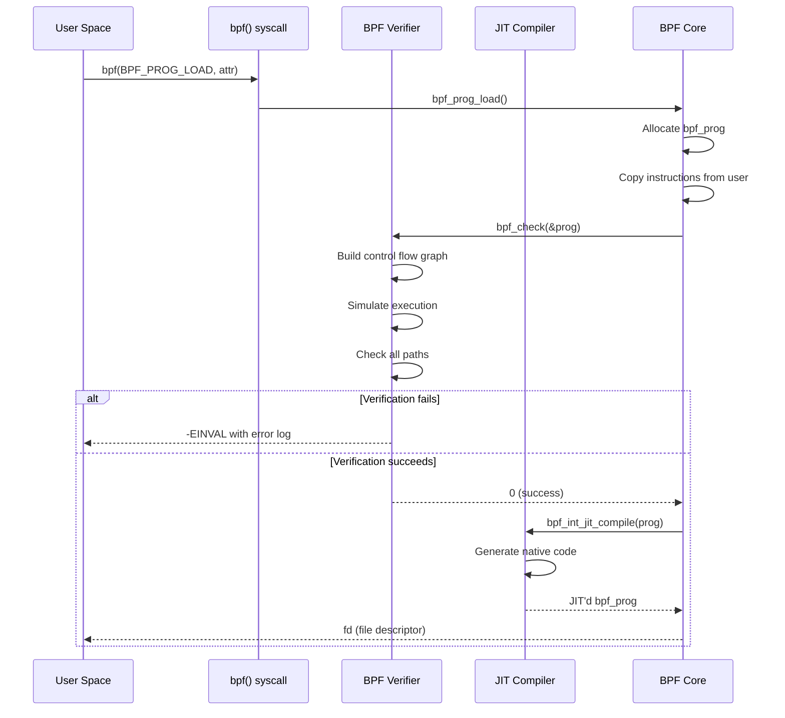

# Chapter 183: eBPF Architecture — Instruction Set, Registers, Stack, BPF Subsystem Overview

## 1. Introduction and Intuition

Extended Berkeley Packet Filter (eBPF) is one of the most transformative technologies to emerge in the Linux kernel over the past decade. What began as a simple packet filter mechanism (the classic BPF, now called cBPF) has evolved into a generic, in-kernel virtual machine that allows developers to run sandboxed programs safely inside the kernel without modifying kernel source code or loading kernel modules.

The intuition behind eBPF is elegant: rather than writing kernel modules (which can crash the kernel, are hard to maintain, and require recompilation for each kernel version), developers write small programs in a restricted C-like language that are compiled to eBPF bytecode. This bytecode is loaded into the kernel via the `bpf()` system call, where it is rigorously verified for safety before being JIT-compiled into native machine code and attached to a hook point (a kernel function, a network device, a tracepoint, etc.).

Think of eBPF as a **safe, programmable hook system** embedded deep in the kernel. It gives you the power to:

- Inspect and modify network packets at line rate (XDP)
- Trace any kernel function or user-space function (kprobes, uprobes)
- Enforce security policies (LSM hooks, Seccomp)
- Implement custom scheduling policies (sched_ext)
- Collect observability data (maps, perf events, ring buffers)

The architecture is designed around three key principles:

1. **Safety**: The verifier ensures programs cannot crash the kernel or access unauthorized memory
2. **Performance**: JIT compilation ensures near-native execution speed
3. **Programmability**: A rich instruction set and helper function library enable complex logic

## 2. Architecture Overview

### 2.1 From cBPF to eBPF

Classic BPF (cBPF) was designed in 1992 by Steven McCanne and Van Jacobson for packet filtering. It had:

- Two 32-bit registers (A and X)
- A scratch memory store (16 × 32-bit slots)
- A simple instruction set of ~20 instructions
- Used by `tcpdump`, `seccomp`, and socket filters

eBPF, introduced in Linux 3.18 (2014) by Alexei Starovoitov, dramatically expanded this:

- Ten 64-bit registers (R0–R9) plus frame pointer and stack pointer
- 512-byte stack
- A rich instruction set with ALU64, atomic operations, and 64-bit immediates
- A maps subsystem for persistent state
- Helper functions for kernel interaction
- A sophisticated verifier for safety

The kernel maintains backward compatibility: cBPF bytecode is transparently translated to eBPF before execution.

### 2.2 The eBPF Subsystem Components

The eBPF subsystem consists of several interconnected components:

```mermaid
graph TB
    subgraph User Space
        A[C/BPF Program] -->|llvm-bpf / clang| B[eBPF Bytecode .o]
        B -->|bpf() syscall| C[BPF_SYSCALL]
    end

    subgraph Kernel Space
        C --> D[BPF Verifier]
        D -->|reject| E[Error Log]
        D -->|accept| F[BPF JIT Compiler]
        F --> G[Native Machine Code]
        G --> H[Attach to Hook Point]

        subgraph Hook Points
            H1[kprobes/kretprobes]
            H2[tracepoints]
            H3[XDP / TC]
            H4[cgroup/sock_ops]
            H5[LSM hooks]
            H6[sched_ext]
            H7[uprobes]
        end

        H --> H1
        H --> H2
        H --> H3
        H --> H4
        H --> H5
        H --> H6
        H --> H7

        subgraph Maps Subsystem
            M1[Hash Map]
            M2[Array Map]
            M3[Ring Buffer]
            M4[Perf Event Array]
            M5[LRU Map]
            M6[Per-CPU Map]
        end

        G -->|read/write| Maps
    end
```

### 2.3 Program Types and Attach Points

eBPF programs are categorized by their type, which determines:

- Where they can be attached
- What helpers they can call
- What context structure they receive
- What return values mean

As of Linux 6.x, there are over 30 program types:

| Program Type | Attach Point | Use Case |
|---|---|---|
| `BPF_PROG_TYPE_SOCKET_FILTER` | Socket | Packet filtering |
| `BPF_PROG_TYPE_KPROBE` | kprobe | Kernel tracing |
| `BPF_PROG_TYPE_TRACEPOINT` | Tracepoint | Static tracing |
| `BPF_PROG_TYPE_XDP` | Network device | High-performance networking |
| `BPF_PROG_TYPE_SCHED_CLS` | TC ingress/egress | Traffic control |
| `BPF_PROG_TYPE_LSM` | LSM hooks | Security enforcement |
| `BPF_PROG_TYPE_STRUCT_OPS` | struct_ops | Scheduler, TCP, etc. |
| `BPF_PROG_TYPE_TRACING` | fentry/fexit | Modern tracing |
| `BPF_PROG_TYPE_SYSCALL` | Syscall entry | Syscall interception |

## 3. The eBPF Instruction Set Architecture

### 3.1 Registers

eBPF defines 12 registers in its virtual ISA:

| Register | Alias | Purpose | Preserved Across Calls |
|---|---|---|---|
| R0 | a | Return value, also used as hidden first argument for BPF-to-BPF calls | No |
| R1 | — | First argument to program / BPF-to-BPF call | No |
| R2–R5 | — | Arguments 2–5 | No |
| R6–R9 | — | Callee-saved registers | Yes |
| R10 | fp | Frame pointer (read-only) | — |
| R1–R5 | — | Scratch registers for helper calls | No |

All registers are 64 bits wide. The calling convention follows a simplified version of the x86-64 System V ABI:

- R1 holds the first argument (context pointer for BPF programs)
- R0 holds the return value
- R6–R9 are callee-saved (BPF-to-BPF subprograms must preserve them)
- R10 is the read-only frame pointer, pointing to the top of the stack

### 3.2 Instruction Encoding

Each eBPF instruction is exactly 8 bytes, with an optional 8-byte immediate extension for 64-bit constants (making some instructions 16 bytes):

```
┌─────────────────────────────────────────────────────────────┐
│                    Standard Instruction (8 bytes)            │
├────────┬────────┬────────┬──────────────────────────────────┤
│ opcode │dst_reg │src_reg │           offset (16-bit)        │
│ 8 bits │ 4 bits │ 4 bits │          signed 16-bit           │
├────────┴────────┴────────┴──────────────────────────────────┤
│                      immediate (32-bit)                      │
│                       signed 32-bit                          │
└─────────────────────────────────────────────────────────────┘

┌─────────────────────────────────────────────────────────────┐
│               Extended Immediate (8 bytes, optional)         │
├─────────────────────────────────────────────────────────────┤
│                 64-bit immediate value                       │
│                     (follows instruction)                    │
└─────────────────────────────────────────────────────────────┘
```

The opcode byte is further decomposed:

```
Bit 7:  source (0 = immediate, 1 = register)
Bit 6-4: instruction class
Bit 3-0: operation code

Instruction Classes:
  0x00 = LD    (load)
  0x01 = LDX   (load from memory)
  0x02 = ST    (store immediate)
  0x03 = STX   (store register)
  0x04 = ALU   (32-bit arithmetic)
  0x05 = JMP   (jump)
  0x06 = JMP32 (32-bit jump, introduced later)
  0x07 = ALU64 (64-bit arithmetic)
  0x08 = XADD  (atomic add, now deprecated in favor of ATOM class)
```

### 3.3 Instruction Categories

#### ALU Instructions

The ALU operations support both 32-bit and 64-bit variants:

```c
// 64-bit addition: R3 = R3 + R4
BPF_ALU64_REG(BPF_ADD, R3, R4)

// 32-bit subtraction (zero-extends to 64-bit):
// R2 = (u32)R2 - (u32)R1
BPF_ALU32_REG(BPF_SUB, R2, R1)

// 64-bit immediate multiply: R0 = R0 * 42
BPF_ALU64_IMM(BPF_MUL, R0, 42)

// Bitwise operations
BPF_ALU64_REG(BPF_AND, R6, R7)  // R6 &= R7
BPF_ALU64_REG(BPF_OR,  R6, R7)  // R6 |= R7
BPF_ALU64_REG(BPF_XOR, R6, R7)  // R6 ^= R7
BPF_ALU64_REG(BPF_LSH, R6, R7)  // R6 <<= R7
BPF_ALU64_REG(BPF_RSH, R6, R7)  // R6 >>= R7 (logical)
BPF_ALU64_REG(BPF_ARSH, R6, R7) // R6 >>= R7 (arithmetic)

// Byte swap operations
BPF_ALU64_IMM(BPF_TO_LE, R0, 32) // convert to little-endian 32-bit
BPF_ALU64_IMM(BPF_TO_BE, R0, 16) // convert to big-endian 16-bit
```

#### Memory Instructions

Load and store operations access memory:

```c
// Load 64-bit value from stack at offset -8 into R0
BPF_LDX_MEM(BPF_DW, BPF_REG_0, BPF_REG_FP, -8)

// Store R1 as 32-bit value at context offset 0
BPF_STX_MEM(BPF_W, BPF_REG_CTX, BPF_REG_1, 0)

// Store immediate value to stack
BPF_ST_MEM(BPF_DW, BPF_REG_FP, -16, 0)

// Size specifiers:
// BPF_B  = 1 byte
// BPF_H  = 2 bytes (half word)
// BPF_W  = 4 bytes (word)
// BPF_DW = 8 bytes (double word)
```

#### Jump and Branch Instructions

```c
// Unconditional jump: skip 5 instructions forward
BPF_JMP_IMM(BPF_JA, 0, 0, 5)

// Conditional: if R1 == 0, jump to label
BPF_JMP_IMM(BPF_JEQ, BPF_REG_1, 0, LABEL)

// Signed comparison: if R2 > -1, jump
BPF_JMP_IMM(BPF_JSGT, BPF_REG_2, -1, LABEL)

// 32-bit comparison (compares low 32 bits)
BPF_JMP32_IMM(BPF_JGT, BPF_REG_0, 100, LABEL)

// 64-bit register comparison
BPF_JMP_REG(BPF_JNE, BPF_REG_6, BPF_REG_7, LABEL)

// Call helper function
BPF_EMIT_CALL(bpf_map_lookup_elem)

// Exit program, return R0
BPF_EXIT_INSN()
```

#### Atomic Operations

eBPF supports atomic memory operations for concurrent access:

```c
// Atomic 64-bit add: *(u64 *)(R10 + offset) += R3
BPF_ATOMIC_OP(BPF_DW, BPF_ADD, R10, R3, offset)

// Atomic compare-and-exchange:
// old = *(u64 *)(R10 + offset);
// if (old == R3) *(u64 *)(R10 + offset) = R4;
// R0 = old;
BPF_ATOMIC_OP(BPF_DW, BPF_CMPXCHG, R10, R4, offset)

// Atomic fetch-and-add (returns old value)
BPF_ATOMIC_OP(BPF_DW, BPF_FETCH | BPF_ADD, R10, R3, offset)
```

### 3.4 Stack Frame Layout

Each eBPF program has a 512-byte stack. The stack grows downward from the frame pointer (R10):

```
R10 (frame pointer, read-only)
│
├─ offset 0     ┌──────────────────┐
│               │ Local variable 1 │
├─ offset -8    ├──────────────────┤
│               │ Local variable 2 │
├─ offset -16   ├──────────────────┤
│               │       ...        │
│               ├──────────────────┤
├─ offset -504  │ Padding/Spill    │
│               └──────────────────┘
R10 - 512

Stack slots are 8-byte aligned.
Bounded spill/fill of registers to stack is allowed.
Stack must be initialized before reading (zero-sized reads not allowed).
```

Programs may also "spill" registers to the stack (store callee-saved registers) and "fill" them back. The verifier tracks which stack slots are initialized.

### 3.5 BPF-to-BPF Calls

Since Linux 4.16, eBPF supports function calls within a program:

```c
// Define a subprogram
static __noinline u64 helper_function(u64 x)
{
    return x * 2 + 1;
}

SEC("xdp")
int my_xdp_prog(struct xdp_md *ctx)
{
    u64 val = helper_function(ctx->data_end - ctx->data);
    // ...
}
```

The compiler generates `BPF_CALL` instructions that:

1. Save callee-saved registers (R6–R9) on the stack
2. Set up R1–R5 as arguments
3. Transfer control to the subprogram
4. R0 receives the return value

The verifier checks each function independently and tracks the call graph for boundedness.

## 4. Kernel Implementation

### 4.1 Core Data Structures

The kernel represents eBPF programs and maps with several key structures:

```c
// From include/linux/bpf.h

struct bpf_prog {
    u16                 pages;      /* number of allocated pages */
    u16                 jited:1,    /* is JIT compiled? */
                        jit_requested:1,
                        gpl_compatible:1,
                        cb_access:1,
                        dst_needed:1,
                        blinded:1,
                        is_func:1,  /* is a BPF subprogram? */
                        kprobe_override:1;
    u32                 len;        /* number of instructions */
    u32                 jited_len;  /* JIT code size */
    struct bpf_prog_aux *aux;       /* auxiliary data */
    struct sock_fprog_kern *orig_prog; /* original cBPF if converted */
    /* JIT specific fields */
    unsigned int        (*bpf_func)(const void *ctx,
                                    const struct bpf_insn *insn);
    union {
        struct sock_filter insns[0]; /* cBPF instructions */
        struct bpf_insn insnsi[0];   /* eBPF instructions */
    };
};

struct bpf_map {
    const struct bpf_map_ops *ops;
    struct bpf_map *inner_map_meta;
    void *security;
    enum bpf_map_type map_type;
    u32 key_size;
    u32 value_size;
    u32 max_entries;
    u32 map_flags;
    char name[BPF_OBJ_NAME_LEN];
    /* ... */
    atomic64_t refcnt;
    atomic64_t usercnt;
    struct work_struct work;
    struct mutex freeze_mutex;
    u64 writecnt;
    /* per-CPU elements for per-CPU maps */
    /* ... */
};

struct bpf_prog_aux {
    u32 id;
    u32 func_cnt;          /* for multi-func programs */
    u32 func_idx;          /* subprogram index */
    u32 attach_btf_id;
    u32 ctx_arg_info_size;
    u32 max_rdonly_access;
    u32 max_rdwr_access;
    struct btf *btf;
    struct bpf_map **used_maps;
    struct bpf_prog *prog;
    struct user_struct *user;
    struct bpf_prog *dst_prog;
    /* ... */
};
```

### 4.2 The `bpf()` System Call

All eBPF operations go through a single system call:

```c
#include <linux/bpf.h>

int bpf(int cmd, union bpf_attr *attr, unsigned int size);
```

Key commands:

| Command | Purpose |
|---|---|
| `BPF_MAP_CREATE` | Create a new map |
| `BPF_MAP_LOOKUP_ELEM` | Look up a key in a map |
| `BPF_MAP_UPDATE_ELEM` | Update/insert a map entry |
| `BPF_MAP_DELETE_ELEM` | Delete a map entry |
| `BPF_MAP_GET_NEXT_KEY` | Iterate over map keys |
| `BPF_PROG_LOAD` | Load and verify a BPF program |
| `BPF_PROG_ATTACH` | Attach program to a hook |
| `BPF_PROG_DETACH` | Detach program from a hook |
| `BPF_PROG_RUN` | Test-run a program (used by `bpftool prog run`) |
| `BPF_OBJ_PIN` | Pin object to BPF filesystem |
| `BPF_OBJ_GET` | Get pinned object from BPF filesystem |
| `BPF_LINK_CREATE` | Create a BPF link (modern attachment) |
| `BPF_ENABLE_STATS` | Enable runtime statistics |

### 4.3 Program Loading Flow

When a user calls `bpf(BPF_PROG_LOAD, ...)`, the kernel performs:



### 4.4 JIT Compilation

The JIT compiler translates eBPF bytecode to native machine code. Linux supports JIT for multiple architectures:

- x86-64 (`arch/x86/net/bpf_jit_comp.c`)
- ARM64 (`arch/arm64/net/bpf_jit_comp.c`)
- RISC-V (`arch/riscv/net/bpf_jit_comp64.c`)
- s390x, MIPS, PowerPC, SPARC, etc.

The JIT replaces `prog->bpf_func` with a pointer to the generated native code. After JIT:

- eBPF instructions are no longer used for execution
- The JIT'd code is read-only
- `bpf_jit_enable` sysctl controls JIT behavior (0=off, 1=on, 2=debug)

## 5. BPF Program Lifecycle

### 5.1 From Source to Execution


### 5.2 BPF Filesystem

Objects (programs, maps, links) can be pinned to the BPF filesystem for persistence and sharing:

```bash
# Pin a program
bpftool prog pin id 42 /sys/fs/bpf/my_prog

# Pin a map
bpftool map pin id 7 /sys/fs/bpf/my_map

# Access from another process
bpftool prog show pinned /sys/fs/bpf/my_prog
```

The BPF filesystem is typically mounted at `/sys/fs/bpf`:

```bash
mount -t bpf bpf /sys/fs/bpf/
```

## 6. eBPF Instruction Set Details

### 6.1 Addressing Modes

eBPF supports several addressing modes for memory access:

```c
// Register + offset (base addressing)
BPF_LDX_MEM(BPF_DW, dst, base, offset)

// Context access (special: ctx[0] = first field)
BPF_LDX_MEM(BPF_W, dst, ctx, offsetof(struct xdp_md, data))

// Stack access via frame pointer
BPF_LDX_MEM(BPF_DW, dst, BPF_REG_FP, -8)

// Map value access (after lookup)
BPF_LDX_MEM(BPF_W, dst, map_value, field_offset)
```

### 6.2 Calling Convention for Helpers

Helper function calls follow this convention:

```c
// Before calling a helper:
R1 = first argument (often context or map pointer)
R2 = second argument
R3 = third argument
R4 = fourth argument
R5 = fifth argument

// Call instruction
BPF_EMIT_CALL(helper_id)

// After call:
R0 = return value
R1-R5 = clobbered (must reload if needed)
R6-R9 = preserved
```

The verifier validates that:

- The helper exists and is allowed for the program type
- Argument types match (map fd → map pointer, etc.)
- Return value type is used correctly

### 6.3 32-bit Subregister Tracking

To optimize JIT performance (especially on 32-bit and 64-bit architectures), the verifier tracks 32-bit subregisters separately. When a 32-bit ALU operation is performed:

```c
// R1 = (u32)R1 + (u32)R2  -- upper 32 bits zeroed
BPF_ALU32_REG(BPF_ADD, R1, R2)
```

The verifier marks R1 as having a known zero upper 32 bits, which:

- Eliminates zero-extension in JIT code on some architectures
- Enables better constant propagation
- Reduces register pressure in JIT

## 7. Performance Considerations

### 7.1 Instruction Count and Complexity

The verifier enforces several complexity limits:

| Limit | Default | Purpose |
|---|---|---|
| `BPF_COMPLEXITY_LIMIT_INSNS` | 1 million | Max instructions the verifier processes |
| `BPF_COMPLEXITY_LIMIT_STATES` | 64K | Max states explored |
| Max program size | ~4096 instructions | Before BPF-to-BPF calls |
| Max stack depth | 512 bytes | Stack frame size |
| Max nesting depth | 8 | BPF-to-BPF call depth |

With BPF-to-BPF calls, the total program size can be larger, but each function is verified independently and the total is bounded.

### 7.2 JIT Optimization

The JIT compiler performs several optimizations:

- **Constant folding**: Immediate values are folded into native instructions
- **Dead code elimination**: Unreachable branches are removed
- **Register allocation**: Maps virtual registers to physical registers
- **Tail call optimization**: Direct jumps instead of function calls
- **Subregister zero-extension**: Eliminated when verifier proves upper bits are zero

### 7.3 Tail Calls

Tail calls allow one BPF program to jump to another without returning:

```c
// In program A:
bpf_tail_call(ctx, &prog_array, index);
// If tail call succeeds, never reaches here
// If it fails (no program at index), continues
```

Tail calls are implemented as a direct jump in the JIT, avoiding the overhead of a full function call. The maximum tail call depth is 33 (configurable via `sysctl`).

## 8. Security Model

### 8.1 Safety Guarantees

The eBPF architecture provides several safety guarantees:

1. **Memory safety**: No arbitrary kernel memory access; all pointers are typed and bounds-checked
2. **Termination**: All programs must terminate (no infinite loops)
3. **No crashes**: Verified programs cannot cause kernel oops or panics
4. **Controlled side effects**: Only through registered helper functions
5. **Capability checks**: Loading requires `CAP_BPF` (Linux 5.8+) or `CAP_SYS_ADMIN`

### 8.2 Pointer Types

The verifier tracks pointer types meticulously:

| Pointer Type | What It Points To | Allowed Operations |
|---|---|---|
| `PTR_TO_CTX` | Program context | Field access via offset |
| `PTR_TO_MAP_KEY` | Map key buffer | Read only |
| `PTR_TO_MAP_VALUE` | Map value | Read/write fields |
| `PTR_TO_STACK` | Stack | Read/write within bounds |
| `PTR_TO_PACKET` | Network packet data | Read/write with bounds |
| `PTR_TO_PACKET_META` | Packet metadata | Read only |
| `PTR_TO_FLOW_KEYS` | Flow keys | Read/write |
| `PTR_TO_SOCKET` | Socket | Helper calls |
| `PTR_TO_SOCK_COMMON` | Common socket | Helper calls |
| `PTR_TO_TP_BUFFER` | Tracepoint buffer | Read only |
| `PTR_TO_BTF_ID` | BTF-described object | Field access via BTF |

## 9. Common Pitfalls

### 9.1 Verifier Rejection

The most common issue is program rejection by the verifier:

```
R1 unbounded memory access, use 'var &= const' or 'if' to limit
```

**Solution**: Always bound array indices and mask values:

```c
// Bad
int idx = bpf_get_prandom_u32();
val = array[idx % 16];  // verifier may not track this

// Good
int idx = bpf_get_prandom_u32() & 0xf;  // clearly bounded
val = array[idx];
```

### 9.2 Stack Overflow

The 512-byte stack is small:

```c
// Bad: large local array
char buf[4096];  // exceeds stack limit!

// Good: use per-CPU array map for large buffers
struct {
    __uint(type, BPF_MAP_TYPE_PERCPU_ARRAY);
    __uint(max_entries, 1);
    __type(key, u32);
    __type(value, char[4096]);
} buf_map SEC(".maps");
```

### 9.3 Uninitialized Memory

Reading uninitialized stack memory is rejected:

```c
// Bad
u64 x;
bpf_probe_read_kernel(&dst, sizeof(dst), &x);  // x not initialized!

// Good
u64 x = 0;
bpf_probe_read_kernel(&dst, sizeof(dst), &x);
```

### 9.4 Loop Complexity

Unbounded loops are rejected. Use bounded loops:

```c
// Bad (old kernels)
while (condition) { ... }

// Good (newer kernels, bounded)
#pragma unroll
for (int i = 0; i < 16; i++) { ... }

// Good (explicit bound with bpf_loop helper, Linux 5.17+)
bpf_loop(1024, my_callback_fn, NULL, 0);
```

## 10. Best Practices

1. **Start with libbpf and CO-RE**: Avoid BCC for production; use libbpf with Compile Once – Run Everywhere
2. **Use BTF-enabled maps**: Use `__type(key, ...)` and `__type(value, ...)` macros for type safety
3. **Keep programs small**: Smaller programs verify faster and are less likely to hit complexity limits
4. **Use BPF-to-BPF calls**: Factor logic into subprograms for reusability
5. **Prefer ring buffer over perf event array**: `BPF_MAP_TYPE_RINGBUF` is more efficient for event streaming
6. **Use fentry/fexit over kprobe/kretprobe**: Better performance and type safety via BTF
7. **Test with `bpftool prog run`**: Dry-run programs before attaching
8. **Read verifier logs**: `BPF_LOG_BUF_SIZE` should be large; parse the log carefully

## 11. Exercises

### Exercise 1: Write and Load a Minimal eBPF Program

Write a simple eBPF program that counts how many times a specific kernel function is called. Use libbpf to load it.

```c
// count_calls.bpf.c
#include <vmlinux.h>
#include <bpf/bpf_helpers.h>

struct {
    __uint(type, BPF_MAP_TYPE_ARRAY);
    __uint(max_entries, 1);
    __type(key, u32);
    __type(value, u64);
} call_count SEC(".maps");

SEC("fentry/do_sys_openat2")
int BPF_PROG(count_openat) {
    u32 key = 0;
    u64 *val = bpf_map_lookup_elem(&call_count, &key);
    if (val)
        __sync_fetch_and_add(val, 1);
    return 0;
}

char LICENSE[] SEC("license") = "GPL";
```

### Exercise 2: Explore eBPF Bytecode

Compile a simple program and inspect the bytecode:

```bash
clang -target bpf -O2 -g -c prog.bpf.c -o prog.o
llvm-objdump -d prog.o
bpftool btf dump file prog.o
```

### Exercise 3: Program Type Investigation

Using `bpftool`, list all loaded BPF programs on your system and identify their types:

```bash
bpftool prog list
bpftool prog show id <ID>
```

## 12. References

1. **eBPF Specification**: https://ebpf-docs.dylanreimerink.nl/
2. **Linux kernel source**: `kernel/bpf/verifier.c`, `kernel/bpf/core.c`
3. **Cilium eBPF documentation**: https://docs.cilium.io/en/latest/bpf/
4. **IOVisor BPF docs**: https://github.com/iovisor/bpf-docs/blob/master/eBPF.md
5. **Alexei Starovoitov's original patches**: https://lwn.net/Articles/599755/
6. **"BPF Performance Tools" by Brendan Gregg**: Addison-Wesley, 2019
7. **"Learning eBPF" by Liz Rice**: O'Reilly, 2023
8. **Kernel documentation**: `Documentation/bpf/` in the Linux source tree
9. **bpf.h header**: `include/uapi/linux/bpf.h` — the canonical instruction set reference
10. **JIT source**: `arch/x86/net/bpf_jit_comp.c` for x86-64 JIT implementation
