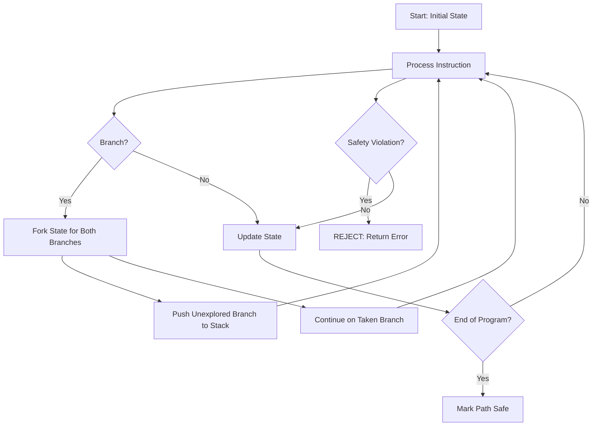

# Chapter 184: The eBPF Verifier — Verification Algorithm, State Pruning, Complexity Limits

## 1. Introduction and Intuition

The eBPF verifier is the gatekeeper of the entire eBPF ecosystem. It is a sophisticated static analysis engine that examines every possible execution path of a BPF program to ensure it is safe to run inside the kernel. Without the verifier, loading arbitrary code into the kernel would be as dangerous as loading kernel modules — potentially crashing the system, corrupting memory, or creating security vulnerabilities.

The intuition behind the verifier is that of a **proof checker**: given a program, the verifier attempts to construct a proof that, for all possible inputs, the program will:

1. **Terminate** — no infinite loops
2. **Not crash** — no null pointer dereferences, no out-of-bounds access
3. **Not corrupt memory** — only access authorized regions
4. **Use helpers correctly** — proper argument types, valid contexts

If the verifier cannot construct this proof, the program is rejected. The verifier is **conservative** — it may reject some safe programs, but it will never accept an unsafe one.

## 2. Verification Algorithm Overview

### 2.1 The Core Approach: Depth-First Search with State Tracking

The verifier uses a **depth-first search (DFS)** over the program's control flow graph (CFG). At each instruction, it maintains a `bpf_verifier_state` that describes the abstract state of all registers and stack slots.



### 2.2 State Representation

At each program point, the verifier tracks:

```c
struct bpf_reg_state {
    enum bpf_reg_type type;     /* PTR_TO_CTX, SCALAR_VALUE, etc. */
    s32 off;                     /* fixed offset from base */
    u32 id;                      /* unique ID for pointer identity */
    u32 ref_obj_id;              /* reference tracking */
    struct tnum var_off;         /* known bits (tri-state number) */
    s64 smin_value;              /* signed minimum */
    s64 smax_value;              /* signed maximum */
    u64 umin_value;              /* unsigned minimum */
    u64 umax_value;              /* unsigned maximum */
    struct bpf_reg_state *parent;
    /* ... */
};

struct bpf_stack_state {
    u8 spilled_ptr[BPF_REG_SIZE];  /* register spilled to stack */
    struct bpf_reg_state *slot_type[8]; /* type of each 8-byte slot */
    bool is_live;                    /* read before write? */
};

struct bpf_verifier_state {
    struct bpf_reg_state regs[MAX_BPF_REG];
    struct bpf_stack_state *stack;
    struct bpf_verifier_state *parent;
    /* ... */
};
```

The key insight is that the verifier tracks **abstract values** — not concrete values — but with enough precision to prove safety. For example, instead of tracking the exact value of a register, it tracks:

- **Scalar values**: ranges (min, max), known bits
- **Pointers**: type, offset from base, bounds

### 2.3 Tri-State Numbers (tnum)

A unique feature of the verifier is `tnum` — a tri-state number that tracks which bits of a value are known:

```c
struct tnum {
    u64 value;  /* known bit values */
    u64 mask;   /* known bit mask (1 = unknown, 0 = known) */
};
```

For example, if a register holds the result of `x & 0xff`:

- `value = 0x00` (the known part after masking)
- `mask = 0x00000000ffffff00` (the unknown bits)
- This means bits 8-63 are unknown, bits 0-7 are known to be 0

This is extremely useful for tracking array bounds:

```c
u32 idx = bpf_get_prandom_u32();
idx &= 0xf;  // now tnum says: value in [0, 15], all 4 bits known
val = array[idx];  // verifier can prove this is in bounds
```

## 3. Detailed Verification Process

### 3.1 Phase 1: Control Flow Graph Construction

The verifier first builds a CFG from the bytecode:

```c
// kernel/bpf/verifier.c

static int check_cfg(struct bpf_verifier_env *env)
{
    struct bpf_insn *insns = env->prog->insns;
    int insn_cnt = env->prog->len;
    int ret;

    // Mark all reachable instructions
    ret = push_insn(0, FIRST, env);
    // Follow branches, calls, and exits
    // Detect unreachable code
    // Detect back-edges (loops require explicit bounded iteration)
    // ...
}
```

Back-edges (looping back to a previous instruction) are detected and must be annotated with a known bound. The verifier rejects unbound loops:

```c
// Rejected:
for (int i = 0; i < bpf_get_prandom_u32(); i++) { ... }

// Accepted (bounded):
for (int i = 0; i < 16; i++) { ... }
```

### 3.2 Phase 2: Depth-First Exploration

The main verification loop processes instructions one by one:

```c
// Simplified from kernel/bpf/verifier.c

static int do_check(struct bpf_verifier_env *env)
{
    struct bpf_verifier_state *state;
    struct bpf_insn *insn;
    int insn_idx, prev_insn_idx = 0;

    // Create initial state
    state = push_stack(env, 0, -1, false);
    if (!state)
        return -EFAULT;

    // Set initial register state
    init_reg_state(env, state->regs);
    // R1 = PTR_TO_CTX (program context)
    // R10 = PTR_TO_STACK (frame pointer)
    // All others = NOT_INIT

    while (1) {
        // Get next instruction
        insn_idx = env->insn_idx;
        insn = &env->prog->insns[insn_idx];

        // Check if this state was already verified (state pruning)
        if (state_pruning(env, state))
            goto next;

        // Verify based on instruction class
        switch (insn->code) {
        case BPF_ALU64 | BPF_ADD | BPF_X:
            ret = check_alu_op(env, insn);
            break;
        case BPF_LDX | BPF_MEM | BPF_DW:
            ret = check_mem_access(env, insn_idx,
                                   insn->dst_reg, insn->off,
                                   BPF_SIZE(insn->code),
                                   BPF_READ, insn->src_reg, false);
            break;
        case BPF_JMP | BPF_CALL:
            ret = check_helper_call(env, insn, insn_idx);
            break;
        // ... all instruction types
        }

        if (ret)
            return ret;

        // Handle branches
        if (is_branch(insn)) {
            // Push fall-through state
            push_stack(env, insn_idx + 1, insn_idx, false);
            // Continue on taken branch
            env->insn_idx += insn->off;
        }

        // Advance
        env->insn_idx++;
    }
}
```

### 3.3 Phase 3: Register and Stack State Tracking

For each instruction, the verifier updates the abstract state:

#### ALU Operations

```c
static int check_alu_op(struct bpf_verifier_env *env, struct bpf_insn *insn)
{
    struct bpf_reg_state *regs = cur_regs(env);
    u8 opcode = BPF_OP(insn->code);

    if (opcode == BPF_ADD) {
        if (BPF_SRC(insn->code) == BPF_X) {
            // R_dst += R_src
            // If both are scalars: adjust min/max ranges
            // If one is a pointer, other must be scalar
            //   → adjust pointer offset
            if (is_pointer_reg(regs, insn->dst_reg) &&
                is_scalar_reg(regs, insn->src_reg)) {
                // pointer + scalar: check bounds
                regs[insn->dst_reg].off += insn->imm;
                // Verify resulting offset is within bounds
            }
        }
    }
    // Similar for SUB, MUL, DIV, etc.
}
```

#### Memory Access Verification

```c
static int check_mem_access(struct bpf_verifier_env *env, int insn_idx,
                            u32 regno, int off, int bpf_size,
                            enum bpf_access_type t, int value_regno,
                            bool is_ldsx)
{
    struct bpf_reg_state *regs = cur_regs(env);
    struct bpf_reg_state *reg = &regs[regno];

    switch (reg->type) {
    case PTR_TO_CTX:
        // Check field access against program type's context
        // Use BTF to verify field offset and size
        return check_ctx_access(env, insn_idx, off, bpf_size, t, reg);

    case PTR_TO_MAP_VALUE:
        // Check offset within map value bounds
        if (off + bpf_size > map->value_size)
            return -EACCES;
        break;

    case PTR_TO_STACK:
        // Stack access must be within [-512, -8]
        if (off < -512 || off + bpf_size > 0)
            return -EACCES;
        // Must be initialized before read
        if (t == BPF_READ && !stack_slot_is_initialized(env, off))
            return -EACCES;
        break;

    case PTR_TO_PACKET:
    case PTR_TO_PACKET_META:
        // Packet access must be within data/data_end bounds
        if (!may_access_direct_pkt_data(env, reg, t))
            return -EACCES;
        // Register as pkt access for runtime bounds check
        break;
    }
}
```

## 4. State Pruning

### 4.1 The Problem

Without state pruning, the verifier would explore the same instruction with exponentially many states (one for each combination of prior branch outcomes). For a program with N branches, that's 2^N paths — infeasible for realistic programs.

### 4.2 The Solution: Equivalent State Detection

State pruning works by detecting when two different paths arrive at the same instruction with **equivalent** states. If a state is "more conservative" (has stricter bounds) than a previously verified state at the same instruction, the current path can be safely pruned.

```c
// kernel/bpf/verifier.c

static bool states_equal(struct bpf_verifier_env *env,
                         struct bpf_verifier_state *old,
                         struct bpf_verifier_state *cur)
{
    // Compare all registers
    for (i = 0; i < MAX_BPF_REG; i++) {
        if (!regsafe(env, old->regs[i], cur->regs[i]))
            return false;
    }

    // Compare stack slots
    for (i = 0; i < MAX_BPF_STACK; i += BPF_REG_SIZE) {
        if (!stacksafe(env, old, cur, i))
            return false;
    }

    return true;
}

static bool regsafe(struct bpf_verifier_env *env,
                    struct bpf_reg_state *rold,
                    struct bpf_reg_state *rcur)
{
    // Same type?
    if (rold->type != rcur->type)
        return false;

    // For scalars: check if current range is within old range
    if (rold->type == SCALAR_VALUE) {
        if (rcur->smin_value < rold->smin_value ||
            rcur->smax_value > rold->smax_value)
            return false;
        // Also check tnum: current known bits must be subset
        if (!tnum_in(rold->var_off, rcur->var_off))
            return false;
    }

    // For pointers: check offset and id
    if (is_pointer_reg(rold)) {
        if (rold->off != rcur->off)
            return false;
        if (rold->id != rcur->id)
            return false;
    }

    return true;
}
```

### 4.3 How Pruning Works in Practice

Consider this program:

```c
int val;
if (condition_a)
    val = 1;
else
    val = 2;

if (val > 0) {  // both branches: val > 0
    // At this point, both paths converge with val in [1, 2]
    // The verifier explores the first path fully, then when
    // the second path reaches here, it prunes because the
    // state is equivalent
    use(val);
}
```

### 4.4 The `reg_state_mismatch` Counter

The verifier maintains statistics to help debug pruning effectiveness:

```bash
bpftool prog show id <ID>
# Output includes: verifier log showing states explored
```

If too many states are explored (hitting complexity limits), it may indicate:

- Overly complex control flow
- Missing state pruning opportunities
- Need for program restructuring

## 5. Complexity Limits

### 5.1 Instruction Processing Limit

The verifier processes a bounded number of instructions to prevent DoS:

```c
// include/linux/bpf_verifier.h
#define BPF_COMPLEXITY_LIMIT_INSNS  1000000

// This counts instruction visits, not unique instructions.
// Each time the verifier processes an instruction in a different
// state, it counts as one visit.
```

### 5.2 State Count Limit

```c
// Maximum number of distinct states
#define BPF_COMPLEXITY_LIMIT_STATES  64000
```

When the verifier exceeds this limit, it rejects the program with:

```
BPF program is too large. Processed 1000001 insn
```

### 5.3 Stack Depth Limit

```c
#define MAX_BPF_STACK  512
```

Each function in a BPF-to-BPF call chain has its own 512-byte frame. The total stack usage across all frames is bounded by the call depth (max 8 frames).

### 5.4 Call Depth Limit

```c
#define MAX_CALL_FRAMES  8
```

BPF-to-BPF calls can nest up to 8 levels deep. Tail calls reset the call stack.

### 5.5 Map Access Limit

The verifier limits the number of maps a program can reference to prevent excessive memory consumption.

## 6. Pointer Safety Checks

### 6.1 Pointer Arithmetic Rules

The verifier enforces strict rules for pointer arithmetic:

```c
// Allowed:
ptr = map_value;
ptr += constant_offset;  // offset must be within value_size
ptr += variable_offset;  // must be bounded

// NOT allowed:
ptr = map_value;
ptr -= some_other_pointer;  // no pointer subtraction
ptr = integer_as_pointer;   // no integer → pointer coercion (without special ops)
```

### 6.2 Null Pointer Checks

The verifier tracks null checks:

```c
val = bpf_map_lookup_elem(&map, &key);
if (val) {
    // Here: val is PTR_TO_MAP_VALUE (non-null)
    *val = 42;  // safe
} else {
    // Here: val is NULL
    // Any dereference would be rejected
}

// The verifier also tracks "speculative" null checks
// to prevent Spectre-style attacks
```

### 6.3 Reference Tracking

For some pointer types (sockets, task, etc.), the verifier tracks references:

```c
struct bpf_sock *sk = bpf_sk_lookup_tcp(ctx, &tuple, sizeof(tuple), 0, 0);
if (sk) {
    // sk has a reference (ref_obj_id > 0)
    // MUST be released before program exits
    bpf_sk_release(sk);
}
// Failure to release → verifier error: "Unreleased reference"
```

## 7. Bounds Tracking

### 7.1 Scalar Range Tracking

The verifier tracks minimum and maximum values for scalar registers:

```c
// After: R2 = bpf_get_prandom_u32()
// State: R2 ∈ [0, U32_MAX]

// After: R2 &= 0xff
// State: R2 ∈ [0, 255]

// After: if (R2 > 100) goto out;
// On fall-through: R2 ∈ [0, 100]
// On taken branch: R2 ∈ [101, 255]

// After: R3 = R2 + 1
// State: R3 ∈ [1, 101] (on fall-through)
```

### 7.2 Bounds Overflow Detection

```c
// If R1 ∈ [0, U64_MAX - 1] (full range minus 1)
// After: R1 += 1
// The verifier detects potential overflow:
// R1 ∈ [1, U64_MAX] → no overflow
// But if R1 ∈ [0, U64_MAX]:
// R1 += 1 could overflow → rejected or handled

// The verifier uses tnum to track known bits:
// After: R1 = bpf_get_prandom_u32()
// tnum: mask = 0xFFFFFFFF00000000 (upper 32 unknown)
// After: R1 &= 0xf
// tnum: mask = 0xFFFFFFFFFFFFFFF0 (only lower 4 bits unknown)
// value = 0, mask = 0xf → R1 ∈ [0, 15]
```

### 7.3 Signed vs Unsigned Bounds

The verifier tracks both signed and unsigned bounds separately:

```c
// R1 = -5 (signed: -5, unsigned: large positive)
// R2 = 10
// if (R1 > R2) → unsigned comparison: R1 > R2 (true)
// if (R1 s> R2) → signed comparison: R1 > R2 (false, -5 < 10)

// The verifier uses BPF_JSGT, BPF_JSGE, etc. to distinguish
```

## 8. BTF Integration

### 8.1 Type-Aware Verification

With BPF Type Format (BTF), the verifier performs type-aware checking:

```c
// For tracing programs:
SEC("fentry/tcp_sendmsg")
int BPF_PROG(trace_tcp_sendmsg, struct sock *sk, struct msghdr *msg, size_t size)
{
    // Verifier uses BTF to know:
    // - sk is a struct sock *
    // - sk->sk_family is at offset X, type u16
    // - Accessing sk->sk_family is allowed
    // - Accessing sk->some_future_field would fail

    u16 family = sk->sk_family;  // verified via BTF offset
    return 0;
}
```

### 8.2 BTF-Based Field Access Validation

```c
static int check_ctx_access(struct bpf_verifier_env *env, int insn_idx,
                            int off, int size, enum bpf_access_type t,
                            struct bpf_reg_state *reg)
{
    // For fentry/fexit programs, use BTF to validate
    if (prog_type == BPF_PROG_TYPE_TRACING) {
        struct btf *btf = vmlinux_btf;
        // Look up the type of the context argument
        // Verify that 'off' corresponds to a valid field
        // Verify that 'size' matches the field size
        return btf_struct_access(env, btf, type_id, off, size);
    }
}
```

## 9. Security Implications

### 9.1 Spectre Mitigation

The verifier includes specific mitigations against Spectre v1 attacks:

```c
// Speculative execution could cause out-of-bounds access
// even after bounds check. The verifier inserts
// speculation barriers:

// Original code:
val = bpf_map_lookup_elem(&map, &key);
if (key < MAX_ENTRIES) {
    // Use val[key] — but speculative execution might
    // use a different key value
}

// Verifier adds:
// speculation_barrier() before the bounds check
// array_index_nospec() to clamp the index
```

### 9.2 Poisoning Uninitialized Memory

The verifier ensures uninitialized stack slots cannot be leaked:

```c
// Bad:
u64 secret;
bpf_probe_read_kernel(&secret, sizeof(secret), some_ptr);
// Stack slot is now "initialized" with secret data

// If we spill to stack and later fill from a different
// register, the verifier tracks that the slot now has
// a different value. No information leakage possible.
```

### 9.3 Reference Leak Prevention

The verifier tracks resource references and ensures they are properly released:

```c
struct bpf_sock *sk = bpf_sock_lookup(...);
// sk now has a reference

// MUST call bpf_sk_release(sk) before returning
// Verifier error if not: "Unreleased reference id=X"

// This prevents resource exhaustion attacks
```

## 10. Common Pitfalls

### 10.1 "R0 invalid mem access"

This usually means a pointer was used without a null check:

```c
val = bpf_map_lookup_elem(&map, &key);
*val = 42;  // ERROR: val might be NULL

// Fix:
val = bpf_map_lookup_elem(&map, &key);
if (!val)
    return 0;
*val = 42;  // OK: null-checked
```

### 10.2 "math between map_value pointer and register with unbounded min value"

The verifier cannot bound the index:

```c
// Bad
u32 idx = get_some_value();
val = array[idx % 64];  // verifier may not trust %

// Good
u32 idx = get_some_value() & 63;  // clearly bounded to [0, 63]
val = array[idx];
```

### 10.3 "back-edge from insn X to Y"

Unbounded loops are rejected:

```c
// Bad
while (running) { ... }

// Good (bounded)
#pragma unroll
for (int i = 0; i < 16; i++) { ... }

// Good (bpf_loop helper)
static int callback(void *ctx, int index) { ... }
bpf_loop(1000, callback, NULL, 0);
```

### 10.4 "program too complex"

The verifier gave up due to too many states:

```solutions:
1. Simplify control flow
2. Reduce the number of branches
3. Use __always_inline to eliminate function call overhead
4. Split into multiple programs connected via tail calls
5. Use maps to pass state between simpler programs
```

## 11. Best Practices

1. **Compile with `-O2` and `-g`**: Optimization helps the compiler generate simpler bytecode; `-g` enables BTF for better verifier messages
2. **Read the full verifier log**: Set `log_buf` and `log_size` in `bpf_attr` when loading programs
3. **Use `bpftool prog load` with `-d`**: See the full verification trace
4. **Bound all variables**: Use `& (N-1)` for power-of-2 bounds instead of `% N`
5. **Minimize branches**: Each branch doubles the state space
6. **Use `__always_inline` for hot helpers**: Reduces call overhead and verifier complexity
7. **Test incrementally**: Add complexity gradually, verifying at each step
8. **Use `bpftool prog profile`**: Check verifier statistics after loading

## 12. Exercises

### Exercise 1: Verifier Log Analysis

Load a BPF program and analyze the verifier log:

```bash
# Enable verbose verifier logging
bpftool prog load prog.o /sys/fs/bpf/prog type xdp \
    log_level 2 log_buf /tmp/verifier.log log_size 65536

# Analyze the log
cat /tmp/verifier.log | grep -E "processed|states"
```

### Exercise 2: Trigger Verifier Rejection

Write a program that triggers various verifier errors and understand each:

1. Unbounded loop
2. Unchecked null pointer
3. Out-of-bounds stack access
4. Unbounded array index

### Exercise 3: Bounds Analysis

Write a program that exercises the verifier's bounds tracking:

```c
SEC("xdp")
int bounds_test(struct xdp_md *ctx)
{
    u32 idx = bpf_get_prandom_u32();
    // Exercise: make this pass the verifier
    // idx must be bounded to access a 16-element array
    // Try different approaches: &, %, conditional check
}
```

## 13. References

1. **Linux kernel source**: `kernel/bpf/verifier.c` — the full verifier implementation
2. **"Understanding the Linux BPF Verifier" by Yonghong Song**: LPC 2018
3. **eBPF verifier documentation**: `Documentation/bpf/verifier.rst`
4. **"BPF Verifier Design" by Alexei Starovoitov**: https://lwn.net/Articles/747519/
5. **Cilium documentation on verifier**: https://docs.cilium.io/en/latest/bpf/verifier/
6. **"Spectre mitigations in the eBPF verifier"**: https://lore.kernel.org/bpf/
7. **Kernel selftests**: `tools/testing/selftests/bpf/verifier/`
8. **tnum documentation**: `kernel/bpf/tnum.c` and `include/linux/tnum.h`
9. **"State Pruning in the BPF Verifier" by Daniel Borkmann**: LPC 2019
10. **Verifier complexity analysis**: `Documentation/bpf/verifier.rst` section on complexity
