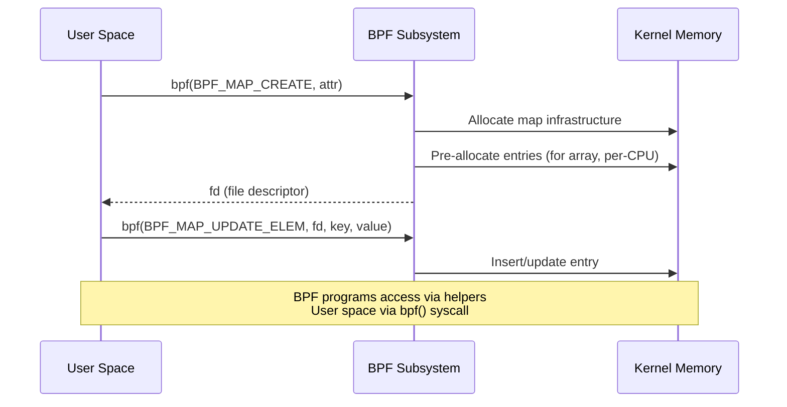

# Chapter 185: eBPF Maps — Hash, Array, Ringbuf, Perf Event Array, LRU, Per-CPU Maps

## 1. Introduction and Intuition

eBPF maps are the primary mechanism for **persistent state** in eBPF programs. Since BPF programs themselves are stateless (each invocation starts fresh), maps provide the memory that persists across invocations, enables communication between BPF programs and user space, and allows data sharing between concurrent BPF program executions.

Think of maps as **in-kernel data structures** that are:

1. **Accessible from BPF programs** via helper functions (`bpf_map_lookup_elem`, `bpf_map_update_elem`, etc.)
2. **Accessible from user space** via the `bpf()` system call
3. **Type-safe** with BTF (BPF Type Format) describing key and value layouts
4. **Concurrency-safe** with internal locking (per-CPU maps avoid contention entirely)

Maps are the backbone of every non-trivial BPF application — from packet counters to connection tracking tables to event streams.

## 2. Map Architecture

### 2.1 Map Creation and Lifecycle

Maps are created via `bpf(BPF_MAP_CREATE)` and referenced by file descriptor:



### 2.2 Core Map Data Structure

```c
// include/linux/bpf.h
struct bpf_map {
    const struct bpf_map_ops *ops;  /* type-specific operations */
    enum bpf_map_type map_type;
    u32 key_size;
    u32 value_size;
    u32 max_entries;
    u32 map_flags;
    char name[BPF_OBJ_NAME_LEN];    /* human-readable name */
    
    /* Runtime fields */
    atomic64_t refcnt;
    atomic64_t usercnt;
    struct work_struct work;
    struct mutex freeze_mutex;       /* for map freezing */
    u64 writecnt;                    /* write operations count */
    bool frozen;                     /* immutable after freeze */
    
    /* ... additional fields for specific map types */
};
```

### 2.3 Map Operations Interface

Each map type implements a common interface:

```c
struct bpf_map_ops {
    /* Map lifecycle */
    struct bpf_map *(*map_alloc)(union bpf_attr *attr);
    void (*map_free)(struct bpf_map *map);
    void (*map_release)(struct bpf_map *map, struct file *map_file);
    
    /* Element operations */
    void *(*map_lookup_elem)(struct bpf_map *map, void *key);
    int (*map_update_elem)(struct bpf_map *map, void *key, void *value, u64 flags);
    int (*map_delete_elem)(struct bpf_map *map, void *key);
    int (*map_get_next_key)(struct bpf_map *map, void *key, void *next_key);
    
    /* Value operations */
    void *(*map_lookup_elem_sys_only)(struct bpf_map *map, void *key);
    
    /* Batch operations (Linux 5.6+) */
    int (*map_lookup_batch)(struct bpf_map *map, ...);
    int (*map_update_batch)(struct bpf_map *map, ...);
    int (*map_delete_batch)(struct bpf_map *map, ...);
    
    /* Memory management */
    int (*map_gen_lookup)(struct bpf_map *map, struct bpf_insn *insn_buf);
    
    /* Map-specific operations */
    /* ... */
};
```

## 3. Hash Maps

### 3.1 BPF_MAP_TYPE_HASH

The hash map is the most versatile map type, providing O(1) average-case lookup, insert, and delete:

```c
// Define a hash map
struct {
    __uint(type, BPF_MAP_TYPE_HASH);
    __uint(max_entries, 10240);
    __type(key, u32);
    __type(value, u64);
} packet_count SEC(".maps");

// Usage in BPF program
SEC("xdp")
int count_packets(struct xdp_md *ctx)
{
    u32 key = ctx->ingress_ifindex;
    u64 *val, init_val = 1;

    val = bpf_map_lookup_elem(&packet_count, &key);
    if (val) {
        __sync_fetch_and_add(val, 1);
    } else {
        bpf_map_update_elem(&packet_count, &key, &init_val, BPF_NOEXIST);
    }
    return XDP_PASS;
}
```

### 3.2 Internal Implementation

The kernel hash map uses a **pre-allocated hash table** with separate chaining:

```c
// kernel/bpf/hashtab.c

struct bpf_htab {
    struct bpf_map map;
    struct bpf_htab_bucket *buckets;  /* hash table buckets */
    void *elems;                       /* pre-allocated element array */
    atomic_t count;                    /* current element count */
    u32 n_buckets;                     /* number of buckets */
    u32 elem_size;                     /* size of each element */
    struct pcpu_freelist freelist;     /* per-CPU free list */
    /* ... */
};

struct bpf_htab_bucket {
    struct hlist_nulls_head head;     /* collision chain */
    raw_spinlock_t lock;              /* per-bucket lock */
};

struct htab_elem {
    union {
        struct hlist_nulls_node hash_node;  /* hash chain */
        struct pcpu_freelist_node fnode;    /* free list */
    };
    union {
        struct rcu_head rcu;
        struct work_struct work;
    };
    u32 hash;                         /* cached hash value */
    char key[] __aligned(8);          /* flexible array: key + value */
};
```

### 3.3 Locking Strategy

Hash maps use **per-bucket spinlocks** for concurrent access:

```c
static long htab_map_update_elem(struct bpf_map *map, void *key,
                                  void *value, u64 map_flags)
{
    struct bpf_htab *htab = container_of(map, struct bpf_htab, map);
    struct htab_elem *l_new, *l_old;
    struct hlist_nulls_head *head;
    unsigned long flags;
    u32 hash, bucket;

    hash = htab_map_hash(key, key_size);
    bucket = hash & (htab->n_buckets - 1);
    head = &htab->buckets[bucket].head;

    /* Allocate new element */
    l_new = prealloc_lru_pop(htab, key);
    
    /* Copy key and value */
    memcpy(l_new->key, key, key_size);
    memcpy(l_new->key + round_up(key_size, 8), value, value_size);

    /* Lock bucket and update */
    raw_spin_lock_irqsave(&htab->buckets[bucket].lock, flags);
    
    l_old = lookup_elem_raw(head, hash, key, key_size);
    if (l_old && (map_flags & BPF_NOEXIST)) {
        raw_spin_unlock_irqrestore(&htab->buckets[bucket].lock, flags);
        return -EEXIST;
    }
    
    if (l_old) {
        hlist_nulls_del_rcu(&l_old->hash_node);
    }
    hlist_nulls_add_head_rcu(&l_new->hash_node, head);
    
    raw_spin_unlock_irqrestore(&htab->buckets[bucket].lock, flags);
    return 0;
}
```

### 3.4 BPF_MAP_TYPE_LRU_HASH

The LRU (Least Recently Used) hash map automatically evicts old entries when full:

```c
struct {
    __uint(type, BPF_MAP_TYPE_LRU_HASH);
    __uint(max_entries, 10000);
    __type(key, struct flow_key);
    __type(value, struct flow_stats);
} flow_table SEC(".maps");
```

The kernel maintains an LRU list per-CPU to minimize contention:

```c
// kernel/bpf/hashtab.c

struct bpf_lru {
    union {
        struct bpf_lru_list  lru_list;   /* global LRU */
        struct bpf_lru_locallist *local_list; /* per-CPU local */
    };
    /* ... */
};
```

Eviction strategy:
1. Try to reuse from local free list
2. Try local LRU list (same CPU, no locking)
3. Steal from other CPUs' local lists (requires spinlock)

### 3.5 BPF_MAP_TYPE_LRU_PERCPU_HASH

Per-CPU LRU hash maps combine per-CPU values with LRU eviction:

```c
struct {
    __uint(type, BPF_MAP_TYPE_LRU_PERCPU_HASH);
    __uint(max_entries, 5000);
    __type(key, u32);
    __type(value, struct percpu_stats);
} percpu_flow SEC(".maps");
```

## 4. Array Maps

### 4.1 BPF_MAP_TYPE_ARRAY

Array maps provide O(1) access by integer index:

```c
struct {
    __uint(type, BPF_MAP_TYPE_ARRAY);
    __uint(max_entries, 256);
    __type(key, u32);
    __type(value, u64);
} histogram SEC(".maps");

SEC("tracepoint/syscalls/sys_enter_read")
int trace_read(struct trace_event_raw_sys_enter *ctx)
{
    u32 slot = bpf_log2l(ctx->args[2]);  /* log2 of size */
    if (slot >= 256)
        slot = 255;
    
    u64 *val = bpf_map_lookup_elem(&histogram, &slot);
    if (val)
        __sync_fetch_and_add(val, 1);
    return 0;
}
```

### 4.2 Implementation

Array maps are pre-allocated contiguous memory:

```c
// kernel/bpf/arraymap.c

struct bpf_array {
    struct bpf_map map;
    u32 elem_size;           /* value_size rounded up to alignment */
    u32 index_mask;          /* for power-of-2 arrays */
    struct bpf_spin_lock_ua *lock;  /* for BPF_F_LOCK */
    /* Per-CPU arrays store per-CPU values inline */
    char value[] __aligned(8);  /* flexible array of values */
};
```

Key characteristics:

- **No allocation on update**: values are pre-allocated at creation
- **O(1) access**: `value = base + index * elem_size`
- **Bounds checking**: verifier ensures index < max_entries
- **No deletion**: array elements cannot be deleted (only zeroed)

### 4.3 BPF_MAP_TYPE_PERCPU_ARRAY

Per-CPU arrays eliminate contention by giving each CPU its own copy:

```c
struct {
    __uint(type, BPF_MAP_TYPE_PERCPU_ARRAY);
    __uint(max_entries, 1);
    __type(key, u32);
    __type(value, u64);
} pkt_count SEC(".maps");

SEC("xdp")
int xdp_counter(struct xdp_md *ctx)
{
    u32 key = 0;
    u64 *val = bpf_map_lookup_elem(&pkt_count, &key);
    if (val)
        (*val)++;  /* No atomic needed — each CPU has its own */
    return XDP_PASS;
}

/* User space reads sum across all CPUs */
```

Access pattern:
```c
/* Calculate per-CPU offset */
offset = cpu * round_up(map->value_size, 8);
value = array->value + offset;
```

## 5. Ring Buffer

### 5.1 BPF_MAP_TYPE_RINGBUF

The ring buffer (introduced in Linux 5.8) is the most efficient mechanism for streaming events from BPF programs to user space:

```c
struct {
    __uint(type, BPF_MAP_TYPE_RINGBUF);
    __uint(max_entries, 256 * 1024);  /* 256 KB */
} events SEC(".maps");

struct event {
    u32 pid;
    u32 uid;
    char comm[16];
    char filename[256];
};

SEC("tracepoint/syscalls/sys_enter_execve")
int trace_execve(struct trace_event_raw_sys_enter *ctx)
{
    struct event *e;
    
    e = bpf_ringbuf_reserve(&events, sizeof(*e), 0);
    if (!e)
        return 0;
    
    e->pid = bpf_get_current_pid_tgid() >> 32;
    e->uid = bpf_get_current_uid_gid();
    bpf_get_current_comm(&e->comm, sizeof(e->comm));
    bpf_probe_read_user_str(&e->filename, sizeof(e->filename),
                            (void *)ctx->args[0]);
    
    bpf_ringbuf_submit(e, 0);
    return 0;
}
```

### 5.2 Architecture

The ring buffer uses a **single shared buffer** with per-producer reservation:

```
┌─────────────────────────────────────────────────────┐
│                   Ring Buffer Header                 │
│  ┌─────────────┐  ┌──────────────┐  ┌────────────┐ │
│  │ consumer_pos│  │ producer_pos │  │  flags     │ │
│  └─────────────┘  └──────────────┘  └────────────┘ │
├─────────────────────────────────────────────────────┤
│                                                     │
│  ┌──────┐ ┌──────┐ ┌──────┐ ┌──────┐ ┌──────┐    │
│  │Event1│ │Event2│ │Event3│ │      │ │      │    │
│  │ hdr  │ │ hdr  │ │ hdr  │ │      │ │      │    │
│  │ data │ │ data │ │ data │ │      │ │      │    │
│  └──────┘ └──────┘ └──────┘ └──────┘ └──────┘    │
│                                                     │
│  consumer_pos ──────────────► producer_pos          │
│                                                     │
└─────────────────────────────────────────────────────┘
```

### 5.3 Reservation API

The ring buffer uses a **reserve/commit** pattern:

```c
/* Step 1: Reserve space */
struct event *e = bpf_ringbuf_reserve(&events, sizeof(*e), 0);

/* Step 2: Fill data */
e->pid = pid;
e->ts = bpf_ktime_get_ns();

/* Step 3: Commit (makes visible to consumer) */
bpf_ringbuf_submit(e, 0);

/* Alternative: Discard reservation */
bpf_ringbuf_discard(e, 0);
```

### 5.4 Kernel Implementation

```c
// kernel/bpf/ringbuf.c

struct bpf_ringbuf {
    char *data;                  /* ring buffer data area */
    struct bpf_ringbuf_map *map; /* back-pointer to map */
    spinlock_t spinlock ____cacheline_aligned;
    unsigned long consumer_pos ____cacheline_aligned;
    unsigned long producer_pos ____cacheline_aligned;
    /* ... */
};

/* Reserve: atomic increment of producer_pos */
static void *__bpf_ringbuf_reserve(struct bpf_ringbuf *rb, u64 size)
{
    unsigned long cons_pos, prod_pos, new_prod_pos;
    struct bpf_ringbuf_hdr *hdr;
    u32 len, pg_off;

    len = round_up(size + BPF_RINGBUF_HDR_SIZE, BPF_RINGBUF_HDR_SIZE);
    
    do {
        cons_pos = smp_load_acquire(&rb->consumer_pos);
        prod_pos = rb->producer_pos;
        new_prod_pos = prod_pos + len;
        
        /* Check for overflow (cons_pos wraps around) */
        if (new_prod_pos - cons_pos > rb->mask + 1)
            return NULL;  /* buffer full */
    } while (cmpxchg(&rb->producer_pos, prod_pos, new_prod_pos) != prod_pos);
    
    /* Write header with pending flag */
    hdr = (void *)rb->data + (prod_pos & rb->mask);
    hdr->len = size | BPF_RINGBUF_BUSY_BIT;
    hdr->pg_off = pg_off;
    
    return (void *)hdr + BPF_RINGBUF_HDR_SIZE;
}
```

### 5.5 vs Perf Event Array

| Feature | Ring Buffer | Perf Event Array |
|---|---|---|
| Memory | Single shared buffer | Per-CPU buffers |
| Ordering | Global ordering | Per-CPU ordering |
| Reservation | Yes (reserve/commit) | No |
| Efficiency | Higher (less memory, better cache) | Lower (per-CPU buffers waste memory) |
| Use case | Event streaming | High-frequency per-CPU events |
| Kernel version | 5.8+ | 3.x+ |

## 6. Perf Event Array

### 6.1 BPF_MAP_TYPE_PERF_EVENT_ARRAY

The perf event array was the original mechanism for streaming events:

```c
struct {
    __uint(type, BPF_MAP_TYPE_PERF_EVENT_ARRAY);
    __uint(key_size, sizeof(u32));
    __uint(value_size, sizeof(u32));
} events SEC(".maps");

SEC("kprobe/__x64_sys_write")
int BPF_KPROBE(sys_write, unsigned int fd, const char *buf, size_t count)
{
    struct data_t {
        u32 pid;
        u64 ts;
        size_t count;
    } data = {};

    data.pid = bpf_get_current_pid_tgid() >> 32;
    data.ts = bpf_ktime_get_ns();
    data.count = count;

    bpf_perf_event_output(ctx, &events, BPF_F_CURRENT_CPU,
                           &data, sizeof(data));
    return 0;
}
```

### 6.2 Per-CPU Buffer Architecture

```
CPU 0: ┌──────────────────────┐
       │  Perf Ring Buffer 0  │──► perf_reader_0
       └──────────────────────┘

CPU 1: ┌──────────────────────┐
       │  Perf Ring Buffer 1  │──► perf_reader_1
       └──────────────────────┘

CPU 2: ┌──────────────────────┐
       │  Perf Ring Buffer 2  │──► perf_reader_2
       └──────────────────────┘
```

Each CPU has its own perf ring buffer. User space must read from all CPU buffers and merge/sort events by timestamp.

## 7. Special-Purpose Maps

### 7.1 BPF_MAP_TYPE_PROG_ARRAY

Used for tail calls between BPF programs:

```c
struct {
    __uint(type, BPF_MAP_TYPE_PROG_ARRAY);
    __uint(max_entries, 256);
    __type(key, u32);
    __type(value, u32);
} prog_array SEC(".maps");

/* Main dispatcher */
SEC("xdp")
int dispatcher(struct xdp_md *ctx)
{
    u32 key = parse_protocol(ctx);
    bpf_tail_call(ctx, &prog_array, key);
    return XDP_PASS;  /* fallback if no program at key */
}
```

### 7.2 BPF_MAP_TYPE_DEVMAP

Maps for redirecting packets between network devices:

```c
struct {
    __uint(type, BPF_MAP_TYPE_DEVMAP);
    __uint(max_entries, 64);
    __type(key, u32);
    __type(value, u32);
} tx_port SEC(".maps");

SEC("xdp")
int xdp_redirect(struct xdp_md *ctx)
{
    u32 key = 0;
    return bpf_redirect_map(&tx_port, key, 0);
}
```

### 7.3 BPF_MAP_TYPE_SOCKMAP / BPF_MAP_TYPE_SOCKHASH

Maps for socket redirection and policy:

```c
struct {
    __uint(type, BPF_MAP_TYPE_SOCKMAP);
    __uint(max_entries, 65535);
    __type(key, u32);
    __type(value, u32);
} sock_map SEC(".maps");

SEC("sk_skb/stream_verdict")
int bpf_prog_verdict(struct __sk_buff *skb)
{
    u32 key = 0;
    return bpf_sk_redirect_map(skb, &sock_map, key, 0);
}
```

### 7.4 BPF_MAP_TYPE_CPUMAP

Redirects XDP packets to CPUs for processing by the normal network stack:

```c
struct {
    __uint(type, BPF_MAP_TYPE_CPUMAP);
    __uint(max_entries, 8);
    __type(key, u32);
    __type(value, struct bpf_cpumap_val);
} cpu_map SEC(".maps");

SEC("xdp")
int xdp_lb(struct xdp_md *ctx)
{
    u32 cpu = bpf_get_smp_processor_id();
    cpu = (cpu + 1) % 8;  /* round-robin to next CPU */
    return bpf_redirect_map(&cpu_map, cpu, 0);
}
```

### 7.5 BPF_MAP_TYPE_ARRAY_OF_MAPS / BPF_MAP_TYPE_HASH_OF_MAPS

Maps containing other maps (map-in-map):

```c
/* Inner map definition */
struct inner_map_t {
    __uint(type, BPF_MAP_TYPE_HASH);
    __uint(max_entries, 100);
    __type(key, u32);
    __type(value, u64);
};

/* Outer map containing inner maps */
struct {
    __uint(type, BPF_MAP_TYPE_ARRAY_OF_MAPS);
    __uint(max_entries, 16);
    __type(key, u32);
    __array(values, struct inner_map_t);
} outer_map SEC(".maps") = {
    .values = { &inner_map },
};
```

## 8. Map Operations from User Space

### 8.1 Basic Operations via libbpf

```c
#include <bpf/libbpf.h>

/* Look up a value */
u32 key = 42;
u64 value;
int fd = bpf_map__fd(map);

int err = bpf_map_lookup_elem(fd, &key, &value);
if (err == 0) {
    printf("Value: %lu\n", value);
} else if (errno == ENOENT) {
    printf("Key not found\n");
}

/* Update a value */
value = 100;
err = bpf_map_update_elem(fd, &key, &value, BPF_ANY);

/* Delete a key */
err = bpf_map_delete_elem(fd, &key);

/* Iterate over all keys */
u32 next_key;
key = 0;
while (bpf_map_get_next_key(fd, &key, &next_key) == 0) {
    bpf_map_lookup_elem(fd, &next_key, &value);
    printf("Key: %u, Value: %lu\n", next_key, value);
    key = next_key;
}
```

### 8.2 Batch Operations (Linux 5.6+)

```c
u32 keys[16];
u64 values[16];
u32 count = 16;
u32 next_key;

/* Batch lookup */
err = bpf_map_lookup_batch(fd, NULL, &next_key, keys, values, &count, NULL);

/* Batch update */
err = bpf_map_update_batch(fd, keys, values, &count, NULL);

/* Batch delete */
err = bpf_map_delete_batch(fd, keys, &count, NULL);
```

### 8.3 Ring Buffer Consumer

```c
#include <bpf/libbpf.h>

static int handle_event(void *ctx, void *data, size_t data_sz)
{
    struct event *e = data;
    printf("PID: %d, Comm: %s\n", e->pid, e->comm);
    return 0;
}

int main(void)
{
    struct ring_buffer *rb;
    int map_fd = bpf_map__fd(events_map);

    rb = ring_buffer__new(map_fd, handle_event, NULL, NULL);
    
    while (1) {
        ring_buffer__poll(rb, 1000 /* timeout ms */);
    }
    
    ring_buffer__free(rb);
    return 0;
}
```

## 9. Map Features

### 9.1 Map Freezing

Maps can be frozen to make them read-only:

```c
/* Freeze map — no more updates allowed */
bpf_map_freeze(fd);

/* In BPF code, updates to frozen maps return -EPERM */
```

### 9.2 BPF_F_LOCK

The `BPF_F_LOCK` flag allows atomic compound updates:

```c
/* Update with spin lock held (for bpf_spin_lock in value) */
bpf_map_update_elem(&map, &key, &value, BPF_F_LOCK);
```

### 9.3 BPF Map Iterators

The BPF iterator subsystem allows iterating over map elements from a BPF program:

```c
SEC("iter/bpf_map")
int dump_map(struct bpf_iter__bpf_map *ctx)
{
    struct seq_file *seq = ctx->meta->seq;
    struct bpf_map *map = ctx->map;
    
    if (!map)
        return 0;
    
    BPF_SEQ_PRINTF(seq, "%s: type=%d entries=%d\n",
                    map->name, map->map_type, map->max_entries);
    return 0;
}
```

## 10. Performance Considerations

### 10.1 Map Selection Guide

| Use Case | Best Map Type | Why |
|---|---|---|
| Counters | Per-CPU array | No atomics needed |
| Event streaming | Ring buffer | Reserve/commit, single buffer |
| Connection tracking | LRU hash | Auto-eviction |
| Packet classification | Hash | O(1) lookup |
| Histograms | Array | Pre-allocated, fast |
| Per-CPU statistics | Per-CPU array/hash | No contention |
| Tail call dispatch | Prog array | Direct jump |
| Socket policy | Sockmap/sockhash | Kernel-native |

### 10.2 Memory Overhead

Each map type has different memory characteristics:

- **Array**: `max_entries * value_size` (pre-allocated)
- **Hash**: `n_buckets * sizeof(bucket) + max_entries * (key_size + value_size + overhead)`
- **Ring buffer**: `max_entries` (the ring buffer size itself)
- **Per-CPU**: `num_cpus * max_entries * value_size`

### 10.3 Contention Avoidance

```c
/* Bad: single atomic counter shared by all CPUs */
struct {
    __uint(type, BPF_MAP_TYPE_ARRAY);
    __uint(max_entries, 1);
    __type(key, u32);
    __type(value, u64);
} counter SEC(".maps");

/* Good: per-CPU counter — no atomics needed */
struct {
    __uint(type, BPF_MAP_TYPE_PERCPU_ARRAY);
    __uint(max_entries, 1);
    __type(key, u32);
    __type(value, u64);
} counter SEC(".maps");
```

## 11. Common Pitfalls

1. **Forgetting null checks**: `bpf_map_lookup_elem` can return NULL
2. **Using atomics unnecessarily**: Per-CPU maps don't need atomics
3. **Large hash maps**: Pre-allocate with care; max_entries is allocated at creation
4. **Array key must be valid index**: Always bounds-check
5. **Perf event ordering**: Events from different CPUs may arrive out of order; use ring buffer for global ordering
6. **Map freeze is irreversible**: Cannot unfreeze a frozen map
7. **Maximum map size limits**: Check `RLIMIT_MEMLOCK` for user space maps
8. **Map key size mismatch**: Key size must match between BPF program and user space
9. **Forgetting to close map FDs**: File descriptor leaks in user space
10. **Using wrong map type**: Hash for variable keys, array for fixed indices

### 11.1 Debugging Map Issues

```bash
# Show all maps
bpftool map list

# Show specific map
bpftool map show id 42

# Dump map contents
bpftool map dump id 42

# Show map memory usage
bpftool map show id 42 | grep memlock

# Check if map is frozen
bpftool map show id 42 | grep frozen
```

## 12. Map Lifecycle and Management

### 12.1 Map Pinning

Maps can be pinned to the BPF filesystem for persistence:

```bash
# Pin a map
bpftool map pin id 42 /sys/fs/bpf/my_map

# Access pinned map
bpftool map dump pinned /sys/fs/bpf/my_map

# Unpin
rm /sys/fs/bpf/my_map
```

### 12.2 Map Iteration from User Space

```c
/* Iterate over all keys in a hash map */
int fd = bpf_map__fd(map);
u32 key, next_key;

key = 0;
while (bpf_map_get_next_key(fd, &key, &next_key) == 0) {
    u64 value;
    bpf_map_lookup_elem(fd, &next_key, &value);
    printf("Key: %u, Value: %llu\n", next_key, value);
    key = next_key;
}
```

### 12.3 Map Info and Metadata

```bash
# Show map details
bpftool map show id 42

# Output:
# id 42: name my_map  type hash  flags 0x0
# 	key 4B  value 8B  max_entries 1024  memlock 24576B

# Dump map contents
bpftool map dump id 42
```

### 12.4 Batch Operations

Batch operations (Linux 5.6+) allow multiple map operations in a single syscall:

```c
#include <bpf/bpf.h>

/* Batch lookup */
__u32 keys[16];
__u64 values[16];
__u32 count = 16;
__u32 next_key;

int err = bpf_map_lookup_batch(map_fd, NULL, &next_key,
                                keys, values, &count, NULL);
if (err == 0 || errno == ENOENT) {
    printf("Retrieved %u entries\n", count);
    for (int i = 0; i < count; i++) {
        printf("Key: %u, Value: %llu\n", keys[i], values[i]);
    }
}

/* Batch update */
for (int i = 0; i < 16; i++) {
    keys[i] = i;
    values[i] = i * 100;
}
count = 16;
err = bpf_map_update_batch(map_fd, keys, values, &count, NULL);

/* Batch delete */
count = 8;
err = bpf_map_delete_batch(map_fd, keys, &count, NULL);
```

## 13. Exercises

### Exercise 1: Build a Network Statistics Dashboard

Create a BPF program that tracks per-IP packet counts using a hash map, and a user-space reader that displays the top 10 talkers.

### Exercise 2: Event Streaming Comparison

Implement the same event tracer using both perf event array and ring buffer. Compare:
- Code complexity
- Event ordering
- Performance under load

### Exercise 3: LRU Map Behavior

Create an LRU hash map with max_entries=100. Write a BPF program that inserts entries with sequential keys. Observe eviction behavior from user space.

## 13. References

1. **Kernel source**: `kernel/bpf/hashtab.c`, `kernel/bpf/arraymap.c`, `kernel/bpf/ringbuf.c`
2. **Map type definitions**: `include/uapi/linux/bpf.h` (`enum bpf_map_type`)
3. **libbpf map API**: `tools/lib/bpf/libbpf.h`
4. **"BPF Design Q&A"**: `Documentation/bpf/bpf_design_QA.rst`
5. **Ring buffer design**: https://nakryiko.com/2020/09/14/bpf-ring-buffer/
6. **Batch operations**: https://lore.kernel.org/bpf/20200214220003.2272293-1-brianvv@google.com/
7. **Map-in-map**: https://docs.kernel.org/bpf/map_of_maps.html
8. **Cilium eBPF maps guide**: https://docs.cilium.io/en/latest/bpf/maps/
