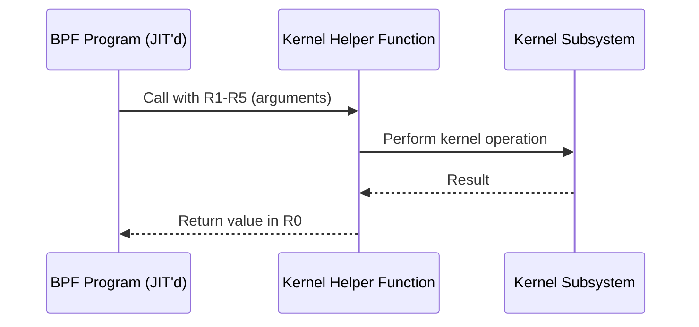
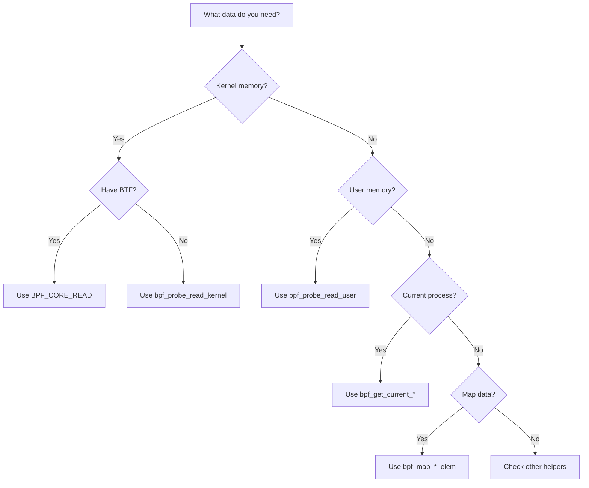

# Chapter 186: eBPF Helper Functions — bpf_probe_read, bpf_map_lookup, bpf_trace_printk, and Beyond

## 1. Introduction and Intuition

eBPF helper functions are the **bridge between BPF programs and the kernel**. Since BPF programs cannot directly call kernel functions (that would defeat the sandboxing), helpers provide a curated, type-safe API for kernel interaction. Think of helpers as **system calls for BPF programs** — they are the only way a BPF program can interact with the world outside its own execution context.

There are over 200 helper functions available (as of Linux 6.x), covering:

- **Map operations**: lookup, update, delete
- **Memory access**: probe_read for safe kernel/user memory reading
- **Tracing**: get current PID, comm, stack trace
- **Networking**: redirect, checksum, adjust headers
- **Time**: ktime_get_ns, jiffies
- **Randomness**: get_prandom_u32
- **Tail calls**: tail_call for program chaining
- **Ring buffer**: reserve, submit, discard

## 2. Helper Function Calling Convention

### 2.1 How Helpers Work

When a BPF program calls a helper, the verifier:

1. Validates that the helper is allowed for the program type
2. Checks argument types (map pointer, context pointer, scalar, etc.)
3. Inserts the helper ID into the call instruction
4. At runtime, the JIT'd code calls the helper's C implementation in the kernel



### 2.2 Argument Types

The verifier enforces strict type checking for helper arguments:

```c
// From include/linux/bpf.h
enum bpf_arg_type {
    ARG_DONTCARE = 0,    /* unused argument */
    ARG_CONST_MAP_PTR,   /* pointer to a BPF map */
    ARG_PTR_TO_CTX,      /* pointer to program context */
    ARG_ANYTHING,        /* any scalar value */
    ARG_PTR_TO_SPIN_LOCK,/* pointer to bpf_spin_lock */
    ARG_PTR_TO_SOCK_COMMON, /* pointer to sock_common */
    ARG_PTR_TO_INT,      /* pointer to integer */
    ARG_PTR_TO_LONG,     /* pointer to long */
    ARG_PTR_TO_MEM,      /* pointer to memory buffer */
    ARG_CONST_SIZE,      /* constant size */
    ARG_CONST_SIZE_OR_ZERO, /* constant size or zero */
    ARG_PTR_TO_CTX_OR_NULL, /* context or NULL */
    /* ... many more */
};
```

### 2.3 Return Types

```c
enum bpf_return_type {
    RET_INTEGER,          /* scalar integer */
    RET_VOID,             /* no return value */
    RET_PTR_TO_MAP_VALUE, /* pointer to map value (nullable) */
    RET_PTR_TO_SOCKET,    /* pointer to socket (nullable) */
    RET_PTR_TO_TCP_SOCK,  /* pointer to TCP socket */
    RET_PTR_TO_SOCK_COMMON,
    RET_PTR_TO_MEM,       /* pointer to memory */
    /* ... */
};
```

## 3. Core Helpers Reference

### 3.1 Map Operation Helpers

#### bpf_map_lookup_elem

```c
void *bpf_map_lookup_elem(struct bpf_map *map, const void *key);
```

Looks up a key in a map. Returns pointer to value, or NULL if not found.

```c
SEC("xdp")
int xdp_prog(struct xdp_md *ctx)
{
    u32 key = 0;
    u64 *val;

    val = bpf_map_lookup_elem(&my_map, &key);
    if (!val)
        return XDP_PASS;

    /* val points to the map value — safe to dereference */
    __sync_fetch_and_add(val, 1);
    return XDP_PASS;
}
```

**Verifier constraints**:
- First argument must be a pointer to a map
- Second argument must be a pointer to a buffer of `key_size` bytes
- Return is `PTR_TO_MAP_VALUE_OR_NULL` — must null-check before dereference

#### bpf_map_update_elem

```c
long bpf_map_update_elem(struct bpf_map *map, const void *key,
                         const void *value, u64 flags);
```

Flags:
- `BPF_ANY`: Create or update
- `BPF_NOEXIST`: Create only (fail if exists)
- `BPF_EXIST`: Update only (fail if not exists)
- `BPF_F_LOCK`: Update with spin lock held

```c
u32 key = 42;
struct my_value val = { .count = 1, .ts = bpf_ktime_get_ns() };
bpf_map_update_elem(&my_map, &key, &val, BPF_ANY);
```

#### bpf_map_delete_elem

```c
long bpf_map_delete_elem(struct bpf_map *map, const void *key);
```

Removes an entry from the map. Returns 0 on success, `-ENOENT` if key not found.

#### bpf_map_peek_elem / bpf_map_pop_elem / bpf_map_push_elem

For stack and queue maps:

```c
/* Stack/Queue operations */
long bpf_map_push_elem(struct bpf_map *map, const void *value, u64 flags);
long bpf_map_pop_elem(struct bpf_map *map, void *value);
long bpf_map_peek_elem(struct bpf_map *map, void *value);
```

### 3.2 Memory Access Helpers

#### bpf_probe_read

```c
long bpf_probe_read(void *dst, u32 size, const void *unsafe_ptr);
```

Safely reads `size` bytes from kernel memory at `unsafe_ptr` into `dst`. Returns 0 on success, `-EFAULT` on failure.

```c
SEC("kprobe/tcp_sendmsg")
int BPF_KPROBE(tcp_sendmsg, struct sock *sk, struct msghdr *msg, size_t size)
{
    u16 family;
    /* Safe read — will not crash even if sk is invalid */
    bpf_probe_read(&family, sizeof(family), &sk->sk_family);
    
    if (family == AF_INET) {
        /* ... */
    }
    return 0;
}
```

#### bpf_probe_read_user / bpf_probe_read_kernel

```c
long bpf_probe_read_user(void *dst, u32 size, const void *unsafe_ptr);
long bpf_probe_read_kernel(void *dst, u32 size, const void *unsafe_ptr);
```

Explicit user/kernel address space reads (Linux 5.5+). These replace `bpf_probe_read` for clarity:

```c
/* Read from user space */
char buf[256];
bpf_probe_read_user(buf, sizeof(buf), (void *)ctx->args[1]);

/* Read from kernel space */
struct task_struct *task = (void *)bpf_get_current_task();
char comm[16];
bpf_probe_read_kernel(comm, sizeof(comm), task->comm);
```

#### bpf_probe_read_user_str / bpf_probe_read_kernel_str

```c
long bpf_probe_read_user_str(void *dst, u32 size, const void *unsafe_ptr);
long bpf_probe_read_kernel_str(void *dst, u32 size, const void *unsafe_ptr);
```

Read a null-terminated string, copying up to `size` bytes (including the null terminator):

```c
SEC("tracepoint/syscalls/sys_enter_execve")
int trace_execve(struct trace_event_raw_sys_enter *ctx)
{
    char filename[256];
    bpf_probe_read_user_str(filename, sizeof(filename),
                            (void *)ctx->args[0]);
    /* filename contains the path */
    return 0;
}
```

### 3.3 Tracing Helpers

#### bpf_get_current_pid_tgid

```c
u64 bpf_get_current_pid_tgid(void);
```

Returns `(tgid << 32) | pid` where:
- `tgid` is the process ID (what `getpid()` returns in user space)
- `pid` is the thread ID (what `gettid()` returns)

```c
u64 pidtgid = bpf_get_current_pid_tgid();
u32 pid = pidtgid >> 32;
u32 tid = (u32)pidtgid;
```

#### bpf_get_current_uid_gid

```c
u64 bpf_get_current_uid_gid(void);
```

Returns `(gid << 32) | uid`.

#### bpf_get_current_comm

```c
long bpf_get_current_comm(void *buf, u32 size_of_buf);
```

Copies the current process name into `buf`:

```c
char comm[16];
bpf_get_current_comm(comm, sizeof(comm));
```

#### bpf_get_current_task

```c
u64 bpf_get_current_task(void);
```

Returns a pointer to the current `task_struct`. Must be used with `bpf_probe_read_kernel` for field access:

```c
struct task_struct *task = (void *)bpf_get_current_task();
int ppid;
bpf_probe_read_kernel(&ppid, sizeof(ppid), &task->real_parent->tgid);
```

#### bpf_ktime_get_ns / bpf_ktime_get_boot_ns

```c
u64 bpf_ktime_get_ns(void);
u64 bpf_ktime_get_boot_ns(void);
```

- `ktime_get_ns`: Nanoseconds since boot (not affected by clock adjustments)
- `ktime_get_boot_ns`: Nanoseconds since boot, including suspend time

```c
u64 start = bpf_ktime_get_ns();
/* ... do work ... */
u64 elapsed = bpf_ktime_get_ns() - start;
```

#### bpf_get_stackid

```c
long bpf_get_stackid(struct pt_regs *ctx, struct bpf_map *map, u64 flags);
```

Captures the current stack trace and stores it in a stack trace map:

```c
struct {
    __uint(type, BPF_MAP_TYPE_STACK_TRACE);
    __uint(max_entries, 1024);
    __type(key, u32);
    __type(value, struct { u64 ips[16]; });
} stackmap SEC(".maps");

SEC("kprobe/__kmalloc")
int trace_kmalloc(struct pt_regs *ctx)
{
    long stack_id = bpf_get_stackid(ctx, &stackmap, BPF_F_USER_STACK);
    if (stack_id >= 0) {
        /* Store stack_id with other data */
    }
    return 0;
}
```

#### bpf_get_stack

```c
long bpf_get_stack(struct pt_regs *ctx, void *buf, u32 size, u64 flags);
```

Directly captures stack frames into a buffer (Linux 4.18+):

```c
u64 ips[16];
int num = bpf_get_stack(ctx, ips, sizeof(ips), 0);
/* num = number of frames captured */
```

#### bpf_trace_printk

```c
static long (*bpf_trace_printk)(const char *fmt, u32 fmt_size, ...) = (void *) 6;
```

Writes to `/sys/kernel/debug/tracing/trace_pipe`. **For debugging only** — not recommended for production:

```c
SEC("kprobe/do_sys_open")
int trace_open(struct pt_regs *ctx)
{
    bpf_trace_printk("open called, pid=%d\n", bpf_get_current_pid_tgid() >> 32);
    return 0;
}
```

Read in user space:
```bash
cat /sys/kernel/debug/tracing/trace_pipe
```

**Limitations**:
- Only 3 format specifiers per call
- Limited format string support
- Writes to a shared buffer (not scalable)
- Use ring buffer for production

### 3.4 Networking Helpers

#### bpf_redirect

```c
long bpf_redirect(u32 ifindex, u64 flags);
```

Redirects the current packet to another interface:

```c
SEC("xdp")
int xdp_redirect_prog(struct xdp_md *ctx)
{
    return bpf_redirect(2, 0);  /* redirect to ifindex 2 */
}
```

#### bpf_redirect_map

```c
long bpf_redirect_map(struct bpf_map *map, u32 key, u64 flags);
```

Redirects using a devmap or cpumap:

```c
struct {
    __uint(type, BPF_MAP_TYPE_DEVMAP);
    __uint(max_entries, 16);
    __type(key, u32);
    __type(value, u32);
} tx_port SEC(".maps");

SEC("xdp")
int xdp_prog(struct xdp_md *ctx)
{
    u32 key = 0;
    return bpf_redirect_map(&tx_port, key, 0);
}
```

#### bpf_csum_diff

```c
long bpf_csum_diff(__be32 *from, u32 from_size,
                    __be32 *to, u32 to_size, __wsum seed);
```

Computes incremental checksum difference for packet modification:

```c
/* After modifying packet headers, update checksum */
__wsum old_csum = ~csum_unfold((__force __sum16)old_val);
__wsum new_csum = csum_partial(&new_val, sizeof(new_val), 0);
__wsum diff = bpf_csum_diff(&old_val, sizeof(old_val),
                             &new_val, sizeof(new_val), 0);
/* Update IP/TCP/UDP checksums incrementally */
```

#### bpf_skb_load_bytes / bpf_skb_store_bytes

```c
long bpf_skb_load_bytes(const struct __sk_buff *skb, u32 offset,
                         void *to, u32 len);
long bpf_skb_store_bytes(struct __sk_buff *skb, u32 offset,
                          const void *from, u32 len, u64 flags);
```

Generic packet data access:

```c
SEC("tc")
int tc_prog(struct __sk_buff *skb)
{
    struct ethhdr eth;
    bpf_skb_load_bytes(skb, 0, &eth, sizeof(eth));
    
    if (eth.h_proto == bpf_htons(ETH_P_IP)) {
        struct iphdr ip;
        bpf_skb_load_bytes(skb, sizeof(eth), &ip, sizeof(ip));
        /* ... */
    }
    return TC_ACT_OK;
}
```

#### bpf_skb_adjust_room

```c
long bpf_skb_adjust_room(struct __sk_buff *skb, s32 len_diff,
                          u32 mode, u64 flags);
```

Adds or removes space in a packet (for encapsulation/decapsulation):

```c
/* Add VXLAN header */
bpf_skb_adjust_room(skb, sizeof(struct vxlanhdr), BPF_ADJ_ROOM_MAC, 0);
```

### 3.5 Time and Randomness

#### bpf_get_prandom_u32

```c
u32 bpf_get_prandom_u32(void);
```

Returns a pseudo-random 32-bit value:

```c
/* Random sampling: 1% of packets */
if (bpf_get_prandom_u32() % 100 == 0) {
    /* Capture this packet */
}
```

#### bpf_get_smp_processor_id

```c
u32 bpf_get_smp_processor_id(void);
```

Returns the current CPU ID:

```c
u32 cpu = bpf_get_smp_processor_id();
/* Use as key for per-CPU data */
```

### 3.6 Tail Call Helpers

#### bpf_tail_call

```c
long bpf_tail_call(void *ctx, struct bpf_map *prog_array_map, u32 index);
```

Performs a tail call to another BPF program:

```c
struct {
    __uint(type, BPF_MAP_TYPE_PROG_ARRAY);
    __uint(max_entries, 256);
    __type(key, u32);
    __type(value, u32);
} prog_array SEC(".maps");

SEC("xdp")
int dispatcher(struct xdp_md *ctx)
{
    u32 key = parse_protocol(ctx);
    bpf_tail_call(ctx, &prog_array, key);
    /* Falls through if no program at key */
    return XDP_PASS;
}
```

### 3.7 Ring Buffer Helpers

#### bpf_ringbuf_reserve

```c
void *bpf_ringbuf_reserve(struct bpf_map *map, u64 size, u64 flags);
```

Reserves space in the ring buffer:

```c
struct event *e = bpf_ringbuf_reserve(&events, sizeof(*e), 0);
if (!e)
    return 0;
```

#### bpf_ringbuf_submit / bpf_ringbuf_discard

```c
void bpf_ringbuf_submit(void *data, u64 flags);
void bpf_ringbuf_discard(void *data, u64 flags);
```

Finalizes or cancels a reservation:

```c
e->pid = pid;
bpf_ringbuf_submit(e, 0);  /* commit — visible to consumer */

/* or */
bpf_ringbuf_discard(e, 0);  /* cancel — not visible */
```

#### bpf_ringbuf_query

```c
long bpf_ringbuf_query(struct bpf_map *map, u64 flags);
```

Query ring buffer state:

```c
/* Check available space */
long avail = bpf_ringbuf_query(&events, BPF_RINGBUF_AVAIL_DATA);
long free = bpf_ringbuf_query(&events, BPF_RINGBUF_FREE_BYTES);
```

### 3.8 Socket Helpers

#### bpf_sk_lookup_tcp / bpf_sk_lookup_udp

```c
struct bpf_sock *bpf_sk_lookup_tcp(void *ctx,
                                    const struct bpf_sock_tuple *tuple,
                                    u32 tuple_size, u64 netns, u64 flags);
struct bpf_sock *bpf_sk_lookup_udp(void *ctx,
                                    const struct bpf_sock_tuple *tuple,
                                    u32 tuple_size, u64 netns, u64 flags);
```

Looks up a socket by address tuple:

```c
SEC("xdp")
int xdp_sock_lookup(struct xdp_md *ctx)
{
    struct bpf_sock_tuple tuple = {};
    /* Fill in source/dest IP and port from packet */
    
    struct bpf_sock *sk = bpf_sk_lookup_tcp(ctx, &tuple, sizeof(tuple.ipv4), 0, 0);
    if (sk) {
        /* Socket found — apply policy */
        bpf_sk_release(sk);
    }
    return XDP_PASS;
}
```

#### bpf_sk_release

```c
long bpf_sk_release(struct bpf_sock *sock);
```

Releases a reference obtained by `bpf_sk_lookup_*`:

```c
struct bpf_sock *sk = bpf_sk_lookup_tcp(...);
if (sk) {
    /* Use sk */
    bpf_sk_release(sk);  /* MUST release! */
}
```

### 3.9 Task and Process Helpers

#### bpf_get_ns_current_pid_tgid

```c
long bpf_get_ns_current_pid_tgid(u64 dev, u64 ino,
                                  struct bpf_pidns_info *nsdata, u32 size);
```

Gets PID/TGID in a specific PID namespace:

```c
struct bpf_pidns_info ns = {};
bpf_get_ns_current_pid_tgid(dev, ino, &ns, sizeof(ns));
/* ns.pid and ns.tgid are in the target namespace */
```

#### bpf_send_signal

```c
long bpf_send_signal(u32 sig);
```

Sends a signal to the current process (Linux 5.3+):

```c
/* Kill process if it tries to open a forbidden file */
SEC("lsm/file_open")
int BPF_PROG(restrict_open, struct file *file)
{
    if (is_forbidden(file)) {
        bpf_send_signal(SIGKILL);
        return -EPERM;
    }
    return 0;
}
```

#### bpf_override_return

```c
long bpf_override_return(struct pt_regs *regs, unsigned long rc);
```

Overrides the return value of a function being traced (kprobe only):

```c
SEC("kprobe/tcp_v4_connect")
int BPF_KPROBE(tcp_connect, struct sock *sk)
{
    /* Force connect to fail */
    bpf_override_return(ctx, -ECONNREFUSED);
    return 0;
}
```

### 3.10 BTF Helpers

#### bpf_btf_find_by_name_kind

```c
long bpf_btf_find_by_name_kind(char *name, u32 name_sz, u32 kind, u32 flags);
```

Finds a BTF type ID by name and kind:

```c
char name[] = "tcp_sock";
int type_id = bpf_btf_find_by_name_kind(name, sizeof(name), BTF_KIND_STRUCT, 0);
```

### 3.11 Verifier Validation of Helpers

The verifier performs extensive validation when a helper is called:

```c
/* The verifier checks: */

/* 1. Helper exists and is allowed for program type */
if (func_id >= __BPF_FUNC_MAX_ID)
    return -EINVAL;

/* 2. Argument types match expected types */
if (fn->arg1_type == ARG_CONST_MAP_PTR) {
    /* Must be a pointer to a BPF map */
    if (regs[BPF_REG_1].type != CONST_MAP_PTR)
        return -EINVAL;
}

/* 3. Return value type is used correctly */
if (fn->ret_type == RET_PTR_TO_MAP_VALUE_OR_NULL) {
    /* Must null-check before dereference */
    if (!is_null_return_checked())
        return -EINVAL;
}
```

### 3.12 Helper Function ID Enumeration

All helper functions have unique IDs:

```c
enum bpf_func_id {
    BPF_FUNC_unspec = 0,
    BPF_FUNC_map_lookup_elem = 1,
    BPF_FUNC_map_update_elem = 2,
    BPF_FUNC_map_delete_elem = 3,
    BPF_FUNC_probe_read = 4,
    BPF_FUNC_ktime_get_ns = 5,
    BPF_FUNC_trace_printk = 6,
    BPF_FUNC_get_prandom_u32 = 7,
    BPF_FUNC_get_smp_processor_id = 8,
    BPF_FUNC_skb_store_bytes = 9,
    BPF_FUNC_l3_csum_replace = 10,
    /* ... over 200 helpers total */
    __BPF_FUNC_MAX_ID,
};
```

## 4. Helper Registration in the Kernel

### 4.1 Helper Definition

Helpers are registered in the kernel via `BPF_CALL_*` macros:

```c
// kernel/bpf/helpers.c

BPF_CALL_2(bpf_map_lookup_elem, struct bpf_map *, map, void *, key)
{
    WARN_ON_ONCE(!rcu_read_lock_held());
    return (unsigned long) map->ops->map_lookup_elem(map, key);
}

const struct bpf_func_proto bpf_map_lookup_elem_proto = {
    .func       = bpf_map_lookup_elem,
    .gpl_only   = false,
    .pkt_access = true,
    .ret_type   = RET_PTR_TO_MAP_VALUE_OR_NULL,
    .arg1_type  = ARG_CONST_MAP_PTR,
    .arg2_type  = ARG_PTR_TO_MAP_KEY,
};
```

### 4.2 Helper Availability by Program Type

Each program type declares which helpers it supports:

```c
// net/core/filter.c (XDP programs)
static const struct bpf_func_proto *
xdp_func_proto(enum bpf_func_id func_id, const struct bpf_prog *prog)
{
    switch (func_id) {
    case BPF_FUNC_redirect:
        return &bpf_xdp_redirect_proto;
    case BPF_FUNC_redirect_map:
        return &bpf_xdp_redirect_map_proto;
    case BPF_FUNC_map_lookup_elem:
        return &bpf_map_lookup_elem_proto;
    /* ... */
    default:
        return bpf_base_func_proto(func_id, prog);
    }
}
```

## 5. Performance Considerations

### 5.1 Helper Call Overhead

Each helper call has overhead:
- Argument marshaling (register → stack)
- Function call overhead (even with JIT)
- Kernel function execution

For hot paths, minimize helper calls:

```c
/* Bad: multiple lookups */
val = bpf_map_lookup_elem(&map, &key1);
/* use val */
val = bpf_map_lookup_elem(&map, &key2);
/* use val */

/* Good: batch if possible, or cache results */
```

### 5.2 bpf_probe_read Cost

`bpf_probe_read` involves:
- Page fault handling (if address is invalid)
- User/kernel space boundary crossing
- Exception table lookup

For known-valid kernel addresses (e.g., direct context field access), prefer direct reads:

```c
/* Slow: explicit probe_read */
u16 family;
bpf_probe_read(&family, sizeof(family), &sk->sk_family);

/* Fast: direct read (verifier validates) */
u16 family = sk->sk_family;  /* if fentry/BTF available */
```

### 5.3 bpf_trace_printk vs Ring Buffer

```c
/* Slow: trace_printk (shared buffer, contention) */
bpf_trace_printk("event: pid=%d\n", pid);

/* Fast: ring buffer (per-producer reservation) */
struct event *e = bpf_ringbuf_reserve(&events, sizeof(*e), 0);
if (e) {
    e->pid = pid;
    bpf_ringbuf_submit(e, 0);
}
```

## 6. Security Considerations

### 6.1 Helper Privilege Levels

Not all helpers are available to all users:

- **Unprivileged** (any user with `CAP_BPF`): `bpf_map_lookup_elem`, `bpf_ktime_get_ns`, etc.
- **Privileged** (`CAP_SYS_ADMIN`): `bpf_override_return`, `bpf_send_signal`, etc.
- **Program-type restricted**: `bpf_probe_read` only in tracing/kprobe programs

### 6.2 Information Disclosure Prevention

Helpers are carefully designed to prevent information leaks:

- `bpf_probe_read` uses exception tables to handle page faults safely
- Socket helpers return only socket metadata, not full socket data
- Stack traces are filtered based on privileges

## 7. Common Pitfalls

### 7.1 Forgetting Null Checks

```c
/* Bad */
u64 *val = bpf_map_lookup_elem(&map, &key);
*val += 1;  /* NULL dereference if key not found! */

/* Good */
u64 *val = bpf_map_lookup_elem(&map, &key);
if (val)
    __sync_fetch_and_add(val, 1);
```

### 7.2 Wrong Helper for Program Type

```c
/* Bad: bpf_probe_read in XDP program */
SEC("xdp")
int xdp_prog(struct xdp_md *ctx)
{
    char buf[64];
    bpf_probe_read(buf, sizeof(buf), some_ptr);  /* Not allowed in XDP */
    return XDP_PASS;
}
```

### 7.3 Resource Leaks

```c
/* Bad: socket lookup without release */
struct bpf_sock *sk = bpf_sk_lookup_tcp(...);
if (sk) {
    /* Use sk */
    /* Missing bpf_sk_release(sk)! */
}

/* Good */
struct bpf_sock *sk = bpf_sk_lookup_tcp(...);
if (sk) {
    /* Use sk */
    bpf_sk_release(sk);
}
```

### 7.4 Stack Overflow with Large Buffers

```c
/* Bad: large buffer on stack */
char buf[4096];  /* exceeds 512-byte stack limit */

/* Good: use map or smaller buffer */
char buf[64];  /* OK */
/* Or use per-CPU array for larger buffers */
```

## 8. Best Practices

1. **Use ring buffer over trace_printk**: Always prefer `BPF_MAP_TYPE_RINGBUF` for event output
2. **Use `bpf_probe_read_*_str`**: For reading user/kernel strings
3. **Check return values**: All helpers can potentially fail
4. **Release references**: Always call `bpf_sk_release`, etc. for obtained references
5. **Prefer direct field access**: When BTF is available, use direct struct field access instead of `bpf_probe_read`
6. **Minimize helper calls in hot paths**: Cache results when possible
7. **Use `__always_inline` for custom helpers**: Wrap helper calls in inline functions for reuse
8. **Use BPF_CORE_READ instead of bpf_probe_read**: When CO-RE is available
9. **Avoid bpf_trace_printk in production**: Use ring buffer for event output
10. **Document helper usage**: Add comments explaining why specific helpers are used

### 8.1 Helper Selection Guide



### 8.2 Common Helper Patterns

```c
/* Pattern 1: Safe string read */
char buf[256];
int len = bpf_probe_read_kernel_str(buf, sizeof(buf), ptr);
if (len < 0)
    return 0;  /* Error reading string */

/* Pattern 2: Map lookup with fallback */
u64 *val = bpf_map_lookup_elem(&map, &key);
if (!val) {
    u64 default_val = 0;
    bpf_map_update_elem(&map, &key, &default_val, BPF_ANY);
    val = bpf_map_lookup_elem(&map, &key);
    if (!val)
        return 0;
}

/* Pattern 3: Conditional helper call */
if (bpf_core_field_exists(sk->sk_dport)) {
    u16 dport = BPF_CORE_READ(sk, sk_dport);
} else {
    u16 dport = bpf_ntohs(sk->__sk_common.skc_dport);
}
```

## 9. Exercises

### Exercise 1: Process Tracer

Write a BPF program that traces process creation using `bpf_get_current_pid_tgid`, `bpf_get_current_comm`, and the ring buffer.

### Exercise 2: Network Redirector

Create an XDP program that uses `bpf_redirect_map` to load-balance packets across multiple interfaces.

### Exercise 3: Stack Trace Profiler

Write a kprobe-based profiler that captures kernel stack traces using `bpf_get_stackid` and aggregates them in a stack trace map.

## 10. References

1. **Helper function reference**: `include/uapi/linux/bpf.h` (enum bpf_func_id)
2. **Helper implementations**: `kernel/bpf/helpers.c`, `net/core/filter.c`
3. **Helper documentation**: `Documentation/bpf/helpers.rst`
4. **libbpf helper wrappers**: `tools/lib/bpf/bpf_helpers.h`
5. **BPF helper cheat sheet**: https://ebpf-cheatsheet.alexei-radionov.com/
6. **Cilium BPF docs**: https://docs.cilium.io/en/latest/bpf/helper_function/
