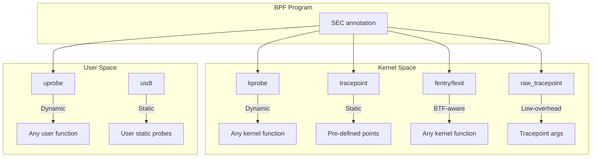
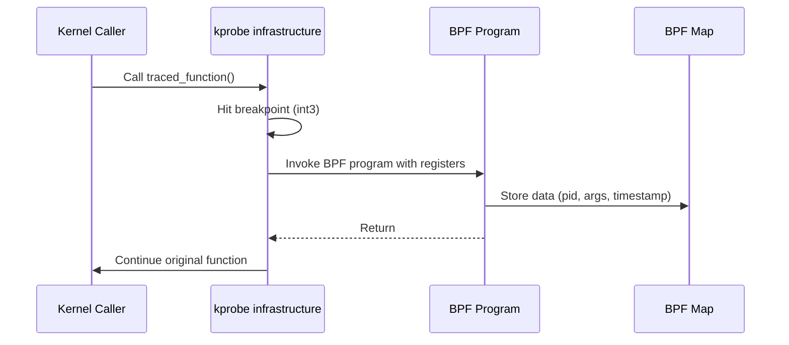
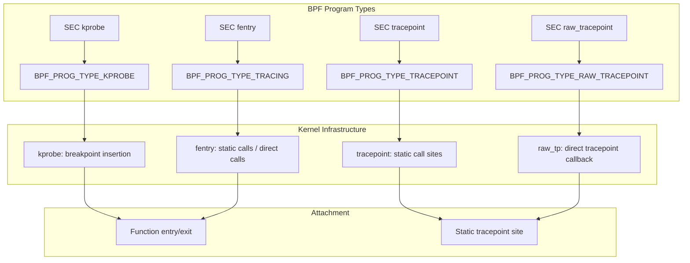
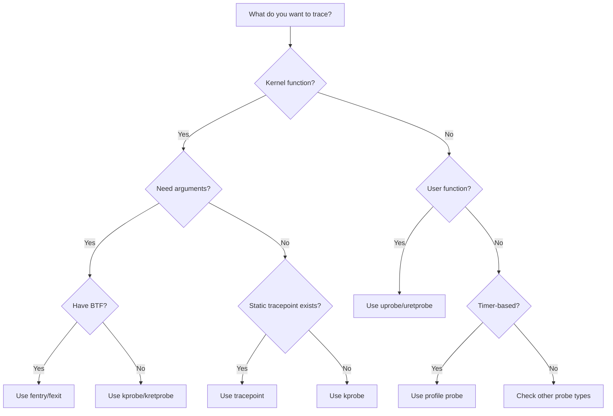

# Chapter 187: eBPF for Tracing — kprobe, uprobe, tracepoint, fentry/fexit, Raw Tracepoints

## 1. Introduction and Intuition

Tracing is the original "killer app" for eBPF. The ability to attach small, safe programs to virtually any point in the kernel (or user-space programs) and collect data with minimal overhead has revolutionized how we debug, profile, and understand system behavior.

Think of eBPF tracing as **programmable observability probes** — instead of writing custom kernel modules or recompiling with debug flags, you write small BPF programs that:

- Fire when a specific kernel function is called (kprobe)
- Fire when a user-space function is called (uprobe)
- Fire at static instrumentation points (tracepoint)
- Fire at function entry/exit with full argument/return access (fentry/fexit)

The key insight is that eBPF tracing is **zero-instrumentation** — you don't need to modify the traced code. The kernel and dynamic linker provide the infrastructure to insert breakpoints and tracepoints at runtime.

## 2. Tracing Hook Points

### 2.1 Overview of Tracing Mechanisms



### 2.2 Comparison Table

| Mechanism | Target | Overhead | Type Safety | Kernel Version |
|---|---|---|---|---|
| kprobe | Any kernel function | Medium | Low (raw registers) | 4.1+ |
| kretprobe | Function return | Medium | Low (return value only) | 4.1+ |
| tracepoint | Static points | Low | High (defined format) | 4.7+ |
| raw_tracepoint | Static points | Lowest | Medium (raw args) | 4.17+ |
| fentry | Any kernel function | Low | High (BTF) | 5.5+ |
| fexit | Function return | Low | High (BTF) | 5.5+ |
| uprobe | User function | High | Low (raw registers) | 4.4+ |
| uretprobe | User function return | High | Low | 4.4+ |

## 3. kprobes

### 3.1 How kprobes Work

kprobes insert a breakpoint instruction (e.g., `int3` on x86-64) at the entry of a kernel function. When the function is called:

1. The breakpoint fires → kprobe handler runs
2. The handler calls the BPF program
3. The BPF program runs, collects data, stores in maps
4. Control returns to the original function



### 3.2 kprobe BPF Program

```c
// kprobe_example.bpf.c
#include <vmlinux.h>
#include <bpf/bpf_helpers.h>
#include <bpf/bpf_tracing.h>

struct event {
    u32 pid;
    u32 tid;
    char comm[16];
    u64 ts;
    u64 func_addr;
};

struct {
    __uint(type, BPF_MAP_TYPE_RINGBUF);
    __uint(max_entries, 256 * 1024);
} events SEC(".maps");

/* Attach to do_sys_openat2 */
SEC("kprobe/do_sys_openat2")
int BPF_KPROBE(trace_openat, int dfd, const char *pathname,
               struct open_how *how)
{
    struct event *e;
    u64 pid_tgid;

    e = bpf_ringbuf_reserve(&events, sizeof(*e), 0);
    if (!e)
        return 0;

    pid_tgid = bpf_get_current_pid_tgid();
    e->pid = pid_tgid >> 32;
    e->tid = (u32)pid_tgid;
    e->ts = bpf_ktime_get_ns();
    e->func_addr = (u64)PT_REGS_IP(ctx);  /* instruction pointer */
    bpf_get_current_comm(&e->comm, sizeof(e->comm));

    bpf_ringbuf_submit(e, 0);
    return 0;
}

char LICENSE[] SEC("license") = "GPL";
```

### 3.3 kretprobe

kretprobe captures the return value of a function:

```c
struct {
    __uint(type, BPF_MAP_TYPE_HASH);
    __uint(max_entries, 10240);
    __type(key, u32);       /* tid */
    __type(value, u64);     /* start timestamp */
} start_times SEC(".maps");

SEC("kprobe/do_sys_openat2")
int BPF_KPROBE(openat_entry, int dfd, const char *pathname)
{
    u32 tid = (u32)bpf_get_current_pid_tgid();
    u64 ts = bpf_ktime_get_ns();
    bpf_map_update_elem(&start_times, &tid, &ts, BPF_ANY);
    return 0;
}

SEC("kretprobe/do_sys_openat2")
int BPF_KRETPROBE(openat_exit, int ret)
{
    u32 tid = (u32)bpf_get_current_pid_tgid();
    u64 *start_ts = bpf_map_lookup_elem(&start_times, &tid);
    
    if (start_ts) {
        u64 duration = bpf_ktime_get_ns() - *start_ts;
        /* Record duration */
        bpf_map_delete_elem(&start_times, &tid);
    }
    return 0;
}
```

### 3.4 kprobe Attachment from User Space

```c
#include <bpf/libbpf.h>
#include <bpf/bpf.h>

int main(void)
{
    struct kprobe *skel;

    skel = kprobe_example__open_and_load();
    
    /* Attach kprobe to do_sys_openat2 */
    skel->links.trace_openat = bpf_program__attach_kprobe(
        skel->progs.trace_openat,
        false,  /* retprobe = false */
        "do_sys_openat2"
    );
    
    /* Or use auto-attachment via SEC() annotation */
    kprobe_example__attach(skel);
    
    /* Read events from ring buffer */
    struct ring_buffer *rb = ring_buffer__new(
        bpf_map__fd(skel->maps.events),
        handle_event, NULL, NULL
    );
    
    while (1) {
        ring_buffer__poll(rb, 1000);
    }
    
    kprobe_example__destroy(skel);
    return 0;
}
```

### 3.5 Multi-kprobe (Linux 5.18+)

Attach to multiple functions with a single program:

```c
SEC("kprobe.multi/tcp_*")
int BPF_KPROBE_MULTI(trace_tcp, struct sock *sk)
{
    /* Fires for tcp_sendmsg, tcp_recvmsg, tcp_connect, etc. */
    return 0;
}
```

## 4. Tracepoints

### 4.1 Static Tracepoints

Tracepoints are static instrumentation points compiled into the kernel. They are defined in header files and have a fixed format:

```c
// Include tracepoint definitions
#include <vmlinux.h>
#include <bpf/bpf_helpers.h>

/* Tracepoint: sys_enter_read */
SEC("tracepoint/syscalls/sys_enter_read")
int trace_sys_read(struct trace_event_raw_sys_enter *ctx)
{
    u32 pid = bpf_get_current_pid_tgid() >> 32;
    int fd = ctx->args[0];
    size_t count = ctx->args[2];
    
    /* ... */
    return 0;
}
```

### 4.2 Tracepoint Format

Each tracepoint has a defined format available at `/sys/kernel/debug/tracing/events/`:

```bash
# List available tracepoints
cat /sys/kernel/debug/tracing/events/syscalls/sys_enter_read/format

# Output:
# name: sys_enter_read
# ID: 672
# format:
#  field:unsigned short common_type;  offset:0; size:2;
#  field:unsigned int nr;             offset:8; size:4;
#  field:unsigned long args[6];       offset:16; size:48;
```

### 4.3 Custom Tracepoints

You can define custom tracepoints (user-defined tracepoints, USDT):

```c
/* In user-space application */
#include <sys/sdt.h>

DTRACE_PROBE3(myapp, request_start, fd, buf, count);
```

BPF program to attach:
```c
SEC("usdt/myapp:request_start")
int trace_request(struct pt_regs *ctx)
{
    /* Access USDT arguments via PT_REGS_PARM* macros */
    int fd = PT_REGS_PARM1(ctx);
    return 0;
}
```

## 5. fentry/fexit

### 5.1 Modern BTF-Aware Tracing

fentry/fexit (function entry/exit) are the modern replacement for kprobe/kretprobe, offering:

- **Type safety via BTF**: Arguments are typed, not raw register values
- **Lower overhead**: No breakpoint instruction; uses static call or direct call
- **Return value access**: fexit provides both arguments and return value
- **BPF-to-BPF calls**: Full support

```c
// fentry_example.bpf.c
#include <vmlinux.h>
#include <bpf/bpf_helpers.h>
#include <bpf/bpf_tracing.h>

SEC("fentry/tcp_sendmsg")
int BPF_PROG(trace_tcp_sendmsg, struct sock *sk, struct msghdr *msg,
             size_t size)
{
    /* BTF knows the exact types! */
    u16 family = sk->sk_family;
    u32 dport = sk->sk_dport;
    
    /* Direct field access — no bpf_probe_read needed */
    if (family == AF_INET) {
        u32 saddr = sk->sk_rcv_saddr;
        u32 daddr = sk->sk_daddr;
        /* ... */
    }
    return 0;
}

SEC("fexit/tcp_sendmsg")
int BPF_PROG(trace_tcp_sendmsg_ret, struct sock *sk, struct msghdr *msg,
             size_t size, int ret)
{
    /* ret is the return value of tcp_sendmsg */
    /* sk, msg, size are the original arguments */
    if (ret < 0) {
        /* Error case */
    }
    return 0;
}
```

### 5.2 fentry vs kprobe

```c
/* kprobe — raw register access, no type info */
SEC("kprobe/tcp_sendmsg")
int BPF_KPROBE(trace_kp, struct sock *sk, struct msghdr *msg, size_t size)
{
    /* Must use bpf_probe_read for kernel memory */
    u16 family;
    bpf_probe_read(&family, sizeof(family), &sk->sk_family);
    return 0;
}

/* fentry — direct access, BTF type info */
SEC("fentry/tcp_sendmsg")
int BPF_PROG(trace_fe, struct sock *sk, struct msghdr *msg, size_t size)
{
    /* Direct field access — verifier validates via BTF */
    u16 family = sk->sk_family;
    return 0;
}
```

### 5.3 fmod_ret (Function Modify Return)

fmod_ret allows modifying a function's return value (Linux 5.7+):

```c
SEC("fmod_ret/tcp_v4_connect")
int BPF_PROG(block_connect, struct sock *sk, struct sockaddr *uaddr,
             int addr_len, int ret)
{
    struct sockaddr_in *addr = (struct sockaddr_in *)uaddr;
    
    /* Block connections to specific IP */
    if (addr->sin_addr.s_addr == bpf_htonl(0xC0A80101)) /* 192.168.1.1 */
        return -ECONNREFUSED;
    
    return ret;  /* original return value */
}
```

### 5.4 fentry/fexit for User-Space Functions

```c
SEC("fentry/printf")
int BPF_PROG(trace_printf)
{
    /* Trace libc's printf — requires user-space BTF */
    return 0;
}
```

## 6. uprobes

### 6.1 User-Space Tracing

uprobes attach to user-space functions by inserting breakpoints in the binary:

```c
// uprobe_example.bpf.c
#include <vmlinux.h>
#include <bpf/bpf_helpers.h>

struct event {
    u32 pid;
    u64 ts;
    int syscall_nr;
};

struct {
    __uint(type, BPF_MAP_TYPE_RINGBUF);
    __uint(max_entries, 256 * 1024);
} events SEC(".maps");

SEC("uprobe//usr/lib/libc.so.6:write")
int trace_write(struct pt_regs *ctx)
{
    /* On x86-64, function arguments are in registers */
    /* PT_REGS_PARM1 = RDI, PT_REGS_PARM2 = RSI, etc. */
    
    struct event *e = bpf_ringbuf_reserve(&events, sizeof(*e), 0);
    if (!e)
        return 0;
    
    e->pid = bpf_get_current_pid_tgid() >> 32;
    e->ts = bpf_ktime_get_ns();
    
    bpf_ringbuf_submit(e, 0);
    return 0;
}
```

### 6.2 Attaching uprobes

```bash
# Using bpftool
bpftool uprobe attach /usr/lib/libc.so.6 write program trace_write

# Using libbpf
skel->links.trace_write = bpf_program__attach_uprobe(
    skel->progs.trace_write,
    false,           /* retprobe */
    -1,              /* pid (-1 = all) */
    "/usr/lib/libc.so.6",
    0x12345          /* offset (use nm or objdump to find) */
);
```

### 6.3 Finding Function Offsets

```bash
# Find offset of 'write' in libc
nm -D /usr/lib/libc.so.6 | grep " T write$"
# Output: 0000000000114a80 T write

# Or use objdump
objdump -T /usr/lib/libc.so.6 | grep write
```

### 6.4 uretprobe

Capture return values from user-space functions:

```c
SEC("uretprobe//usr/lib/libc.so.6:malloc")
int trace_malloc_return(struct pt_regs *ctx)
{
    void *ptr = (void *)PT_REGS_RC(ctx);  /* return value */
    /* Track allocation */
    return 0;
}
```

## 7. Raw Tracepoints

### 7.1 Why Raw Tracepoints?

Regular tracepoints involve format parsing overhead. Raw tracepoints pass arguments directly:

```c
/* Regular tracepoint — format is parsed */
SEC("tracepoint/syscalls/sys_enter_read")
int trace_read(struct trace_event_raw_sys_enter *ctx)
{
    int fd = ctx->args[0];  /* parsed from format */
    return 0;
}

/* Raw tracepoint — direct access to arguments */
SEC("raw_tracepoint/sys_enter")
int raw_trace_read(struct bpf_raw_tracepoint_args *ctx)
{
    /* ctx->args is the raw tracepoint argument array */
    int nr = ctx->args[1];  /* syscall number */
    if (nr == __NR_read) {
        int fd = ctx->args[1];
    }
    return 0;
}
```

### 7.2 Performance Difference

Raw tracepoints avoid:
- Format string parsing
- Field extraction overhead
- Extra memory copies

For high-frequency events (millions of times per second), this matters significantly.

## 8. Tracing Architecture

### 8.1 Kernel Tracing Infrastructure



### 8.2 Program Context Structures

Each tracing mechanism provides different context:

```c
/* kprobe context — raw register state */
struct pt_regs {
    unsigned long r15, r14, r13, r12;
    unsigned long bp, bx;
    unsigned long r11, r10, r9, r8;
    unsigned long ax, cx, dx, si, di, orig_ax;
    unsigned long ip, cs, flags, sp, ss;
};

/* tracepoint context — parsed fields */
struct trace_event_raw_sys_enter {
    struct trace_entry ent;
    long id;
    unsigned long args[6];
};

/* fentry context — typed arguments via BTF */
/* No fixed struct — the verifier uses BTF to validate field access */

/* raw_tracepoint context — raw arguments */
struct bpf_raw_tracepoint_args {
    __u64 args[0];  /* variable-length array */
};
```

## 9. Performance Considerations

### 9.1 Overhead Comparison

| Mechanism | Cost per Invocation | Notes |
|---|---|---|
| kprobe | ~1-5 µs | Breakpoint + handler |
| kretprobe | ~2-10 µs | Entry + return |
| tracepoint | ~0.1-1 µs | Static call, no breakpoint |
| raw_tracepoint | ~0.05-0.5 µs | Direct call |
| fentry | ~0.05-0.5 µs | Static/direct call |
| uprobe | ~5-20 µs | User-kernel boundary |

### 9.2 Choosing the Right Mechanism

- **tracepoint**: When a tracepoint exists for your event
- **raw_tracepoint**: Same, but need lower overhead
- **fentry/fexit**: When you need function arguments/return values with type safety
- **kprobe**: When fentry isn't available or you need raw register access
- **uprobe**: User-space function tracing

### 9.3 Multi-kprobe vs Individual kprobes

```c
/* Slow: individual attachment for each function */
prog.attach_kprobe("func_a")
prog.attach_kprobe("func_b")
prog.attach_kprobe("func_c")
/* Each attachment is a separate syscall */

/* Fast: multi-kprobe (Linux 5.18+) */
SEC("kprobe.multi/func_a,func_b,func_c")
int BPF_KPROBE(trace_multi, void *arg)
{
    /* Single program for all functions */
    return 0;
}
/* Single attachment syscall, shared trampoline */
```

Multi-kprobe is significantly faster for attaching to many functions because it uses a shared trampoline and a single attachment syscall.

### 9.4 Sampling for High-Frequency Events

```c
/* Sample 1 in 100 events */
SEC("fentry/tcp_sendmsg")
int BPF_PROG(trace_sampled, struct sock *sk, struct msghdr *msg, size_t size)
{
    if (bpf_get_prandom_u32() % 100 != 0)
        return 0;  /* Skip 99% of events */
    
    /* Process sampled event */
    struct event *e = bpf_ringbuf_reserve(&events, sizeof(*e), 0);
    if (e) {
        e->pid = bpf_get_current_pid_tgid() >> 32;
        e->size = size;
        bpf_ringbuf_submit(e, 0);
    }
    return 0;
}
```

### 9.5 Minimizing Probe Overhead

```c
/* Bad: expensive operations in probe */
SEC("fentry/tcp_sendmsg")
int BPF_PROG(trace_expensive, struct sock *sk)
{
    char buf[256];
    bpf_d_path(&sk->sk_socket->file->f_path, buf, sizeof(buf));
    /* d_path is expensive! */
    return 0;
}

/* Good: cheap operations first, expensive only when needed */
SEC("fentry/tcp_sendmsg")
int BPF_PROG(trace_optimized, struct sock *sk)
{
    /* Quick filter first */
    u16 family = sk->sk_family;
    if (family != AF_INET)
        return 0;
    
    /* Only expensive operations for interesting cases */
    struct event *e = bpf_ringbuf_reserve(&events, sizeof(*e), 0);
    if (e) {
        e->pid = bpf_get_current_pid_tgid() >> 32;
        bpf_ringbuf_submit(e, 0);
    }
    return 0;
}
```

## 10. Security Considerations

### 10.1 Privilege Requirements

- **kprobe/kretprobe**: Requires `CAP_SYS_ADMIN` or `CAP_BPF` + `CAP_PERFMON`
- **tracepoint**: Same as kprobe
- **fentry/fexit**: Same as kprobe
- **uprobe**: Requires `CAP_SYS_ADMIN` or tracing of own process

### 10.2 Information Exposure

Tracing can expose sensitive information:
- Kernel function arguments may contain credentials
- User-space function arguments may contain passwords
- Stack traces reveal code layout (useful for exploits)

Always restrict tracing to specific PIDs and filter out sensitive data.

## 11. Common Pitfalls

### 11.1 Missing GPL License

```c
/* Bad: no license — limits helper availability */
char LICENSE[] SEC("license") = "MIT";

/* Good: GPL license — full helper access */
char LICENSE[] SEC("license") = "GPL";
```

### 11.2 Wrong Function Name

```c
/* Bad: function may be inlined or renamed */
SEC("kprobe/tcp_sendmsg")

/* Good: check /proc/kallsyms first */
// $ grep tcp_sendmsg /proc/kallsyms
// ffffffff81a3b5e0 t tcp_sendmsg
```

### 11.3 Stale Pointer in kretprobe

```c
/* Bad: accessing arguments in kretprobe */
SEC("kretprobe/tcp_sendmsg")
int BPF_KRETPROBE(trace_ret, int ret)
{
    /* Arguments from entry are NOT available here */
    /* The registers have been clobbered */
    return 0;
}

/* Good: save arguments in kprobe, retrieve in kretprobe */
```

### 11.4 uprobe Offset Mismatch

```c
/* Bad: using function name directly */
SEC("uprobe/write")

/* Good: find correct offset */
// nm -D /usr/lib/libc.so.6 | grep " T write$"
// Use the offset in SEC annotation
```

## 12. Best Practices

1. **Prefer fentry/fexit over kprobe**: Better type safety and performance
2. **Use tracepoints when available**: Stable ABI, lowest overhead
3. **Use ring buffer for events**: Not perf event array
4. **Filter early**: Discard uninteresting events before allocating
5. **Sample high-frequency events**: Use `bpf_get_prandom_u32()` for sampling
6. **Use BTF for field access**: Direct reads instead of `bpf_probe_read`
7. **Test with `bpftool prog run`**: Validate before attaching
8. **Monitor overhead**: Use `bpftool prog profile` to measure
9. **Use kprobe.multi for bulk attachment**: More efficient than individual kprobes
10. **Clean up probes**: Always detach probes when done

### 12.1 Choosing the Right Probe Type



### 12.2 Overhead Measurement

```bash
# Measure probe overhead
bpftool prog profile id <PROG_ID> duration 10

# Output includes:
# - Total CPU time spent in BPF program
# - Number of times program was called
# - Average time per invocation

# For detailed profiling
perf record -e bpf:bpf_prog_load -ag sleep 10
perf report
```

## 13. Exercises

### Exercise 1: System Call Tracer

Write a BPF program that traces all `openat` system calls and records:
- PID, comm, filename, flags, return value, duration

### Exercise 2: Function Latency Profiler

Write an fentry/fexit program that measures the latency of `vfs_read` and builds a histogram.

### Exercise 3: User-Space Library Tracer

Attach a uprobe to a specific function in a user-space binary and trace its calls.

## 14. Tracing Internals

### 14.1 kprobe Internals: Breakpoint Mechanism

On x86-64, kprobes work by replacing the first byte of the target function with `int3` (0xCC):

```
Original function:
  0xffffffff81a3b5e0: 55                    push rbp
  0xffffffff81a3b5e1: 48 89 e5              mov rbp, rsp
  ...

With kprobe installed:
  0xffffffff81a3b5e0: CC                    int3 (breakpoint)
  0xffffffff81a3b5e1: 48 89 e5              mov rbp, rsp
  ...

When int3 fires:
  1. CPU saves register state to stack
  2. Calls do_int3() → kprobe handler
  3. Handler calls BPF program with saved registers
  4. After handler: single-step original instruction
  5. Resume normal execution
```

### 14.2 fentry Internals: Static Calls

fentry uses a more efficient mechanism — static calls or direct calls:

```
Original function:
  0xffffffff81a3b5e0: e8 xx xx xx xx        call trace_tcp_sendmsg
  ...

With fentry:
  0xffffffff81a3b5e0: e8 <bpf_trampoline>   call bpf_trampoline
  ...

bpf_trampoline:
  ; Save registers
  ; Load BPF program address from static_call_key
  ; Call BPF program
  ; Restore registers
  ; Return to original function
```

This is faster than kprobe because:
- No breakpoint instruction (no int3 exception)
- Direct call (no exception handler overhead)
- The trampoline can be patched in place

### 14.3 Tracepoint Internals

Tracepoints use static key-based patching:

```c
/* Kernel tracepoint definition */
TRACE_EVENT(sched_switch,
    TP_PROTO(bool preempt, struct task_struct *prev,
             struct task_struct *next),
    TP_ARGS(preempt, prev, next),
    TP_STRUCT__entry(
        __field(int, prev_prio)
        __field(long, prev_state)
        __array(char, prev_comm, TASK_COMM_LEN)
        __array(char, next_comm, TASK_COMM_LEN)
        __field(int, next_prio)
    ),
    TP_fast_assign(
        __entry->prev_prio = prev->prio;
        __entry->prev_state = prev->__state;
        memcpy(__entry->prev_comm, prev->comm, TASK_COMM_LEN);
        memcpy(__entry->next_comm, next->comm, TASK_COMM_LEN);
        __entry->next_prio = next->prio;
    ),
    TP_printk("prev_comm=%s prev_prio=%d next_comm=%s next_prio=%d",
              __entry->prev_comm, __entry->prev_prio,
              __entry->next_comm, __entry->next_prio)
);
```

When a BPF program attaches to a tracepoint, the kernel enables the static key, which activates the tracepoint call site. When all BPF programs detach, the static key is disabled, making the tracepoint nearly zero-overhead.

## 15. References

1. **Kernel kprobe documentation**: `Documentation/trace/kprobes.rst`
2. **Kernel tracepoint documentation**: `Documentation/trace/tracepoints.rst`
3. **fentry/fexit documentation**: `Documentation/bpf/prog_tracing.rst`
4. **libbpf tracing examples**: `tools/lib/bpf/examples/`
5. **BPF CO-RE reference guide**: https://nakryiko.com/posts/bpf-core-reference-guide/
6. **Brendan Gregg's BPF tools**: https://www.brendangregg.com/ebpf.html
7. **bpftrace documentation**: https://github.com/bpftrace/bpftrace/blob/master/docs/reference_guide.md
