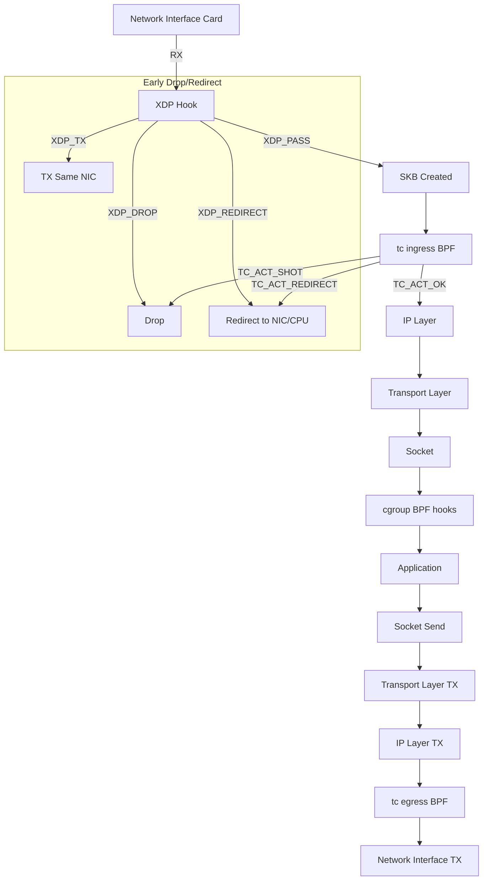
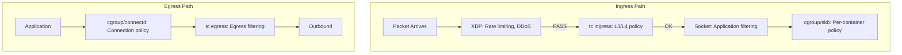

# Chapter 188: eBPF for Networking — XDP, tc BPF, Socket Filter, cgroup Hooks, sk_lookup

## 1. Introduction and Intuition

eBPF's networking capabilities are among its most powerful and widely-deployed features. From high-performance packet processing at the XDP (eXpress Data Path) level to traffic control, socket filtering, and cgroup-based policies, eBPF provides a programmable networking stack that operates at every layer.

The intuition behind eBPF networking is **programmable packet processing**. Instead of hard-coded kernel networking logic or slow user-space packet processing, eBPF programs can:

- Inspect and modify packets at line rate (XDP, before the kernel stack)
- Apply traffic shaping and classification (tc BPF)
- Filter packets at the socket level (socket filters)
- Enforce network policies per cgroup (cgroup hooks)
- Perform socket lookups for transparent proxying (sk_lookup)

This gives rise to projects like Cilium (Kubernetes CNI), Katran (Facebook's L4 load balancer), and Cloudflare's DDoS mitigation — all built on eBPF networking.

## 2. Networking Hook Points

### 2.1 Packet Processing Pipeline



### 2.2 Comparison of Networking Hooks

| Hook | Layer | SKB? | Modify Packet? | Redirect? | Use Case |
|---|---|---|---|---|---|
| XDP | NIC driver | No (xdp_buff) | Yes | Yes | DDoS, LB, firewall |
| tc ingress | After L2 | Yes | Yes | Yes | Policy, NAT, monitoring |
| tc egress | Before TX | Yes | Yes | No | Egress policy, shaping |
| Socket filter | Socket | Yes | No | No | Application filtering |
| cgroup (sock_addr) | Pre-connect | No | Modify addr | No | Policy, proxying |
| cgroup (skb) | Per-packet | Yes | Yes | No | Per-container policy |
| sk_lookup | Pre-socket | No | Select socket | No | Proxying, multi-listener |

## 3. XDP (eXpress Data Path)

### 3.1 What is XDP?

XDP is the **earliest hook point** in the networking stack — it runs before the kernel allocates an `sk_buff` (socket buffer). This makes it extremely fast:

```c
// xdp_example.bpf.c
#include <linux/bpf.h>
#include <bpf/bpf_helpers.h>

SEC("xdp")
int xdp_drop_tcp(struct xdp_md *ctx)
{
    void *data = (void *)(long)ctx->data;
    void *data_end = (void *)(long)ctx->data_end;

    struct ethhdr *eth = data;
    if ((void *)(eth + 1) > data_end)
        return XDP_PASS;

    if (eth->h_proto != bpf_htons(ETH_P_IP))
        return XDP_PASS;

    struct iphdr *iph = (void *)(eth + 1);
    if ((void *)(iph + 1) > data_end)
        return XDP_PASS;

    if (iph->protocol == IPPROTO_TCP)
        return XDP_DROP;  /* Drop all TCP packets */

    return XDP_PASS;
}

char LICENSE[] SEC("license") = "GPL";
```

### 3.2 XDP Actions

| Action | Behavior | Performance |
|---|---|---|
| `XDP_DROP` | Drop packet immediately | ~14 Mpps (million packets/sec) |
| `XDP_PASS` | Pass to normal kernel stack | Normal stack performance |
| `XDP_TX` | Send back out same NIC | ~14 Mpps |
| `XDP_REDIRECT` | Redirect to another NIC/CPU | ~14 Mpps |
| `XDP_ABORTED` | Drop + signal error | Debug use only |

### 3.3 XDP Modes

XDP operates in different modes depending on the NIC driver:

1. **Native XDP**: Driver implements XDP natively (best performance)
2. **Offloaded XDP**: Runs on SmartNIC/FPGA (highest performance)
3. **Generic XDP**: Runs in the kernel stack (slowest, for testing)

```bash
# Check XDP mode
ip link show eth0
# Look for "xdp" in output

# Attach XDP program
ip link set dev eth0 xdp obj xdp_prog.o sec xdp

# Attach in SKB mode (generic)
ip link set dev eth0 xdp obj xdp_prog.o sec xdp verbose

# Detach
ip link set dev eth0 xdp off
```

### 3.4 XDP Multi-Buffer (Linux 5.18+)

For jumbo frames or packets spanning multiple pages:

```c
SEC("xdp")
int xdp_mb_example(struct xdp_md *ctx)
{
    /* Access first fragment */
    void *data = (void *)(long)ctx->data;
    void *data_end = (void *)(long)ctx->data_end;
    
    /* For multi-buffer, use bpf_xdp_get_buff_len */
    u64 total_len = bpf_xdp_get_buff_len(ctx);
    
    return XDP_PASS;
}
```

### 3.5 XDP with Metadata

XDP can pass metadata to the TC or socket layer:

```c
SEC("xdp")
int xdp_set_meta(struct xdp_md *ctx)
{
    void *data = (void *)(long)ctx->data;
    void *data_meta = (void *)(long)ctx->data_meta;
    
    /* Store metadata before the packet data */
    if (data_meta + sizeof(u32) > data)
        return XDP_PASS;
    
    *(u32 *)data_meta = 42;  /* custom metadata */
    
    return XDP_PASS;
}
```

## 4. tc (Traffic Control) BPF

### 4.1 tc BPF Programs

tc BPF programs run at the traffic control layer, after SKB allocation:

```c
// tc_example.bpf.c
#include <linux/bpf.h>
#include <bpf/bpf_helpers.h>

SEC("tc")
int tc_ingress(struct __sk_buff *skb)
{
    void *data = (void *)(long)skb->data;
    void *data_end = (void *)(long)skb->data_end;

    struct ethhdr *eth = data;
    if ((void *)(eth + 1) > data_end)
        return TC_ACT_OK;

    /* Classify: mark packets from specific MAC */
    if (eth->h_source[0] == 0x00 && eth->h_source[1] == 0x11) {
        skb->mark = 42;  /* Set skb mark for QoS */
    }

    return TC_ACT_OK;
}

char LICENSE[] SEC("license") = "GPL";
```

### 4.2 tc Actions

| Action | Value | Behavior |
|---|---|---|
| `TC_ACT_OK` | 0 | Accept packet |
| `TC_ACT_SHOT` | 2 | Drop packet |
| `TC_ACT_REDIRECT` | 7 | Redirect to another interface |
| `TC_ACT_STOLEN` | 4 | Consume packet (don't free) |
| `TC_ACT_PIPE` | 3 | Continue to next filter |

### 4.3 Attaching tc BPF Programs

```bash
# Using iproute2
tc qdisc add dev eth0 clsact
tc filter add dev eth0 ingress bpf da obj tc_prog.o sec tc
tc filter add dev eth0 egress bpf da obj tc_prog.o sec tc

# Using bpftool
bpftool net attach tc_ingress tc_prog.o sec tc dev eth0

# List attached programs
bpftool net list dev eth0
```

### 4.4 tc BPF for NAT and Encapsulation

```c
SEC("tc")
int tc_nat(struct __sk_buff *skb)
{
    void *data = (void *)(long)skb->data;
    void *data_end = (void *)(long)skb->data_end;

    struct ethhdr *eth = data;
    if ((void *)(eth + 1) > data_end)
        return TC_ACT_OK;

    if (eth->h_proto != bpf_htons(ETH_P_IP))
        return TC_ACT_OK;

    struct iphdr *iph = (void *)(eth + 1);
    if ((void *)(iph + 1) > data_end)
        return TC_ACT_OK;

    /* DNAT: redirect to backend server */
    if (iph->daddr == bpf_htonl(VIP)) {
        iph->daddr = bpf_htonl(BACKEND_IP);
        bpf_l4_csum_replace(skb, offsetof(struct tcphdr, check),
                            bpf_htonl(VIP), bpf_htonl(BACKEND_IP),
                            BPF_F_PSEUDO_HDR | 4);
        bpf_l3_csum_replace(skb, offsetof(struct iphdr, check),
                            bpf_htonl(VIP), bpf_htonl(BACKEND_IP), 4);
    }

    return TC_ACT_OK;
}
```

## 5. Socket Filters

### 5.1 Classic BPF Socket Filters

Socket filters are the original BPF use case — filtering packets at the socket level:

```c
// socket_filter.bpf.c
#include <linux/bpf.h>
#include <bpf/bpf_helpers.h>

SEC("socket")
int socket_filter(struct __sk_buff *skb)
{
    /* Only accept packets on port 80 */
    void *data = (void *)(long)skb->data;
    void *data_end = (void *)(long)skb->data_end;

    struct ethhdr *eth = data;
    if ((void *)(eth + 1) > data_end)
        return SK_DROP;

    if (eth->h_proto != bpf_htons(ETH_P_IP))
        return SK_DROP;

    struct iphdr *iph = (void *)(eth + 1);
    if ((void *)(iph + 1) > data_end)
        return SK_DROP;

    if (iph->protocol != IPPROTO_TCP)
        return SK_DROP;

    struct tcphdr *tcp = (void *)(iph + 1);
    if ((void *)(tcp + 1) > data_end)
        return SK_DROP;

    if (tcp->dest == bpf_htons(80))
        return SK_PASS;

    return SK_DROP;
}
```

### 5.2 Attaching Socket Filters

```c
// User space
int sock = socket(AF_INET, SOCK_STREAM, 0);

int prog_fd = bpf_prog_load(BPF_PROG_TYPE_SOCKET_FILTER,
                             prog, prog_size, license);
setsockopt(sock, SOL_SOCKET, SO_ATTACH_BPF, &prog_fd, sizeof(prog_fd));
```

### 5.3 Unix Domain Socket Filter

For inter-process communication:

```c
SEC("sk_skb/stream_verdict")
int stream_verdict(struct __sk_buff *skb)
{
    /* Inspect data on Unix socket */
    return SK_PASS;
}
```

## 6. cgroup BPF Hooks

### 6.1 Per-Container Network Policy

cgroup BPF programs apply to all sockets in a cgroup:

```c
// cgroup_connect4 — runs before IPv4 connect()
SEC("cgroup/connect4")
int cgroup_connect4(struct bpf_sock_addr *ctx)
{
    /* Block connections to specific IP */
    if (ctx->user_ip4 == bpf_htonl(0xC0A80101)) /* 192.168.1.1 */
        return 0;  /* deny */

    /* Redirect to proxy */
    if (ctx->user_port == bpf_htons(80)) {
        ctx->user_ip4 = bpf_htonl(0x7F000001);  /* 127.0.0.1 */
        ctx->user_port = bpf_htons(8080);        /* proxy port */
    }

    return 1;  /* allow */
}
```

### 6.2 cgroup Program Types

| Type | Hook Point | Use Case |
|---|---|---|
| `cgroup/connect4` | IPv4 connect() | Policy, proxying |
| `cgroup/connect6` | IPv6 connect() | Policy, proxying |
| `cgroup/sendmsg4` | IPv4 sendmsg() | Egress filtering |
| `cgroup/sendmsg6` | IPv6 sendmsg() | Egress filtering |
| `cgroup/recvmsg4` | IPv4 recvmsg() | Ingress filtering |
| `cgroup/recvmsg6` | IPv6 recvmsg() | Ingress filtering |
| `cgroup/getsockopt` | getsockopt() | Option inspection |
| `cgroup/setsockopt` | setsockopt() | Option restriction |
| `cgroup/post_bind4` | After IPv4 bind() | Port restriction |
| `cgroup/post_bind6` | After IPv6 bind() | Port restriction |
| `cgroup/sock_ops` | Socket operations | TCP monitoring |
| `cgroup/skb` | Per-packet | Fine-grained policy |

### 6.3 Attaching to cgroups

```bash
# Create a cgroup
mkdir /sys/fs/cgroup/my_container

# Attach BPF program
bpftool cgroup attach /sys/fs/cgroup/my_container connect4 \
    pinned /sys/fs/bpf/prog_connect

# List attached programs
bpftool cgroup list /sys/fs/cgroup/my_container
```

### 6.4 Multi-prog cgroup Programs

Multiple BPF programs can be attached to a cgroup:

```c
/* Using BPF_F_ALLOW_MULTI flag */
bpf_link_create(prog_fd, cgroup_fd, BPF_CGROUP_INET4_CONNECT,
                BPF_F_ALLOW_MULTI);
```

Evaluation order: most recently attached program runs first. If it returns `1` (allow), the next program runs. If it returns `0` (deny), the connection is blocked.

## 7. sk_lookup

### 7.1 Multi-Listener Socket Lookup

`sk_lookup` (Linux 5.9) allows intercepting socket lookups to implement transparent proxying:

```c
SEC("sk_lookup")
int sk_lookup_prog(struct bpf_sk_lookup *ctx)
{
    struct bpf_sock *sk;
    struct bpf_sock_tuple tuple = {};

    /* Get the destination tuple */
    tuple.ipv4.saddr = ctx->local_ip4;
    tuple.ipv4.daddr = ctx->remote_ip4;
    tuple.ipv4.sport = ctx->local_port;
    tuple.ipv4.dport = bpf_htons(80);

    /* Look up socket */
    sk = bpf_sk_lookup_tcp(ctx, &tuple, sizeof(tuple.ipv4),
                            ctx->netns, 0);
    if (sk) {
        /* Redirect to specific socket */
        bpf_sk_assign(ctx, sk, 0);
        bpf_sk_release(sk);
    }

    return SK_PASS;
}
```

### 7.2 Use Cases

- **Transparent proxying**: Intercept connections and redirect to proxy
- **Multi-listener**: Multiple processes listening on the same port
- **Connection routing**: Route connections based on L7 data

### 7.3 Socket Destruction Hooks

```c
SEC("sk_skb/stream_parser")
int stream_parser(struct __sk_buff *skb)
{
    /* Parse application-layer data */
    return skb->len;
}

SEC("sk_skb/stream_verdict")
int stream_verdict(struct __sk_buff *skb)
{
    /* Route parsed data to different sockets */
    return bpf_sk_redirect_map(skb, &sock_map, key, 0);
}
```

## 8. sock_ops

### 8.1 TCP Monitoring

sock_ops provides hooks into TCP state machine:

```c
// sock_ops_example.bpf.c
SEC("sockops")
int sock_ops_handler(struct bpf_sock_ops *skops)
{
    switch (skops->op) {
    case BPF_SOCK_OPS_TCP_CONNECT_CB:
        /* New TCP connection */
        u32 key = skops->remote_ip4;
        u64 ts = bpf_ktime_get_ns();
        bpf_map_update_elem(&conn_start, &key, &ts, BPF_ANY);
        break;

    case BPF_SOCK_OPS_RTT_CB:
        /* RTT measurement available */
        u32 rtt = skops->args[0];  /* smoothed RTT in usec */
        /* Record RTT */
        break;

    case BPF_SOCK_OPS_STATE_CB:
        /* TCP state change */
        if (skops->args[1] == BPF_TCP_CLOSE) {
            /* Connection closed */
        }
        break;
    }
    return 1;
}
```

### 8.2 sock_ops Operations

| Operation | Trigger | Use Case |
|---|---|---|
| `BPF_SOCK_OPS_TCP_CONNECT_CB` | TCP connect | Connection tracking |
| `BPF_SOCK_OPS_ACTIVE_ESTABLISHED_CB` | Active open complete | Latency measurement |
| `BPF_SOCK_OPS_PASSIVE_ESTABLISHED_CB` | Passive open complete | Accept tracking |
| `BPF_SOCK_OPS_RTT_CB` | RTT update | Network monitoring |
| `BPF_SOCK_OPS_RETRANS_CB` | Retransmission | Reliability monitoring |
| `BPF_SOCK_OPS_STATE_CB` | State change | Connection lifecycle |
| `BPF_SOCK_OPS_WRITE_HDR_OPT_CB` | Write TCP options | Custom TCP options |
| `BPF_SOCK_OPS_PARSE_HDR_OPT_CB` | Parse TCP options | Custom TCP options |

## 9. Network Policy Enforcement

### 9.1 Combining Hooks for Full Policy



### 9.2 Kubernetes Network Policy with eBPF

```c
/* Cilium-style network policy */
SEC("cgroup/skb")
int network_policy(struct __sk_buff *skb)
{
    /* Get source/dest labels from metadata */
    u32 src_identity = get_identity(skb);
    u32 dst_identity = get_dst_identity(skb);

    /* Check policy map */
    struct policy_key key = {
        .src = src_identity,
        .dst = dst_identity,
    };

    struct policy_entry *entry = bpf_map_lookup_elem(&policy_map, &key);
    if (!entry)
        return 0;  /* deny by default */

    return entry->allow;
}
```

## 10. Performance Considerations

### 10.1 XDP vs Kernel Stack

| Metric | XDP | Kernel Stack |
|---|---|---|
| Packets/sec | ~14 Mpps | ~1-2 Mpps |
| Latency | ~1 µs | ~10-50 µs |
| CPU usage | 1 core | Multiple cores |
| Features | Basic L2-L4 | Full stack |

### 10.2 XDP Performance Optimization

```c
/* Use direct packet access (DPA) for best performance */
SEC("xdp")
int xdp_fast(struct xdp_md *ctx)
{
    /* DPA: direct pointer access, no bpf_skb_load_bytes */
    void *data = (void *)(long)ctx->data;
    void *data_end = (void *)(long)ctx->data_end;

    struct ethhdr *eth = data;
    if ((void *)(eth + 1) > data_end)
        return XDP_PASS;

    /* Bounds-checked direct access is fastest */
    return XDP_PASS;
}
```

### 10.3 Avoiding Packet Copy

```c
/* Bad: copying packet data */
char buf[256];
bpf_skb_load_bytes(skb, 0, buf, sizeof(buf));

/* Good: direct pointer access with bounds checking */
struct iphdr *iph = data + sizeof(struct ethhdr);
if ((void *)(iph + 1) > data_end)
    return XDP_PASS;
```

### 10.4 XDP Performance Benchmarks

Typical performance characteristics on modern hardware:

| Operation | Latency | Throughput |
|---|---|---|
| XDP_DROP | ~0.1 µs | ~14 Mpps |
| XDP_PASS | ~1 µs | ~10 Mpps |
| XDP_TX | ~0.5 µs | ~12 Mpps |
| XDP_REDIRECT | ~0.5 µs | ~12 Mpps |
| tc BPF | ~2 µs | ~5 Mpps |
| Kernel stack | ~10 µs | ~1-2 Mpps |

### 10.5 CPU Affinity and NUMA

```c
/* Pin XDP processing to specific CPUs */
int cpu = bpf_get_smp_processor_id();

/* Use per-CPU maps for statistics */
struct {
    __uint(type, BPF_MAP_TYPE_PERCPU_ARRAY);
    __uint(max_entries, 1);
    __type(key, u32);
    __type(value, u64);
} stats SEC(".maps");

/* No atomics needed for per-CPU access */
u32 key = 0;
u64 *val = bpf_map_lookup_elem(&stats, &key);
if (val)
    (*val)++;
```

## 11. Security Considerations

### 11.1 Privilege Requirements

- **XDP**: Requires `CAP_SYS_ADMIN` or `CAP_BPF` + `CAP_NET_ADMIN`
- **tc BPF**: Requires `CAP_SYS_ADMIN` or `CAP_BPF` + `CAP_NET_ADMIN`
- **Socket filter**: Requires `CAP_SYS_ADMIN` or `CAP_NET_ADMIN`
- **cgroup BPF**: Requires `CAP_SYS_ADMIN` on the cgroup

### 11.2 Packet Modification Safety

The verifier ensures:
- Packet modifications don't cause buffer overflows
- Header adjustments maintain packet integrity
- Checksums are properly updated

## 12. Common Pitfalls

### 12.1 Missing Bounds Checks

```c
/* Bad: no bounds check before access */
struct iphdr *iph = data + sizeof(struct ethhdr);
u8 proto = iph->protocol;  /* verifier rejects! */

/* Good: bounds check first */
struct iphdr *iph = data + sizeof(struct ethhdr);
if ((void *)(iph + 1) > data_end)
        return XDP_PASS;
u8 proto = iph->protocol;  /* OK */
```

### 12.2 Forgetting Checksum Updates

```c
/* Bad: modify IP without updating checksum */
iph->daddr = new_addr;  /* checksum now wrong! */

/* Good: update checksum */
__be32 old_addr = iph->daddr;
iph->daddr = new_addr;
iph->check = csum_diff4(old_addr, new_addr, iph->check);
```

### 12.3 Wrong Return Value

```c
/* Bad: return 0 from XDP (not XDP_PASS) */
SEC("xdp")
int xdp_prog(struct xdp_md *ctx) {
    return 0;  /* This is XDP_ABORTED, not XDP_PASS! */
}
```

## 13. Best Practices

1. **Use XDP for high-throughput filtering**: Drop bad packets before SKB allocation
2. **Use tc BPF for L3/L4 policy**: Full SKB access, header modification
3. **Use cgroup BPF for container policy**: Per-cgroup isolation
4. **Use sk_lookup for transparent proxying**: Clean multi-listener support
5. **Bounds-check all packet access**: The verifier requires it
6. **Update checksums incrementally**: Avoid full checksum recalculation
7. **Use direct packet access**: Don't copy packet data unnecessarily
8. **Test with `bpftool prog run xdp`**: Validate XDP programs before attaching

## 14. Exercises

### Exercise 1: XDP Firewall

Write an XDP program that:
- Drops packets from a specific source IP
- Rate-limits new connections
- Forwards allowed packets

### Exercise 2: tc NAT

Implement a simple DNAT using tc BPF that redirects web traffic to a backend server.

### Exercise 3: cgroup Network Policy

Create a cgroup BPF program that:
- Blocks all outbound connections except to specific IPs
- Redirects DNS queries to a local resolver

## 15. XDP Internals

### 15.1 xdp_buff Structure

The XDP buffer is a lightweight packet representation:

```c
struct xdp_buff {
    void *data;           /* Start of packet data */
    void *data_end;       /* End of packet data */
    void *data_meta;      /* Start of metadata (before data) */
    struct net_device *rxq->dev;  /* Receive device */
    u32 rxq_index;        /* RX queue index */
    u32 ingress_ifindex;  /* Ingress interface */
    __u32 flags;          /* XDP_FLAGS_* */
};
```

### 15.2 XDP Driver Integration

Each NIC driver implements XDP support:

```c
/* Driver registers XDP ops */
static const struct net_device_ops my_netdev_ops = {
    .ndo_bpf = my_xdp_setup,    /* Attach/detach XDP program */
    .ndo_xdp_xmit = my_xdp_xmit, /* Handle XDP_TX/REDIRECT */
    /* ... */
};

/* XDP setup function */
static int my_xdp_setup(struct net_device *dev, struct netdev_bpf *bpf)
{
    switch (bpf->command) {
    case XDP_SETUP_PROG:
        /* Install XDP program on all RX queues */
        for (i = 0; i < dev->num_rx_queues; i++) {
            struct my_rx_queue *rxq = &priv->rxq[i];
            rcu_assign_pointer(rxq->xdp_prog, bpf->prog);
        }
        break;
    }
    return 0;
}
```

### 15.3 Packet Processing in XDP

```c
/* Driver RX path with XDP */
static int my_rx_poll(struct napi_struct *napi, int budget)
{
    struct bpf_prog *xdp_prog = rcu_dereference(rxq->xdp_prog);
    
    while (packets < budget) {
        struct xdp_buff xdp;
        
        /* Set up XDP buffer from DMA ring */
        xdp.data = page_address(page) + offset;
        xdp.data_end = xdp.data + pkt_len;
        
        if (xdp_prog) {
            u32 act = bpf_prog_run_xdp(xdp_prog, &xdp);
            switch (act) {
            case XDP_PASS:
                /* Continue to normal stack */
                break;
            case XDP_DROP:
                /* Free packet */
                free_page(page);
                continue;
            case XDP_TX:
                /* Send back on same NIC */
                my_xdp_tx(dev, &xdp);
                continue;
            case XDP_REDIRECT:
                /* Redirect to another NIC/CPU */
                xdp_do_redirect(dev, &xdp, xdp_prog);
                continue;
            }
        }
        
        /* Build SKB and pass to stack */
        skb = build_skb(xdp.data, ...);
        napi_gro_receive(napi, skb);
    }
}
```

## 16. References

1. **XDP documentation**: `Documentation/networking/xdp.rst`
2. **tc BPF documentation**: `Documentation/bpf/prog_tc.rst`
3. **cgroup BPF documentation**: `Documentation/bpf/prog_cgroup.rst`
4. **sk_lookup documentation**: `Documentation/bpf/prog_sk_lookup.rst`
5. **Cilium BPF documentation**: https://docs.cilium.io/en/latest/bpf/
6. **Facebook Katran**: https://github.com/facebookincubator/katran
7. **Cloudflare eBPF**: https://blog.cloudflare.com/
8. **xdp-project**: https://github.com/xdp-project/xdp-tutorial
9. **"Linux Kernel Networking" by Rami Rosen**: Apress
10. **IOVisor XDP tutorial**: https://github.com/xdp-project/xdp-tutorial
