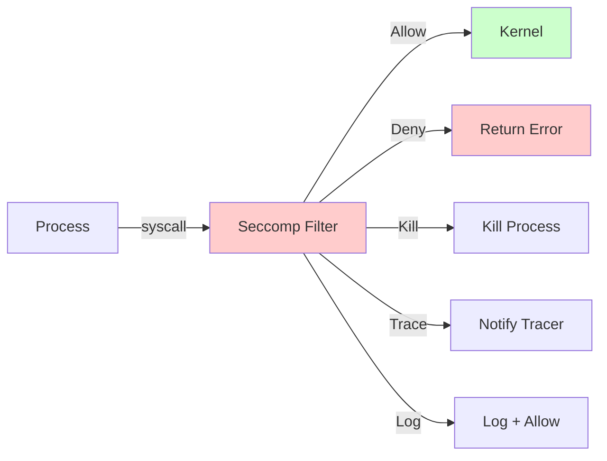
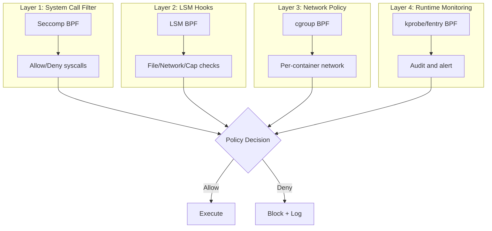

# Chapter 189: eBPF for Security — Seccomp BPF, LSM BPF, Capability Checks, Task Security

## 1. Introduction and Intuition

eBPF has emerged as a powerful tool for implementing security mechanisms in the Linux kernel. Unlike traditional security modules that require kernel code changes and recompilation, eBPF allows **dynamic, programmable security policies** that can be loaded, updated, and removed at runtime without rebooting.

The security applications of eBPF include:

- **Seccomp BPF**: Filtering system calls with BPF programs
- **LSM BPF**: Hooking into Linux Security Module framework for comprehensive policy enforcement
- **Capability checks**: Fine-grained privilege management
- **Task security**: Process-level security enforcement

Think of eBPF security as a **programmable firewall for the kernel itself** — it can inspect and control any action before it executes, making decisions based on complex logic rather than static rules.

## 2. Seccomp BPF

### 2.1 What is Seccomp?

Seccomp (Secure Computing Mode) is a Linux kernel feature that restricts the system calls a process can make. Combined with BPF, it becomes **Seccomp BPF** — a mechanism to filter syscalls using BPF programs.



### 2.2 Seccomp BPF Program Structure

Seccomp BPF programs use cBPF (classic BPF) or eBPF with `BPF_PROG_TYPE_SECCOMP`:

```c
// seccomp_filter.c (eBPF version)
#include <linux/bpf.h>
#include <linux/seccomp.h>
#include <bpf/bpf_helpers.h>

SEC("seccomp")
int seccomp_filter(struct seccomp_data *sd)
{
    /* sd contains syscall info */
    switch (sd->nr) {
    case __NR_read:
    case __NR_write:
    case __NR_exit:
    case __NR_exit_group:
        return SECCOMP_RET_ALLOW;

    case __NR_openat:
        /* Allow only specific flags */
        if (sd->args[2] & O_CREAT)
            return SECCOMP_RET_ERRNO | EACCES;
        return SECCOMP_RET_ALLOW;

    case __NR_execve:
        /* Log and allow */
        return SECCOMP_RET_LOG;

    default:
        /* Deny everything else */
        return SECCOMP_RET_ERRNO | EPERM;
    }
}

char LICENSE[] SEC("license") = "GPL";
```

### 2.3 Seccomp Return Values

| Return | Behavior |
|---|---|
| `SECCOMP_RET_KILL_PROCESS` | Kill the entire process |
| `SECCOMP_RET_KILL_THREAD` | Kill the offending thread |
| `SECCOMP_RET_TRAP` | Send SIGSYS to the process |
| `SECCOMP_RET_ERRNO` | Return errno to caller |
| `SECCOMP_RET_USER_NOTIF` | Forward to user-space supervisor |
| `SECCOMP_RET_TRACE` | Notify ptrace tracer |
| `SECCOMP_RET_LOG` | Log the syscall and allow |
| `SECCOMP_RET_ALLOW` | Allow the syscall |

### 2.4 Applying Seccomp Filters

```c
#include <linux/seccomp.h>
#include <linux/filter.h>
#include <linux/bpf.h>
#include <sys/prctl.h>

/* Load BPF program */
int prog_fd = bpf_prog_load(BPF_PROG_TYPE_SECCOMP, ...);

/* Install filter */
struct sock_fprog prog = { ... };  /* for cBPF */

/* Method 1: prctl */
prctl(PR_SET_NO_NEW_PRIVS, 1, 0, 0, 0);
prctl(PR_SET_SECCOMP, SECCOMP_MODE_FILTER, &prog);

/* Method 2: seccomp() syscall */
seccomp(SECCOMP_SET_MODE_FILTER, 0, &prog);

/* Method 3: with eBPF */
seccomp(SECCOMP_SET_MODE_FILTER, SECCOMP_FILTER_FLAG_NEW_LISTENER, &prog_attr);
```

### 2.5 Seccomp User Notification (Linux 5.0+)

Forward syscall decisions to a supervisor process:

```c
/* Container supervisor */
int listener = seccomp(SECCOMP_SET_MODE_FILTER,
                        SECCOMP_FILTER_FLAG_NEW_LISTENER, &prog);

/* Monitor for notifications */
struct seccomp_notif *req;
struct seccomp_notif_resp *resp;

while (1) {
    ioctl(listener, SECCOMP_IOCTL_NOTIF_RECV, req);
    
    /* Decide based on process context */
    if (should_allow(req)) {
        resp->id = req->id;
        resp->error = 0;
        resp->val = 0;
    } else {
        resp->id = req->id;
        resp->error = -EPERM;
    }
    
    ioctl(listener, SECCOMP_IOCTL_NOTIF_SEND, resp);
}
```

## 3. LSM BPF

### 3.1 Linux Security Module Hooks

LSM (Linux Security Module) BPF (introduced in Linux 5.7) allows attaching eBPF programs to LSM hooks — the same hooks used by AppArmor, SELinux, and Smack:

```c
// lsm_example.bpf.c
#include <vmlinux.h>
#include <bpf/bpf_helpers.h>
#include <bpf/bpf_tracing.h>

char LICENSE[] SEC("license") = "GPL";

/* Block access to sensitive files */
SEC("lsm/file_open")
int BPF_PROG(restrict_file_open, struct file *file)
{
    struct path path = file->f_path;
    char buf[256];
    char *p;

    /* Get the file path */
    p = bpf_d_path(&path, buf, sizeof(buf));
    if (!p)
        return 0;

    /* Block access to /etc/shadow */
    if (bpf_strncmp(buf, 11, "/etc/shadow") == 0) {
        /* Log the attempt */
        bpf_printk("Blocked access to /etc/shadow by pid %d",
                    bpf_get_current_pid_tgid() >> 32);
        return -EACCES;
    }

    return 0;  /* allow */
}

/* Restrict socket creation */
SEC("lsm/socket_create")
int BPF_PROG(restrict_socket, int family, int type, int protocol)
{
    /* Only allow TCP and UDP */
    if (type != SOCK_STREAM && type != SOCK_DGRAM)
        return -EACCES;

    /* Only allow IPv4 and IPv6 */
    if (family != AF_INET && family != AF_INET6)
        return -EACCES;

    return 0;
}

/* Control capability checks */
SEC("lsm/capable")
int BPF_PROG(restrict_capable, const struct cred *cred,
             struct user_namespace *targ_ns, int cap, unsigned int opts)
{
    u32 pid = bpf_get_current_pid_tgid() >> 32;

    /* Block CAP_SYS_ADMIN for specific PIDs */
    if (cap == CAP_SYS_ADMIN) {
        u32 *blocked = bpf_map_lookup_elem(&blocked_pids, &pid);
        if (blocked)
            return -EPERM;
    }

    return 0;
}
```

### 3.2 LSM BPF Attachment

```bash
# Load and attach LSM BPF program
bpftool prog load lsm_prog.o /sys/fs/bpf/lsm_prog type lsm

# List attached LSM programs
bpftool prog list type lsm

# Attach to specific hook
bpftool perf attach pinned /sys/fs/bpf/lsm_prog lsm
```

### 3.3 LSM BPF Program Types

| Hook | Trigger | Use Case |
|---|---|---|
| `lsm/file_open` | File open | File access control |
| `lsm/file_permission` | File permission check | Fine-grained file policy |
| `lsm/bprm_check_security` | Executable loading | Exec control |
| `lsm/socket_create` | Socket creation | Network policy |
| `lsm/socket_connect` | Socket connect | Outbound policy |
| `lsm/socket_bind` | Socket bind | Port restriction |
| `lsm/task_alloc` | Task creation | Process policy |
| `lsm/task_kill` | Signal delivery | Signal policy |
| `lsm/capable` | Capability check | Privilege restriction |
| `lsm/inode_create` | File/directory creation | Filesystem policy |
| `lsm/bpf_prog` | BPF program load | Meta-security |

### 3.4 BPF LSM vs Traditional LSM

| Feature | BPF LSM | Traditional LSM |
|---|---|---|
| Runtime loading | Yes | No (compile-time) |
| Policy update | Hot reload | Reboot |
| Complexity | Full BPF programmability | Fixed hooks |
| Performance | JIT compiled | Compiled-in |
| Kernel version | 5.7+ | Varies |
| Policy language | C/BPF | Domain-specific |

## 4. Capability Checks

### 4.1 Linux Capabilities

Linux capabilities split root privileges into distinct units:

```c
// Key capabilities for eBPF
CAP_BPF           // Load BPF programs (Linux 5.8+)
CAP_PERFMON       // Attach to perf events (Linux 5.8+)
CAP_NET_ADMIN     // Network administration
CAP_SYS_ADMIN     // Broad system administration
CAP_NET_RAW       // Raw socket access
CAP_IPC_LOCK      // IPC memory locking
```

### 4.2 Capability Enforcement in BPF

```c
SEC("lsm/capable")
int BPF_PROG(check_cap, const struct cred *cred,
             struct user_namespace *targ_ns, int cap, unsigned int opts)
{
    u32 pid = bpf_get_current_pid_tgid() >> 32;
    u32 uid = bpf_get_current_uid_gid();

    /* Root can do anything */
    if (uid == 0)
        return 0;

    /* Allow specific capabilities for specific processes */
    struct cap_entry *entry = bpf_map_lookup_elem(&allowed_caps, &pid);
    if (entry) {
        if (entry->caps & (1ULL << cap))
            return 0;
    }

    /* Deny by default */
    return -EPERM;
}
```

### 4.3 eBPF Capability Requirements

```c
/* For loading BPF programs */
CAP_BPF + CAP_PERFMON    // Tracing programs
CAP_BPF + CAP_NET_ADMIN  // Networking programs
CAP_SYS_ADMIN            // Legacy (pre-5.8) all access

/* For attaching to hooks */
CAP_NET_ADMIN            // XDP, TC, cgroup networking
CAP_SYS_ADMIN            // kprobes, LSM, seccomp
CAP_PERFMON              // Perf events, tracepoints
```

## 5. Task Security

### 5.1 Process-Level Security Enforcement

BPF can enforce security at the process level:

```c
SEC("lsm/task_alloc")
int BPF_PROG(restrict_task_alloc, struct task_struct *task,
             unsigned long clone_flags)
{
    u32 parent_pid = bpf_get_current_pid_tgid() >> 32;

    /* Limit number of child processes */
    u32 *count = bpf_map_lookup_elem(&child_count, &parent_pid);
    if (count && *count >= MAX_CHILDREN) {
        bpf_printk("Process %d exceeded child limit", parent_pid);
        return -EAGAIN;
    }

    if (count)
        __sync_fetch_and_add(count, 1);
    else {
        u32 one = 1;
        bpf_map_update_elem(&child_count, &parent_pid, &one, BPF_ANY);
    }

    return 0;
}
```

### 5.2 Exec Control

```c
SEC("lsm/bprm_check_security")
int BPF_PROG(restrict_exec, struct linux_binprm *bprm)
{
    char filename[256];
    bpf_probe_read_kernel_str(filename, sizeof(filename),
                               bprm->filename);

    /* Whitelist approach: only allow specific binaries */
    struct allowed_bin *entry = bpf_map_lookup_elem(&bin_whitelist, filename);
    if (!entry) {
        bpf_printk("Blocked exec of %s by pid %d",
                    filename, bpf_get_current_pid_tgid() >> 32);
        return -EACCES;
    }

    return 0;
}
```

### 5.3 Signal Control

```c
SEC("lsm/task_kill")
int BPF_PROG(restrict_signal, struct task_struct *p,
             struct kernel_siginfo *info, int sig,
             const struct cred *cred)
{
    u32 src_pid = bpf_get_current_pid_tgid() >> 32;
    u32 dst_pid = p->pid;

    /* Block signals between different security domains */
    u32 *src_domain = bpf_map_lookup_elem(&process_domains, &src_pid);
    u32 *dst_domain = bpf_map_lookup_elem(&process_domains, &dst_pid);

    if (src_domain && dst_domain && *src_domain != *dst_domain) {
        /* Allow only SIGKILL from init */
        if (src_pid != 1)
            return -EPERM;
    }

    return 0;
}
```

## 6. Advanced Security Patterns

### 6.1 Multi-Layer Security



### 6.2 Container Security

```c
/* Comprehensive container security BPF program */

/* 1. Seccomp: restrict syscalls */
SEC("seccomp")
int container_seccomp(struct seccomp_data *sd)
{
    switch (sd->nr) {
    case __NR_read: case __NR_write: case __NR_close:
    case __NR_fstat: case __NR_mmap: case __NR_mprotect:
    case __NR_munmap: case __NR_brk:
        return SECCOMP_RET_ALLOW;
    default:
        return SECCOMP_RET_ERRNO | EPERM;
    }
}

/* 2. LSM: file access control */
SEC("lsm/file_open")
int container_file_open(struct file *file)
{
    char buf[256];
    char *p = bpf_d_path(&file->f_path, buf, sizeof(buf));
    if (!p) return 0;

    /* Only allow access within container root */
    if (bpf_strncmp(buf, 15, "/container/root") != 0)
        return -EACCES;

    return 0;
}

/* 3. cgroup: network policy */
SEC("cgroup/connect4")
int container_net_policy(struct bpf_sock_addr *ctx)
{
    /* Block connections outside container network */
    u32 dst = ctx->user_ip4;
    if ((dst & bpf_htonl(0xFF000000)) != bpf_htonl(0x0A000000))
        return 0;  /* deny non-10.x.x.x */

    return 1;
}
```

### 6.3 Runtime Anomaly Detection

```c
SEC("fentry/do_sys_openat2")
int BPF_PROG(audit_file_access, int dfd, const char *pathname,
             struct open_how *how)
{
    u32 pid = bpf_get_current_pid_tgid() >> 32;
    u64 ts = bpf_ktime_get_ns();

    /* Track file access patterns per process */
    struct access_pattern *pattern = bpf_map_lookup_elem(&patterns, &pid);
    if (!pattern) {
        struct access_pattern new_pattern = { .count = 1, .last_ts = ts };
        bpf_map_update_elem(&patterns, &pid, &new_pattern, BPF_ANY);
        return 0;
    }

    /* Detect anomalous access rates */
    if (ts - pattern->last_ts < 1000000) {  /* < 1ms between accesses */
        pattern->burst_count++;
        if (pattern->burst_count > 100) {
            /* Alert: possible file scanning attack */
            bpf_send_signal(SIGSTOP);
        }
    } else {
        pattern->burst_count = 0;
    }

    pattern->last_ts = ts;
    pattern->count++;
    return 0;
}
```

## 7. Seccomp BPF Internals

### 7.1 Seccomp Filter Chain

Seccomp filters form a chain that's evaluated on each syscall:

```c
struct seccomp_filter {
    refcount_t refs;
    refcount_t users;
    bool log;                      /* Log all syscalls */
    struct seccomp_filter *prev;   /* Previous filter in chain */
    struct bpf_prog *prog;         /* BPF program */
    struct notification *notif;    /* User notification */
    struct mutex notify_lock;
    wait_queue_head_t wqh;
};

/* Filter evaluation */
u32 seccomp_run_filters(const struct seccomp_data *sd)
{
    struct seccomp_filter *f = current->seccomp.filter;
    u32 ret = SECCOMP_RET_ALLOW;
    
    for (; f; f = f->prev) {
        u32 cur_ret = bpf_prog_run(f->prog, sd);
        /* Most restrictive wins */
        if (SECCOMP_RET_ACTION(cur_ret) < SECCOMP_RET_ACTION(ret))
            ret = cur_ret;
    }
    return ret;
}
```

### 7.2 LSM BPF Hook Registration

```c
/* How BPF LSM programs register as hooks */

static struct security_hook_list bpf_lsm_hooks[] = {
    LSM_HOOK_INIT(file_open, bpf_lsm_file_open),
    LSM_HOOK_INIT(file_permission, bpf_lsm_file_permission),
    LSM_HOOK_INIT(bprm_check_security, bpf_lsm_bprm_check_security),
    LSM_HOOK_INIT(socket_create, bpf_lsm_socket_create),
    LSM_HOOK_INIT(capable, bpf_lsm_capable),
    /* ... */
};

static int bpf_lsm_file_open(struct file *file)
{
    struct bpf_prog_array *run_array;
    int ret = 0;
    
    /* Run all BPF LSM programs for this hook */
    run_array = rcu_dereference(bpf_lsm_hook_file_open);
    if (run_array) {
        ret = bpf_prog_run_array(run_array, file, bpf_prog_run);
    }
    
    return ret;
}
```

## 8. Security Tools Using eBPF

### 7.1 Falco

Falco uses eBPF to monitor container runtime security:

```bash
# Falco with eBPF driver
falco --modern-bpf
```

### 7.2 Cilium/Tetragon

Tetragon provides eBPF-based security observability:

```yaml
# Tetragon tracing policy
apiVersion: cilium.io/v1alpha1
kind: TracingPolicy
metadata:
  name: file-monitoring
spec:
  kprobes:
  - call: "do_sys_openat2"
    syscall: false
    args:
    - index: 1
      type: "string"
    selectors:
    - matchArgs:
      - index: 1
        operator: "Prefix"
        values:
        - "/etc/"
```

### 7.3 Tracee

Aqua Security's Tracee uses eBPF for runtime security:

```bash
tracee --trace event=security_file_open,process_execute
```

## 9. Performance Considerations

### 9.1 LSM BPF Overhead

LSM hooks are called frequently. BPF programs add:

- **Per-hook overhead**: ~0.1-1 µs (JIT compiled)
- **Total overhead**: Depends on number of hooks and program complexity
- **Best practice**: Filter early, minimize map lookups

### 9.2 Seccomp BPF Overhead

Seccomp filters run on every syscall:

```c
/* Bad: complex filter with many branches */
switch (sd->nr) {
case __NR_read: /* ... */ break;
case __NR_write: /* ... */ break;
/* 300 more cases */
}

/* Good: BPF map lookup (O(1)) */
struct seccomp_rule *rule = bpf_map_lookup_elem(&rules, &sd->nr);
if (rule)
    return rule->action;
return SECCOMP_RET_KILL;
```

### 9.3 Capability Check Overhead

Capability checks are called frequently but have minimal overhead:

```c
/* Typical capability check overhead: ~0.01-0.1 µs */
/* BPF LSM adds: ~0.1-0.5 µs per check */

/* Optimization: cache capability decisions */
struct {
    __uint(type, BPF_MAP_TYPE_LRU_HASH);
    __uint(max_entries, 1024);
    __type(key, u32);  /* pid */
    __type(value, u64); /* allowed capabilities bitmap */
} cap_cache SEC(".maps");
```

## 10. Common Pitfalls

### 9.1 LSM Hook Availability

Not all LSM hooks are available for BPF attachment:

```bash
# Check available LSM hooks
bpftool feature probe | grep lsm
```

### 9.2 Seccomp + ptrace Conflicts

Seccomp filters and ptrace can interact unexpectedly. The filter's `SECCOMP_RET_TRACE` action notifies the ptrace tracer, but if no tracer is attached, the process is killed.

### 9.3 Deadlock in LSM BPF

LSM hooks are called with locks held. BPF programs must not:
- Call helpers that might sleep
- Hold locks while calling helpers that might block
- Access user-space memory (may fault)

### 9.4 Policy Ordering

When multiple LSM BPF programs are attached to the same hook:
- All programs must allow for the action to proceed
- Any one program can deny the action
- Order matters for audit/logging

## 10. Best Practices

1. **Defense in depth**: Combine seccomp, LSM, and cgroup BPF
2. **Default deny**: Start with deny-all, add explicit allows
3. **Minimize hook scope**: Attach to specific hooks, not all hooks
4. **Audit logging**: Use ring buffer for security event logging
5. **Testing**: Test policies thoroughly before deployment
6. **Performance**: Profile LSM BPF programs to measure overhead
7. **Updates**: Design policies for hot-reload capability
8. **Fail-safe**: Ensure security failures result in denial, not bypass
9. **Least privilege**: Run BPF programs with minimal required capabilities
10. **Monitor for bypass attempts**: Detect and alert on policy violations

### 10.1 Policy Design Patterns

```c
/* Pattern 1: Whitelist approach */
SEC("lsm/file_open")
int BPF_PROG(whitelist_open, struct file *file)
{
    char path[256];
    char *p = bpf_d_path(&file->f_path, path, sizeof(path));
    if (!p) return -EACCES;
    
    /* Only allow specific paths */
    if (is_allowed_path(path))
        return 0;  /* allow */
    
    return -EACCES;  /* deny */
}

/* Pattern 2: Blacklist approach */
SEC("lsm/file_open")
int BPF_PROG(blacklist_open, struct file *file)
{
    char path[256];
    char *p = bpf_d_path(&file->f_path, path, sizeof(path));
    if (!p) return 0;
    
    /* Deny specific paths */
    if (is_forbidden_path(path))
        return -EACCES;  /* deny */
    
    return 0;  /* allow */
}

/* Pattern 3: Context-aware policy */
SEC("lsm/file_open")
int BPF_PROG(context_aware_open, struct file *file)
{
    u32 pid = bpf_get_current_pid_tgid() >> 32;
    u32 uid = bpf_get_current_uid_gid();
    
    /* Different policies for different contexts */
    if (uid == 0) {
        /* Root: allow everything */
        return 0;
    }
    
    /* Check process-specific policy */
    struct policy_entry *entry = bpf_map_lookup_elem(&process_policy, &pid);
    if (entry)
        return evaluate_policy(entry, file);
    
    /* Default policy */
    return default_policy(file);
}
```

## 11. Exercises

### Exercise 1: Seccomp Filter

Write a seccomp BPF filter that:
- Allows only read, write, exit, and mmap syscalls
- Blocks execve with EPERM
- Logs all denied syscalls

### Exercise 2: LSM File Access Control

Create an LSM BPF program that:
- Blocks writes to /etc/passwd and /etc/shadow
- Allows reads from /etc/ only for root
- Logs all blocked attempts

### Exercise 3: Container Security Policy

Implement a comprehensive container security policy combining:
- Seccomp for syscall filtering
- LSM for file/network access
- cgroup BPF for network policy

### Exercise 4: Capability Restriction

Write an LSM BPF program that:
- Blocks CAP_SYS_ADMIN for non-root users
- Allows CAP_NET_ADMIN only for specific processes
- Logs capability check failures

### Exercise 5: Process Execution Monitor

Create an LSM BPF program that:
- Monitors all execve calls
- Blocks execution of binaries outside allowed directories
- Maintains an allowlist of permitted programs

## 12. LSM Hook Internals

### 12.1 LSM Framework Architecture

The LSM framework provides a set of hooks in the kernel:

```c
/* security/security.c */
int security_file_open(struct file *file)
{
    int rc;
    
    /* Call all registered LSM hooks */
    rc = call_int_hook(file_open, file);
    return rc;
}

/* Hook calling macro */
#define call_int_hook(FUNC, ...) ({
    int __rc = 0;
    struct security_hook_list *P;
    
    hlist_for_each_entry(P, &security_hook_heads.FUNC, list) {
        __rc = P->hook.FUNC(__VA_ARGS__);
        if (__rc != 0)
            break;
    }
    __rc;
})
```

### 12.2 BPF LSM Registration

```c
/* When a BPF LSM program is loaded */
static int bpf_lsm_verify_prog(struct bpf_verifier_env *env,
                                union bpf_attr *attr,
                                union bpf_attr __user *uattr)
{
    /* Verify the program is safe for LSM hooks */
    if (!btf_vmlinux)
        return -EOPNOTSUPP;
    
    /* Check that the program attaches to a valid LSM hook */
    attach_func_id = attr->attach_btf_id;
    /* ... */
    return 0;
}

/* BPF LSM hook callback */
static int bpf_lsm_hook(struct bpf_prog *prog, ...)
{
    return bpf_prog_run(prog, ...);
}
```

### 12.3 Seccomp BPF Internals

```c
/* kernel/seccomp.c */

struct seccomp_filter {
    refcount_t refs;
    refcount_t users;
    bool log;
    struct seccomp_filter *prev;
    struct bpf_prog *prog;
    struct notification *notif;
    struct mutex notify_lock;
    wait_queue_head_t wqh;
};

/* Seccomp filter evaluation */
static u32 seccomp_run_filters(const struct seccomp_data *sd)
{
    struct seccomp_filter *f = current->seccomp.filter;
    u32 ret = SECCOMP_RET_KILL_PROCESS;
    
    /* Run all filters in the chain */
    for (; f; f = f->prev) {
        u32 cur_ret = bpf_prog_run(f->prog, sd);
        
        /* Most permissive result wins */
        if (SECCOMP_RET_ACTION(cur_ret) > SECCOMP_RET_ACTION(ret))
            ret = cur_ret;
    }
    
    return ret;
}
```

## 13. References

1. **Seccomp documentation**: `Documentation/userspace-api/seccomp_filter.rst`
2. **LSM BPF documentation**: `Documentation/bpf/prog_lsm.rst`
3. **Capabilities documentation**: `Documentation/userspace-api/seccomp_filter.rst`
4. **Falco**: https://falco.org/
5. **Tetragon**: https://tetragon.io/
6. **Tracee**: https://aquasecurity.github.io/tracee/
7. **Linux security modules**: `security/security.c`
8. **Kernel selftests**: `tools/testing/selftests/bpf/prog_tests/lsm.c`
9. **"eBPF for Security" by Liz Rice**: KubeCon talks
10. **Cilium security**: https://docs.cilium.io/en/latest/security/
