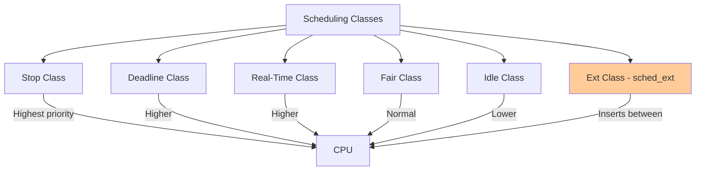
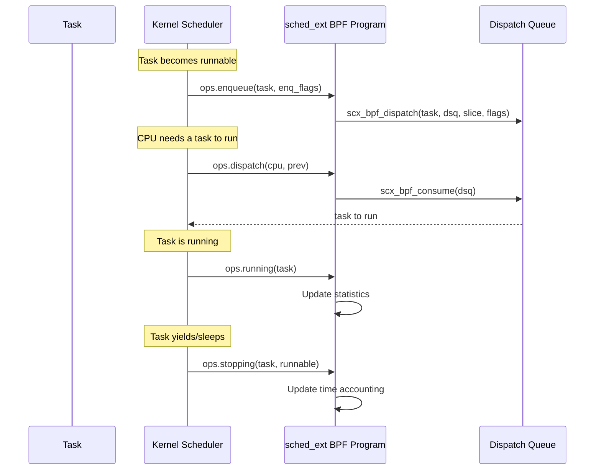

# Chapter 190: eBPF Schedulers — sched_ext: BPF Scheduling Classes, SCX_* Ops

## 1. Introduction and Intuition

sched_ext (Extensible Scheduler) is a revolutionary eBPF subsystem introduced in Linux 6.12 that allows implementing **custom CPU schedulers entirely in eBPF**. This is one of the most exciting applications of eBPF, as it enables rapid prototyping and deployment of scheduling policies without modifying kernel code.

The intuition behind sched_ext is that **scheduling is too important to be one-size-fits-all**. Different workloads benefit from different scheduling strategies:

- **Gaming**: Low latency, prefer single-threaded performance
- **Databases**: Minimize context switches, cache affinity
- **Batch processing**: Maximize throughput, fair sharing
- **Real-time**: Deterministic latency guarantees
- **Cloud/containers**: Multi-tenant fairness, isolation

Before sched_ext, implementing a custom scheduler required writing a kernel module that hooked into the scheduler framework — a complex, error-prone process. sched_ext makes it as simple as writing a BPF program.

## 2. sched_ext Architecture

### 2.1 Scheduling Classes in Linux

The Linux kernel uses a scheduling class hierarchy:



sched_ext inserts a new scheduling class between the real-time and idle classes. It allows BPF programs to control scheduling decisions for tasks that opt into the extensible scheduler.

### 2.2 How sched_ext Works



### 2.3 Core Components

The sched_ext framework consists of:

1. **sched_ext ops**: BPF callbacks that implement scheduling decisions
2. **Dispatch queues (DSQs)**: FIFO queues for task ordering
3. **Dispatch queue selection**: BPF program decides which DSQ a task goes to
4. **Time slicing**: BPF controls how long each task runs

## 3. sched_ext Operations

### 3.1 Required Operations

A minimal sched_ext BPF scheduler must implement:

```c
#include <scx/common.bpf.h>

/* Called when a task becomes runnable */
void BPF_STRUCT_OPS(my_enqueue, struct task_struct *p, u64 enq_flags)
{
    /* Dispatch task to a global DSQ */
    scx_bpf_dispatch(p, SCX_DSQ_GLOBAL, SCX_SLICE_DFL, enq_flags);
}

/* Called when a CPU needs a task to run */
void BPF_STRUCT_OPS(my_dispatch, s32 cpu, struct task_struct *prev)
{
    /* Consume from global DSQ */
    scx_bpf_consume(SCX_DSQ_GLOBAL);
}

char LICENSE[] SEC("license") = "GPL";
```

### 3.2 Full Operations Interface

```c
struct sched_ext_ops {
    /* Task lifecycle */
    s32 (*select_cpu)(struct task_struct *p, s32 prev_cpu, u64 wake_flags);
    void (*enqueue)(struct task_struct *p, u64 enq_flags);
    void (*dequeue)(struct task_struct *p, u64 deq_flags);
    void (*dispatch)(s32 cpu, struct task_struct *prev);
    void (*runnable)(struct task_struct *p, u64 enq_flags);
    void (*running)(struct task_struct *p);
    void (*stopping)(struct task_struct *p, bool runnable);
    void (*quiescent)(struct task_struct *p, u64 deq_flags);
    
    /* CPU management */
    void (*cpu_acquire)(s32 cpu, struct scx_cpu_acquire_args *args);
    void (*cpu_release)(s32 cpu, struct scx_cpu_release_args *args);
    void (*cpu_online)(s32 cpu);
    void (*cpu_offline)(s32 cpu);
    
    /* Task management */
    s32 (*init_task)(struct task_struct *p, struct scx_init_task_args *args);
    void (*exit_task)(struct task_struct *p, struct scx_exit_task_args *args);
    s32 (*init)(void);
    void (*exit)(struct scx_exit_info *ei);
    
    /* Timer/timeout */
    void (*timeout)(void);
    
    /* Name */
    const char name[SCX_OPS_NAME_LEN];
};
```

### 3.3 Dispatch Queues

Dispatch queues (DSQs) are the core data structure:

```c
/* Global DSQ — shared by all CPUs */
SCX_DSQ_GLOBAL

/* Local DSQ — per-CPU, highest priority */
SCX_DSQ_LOCAL

/* Custom DSQ — created by BPF program */
u64 my_dsq = scx_bpf_create_dsq(my_dsq_id, node_id);
```

Hierarchy:
```
Per-CPU Local DSQ (highest priority)
        ↑
Custom DSQs (consumed by dispatch)
        ↑
Global DSQ (fallback)
```

## 4. Scheduling Patterns

### 4.1 Simple FIFO Scheduler

```c
// fifo_scheduler.bpf.c
#include <scx/common.bpf.h>

/* Dispatch task immediately to global queue */
void BPF_STRUCT_OPS(fifo_enqueue, struct task_struct *p, u64 enq_flags)
{
    scx_bpf_dispatch(p, SCX_DSQ_GLOBAL, SCX_SLICE_DFL, enq_flags);
}

/* Consume from global queue */
void BPF_STRUCT_OPS(fifo_dispatch, s32 cpu, struct task_struct *prev)
{
    scx_bpf_consume(SCX_DSQ_GLOBAL);
}

s32 BPF_STRUCT_OPS(fifo_init)
{
    return 0;
}

SCX_OPS_DEFINE(fifo_ops,
               .enqueue = (void *)fifo_enqueue,
               .dispatch = (void *)fifo_dispatch,
               .init = (void *)fifo_init,
               .name = "fifo_scheduler");
```

### 4.2 Priority-Based Scheduler

```c
// priority_scheduler.bpf.c
#include <scx/common.bpf.h>

#define NUM_PRIORITY_LEVELS 10

struct {
    __uint(type, BPF_MAP_TYPE_ARRAY);
    __uint(max_entries, NUM_PRIORITY_LEVELS);
    __type(key, u32);
    __type(value, u64);
} priority_dsqs SEC(".maps");

s32 BPF_STRUCT_OPS(priority_init)
{
    for (int i = 0; i < NUM_PRIORITY_LEVELS; i++) {
        u64 dsq_id = i + 1;  /* DSQ IDs start at 1 */
        s32 ret = scx_bpf_create_dsq(dsq_id, -1);
        if (ret)
            return ret;
        bpf_map_update_elem(&priority_dsqs, &i, &dsq_id, BPF_ANY);
    }
    return 0;
}

void BPF_STRUCT_OPS(priority_enqueue, struct task_struct *p, u64 enq_flags)
{
    /* Map nice value to priority level */
    s32 prio = (p->static_prio - 120) / 4;  /* 0-9 */
    if (prio < 0) prio = 0;
    if (prio >= NUM_PRIORITY_LEVELS) prio = NUM_PRIORITY_LEVELS - 1;

    u64 *dsq_id = bpf_map_lookup_elem(&priority_dsqs, &prio);
    if (dsq_id)
        scx_bpf_dispatch(p, *dsq_id, SCX_SLICE_DFL, enq_flags);
    else
        scx_bpf_dispatch(p, SCX_DSQ_GLOBAL, SCX_SLICE_DFL, enq_flags);
}

void BPF_STRUCT_OPS(priority_dispatch, s32 cpu, struct task_struct *prev)
{
    /* Consume from highest priority DSQ first */
    for (int i = 0; i < NUM_PRIORITY_LEVELS; i++) {
        u64 *dsq_id = bpf_map_lookup_elem(&priority_dsqs, &i);
        if (dsq_id && scx_bpf_consume(*dsq_id))
            return;  /* consumed a task */
    }
}

SCX_OPS_DEFINE(priority_ops,
               .enqueue = (void *)priority_enqueue,
               .dispatch = (void *)priority_dispatch,
               .init = (void *)priority_init,
               .name = "priority_scheduler");
```

### 4.3 CPU Affinity Scheduler

```c
// affinity_scheduler.bpf.c
#include <scx/common.bpf.h>

/* Per-CPU DSQs */
struct {
    __uint(type, BPF_MAP_TYPE_ARRAY);
    __uint(max_entries, 64);  /* max CPUs */
    __type(key, u32);
    __type(value, u64);
} cpu_dsqs SEC(".maps");

s32 BPF_STRUCT_OPS(affinity_init)
{
    for (int i = 0; i < 64; i++) {
        u64 dsq_id = i + 100;  /* unique IDs */
        scx_bpf_create_dsq(dsq_id, -1);
        bpf_map_update_elem(&cpu_dsqs, &i, &dsq_id, BPF_ANY);
    }
    return 0;
}

s32 BPF_STRUCT_OPS(affinity_select_cpu, struct task_struct *p,
                   s32 prev_cpu, u64 wake_flags)
{
    /* Try to keep task on the same CPU */
    if (scx_bpf_test_and_clear_cpu_idle(prev_cpu))
        return prev_cpu;

    /* Find any idle CPU */
    s32 cpu = scx_bpf_pick_idle_cpu(p->cpus_ptr, 0);
    if (cpu >= 0)
        return cpu;

    return prev_cpu;
}

void BPF_STRUCT_OPS(affinity_enqueue, struct task_struct *p, u64 enq_flags)
{
    /* Dispatch to the CPU's local DSQ */
    s32 cpu = scx_bpf_task_cpu(p);
    u64 *dsq_id = bpf_map_lookup_elem(&cpu_dsqs, &cpu);
    if (dsq_id)
        scx_bpf_dispatch(p, *dsq_id, SCX_SLICE_DFL, enq_flags);
}

void BPF_STRUCT_OPS(affinity_dispatch, s32 cpu, struct task_struct *prev)
{
    u64 *dsq_id = bpf_map_lookup_elem(&cpu_dsqs, &cpu);
    if (dsq_id)
        scx_bpf_consume(*dsq_id);
    scx_bpf_consume(SCX_DSQ_GLOBAL);
}

SCX_OPS_DEFINE(affinity_ops,
               .select_cpu = (void *)affinity_select_cpu,
               .enqueue = (void *)affinity_enqueue,
               .dispatch = (void *)affinity_dispatch,
               .init = (void *)affinity_init,
               .name = "affinity_scheduler");
```

### 4.4 Gaming-Optimized Scheduler

```c
// gaming_scheduler.bpf.c
#include <scx/common.bpf.h>

/* Identify gaming processes */
struct {
    __uint(type, BPF_MAP_TYPE_HASH);
    __uint(max_entries, 1024);
    __type(key, u32);  /* tgid */
    __type(value, u8); /* priority flag */
} gaming_pids SEC(".maps");

void BPF_STRUCT_OPS(gaming_enqueue, struct task_struct *p, u64 enq_flags)
{
    u32 tgid = p->tgid;
    u8 *is_gaming = bpf_map_lookup_elem(&gaming_pids, &tgid);

    if (is_gaming) {
        /* Gaming tasks get short slices for responsiveness */
        scx_bpf_dispatch(p, SCX_DSQ_LOCAL, SCX_SLICE_DFL / 4, enq_flags);
    } else {
        /* Background tasks get longer slices */
        scx_bpf_dispatch(p, SCX_DSQ_GLOBAL, SCX_SLICE_DFL * 2, enq_flags);
    }
}

void BPF_STRUCT_OPS(gaming_dispatch, s32 cpu, struct task_struct *prev)
{
    /* Prioritize local DSQ (gaming tasks) */
    scx_bpf_consume(SCX_DSQ_LOCAL);
    scx_bpf_consume(SCX_DSQ_GLOBAL);
}

s32 BPF_STRUCT_OPS(gaming_select_cpu, struct task_struct *p,
                   s32 prev_cpu, u64 wake_flags)
{
    u32 tgid = p->tgid;
    u8 *is_gaming = bpf_map_lookup_elem(&gaming_pids, &tgid);

    if (is_gaming) {
        /* Pin gaming tasks to best CPU */
        s32 cpu = scx_bpf_pick_idle_cpu(p->cpus_ptr, SCX_PICK_IDLE_CORE);
        if (cpu >= 0)
            return cpu;
    }
    return prev_cpu;
}

SCX_OPS_DEFINE(gaming_ops,
               .select_cpu = (void *)gaming_select_cpu,
               .enqueue = (void *)gaming_enqueue,
               .dispatch = (void *)gaming_dispatch,
               .name = "gaming_scheduler");
```

## 5. Dispatch Queue Internals

### 5.1 DSQ Implementation

Dispatch queues are implemented as per-CPU FIFO queues:

```c
struct scx_dispatch_q {
    struct bpf_list_head list;      /* task list */
    u64 id;                         /* DSQ ID */
    u32 nr;                         /* number of tasks */
    u64 seq;                        /* sequence number for ordering */
    /* ... */
};

struct scx_dispatch_entry {
    struct bpf_list_node node;
    struct task_struct *p;
    u64 dsq_id;
    u64 slice;
    u64 enq_flags;
    /* ... */
};
```

### 5.2 Consumption Order

When consuming from DSQs:

1. **Local DSQ**: Always consumed first (per-CPU, highest priority)
2. **Custom DSQs**: Consumed in the order `scx_bpf_consume()` is called
3. **Global DSQ**: Fallback when no other DSQ has tasks

## 6. Helper Functions

### 6.1 Task Dispatch Helpers

```c
/* Dispatch task to DSQ */
s32 scx_bpf_dispatch(struct task_struct *p, u64 dsq_id,
                     u64 slice, u64 enq_flags);

/* Consume from DSQ to current CPU */
bool scx_bpf_consume(u64 dsq_id);

/* Create a new DSQ */
s32 scx_bpf_create_dsq(u64 dsq_id, s32 node);

/* Destroy a DSQ */
void scx_bpf_destroy_dsq(u64 dsq_id);
```

### 6.2 CPU Selection Helpers

```c
/* Test and clear idle status of a CPU */
bool scx_bpf_test_and_clear_cpu_idle(s32 cpu);

/* Pick an idle CPU */
s32 scx_bpf_pick_idle_cpu(const cpumask_t *cpus, u64 flags);

/* Get CPU's idle state */
bool scx_bpf_cpu_idle(s32 cpu);
```

### 6.3 Task Information Helpers

```c
/* Get task's assigned CPU */
s32 scx_bpf_task_cpu(struct task_struct *p);

/* Get task's DSQ */
u64 scx_bpf_task_dsq(struct task_struct *p);

/* Check if task is interactive */
bool scx_bpf_task_interactive(struct task_struct *p);
```

## 7. User-Space Control

### 7.1 Loading and Managing sched_ext

```bash
# Load sched_ext scheduler
bpftool prog load gaming_sched.bpf.o /sys/fs/bpf/gaming_sched

# Enable sched_ext
echo 1 > /sys/kernel/sched_ext/enable

# Check status
bpftool prog show pinned /sys/fs/bpf/gaming_sched

# Disable sched_ext (falls back to CFS)
echo 0 > /sys/kernel/sched_ext/enable
```

### 7.2 User-Space Companion

Many sched_ext schedulers have a user-space companion for configuration:

```c
// User-space configuration
int main(void)
{
    struct gaming_sched *skel;
    skel = gaming_sched__open_and_load();
    
    /* Mark gaming processes */
    u32 pid = get_gaming_pid();
    u8 val = 1;
    bpf_map__update_elem(skel->maps.gaming_pids,
                          &pid, sizeof(pid),
                          &val, sizeof(val));
    
    gaming_sched__attach(skel);
    
    /* Monitor scheduler statistics */
    while (1) {
        sleep(1);
        print_stats(skel);
    }
    
    gaming_sched__destroy(skel);
}
```

## 8. Performance Considerations

### 8.1 Scheduling Overhead

| Operation | Typical Latency |
|---|---|
| ops.enqueue | 0.5-2 µs |
| ops.dispatch | 0.5-2 µs |
| ops.select_cpu | 0.2-1 µs |
| ops.running | 0.1-0.5 µs |
| Total per context switch | 1-5 µs |

### 8.2 Comparison with CFS

| Metric | CFS | sched_ext (simple) | sched_ext (complex) |
|---|---|---|---|
| Context switch latency | ~1 µs | ~1.5 µs | ~3-5 µs |
| Throughput | Baseline | 95-100% | 90-100% |
| Flexibility | Fixed | High | High |
| Customizability | None | Full | Full |

### 8.3 Optimization Tips

1. **Keep BPF programs simple**: Complex logic increases per-switch overhead
2. **Use per-CPU DSQs**: Reduce contention
3. **Batch operations**: Dispatch multiple tasks before consuming
4. **Minimize map lookups**: Cache frequently accessed data

## 9. Security Considerations

### 9.1 Privilege Requirements

- Loading sched_ext programs requires `CAP_SYS_ADMIN`
- The kernel must be compiled with `CONFIG_SCHED_CLASS_EXT=y`
- System administrators can disable sched_ext via sysctl

### 9.2 Scheduler Trust

A buggy scheduler can:
- Cause starvation (tasks never run)
- Create priority inversion
- Impact system responsiveness
- Cause CPU monopolization

The kernel includes watchdog mechanisms to detect and mitigate severely broken schedulers.

## 10. Common Pitfalls

### 10.1 Task Starvation

```c
/* Bad: tasks dispatched but never consumed */
void BPF_STRUCT_OPS(bad_dispatch, s32 cpu, struct task_struct *prev)
{
    /* Forgetting to consume — tasks pile up */
}

/* Good: always consume from DSQs */
void BPF_STRUCT_OPS(good_dispatch, s32 cpu, struct task_struct *prev)
{
    scx_bpf_consume(SCX_DSQ_GLOBAL);
}
```

### 10.2 Priority Inversion

```c
/* Bad: high-priority task in low-priority DSQ */
void BPF_STRUCT_OPS(bad_enqueue, struct task_struct *p, u64 enq_flags)
{
    /* All tasks go to same DSQ — no priority differentiation */
    scx_bpf_dispatch(p, SCX_DSQ_GLOBAL, SCX_SLICE_DFL, enq_flags);
}

/* Good: map task priority to DSQ selection */
void BPF_STRUCT_OPS(good_enqueue, struct task_struct *p, u64 enq_flags)
{
    if (p->static_prio < 120)  /* High priority (nice < 0) */
        scx_bpf_dispatch(p, SCX_DSQ_LOCAL, SCX_SLICE_DFL / 2, enq_flags);
    else
        scx_bpf_dispatch(p, SCX_DSQ_GLOBAL, SCX_SLICE_DFL, enq_flags);
}
```

### 10.3 Missing select_cpu

```c
/* Without select_cpu, tasks may be scheduled on suboptimal CPUs */
/* Always implement select_cpu for cache affinity */

s32 BPF_STRUCT_OPS(my_select_cpu, struct task_struct *p,
                   s32 prev_cpu, u64 wake_flags)
{
    /* Try to keep task on the same CPU */
    if (scx_bpf_test_and_clear_cpu_idle(prev_cpu))
        return prev_cpu;
    
    /* Find any idle CPU */
    s32 cpu = scx_bpf_pick_idle_cpu(p->cpus_ptr, 0);
    if (cpu >= 0)
        return cpu;
    
    return prev_cpu;
}
```
```

## 11. Best Practices

1. **Start simple**: Begin with a FIFO scheduler, add complexity incrementally
2. **Implement select_cpu**: Cache affinity significantly impacts performance
3. **Use appropriate time slices**: Short for interactive, long for batch
4. **Monitor statistics**: Track context switch rates, queue depths
5. **Test with real workloads**: Synthetic benchmarks don't capture everything
6. **Have a fallback**: Ensure the system remains usable if the BPF scheduler fails
7. **Use scx_bpf_test_and_clear_cpu_idle**: For efficient idle CPU detection
8. **Consider NUMA topology**: Keep tasks on the same NUMA node when possible
9. **Implement ops.stopping**: Track task runtime for fair scheduling
10. **Use per-CPU DSQs**: Reduce contention and improve scalability

### 11.1 Testing sched_ext Schedulers

```bash
# Load and test scheduler
sudo bpftool prog load my_sched.bpf.o /sys/fs/bpf/my_sched
echo 1 | sudo tee /sys/kernel/sched_ext/enable

# Monitor scheduler behavior
sudo bpftool prog show pinned /sys/fs/bpf/my_sched

# Run workload
stress-ng --cpu 4 --io 2 --timeout 60s

# Disable scheduler
echo 0 | sudo tee /sys/kernel/sched_ext/enable
```

## 12. Exercises

### Exercise 1: FIFO Scheduler

Implement a basic FIFO scheduler using sched_ext. Test it with `stress-ng` and measure throughput.

### Exercise 2: Priority Scheduler

Extend the FIFO scheduler with priority levels. Map Linux nice values to priority levels.

### Exercise 3: NUMA-Aware Scheduler

Implement a scheduler that:
- Creates per-NUMA-node DSQs
- Dispatches tasks to the DSQ of their preferred NUMA node
- Falls back to remote NUMA when local is busy

## 12. sched_ext Advanced Features

### 12.1 Task Classification

schedulers often classify tasks for different treatment:

```c
/* Classify tasks by behavior */
enum task_class {
    TASK_INTERACTIVE,   /* Short bursts, latency-sensitive */
    TASK_BATCH,         /* Long runs, throughput-oriented */
    TASK_REALTIME,      /* Real-time requirements */
    TASK_BACKGROUND,    /* Low priority, background work */
};

enum task_class classify_task(struct task_struct *p)
{
    /* Use heuristics based on task properties */
    
    /* Check nice value */
    if (p->static_prio <= 120)  /* nice <= -20 */
        return TASK_REALTIME;
    
    /* Check if task is IO-bound vs CPU-bound */
    u64 runtime = p->se.sum_exec_runtime;
    u64 run_delay = p->stats.wait_sum;
    
    if (run_delay > runtime / 2)
        return TASK_INTERACTIVE;  /* Lots of waiting = IO-bound */
    
    if (runtime > 1000000000ULL)  /* > 1 second */
        return TASK_BATCH;  /* Long CPU burst */
    
    return TASK_INTERACTIVE;  /* Default to interactive */
}

/* Apply different scheduling based on class */
void BPF_STRUCT_OPS(smart_enqueue, struct task_struct *p, u64 enq_flags)
{
    enum task_class cls = classify_task(p);
    
    switch (cls) {
    case TASK_INTERACTIVE:
        /* Short slice, high priority queue */
        scx_bpf_dispatch(p, SCX_DSQ_LOCAL, SCX_SLICE_DFL / 2, enq_flags);
        break;
    case TASK_BATCH:
        /* Long slice, global queue */
        scx_bpf_dispatch(p, SCX_DSQ_GLOBAL, SCX_SLICE_DFL * 4, enq_flags);
        break;
    case TASK_REALTIME:
        /* Short slice, immediate dispatch */
        scx_bpf_dispatch(p, SCX_DSQ_LOCAL, SCX_SLICE_DFL / 4, enq_flags);
        break;
    case TASK_BACKGROUND:
        /* Long slice, lowest priority */
        scx_bpf_dispatch(p, bg_dsq_id, SCX_SLICE_DFL * 8, enq_flags);
        break;
    }
}
```

### 12.2 Load Balancing

```c
/* Load balancing across CPUs */

struct cpu_load {
    u64 total_runtime;
    u64 nr_running;
    u64 last_update;
};

struct {
    __uint(type, BPF_MAP_TYPE_PERCPU_ARRAY);
    __uint(max_entries, 1);
    __type(key, u32);
    __type(value, struct cpu_load);
} cpu_loads SEC(".maps");

s32 BPF_STRUCT_OPS(lb_select_cpu, struct task_struct *p,
                   s32 prev_cpu, u64 wake_flags)
{
    /* Try to find the least loaded idle CPU */
    s32 best_cpu = -1;
    u64 min_load = U64_MAX;
    
    /* First try idle CPUs */
    s32 idle_cpu = scx_bpf_pick_idle_cpu(p->cpus_ptr, 0);
    if (idle_cpu >= 0)
        return idle_cpu;
    
    /* Find least loaded CPU */
    for (int i = 0; i < nr_cpus; i++) {
        if (!bpf_cpumask_test_cpu(i, p->cpus_ptr))
            continue;
        
        struct cpu_load *load = bpf_map_lookup_elem(&cpu_loads, &i);
        if (load && load->nr_running < min_load) {
            min_load = load->nr_running;
            best_cpu = i;
        }
    }
    
    return best_cpu >= 0 ? best_cpu : prev_cpu;
}
```

### 12.3 Time Slice Management

```c
/* Dynamic time slice based on task behavior */

u64 calculate_slice(struct task_struct *p)
{
    u64 base_slice = SCX_SLICE_DFL;  /* 5ms default */
    
    /* Shorter slices for interactive tasks */
    if (is_interactive(p))
        return base_slice / 2;
    
    /* Longer slices for batch tasks */
    if (is_batch(p))
        return base_slice * 4;
    
    /* Proportional to nice value */
    s32 nice = p->static_prio - 120;  /* Convert prio to nice */
    
    /* nice -20 → 0.5x slice, nice 19 → 4x slice */
    u64 slice = base_slice * (1024 >> (nice / 5));
    
    return slice < 1000000 ? 1000000 : slice;  /* Min 1ms */
}

void BPF_STRUCT_OPS(dynamic_enqueue, struct task_struct *p, u64 enq_flags)
{
    u64 slice = calculate_slice(p);
    scx_bpf_dispatch(p, SCX_DSQ_GLOBAL, slice, enq_flags);
}
```

## 13. sched_ext Internals

### 13.1 How sched_ext Integrates with CFS

sched_ext operates as a separate scheduling class that can coexist with CFS:

```c
/* kernel/sched/ext.c */

/* sched_ext scheduling class */
const struct sched_class ext_sched_class = {
    .enqueue_task = ext_enqueue_task,
    .dequeue_task = ext_dequeue_task,
    .pick_next_task = ext_pick_next_task,
    .put_prev_task = ext_put_prev_task,
    .set_next_task = ext_set_next_task,
    .task_tick = ext_task_tick,
    .switched_to = ext_switched_to,
    .prio_changed = ext_prio_changed,
    /* ... */
};

/* Task can opt into sched_ext */
void scx_task_init(struct task_struct *p)
{
    p->scx.slice = SCX_SLICE_DFL;
    p->scx.dsq_flags = 0;
    p->scx.flags = 0;
}
```

### 13.2 Dispatch Queue Internals

```c
/* kernel/sched/ext.c */

struct scx_dispatch_q {
    raw_spinlock_t lock;
    struct list_head list;    /* FIFO of dispatched tasks */
    u32 nr;                   /* Number of tasks */
    u64 id;                   /* DSQ ID */
    s32 cpu;                  /* CPU affinity (-1 for any) */
    /* ... */
};

/* Dispatch task to DSQ */
static int scx_dispatch(struct task_struct *p, u64 dsq_id,
                        u64 slice, u64 enq_flags)
{
    struct scx_dispatch_q *dsq;
    
    if (dsq_id == SCX_DSQ_LOCAL) {
        dsq = this_cpu_read(local_dsq);
    } else {
        dsq = find_dsq(dsq_id);
    }
    
    if (!dsq)
        return -ENOENT;
    
    raw_spin_lock(&dsq->lock);
    list_add_tail(&p->scx.dsq_node, &dsq->list);
    dsq->nr++;
    raw_spin_unlock(&dsq->lock);
    
    return 0;
}
```

### 13.3 Timer and Preemption

```c
/* Timer callback for time slicing */
static void scx_tick(struct rq *rq)
{
    struct task_struct *p = rq->curr;
    
    if (p->sched_class != &ext_sched_class)
        return;
    
    /* Check if slice expired */
    if (--p->scx.slice <= 0) {
        /* Call ops.stopping() */
        scx_ops_stopping(p, true);
        
        /* Re-enqueue task */
        scx_ops_enqueue(p, SCX_ENQ_PREEMPTED);
        
        /* Pick next task */
        resched_curr(rq);
    }
}
```

### 13.4 CPU Idle Detection

```c
/* Efficient idle CPU detection */
bool scx_bpf_test_and_clear_cpu_idle(s32 cpu)
{
    struct rq *rq = cpu_rq(cpu);
    bool idle;
    
    raw_spin_lock_irq(&rq->lock);
    idle = rq->nr_running == 0;
    if (idle)
        rq->nr_running = 1;  /* Claim the CPU */
    raw_spin_unlock_irq(&rq->lock);
    
    return idle;
}
```

## 14. References

1. **sched_ext documentation**: `Documentation/scheduler/sched-ext.rst`
2. **Kernel source**: `kernel/sched/ext.c`, `include/linux/sched/ext.h`
3. **sched_ext examples**: `tools/sched_ext/` in kernel source
4. **sched_ext paper**: "Extensible Scheduling with eBPF" — LPC 2022
5. **Meta's sched_ext work**: https://engineering.fb.com/
6. **scx repository**: https://github.com/sched-ext/scx
7. **BPF scheduler examples**: https://github.com/sched-ext/scx/tree/main/scheds
8. **LPC talks on sched_ext**: https://lpc.events/
