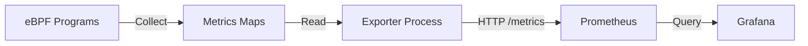
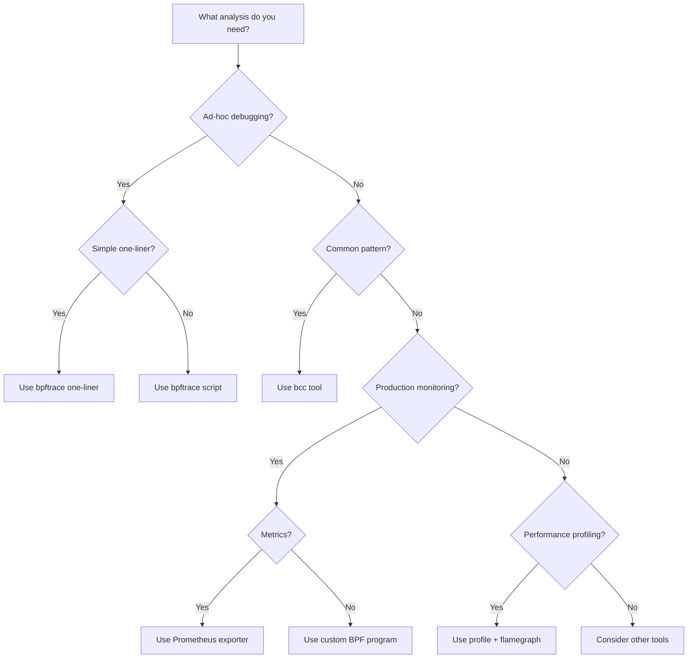
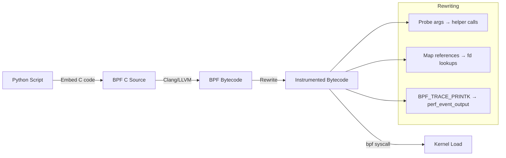
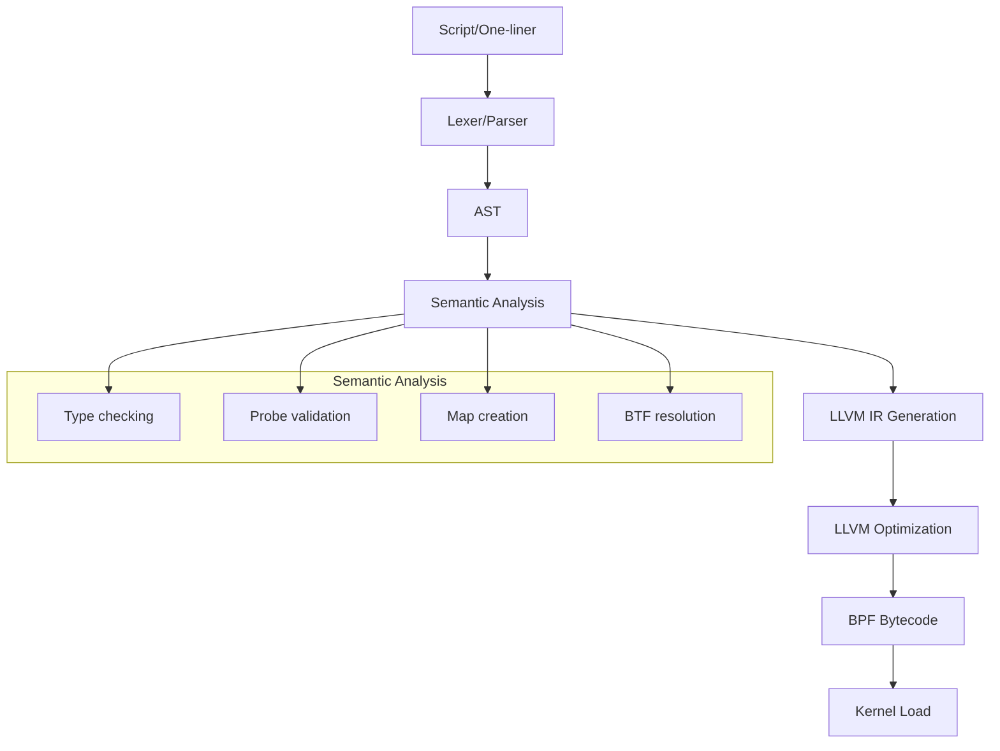

# Chapter 191: eBPF Observability — bcc Tools, bpftrace One-Liners, Prometheus Exporters

## 1. Introduction and Intuition

eBPF has transformed Linux observability from a discipline requiring deep kernel expertise into one where **complex system analysis can be performed with one-liner commands**. The observability stack built on eBPF includes:

- **bcc (BPF Compiler Collection)**: Python/Lua tools for system analysis
- **bpftrace**: High-level tracing language for one-liners and scripts
- **Prometheus exporters**: eBPF-based metrics collection for monitoring
- **Custom tools**: Full BPF programs for specialized observability

The intuition is that eBPF makes the **entire kernel and user space programmable for observation**. You can instrument any function, any system call, any tracepoint — and collect exactly the data you need, with minimal overhead.

## 2. bcc (BPF Compiler Collection)

### 2.1 What is bcc?

bcc is a toolkit for creating efficient kernel tracing and manipulation programs using eBPF. It provides:

- Python and Lua bindings for writing BPF programs
- Pre-built tools for common observability tasks
- A library for building custom tools

### 2.2 Pre-built bcc Tools

#### execsnoop — Trace New Processes

```bash
# Trace all execve() calls
execsnoop

# Output:
# PCOMM            PID    PPID   RET ARGS
# bash             12345  12344    0 /bin/bash
# ls               12346  12345    0 /bin/ls -la
```

#### opensnoop — Trace File Opens

```bash
# Trace all open() calls
opensnoop

# Trace specific process
opensnoop -p 1234

# Trace specific filename
opensnoop -n "config.txt"

# Include failed opens
opensnoop -x
```

#### biolatency — Disk I/O Latency

```bash
# Histogram of disk I/O latency
biolatency

# Output:
#      usecs          : count    distribution
#        0 -> 1       : 0       |                                        |
#        2 -> 3       : 0       |                                        |
#        4 -> 7       : 3       |*                                       |
#        8 -> 15      : 12      |*****                                   |
#       16 -> 31      : 45      |******************                      |
#       32 -> 63      : 120     |**************************************************|
#       64 -> 127     : 80      |********************************        |
#      128 -> 255     : 25      |**********                              |
```

#### tcplife — TCP Connection Tracing

```bash
# Trace TCP connections with lifespan
tcplife

# Output:
# PID    COMM        LADDR           LPORT RADDR           RPORT TX_KB RX_KB MS
# 1234   curl        10.0.0.1        54321 93.184.216.34   80    1     15    234
```

#### profile — CPU Profiling

```bash
# CPU profiling with stack traces
profile

# Flame graph generation
profile -F 99 | flamegraph.pl > profile.svg
```

#### runqlat — Run Queue Latency

```bash
# Scheduler run queue latency
runqlat

# Output:
#      usecs          : count    distribution
#        0 -> 1       : 500     |********************                    |
#        2 -> 3       : 1200    |**************************************************|
#        4 -> 7       : 800     |********************************        |
#        8 -> 15      : 200     |********                                |
#       16 -> 31      : 50      |**                                      |
```

#### cachestat — Page Cache Statistics

```bash
# Page cache hit/miss rates
cachestat

# Output:
# HITS     MISSES   DIRTIES  HITRATIO   BUFFERS_MB  CACHED_MB
# 4523     123      45       97.34%     120         2048
```

### 2.3 Writing Custom bcc Tools

```python
#!/usr/bin/env python3
# custom_tool.py - Trace file read sizes

from bcc import BPF

# BPF program (embedded C)
bpf_text = """
#include <uapi/linux/ptrace.h>
#include <linux/sched.h>

struct data_t {
    u32 pid;
    u64 size;
    char comm[TASK_COMM_LEN];
};

BPF_PERF_OUTPUT(events);

TRACEPOINT_PROBE(syscalls, sys_enter_read) {
    struct data_t data = {};
    
    data.pid = bpf_get_current_pid_tgid() >> 32;
    data.size = args->count;
    bpf_get_current_comm(&data.comm, sizeof(data.comm));
    
    events.perf_submit(args, &data, sizeof(data));
    return 0;
}
"""

# Load BPF program
b = BPF(text=bpf_text)

# Process events
def print_event(cpu, data, size):
    event = b["events"].event(data)
    print(f"PID: {event.pid}, Comm: {event.comm.decode()}, "
          f"Read size: {event.size}")

b["events"].open_perf_buffer(print_event)

while True:
    b.perf_buffer_poll()
```

### 2.4 bcc Library Functions

```python
# Common bcc patterns

# Attach to kprobe
b.attach_kprobe(event="do_sys_openat2", fn_name="trace_open")

# Attach to kretprobe
b.attach_kretprobe(event="do_sys_openat2", fn_name="trace_open_ret")

# Attach to tracepoint
b.attach_tracepoint(tp="syscalls:sys_enter_read", fn_name="trace_read")

# Read from BPF map
data = b.get_table("my_map")
for k, v in data.items():
    print(f"Key: {k.value}, Value: {v.value}")

# Perf buffer callback
def callback(cpu, data, size):
    event = b["events"].event(data)
b["events"].open_perf_buffer(callback)
```

## 3. bpftrace

### 3.1 What is bpftrace?

bpftrace is a **high-level tracing language** for Linux, inspired by awk and DTrace. It's designed for writing one-liners and short scripts for ad-hoc analysis.

### 3.2 One-Liners

#### System Call Tracing

```bash
# Trace all syscalls
bpftrace -e 'tracepoint:raw_syscalls:sys_enter { printf("%s(%d) %d\n", comm, pid, args->id); }'

# Trace specific syscall
bpftrace -e 'tracepoint:syscalls:sys_enter_read { printf("read(%d, %d)\n", pid, args->count); }'

# Count syscalls by process
bpftrace -e 'tracepoint:raw_syscalls:sys_enter { @[comm] = count(); }'
```

#### Process Tracing

```bash
# Trace new processes
bpftrace -e 'tracepoint:syscalls:sys_enter_execve { printf("%s → %s\n", comm, str(args->filename)); }'

# Trace process exits
bpftrace -e 'tracepoint:sched:sched_process_exit { printf("%s (%d) exited\n", comm, pid); }'

# Trace signals
bpftrace -e 'tracepoint:signal:signal_generate { printf("%s sent signal %d to pid %d\n", comm, args->sig, args->pid); }'
```

#### I/O Tracing

```bash
# Read/write sizes histogram
bpftrace -e '
tracepoint:syscalls:sys_exit_read /args->ret > 0/ { @bytes = hist(args->ret); }
tracepoint:syscalls:sys_exit_write /args->ret > 0/ { @bytes = hist(args->ret); }
'

# Disk I/O latency histogram
bpftrace -e 'tracepoint:block:block_rq_complete { @usecs = hist((nsecs - args->alloc_time) / 1000); }'

# File I/O by process
bpftrace -e '
tracepoint:syscalls:sys_enter_read { @[comm, pid] = sum(args->count); }
'
```

#### Network Tracing

```bash
# TCP connections
bpftrace -e 'kprobe:tcp_connect { printf("%s → %s\n", comm, ntop(((struct sock *)arg0)->__sk_common.skc_daddr)); }'

# Packet sizes
bpftrace -e 'kprobe:tcp_sendmsg { @bytes[comm] = sum(arg2); }'

# TCP retransmissions
bpftrace -e 'kprobe:tcp_retransmit_skb { printf("retransmit: %s\n", comm); }'
```

#### Scheduler Tracing

```bash
# Context switches
bpftrace -e 'tracepoint:sched:sched_switch { @[comm] = count(); }'

# Run queue latency
bpftrace -e '
tracepoint:sched:sched_wakeup { @qtime[args->pid] = nsecs; }
tracepoint:sched:sched_switch /@qtime[args->next_pid]/ {
    @usecs = hist((nsecs - @qtime[args->next_pid]) / 1000);
    delete(@qtime[args->next_pid]);
}
'

# CPU time per process
bpftrace -e '
tracepoint:sched:sched_switch {
    @start[args->next_pid] = nsecs;
    if (@start[args->prev_pid]) {
        @[args->prev_comm] = sum(nsecs - @start[args->prev_pid]);
        delete(@start[args->prev_pid]);
    }
}
'
```

#### Memory Tracing

```bash
# Page allocations
bpftrace -e 'tracepoint:kmem:mm_page_alloc { @[comm, stack] = count(); }'

# OOM kills
bpftrace -e 'tracepoint:oom:oom_score_adj_update { printf("%d: oom_score_adj = %d\n", args->pid, args->oom_score_adj); }'

# Memory pressure
bpftrace -e 'tracepoint:vmscan:mm_shrink_slab_start { @[comm, args->shr->scan_objects] = count(); }'
```

### 3.3 bpftrace Scripts

#### Process Life Cycle Tracker

```bash
#!/usr/bin/env bpftrace
# lifecycle.bt

BEGIN
{
    printf("Tracing process lifecycle... Hit Ctrl-C to end.\n");
}

tracepoint:syscalls:sys_enter_execve
{
    printf("EXEC: %s (pid=%d) → %s\n", comm, pid, str(args->filename));
}

tracepoint:sched:sched_process_exit
/args->pid == pid/
{
    printf("EXIT: %s (pid=%d) code=%d\n", comm, pid, args->code);
}

tracepoint:signal:signal_generate
{
    printf("SIGNAL: %s → pid=%d sig=%d\n", comm, args->pid, args->sig);
}
```

#### Disk I/O Profiler

```bash
#!/usr/bin/env bpftrace
# disk_io.bt

BEGIN
{
    printf("Tracing disk I/O... Hit Ctrl-C to end.\n");
}

tracepoint:block:block_rq_issue
{
    @start[args->dev, args->sector] = nsecs;
    @size[args->dev] = sum(args->bytes);
    @count[args->dev] = count();
}

tracepoint:block:block_rq_complete
/@start[args->dev, args->sector]/
{
    $latency = (nsecs - @start[args->dev, args->sector]) / 1000;
    @latency[args->dev] = hist($latency);
    delete(@start[args->dev, args->sector]);
}

interval:s:1
{
    printf("\nDevice Statistics:\n");
    print(@count);
    print(@size);
    print(@latency);
    clear(@count);
    clear(@size);
    clear(@latency);
}
```

#### Network Latency Monitor

```bash
#!/usr/bin/env bpftrace
# net_latency.bt

BEGIN
{
    printf("Tracing network latency... Hit Ctrl-C to end.\n");
}

kprobe:tcp_v4_connect
{
    @start[tid] = nsecs;
}

kretprobe:tcp_v4_connect
/@start[tid]/
{
    $latency = (nsecs - @start[tid]) / 1000;
    @connect_latency[comm] = hist($latency);
    delete(@start[tid]);
}

kprobe:tcp_rcv_established
{
    @rx_start[tid] = nsecs;
}

kretprobe:tcp_rcv_established
/@rx_start[tid]/
{
    $latency = (nsecs - @rx_start[tid]) / 1000;
    @rx_latency[comm] = hist($latency);
    delete(@rx_start[tid]);
}
```

### 3.4 bpftrace Probe Types

| Probe | Syntax | Description |
|---|---|---|
| kprobe | `kprobe:func_name` | Kernel function entry |
| kretprobe | `kretprobe:func_name` | Kernel function return |
| uprobe | `uprobe:/path:func` | User function entry |
| uretprobe | `uretprobe:/path:func` | User function return |
| tracepoint | `tracepoint:category:event` | Static tracepoint |
| profile | `profile:hz:99` | Timer-based sampling |
| interval | `interval:s:1` | Periodic output |
| software | `software:cache-misses:1000` | Software events |
| hardware | `hardware:cache-misses:100000` | Hardware events |
| BEGIN | `BEGIN` | Script start |
| END | `END` | Script end |

### 3.5 bpftrace Built-in Functions

```bash
# Aggregation functions
@[key] = count()           # Count occurrences
@[key] = sum(val)          # Sum values
@[key] = avg(val)          # Average
@[key] = min(val)          # Minimum
@[key] = max(val)          # Maximum
@[key] = hist(val)         # Log2 histogram
@[key] = lhist(val, 0, 100, 10)  # Linear histogram

# Output
print(@map)                # Print map
clear(@map)                # Clear map
delete(@map[key])          # Delete key

# String functions
str(ptr)                   # Read string from pointer
buf(ptr, len)              # Read buffer
ntop(addr)                 # Network address to string
pton("1.2.3.4")            # String to network address

# Time
nsecs                      # Nanoseconds since boot
ktime_get_ns()             # Kernel time
```

## 4. Prometheus eBPF Exporters

### 4.1 eBPF-based Metrics Collection

eBPF enables efficient, low-overhead metrics collection for Prometheus:



### 4.2 Custom eBPF Exporter

```python
#!/usr/bin/env python3
# ebpf_exporter.py

from prometheus_client import start_http_server, Gauge, Histogram
from bcc import BPF
import time

# Define metrics
SYSCALL_COUNT = Gauge('ebpf_syscall_total', 'Total syscalls', ['comm', 'syscall'])
READ_LATENCY = Histogram('ebpf_read_latency_seconds', 'Read syscall latency',
                          ['comm'], buckets=[0.00001, 0.0001, 0.001, 0.01, 0.1, 1])

# BPF program
bpf_text = """
#include <uapi/linux/ptrace.h>

BPF_HASH(syscall_count, u64, u64);
BPF_HISTOGRAM(read_latency, u64);

TRACEPOINT_PROBE(raw_syscalls, sys_enter) {
    u64 key = bpf_get_current_pid_tgid();
    u64 *val = syscall_count.lookup(&key);
    if (val) {
        (*val)++;
    } else {
        u64 init = 1;
        syscall_count.update(&key, &init);
    }
    return 0;
}

TRACEPOINT_PROBE(syscalls, sys_enter_read) {
    u64 ts = bpf_ktime_get_ns();
    u64 pid = bpf_get_current_pid_tgid();
    read_start.update(&pid, &ts);
    return 0;
}

TRACEPOINT_PROBE(syscalls, sys_exit_read) {
    u64 pid = bpf_get_current_pid_tgid();
    u64 *ts = read_start.lookup(&pid);
    if (ts) {
        u64 latency = (bpf_ktime_get_ns() - *ts) / 1000;  // usecs
        read_latency.increment(bpf_log2l(latency));
        read_start.delete(&pid);
    }
    return 0;
}
"""

b = BPF(text=bpf_text)

def collect_metrics():
    # Read syscall counts
    table = b.get_table("syscall_count")
    for k, v in table.items():
        # Get process name
        try:
            with open(f"/proc/{k.value}/comm") as f:
                comm = f.read().strip()
        except:
            comm = "unknown"
        SYSCALL_COUNT.labels(comm=comm, syscall="total").set(v.value)

if __name__ == '__main__':
    start_http_server(8000)
    while True:
        collect_metrics()
        time.sleep(5)
```

### 4.3 Tetragon Metrics

Tetragon exports Prometheus metrics from eBPF events:

```yaml
# Tetragon configuration
apiVersion: cilium.io/v1alpha1
kind: TracingPolicy
metadata:
  name: file-monitoring
spec:
  kprobes:
  - call: "do_sys_openat2"
    syscall: false
    args:
    - index: 1
      type: "string"
    selectors:
    - matchArgs:
      - index: 1
        operator: "Prefix"
        values:
        - "/etc/"
```

### 4.4 Cilium Hubble Metrics

```yaml
# Cilium Hubble metrics
apiVersion: v1
kind: ConfigMap
metadata:
  name: hubble-metrics
data:
  hubble-metrics: |
    - drop
    - tcp
    - flow
    - icmp
    - http
```

## 5. Production Observability Patterns

### 5.1 RED Method (Rate, Errors, Duration)

```bash
# Rate: requests per second
bpftrace -e 'kprobe:tcp_sendmsg { @rps = count(); } interval:s:1 { print(@rps); clear(@rps); }'

# Errors: error rate
bpftrace -e 'kretprobe:tcp_sendmsg /args->ret < 0/ { @[args->ret] = count(); }'

# Duration: latency histogram
bpftrace -e 'kprobe:tcp_sendmsg { @start[tid] = nsecs; } kretprobe:tcp_sendmsg /@start[tid]/ { @latency = hist((nsecs - @start[tid])/1000); delete(@start[tid]); }'
```

### 5.2 USE Method (Utilization, Saturation, Errors)

```bash
# CPU utilization per process
bpftrace -e 'profile:hz:99 { @[comm] = count(); }'

# Disk utilization
bpftrace -e 'tracepoint:block:block_rq_issue { @io[args->dev] = count(); } interval:s:1 { print(@io); clear(@io); }'

# Network saturation
bpftrace -e 'kprobe:tcp_add_backlog { @[comm] = count(); }'
```

### 5.3 Flame Graphs

```bash
# Generate stack traces for flame graphs
profile -F 99 -af 30 | stackcollapse-bpftrace.pl | flamegraph.pl > cpu.svg

# Off-CPU time analysis
offcputime -af 30 | stackcollapse.pl | flamegraph.pl --color=io > offcpu.svg
```

## 6. Performance Considerations

### 6.1 Overhead Management

| Tool | Overhead per Event | Suitable for Production |
|---|---|---|
| bpftrace one-liner | ~1-5 µs | Short-term debugging |
| bcc tool | ~1-3 µs | Production with sampling |
| Custom BPF | ~0.5-2 µs | Production optimized |
| Ring buffer | ~0.1-0.5 µs | Production |

### 6.2 Sampling Strategies

```bash
# Sample 1 in 100 events
bpftrace -e 'tracepoint:syscalls:sys_enter_read /bpf_get_prandom_u32() % 100 == 0/ { @[comm] = count(); }'

# Time-based sampling
bpftrace -e 'profile:hz:99 { @[comm] = count(); }'  # 99 Hz sampling
```

### 6.3 Map Size Management

```bash
# Limit map size
bpftrace -e 'tracepoint:syscalls:sys_enter { @[comm] = count(); } END { trunc(@, 10); }'

# Clear periodically
bpftrace -e 'tracepoint:syscalls:sys_enter { @[comm] = count(); } interval:s:10 { print(@); clear(@); }'
```

## 7. Security Considerations

### 7.1 Privilege Requirements

```bash
# bcc and bpftrace typically require root
sudo bpftrace -e 'tracepoint:syscalls:sys_enter_read { printf("read\n"); }'

# Or CAP_BPF + CAP_PERFMON capabilities
sudo setcap cap_bpf,cap_perfmon+ep /usr/bin/bpftrace
```

### 7.2 Data Sensitivity

```bash
# Bad: logging all file contents
bpftrace -e 'kprobe:vfs_read { printf("%s\n", str(arg1)); }'

# Good: only metadata
bpftrace -e 'kprobe:vfs_read { printf("pid=%d size=%d\n", pid, arg2); }'
```

## 8. Common Pitfalls

### 8.1 Probe Missed

```bash
# Function may be inlined
bpftrace -l 'kprobe:tcp_sendmsg'
# If empty, check /proc/kallsyms or try kprobe:__x64_sys_read
```

### 8.2 Stack Overflow

```bash
# Bad: deep stack traces
bpftrace -e 'kprobe:func { printf("%s\n", ustack); }'

# Good: limit stack depth
bpftrace -e 'kprobe:func { printf("%s\n", ustack(3)); }'
```

### 8.3 Map Overflow

```bash
# Maps have size limits
# Use trunc() or clear() to manage size
```

### 8.4 High Overhead in Production

```bash
/* Bad: trace every call to a high-frequency function */
bpftrace -e 'tracepoint:raw_syscalls:sys_enter { @[comm] = count(); }'

/* Good: sample */
bpftrace -e 'tracepoint:raw_syscalls:sys_enter /nsecs % 100 == 0/ { @[comm] = count(); }'

/* Better: filter by process */
bpftrace -e 'tracepoint:raw_syscalls:sys_enter /pid == $target/ { @[comm] = count(); }'
```

### 8.5 Lost Events

```bash
# Events can be lost if perf buffers overflow
# Use ring buffer for better reliability
# Monitor for lost events:
bpftrace -e 'tracepoint:syscalls:sys_enter { @[comm] = count(); } interval:s:1 { printf("events: %d\n", @); clear(@); }'
```

## 9. Best Practices

1. **Start with bpftrace one-liners**: Quick ad-hoc analysis
2. **Use bcc tools for common tasks**: Pre-built, tested, documented
3. **Build custom tools for specific needs**: Full control over data collection
4. **Use Prometheus exporters for continuous monitoring**: Long-term metrics
5. **Generate flame graphs for performance analysis**: Visual profiling
6. **Sample in production**: Don't trace every event at high frequency
7. **Use ring buffer for event streaming**: Efficient event delivery
8. **Test overhead**: Measure before deploying to production
9. **Use appropriate aggregation**: Count, sum, histogram based on data type
10. **Clean up maps and buffers**: Prevent memory leaks

### 9.1 Choosing the Right Tool



### 9.2 Data Collection Patterns

```bash
# Pattern 1: Count events per time period
bpftrace -e '
tracepoint:syscalls:sys_enter {
    @[comm] = count();
}
interval:s:5 {
    print(@);
    clear(@);
}
'

# Pattern 2: Measure latency distribution
bpftrace -e '
kprobe:vfs_read { @start[tid] = nsecs; }
kretprobe:vfs_read /@start[tid]/ {
    @us = hist((nsecs - @start[tid]) / 1000);
    delete(@start[tid]);
}
'

# Pattern 3: Track state changes
bpftrace -e '
tracepoint:sched:sched_switch {
    @offcpu[args->prev_comm] = sum(nsecs - @switch_time[args->prev_pid]);
    @switch_time[args->next_pid] = nsecs;
}
'
```

## 10. Exercises

### Exercise 1: Process Genealogy

Write a bpftrace script that traces the process creation tree — showing parent-child relationships.

### Exercise 2: I/O Bottleneck Analysis

Use bcc tools to identify I/O bottlenecks:
- Which processes do the most I/O?
- What's the I/O latency distribution?
- Which files are most accessed?

### Exercise 3: Custom Prometheus Exporter

Build a Prometheus exporter that collects:
- Process creation rate
- System call rate by type
- Network connection rate
- Disk I/O latency

### Exercise 4: Flame Graph Generator

Write a script that:
- Captures CPU stack traces at 99 Hz
- Generates a flame graph
- Identifies hot functions

### Exercise 5: Network Latency Monitor

Create a bpftrace script that:
- Measures TCP connection latency
- Builds histograms by destination IP
- Identifies slow connections

## 11. Observability Internals

### 11.1 How bcc Compiles BPF Programs

bcc uses a multi-stage compilation pipeline:



bcc rewrites the BPF bytecode to:
- Replace `PT_REGS_PARM*` macros with actual register reads
- Replace map names with file descriptors
- Convert `bpf_trace_printk` to efficient perf event output

### 11.2 bpftrace Compilation Pipeline



### 11.3 Perf Event Collection

```c
/* How bcc collects perf events */

/* BPF program */
BPF_PERF_OUTPUT(events);

int trace_func(struct pt_regs *ctx) {
    struct data_t data = {};
    data.pid = bpf_get_current_pid_tgid() >> 32;
    events.perf_submit(ctx, &data, sizeof(data));
    return 0;
}

/* User-space collection */
void open_perf_buffer(struct bpf_map *map, perf_reader_raw_cb callback)
{
    /* Create per-CPU perf event buffers */
    for_each_cpu(cpu) {
        int page_size = getpagesize();
        int mmap_size = page_size * (1 + n_pages);
        
        /* Set up perf event */
        struct perf_event_attr attr = {
            .type = PERF_TYPE_SOFTWARE,
            .config = PERF_COUNT_SW_BPF_OUTPUT,
            .sample_type = PERF_SAMPLE_RAW,
        };
        
        int fd = syscall(__NR_perf_event_open, &attr, -1, cpu, -1, 0);
        
        /* mmap the buffer */
        void *base = mmap(NULL, mmap_size, PROT_READ | PROT_WRITE,
                          MAP_SHARED, fd, 0);
        
        /* Add to epoll */
        epoll_ctl(epfd, EPOLL_CTL_ADD, fd, &event);
    }
}
```

### 11.4 Ring Buffer Collection

```c
/* Ring buffer is more efficient than perf events */

/* Single shared buffer (vs per-CPU) */
struct ring {
    char *data;
    u32 size;
    u32 mask;
    atomic64_t consumer_pos;
    atomic64_t producer_pos;
};

/* Consumer reads from ring buffer */
int ring_buffer__poll(struct ring_buffer *rb, int timeout_ms)
{
    struct epoll_event events[256];
    int nfds = epoll_wait(rb->epoll_fd, events, 256, timeout_ms);
    
    for (int i = 0; i < nfds; i++) {
        /* Read from per-CPU ring */
        struct ring *r = events[i].data.ptr;
        
        while (r->consumer_pos < atomic64_read(&r->producer_pos)) {
            void *data = r->data + (r->consumer_pos & r->mask);
            /* Process event */
            rb->sample_cb(rb->ctx, data, data_size);
            r->consumer_pos += data_size;
        }
    }
}
```

## 12. References

1. **bcc tools**: https://github.com/iovisor/bcc
2. **bpftrace**: https://github.com/bpftrace/bpftrace
3. **BPF Performance Tools (book)**: Brendan Gregg, Addison-Wesley
4. **bpftrace reference guide**: https://github.com/bpftrace/bpftrace/blob/master/docs/reference_guide.md
5. **Cilium Hubble**: https://docs.cilium.io/en/latest/observability/
6. **Tetragon**: https://tetragon.io/
7. **Prometheus eBPF exporter**: https://github.com/cloudflare/ebpf_exporter
8. **Flame graphs**: https://www.brendangregg.com/flamegraphs.html
