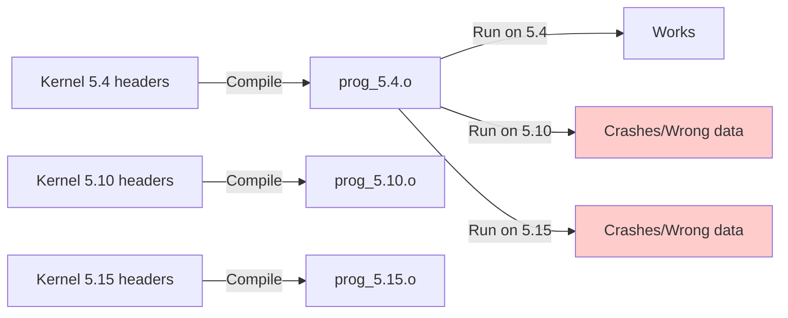
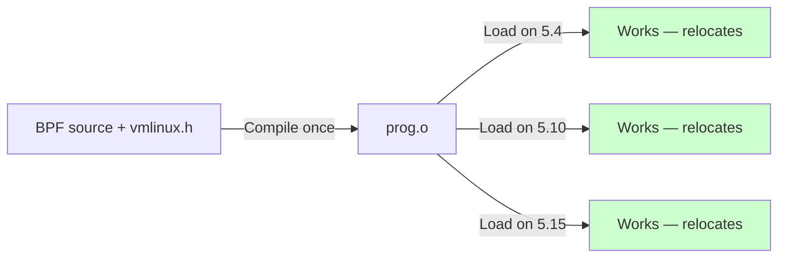

# Chapter 192: CO-RE — Compile Once, Run Everywhere: BTF, Relocations, vmlinux.h

## 1. Introduction and Intuition

Compile Once, Run Everywhere (CO-RE) is a fundamental shift in how eBPF programs are developed and deployed. Before CO-RE, BPF programs had to be compiled against the **exact kernel headers** of the running kernel — meaning a program compiled on one kernel version wouldn't work on another. CO-RE solves this by enabling **portable BPF programs** that work across kernel versions without recompilation.

The intuition behind CO-RE is **runtime adaptation**. Instead of statically compiling field offsets and structure sizes into the BPF bytecode, CO-RE embeds **relocation records** that describe which fields the program needs. At load time, the libbpf loader uses BTF (BPF Type Format) information from the running kernel to adjust offsets, sizes, and existence checks — making the program work correctly regardless of kernel version.

## 2. The Problem CO-RE Solves

### 2.1 Before CO-RE



### 2.2 After CO-RE



## 3. BTF (BPF Type Format)

### 3.1 What is BTF?

BTF is a **compact, debug-info-like format** that describes C types (structs, unions, enums, functions, etc.) in a way that's embedded in the kernel and BPF programs. It's the foundation of CO-RE.

```c
/* BTF encodes type information like: */
struct task_struct {
    int __state;                    /* offset: 0, size: 4 */
    void *stack;                    /* offset: 8, size: 8 */
    struct mm_struct *mm;           /* offset: 16, size: 8 */
    int on_cpu;                     /* offset: 24, size: 4 */
    /* ... thousands more fields */
};
```

### 3.2 BTF Data Format

BTF consists of:

1. **String table**: All type names and field names
2. **Type section**: Type definitions (struct, union, enum, etc.)
3. **Type IDs**: Unique identifiers for each type

```c
// Simplified BTF encoding for a struct:
struct btf_type {
    __u32 name_off;    /* offset into string table */
    __u32 info;        /* kind (struct/union/enum) + vlen */
    __u32 size;        /* size of the type */
    /* followed by btf_member[] for structs */
};

struct btf_member {
    __u32 name_off;    /* field name */
    __u32 type;        /* field type ID */
    __u32 offset;      /* bit offset from struct start */
};
```

### 3.3 Kernel BTF

The running kernel exposes its BTF at `/sys/kernel/btf/vmlinux`:

```bash
# Check if kernel BTF is available
ls -la /sys/kernel/btf/vmlinux

# Dump BTF information
bpftool btf dump file /sys/kernel/btf/vmlinux format c > vmlinux.h

# Show specific type
bpftool btf dump file /sys/kernel/btf/vmlinux | grep -A 20 "struct task_struct"
```

### 3.4 Module BTF

Kernel modules also have BTF:

```bash
# List all BTF objects
bpftool btf list

# Show module BTF
bpftool btf dump file /sys/kernel/btf/nf_conntrack
```

## 4. vmlinux.h

### 4.1 Generating vmlinux.h

vmlinux.h is a **generated header** containing all kernel type definitions:

```bash
# Generate from running kernel
bpftool btf dump file /sys/kernel/btf/vmlinux format c > vmlinux.h

# Or use the kernel build system
# (from kernel source tree)
make bpftool
bpftool btf dump file vmlinux format c > vmlinux.h
```

### 4.2 Using vmlinux.h

```c
// my_prog.bpf.c
#include "vmlinux.h"      /* Generated from kernel BTF */
#include <bpf/bpf_helpers.h>

SEC("fentry/tcp_sendmsg")
int BPF_PROG(trace_tcp_sendmsg, struct sock *sk, struct msghdr *msg,
             size_t size)
{
    /* All kernel types are available via vmlinux.h */
    u16 family = sk->sk_family;
    u32 dport = sk->sk_dport;
    
    /* Access nested structures */
    struct inet_sock *inet = (struct inet_sock *)sk;
    u32 saddr = inet->inet_saddr;
    
    return 0;
}
```

### 4.3 vmlinux.h vs Kernel Headers

| Feature | vmlinux.h | Kernel Headers |
|---|---|---|
| Type accuracy | Exact (from BTF) | May differ from running kernel |
| Portability | Works on any kernel with BTF | Only matching kernel version |
| Size | Large (~5-10 MB) | Smaller, targeted |
| Includes | All kernel types | Subset relevant to module |
| Maintenance | Auto-generated | Manual |

### 4.4 Minimizing vmlinux.h

The full vmlinux.h is large. For smaller programs:

```bash
# Generate minimal vmlinux.h with only needed types
bpftool btf dump file /sys/kernel/btf/vmlinux format c \
    | grep -E "^(struct|union|enum|typedef)" | head -100 > minimal_vmlinux.h
```

Or use `vmlinux.h` with `-D__TARGET_ARCH_x86` etc. for architecture-specific types.

## 5. CO-RE Relocations

### 5.1 How Relocations Work

When the compiler encounters a struct field access, it generates a relocation:

```c
// Source code:
u16 family = sk->sk_family;

// Compiler generates:
// 1. Load instruction with placeholder offset
// 2. Relocation record: "field 'sk_family' in type 'sock' at offset"
// At load time, libbpf resolves the actual offset from kernel BTF
```

### 5.2 Relocation Types

CO-RE supports several relocation types:

| Relocation | Description |
|---|---|
| `BPF_CORE_FIELD_BYTE_OFFSET` | Field byte offset |
| `BPF_CORE_FIELD_BYTE_SIZE` | Field byte size |
| `BPF_CORE_FIELD_EXISTS` | Does field exist? |
| `BPF_CORE_FIELD_SIGNED` | Is field signed? |
| `BPF_CORE_FIELD_LSHIFT_U64` | Left shift for bitfield |
| `BPF_CORE_FIELD_RSHIFT_U64` | Right shift for bitfield |
| `BPF_CORE_TYPE_ID_LOCAL` | Local type ID |
| `BPF_CORE_TYPE_ID_TARGET` | Target (kernel) type ID |
| `BPF_CORE_TYPE_EXISTS` | Does type exist? |
| `BPF_CORE_TYPE_SIZE` | Type size |
| `BPF_CORE_ENUMVAL_EXISTS` | Does enum value exist? |
| `BPF_CORE_ENUMVAL_VALUE` | Enum value |

### 5.3 Field Access Relocations

```c
// BPF program accessing task_struct->comm
SEC("fentry/try_to_wake_up")
int BPF_PROG(trace_wakeup, struct task_struct *p)
{
    // Compiler generates relocation for p->comm
    char comm[16];
    __builtin_memcpy(comm, p->comm, sizeof(comm));
    
    // libbpf resolves at load time:
    // - Where is 'comm' in task_struct on this kernel?
    // - What's its offset and size?
    // - Does it even exist?
    
    return 0;
}
```

### 5.4 Existence Checking

```c
// Check if a field exists before using it
SEC("fentry/tcp_sendmsg")
int BPF_PROG(trace_tcp, struct sock *sk)
{
    // bpf_core_field_exists() checks at load time
    if (bpf_core_field_exists(sk->sk_dport)) {
        u16 dport = BPF_CORE_READ(sk, sk_dport);
        // Use dport
    }
    
    // bpf_core_type_exists() checks if type exists
    if (bpf_core_type_exists(struct tcp_sock)) {
        struct tcp_sock *tp = (struct tcp_sock *)sk;
        // Use tcp_sock fields
    }
    
    return 0;
}
```

### 5.5 BPF_CORE_READ Helper

The `BPF_CORE_READ` macro handles relocations automatically:

```c
// Without BPF_CORE_READ (manual, verbose)
u32 val;
bpf_core_read(&val, sizeof(val), &sk->sk_rcv_saddr);

// With BPF_CORE_READ (clean, relocatable)
u32 val = BPF_CORE_READ(sk, sk_rcv_saddr);

// Nested access
u32 val = BPF_CORE_READ(sk, sk_dst_cache->dst_metrics[RTAX_MTU - 1]);

// Alternative: BPF_CORE_READ_INTO
struct dst_entry *dst;
BPF_CORE_READ_INTO(&dst, sk, sk_dst_cache);
```

## 6. libbpf CO-RE Implementation

### 6.1 Relocation Processing

When libbpf loads a BPF program:

```c
// Simplified from libbpf.c

static int bpf_core_apply_relo(struct bpf_program *prog,
                                struct bpf_core_spec *spec,
                                struct btf *target_btf)
{
    // 1. Find the source type in BPF program's BTF
    struct btf *src_btf = prog->obj->btf;
    const struct btf_type *src_type = btf__type_by_id(src_btf, type_id);
    
    // 2. Find matching type in target (kernel) BTF
    const struct btf_type *target_type = 
        bpf_core_find_type(target_btf, src_type);
    
    // 3. Find matching field
    struct bpf_core_accessor *acc = &spec->spec[0];
    int target_offset = bpf_core_find_field(target_btf, target_type,
                                             acc->name);
    
    // 4. Patch the BPF instruction
    insn->off = target_offset;
    
    return 0;
}
```

### 6.2 Type Matching

libbpf matches types by:

1. **Name matching**: Same type name across different kernel versions
2. **Structure matching**: Same fields (even if order changes)
3. **Anonymous types**: Matched by structure, not name

```c
// Type matching strategies
struct task_struct {
    int pid;          // Field exists in both kernels
    int tgid;         // Field exists in both kernels
    // New field in 5.10+:
    // u64 __state;    // May not exist in older kernels
};

// CO-RE handles this:
if (bpf_core_field_exists(p->__state)) {
    // Use __state (newer kernels)
} else {
    // Fallback to p->state (older kernels)
}
```

## 7. Writing CO-RE Programs

### 7.1 Project Structure

```
my_bpf_project/
├── src/
│   ├── my_prog.bpf.c    # BPF program
│   └── my_prog.c         # User-space loader
├── vmlinux.h             # Generated from kernel BTF
├── Makefile
└── bpftool               # For skeleton generation
```

### 7.2 Makefile

```makefile
# Makefile for CO-RE BPF programs
CLANG ?= clang
BPFTOOL ?= bpftool
ARCH := $(shell uname -m | sed 's/x86_64/x86/' | sed 's/aarch64/arm64/')

.PHONY: all clean

all: my_prog.skel.h my_prog

# Generate vmlinux.h
vmlinux.h:
	$(BPFTOOL) btf dump file /sys/kernel/btf/vmlinux format c > $@

# Compile BPF program
my_prog.bpf.o: my_prog.bpf.c vmlinux.h
	$(CLANG) -g -O2 -target bpf -D__TARGET_ARCH_$(ARCH) \
		-I. -c $< -o $@

# Generate skeleton
my_prog.skel.h: my_prog.bpf.o
	$(BPFTOOL) gen skeleton $< > $@

# Compile user-space program
my_prog: my_prog.c my_prog.skel.h
	$(CC) -g -O2 -o $@ $< -lbpf -lelf -lz

clean:
	rm -f *.o *.skel.h my_prog vmlinux.h
```

### 7.3 Complete CO-RE Example

```c
// my_prog.bpf.c
#include "vmlinux.h"
#include <bpf/bpf_helpers.h>
#include <bpf/bpf_tracing.h>
#include <bpf/bpf_core_read.h>

char LICENSE[] SEC("license") = "GPL";

struct event {
    u32 pid;
    u32 ppid;
    char comm[16];
    char pcomm[16];
};

struct {
    __uint(type, BPF_MAP_TYPE_RINGBUF);
    __uint(max_entries, 256 * 1024);
} events SEC(".maps");

SEC("fentry/wake_up_new_task")
int BPF_PROG(trace_fork, struct task_struct *task)
{
    struct event *e;

    e = bpf_ringbuf_reserve(&events, sizeof(*e), 0);
    if (!e)
        return 0;

    e->pid = BPF_CORE_READ(task, pid);
    
    /* CO-RE: field may not exist in older kernels */
    if (bpf_core_field_exists(task->real_parent)) {
        e->ppid = BPF_CORE_READ(task, real_parent, tgid);
        BPF_CORE_READ_STR_INTO(&e->pcomm, task, real_parent, comm);
    } else {
        e->ppid = 0;
        __builtin_memcpy(e->pcomm, "unknown", 8);
    }
    
    BPF_CORE_READ_STR_INTO(&e->comm, task, comm);
    
    bpf_ringbuf_submit(e, 0);
    return 0;
}
```

## 8. Advanced CO-RE Features

### 8.1 Enum Value Relocation

```c
// Source code uses an enum
enum bpf_map_type {
    BPF_MAP_TYPE_UNSPEC = 0,
    BPF_MAP_TYPE_HASH = 1,
    // ... values may change across versions
};

// CO-RE relocates the value
SEC("xdp")
int xdp_prog(struct xdp_md *ctx)
{
    // This works even if enum values differ between compile and runtime
    u32 type = bpf_core_enum_value(enum bpf_map_type, BPF_MAP_TYPE_HASH);
    // type is resolved at load time
    return 0;
}
```

### 8.2 Type Existence Checking

```c
SEC("fentry/tcp_sendmsg")
int BPF_PROG(trace_tcp, struct sock *sk)
{
    // Check if struct tcp_sock exists (it always does, but for demonstration)
    if (bpf_core_type_exists(struct tcp_sock)) {
        struct tcp_sock *tp = (struct tcp_sock *)sk;
        u32 snd_cwnd = BPF_CORE_READ(tp, snd_cwnd);
        // Use snd_cwnd
    }
    
    // Check type size
    if (bpf_core_type_size(struct tcp_sock) > 1000) {
        // Newer, larger tcp_sock with more fields
    }
    
    return 0;
}
```

### 8.3 Multi-version Support

```c
// Support multiple kernel versions in one program

SEC("fentry/tcp_sendmsg")
int BPF_PROG(trace_tcp, struct sock *sk)
{
    // Try new field first (Linux 5.10+)
    if (bpf_core_field_exists(sk->sk_dport_)) {
        u16 dport = BPF_CORE_READ(sk, sk_dport_);
    }
    // Fallback to old field (Linux 5.4)
    else if (bpf_core_field_exists(sk->sk_dport)) {
        u16 dport = BPF_CORE_READ(sk, sk_dport);
    }
    // Even older
    else {
        struct inet_sock *inet = (struct inet_sock *)sk;
        u16 dport = BPF_CORE_READ(inet, inet_dport);
    }
    
    return 0;
}
```

## 9. CO-RE vs Non-CO-RE

### 9.1 Comparison

| Feature | CO-RE | Non-CO-RE (BCC) |
|---|---|---|
| Portability | Works on any kernel with BTF | Requires matching headers |
| Build time | Fast (compile once) | Slow (recompile per kernel) |
| Binary size | Small | N/A (interpreted) |
| Performance | JIT compiled | JIT compiled |
| Maintenance | Low | High |
| Field access | Relocatable | Static |

### 9.2 Migration from BCC

```c
// BCC style (non-CO-RE)
#include <linux/sched.h>
BPF_HASH(start, u32);

int trace_start(struct pt_regs *ctx, struct task_struct *p) {
    u32 pid = p->pid;
    // p->pid offset is hardcoded
}

// CO-RE style
#include "vmlinux.h"
#include <bpf/bpf_tracing.h>

SEC("fentry/wake_up_new_task")
int BPF_PROG(trace_start, struct task_struct *p) {
    u32 pid = BPF_CORE_READ(p, pid);
    // p->pid offset is relocated at load time
}
```

## 10. BTF Generation and Debugging

### 10.1 Verifying BTF

```bash
# Check if BPF program has BTF
bpftool btf dump file my_prog.bpf.o

# Check kernel BTF
bpftool btf dump file /sys/kernel/btf/vmlinux | head -50

# Compare types between program and kernel
bpftool btf diff file my_prog.bpf.o /sys/kernel/btf/vmlinux
```

### 10.2 Debugging Relocation Issues

```bash
# Enable libbpf debug logging
LIBBPF_DEBUG=1 ./my_prog

# Common errors:
# libbpf: CO-RE relocation <field> not found
# → Field doesn't exist in running kernel

# libbpf: CO-RE reloc target type <type> not found
# → Type doesn't exist in running kernel
```

### 10.3 BTF with Custom Types

For user-space types or custom kernel modules:

```bash
# Generate BTF for a kernel module
bpftool btf dump file /sys/kernel/btf/nf_conntrack format c > module_types.h

# Generate BTF for user-space binary (with pahole)
pahole --btf_encode_force -j vmlinux
```

## 11. Performance Considerations

### 11.1 Relocation Overhead

CO-RE relocations happen at load time, not runtime:

- **Load time**: ~1-10 ms for relocation processing
- **Runtime**: Zero overhead (relocated instructions are native)
- **Memory**: BTF data is ~1-5 MB in kernel

### 11.2 BTF Kernel Support

```bash
# Check BTF support
cat /sys/kernel/btf/vmlinux | head -1

# If missing, enable in kernel config:
# CONFIG_DEBUG_INFO_BTF=y
# CONFIG_DEBUG_INFO_BTF_MODULES=y
```

## 12. Common Pitfalls

### 12.1 Missing BTF

```bash
# Error: libbpf: failed to find valid kernel BTF
# Solution: ensure kernel has CONFIG_DEBUG_INFO_BTF=y
```

### 12.2 Stale vmlinux.h

```c
// Bad: vmlinux.h generated from old kernel
// May have wrong field offsets or missing types

// Good: regenerate vmlinux.h
bpftool btf dump file /sys/kernel/btf/vmlinux format c > vmlinux.h
```

### 12.3 Field Renamed Between Versions

```c
// Bad: field renamed
u16 dport = sk->sk_dport;  // was sk_dport in 5.4, renamed in 5.10

// Good: check existence
if (bpf_core_field_exists(sk->sk_dport)) {
    u16 dport = BPF_CORE_READ(sk, sk_dport);
}
```

## 13. Best Practices

1. **Always use CO-RE**: No reason to use non-CO-RE for new projects
2. **Use vmlinux.h**: Don't mix kernel headers and vmlinux.h
3. **Check field existence**: For fields that may not exist in all kernel versions
4. **Use BPF_CORE_READ**: Don't access fields directly
5. **Generate vmlinux.h from target kernel**: Or use a recent kernel's BTF
6. **Test on multiple kernel versions**: Ensure relocations work
7. **Use bpftool gen skeleton**: Automate skeleton generation
8. **Keep BTF data minimal**: Only include types you need
9. **Use BPF_CORE_READ_STR_INTO**: For reading strings from kernel structs
10. **Document version-specific code**: Add comments explaining kernel version requirements

### 13.1 vmlinux.h Best Practices

```c
/* Good: Use vmlinux.h as single source of truth */
#include "vmlinux.h"

/* Bad: Mixing kernel headers with vmlinux.h */
#include "vmlinux.h"
#include <linux/sched.h>  /* Don't do this! */

/* Good: Use vmlinux.h macros */
#include "vmlinux.h"
#include <bpf/bpf_helpers.h>
#include <bpf/bpf_tracing.h>
#include <bpf/bpf_core_read.h>
```

### 13.2 CO-RE Field Access Patterns

```c
/* Pattern 1: Simple field read */
u16 family = BPF_CORE_READ(sk, sk_family);

/* Pattern 2: Nested field read */
u32 daddr = BPF_CORE_READ(sk, __sk_common.skc_daddr);

/* Pattern 3: Read into variable */
struct sock *peer;
BPF_CORE_READ_INTO(&peer, sk, sk_peer_pid);

/* Pattern 4: String read */
char comm[16];
BPF_CORE_READ_STR_INTO(&comm, task, comm);

/* Pattern 5: Conditional read */
if (bpf_core_field_exists(sk->sk_dport)) {
    u16 dport = BPF_CORE_READ(sk, sk_dport);
} else {
    u16 dport = BPF_CORE_READ(sk, __sk_common.skc_dport);
}
```

## 14. Exercises

### Exercise 1: CO-RE Program

Write a CO-RE BPF program that traces process creation and prints the parent process name. Test it on different kernel versions.

### Exercise 2: Multi-Version Support

Write a BPF program that works on both Linux 5.4 and 5.15 by using CO-RE existence checks for version-specific fields.

### Exercise 3: vmlinux.h Generation

Generate vmlinux.h from your running kernel and examine the types for a specific subsystem (e.g., networking).

### Exercise 4: Field Relocation Debugging

Write a BPF program that uses CO-RE to access a struct field that was renamed between kernel versions. Test the relocation by loading on different kernels.

### Exercise 5: BTF Inspection

Use bpftool to:
- Dump the BTF from your running kernel
- Find the definition of `task_struct`
- Identify the offset of the `comm` field
- Verify that your BPF program accesses the correct offset

## 15. BTF Internals

### 15.1 BTF Data Format

BTF data consists of three sections:

```
┌─────────────────────────────────────┐
│           BTF Header                │
│  magic: 0xEB9F                      │
│  version: 1                         │
│  flags: 0                           │
│  hdr_len: 24                        │
│  type_off: offset to type section   │
│  type_len: length of type section   │
│  str_off: offset to string section  │
│  str_len: length of string section  │
├─────────────────────────────────────┤
│           Type Section              │
│  btf_type[0] (void)                │
│  btf_type[1] (int)                 │
│  btf_type[2] (struct task_struct)   │
│  ...                                │
├─────────────────────────────────────┤
│          String Section             │
│  "\0"                               │
│  "int\0"                            │
│  "task_struct\0"                    │
│  "pid\0"                            │
│  "comm\0"                           │
│  ...                                │
└─────────────────────────────────────┘
```

### 15.2 BTF Type Encoding

```c
/* BTF type header */
struct btf_type {
    __u32 name_off;    /* Offset into string section */
    /* info: kind(4 bits) + vlen(16 bits) + signed(1 bit) + ... */
    __u32 info;
    /* size: for struct/union/enum, size of the type */
    __u32 size;
    /* followed by kind-specific data */
};

/* Kind-specific data for structs */
struct btf_member {
    __u32 name_off;    /* Field name offset */
    __u32 type;        /* Field type ID */
    __u32 offset;      /* Bit offset from struct start */
};

/* Kind-specific data for enums */
struct btf_enum {
    __u32 name_off;    /* Enum value name */
    __s32 val;         /* Enum value */
};

/* Kind-specific data for functions */
struct btf_func_proto {
    __u32 ret_type;    /* Return type ID */
    __u32 nr_args;     /* Number of arguments */
    /* followed by btf_param[] */
};
```

### 15.3 CO-RE Relocation Processing

```c
/* libbpf relocation processing */

static int bpf_core_apply_relo_insn(struct bpf_program *prog,
                                     int relo_idx,
                                     const struct btf *target_btf)
{
    struct bpf_core_spec local_spec, target_spec;
    const struct bpf_core_relo *relo;
    struct bpf_insn *insn;
    
    relo = &prog->core_relos[relo_idx];
    insn = &prog->insns[relo->insn_off / sizeof(struct bpf_insn)];
    
    /* Parse local spec from BTF */
    err = bpf_core_parse_spec(prog->obj->btf, relo->type_id,
                               relo->access_str, relo->kind, &local_spec);
    
    /* Find matching type in target BTF */
    err = bpf_core_calc_relo_insn(prog, relo, relo_idx,
                                   &local_spec, target_btf, &target_spec,
                                   insn);
    
    /* Patch instruction */
    switch (relo->kind) {
    case BPF_CORE_FIELD_BYTE_OFFSET:
        insn->imm = target_spec.offset / 8;
        break;
    case BPF_CORE_FIELD_BYTE_SIZE:
        insn->imm = target_spec.size;
        break;
    case BPF_CORE_FIELD_EXISTS:
        insn->imm = target_spec.offset >= 0 ? 1 : 0;
        break;
    /* ... */
    }
    
    return 0;
}
```

### 15.4 Type Matching Algorithm

```c
/* How libbpf matches types across kernels */

static int bpf_core_find_cands(const struct btf *local_btf,
                                __u32 local_type_id,
                                const struct btf *target_btf,
                                struct bpf_core_cand_list *cands)
{
    const struct btf_type *local_type;
    const char *local_name;
    
    local_type = btf__type_by_id(local_btf, local_type_id);
    local_name = btf__name_by_offset(local_btf, local_type->name_off);
    
    /* Strategy 1: Match by name */
    for_each_type(target_btf, target_type) {
        if (strcmp(local_name, target_name) == 0) {
            add_candidate(cands, target_type_id);
        }
    }
    
    /* Strategy 2: Match by structure (for anonymous types) */
    if (!cands->len) {
        for_each_type(target_btf, target_type) {
            if (types_match(local_btf, local_type_id,
                           target_btf, target_type_id)) {
                add_candidate(cands, target_type_id);
            }
        }
    }
    
    return cands->len > 0 ? 0 : -ENOENT;
}
```

## 16. References

1. **CO-RE reference guide**: https://nakryiko.com/posts/bpf-core-reference-guide/
2. **libbpf documentation**: https://libbpf.readthedocs.io/
3. **BTF specification**: `Documentation/bpf/btf.rst`
4. **Kernel BTF**: `include/linux/btf.h`
5. **libbpf CO-RE implementation**: `tools/lib/bpf/relo_core.c`
6. **"BPF CO-RE" by Andrii Nakryiko**: LPC 2019
7. **vmlinux.h generation**: https://nakryiko.com/posts/bpf-core-reference-guide/#vmlinuxh
8. **bpftool documentation**: `tools/bpf/bpftool/Documentation/bpftool-btf.rst`
