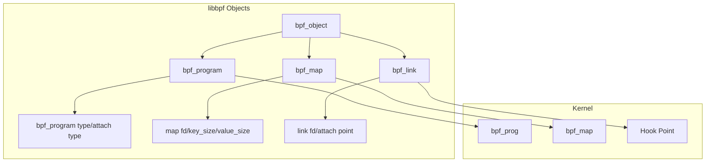

# Chapter 193: libbpf and BPF Skeleton — libbpf API, Skeleton Generation, CO-RE Patterns

## 1. Introduction and Intuition

libbpf is the **canonical C library** for working with eBPF programs in user space. It provides the complete lifecycle management for BPF objects — from loading and verifying programs to managing maps, attaching to hooks, and reading data. The BPF Skeleton is a generated interface that simplifies this even further, providing a type-safe, boilerplate-free API.

The intuition behind libbpf + skeleton is **developer ergonomics**. Writing a BPF program involves:
1. Compiling BPF bytecode
2. Loading it into the kernel
3. Setting up maps
4. Attaching to hook points
5. Reading data from maps

libbpf handles steps 2-5, and the skeleton automates most of the boilerplate. You focus on writing the BPF program, and libbpf handles the rest.

## 2. libbpf Architecture

### 2.1 Core Objects



### 2.2 Object Lifecycle

```mermaid
sequenceDiagram
    participant User as User Space
    participant Libbpf as libbpf
    participant Kernel as Kernel

    User->>Libbpf: bpf_object__open("prog.o")
    Libbpf->>Libbpf: Parse ELF sections
    Libbpf->>Libbpf: Extract BPF programs
    Libbpf->>Libbpf: Extract maps
    Libbpf->>Libbpf: Process relocations (CO-RE)
    Libbpf-->>User: bpf_object

    User->>Libbpf: bpf_object__load(obj)
    Libbpf->>Kernel: bpf(BPF_PROG_LOAD) for each program
    Kernel->>Kernel: Verify, JIT compile
    Libbpf->>Kernel: bpf(BPF_MAP_CREATE) for each map
    Libbpf-->>User: loaded object

    User->>Libbpf: bpf_program__attach(prog)
    Libbpf->>Kernel: bpf(BPF_LINK_CREATE)
    Libbpf-->>User: bpf_link

    Note over User: Read maps, handle events

    User->>Libbpf: bpf_object__close(obj)
    Libbpf->>Kernel: Cleanup (close fds)
```



## 3. libbpf API Reference

### 3.1 Opening and Loading

```c
#include <bpf/libbpf.h>
#include <bpf/bpf.h>

int main(void)
{
    struct bpf_object *obj;
    struct bpf_program *prog;
    struct bpf_map *map;
    int err;

    /* Open BPF object file */
    obj = bpf_object__open("my_prog.bpf.o");
    if (libbpf_get_error(obj)) {
        fprintf(stderr, "Failed to open BPF object\n");
        return 1;
    }

    /* Load into kernel (verifies, JITs, creates maps) */
    err = bpf_object__load(obj);
    if (err) {
        fprintf(stderr, "Failed to load BPF object: %d\n", err);
        goto cleanup;
    }

    /* Get program by section name */
    prog = bpf_object__find_program_by_name(obj, "my_prog");
    if (!prog) {
        fprintf(stderr, "Program not found\n");
        goto cleanup;
    }

    /* Get map by name */
    map = bpf_object__find_map_by_name(obj, "my_map");
    if (!map) {
        fprintf(stderr, "Map not found\n");
        goto cleanup;
    }

    /* Attach program */
    struct bpf_link *link = bpf_program__attach(prog);
    if (libbpf_get_error(link)) {
        fprintf(stderr, "Failed to attach\n");
        goto cleanup;
    }

    /* Use the program... */

cleanup:
    bpf_link__destroy(link);
    bpf_object__close(obj);
    return 0;
}
```

### 3.2 Program Operations

```c
/* Find programs */
struct bpf_program *prog;
prog = bpf_object__find_program_by_name(obj, "my_prog");
prog = bpf_object__find_program_by_title(obj, "xdp/my_prog");

/* Iterate over all programs */
bpf_object__for_each_program(prog, obj) {
    const char *name = bpf_program__name(prog);
    const char *section = bpf_program__section_name(prog);
    enum bpf_prog_type type = bpf_program__type(prog);
    printf("Program: %s (section: %s, type: %d)\n", name, section, type);
}

/* Set program type before loading */
bpf_program__set_type(prog, BPF_PROG_TYPE_XDP);

/* Auto-attach based on SEC() annotation */
struct bpf_link *link = bpf_program__attach(prog);

/* Manual attachment */
struct bpf_link *link;
link = bpf_program__attach_kprobe(prog, false, "do_sys_openat2");
link = bpf_program__attach_tracepoint(prog, "syscalls", "sys_enter_read");
link = bpf_program__attach_xdp(prog, ifindex);
link = bpf_program__attach_tc(prog, ifindex, "ingress");
```

### 3.3 Map Operations

```c
/* Find maps */
struct bpf_map *map;
map = bpf_object__find_map_by_name(obj, "my_map");
map = bpf_object__find_map_by_id(obj, map_id);

/* Get map info */
int fd = bpf_map__fd(map);
const char *name = bpf_map__name(map);
enum bpf_map_type type = bpf_map__type(map);
__u32 key_size = bpf_map__key_size(map);
__u32 value_size = bpf_map__value_size(map);
__u32 max_entries = bpf_map__max_entries(map);

/* Iterate maps */
bpf_object__for_each_map(map, obj) {
    printf("Map: %s (type=%d, max_entries=%u)\n",
            bpf_map__name(map), bpf_map__type(map),
            bpf_map__max_entries(map));
}

/* Element operations via bpf_map_* wrappers */
__u32 key = 42;
__u64 value;

err = bpf_map__lookup_elem(map, &key, sizeof(key), &value, sizeof(value), 0);
err = bpf_map__update_elem(map, &key, sizeof(key), &value, sizeof(value), BPF_ANY);
err = bpf_map__delete_elem(map, &key, sizeof(key), 0);

/* Batch operations */
__u32 keys[16];
__u64 values[16];
__u32 count = 16;
err = bpf_map__lookup_batch(map, NULL, NULL, keys, sizeof(keys[0]),
                             values, sizeof(values[0]), &count, NULL);

/* Freeze map */
err = bpf_map__freeze(map);
```

### 3.4 Link Management

```c
/* Create links */
struct bpf_link *link;

/* Auto-attach (uses SEC() annotation) */
link = bpf_program__attach(prog);

/* Manual attachment methods */
link = bpf_program__attach_kprobe(prog, false, "tcp_sendmsg");
link = bpf_program__attach_kprobe(prog, true, "tcp_sendmsg");  /* retprobe */
link = bpf_program__attach_tracepoint(prog, "syscalls", "sys_enter_read");
link = bpf_program__attach_raw_tracepoint(prog, "sys_enter");
link = bpf_program__attach_fentry(prog);
link = bpf_program__attach_fexit(prog);
link = bpf_program__attach_uprobe(prog, false, -1, "/usr/lib/libc.so.6", 0);
link = bpf_program__attach_uretprobe(prog, false, -1, "/usr/lib/libc.so.6", 0);
link = bpf_program__attach_xdp(prog, ifindex);
link = bpf_program__attach_tc(prog, ifindex, "ingress");
link = bpf_program__attach_cgroup(prog, cgroup_fd);
link = bpf_program__attach_lsm(prog);

/* Destroy link (detaches program) */
bpf_link__destroy(link);

/* Pin link to BPF filesystem */
bpf_link__pin(link, "/sys/fs/bpf/my_link");

/* Destroy link but keep pinned */
bpf_link__destroy(link);  /* detached but still pinned */

/* Unpin */
unlink("/sys/fs/bpf/my_link");
```

## 4. BPF Skeleton

### 4.1 What is the Skeleton?

The BPF Skeleton is a **generated C header** that provides a type-safe, high-level API for your specific BPF program. It's generated by `bpftool gen skeleton` from the BPF object file.

```c
// Generated from my_prog.bpf.o:
// bpftool gen skeleton my_prog.bpf.o > my_prog.skel.h

struct my_prog {
    struct bpf_object_skeleton *skeleton;
    struct bpf_object *obj;
    struct {
        struct bpf_program *my_prog;
    } progs;
    struct {
        struct bpf_map *events;
        struct bpf_map *counts;
    } maps;
    struct {
        struct bpf_link *my_prog;
    } links;
};
```

### 4.2 Skeleton API

```c
#include "my_prog.skel.h"

int main(void)
{
    struct my_prog *skel;
    int err;

    /* Open (allocates and opens BPF object) */
    skel = my_prog__open();
    if (!skel) {
        fprintf(stderr, "Failed to open BPF skeleton\n");
        return 1;
    }

    /* Customize before loading */
    // bpf_program__set_type(skel->progs.my_prog, BPF_PROG_TYPE_XDP);

    /* Load (verifies, JITs, creates maps) */
    err = my_prog__load(skel);
    if (err) {
        fprintf(stderr, "Failed to load BPF skeleton: %d\n", err);
        goto cleanup;
    }

    /* Attach (attaches all programs) */
    err = my_prog__attach(skel);
    if (err) {
        fprintf(stderr, "Failed to attach BPF skeleton: %d\n", err);
        goto cleanup;
    }

    /* Use the program */
    printf("BPF program loaded and attached\n");

    /* Access maps directly */
    int map_fd = bpf_map__fd(skel->maps.counts);
    
    /* Read events from ring buffer */
    struct ring_buffer *rb = ring_buffer__new(
        bpf_map__fd(skel->maps.events),
        handle_event, NULL, NULL
    );

    while (1) {
        ring_buffer__poll(rb, 1000);
    }

    ring_buffer__free(rb);

cleanup:
    my_prog__destroy(skel);
    return err != 0;
}
```

### 4.3 Skeleton Generation

```bash
# Compile BPF program
clang -g -O2 -target bpf -c my_prog.bpf.c -o my_prog.bpf.o

# Generate skeleton
bpftool gen skeleton my_prog.bpf.o > my_prog.skel.h

# Or in Makefile
my_prog.skel.h: my_prog.bpf.o
    bpftool gen skeleton $< > $@
```

### 4.4 Skeleton Features

The generated skeleton provides:

1. **Type-safe access**: Direct access to maps and programs by name
2. **Auto-attach**: `my_prog__attach()` attaches all programs
3. **Auto-cleanup**: `my_prog__destroy()` frees all resources
4. **Data sections**: Global variables accessible from user space
5. **BTF**: Embedded BTF for CO-RE relocations

## 5. Data Sections and Global Variables

### 5.1 Exposing Data to User Space

BPF programs can expose global variables through data sections:

```c
// my_prog.bpf.c
#include <vmlinux.h>
#include <bpf/bpf_helpers.h>

/* Global variable accessible from user space */
const volatile u32 target_pid = 0;
volatile u64 total_count = 0;
bool enabled = true;

SEC("fentry/tcp_sendmsg")
int BPF_PROG(trace_tcp, struct sock *sk, struct msghdr *msg, size_t size)
{
    u32 pid = bpf_get_current_pid_tgid() >> 32;
    
    if (target_pid && pid != target_pid)
        return 0;
    
    if (!enabled)
        return 0;
    
    __sync_fetch_and_add(&total_count, 1);
    return 0;
}

char LICENSE[] SEC("license") = "GPL";
```

### 5.2 Accessing Globals from User Space

```c
// User-space access via skeleton
struct my_prog *skel = my_prog__open();

/* Set target PID before loading */
skel->rodata->target_pid = 1234;

/* Load and attach */
my_prog__load(skel);
my_prog__attach(skel);

/* Read runtime data */
printf("Total count: %llu\n", skel->bss->total_count);

/* Modify runtime control */
skel->bss->enabled = false;  /* Disable tracing */

/* Cleanup */
my_prog__destroy(skel);
```

### 5.3 Data Section Types

| Section | Access | Purpose |
|---|---|---|
| `.rodata` | Read-only after load | Configuration constants |
| `.bss` | Read-write | Runtime variables |
| `.data` | Read-write | Initialized runtime data |

## 6. Ring Buffer Integration

### 6.1 Modern Event Handling

```c
// BPF side (my_prog.bpf.c)
struct event {
    u32 pid;
    u32 uid;
    char comm[16];
    u64 ts;
};

struct {
    __uint(type, BPF_MAP_TYPE_RINGBUF);
    __uint(max_entries, 256 * 1024);
} events SEC(".maps");

SEC("tracepoint/syscalls/sys_enter_execve")
int trace_execve(struct trace_event_raw_sys_enter *ctx)
{
    struct event *e;
    
    e = bpf_ringbuf_reserve(&events, sizeof(*e), 0);
    if (!e)
        return 0;
    
    e->pid = bpf_get_current_pid_tgid() >> 32;
    e->uid = bpf_get_current_uid_gid();
    bpf_get_current_comm(&e->comm, sizeof(e->comm));
    e->ts = bpf_ktime_get_ns();
    
    bpf_ringbuf_submit(e, 0);
    return 0;
}
```

```c
// User-space side
#include <bpf/libbpf.h>

static int handle_event(void *ctx, void *data, size_t data_sz)
{
    struct event *e = data;
    printf("PID: %d, UID: %d, Comm: %s, Time: %llu\n",
            e->pid, e->uid, e->comm, e->ts);
    return 0;
}

int main(void)
{
    struct my_prog *skel;
    struct ring_buffer *rb;

    skel = my_prog__open_and_load();
    my_prog__attach(skel);

    rb = ring_buffer__new(bpf_map__fd(skel->maps.events),
                           handle_event, NULL, NULL);
    if (!rb) {
        fprintf(stderr, "Failed to create ring buffer\n");
        return 1;
    }

    while (1) {
        int err = ring_buffer__poll(rb, 1000);
        if (err < 0) {
            fprintf(stderr, "Error polling ring buffer: %d\n", err);
            break;
        }
    }

    ring_buffer__free(rb);
    my_prog__destroy(skel);
    return 0;
}
```

### 6.2 Ring Buffer Callbacks

```c
/* Callback for each event */
static int handle_event(void *ctx, void *data, size_t data_sz)
{
    struct event *e = data;
    /* Process event */
    return 0;  /* continue polling */
}

/* Callback for lost events */
static void handle_lost(void *ctx, int cpu, __u64 lost_cnt)
{
    fprintf(stderr, "Lost %llu events on CPU %d\n", lost_cnt, cpu);
}

/* Create ring buffer with lost event handler */
rb = ring_buffer__new(map_fd, handle_event, NULL, NULL);
ring_buffer__set_callback(rb, handle_lost);

/* Poll with timeout */
while (1) {
    ring_buffer__poll(rb, 100 /* timeout ms */);
}
```

## 7. Advanced Patterns

### 7.1 Program Array for Tail Calls

```c
// BPF side
struct {
    __uint(type, BPF_MAP_TYPE_PROG_ARRAY);
    __uint(max_entries, 256);
    __type(key, u32);
    __type(value, u32);
} prog_array SEC(".maps");

SEC("xdp")
int dispatcher(struct xdp_md *ctx)
{
    u32 key = parse_protocol(ctx);
    bpf_tail_call(ctx, &prog_array, key);
    return XDP_PASS;
}
```

```c
// User-space side
struct my_prog *skel = my_prog__open_and_load();

/* Get program FDs for tail call array */
int prog_fd = bpf_program__fd(skel->progs.tcp_handler);
u32 key = IPPROTO_TCP;
bpf_map__update_elem(skel->maps.prog_array, &key, sizeof(key),
                      &prog_fd, sizeof(prog_fd), BPF_ANY);
```

### 7.2 Map-in-Map

```c
// BPF side — inner map template
struct inner_map_t {
    __uint(type, BPF_MAP_TYPE_HASH);
    __uint(max_entries, 100);
    __type(key, u32);
    __type(value, u64);
};

struct {
    __uint(type, BPF_MAP_TYPE_ARRAY_OF_MAPS);
    __uint(max_entries, 16);
    __type(key, u32);
    __array(values, struct inner_map_t);
} outer_map SEC(".maps") = {
    .values = { &inner_map },
};
```

```c
// User-space side — create inner maps and populate outer map
struct my_prog *skel = my_prog__open_and_load();

/* Create inner maps */
int inner_fd = bpf_create_map(BPF_MAP_TYPE_HASH, sizeof(u32),
                                sizeof(u64), 100, 0);

/* Insert into outer map */
u32 outer_key = 0;
bpf_map__update_elem(skel->maps.outer_map, &outer_key, sizeof(outer_key),
                      &inner_fd, sizeof(inner_fd), BPF_ANY);
```

### 7.3 Multi-Program Skeleton

For BPF programs with multiple programs:

```c
// multi_prog.bpf.c
SEC("xdp")
int xdp_firewall(struct xdp_md *ctx) { /* ... */ }

SEC("tc")
int tc_shaper(struct __sk_buff *skb) { /* ... */ }

SEC("kprobe/tcp_sendmsg")
int trace_tcp(struct pt_regs *ctx) { /* ... */ }
```

```c
// Generated skeleton provides access to all programs
struct multi_prog *skel = multi_prog__open_and_load();

// Individual program attachment
struct bpf_link *xdp_link = bpf_program__attach_xdp(skel->progs.xdp_firewall, ifindex);
struct bpf_link *tc_link = bpf_program__attach_tc(skel->progs.tc_shaper, ifindex, "ingress");
struct bpf_link *kprobe_link = bpf_program__attach_kprobe(skel->progs.trace_tcp, false, "tcp_sendmsg");
```

## 8. Error Handling

### 8.1 libbpf Error Codes

```c
/* Check for errors */
struct bpf_object *obj = bpf_object__open("prog.o");
if (libbpf_get_error(obj)) {
    int err = libbpf_get_error(obj);
    fprintf(stderr, "Error: %s\n", strerror(-err));
}

/* Or use the newer API */
LIBBPF_OPTS(bpf_object_open_opts, opts);
struct bpf_object *obj = bpf_object__open_file("prog.o", &opts);
if (!obj) {
    fprintf(stderr, "Failed to open: %s\n", strerror(errno));
}
```

### 8.2 Verifier Log Access

```c
/* Enable verbose verifier logging */
LIBBPF_OPTS(bpf_object_open_opts, opts);
opts.kernel_log_level = 1;  /* or 2 for more verbose */

struct bpf_object *obj = bpf_object__open_file("prog.o", &opts);

/* After load failure, check verifier log */
if (bpf_object__load(obj)) {
    /* Verifier log is available via bpf_program__log() */
    const char *log = bpf_program__log_buf(prog, &log_size);
    fprintf(stderr, "Verifier log:\n%s\n", log);
}
```

### 8.3 Common Errors

```c
/* EACCES — permission denied */
/* Solution: Run as root or set CAP_BPF */

/* EINVAL — invalid program */
/* Solution: Check BPF program, use bpftool to inspect */

/* E2BIG — program too complex */
/* Solution: Simplify logic, reduce branches */

/* ENOENT — map/program not found */
/* Solution: Check section names, use bpftool to verify */
```

## 9. Performance Optimization

### 9.1 Minimize Kernel-User Transitions

```c
/* Bad: frequent map lookups */
while (running) {
    bpf_map__lookup_elem(map, &key, sizeof(key), &val, sizeof(val), 0);
    process(val);
}

/* Good: batch operations */
__u32 keys[64];
__u64 values[64];
__u32 count = 64;
bpf_map__lookup_batch(map, NULL, NULL, keys, sizeof(keys[0]),
                       values, sizeof(values[0]), &count, NULL);
```

### 9.2 Use Ring Buffer for Events

```c
/* Ring buffer is more efficient than perf event array */
rb = ring_buffer__new(map_fd, handle_event, NULL, NULL);
while (1) {
    ring_buffer__poll(rb, 100);
}
```

### 9.3 Minimize Map Size

```c
/* Don't create oversized maps */
/* Calculate actual needs */
u32 max_entries = estimate_unique_keys();
bpf_map__set_max_entries(map, max_entries);
```

## 10. Security Considerations

### 10.1 Privilege Requirements

```c
/* Loading BPF programs requires privileges */
/* Use libbpf's setns API for container support */

/* Pin objects for persistence */
bpf_object__pin(obj, "/sys/fs/bpf/my_obj");

/* Access pinned objects */
obj = bpf_object__open("/sys/fs/bpf/my_obj");
```

### 10.2 Safe Map Access

```c
/* Always check return values */
err = bpf_map__lookup_elem(map, &key, sizeof(key), &val, sizeof(val), 0);
if (err == -ENOENT) {
    /* Key not found */
} else if (err) {
    /* Other error */
}

/* Validate data before use */
if (val.size > MAX_SIZE) {
    /* Reject invalid data */
}
```

## 11. Common Pitfalls

### 11.1 Forgetting Skeleton Cleanup

```c
/* Bad: memory leak */
struct my_prog *skel = my_prog__open_and_load();
// ... use program
// Missing: my_prog__destroy(skel);

/* Good: always cleanup */
struct my_prog *skel = my_prog__open_and_load();
// ... use program
my_prog__destroy(skel);
```

### 11.2 Wrong Section Names

```c
/* Bad: section name doesn't match expected format */
SEC("my_custom_section")
int my_prog(struct xdp_md *ctx) { ... }

/* Good: use standard section names */
SEC("xdp")
int my_xdp_prog(struct xdp_md *ctx) { ... }
```

### 11.3 Missing Ring Buffer Cleanup

```c
/* Bad */
struct ring_buffer *rb = ring_buffer__new(...);
// ... use ring buffer
// Missing: ring_buffer__free(rb);

/* Good */
ring_buffer__free(rb);
```

### 11.4 Map Update Before Load

```c
/* Bad: trying to update map before loading */
struct my_prog *skel = my_prog__open();
__u32 key = 0, val = 42;
bpf_map__update_elem(skel->maps.my_map, &key, sizeof(key),
                      &val, sizeof(val), BPF_ANY);
/* Map doesn't exist yet — this fails! */

/* Good: update after loading */
struct my_prog *skel = my_prog__open();
my_prog__load(skel);
__u32 key = 0, val = 42;
bpf_map__update_elem(skel->maps.my_map, &key, sizeof(key),
                      &val, sizeof(val), BPF_ANY);
/* Map exists after load — this works */
```

### 11.5 Skeleton Generation Order

```bash
# Bad: generate skeleton before compiling BPF program
bpftool gen skeleton my_prog.o > my_prog.skel.h  # .o doesn't exist yet!

# Good: compile first, then generate skeleton
clang -g -O2 -target bpf -c my_prog.bpf.c -o my_prog.bpf.o
bpftool gen skeleton my_prog.bpf.o > my_prog.skel.h
```

## 12. Best Practices

1. **Use skeleton**: It eliminates boilerplate and provides type safety
2. **Use ring buffer**: Not perf event array
3. **Check all return values**: libbpf functions can fail
4. **Use LIBBPF_OPTS**: For options structures
5. **Pin important objects**: For persistence across process restarts
6. **Use CO-RE**: Always, for portability
7. **Generate skeleton automatically**: In your build system
8. **Test with bpftool**: Before integrating into your application

## 13. Exercises

### Exercise 1: Complete Skeleton Application

Write a complete BPF application using the skeleton pattern:
- BPF program that traces process creation
- User-space loader that reads events
- Proper error handling and cleanup

### Exercise 2: Multi-Program Application

Create a BPF object with multiple programs:
- XDP program for packet filtering
- kprobe for tracing
- Use skeleton to manage all programs

### Exercise 3: Dynamic Configuration

Write a BPF program with configurable parameters:
- Expose configuration via .rodata
- Modify from user space before loading
- Use .bss for runtime control

## 14. libbpf Internals

### 14.1 ELF Section Parsing

libbpf parses BPF object files by examining ELF sections:

```c
/* libbpf.c */

static int bpf_object__elf_collect(struct bpf_object *obj)
{
    Elf *elf = obj->efile.elf;
    Elf_Scn *scn = NULL;
    GElf_Ehdr *ehdr = &obj->efile.ehdr;
    
    while ((scn = elf_nextscn(elf, scn)) != NULL) {
        const char *name;
        GElf_Shdr sh;
        Elf_Data *data;
        
        gelf_getshdr(scn, &sh);
        name = elf_strptr(elf, ehdr->e_shstrndx, sh.sh_name);
        
        /* Parse program sections */
        if (sh.sh_type == SHT_PROGBITS &&
            (strcmp(name, "xdp") == 0 ||
             strcmp(name, "tc") == 0 ||
             strcmp(name, "kprobe/") == 0 ||
             starts_with(name, "tracepoint/") ||
             starts_with(name, "fentry/") ||
             starts_with(name, "fexit/") ||
             /* ... more section types */)) {
            
            struct bpf_program *prog;
            prog = bpf_object__add_program(obj, name, data);
            /* ... */
        }
        
        /* Parse map sections */
        if (strcmp(name, ".maps") == 0) {
            bpf_object__parse_maps(obj, data);
        }
        
        /* Parse BTF */
        if (strcmp(name, ".BTF") == 0) {
            obj->btf = btf__new(data->d_buf, sh.sh_size);
        }
        
        /* Parse CO-RE relocations */
        if (strcmp(name, ".rel.BPF_PROG") == 0 ||
            strcmp(name, ".rel.BPF_MAP") == 0) {
            bpf_object__parse_relos(obj, data);
        }
    }
    
    return 0;
}
```

### 14.2 Program Loading Sequence

```c
static int bpf_object__load_prog(struct bpf_object *obj,
                                  struct bpf_program *prog)
{
    struct bpf_load_program_attr attr = {};
    
    /* Apply CO-RE relocations */
    err = bpf_object__relocate_core(obj, prog);
    
    /* Prepare load attributes */
    attr.prog_type = prog->type;
    attr.expected_attach_type = prog->expected_attach_type;
    attr.insns = prog->insns;
    attr.insn_cnt = prog->insns_cnt;
    attr.license = obj->license;
    attr.kern_version = obj->kern_version;
    attr.log_level = obj->log_level;
    attr.log_buf = prog->log_buf;
    attr.log_size = prog->log_size;
    
    /* Load via bpf() syscall */
    prog->fd = bpf_load_program_xattr(&attr, prog->log_buf, prog->log_size);
    
    if (prog->fd < 0) {
        /* Handle errors, retry with verbose logging */
        attr.log_level = 1;
        prog->fd = bpf_load_program_xattr(&attr, prog->log_buf, prog->log_size);
    }
    
    return prog->fd < 0 ? -errno : 0;
}
```

### 14.3 Auto-Attachment Logic

```c
/* How libbpf auto-attaches programs based on SEC() */

static struct bpf_link *bpf_program__attach_auto(struct bpf_program *prog)
{
    const char *section = bpf_program__section_name(prog);
    
    if (strcmp(section, "xdp") == 0)
        return bpf_program__attach_xdp(prog, find_default_ifindex());
    
    if (strcmp(section, "tc") == 0 || starts_with(section, "tc/"))
        return bpf_program__attach_tc(prog, find_default_ifindex(), "ingress");
    
    if (starts_with(section, "kprobe/")) {
        const char *func = section + 7;  /* skip "kprobe/" */
        return bpf_program__attach_kprobe(prog, false, func);
    }
    
    if (starts_with(section, "tracepoint/")) {
        const char *tp = section + 11;
        char *colon = strchr(tp, ':');
        *colon = '\0';
        return bpf_program__attach_tracepoint(prog, tp, colon + 1);
    }
    
    if (starts_with(section, "fentry/")) {
        const char *func = section + 7;
        return bpf_program__attach_fentry(prog, func);
    }
    
    /* ... more cases */
    
    return ERR_PTR(-EOPNOTSUPP);
}
```

## 15. References

1. **libbpf documentation**: https://libbpf.readthedocs.io/
2. **libbpf API reference**: `tools/lib/bpf/libbpf.h`
3. **BPF skeleton**: https://nakryiko.com/posts/bpf-tips-and-tricks/
4. **bpftool**: `tools/bpf/bpftool/`
5. **libbpf-bootstrap**: https://github.com/libbpf/libbpf-bootstrap
6. **"BPF CO-RE" by Andrii Nakryiko**: LPC talks
7. **libbpf examples**: `tools/lib/bpf/examples/`
8. **BPF ring buffer**: https://nakryiko.com/posts/bpf-ring-buffer/
