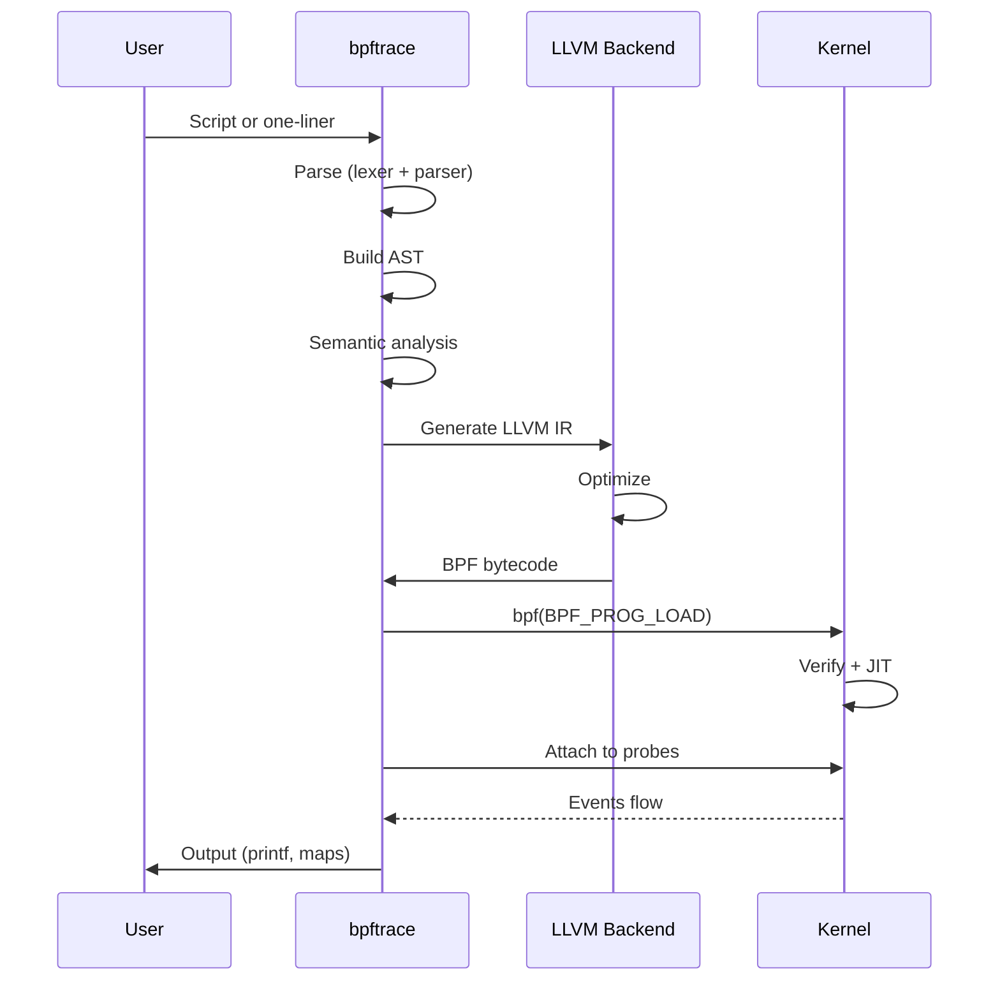

# Chapter 194: bpftrace — One-Liner Power: Probes, Maps, printf, hist, interval, BEGIN/END

## 1. Introduction and Intuition

bpftrace is a **high-level tracing language** for Linux that makes eBPF accessible through an awk/DTrace-like syntax. It's designed for **ad-hoc analysis, debugging, and one-liners** — tasks where writing a full C/BPF program would be overkill.

The intuition behind bpftrace is that **observability should be immediate**. When you have a question about system behavior, you should be able to express it as a one-liner and get an answer in seconds, not minutes or hours.

bpftrace compiles your script (or one-liner) into BPF bytecode, loads it into the kernel, attaches to the specified probe points, and collects/aggregates data according to your instructions.

## 2. Architecture

### 2.1 How bpftrace Works



### 2.2 Script Structure

A bpftrace script consists of:

```
probe_clause_1 / filter / { action_1 }
probe_clause_2 / filter / { action_2 }
probe_clause_3 / filter / { action_3 }
```

- **Probe clause**: When to run (kprobe, tracepoint, etc.)
- **Filter**: Optional condition
- **Action**: What to do (printf, map operations, etc.)

## 3. Probe Types

### 3.1 Kernel Probes

```bash
# kprobe: kernel function entry
bpftrace -e 'kprobe:do_sys_open { printf("open called\n"); }'

# kretprobe: kernel function return
bpftrace -e 'kretprobe:do_sys_open { printf("open returned %d\n", retval); }'

# kfunc: kernel function (BTF-aware, Linux 5.5+)
bpftrace -e 'fentry:tcp_sendmsg { printf("tcp_sendmsg\n"); }'
bpftrace -e 'fexit:tcp_sendmsg { printf("tcp_sendmsg returned %d\n", retval); }'

# kprobe with arguments
bpftrace -e 'kprobe:do_sys_openat2 {
    printf("pid=%d comm=%s path=%s\n", pid, comm, str(arg1));
}'
```

### 3.2 User-Space Probes

```bash
# uprobe: user function entry
bpftrace -e 'uprobe:/usr/lib/libc.so.6:write { printf("write called\n"); }'

# uretprobe: user function return
bpftrace -e 'uretprobe:/usr/lib/libc.so.6:write { printf("write returned %d\n", retval); }'

# uprobe with arguments
bpftrace -e 'uprobe:/usr/lib/libc.so.6:open {
    printf("open(%s)\n", str(arg0));
}'

# USDT probes
bpftrace -e 'usdt:/usr/sbin/nginx:nginx__http__request__start {
    printf("HTTP request started\n");
}'
```

### 3.3 Tracepoints

```bash
# Tracepoint with arguments
bpftrace -e 'tracepoint:syscalls:sys_enter_read {
    printf("read(%d, %d)\n", args->fd, args->count);
}'

# Tracepoint with struct access
bpftrace -e 'tracepoint:block:block_rq_complete {
    printf("block complete: dev=%d sector=%llu\n", args->dev, args->sector);
}'

# List available tracepoints
bpftrace -l 'tracepoint:syscalls:*'
bpftrace -l 'tracepoint:block:*'
```

### 3.4 Profile and Interval

```bash
# Timer-based sampling (99 Hz)
bpftrace -e 'profile:hz:99 { @[comm] = count(); }'

# Interval: periodic output
bpftrace -e 'interval:s:1 { printf("tick\n"); }'

# Combination: sample and output periodically
bpftrace -e '
profile:hz:99 { @[comm] = count(); }
interval:s:5 { print(@); clear(@); }
'
```

### 3.5 Software and Hardware Events

```bash
# Software events
bpftrace -e 'software:cache-misses:100 { @[comm] = count(); }'
bpftrace -e 'software:page-faults:1 { @[comm] = count(); }'

# Hardware events
bpftrace -e 'hardware:cache-misses:100000 { @[comm] = count(); }'
bpftrace -e 'hardware:instructions:1000000 { @[comm] = count(); }'
```

### 3.6 BEGIN and END

```bash
# BEGIN: runs once at start
bpftrace -e 'BEGIN { printf("Starting...\n"); }'

# END: runs once at exit
bpftrace -e 'END { printf("Done.\n"); print(@); }'

# Full lifecycle
bpftrace -e '
BEGIN { printf("Tracing... Hit Ctrl-C to end.\n"); }
kprobe:do_sys_open { @[comm] = count(); }
END { printf("\nResults:\n"); print(@); }
'
```

## 4. Variables and Types

### 4.1 Built-in Variables

```bash
# Process context
pid          # Process ID
tid          # Thread ID
uid          # User ID
gid          # Group ID
comm         # Process name
nsecs        # Nanoseconds since boot
elapsed      # Nanoseconds since bpftrace start
cpu          # CPU ID

# Probe context
probe        # Full probe name
func         # Function name (for kprobes)
retval       # Return value (for kretprobes)
args         # Tracepoint arguments struct

# Stack
ustack       # User stack trace
kstack       # Kernel stack trace
```

### 4.2 User-Defined Variables

```bash
# Global variables (persist across probes)
bpftrace -e '
kprobe:do_sys_open { @count = @count + 1; }
'

# Per-thread variables
bpftrace -e '
kprobe:do_sys_openat2 { @start[tid] = nsecs; }
kretprobe:do_sys_openat2 /@start[tid]/ {
    printf("open took %d us\n", (nsecs - @start[tid]) / 1000);
    delete(@start[tid]);
}
'
```

### 4.3 Data Types

```bash
# Integers
$x = 42;          # 64-bit integer
$y = (uint32)10;  # 32-bit unsigned

# Strings
$name = "hello";
$buf = str(arg0); # Read from pointer

# Arrays (tuples)
$t = (1, 2, 3);

# Struct access (tracepoint args)
args->field
```

## 5. Maps (Associative Arrays)

### 5.1 Basic Map Operations

```bash
# Count occurrences
bpftrace -e 'tracepoint:syscalls:sys_enter { @[comm] = count(); }'

# Sum values
bpftrace -e 'tracepoint:syscalls:sys_exit_read /args->ret > 0/ {
    @[comm] = sum(args->ret);
}'

# Average
bpftrace -e 'tracepoint:syscalls:sys_exit_read /args->ret > 0/ {
    @[comm] = avg(args->ret);
}'

# Min/Max
bpftrace -e 'tracepoint:syscalls:sys_exit_read /args->ret > 0/ {
    @[comm] = min(args->ret);
    @[comm] = max(args->ret);
}'
```

### 5.2 Histograms

```bash
# Log2 histogram
bpftrace -e 'tracepoint:syscalls:sys_exit_read /args->ret > 0/ {
    @bytes = hist(args->ret);
}'

# Output:
# @bytes: 
# [0]                  123 |****                                    |
# [1]                  456 |*******************                     |
# [2, 4)               789 |**********************************      |
# [4, 8)              1234 |**************************************************|
# ...

# Linear histogram
bpftrace -e 'tracepoint:syscalls:sys_exit_read /args->ret > 0/ {
    @bytes = lhist(args->ret, 0, 1000, 100);
}'

# Output:
# @bytes: 
# [0, 100)             123 |****                                    |
# [100, 200)           456 |*******************                     |
# [200, 300)           789 |**********************************      |
# ...
```

### 5.3 Map Key Tuples

```bash
# Multiple keys
bpftrace -e 'tracepoint:syscalls:sys_enter_read {
    @[comm, pid] = count();
}'

# Complex keys
bpftrace -e 'kprobe:tcp_sendmsg {
    $sk = (struct sock *)arg0;
    @[$sk->__sk_common.skc_daddr, $sk->__sk_common.skc_dport] = count();
}'
```

### 5.4 Map Management

```bash
# Print map
bpftrace -e '
tracepoint:syscalls:sys_enter { @[comm] = count(); }
interval:s:5 { print(@); clear(@); }
'

# Truncate map (keep top N)
bpftrace -e '
tracepoint:syscalls:sys_enter { @[comm] = count(); }
interval:s:5 { print(@, 10); clear(@); }  # top 10
'

# Delete specific key
bpftrace -e '
kprobe:do_sys_openat2 { @start[tid] = nsecs; }
kretprobe:do_sys_openat2 /@start[tid]/ {
    @latency = hist((nsecs - @start[tid]) / 1000);
    delete(@start[tid]);
}
'
```

## 6. Output Functions

### 6.1 printf

```bash
# Basic printf
bpftrace -e 'tracepoint:syscalls:sys_enter_read {
    printf("read by %s (pid=%d)\n", comm, pid);
}'

# Formatted output
bpftrace -e 'kprobe:do_sys_openat2 {
    printf("%-16s %6d %s\n", comm, pid, str(arg1));
}'
```

### 6.2 time

```bash
# Timestamp
bpftrace -e 'tracepoint:syscalls:sys_enter_read {
    time("%H:%M:%S ");
    printf("read by %s\n", comm);
}'
```

### 6.3 str

```bash
# Read string from pointer
bpftrace -e 'kprobe:do_sys_openat2 {
    printf("open: %s\n", str(arg1));
}'
```

### 6.4 buf

```bash
# Read buffer (binary data)
bpftrace -e 'kprobe:tcp_sendmsg {
    printf("data: %r\n", buf(arg1, arg2));
}'
```

### 6.5 Stack Traces

```bash
# Kernel stack
bpftrace -e 'kprobe:do_sys_openat2 { @[kstack] = count(); }'

# User stack
bpftrace -e 'kprobe:do_sys_openat2 { @[ustack] = count(); }'

# Stack with depth limit
bpftrace -e 'kprobe:do_sys_openat2 { @[kstack(5)] = count(); }'
```

## 7. Filtering

### 7.1 Simple Filters

```bash
# Filter by PID
bpftrace -e 'tracepoint:syscalls:sys_enter_read /pid == 1234/ { printf("read\n"); }'

# Filter by process name
bpftrace -e 'tracepoint:syscalls:sys_enter_read /comm == "bash"/ { printf("read\n"); }'

# Filter by return value
bpftrace -e 'tracepoint:syscalls:sys_exit_read /args->ret < 0/ { printf("read error: %d\n", args->ret); }'
```

### 7.2 Complex Filters

```bash
# Multiple conditions
bpftrace -e 'tracepoint:syscalls:sys_enter_read /pid > 1000 && args->count > 1024/ {
    printf("large read: pid=%d count=%d\n", pid, args->count);
}'

# String matching
bpftrace -e 'kprobe:do_sys_openat2 /str(arg1) == "/etc/passwd"/ {
    printf("passwd access by %s\n", comm);
}'
```

### 7.3 Sampling

```bash
# Sample 1 in 100 events
bpftrace -e 'tracepoint:syscalls:sys_enter /nsecs % 100 == 0/ {
    @[comm] = count();
}'
```

## 8. Practical Examples

### 8.1 System Call Tracer

```bash
#!/usr/bin/env bpftrace
# syscall_trace.bt

BEGIN
{
    printf("%-6s %-16s %-6s %-16s\n", "PID", "COMM", "NR", "SYSCALL");
}

tracepoint:raw_syscalls:sys_enter
{
    printf("%-6d %-16s %-6d\n", pid, comm, args->id);
}
```

### 8.2 File Access Monitor

```bash
#!/usr/bin/env bpftrace
# file_monitor.bt

BEGIN
{
    printf("Tracing file opens... Hit Ctrl-C to end.\n");
    printf("%-6s %-16s %s\n", "PID", "COMM", "FILENAME");
}

tracepoint:syscalls:sys_enter_openat
{
    printf("%-6d %-16s %s\n", pid, comm, str(args->filename));
}
```

### 8.3 Disk I/O Latency

```bash
#!/usr/bin/env bpftrace
# disk_latency.bt

BEGIN
{
    printf("Tracing disk I/O latency... Hit Ctrl-C to end.\n");
}

tracepoint:block:block_rq_issue
{
    @start[args->dev, args->sector] = nsecs;
}

tracepoint:block:block_rq_complete
/@start[args->dev, args->sector]/
{
    $latency = (nsecs - @start[args->dev, args->sector]) / 1000;
    @usecs = hist($latency);
    delete(@start[args->dev, args->sector]);
}
```

### 8.4 TCP Connection Tracer

```bash
#!/usr/bin/env bpftrace
# tcp_trace.bt

BEGIN
{
    printf("Tracing TCP connections... Hit Ctrl-C to end.\n");
    printf("%-6s %-16s %-20s %-20s\n", "PID", "COMM", "SADDR", "DADDR");
}

kprobe:tcp_connect
{
    $sk = (struct sock *)arg0;
    $daddr = ntop($sk->__sk_common.skc_daddr);
    $saddr = ntop($sk->__sk_common.skc_rcv_saddr);
    printf("%-6d %-16s %-20s %-20s\n", pid, comm, $saddr, $daddr);
}
```

### 8.5 Process Scheduler Analysis

```bash
#!/usr/bin/env bpftrace
# sched_analysis.bt

BEGIN
{
    printf("Analyzing scheduler... Hit Ctrl-C to end.\n");
}

tracepoint:sched:sched_switch
{
    @offcpu[args->prev_comm] = sum(nsecs - @switch_time[args->prev_pid]);
    @switch_time[args->next_pid] = nsecs;
    @[args->next_comm] = count();
}

interval:s:5
{
    print(@, 10);
    clear(@);
}
```

### 8.6 Memory Allocation Tracer

```bash
#!/usr/bin/env bpftrace
# mem_alloc.bt

BEGIN
{
    printf("Tracing memory allocations... Hit Ctrl-C to end.\n");
}

kprobe:__kmalloc
{
    @bytes[comm, kstack(3)] = sum(arg0);
    @count[comm, kstack(3)] = count();
}

interval:s:10
{
    printf("\nTop allocators by bytes:\n");
    print(@bytes, 10);
    clear(@bytes);
    clear(@count);
}
```

### 8.7 Function Latency Profiler

```bash
#!/usr/bin/env bpftrace
# func_latency.bt

BEGIN
{
    printf("Profiling function latency... Hit Ctrl-C to end.\n");
}

kprobe:vfs_read
{
    @start[tid] = nsecs;
}

kretprobe:vfs_read
/@start[tid]/
{
    $latency = (nsecs - @start[tid]) / 1000;
    @us = hist($latency);
    @avg_us = avg($latency);
    @max_us = max($latency);
    delete(@start[tid]);
}
```

### 8.8 Network Packet Counter

```bash
#!/usr/bin/env bpftrace
# net_counter.bt

BEGIN
{
    printf("Counting packets... Hit Ctrl-C to end.\n");
}

kprobe:netif_receive_skb
{
    @packets[comm] = count();
    @bytes[comm] = sum(((struct sk_buff *)arg0)->len);
}

interval:s:1
{
    printf("\n%-16s %-12s %-12s\n", "COMM", "PACKETS", "BYTES");
    print(@packets);
    clear(@packets);
    clear(@bytes);
}
```

## 9. Advanced Features

### 9.1 BTF Support

```bash
# Use BTF for type-safe access
bpftrace --btf -e '
fentry:tcp_sendmsg {
    printf("family=%d\n", args->sk->__sk_common.skc_family);
}
'
```

### 9.2 Signal Handling

```bash
# Send signal on specific condition
bpftrace -e '
kprobe:do_sys_openat2 /str(arg1) == "/etc/shadow"/ {
    printf("ALERT: %s accessing shadow file\n", comm);
    signal(9);  # SIGKILL
}
'
```

### 9.3 Map Iteration

```bash
# Iterate over map
bpftrace -e '
tracepoint:syscalls:sys_enter { @[comm] = count(); }
interval:s:5 {
    printf("--- Top processes ---\n");
    print(@, 10);
    clear(@);
}
'
```

### 9.4 Conditional Aggregation

```bash
# Different aggregations based on condition
bpftrace -e '
tracepoint:syscalls:sys_exit_read {
    if (args->ret > 0) {
        @success_bytes = sum(args->ret);
    } else {
        @errors = count();
    }
}
'
```

## 10. Performance Considerations

### 10.1 Overhead per Probe

| Probe Type | Overhead | Notes |
|---|---|---|
| kprobe | ~1-5 µs | Function breakpoint |
| tracepoint | ~0.1-1 µs | Static call site |
| fentry | ~0.05-0.5 µs | Direct call |
| profile | ~0.01 µs | Timer interrupt |

### 10.2 Minimizing Overhead

```bash
# Bad: trace everything
bpftrace -e 'tracepoint:raw_syscalls:sys_enter { printf(...); }'

# Good: filter early
bpftrace -e 'tracepoint:raw_syscalls:sys_enter /pid == $target/ { printf(...); }'

# Better: sample
bpftrace -e 'tracepoint:raw_syscalls:sys_enter /nsecs % 100 == 0/ { printf(...); }'
```

### 10.3 Map Size Management

```bash
# Bad: unbounded map growth
bpftrace -e 'tracepoint:syscalls:sys_enter { @[comm, pid, tid, uid] = count(); }'

# Good: aggregate by comm only
bpftrace -e 'tracepoint:syscalls:sys_enter { @[comm] = count(); }'

# Better: periodic cleanup
bpftrace -e '
tracepoint:syscalls:sys_enter { @[comm] = count(); }
interval:s:10 { print(@, 10); clear(@); }
'
```

## 11. Security Considerations

### 11.1 Privilege Requirements

```bash
# bpftrace requires root or CAP_BPF + CAP_PERFMON
sudo bpftrace -e 'tracepoint:syscalls:sys_enter_read { printf("read\n"); }'

# Or set capabilities
sudo setcap cap_bpf,cap_perfmon+ep /usr/bin/bpftrace
```

### 11.2 Data Sensitivity

```bash
# Bad: printing arbitrary memory
bpftrace -e 'kprobe:tcp_sendmsg { printf("%s\n", buf(arg1, arg2)); }'

# Good: only metadata
bpftrace -e 'kprobe:tcp_sendmsg { printf("pid=%d size=%d\n", pid, arg2); }'
```

## 12. Common Pitfalls

### 12.1 Probe Not Found

```bash
# Error: "probe not found"
# Solution: list available probes
bpftrace -l 'kprobe:tcp*'
bpftrace -l 'tracepoint:syscalls:*'
```

### 12.2 String Truncation

```bash
# Bad: long strings may be truncated
bpftrace -e 'kprobe:do_sys_openat2 { printf("%s\n", str(arg1)); }'

# Good: limit string length
bpftrace -e 'kprobe:do_sys_openat2 { printf("%.256s\n", str(arg1)); }'
```

### 12.3 Map Key Overflow

```bash
# Bad: high-cardinality keys
bpftrace -e 'kprobe:do_sys_openat2 { @[str(arg1)] = count(); }'

# Good: aggregate by comm
bpftrace -e 'kprobe:do_sys_openat2 { @[comm] = count(); }'
```

## 13. Best Practices

1. **Start with one-liners**: Quick answers to simple questions
2. **Use scripts for complex analysis**: Save and share
3. **Filter early**: Reduce overhead
4. **Aggregate appropriately**: Don't create high-cardinality maps
5. **Use histograms**: For latency and size distributions
6. **Use intervals**: For periodic output and cleanup
7. **Test on non-production first**: Understand overhead
8. **Combine with other tools**: bpftrace for ad-hoc, bcc for production
9. **Use BEGIN/END**: For initialization and cleanup
10. **Document your scripts**: Add comments explaining what each probe does

### 13.1 Script Organization

```bash
#!/usr/bin/env bpftrace
/*
 * my_trace.bt - Trace system calls
 * Usage: sudo bpftrace my_trace.bt
 * Description: This script traces all system calls and
 * aggregates them by process name.
 */

BEGIN
{
    printf("Tracing system calls... Hit Ctrl-C to end.\n");
}

tracepoint:raw_syscalls:sys_enter
{
    @[comm] = count();
}

interval:s:5
{
    printf("\nTop processes by syscall count:\n");
    print(@, 10);
    clear(@);
}

END
{
    printf("\nFinal results:\n");
    print(@);
}
```

### 13.2 Performance Optimization

```bash
/* Bad: high-frequency probe without filtering */
tracepoint:raw_syscalls:sys_enter {
    @[comm, pid, tid] = count();  /* High cardinality */
}

/* Good: filter and aggregate */
tracepoint:raw_syscalls:sys_enter /pid == $target_pid/ {
    @[comm] = count();  /* Low cardinality */
}

/* Better: sample */
tracepoint:raw_syscalls:sys_enter /nsecs % 100 == 0/ {
    @[comm] = count();
}
```

### 13.3 Debugging bpftrace Scripts

```bash
# List available probes
bpftrace -l 'tracepoint:syscalls:*'
bpftrace -l 'kprobe:tcp*'

# Verbose output
bpftrace -v -e 'tracepoint:syscalls:sys_enter_read { printf("read\n"); }'

# Dry run (don't load into kernel)
bpftrace -d -e 'tracepoint:syscalls:sys_enter_read { printf("read\n"); }'

# Show BPF bytecode
bpftrace -dd -e 'tracepoint:syscalls:sys_enter_read { printf("read\n"); }'
```

### 13.4 bpftrace Script Templates

```bash
# Template 1: Event counter with periodic output
#!/usr/bin/env bpftrace
BEGIN { printf("Starting...\n"); }
tracepoint:<category>:<event> { @[key] = count(); }
interval:s:5 { print(@); clear(@); }
END { printf("Done.\n"); }

# Template 2: Latency histogram
#!/usr/bin/env bpftrace
kprobe:<function> { @start[tid] = nsecs; }
kretprobe:<function> /@start[tid]/ {
    @us = hist((nsecs - @start[tid]) / 1000);
    delete(@start[tid]);
}

# Template 3: Process tracker
#!/usr/bin/env bpftrace
tracepoint:sched:sched_process_exec { printf("exec: %s (pid=%d)\n", comm, pid); }
tracepoint:sched:sched_process_exit { printf("exit: %s (pid=%d)\n", comm, pid); }
```

## 14. Exercises

### Exercise 1: Process Creation Tracker

Write a bpftrace script that tracks process creation, showing parent-child relationships.

### Exercise 2: I/O Bottleneck Detector

Create a script that identifies I/O bottlenecks by tracking:
- Which processes do the most I/O
- I/O latency distribution
- Most accessed files

### Exercise 3: Network Latency Analyzer

Write a script that measures TCP connection latency and builds histograms by destination IP.

### Exercise 4: Scheduler Analyzer

Write a bpftrace script that:
- Tracks context switches per process
- Measures run queue latency
- Identifies CPU-hungry processes

### Exercise 5: Memory Leak Detector

Create a script that:
- Tracks memory allocations and frees
- Identifies processes with growing memory
- Reports potential memory leaks

## 15. bpftrace Internals

### 15.1 Compilation Pipeline

bpftrace compiles scripts through multiple stages:

```c
/* bpftrace.cpp - main compilation */

int BPFtrace::run()
{
    /* 1. Parse script into AST */
    Driver driver(*this);
    driver.parse();
    
    /* 2. Semantic analysis */
    SemanticAnalyser semantics(driver.root, *this);
    semantics.analyse();
    
    /* 3. Generate LLVM IR */
    CodegenLLVM codegen(driver.root, *this);
    auto module = codegen.compile();
    
    /* 4. Optimize */
    auto optimized = codegen.optimize(module);
    
    /* 5. Generate BPF bytecode */
    auto bytecode = codegen.emit(optimized);
    
    /* 6. Load into kernel */
    for (auto &prog : bytecode) {
        int fd = bpf_prog_load(prog.type, prog.insns,
                                prog.insns_cnt, prog.license);
        prog.fd = fd;
    }
    
    /* 7. Attach to probes */
    for (auto &probe : probes) {
        attach_probe(probe);
    }
    
    /* 8. Main event loop */
    while (running) {
        poll_perf_buffers();
        handle_events();
    }
    
    /* 9. Cleanup and print final output */
    print_maps();
    
    return 0;
}
```

### 15.2 Map Creation

```c
/* How bpftrace creates maps */

int BPFtrace::create_maps()
{
    for (auto &map : maps_) {
        enum bpf_map_type type;
        
        switch (map.type) {
        case MapType::Hash:
            type = BPF_MAP_TYPE_HASH;
            break;
        case MapType::PerCPUHash:
            type = BPF_MAP_TYPE_PERCPU_HASH;
            break;
        case MapType::Array:
            type = BPF_MAP_TYPE_ARRAY;
            break;
        case MapType::PerCPUArray:
            type = BPF_MAP_TYPE_PERCPU_ARRAY;
            break;
        case MapType::StackTrace:
            type = BPF_MAP_TYPE_STACK_TRACE;
            break;
        }
        
        map.fd = bpf_create_map(type, map.key_size,
                                 map.value_size, map.max_entries, 0);
    }
    return 0;
}
```

### 15.3 Probe Attachment

```c
/* How bpftrace attaches to probes */

int BPFtrace::attach_probe(Probe &probe, const BpfBytecode &bytecode)
{
    int fd = bytecode[probe.id].fd;
    
    switch (probe.type) {
    case ProbeType::kprobe:
        probe.link_fd = bpf_link_create(fd, 0, BPF_TRACE_KPROBE, NULL);
        break;
        
    case ProbeType::kretprobe:
        probe.link_fd = bpf_link_create(fd, 0, BPF_TRACE_KPROBE, NULL);
        break;
        
    case ProbeType::tracepoint:
        probe.link_fd = bpf_link_create(fd, probe.tracepoint_id,
                                         BPF_TRACE_TRACEPOINT, NULL);
        break;
        
    case ProbeType::uprobe:
        probe.link_fd = bpf_link_create(fd, probe.uprobe_event_id,
                                         BPF_TRACE_UPROBE, NULL);
        break;
        
    case ProbeType::profile:
        /* Timer-based sampling */
        probe.perf_fd = open_perf_event(probe.freq, probe.sample_type);
        ioctl(probe.perf_fd, PERF_EVENT_IOC_SET_BPF, fd);
        ioctl(probe.perf_fd, PERF_EVENT_IOC_ENABLE, 0);
        break;
    }
    
    return 0;
}
```

### 15.4 Histogram Implementation

```c
/* How bpftrace implements histograms */

/* BPF side - log2 histogram */
static __always_inline u32 log2(u64 v)
{
    u32 r = 0;
    
    v >>= 1;
    while (v) {
        r++;
        v >>= 1;
    }
    return r;
}

/* User-space side - printing */
void BPFtrace::print_histogram(const Map &map)
{
    std::map<u64, u64> values;
    
    /* Read all map entries */
    u64 key, next_key;
    key = 0;
    while (bpf_map_get_next_key(map.fd, &key, &next_key) == 0) {
        u64 value;
        bpf_map_lookup_elem(map.fd, &next_key, &value);
        values[next_key] = value;
        key = next_key;
    }
    
    /* Find max value for scaling */
    u64 max_val = 0;
    for (auto &[k, v] : values)
        max_val = std::max(max_val, v);
    
    /* Print histogram */
    for (auto &[k, v] : values) {
        /* Key is log2(value), so actual value is 2^k */
        u64 lo = 1ULL << k;
        u64 hi = 1ULL << (k + 1);
        
        int bar_len = (int)(50.0 * v / max_val);
        
        printf("[%llu, %llu)\t%llu\t", lo, hi, v);
        for (int i = 0; i < bar_len; i++)
            printf("*");
        printf("\n");
    }
}
```

## 16. References

1. **bpftrace repository**: https://github.com/bpftrace/bpftrace
2. **bpftrace reference guide**: https://github.com/bpftrace/bpftrace/blob/master/docs/reference_guide.md
3. **bpftrace tutorial**: https://github.com/bpftrace/bpftrace/blob/master/docs/tutorial_one_liners.md
4. **BPF Performance Tools**: Brendan Gregg, Addison-Wesley
5. **bpftrace one-liners**: https://www.brendangregg.com/BPF/bpf_performance_tools_book.html
6. **DTrace guide** (inspiration for bpftrace): https://illumos.org/books/dtrace/
7. **bpftrace examples**: https://github.com/bpftrace/bpftrace/tree/master/tools
8. **"bpftrace Internals"**: https://github.com/bpftrace/bpftrace/blob/master/docs/internals_development.md
