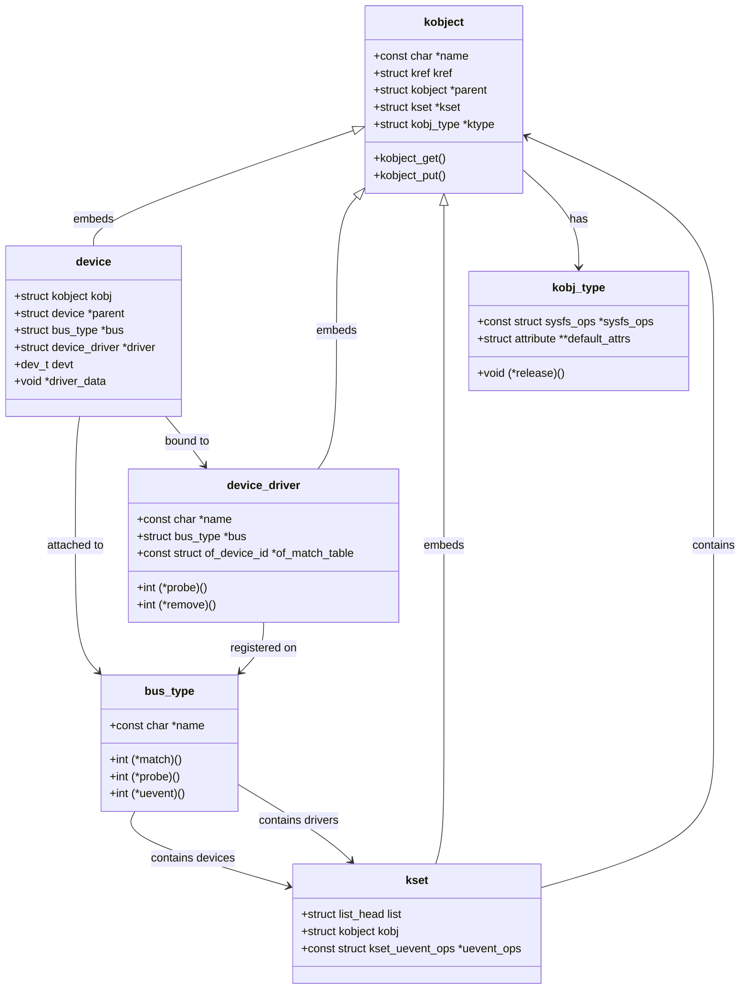
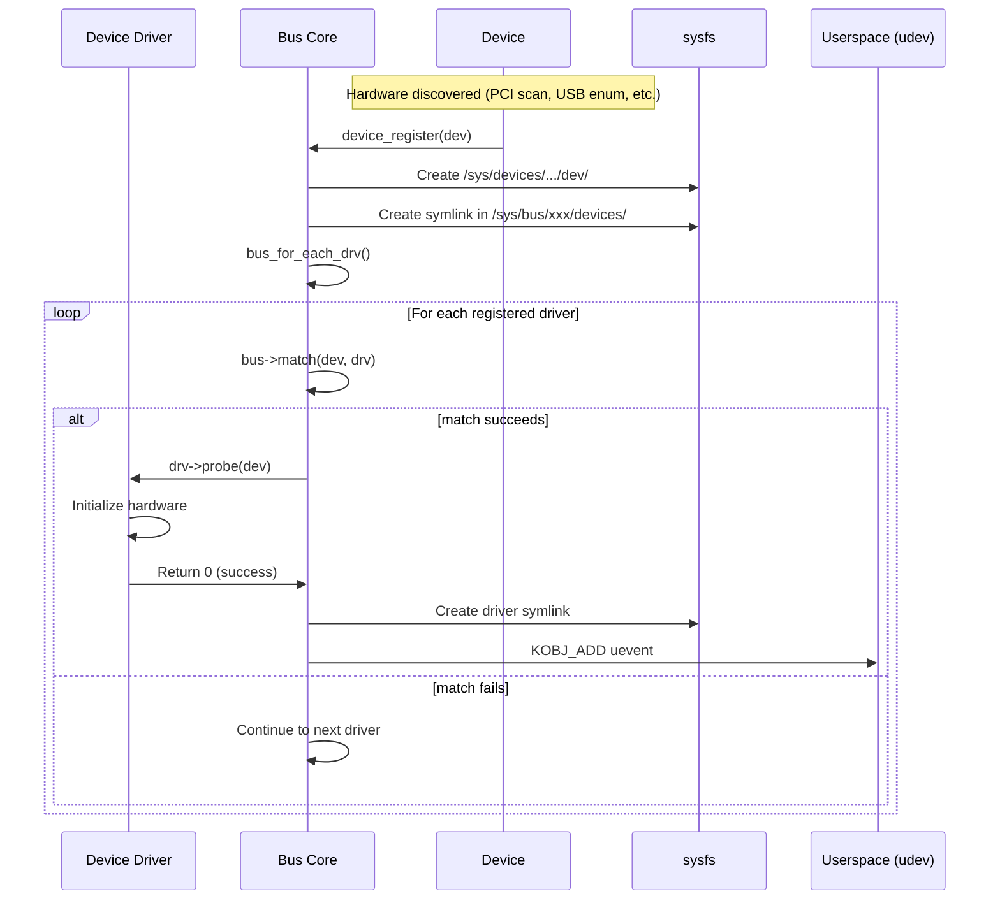
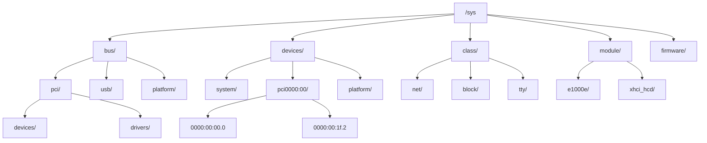

# Chapter 195: The Linux Driver Model — bus/device/driver, sysfs, kobject, device_attribute

## 1. Introduction

The Linux Driver Model (LDM) is the foundational framework that provides a unified, object-oriented approach to representing and managing devices and their drivers within the kernel. Introduced in Linux 2.6, the driver model replaced the ad-hoc device management mechanisms that existed previously with a coherent, hierarchical representation that exposes device topology to userspace through `sysfs`. Understanding the driver model is essential for anyone writing or maintaining device drivers, as it defines the contracts between buses, devices, and drivers that every modern driver must follow.

This chapter provides a comprehensive exploration of the Linux Driver Model: its philosophical foundations, architectural components, kernel implementation details, and practical usage patterns. We examine the three core abstractions—buses, devices, and drivers—along with the `kobject` infrastructure that underpins the entire system, and the `sysfs` filesystem that exposes the device tree to userspace.

## 2. Intuition

### 2.1 The Problem Before the Driver Model

Before the Linux Driver Model, each bus type (PCI, USB, ISA, etc.) maintained its own private lists of devices and drivers. There was no unified way to:

- Enumerate all devices on the system
- Determine which driver was handling which device
- Implement power management across all devices
- Express parent-child relationships between devices
- Allow userspace to observe and interact with device topology

This led to significant code duplication, inconsistent interfaces, and difficulty implementing system-wide features like power management and hotplug.

### 2.2 The Object-Oriented Analogy

The Linux Driver Model borrows heavily from object-oriented design principles, though implemented in C through structures and function pointers:

- **kobject** → The base class. Every object in the driver model inherits from `kobject`. It provides reference counting, sysfs representation, and lifecycle management.
- **ktype** → The class definition. Describes the behavior of a group of kobjects, including release methods and sysfs attributes.
- **kset** → A collection/container. Groups related kobjects together, often representing a subsystem.
- **bus_type** → An abstract base class for buses. Defines how devices and drivers on a particular bus type find each other.
- **device** → A concrete hardware entity. Represents a physical or virtual device in the system.
- **device_driver** → The software entity that manages one or more devices.

### 2.3 The Three Pillars

The driver model rests on three fundamental abstractions:

1. **Buses** — Channels over which devices and drivers communicate. A bus type knows how to enumerate its devices and match them with drivers.
2. **Devices** — Physical or virtual entities that perform I/O. Every device is attached to a bus.
3. **Drivers** — Software that manages devices. A driver declares which devices it supports through matching criteria (IDs, compatible strings, etc.).

The key insight is the **separation of device discovery from driver binding**. The bus discovers devices; drivers declare what they support; the bus matches them. This decoupling allows drivers to be loaded independently of device discovery.

## 3. Architecture

### 3.1 Layered Architecture

```
┌─────────────────────────────────────────────────┐
│                  Userspace                       │
│          (sysfs, udev, libudev)                  │
├─────────────────────────────────────────────────┤
│              sysfs / kobject layer               │
│   (kobject, kset, ktype, attribute groups)       │
├─────────────────────────────────────────────────┤
│             Device Core (drivers/base)           │
│   (device, device_driver, bus_type, class)        │
├──────────┬──────────┬──────────┬────────────────┤
│ PCI Core │ USB Core │ Platform │  Other Bus     │
│          │          │  Core    │  Types         │
├──────────┴──────────┴──────────┴────────────────┤
│           Hardware (Physical Devices)            │
└─────────────────────────────────────────────────┘
```

### 3.2 The Matching Process

When a device is discovered (or registered), the bus core performs matching:

1. The device is registered with its bus type (`device_add()`).
2. The bus iterates over registered drivers (`bus_for_each_drv()`).
3. For each driver, the bus calls its `match()` method.
4. If `match()` returns success, the bus calls `driver_probe_device()`.
5. The driver's `probe()` function initializes the device.
6. If `probe()` succeeds, the device is bound to the driver.

### 3.3 sysfs Hierarchy

The sysfs filesystem mirrors the kernel's device model hierarchy:

```
/sys/
├── bus/           # Bus types (pci, usb, platform, etc.)
│   ├── pci/
│   │   ├── devices/     -> symlinks to /sys/devices/...
│   │   └── drivers/     -> driver directories
│   ├── usb/
│   └── platform/
├── class/         # Device classes (net, block, tty, etc.)
│   ├── net/
│   ├── block/
│   └── tty/
├── devices/       # Actual device topology
│   ├── system/
│   │   └── cpu/
│   ├── pci0000:00/
│   │   ├── 0000:00:00.0
│   │   ├── 0000:00:1f.2
│   │   └── ...
│   └── platform/
│       └── serial8250/
├── dev/           # char/block device mappings
│   ├── char/
│   └── block/
├── module/        # Loaded kernel modules
└── firmware/      # Firmware interface
```

### 3.4 The kobject Foundation

Every entity in the driver model (device, driver, bus, class) contains an embedded `kobject`. The kobject provides:

- **Reference counting** via `kref`
- **sysfs representation** — a directory in `/sys`
- **Parent-child relationships** — forming the device hierarchy
- **Lifecycle management** — via `ktype` release callbacks

## 4. Kernel Implementation

### 4.1 kobject (lib/kobject.c, include/linux/kobject.h)

The `kobject` structure:

```c
struct kobject {
    const char        *name;           /* kobject name (sysfs directory) */
    struct list_head  entry;           /* entry in kset list */
    struct kobject    *parent;         /* parent kobject */
    struct kset       *kset;           /* kset this kobject belongs to */
    struct kobj_type  *ktype;          /* type descriptor */
    struct kernfs_node *sd;            /* sysfs directory entry */
    struct kref       kref;            /* reference count */
#ifdef CONFIG_DEBUG_KOBJECT_RELEASE
    struct delayed_work release;
#endif
    unsigned int state_initialized:1;  /* kobject has been initialized */
    unsigned int state_in_sysfs:1;     /* kobject is in sysfs */
    unsigned int state_add_uevent_sent:1;
    unsigned int state_remove_uevent_sent:1;
    unsigned int uevent_suppress:1;    /* suppress uevent */
};
```

**Key functions:**

```c
/* Initialize a kobject (sets refcount to 1) */
void kobject_init(struct kobject *kobj, struct kobj_type *ktype);

/* Set the name of a kobject */
int kobject_set_name(struct kobject *kobj, const char *fmt, ...);

/* Add kobject to sysfs and its parent kset */
int kobject_add(struct kobject *kobj, struct kobject *parent,
                const char *fmt, ...);

/* Create and add in one step */
int kobject_init_and_add(struct kobject *kobj, struct kobj_type *ktype,
                         struct kobject *parent, const char *fmt, ...);

/* Reference counting */
struct kobject *kobject_get(struct kobject *kobj);  /* increment */
void kobject_put(struct kobject *kobj);              /* decrement, free at 0 */

/* Remove from sysfs */
void kobject_del(struct kobject *kobj);
```

### 4.2 kobj_type and Attribute Groups

The `kobj_type` defines behavior for a class of kobjects:

```c
struct kobj_type {
    void (*release)(struct kobject *kobj);           /* destructor */
    const struct sysfs_ops *sysfs_ops;               /* show/store */
    struct attribute **default_attrs;                 /* default attributes */
    const struct kobj_ns_type_operations *(*child_ns_type)(struct kobject *kobj);
    const void *(*namespace)(struct kobject *kobj);
};
```

Sysfs operations:

```c
struct sysfs_ops {
    ssize_t (*show)(struct kobject *kobj, struct attribute *attr, char *buf);
    ssize_t (*store)(struct kobject *kobj, struct attribute *attr,
                     const char *buf, size_t count);
};
```

### 4.3 kset — Collections of kobjects

```c
struct kset {
    struct list_head list;                /* list of kobjects */
    spinlock_t list_lock;                 /* protects the list */
    struct kobject kobj;                  /* embedded kobject (parent) */
    const struct kset_uevent_ops *uevent_ops;  /* uevent handlers */
};

/* Register/unregister a kset */
int kset_register(struct kset *kset);
void kset_unregister(struct kset *kset);
```

### 4.4 bus_type

```c
struct bus_type {
    const char               *name;           /* bus name */
    const char               *dev_name;       /* device name prefix */
    struct device            *dev_root;       /* default device for bus */
    const struct attribute_group **bus_groups; /* bus attributes */
    const struct attribute_group **dev_groups; /* device attributes */
    const struct attribute_group **drv_groups; /* driver attributes */

    int (*match)(struct device *dev, struct device_driver *drv);
    int (*uevent)(struct device *dev, struct kobj_uevent_env *env);
    int (*probe)(struct device *dev);
    void (*remove)(struct device *dev);
    void (*shutdown)(struct device *dev);

    int (*online)(struct device *dev);
    int (*offline)(struct device *dev);

    int (*suspend)(struct device *dev, pm_message_t state);
    int (*resume)(struct device *dev);

    const struct dev_pm_ops *pm;
    const struct iommu_ops *iommu_ops;

    struct subsys_private *p;  /* private data */
};
```

**Registration:**

```c
int bus_register(struct bus_type *bus);
void bus_unregister(struct bus_type *bus);

/* Iterate over all devices on a bus */
int bus_for_each_dev(struct bus_type *bus, struct device *start,
                     void *data, int (*fn)(struct device *dev, void *data));

/* Iterate over all drivers on a bus */
int bus_for_each_drv(struct bus_type *bus, struct device_driver *start,
                     void *data, int (*fn)(struct device_driver *drv, void *data));
```

### 4.5 device

```c
struct device {
    struct kobject          kobj;
    struct device           *parent;         /* parent device */
    struct device_private   *p;              /* private data */
    const char              *init_name;      /* initial name */
    const struct device_type *type;          /* device type */
    struct bus_type         *bus;            /* bus this device is on */
    struct device_driver    *driver;         /* assigned driver */
    void                    *platform_data;  /* platform-specific data */
    void                    *driver_data;    /* driver-private data */
    struct dev_pm_info      power;           /* power management */
    struct dev_pm_domain    *pm_domain;      /* PM domain */

#ifdef CONFIG_PINCTRL
    struct dev_pin_info     *pins;
#endif
#ifdef CONFIG_NUMA
    int                     numa_node;
#endif
    u64                     *dma_mask;       /* DMA mask */
    u64                     coherent_dma_mask;
    struct device_dma_parameters *dma_parms;

    struct list_head        dma_pools;       /* DMA pools */
    struct dma_coherent_mem *dma_mem;        /* DMA coherent memory */

    struct cma              *cma_area;       /* CMA area */

    /* arch-specific additions */
    struct dev_archdata     archdata;
    struct device_node      *of_node;        /* OF device tree node */
    struct fwnode_handle    *fwnode;         /* firmware node */

    dev_t                   devt;            /* dev_t for char/block */
    u32                     id;              /* device instance */

    spinlock_t              devres_lock;
    struct list_head        devres_head;

    struct klist_node       knode_class;
    struct class            *class;          /* device class */
    const struct attribute_group **groups;   /* attribute groups */

    void (*release)(struct device *dev);     /* release callback */
    struct iommu_group      *iommu_group;
    bool                    offline_disabled:1;
    bool                    offline:1;
};
```

### 4.6 device_driver

```c
struct device_driver {
    const char              *name;           /* driver name */
    struct bus_type         *bus;            /* bus type */
    struct module           *owner;          /* module that owns this */
    const char              *mod_name;       /* module name */
    bool suppress_bind_attrs;                /* suppress bind/unbind */

    const struct of_device_id   *of_match_table;  /* OF match table */
    const struct acpi_device_id *acpi_match_table; /* ACPI match table */

    int (*probe)(struct device *dev);        /* probe device */
    int (*remove)(struct device *dev);       /* remove device */
    void (*shutdown)(struct device *dev);    /* shutdown */
    int (*suspend)(struct device *dev, pm_message_t state);
    int (*resume)(struct device *dev);

    const struct attribute_group **groups;
    const struct dev_pm_ops *pm;
    struct driver_private *p;
};
```

### 4.7 device_attribute

Device attributes create individual files in sysfs:

```c
struct device_attribute {
    struct attribute attr;
    ssize_t (*show)(struct device *dev, struct device_attribute *attr,
                    char *buf);
    ssize_t (*store)(struct device *dev, struct device_attribute *attr,
                     const char *buf, size_t count);
};

/* Macro to define a device attribute */
#define DEVICE_ATTR(_name, _mode, _show, _store) \
    struct device_attribute dev_attr_##_name = __ATTR(_name, _mode, _show, _store)

#define DEVICE_ATTR_RW(_name) \
    struct device_attribute dev_attr_##_name = __ATTR_RW(_name)

#define DEVICE_ATTR_RO(_name) \
    struct device_attribute dev_attr_##_name = __ATTR_RO(_name)

#define DEVICE_ATTR_WO(_name) \
    struct device_attribute dev_attr_##_name = __ATTR_WO(_name)

/* Create/remove attribute files */
int device_create_file(struct device *dev, const struct device_attribute *attr);
void device_remove_file(struct device *dev, const struct device_attribute *attr);
```

## 5. Data Structures Summary

| Structure | Header File | Purpose |
|-----------|------------|---------|
| `kobject` | `include/linux/kobject.h` | Base object, refcount, sysfs |
| `kobj_type` | `include/linux/kobject.h` | Type descriptor for kobjects |
| `kset` | `include/linux/kobject.h` | Collection of kobjects |
| `bus_type` | `include/linux/device.h` | Bus type definition |
| `device` | `include/linux/device.h` | Device representation |
| `device_driver` | `include/linux/device.h` | Driver representation |
| `device_attribute` | `include/linux/device.h` | Sysfs attribute for devices |
| `bus_attribute` | `include/linux/device.h` | Sysfs attribute for buses |
| `driver_attribute` | `include/linux/device.h` | Sysfs attribute for drivers |
| `class` | `include/linux/device/class.h` | Device class |

## 6. C Examples

### 6.1 Creating a Custom Bus Type

```c
#include <linux/module.h>
#include <linux/kernel.h>
#include <linux/device.h>
#include <linux/slab.h>

/* Example: a simple virtual bus type */

/* Match function: compare device and driver names */
static int my_bus_match(struct device *dev, struct device_driver *drv)
{
    return strcmp(dev_name(dev), drv->name) == 0;
}

/* Uevent function: add environment variables for userspace */
static int my_bus_uevent(struct device *dev, struct kobj_uevent_env *env)
{
    return add_uevent_var(env, "MY_BUS_ID=%s", dev_name(dev));
}

/* Define the bus type */
static struct bus_type my_bus_type = {
    .name   = "my_bus",
    .match  = my_bus_match,
    .uevent = my_bus_uevent,
};

/* Bus attribute: show all devices on the bus */
static ssize_t my_bus_attr_show(struct bus_type *bus, char *buf)
{
    return sprintf(buf, "My Virtual Bus\n");
}

static BUS_ATTR_RO(my_bus_attr);

/* Device release function */
static void my_bus_device_release(struct device *dev)
{
    pr_info("my_bus: device %s released\n", dev_name(dev));
}

/* Register a device on the bus */
int my_bus_register_device(struct device *dev, const char *name)
{
    dev->bus = &my_bus_type;
    dev->release = my_bus_device_release;
    dev_set_name(dev, "%s", name);
    return device_register(dev);
}
EXPORT_SYMBOL(my_bus_register_device);

/* Driver registration */
int my_bus_register_driver(struct device_driver *drv)
{
    drv->bus = &my_bus_type;
    return driver_register(drv);
}
EXPORT_SYMBOL(my_bus_register_driver);

static int __init my_bus_init(void)
{
    int ret;

    ret = bus_register(&my_bus_type);
    if (ret) {
        pr_err("my_bus: bus registration failed\n");
        return ret;
    }

    ret = bus_create_file(&my_bus_type, &bus_attr_my_bus_attr);
    if (ret)
        pr_warn("my_bus: could not create bus attribute\n");

    pr_info("my_bus: bus registered\n");
    return 0;
}

static void __exit my_bus_exit(void)
{
    bus_remove_file(&my_bus_type, &bus_attr_my_bus_attr);
    bus_unregister(&my_bus_type);
    pr_info("my_bus: bus unregistered\n");
}

module_init(my_bus_init);
module_exit(my_bus_exit);
MODULE_LICENSE("GPL");
MODULE_DESCRIPTION("Example custom bus type");
```

### 6.2 Device with Attributes

```c
#include <linux/module.h>
#include <linux/device.h>
#include <linux/slab.h>

struct my_device_data {
    int value;
    char name[32];
    struct device dev;
};

/* Attribute: show/store the value */
static ssize_t value_show(struct device *dev,
                           struct device_attribute *attr, char *buf)
{
    struct my_device_data *data = container_of(dev, struct my_device_data, dev);
    return sprintf(buf, "%d\n", data->value);
}

static ssize_t value_store(struct device *dev,
                            struct device_attribute *attr,
                            const char *buf, size_t count)
{
    struct my_device_data *data = container_of(dev, struct my_device_data, dev);
    int ret;

    ret = kstrtoint(buf, 10, &data->value);
    if (ret)
        return ret;

    return count;
}
static DEVICE_ATTR_RW(value);

/* Attribute: read-only name */
static ssize_t name_show(struct device *dev,
                          struct device_attribute *attr, char *buf)
{
    struct my_device_data *data = container_of(dev, struct my_device_data, dev);
    return sprintf(buf, "%s\n", data->name);
}
static DEVICE_ATTR_RO(name);

/* Attribute group */
static struct attribute *my_device_attrs[] = {
    &dev_attr_value.attr,
    &dev_attr_name.attr,
    NULL,
};

static struct attribute_group my_device_attr_group = {
    .attrs = my_device_attrs,
};

static const struct attribute_group *my_device_attr_groups[] = {
    &my_device_attr_group,
    NULL,
};

/* Device type with attribute groups */
static struct device_type my_device_type = {
    .name = "my_device",
    .groups = my_device_attr_groups,
};

static void my_device_release(struct device *dev)
{
    struct my_device_data *data = container_of(dev, struct my_device_data, dev);
    kfree(data);
}

static struct my_device_data *my_dev;

static int __init my_dev_init(void)
{
    int ret;

    my_dev = kzalloc(sizeof(*my_dev), GFP_KERNEL);
    if (!my_dev)
        return -ENOMEM;

    my_dev->value = 42;
    strscpy(my_dev->name, "example_device", sizeof(my_dev->name));

    my_dev->dev.type = &my_device_type;
    my_dev->dev.release = my_device_release;
    dev_set_name(&my_dev->dev, "my_device0");

    ret = device_register(&my_dev->dev);
    if (ret) {
        put_device(&my_dev->dev);
        return ret;
    }

    pr_info("my_device: registered\n");
    return 0;
}

static void __exit my_dev_exit(void)
{
    device_unregister(&my_dev->dev);
    pr_info("my_device: unregistered\n");
}

module_init(my_dev_init);
module_exit(my_dev_exit);
MODULE_LICENSE("GPL");
```

### 6.3 Using device_create with a Class

```c
#include <linux/module.h>
#include <linux/device.h>
#include <linux/cdev.h>

static struct class *my_class;
static struct device *my_device;
static dev_t my_devno;

static int __init my_simple_init(void)
{
    int ret;

    /* Allocate device number */
    ret = alloc_chrdev_region(&my_devno, 0, 1, "my_simple");
    if (ret)
        return ret;

    /* Create device class */
    my_class = class_create("my_simple_class");
    if (IS_ERR(my_class)) {
        unregister_chrdev_region(my_devno, 1);
        return PTR_ERR(my_class);
    }

    /* Create device node (appears in /dev automatically with udev) */
    my_device = device_create(my_class, NULL, my_devno, NULL, "my_simple%d", 0);
    if (IS_ERR(my_device)) {
        class_destroy(my_class);
        unregister_chrdev_region(my_devno, 1);
        return PTR_ERR(my_device);
    }

    pr_info("my_simple: device created at /dev/my_simple0\n");
    return 0;
}

static void __exit my_simple_exit(void)
{
    device_destroy(my_class, my_devno);
    class_destroy(my_class);
    unregister_chrdev_region(my_devno, 1);
    pr_info("my_simple: device removed\n");
}

module_init(my_simple_init);
module_exit(my_simple_exit);
MODULE_LICENSE("GPL");
```

## 7. Diagrams

### 7.1 Relationship Between Core Data Structures



### 7.2 Device Registration and Binding Flow



### 7.3 sysfs Hierarchy Mapping



## 8. Common Pitfalls

### 8.1 Reference Counting Mistakes

The most common bug in driver model usage is incorrect reference counting:

```c
/* WRONG: forgetting to get a reference */
struct device *dev = bus_find_device(&my_bus, NULL, data, my_match);
/* use dev without kobject_get — dev might be freed! */

/* CORRECT: always get a reference when you store a pointer */
struct device *dev = bus_find_device(&my_bus, NULL, data, my_match);
if (!dev)
    return -ENODEV;
/* ... use dev ... */
put_device(dev);  /* release when done */
```

### 8.2 Double Registration

Calling `device_register()` twice on the same device leads to corruption:

```c
/* WRONG: device_register() after already registered */
device_register(dev);
/* ... */
device_register(dev);  /* BUG: kobject already in sysfs */

/* CORRECT: use device_rename() or unregister first */
device_rename(dev, "new_name");
```

### 8.3 Missing Release Function

Every device must have a `release()` function, or the kernel will warn:

```c
/* WRONG: no release function */
dev->release = NULL;  /* WARNING at drivers/base/core.c */

/* CORRECT: always provide release */
static void my_dev_release(struct device *dev)
{
    /* Free the containing structure */
    struct my_data *data = container_of(dev, struct my_data, dev);
    kfree(data);
}
```

### 8.4 Accessing driver_data After Unbind

```c
/* WRONG: accessing driver data after driver is unbound */
ssize_t my_show(struct device *dev, ...)
{
    struct my_data *data = dev_get_drvdata(dev);  /* may be NULL! */
    return sprintf(buf, "%d\n", data->value);     /* crash */
}

/* CORRECT: check for NULL or use proper locking */
ssize_t my_show(struct device *dev, ...)
{
    struct my_data *data = dev_get_drvdata(dev);
    if (!data)
        return -ENODEV;
    return sprintf(buf, "%d\n", data->value);
}
```

### 8.5 Incorrect Attribute Permissions

```c
/* WRONG: world-writable sysfs file with no input validation */
DEVICE_ATTR(my_file, 0666, my_show, my_store);

/* CORRECT: restrict permissions appropriately */
DEVICE_ATTR(my_file, 0644, my_show, my_store);  /* root-writable only */
```

## 9. Best Practices

### 9.1 Use device-managed Resources (devres)

```c
/* Instead of manual allocation + free in error paths */
buf = devm_kzalloc(dev, size, GFP_KERNEL);
/* Automatically freed when device is removed */

/* Instead of manual ioremap + iounmap */
regs = devm_ioremap_resource(dev, res);
/* Automatically unmapped */
```

### 9.2 Use dev_info/dev_err for Logging

```c
/* Instead of pr_info/pr_err */
dev_info(dev, "device probed successfully\n");
dev_err(dev, "failed to allocate buffer\n");
/* Automatically includes device name in output */
```

### 9.3 Proper Error Handling in probe()

```c
static int my_probe(struct device *dev)
{
    struct my_data *data;
    int ret;

    data = devm_kzalloc(dev, sizeof(*data), GFP_KERNEL);
    if (!data)
        return -ENOMEM;

    ret = devm_request_irq(dev, irq, my_handler, 0, "my_dev", data);
    if (ret)
        return ret;

    ret = my_hw_init(data);
    if (ret)
        return ret;  /* devres handles cleanup */

    dev_set_drvdata(dev, data);
    dev_info(dev, "probed\n");
    return 0;
}
```

### 9.4 Use const for Attribute Definitions

```c
/* Use __ATTR_CONST for attributes that never change */
static ssize_t version_show(struct device *dev,
                             struct device_attribute *attr, char *buf)
{
    return sprintf(buf, "1.0\n");
}
static DEVICE_ATTR_RO(version);  /* read-only, const-friendly */
```

### 9.5 Prefer Attribute Groups Over Individual Attributes

```c
/* Instead of creating files one by one */
static struct attribute *my_attrs[] = {
    &dev_attr_value.attr,
    &dev_attr_status.attr,
    &dev_attr_control.attr,
    NULL,
};

static const struct attribute_group my_attr_group = {
    .attrs = my_attrs,
};

/* In probe: */
ret = devm_device_add_group(dev, &my_attr_group);
if (ret)
    return ret;
/* Automatically removed on device detach */
```

## 10. Exercises

### Exercise 1: Create a Virtual Bus

Write a kernel module that registers a custom bus type called `virt_bus`. Implement the `match()` function to compare device and driver names. Create a userspace script that loads the module and verifies the bus appears in `/sys/bus/`.

### Exercise 2: Device with Multiple Attributes

Extend the device attribute example to create a device with at least five sysfs attributes of different types (integer, string, boolean, hex). Implement proper validation in the `store()` functions.

### Exercise 3: Hotplug Notification

Write a module that registers a bus type with a custom `uevent()` function. The function should add a custom environment variable `MY_BUS_DATA` with a value derived from the device. Use `udevadm monitor` to verify the variable appears in uevent messages.

### Exercise 4: Class-Based Device

Create a character device using the class/device_create API. The device should appear in both `/sys/class/` and `/dev/`. Add a read-only sysfs attribute that shows the device's usage count (number of times opened).

### Exercise 5: Driver Binding/Unbinding

Write a bus type, a device, and a driver module. Demonstrate manual binding and unbinding via sysfs:

```bash
echo "device_name" > /sys/bus/my_bus/drivers/my_driver/unbind
echo "device_name" > /sys/bus/my_bus/drivers/my_driver/bind
```

## 11. References

### Kernel Source
- `drivers/base/core.c` — device core implementation
- `drivers/base/bus.c` — bus type management
- `drivers/base/driver.c` — driver management
- `drivers/base/class.c` — device class implementation
- `lib/kobject.c` — kobject infrastructure
- `include/linux/device.h` — core data structures
- `include/linux/kobject.h` — kobject definitions
- `Documentation/driver-api/driver-model/` — driver model documentation

### Books
- *Linux Device Drivers, 3rd Edition* — Corbet, Rubini, Kroah-Hartman (Chapter 14)
- *Linux Kernel Development, 3rd Edition* — Robert Love (Chapter 17)
- *Understanding the Linux Kernel, 3rd Edition* — Bovet & Cesati

### Online Resources
- https://www.kernel.org/doc/html/latest/driver-api/driver-model/
- https://lwn.net/Articles/driver-model/
- https://lwn.net/Articles/235745/ — Introduction to the driver model
