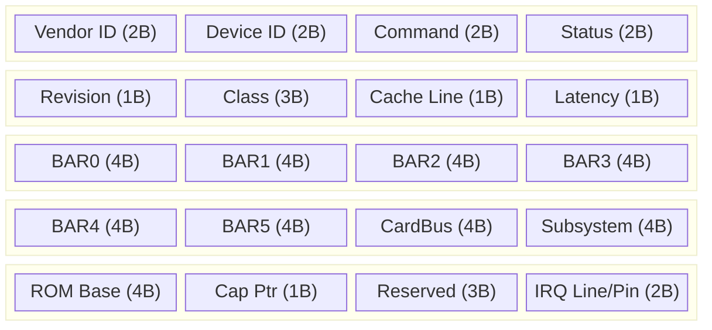
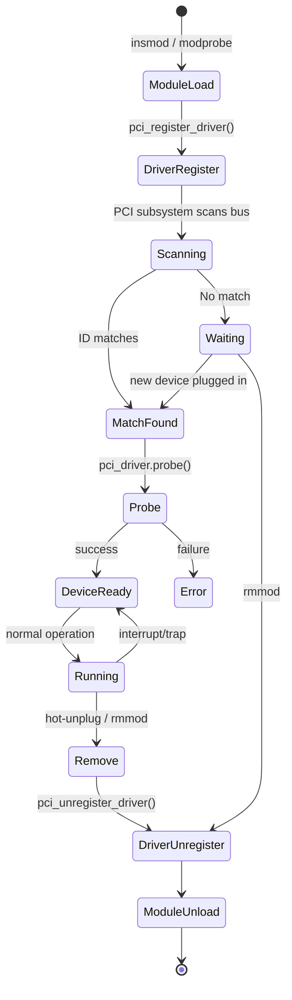
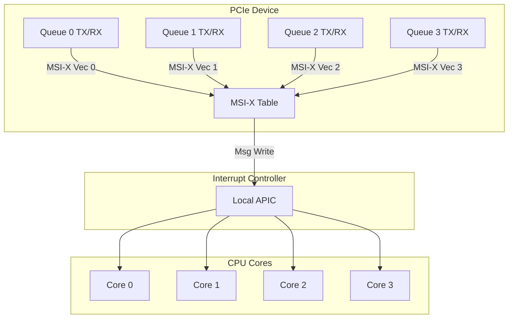

# Chapter 196: PCI Device Drivers

## 1. Introduction

PCI (Peripheral Component Interconnect) is one of the most important bus architectures in the x86 and embedded worlds. From network cards and storage controllers to GPUs and specialized accelerators, PCI devices are the backbone of most server and desktop systems. Writing a PCI device driver requires understanding the PCI configuration space, Base Address Registers (BARs), interrupt mechanisms (legacy, MSI, MSI-X), DMA, and the Linux PCI subsystem's driver model integration.

This chapter covers the complete lifecycle of a PCI driver: from device discovery through PCI ID matching, BAR mapping and resource management, interrupt setup including MSI/MSI-X, to proper probe/remove implementation and power management.

## 2. Intuition

### 2.1 What is PCI?

PCI is a parallel bus standard (later evolved to PCI Express, a serial point-to-point architecture) that provides:

- **Configuration space** — 256 bytes (PCI) or 4096 bytes (PCIe) of standardized registers that identify the device and configure its resources.
- **Memory and I/O regions** — BARs that map device memory or I/O ports into the CPU's address space.
- **Interrupts** — Legacy INTx (shared, level-triggered), MSI (Message Signaled Interrupts), and MSI-X (extended MSI).
- **DMA** — Bus-mastering capability for direct memory access.

### 2.2 PCI Configuration Space

Every PCI device has a standardized configuration header:

```
Offset  Size  Field
0x00    2     Vendor ID
0x02    2     Device ID
0x04    2     Command Register
0x06    2     Status Register
0x08    1     Revision ID
0x09    1     Programming Interface
0x0A    1     Subclass Code
0x0B    1     Class Code
0x0C    1     Cache Line Size
0x0D    1     Latency Timer
0x0E    1     Header Type
0x0F    1     BIST
0x10    4     BAR0
0x14    4     BAR1
0x18    4     BAR2
0x1C    4     BAR3
0x20    4     BAR4
0x24    4     BAR5
0x28    4     CardBus CIS Pointer
0x2C    2     Subsystem Vendor ID
0x2E    2     Subsystem Device ID
0x30    4     Expansion ROM Base
0x34    1     Capabilities Pointer
0x3C    1     Interrupt Line
0x3D    1     Interrupt Pin
```

### 2.3 BAR — Base Address Registers

BARs tell the OS what memory or I/O resources the device needs:

- **Memory BAR**: bit 0 = 0. Bits [3:1] encode type (32-bit or 64-bit). Bits [31:4] encode the base address.
- **I/O BAR**: bit 0 = 1. Bits [31:2] encode the base address.

To determine the size of a BAR:
1. Save the original BAR value
2. Write all 1s to the BAR
3. Read back — bits that are 0 indicate the size (power of 2)
4. Restore the original value

### 2.4 MSI and MSI-X

- **Legacy INTx**: Shared interrupt line, level-triggered. The device asserts INTA-INTD, and the interrupt controller routes it. All devices on the same PCI slot share the same line.
- **MSI (Message Signaled Interrupts)**: The device writes a special message to a designated memory address, which the interrupt controller interprets as an interrupt. Supports 1, 2, 4, 8, 16, or 32 vectors per device.
- **MSI-X**: Extended MSI with up to 2048 vectors, each with an independent address and data word. Allows per-queue interrupts for multi-queue devices.

## 3. Architecture

### 3.1 PCI Subsystem Architecture

```
┌─────────────────────────────────────────────────┐
│              Userspace (lspci, sysfs)            │
├─────────────────────────────────────────────────┤
│              PCI Core (drivers/pci/)             │
│  ┌─────────────┐  ┌──────────┐  ┌────────────┐ │
│  │ PCI Manager │  │ PCI IRQ  │  │ PCI Power  │ │
│  │ (scan/enumerate) │ (MSI/MSI-X) │  Management │ │
│  └─────────────┘  └──────────┘  └────────────┘ │
├─────────────────────────────────────────────────┤
│              PCI Bus Driver                      │
│     (pci_bus_type, match, probe, remove)         │
├─────────────────────────────────────────────────┤
│     PCI Device Drivers (e1000e, nvme, ahci...)   │
├─────────────────────────────────────────────────┤
│              PCI Hardware                        │
│     (Host Bridge → PCI Bus → PCI Devices)        │
└─────────────────────────────────────────────────┘
```

### 3.2 Device Enumeration

At boot (or hotplug), the PCI subsystem:

1. Scans all PCI buses starting from the host bridge.
2. For each slot, reads Vendor ID. If 0xFFFF, no device present.
3. Reads the configuration header to determine BARs, capabilities, etc.
4. Allocates resources (memory ranges, I/O ports, IRQs) for the device's BARs.
5. Creates a `struct pci_dev` and registers it with the driver model.
6. The PCI bus type's `match()` function compares the device's ID table against registered drivers.

### 3.3 PCI ID Matching

PCI matching uses multiple ID fields:

```c
struct pci_device_id {
    __u32 vendor, device;          /* Vendor and device ID */
    __u32 subvendor, subdevice;    /* Subsystem IDs */
    __u32 class, class_mask;       /* Class and subclass */
    kernel_ulong_t driver_data;    /* Private driver data */
};
```

Matching priority:
1. Vendor + Device + Subvendor + Subdevice (exact match)
2. Vendor + Device
3. Class + Class_mask (class-based match)

## 4. Kernel Implementation

### 4.1 struct pci_dev

```c
struct pci_dev {
    struct list_head bus_list;          /* node in bus->devices */
    struct pci_bus  *bus;               /* bus this device is on */
    struct pci_bus  *subordinate;       /* bridge device */

    void            *sysdata;           /* platform-specific data */
    struct proc_dir_entry *procent;     /* /proc entry */
    struct pci_slot *slot;              /* physical slot */

    unsigned int    devfn;              /* device/function number */
    unsigned short  vendor;
    unsigned short  device;
    unsigned short  subsystem_vendor;
    unsigned short  subsystem_device;
    unsigned int    class;              /* 3 bytes: base, sub, prog-if */

    u8              revision;           /* PCI revision */
    u8              hdr_type;           /* header type */
    u8              pcie_cap;           /* PCIe capability offset */
    u8              msi_cap;            /* MSI capability offset */
    u8              msix_cap;           /* MSI-X capability offset */

    u16             pcie_flags_reg;     /* PCIe capability register */

    /* BAR resources */
    struct resource resource[DEVICE_COUNT_RESOURCE];

    /* IRQ */
    unsigned int    irq;

    /* DMA */
    u64             dma_mask;
    u64             coherent_dma_mask;

    /* ... many more fields ... */

    struct device   dev;                /* embedded device structure */
    /* ... */
};
```

### 4.2 struct pci_driver

```c
struct pci_driver {
    const char              *name;              /* driver name */
    const struct pci_device_id *id_table;       /* PCI ID table */
    int (*probe)(struct pci_dev *dev, const struct pci_device_id *id);
    void (*remove)(struct pci_dev *dev);
    int (*suspend)(struct pci_dev *dev, pm_message_t state);
    int (*resume)(struct pci_dev *dev);
    void (*shutdown)(struct pci_dev *dev);
    int (*sriov_configure)(struct pci_dev *dev, int num_vfs);
    const struct pci_error_handlers *err_handler;
    const struct attribute_group **groups;
    struct device_driver    driver;             /* embedded driver */
};
```

### 4.3 PCI Resource Management

```c
/* Get BAR resource */
struct resource *pci_resource(struct pci_dev *dev, int bar);

/* Get BAR start address (physical) */
resource_size_t pci_resource_start(struct pci_dev *dev, int bar);

/* Get BAR size */
resource_size_t pci_resource_len(struct pci_dev *dev, int bar);

/* Get BAR flags */
unsigned long pci_resource_flags(struct pci_dev *dev, int bar);

/* Map a BAR into kernel virtual address space */
void __iomem *pci_iomap(struct pci_dev *dev, int bar, unsigned long maxlen);

/* Unmap */
void pci_iounmap(struct pci_dev *dev, void __iomem *addr);

/* Request a BAR region */
int pci_request_region(struct pci_dev *dev, int bar, const char *res_name);

/* Release a BAR region */
void pci_release_region(struct pci_dev *dev, int bar);

/* Request all BAR regions */
int pci_request_regions(struct pci_dev *dev, const char *res_name);

/* Release all BAR regions */
void pci_release_regions(struct pci_dev *dev);
```

### 4.4 MSI/MSI-X API

```c
/* MSI */
int pci_alloc_irq_vectors(struct pci_dev *dev, unsigned int min_vecs,
                          unsigned int max_vecs, unsigned int flags);
void pci_free_irq_vectors(struct pci_dev *dev);

int pci_irq_vector(struct pci_dev *dev, unsigned int nr);

/* Flags for pci_alloc_irq_vectors */
#define PCI_IRQ_MSI         (1 << 0)    /* Prefer MSI */
#define PCI_IRQ_MSIX        (1 << 1)    /* Prefer MSI-X */
#define PCI_IRQ_LEGACY      (1 << 2)    /* Allow legacy INTx */
#define PCI_IRQ_AFFINITY    (1 << 3)    /* Auto-assign affinity */

/* Request an IRQ for a specific vector */
int devm_request_irq(struct device *dev, int irq, irq_handler_t handler,
                     unsigned long irqflags, const char *devname, void *dev_id);
```

### 4.5 PCI DMA Setup

```c
/* Set DMA mask */
int dma_set_mask(struct device *dev, u64 mask);
int dma_set_coherent_mask(struct device *dev, u64 mask);

/* Convenience: try 64-bit first, fall back to 32-bit */
int dma_set_mask_and_coherent(struct device *dev, u64 mask);

/* Enable bus mastering (required for DMA) */
void pci_set_master(struct pci_dev *dev);
void pci_clear_master(struct pci_dev *dev);
```

## 5. Data Structures Summary

| Structure | Header | Purpose |
|-----------|--------|---------|
| `pci_dev` | `include/linux/pci.h` | Represents a PCI device |
| `pci_driver` | `include/linux/pci.h` | PCI driver registration |
| `pci_device_id` | `include/linux/mod_devicetable.h` | Device ID for matching |
| `pci_bus` | `include/linux/pci.h` | PCI bus representation |
| `resource` | `include/linux/ioport.h` | I/O resource (BAR) |

## 6. C Examples

### 6.1 Minimal PCI Driver Skeleton

```c
#include <linux/module.h>
#include <linux/pci.h>
#include <linux/interrupt.h>

#define MY_DRIVER_NAME "my_pci_driver"
#define MY_BAR 0

struct my_pci_dev {
    struct pci_dev *pdev;
    void __iomem *bar;
    resource_size_t bar_len;
    int irq;
    /* driver-specific data */
};

static irqreturn_t my_irq_handler(int irq, void *data)
{
    struct my_pci_dev *mydev = data;

    /* Read interrupt status from device */
    u32 status = readl(mydev->bar + 0x00);
    if (!(status & 0x1))
        return IRQ_NONE;  /* Not our interrupt */

    /* Acknowledge interrupt */
    writel(status & ~0x1, mydev->bar + 0x00);

    /* Handle interrupt */
    /* ... */

    return IRQ_HANDLED;
}

static int my_pci_probe(struct pci_dev *pdev,
                         const struct pci_device_id *id)
{
    struct my_pci_dev *mydev;
    int ret;

    /* Allocate driver data */
    mydev = devm_kzalloc(&pdev->dev, sizeof(*mydev), GFP_KERNEL);
    if (!mydev)
        return -ENOMEM;

    mydev->pdev = pdev;
    pci_set_drvdata(pdev, mydev);

    /* Enable the device */
    ret = pci_enable_device(pdev);
    if (ret) {
        dev_err(&pdev->dev, "failed to enable device\n");
        return ret;
    }

    /* Request BAR region */
    ret = pci_request_region(pdev, MY_BAR, MY_DRIVER_NAME);
    if (ret) {
        dev_err(&pdev->dev, "failed to request BAR%d\n", MY_BAR);
        goto err_disable;
    }

    /* Map BAR */
    mydev->bar = pci_iomap(pdev, MY_BAR, 0);
    if (!mydev->bar) {
        dev_err(&pdev->dev, "failed to map BAR%d\n", MY_BAR);
        ret = -ENOMEM;
        goto err_release;
    }
    mydev->bar_len = pci_resource_len(pdev, MY_BAR);

    /* Enable bus mastering for DMA */
    pci_set_master(pdev);

    /* Set DMA mask */
    ret = dma_set_mask_and_coherent(&pdev->dev, DMA_BIT_MASK(64));
    if (ret) {
        ret = dma_set_mask_and_coherent(&pdev->dev, DMA_BIT_MASK(32));
        if (ret) {
            dev_err(&pdev->dev, "DMA configuration failed\n");
            goto err_unmap;
        }
    }

    /* Allocate MSI interrupts */
    ret = pci_alloc_irq_vectors(pdev, 1, 1,
                                PCI_IRQ_MSI | PCI_IRQ_LEGACY);
    if (ret < 0) {
        dev_err(&pdev->dev, "failed to allocate IRQ vectors\n");
        goto err_unmap;
    }

    mydev->irq = pci_irq_vector(pdev, 0);
    ret = devm_request_irq(&pdev->dev, mydev->irq, my_irq_handler,
                           0, MY_DRIVER_NAME, mydev);
    if (ret) {
        dev_err(&pdev->dev, "failed to request IRQ %d\n", mydev->irq);
        goto err_vectors;
    }

    /* Initialize hardware */
    /* ... */

    dev_info(&pdev->dev, "probed: BAR0 at %pR, IRQ %d\n",
             &pdev->resource[MY_BAR], mydev->irq);
    return 0;

err_vectors:
    pci_free_irq_vectors(pdev);
err_unmap:
    pci_iounmap(pdev, mydev->bar);
err_release:
    pci_release_region(pdev, MY_BAR);
err_disable:
    pci_disable_device(pdev);
    return ret;
}

static void my_pci_remove(struct pci_dev *pdev)
{
    struct my_pci_dev *mydev = pci_get_drvdata(pdev);

    /* Shutdown hardware */
    /* ... */

    pci_free_irq_vectors(pdev);
    pci_iounmap(pdev, mydev->bar);
    pci_release_region(pdev, MY_BAR);
    pci_clear_master(pdev);
    pci_disable_device(pdev);

    dev_info(&pdev->dev, "removed\n");
}

/* PCI ID table */
static const struct pci_device_id my_pci_ids[] = {
    { PCI_DEVICE(0x1234, 0x5678) },          /* vendor, device */
    { PCI_DEVICE(0xABCD, 0x0001) },
    { PCI_DEVICE_CLASS(0x020000, 0xFFFFFF00) }, /* Ethernet class */
    { 0, }  /* terminator */
};
MODULE_DEVICE_TABLE(pci, my_pci_ids);

static struct pci_driver my_pci_driver = {
    .name       = MY_DRIVER_NAME,
    .id_table   = my_pci_ids,
    .probe      = my_pci_probe,
    .remove     = my_pci_remove,
    /* .suspend, .resume for power management */
};

module_pci_driver(my_pci_driver);

MODULE_LICENSE("GPL");
MODULE_DESCRIPTION("Example PCI device driver");
MODULE_AUTHOR("Your Name");
```

### 6.2 Multi-Queue with MSI-X

```c
#include <linux/module.h>
#include <linux/pci.h>
#include <linux/cpumask.h>

#define MY_NUM_QUEUES 4

struct my_queue {
    void __iomem *regs;          /* per-queue register base */
    int irq;                     /* MSI-X vector for this queue */
    int cpu;                     /* CPU affinity */
    /* per-queue data structures */
};

struct my_device {
    struct pci_dev *pdev;
    void __iomem *bar;
    struct my_queue queues[MY_NUM_QUEUES];
    int num_queues;
};

static irqreturn_t my_queue_irq(int irq, void *data)
{
    struct my_queue *q = data;

    /* Process queue */
    /* ... */

    return IRQ_HANDLED;
}

static int my_setup_msix(struct my_device *mydev)
{
    struct pci_dev *pdev = mydev->pdev;
    int i, ret, nvecs;

    nvecs = pci_alloc_irq_vectors(pdev, MY_NUM_QUEUES, MY_NUM_QUEUES,
                                  PCI_IRQ_MSIX | PCI_IRQ_AFFINITY);
    if (nvecs < 0) {
        /* Fall back to fewer vectors */
        nvecs = pci_alloc_irq_vectors(pdev, 1, 1,
                                      PCI_IRQ_MSI | PCI_IRQ_LEGACY);
        if (nvecs < 0)
            return nvecs;
    }

    mydev->num_queues = nvecs;

    for (i = 0; i < nvecs; i++) {
        struct my_queue *q = &mydev->queues[i];

        q->irq = pci_irq_vector(pdev, i);
        q->cpu = i % num_online_cpus();

        ret = devm_request_irq(&pdev->dev, q->irq, my_queue_irq,
                               0, "my_dev", q);
        if (ret)
            return ret;

        /* Set CPU affinity */
        irq_set_affinity_hint(q->irq, cpumask_of(q->cpu));
    }

    return 0;
}

static void my_teardown_msix(struct my_device *mydev)
{
    struct pci_dev *pdev = mydev->pdev;
    int i;

    for (i = 0; i < mydev->num_queues; i++)
        irq_set_affinity_hint(mydev->queues[i].irq, NULL);

    pci_free_irq_vectors(pdev);
}
```

### 6.3 Reading PCIe Capabilities

```c
#include <linux/pci.h>

static void my_dump_pcie_caps(struct pci_dev *pdev)
{
    int pos;
    u16 cap, link_status, link_width, link_speed;

    /* Check if device is PCIe capable */
    pos = pci_find_capability(pdev, PCI_CAP_ID_EXP);
    if (!pos) {
        dev_info(&pdev->dev, "Not a PCIe device\n");
        return;
    }

    pci_read_config_word(pdev, pos + PCI_EXP_FLAGS, &cap);
    dev_info(&pdev->dev, "PCIe Cap version: %d\n",
             cap & PCI_EXP_FLAGS_VERS);

    pci_read_config_word(pdev, pos + PCI_EXP_LNKSTA, &link_status);
    link_width = (link_status & PCI_EXP_LNKSTA_NLW) >>
                 PCI_EXP_LNKSTA_NLW_SHIFT;
    link_speed = link_status & PCI_EXP_LNKSTA_CLS;

    dev_info(&pdev->dev, "PCIe Link: x%d, Speed %s\n",
             link_width,
             link_speed == 1 ? "2.5 GT/s" :
             link_speed == 2 ? "5.0 GT/s" :
             link_speed == 3 ? "8.0 GT/s" :
             link_speed == 4 ? "16.0 GT/s" : "Unknown");
}
```

## 7. Diagrams

### 7.1 PCI Configuration Space Layout



### 7.2 PCI Driver Lifecycle



### 7.3 MSI-X Interrupt Architecture



## 8. Common Pitfalls

### 8.1 Forgetting pci_enable_device()

```c
/* WRONG: accessing BAR without enabling device */
mydev->bar = pci_iomap(pdev, 0, 0);  /* may fail silently */

/* CORRECT: enable first */
ret = pci_enable_device(pdev);
if (ret)
    return ret;
mydev->bar = pci_iomap(pdev, 0, 0);
```

### 8.2 Incorrect DMA Mask

```c
/* WRONG: assuming 64-bit DMA always works */
dma_set_mask(dev, DMA_BIT_MASK(64));  /* may fail on 32-bit systems */

/* CORRECT: try 64-bit, fall back to 32-bit */
ret = dma_set_mask_and_coherent(dev, DMA_BIT_MASK(64));
if (ret)
    ret = dma_set_mask_and_coherent(dev, DMA_BIT_MASK(32));
if (ret)
    return ret;
```

### 8.3 Not Enabling Bus Mastering

```c
/* WRONG: DMA descriptors not visible to device */
/* Device can't read/write memory without bus mastering */

/* CORRECT: enable before DMA operations */
pci_set_master(pdev);
```

### 8.4 Resource Leak on Error Paths

```c
/* WRONG: goto labels in wrong order */
ret = pci_enable_device(pdev);
ret = pci_request_region(pdev, 0, name);
bar = pci_iomap(pdev, 0, 0);
pci_set_master(pdev);
/* If iomap fails, nothing is cleaned up! */

/* CORRECT: unwind in reverse order */
ret = pci_enable_device(pdev);
if (ret) return ret;
ret = pci_request_region(pdev, 0, name);
if (ret) goto err_disable;
bar = pci_iomap(pdev, 0, 0);
if (!bar) goto err_release;
pci_set_master(pdev);
return 0;
/* ... */
err_release:
    pci_release_region(pdev, 0);
err_disable:
    pci_disable_device(pdev);
    return ret;
```

### 8.5 Using devm_ Inconsistently

```c
/* WRONG: mixing managed and non-managed resources */
devm_request_irq(&pdev->dev, irq, handler, 0, name, data);
/* Later in remove(): */
free_irq(irq, data);  /* Double free! devm handles it */

/* CORRECT: either use devm for everything (no manual free in remove)
   or manage everything manually */
```

## 9. Best Practices

### 9.1 Use devm_ Variants

```c
/* devm_pci_iomap replaces pci_iomap + pci_iounmap */
mydev->bar = devm_pci_iomap(pdev, MY_BAR, 0);

/* devm_pci_alloc_irq_vectors replaces pci_alloc_irq_vectors + pci_free_irq_vectors */
ret = devm_pci_alloc_irq_vectors(pdev, 1, 1, PCI_IRQ_MSI);

/* These are automatically cleaned up on device removal */
```

### 9.2 Use Module Device Table for Autoloading

```c
static const struct pci_device_id my_ids[] = {
    { PCI_DEVICE(VENDOR_ID, DEVICE_ID) },
    { 0, }
};
MODULE_DEVICE_TABLE(pci, my_ids);

/* This creates /lib/modules/.../modules.alias entries
   so udev can autoload the driver when the device appears */
```

### 9.3 Use pci_set_drvdata / pci_get_drvdata

```c
/* In probe: */
pci_set_drvdata(pdev, mydev);

/* In any other function: */
struct my_dev *mydev = pci_get_drvdata(pdev);
```

### 9.4 Check BAR Type Before Mapping

```c
/* Verify BAR is memory-mapped, not I/O */
if (!(pci_resource_flags(pdev, 0) & IORESOURCE_MEM)) {
    dev_err(&pdev->dev, "BAR0 is not MMIO\n");
    return -ENODEV;
}
```

### 9.5 Use pci_enable_device_mem() for Memory-Only Devices

```c
/* Only enables memory BARs, not I/O BARs */
ret = pci_enable_device_mem(pdev);
/* Reduces resource consumption if device doesn't need I/O ports */
```

## 10. Exercises

### Exercise 1: PCI Device Discovery

Write a kernel module that scans all PCI devices and prints their Vendor ID, Device ID, Class, and BAR information to the kernel log. Use `pci_get_device()` or `pci_dev_iter`.

### Exercise 2: BAR Read/Write

Write a PCI driver for a real or emulated (QEMU) device that:
- Maps BAR0
- Reads a device register at offset 0x00
- Writes a value to offset 0x04
- Reads it back and verifies

### Exercise 3: MSI-X Setup

Modify the PCI driver skeleton to allocate MSI-X vectors based on the number of online CPUs. Set up per-vector CPU affinity and measure interrupt latency using `ktime_get()`.

### Exercise 4: PCI Hotplug Support

Write a PCI driver that properly handles hotplug events. Test with QEMU's PCI hotplug capability. The driver should log probe/remove events and handle concurrent access safely.

### Exercise 5: Error Handling with AER

Research PCI Advanced Error Reporting (AER) and implement an `err_handler` in your PCI driver that handles corrected and uncorrected errors.

## 11. References

### Kernel Source
- `drivers/pci/` — PCI subsystem core
- `drivers/pci/probe.c` — PCI device enumeration
- `drivers/pci/msi.c` — MSI/MSI-X implementation
- `include/linux/pci.h` — PCI data structures and API
- `include/linux/mod_devicetable.h` — PCI device ID definitions
- `Documentation/PCI/` — PCI subsystem documentation
- `Documentation/driver-api/pci/` — PCI driver API guide

### Standards
- PCI Local Bus Specification, Revision 3.0
- PCI Express Base Specification, Revision 5.0
- PCI MSI Specification, Revision 3.0

### Books
- *Linux Device Drivers, 3rd Edition* — Chapter 12 (PCI Drivers)
- *PCI Express System Architecture* — MindShare, Inc.

### Online
- https://www.kernel.org/doc/html/latest/PCI/
- https://pci-ids.ucw.cz/ — PCI ID Database
- https://www.qemu.org/docs/master/system/pcie.html

## 12. Deep Dive: PCI Subsystem Internals

### 12.1 PCI Configuration Space Access

The kernel provides functions to read and write PCI configuration space:

```c
/* Read configuration space */
int pci_read_config_byte(struct pci_dev *dev, int where, u8 *val);
int pci_read_config_word(struct pci_dev *dev, int where, u16 *val);
int pci_read_config_dword(struct pci_dev *dev, int where, u32 *val);

/* Write configuration space */
int pci_write_config_byte(struct pci_dev *dev, int where, u8 val);
int pci_write_config_word(struct pci_dev *dev, int where, u16 val);
int pci_write_config_dword(struct pci_dev *dev, int where, u32 val);

/* Find capability */
int pci_find_capability(struct pci_dev *dev, int cap);
int pci_find_next_capability(struct pci_dev *dev, u8 pos, int cap);

/* PCIe capabilities */
int pcie_capability_read_word(struct pci_dev *dev, int pos, u16 *val);
int pcie_capability_write_word(struct pci_dev *dev, int pos, u16 val);
```

### 12.2 BAR Sizing Algorithm

To determine the size of a BAR, the kernel uses the following algorithm:

1. Save the original BAR value
2. Write 0xFFFFFFFF to the BAR
3. Read back the value
4. The number of zeros at the bottom indicates the size (power of 2)
5. Restore the original value

```c
/* Example: reading BAR size */
u32 bar_orig, bar_size;
pci_read_config_dword(pdev, PCI_BASE_ADDRESS_0, &bar_orig);
pci_write_config_dword(pdev, PCI_BASE_ADDRESS_0, 0xFFFFFFFF);
pci_read_config_dword(pdev, PCI_BASE_ADDRESS_0, &bar_size);
pci_write_config_dword(pdev, PCI_BASE_ADDRESS_0, bar_orig);

bar_size = ~(bar_size & PCI_BASE_ADDRESS_MEM_MASK) + 1;
```

### 12.3 MSI/MSI-X Deep Dive

**MSI Configuration**: MSI uses capability structures in PCI configuration space. The kernel's `pci_alloc_irq_vectors()` API handles the complex configuration:

1. Finds the MSI/MSI-X capability in config space
2. Allocates the requested number of vectors
3. Programs the message address and data for each vector
4. Enables MSI/MSI-X in the device

**MSI-X Advantages**:
- Up to 2048 vectors per device (vs 32 for MSI)
- Each vector has independent address and data
- Better for multi-queue devices (NVMe, network cards)
- Supports per-vector CPU affinity

**MSI-X Table**: Each MSI-X vector has a table entry:
```
Entry:  Address (8 bytes) + Data (4 bytes) + Vector Control (4 bytes)
```

### 12.4 PCI Power Management

PCI devices support power states D0 (full power), D1, D2, and D3 (off). The driver implements PM callbacks:

```c
static int my_suspend(struct device *dev)
{
    struct pci_dev *pdev = to_pci_dev(dev);
    struct my_dev *mydev = pci_get_drvdata(pdev);

    /* Save device state */
    pci_save_state(pdev);

    /* Disable device */
    pci_disable_device(pdev);

    /* Set power state */
    pci_set_power_state(pdev, PCI_D3hot);

    return 0;
}

static int my_resume(struct device *dev)
{
    struct pci_dev *pdev = to_pci_dev(dev);
    struct my_dev *mydev = pci_get_drvdata(pdev);

    /* Restore power state */
    pci_set_power_state(pdev, PCI_D0);

    /* Restore configuration */
    pci_restore_state(pdev);

    /* Re-enable device */
    pci_enable_device(pdev);
    pci_set_master(pdev);

    /* Restore device state */
    my_restore_hardware_state(mydev);

    return 0;
}
```

### 12.5 PCI Error Handling (AER)

Advanced Error Reporting allows drivers to handle PCI errors:

```c
static pci_ers_result_t my_error_detected(struct pci_dev *pdev,
                                           pci_channel_state_t state)
{
    switch (state) {
    case pci_channel_io_normal:
        /* Correctable error */
        return PCI_ERS_RESULT_CAN_RECOVER;
    case pci_channel_io_frozen:
        /* Device frozen, needs reset */
        return PCI_ERS_RESULT_NEED_RESET;
    case pci_channel_io_perm_failure:
        /* Permanent failure */
        return PCI_ERS_RESULT_DISCONNECT;
    }
    return PCI_ERS_RESULT_NONE;
}

static pci_ers_result_t my_slot_reset(struct pci_dev *pdev)
{
    /* Reinitialize hardware after slot reset */
    my_reinit_hardware(pdev);
    return PCI_ERS_RESULT_RECOVERED;
}

static const struct pci_error_handlers my_err_handler = {
    .error_detected = my_error_detected,
    .slot_reset = my_slot_reset,
    .resume = my_resume,
};

static struct pci_driver my_driver = {
    /* ... */
    .err_handler = &my_err_handler,
};
```

### 12.6 SR-IOV (Single Root I/O Virtualization)

Modern PCI devices support SR-IOV, which creates Virtual Functions (VFs) that can be assigned to virtual machines:

```c
/* Enable SR-IOV */
int pci_enable_sriov(struct pci_dev *pdev, int num_vfs);

/* Disable SR-IOV */
void pci_disable_sriov(struct pci_dev *dev);

/* Get VF device */
struct pci_dev *pci_get_domain_bus_and_slot(int domain, unsigned int bus,
                                             unsigned int devfn);
```

### 12.7 PCI Resource Allocation

The PCI subsystem allocates memory and I/O resources for BARs during enumeration. Drivers should never hardcode addresses:

```c
/* WRONG: hardcoded address */
regs = ioremap(0xFE200000, 0x1000);

/* CORRECT: get from BAR */
regs = pci_iomap(pdev, 0, 0);
```

The resource allocation happens in `pci_assign_resource()` and respects:
- BAR size requirements (power of 2)
- Alignment constraints (BAR-specific)
- Available address space on the bus
- Bridge windows (for devices behind PCI bridges)
