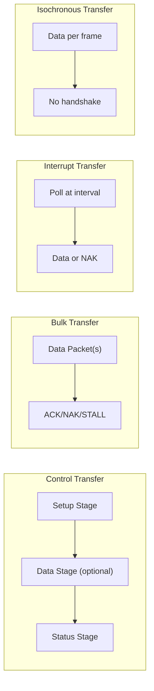
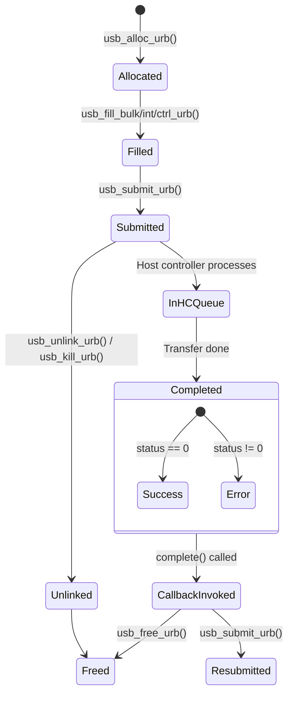
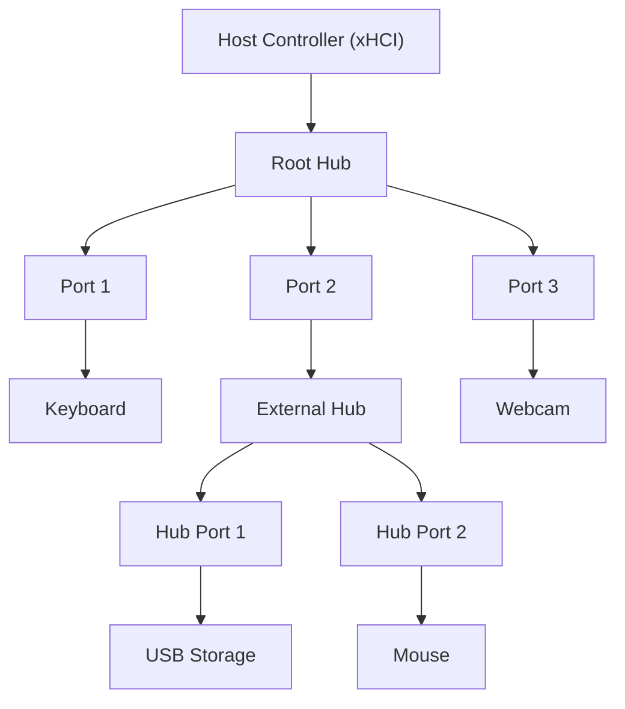

# Chapter 197: USB Device Drivers

## 1. Introduction

USB (Universal Serial Bus) is the most ubiquitous peripheral interface in computing. From keyboards and mice to storage devices, cameras, and specialized industrial equipment, USB devices surround us. The Linux USB subsystem provides a comprehensive framework for writing USB device drivers, handling the complexities of USB protocols, transfer types, endpoint management, and the host controller interface.

This chapter explores the Linux USB subsystem in depth: the architecture of USB host controllers and device drivers, the URB (USB Request Block) mechanism for asynchronous data transfer, the USB gadget API for device-side programming, and practical patterns for writing robust USB drivers.

## 2. Intuition

### 2.1 USB Architecture

USB uses a tiered star topology:

- **Host Controller** (UHCI, OHCI, EHCI, xHCI) — the root of the USB tree, managing all communication.
- **Hubs** — expand the number of ports, can be embedded or standalone.
- **Devices** — the endpoints that perform actual functions.

The host always initiates communication; devices never spontaneously transmit. This master/slave architecture is fundamental to USB design.

### 2.2 USB Transfer Types

USB defines four transfer types, each suited to different use cases:

1. **Control** — Bidirectional, guaranteed delivery. Used for configuration, status requests, and commands. Every device has Endpoint 0 for control transfers.
2. **Bulk** — Unidirectional, guaranteed delivery, no guaranteed timing. Used for large data transfers (storage devices, printers).
3. **Interrupt** — Unidirectional, guaranteed delivery, guaranteed latency. Used for periodic small data (keyboards, mice, game controllers).
4. **Isochronous** — Unidirectional, no delivery guarantee, guaranteed bandwidth. Used for real-time streaming (audio, video).

### 2.3 USB Descriptors

Every USB device exposes a hierarchy of descriptors:

- **Device Descriptor** — Vendor ID, Product ID, class, number of configurations.
- **Configuration Descriptor** — Power requirements, number of interfaces.
- **Interface Descriptor** — Class, subclass, protocol, number of endpoints.
- **Endpoint Descriptor** — Address, direction, transfer type, max packet size.
- **String Descriptors** — Human-readable manufacturer, product, serial number.

### 2.4 USB in Linux

The Linux USB subsystem has two sides:
- **Host side** (`usb_driver`) — for writing drivers that control USB devices attached to the host.
- **Gadget side** (`usb_gadget_driver`) — for writing drivers that make the Linux machine appear as a USB device (e.g., USB gadget on embedded systems).

## 3. Architecture

### 3.1 USB Subsystem Layers

```
┌─────────────────────────────────────────────────┐
│              Userspace (libusb, sysfs)           │
├─────────────────────────────────────────────────┤
│              USB Core (drivers/usb/core/)        │
│  ┌──────────┐ ┌──────────┐ ┌─────────────────┐ │
│  │ USB Core │ │ USB Sysfs│ │ USB Notifications│ │
│  └──────────┘ └──────────┘ └─────────────────┘ │
├─────────────────────────────────────────────────┤
│         USB Device Drivers                       │
│  (usb_storage, hid-generic, ftdi_sio, ...)      │
├─────────────────────────────────────────────────┤
│         USB Host Controller Drivers              │
│  (xhci-hcd, ehci-hcd, ohci-hcd, uhci-hcd)      │
├─────────────────────────────────────────────────┤
│         USB Host Controller Hardware             │
│         (xHCI, EHCI, OHCI, UHCI)                │
└─────────────────────────────────────────────────┘
```

### 3.2 USB Device Topology in sysfs

```
/sys/bus/usb/
├── devices/
│   ├── 1-0:1.0          # Root hub, interface 0
│   ├── 1-1              # Device on port 1
│   │   ├── 1-1:1.0      # Interface 0
│   │   ├── 1-1:1.1      # Interface 1
│   │   ├── idVendor
│   │   ├── idProduct
│   │   ├── manufacturer
│   │   ├── product
│   │   ├── serial
│   │   └── speed
│   ├── 1-1.2            # Device on hub port 2
│   └── usb1             # USB bus 1
├── drivers/
│   ├── usb-storage/
│   ├── hid-generic/
│   └── ...
```

### 3.3 URB Lifecycle

```
1. Allocate URB (usb_alloc_urb)
2. Initialize URB (fill functions)
3. Submit URB (usb_submit_urb)
4. URB queued to host controller
5. Host controller performs transfer on USB bus
6. Completion callback invoked
7. Free or resubmit URB
```

## 4. Kernel Implementation

### 4.1 struct usb_device

```c
struct usb_device {
    int                     devnum;          /* device number on bus */
    char                    devpath[16];     /* path string */
    u32                     route;
    enum usb_device_state   state;           /* configured, addressed, etc. */
    enum usb_device_speed   speed;           /* low/full/high/super */

    struct usb_tt           *tt;             /* transaction translator */
    int                     ttport;

    struct usb_device       *parent;         /* parent hub */
    struct usb_bus          *bus;            /* bus device is on */
    struct usb_host_endpoint ep0;            /* endpoint 0 */

    struct device           dev;             /* embedded device */
    struct usb_device_descriptor descriptor; /* device descriptor */
    struct usb_host_bos     *bos;            /* BOS descriptor */
    struct usb_host_config  *config;         /* all configurations */
    struct usb_host_config  *actconfig;      /* active configuration */

    /* ... many more fields ... */
};
```

### 4.2 struct usb_driver

```c
struct usb_driver {
    const char *name;

    int (*probe)(struct usb_interface *intf,
                 const struct usb_device_id *id);
    void (*disconnect)(struct usb_interface *intf);

    int (*unlocked_ioctl)(struct usb_interface *intf, unsigned int code,
                          void *buf);
    int (*suspend)(struct usb_interface *intf, pm_message_t message);
    int (*resume)(struct usb_interface *intf);
    int (*reset_resume)(struct usb_interface *intf);
    int (*pre_reset)(struct usb_interface *intf);
    int (*post_reset)(struct usb_interface *intf);

    const struct usb_device_id *id_table;
    const struct attribute_group **dev_groups;
    struct usbdrv_wrap drvwrap;
    unsigned char no_dynamic_id:1;
    unsigned char supports_autosuspend:1;
    unsigned char disable_hub_initiated_lpm:1;
    unsigned char soft_unbind:1;
};
```

### 4.3 struct usb_interface

```c
struct usb_interface {
    struct usb_host_interface *altsetting;   /* array of alternate settings */
    struct usb_host_interface *cur_altsetting; /* current alternate setting */
    unsigned num_altsetting;                 /* number of alt settings */

    struct usb_interface_assoc_descriptor *intf_assoc;

    int minor;                               /* minor number */
    enum usb_interface_condition condition;
    unsigned sysfs_files_created:1;
    unsigned ep_devs_created:1;
    unsigned unregistering:1;
    unsigned needs_remote_wakeup:1;
    unsigned needs_altsetting0:1;
    unsigned resetting_device:1;

    struct device dev;                       /* embedded device */
    struct device *usb_dev;
    atomic_t pm_usage_cnt;
    struct work_struct reset_ws;
};
```

### 4.4 struct urb — USB Request Block

```c
struct urb {
    struct kref kref;                        /* reference count */
    int unlinked;                            /* unlinked error code */

    struct list_head urb_list;               /* list for host controller */
    struct list_head anchor_list;
    struct usb_anchor *anchor;
    struct usb_device *dev;                  /* target device */
    struct usb_host_endpoint *ep;            /* target endpoint */
    unsigned int pipe;                       /* endpoint pipe */
    unsigned int stream_id;
    int status;                              /* transfer status */
    unsigned int transfer_flags;             /* URB flags */
    void *transfer_buffer;                   /* data buffer */
    dma_addr_t transfer_dma;                 /* DMA address */
    struct scatterlist *sg;                  /* scatter-gather list */
    int num_mapped_sgs;
    int num_sgs;
    u32 transfer_buffer_length;              /* buffer length */
    u32 actual_length;                       /* actual bytes transferred */
    unsigned char *setup_packet;             /* setup packet (control) */
    dma_addr_t setup_dma;                    /* DMA for setup packet */

    int start_frame;                         /* start frame (iso) */
    int number_of_packets;                   /* number of iso packets */
    int interval;                            /* polling interval */
    int error_count;                         /* iso errors */
    void *context;                           /* completion context */
    usb_complete_t complete;                 /* completion callback */
    struct usb_iso_packet_descriptor iso_frame_desc[]; /* iso descriptors */
};
```

### 4.5 Pipe Construction

```c
/* Create a pipe value for URB submission */
unsigned int usb_sndctrlpipe(struct usb_device *dev, unsigned int endpoint);
unsigned int usb_rcvctrlpipe(struct usb_device *dev, unsigned int endpoint);
unsigned int usb_sndbulkpipe(struct usb_device *dev, unsigned int endpoint);
unsigned int usb_rcvbulkpipe(struct usb_device *dev, unsigned int endpoint);
unsigned int usb_sndintpipe(struct usb_device *dev, unsigned int endpoint);
unsigned int usb_rcvintpipe(struct usb_device *dev, unsigned int endpoint);
unsigned int usb_sndisocpipe(struct usb_device *dev, unsigned int endpoint);
unsigned int usb_rcvisocpipe(struct usb_device *dev, unsigned int endpoint);
```

### 4.6 URB Lifecycle Functions

```c
/* Allocate */
struct urb *usb_alloc_urb(int iso_packets, gfp_t mem_flags);

/* Free */
void usb_free_urb(struct urb *urb);

/* Reference counting */
struct urb *usb_get_urb(struct urb *urb);
void usb_put_urb(struct urb *urb);

/* Fill helpers */
void usb_fill_bulk_urb(struct urb *urb, struct usb_device *dev,
                       unsigned int pipe, void *transfer_buffer,
                       int buffer_length, usb_complete_t complete_fn,
                       void *context);
void usb_fill_int_urb(struct urb *urb, struct usb_device *dev,
                      unsigned int pipe, void *transfer_buffer,
                      int buffer_length, usb_complete_t complete_fn,
                      void *context, int interval);
void usb_fill_control_urb(struct urb *urb, struct usb_device *dev,
                          unsigned int pipe, unsigned char *setup_packet,
                          void *transfer_buffer, int buffer_length,
                          usb_complete_t complete_fn, void *context);

/* Submit */
int usb_submit_urb(struct urb *urb, gfp_t mem_flags);

/* Cancel */
int usb_unlink_urb(struct urb *urb);
void usb_kill_urb(struct urb *urb);
void usb_poison_urb(struct urb *urb);
```

### 4.7 Synchronous Transfers (Convenience)

```c
/* Synchronous control transfer */
int usb_control_msg(struct usb_device *dev, unsigned int pipe,
                    __u8 request, __u8 requesttype,
                    __u16 value, __u16 index, void *data,
                    __u16 size, int timeout);

/* Synchronous bulk transfer */
int usb_bulk_msg(struct usb_device *dev, unsigned int pipe,
                 void *data, int len, int *actual_length, int timeout);

/* Synchronous interrupt transfer */
int usb_interrupt_msg(struct usb_device *dev, unsigned int pipe,
                      void *data, int len, int *actual_length, int timeout);
```

### 4.8 USB Gadget API

```c
/* Gadget driver registration */
struct usb_gadget_driver {
    const char *function;
    enum usb_device_speed max_speed;
    int (*bind)(struct usb_gadget *gadget, struct usb_gadget_driver *driver);
    void (*unbind)(struct usb_gadget *gadget);
    int (*setup)(struct usb_gadget *gadget,
                 const struct usb_ctrlrequest *ctrl);
    void (*disconnect)(struct usb_gadget *gadget);
    void (*suspend)(struct usb_gadget *gadget);
    void (*resume)(struct usb_gadget *gadget);
    /* ... */
};

int usb_gadget_probe_driver(struct usb_gadget_driver *driver);
int usb_gadget_unregister_driver(struct usb_gadget_driver *driver);
```

## 5. Data Structures Summary

| Structure | Header | Purpose |
|-----------|--------|---------|
| `usb_device` | `include/linux/usb.h` | Represents a USB device |
| `usb_driver` | `include/linux/usb.h` | Host-side USB driver |
| `usb_interface` | `include/linux/usb.h` | USB interface (bound to driver) |
| `urb` | `include/linux/usb.h` | USB Request Block |
| `usb_host_endpoint` | `include/linux/usb.h` | Endpoint descriptor |
| `usb_device_id` | `include/linux/usb.h` | Device ID for matching |
| `usb_gadget` | `include/linux/usb/gadget.h` | Gadget device |
| `usb_gadget_driver` | `include/linux/usb/gadget.h` | Gadget driver |
| `usb_request` | `include/linux/usb/ch9.h` | Gadget request |

## 6. C Examples

### 6.1 Simple USB Driver

```c
#include <linux/module.h>
#include <linux/usb.h>
#include <linux/slab.h>

#define MY_USB_VENDOR_ID  0x1234
#define MY_USB_PRODUCT_ID 0x5678

struct my_usb_dev {
    struct usb_device *udev;
    struct usb_interface *interface;
    unsigned char *bulk_in_buffer;
    size_t bulk_in_size;
    __u8 bulk_in_ep;
    __u8 bulk_out_ep;
};

static void my_bulk_read_callback(struct urb *urb)
{
    struct my_usb_dev *dev = urb->context;
    int status = urb->status;

    switch (status) {
    case 0:  /* success */
        dev_info(&dev->interface->dev,
                 "received %d bytes\n", urb->actual_length);
        /* Process data in urb->transfer_buffer */
        break;
    case -ECONNRESET:
    case -ENOENT:
    case -ESHUTDOWN:
        /* URB was unlinked or device removed */
        break;
    default:
        dev_err(&dev->interface->dev,
                "bulk read error %d\n", status);
        break;
    }

    /* Free the URB if not resubmitting */
    usb_free_urb(urb);
}

static int my_do_bulk_read(struct my_usb_dev *dev)
{
    struct urb *urb;
    int ret;

    urb = usb_alloc_urb(0, GFP_KERNEL);
    if (!urb)
        return -ENOMEM;

    usb_fill_bulk_urb(urb, dev->udev,
                      usb_rcvbulkpipe(dev->udev, dev->bulk_in_ep),
                      dev->bulk_in_buffer, dev->bulk_in_size,
                      my_bulk_read_callback, dev);

    ret = usb_submit_urb(urb, GFP_KERNEL);
    if (ret) {
        dev_err(&dev->interface->dev,
                "bulk read submit failed: %d\n", ret);
        usb_free_urb(urb);
    }

    return ret;
}

static int my_usb_probe(struct usb_interface *interface,
                         const struct usb_device_id *id)
{
    struct usb_device *udev = interface_to_usbdev(interface);
    struct my_usb_dev *dev;
    struct usb_host_interface *iface_desc;
    struct usb_endpoint_descriptor *endpoint;
    int i, ret;

    dev = kzalloc(sizeof(*dev), GFP_KERNEL);
    if (!dev)
        return -ENOMEM;

    dev->udev = usb_get_dev(udev);
    dev->interface = interface;

    /* Find bulk endpoints */
    iface_desc = interface->cur_altsetting;
    for (i = 0; i < iface_desc->desc.bNumEndpoints; i++) {
        endpoint = &iface_desc->endpoint[i].desc;

        if (usb_endpoint_is_bulk_in(endpoint)) {
            dev->bulk_in_ep = usb_endpoint_num(endpoint);
            dev->bulk_in_size = usb_endpoint_maxp(endpoint);
            dev->bulk_in_buffer = kmalloc(dev->bulk_in_size, GFP_KERNEL);
            if (!dev->bulk_in_buffer) {
                ret = -ENOMEM;
                goto error;
            }
        }

        if (usb_endpoint_is_bulk_out(endpoint))
            dev->bulk_out_ep = usb_endpoint_num(endpoint);
    }

    usb_set_intfdata(interface, dev);

    dev_info(&interface->dev,
             "USB device attached: %04x:%04x\n",
             le16_to_cpu(udev->descriptor.idVendor),
             le16_to_cpu(udev->descriptor.idProduct));

    return 0;

error:
    kfree(dev->bulk_in_buffer);
    usb_put_dev(udev);
    kfree(dev);
    return ret;
}

static void my_usb_disconnect(struct usb_interface *interface)
{
    struct my_usb_dev *dev = usb_get_intfdata(interface);

    usb_set_intfdata(interface, NULL);

    dev_info(&interface->dev, "USB device disconnected\n");

    kfree(dev->bulk_in_buffer);
    usb_put_dev(dev->udev);
    kfree(dev);
}

static const struct usb_device_id my_usb_table[] = {
    { USB_DEVICE(MY_USB_VENDOR_ID, MY_USB_PRODUCT_ID) },
    { USB_DEVICE_AND_INTERFACE_INFO(0x1234, 0x5678,
                                    USB_CLASS_MASS_STORAGE,
                                    USB_SUBCLASS_SCSI,
                                    USB_PROTOCOL_BULK) },
    { }  /* terminator */
};
MODULE_DEVICE_TABLE(usb, my_usb_table);

static struct usb_driver my_usb_driver = {
    .name       = "my_usb_driver",
    .id_table   = my_usb_table,
    .probe      = my_usb_probe,
    .disconnect = my_usb_disconnect,
};

module_usb_driver(my_usb_driver);

MODULE_LICENSE("GPL");
MODULE_DESCRIPTION("Example USB driver");
```

### 6.2 USB Control Transfer

```c
/* Send a vendor-specific control request */
static int my_vendor_request(struct usb_device *udev, u8 request,
                             u16 value, u16 index,
                             void *data, u16 size)
{
    int ret;
    unsigned char *buf;

    buf = kmalloc(size, GFP_KERNEL);
    if (!buf)
        return -ENOMEM;

    ret = usb_control_msg(udev,
                          usb_sndctrlpipe(udev, 0),
                          request,
                          USB_DIR_OUT | USB_TYPE_VENDOR | USB_RECIP_DEVICE,
                          value, index,
                          buf, size,
                          5000);  /* 5 second timeout */

    if (ret < 0)
        dev_err(&udev->dev, "vendor request failed: %d\n", ret);
    else
        dev_dbg(&udev->dev, "vendor request: sent %d bytes\n", ret);

    kfree(buf);
    return ret;
}

/* Read device firmware version */
static int my_read_fw_version(struct usb_device *udev, char *buf, size_t len)
{
    int ret;

    ret = usb_control_msg(udev,
                          usb_rcvctrlpipe(udev, 0),
                          0x01,  /* request code */
                          USB_DIR_IN | USB_TYPE_VENDOR | USB_RECIP_DEVICE,
                          0, 0,
                          buf, len,
                          5000);

    return ret;
}
```

### 6.3 USB Interrupt Endpoint

```c
static void my_irq_callback(struct urb *urb)
{
    struct my_usb_dev *dev = urb->context;
    int status = urb->status;

    if (status) {
        if (status == -ENOENT || status == -ECONNRESET ||
            status == -ESHUTDOWN)
            return;
        dev_err(&dev->interface->dev, "IRQ URB error %d\n", status);
    }

    if (urb->actual_length > 0) {
        /* Process interrupt data */
        unsigned char *data = urb->transfer_buffer;
        dev_dbg(&dev->interface->dev,
                "IRQ: %*ph\n", urb->actual_length, data);
    }

    /* Resubmit for next interrupt */
    usb_submit_urb(urb, GFP_ATOMIC);
}

static int my_start_irq(struct my_usb_dev *dev)
{
    struct urb *urb;
    int ret;

    urb = usb_alloc_urb(0, GFP_KERNEL);
    if (!urb)
        return -ENOMEM;

    usb_fill_int_urb(urb, dev->udev,
                     usb_rcvintpipe(dev->udev, dev->int_in_ep),
                     dev->int_buffer, dev->int_size,
                     my_irq_callback, dev,
                     dev->int_interval);

    ret = usb_submit_urb(urb, GFP_KERNEL);
    if (ret) {
        usb_free_urb(urb);
        return ret;
    }

    dev->irq_urb = urb;
    return 0;
}
```

### 6.4 Using usb_anchor for Bulk URB Management

```c
struct my_usb_dev {
    struct usb_anchor submitted;  /* anchor for tracking URBs */
    /* ... */
};

static int my_init(struct my_usb_dev *dev)
{
    init_usb_anchor(&dev->submitted);
    return 0;
}

static int my_submit_urb(struct my_usb_dev *dev, struct urb *urb)
{
    int ret;

    usb_anchor_urb(urb, &dev->submitted);  /* track this URB */
    ret = usb_submit_urb(urb, GFP_KERNEL);
    if (ret)
        usb_unanchor_urb(urb);

    return ret;
}

static void my_disconnect(struct usb_interface *interface)
{
    struct my_usb_dev *dev = usb_get_intfdata(interface);

    /* Kill all outstanding URBs */
    usb_kill_anchored_urbs(&dev->submitted);
    /* All completion callbacks will see -ESHUTDOWN */
}
```

## 7. Diagrams

### 7.1 USB Transfer Types



### 7.2 URB Lifecycle



### 7.3 USB Device Topology



## 8. Common Pitfalls

### 8.1 Sleeping in Atomic Context

```c
/* WRONG: usb_submit_urb with GFP_KERNEL in interrupt/completion context */
static void my_callback(struct urb *urb)
{
    usb_submit_urb(urb, GFP_KERNEL);  /* BUG: called in interrupt context! */
}

/* CORRECT: use GFP_ATOMIC in callbacks */
static void my_callback(struct urb *urb)
{
    usb_submit_urb(urb, GFP_ATOMIC);
}
```

### 8.2 Not Killing URBs on Disconnect

```c
/* WRONG: freeing device while URBs are pending */
static void my_disconnect(struct usb_interface *intf)
{
    struct my_dev *dev = usb_get_intfdata(intf);
    kfree(dev);  /* BUG: completion may still fire! */
}

/* CORRECT: kill all URBs first */
static void my_disconnect(struct usb_interface *intf)
{
    struct my_dev *dev = usb_get_intfdata(intf);
    usb_kill_anchored_urbs(&dev->submitted);
    /* Now safe to free */
    kfree(dev);
}
```

### 8.3 Using USB API After disconnect()

```c
/* WRONG: accessing usb_device in a workqueue after disconnect */
static void my_work_fn(struct work_struct *work)
{
    struct my_dev *dev = container_of(work, struct my_dev, work);
    usb_control_msg(dev->udev, ...);  /* BUG: device may be gone! */
}

/* CORRECT: check interface condition or use refcounting */
static void my_work_fn(struct work_struct *work)
{
    struct my_dev *dev = container_of(work, struct my_dev, work);

    if (usb_autopm_get_interface(dev->interface) < 0)
        return;  /* device disconnected */

    usb_control_msg(dev->udev, ...);

    usb_autopm_put_interface(dev->interface);
}
```

### 8.4 Incorrect Endpoint Detection

```c
/* WRONG: assuming endpoint index matches type */
endpoint = &iface_desc->endpoint[0].desc;  /* May not be the bulk endpoint! */

/* CORRECT: iterate and check type */
for (i = 0; i < iface_desc->desc.bNumEndpoints; i++) {
    endpoint = &iface_desc->endpoint[i].desc;
    if (usb_endpoint_is_bulk_in(endpoint)) {
        /* Found it */
    }
}
```

## 9. Best Practices

### 9.1 Use USB Autosuspend

```c
/* Enable autosuspend in probe */
usb_enable_autosuspend(udev);

/* Or per-interface */
interface->needs_remote_wakeup = 1;

/* Use autopm for runtime PM */
int err = usb_autopm_get_interface(intf);
if (err)
    return err;
/* ... do work ... */
usb_autopm_put_interface(intf);
```

### 9.2 Use usb_driver_claim_interface() for Multi-Interface Devices

```c
/* When a driver handles multiple interfaces of the same device */
static int my_probe(struct usb_interface *intf, ...)
{
    struct usb_device *udev = interface_to_usbdev(intf);

    /* Claim interface 1 if we're probing interface 0 */
    if (intf->cur_altsetting->desc.bInterfaceNumber == 0) {
        struct usb_interface *intf1;
        intf1 = usb_ifnum_to_if(udev, 1);
        if (intf1)
            usb_driver_claim_interface(&my_driver, intf1, my_data);
    }
}
```

### 9.3 Proper Error Handling in probe()

```c
static int my_probe(struct usb_interface *intf, ...)
{
    struct my_dev *dev;

    dev = kzalloc(sizeof(*dev), GFP_KERNEL);
    if (!dev)
        return -ENOMEM;

    dev->udev = usb_get_dev(interface_to_usbdev(intf));
    usb_set_intfdata(intf, dev);

    /* ... setup ... */

    return 0;

    /* Error path: usb_set_intfdata(intf, NULL); usb_put_dev(); kfree(dev); */
}
```

### 9.4 Use USB Bulk Transfer Helpers for Scatter-Gather

```c
/* For large transfers, use scatter-gather */
urb->num_sgs = usb_sg_init(&sg_req, udev, pipe, 0,
                            sg_list, num_sg, total_len, GFP_KERNEL);
usb_sg_wait(&sg_req);
```

### 9.5 Module USB Driver Macro

```c
/* Instead of manual init/exit */
module_usb_driver(my_driver);

/* Expands to: */
/* static int __init my_init(void) { return usb_register(&my_driver); } */
/* static void __exit my_exit(void) { usb_deregister(&my_driver); } */
/* module_init(my_init); module_exit(my_exit); */
```

## 10. Exercises

### Exercise 1: USB Device Information

Write a kernel module that iterates over all connected USB devices and prints their Vendor ID, Product ID, manufacturer string, and product string using `usb_for_each_dev()`.

### Exercise 2: Bulk Transfer Loopback

Using a USB loopback device (or USB/IP), write a driver that sends a bulk OUT transfer and reads it back on the bulk IN endpoint. Verify data integrity.

### Exercise 3: USB Interrupt Handler

Write a driver for a USB HID device that reads interrupt endpoint data and logs button presses or movement events to the kernel log.

### Exercise 4: USB Gadget Function

Write a USB gadget driver that makes the Linux machine appear as a USB serial device (CDC ACM) to the host. Use the gadget API to handle control requests and bulk data.

### Exercise 5: USB Autosuspend

Modify the simple USB driver to support runtime PM with autosuspend. The driver should auto-suspend after 5 seconds of inactivity and wake on interrupt endpoint activity.

## 11. References

### Kernel Source
- `drivers/usb/core/` — USB core subsystem
- `drivers/usb/core/urb.c` — URB implementation
- `drivers/usb/core/driver.c` — USB driver framework
- `include/linux/usb.h` — USB API
- `include/linux/usb/ch9.h` — USB chapter 9 definitions
- `drivers/usb/gadget/` — USB gadget framework
- `Documentation/driver-api/usb/` — USB driver API documentation

### Standards
- USB 2.0 Specification (usb.org)
- USB 3.2 Specification
- USB Power Delivery Specification

### Books
- *Linux Device Drivers, 3rd Edition* — Chapter 13 (USB Drivers)
- *USB Complete: The Developer's Guide* — Jan Axelson

### Online
- https://www.kernel.org/doc/html/latest/driver-api/usb/
- https://usb.org/ — USB Implementers Forum
- https://github.com/linux-usb-gadgets

## 12. Deep Dive: USB Subsystem Internals

### 12.1 USB Transfer Types in Detail

**Control Transfers**: Used for configuration and command/status operations. Every USB device has Endpoint 0 for control transfers. The transfer has three stages:

1. **Setup Stage**: Host sends an 8-byte setup packet with request type, request, value, index, and length
2. **Data Stage** (optional): Data is transferred in the specified direction
3. **Status Stage**: Zero-length packet in the opposite direction to acknowledge completion

```c
/* Example: GET_DESCRIPTOR request */
usb_control_msg(udev, usb_rcvctrlpipe(udev, 0),
                USB_REQ_GET_DESCRIPTOR,       /* request */
                USB_DIR_IN | USB_TYPE_STANDARD | USB_RECIP_DEVICE, /* requesttype */
                USB_DT_DEVICE << 8,           /* value */
                0,                            /* index */
                buf,                          /* data */
                sizeof(struct usb_device_descriptor), /* size */
                5000);                        /* timeout */
```

**Bulk Transfers**: Used for large, non-time-critical data. Guaranteed delivery but no guaranteed timing. The host controller schedules bulk transfers when there's spare bandwidth.

**Interrupt Transfers**: Used for periodic, small data transfers. The host polls the device at a specified interval. Despite the name, these are polled, not interrupt-driven from the device's perspective.

**Isochronous Transfers**: Used for real-time streaming data. Guaranteed bandwidth but no delivery guarantee. No handshake — if a packet is lost, it's not retransmitted. Used for audio and video.

### 12.2 USB Descriptors Explained

**Device Descriptor**: Contains Vendor ID, Product ID, device class, number of configurations. This is the first thing the host reads when a device is plugged in.

**Configuration Descriptor**: Describes a configuration's power requirements and number of interfaces. A device can have multiple configurations, but only one is active at a time.

**Interface Descriptor**: Describes a functional interface (e.g., audio input, audio output, HID). Each interface can have alternate settings with different endpoint configurations.

**Endpoint Descriptor**: Describes an endpoint's address, direction, transfer type, and maximum packet size. This is where the actual data flows.

### 12.3 USB Core Internals

When a USB device is plugged in:

1. Hub detects connection, reports port status change
2. USB hub driver resets the port
3. USB core reads the device descriptor (first 8 bytes, then full)
4. Device is assigned an address
5. Configuration descriptor is read
6. Interface drivers are matched based on class, subclass, protocol, or vendor/product IDs
7. Driver's `probe()` function is called

### 12.4 USB Request Block (URB) Lifecycle

The URB is the fundamental unit of USB data transfer:

```
usb_alloc_urb()          → Allocate URB
    ↓
usb_fill_bulk_urb()      → Initialize URB fields
    ↓
usb_submit_urb()         → Submit to USB core
    ↓
USB core queues URB      → URB is pending
    ↓
Host controller executes  → Transfer on USB bus
    ↓
Completion callback       → Handler called
    ↓
usb_free_urb()           → Free URB (or resubmit)
```

### 12.5 USB Gadget API Deep Dive

The gadget API allows Linux to act as a USB device (peripheral). This is used on embedded systems (Raspberry Pi, BeagleBone) to implement USB functions like serial, mass storage, or network:

```c
/* Gadget driver structure */
static struct usb_gadget_driver my_gadget_driver = {
    .function = "My USB Function",
    .max_speed = USB_SPEED_SUPER,
    .bind = my_gadget_bind,
    .unbind = my_gadget_unbind,
    .setup = my_gadget_setup,
    .disconnect = my_gadget_disconnect,
};

/* Register gadget driver */
usb_gadget_probe_driver(&my_gadget_driver);
```

**Gadget Setup Callback**: Handles control requests from the host:
```c
static int my_gadget_setup(struct usb_gadget *gadget,
                            const struct usb_ctrlrequest *ctrl)
{
    u16 wValue = le16_to_cpu(ctrl->wValue);
    u16 wIndex = le16_to_cpu(ctrl->wIndex);
    u16 wLength = le16_to_cpu(ctrl->wLength);

    switch (ctrl->bRequest) {
    case USB_REQ_GET_DESCRIPTOR:
        /* Send descriptor to host */
        break;
    case USB_REQ_SET_CONFIGURATION:
        /* Configure the gadget */
        break;
    /* ... */
    }
    return 0;
}
```

### 12.6 USB Debugging

**usbmon**: USB traffic monitor that captures URBs:
```bash
# Load usbmon module
modprobe usbmon

# Capture traffic on bus 1
cat /sys/kernel/debug/usb/usbmon/1u

# Or with wireshark
wireshark -i usbmon1
```

**sysfs information**:
```bash
# List USB devices
lsusb

# Detailed device info
cat /sys/bus/usb/devices/1-1/idVendor
cat /sys/bus/usb/devices/1-1/idProduct
cat /sys/bus/usb/devices/1-1/manufacturer
cat /sys/bus/usb/devices/1-1/product

# Driver binding
echo "1-1:1.0" > /sys/bus/usb/drivers/my_driver/unbind
echo "1-1:1.0" > /sys/bus/usb/drivers/my_driver/bind
```

**Dynamic Debug for USB**:
```bash
echo "module usbcore +p" > /sys/kernel/debug/dynamic_debug/control
echo "file drivers/usb/core/* +p" > /sys/kernel/debug/dynamic_debug/control
```
