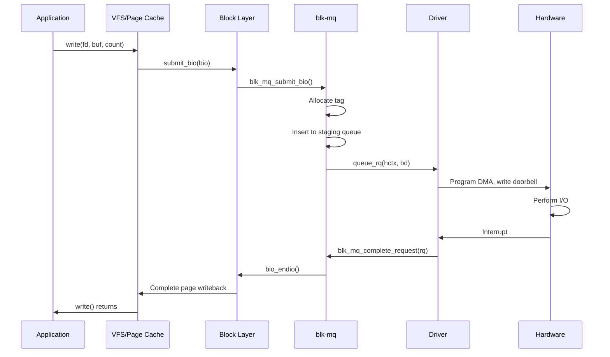
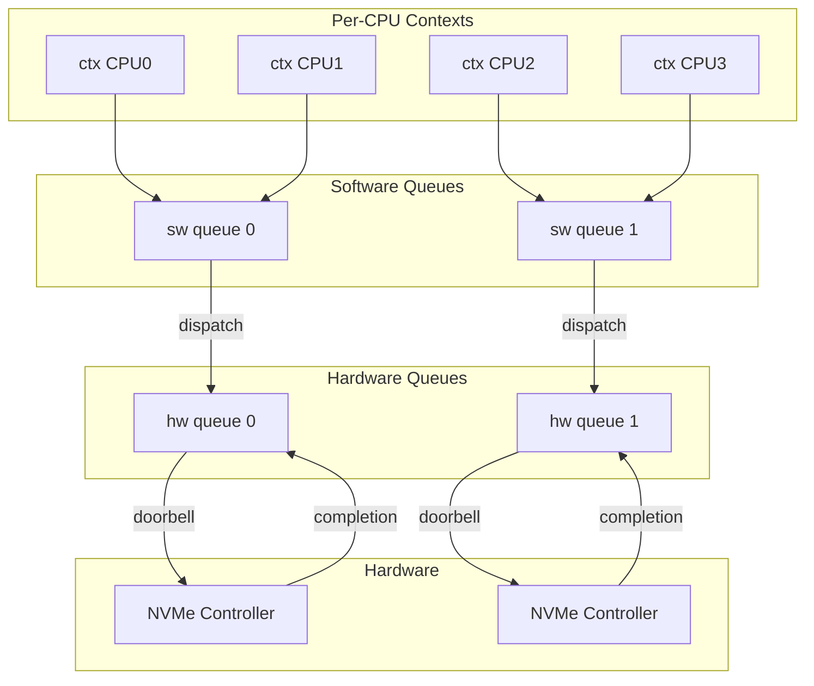
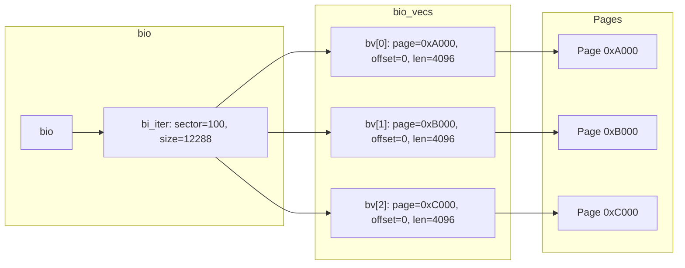

# Chapter 198: Block Device Drivers

## 1. Introduction

Block devices are storage devices that operate on fixed-size blocks (typically 512 bytes or 4096 bytes) rather than byte streams. Hard drives, SSDs, NVMe devices, RAID arrays, and even virtual devices like loopback and RAM disks are all block devices. The Linux block I/O subsystem is one of the most performance-critical parts of the kernel, involving complex scheduling, merging, and dispatching of I/O requests.

This chapter covers the block device driver framework in depth: the `gendisk` structure, the `request_queue` and its evolution to multi-queue (blk-mq), the `bio` structure for I/O representation, and the complete lifecycle of a block I/O request from userspace to driver completion.

## 2. Intuition

### 2.1 Block vs Character Devices

Character devices present a byte stream (serial ports, keyboards). Block devices present a random-access array of fixed-size blocks. The key differences:

- **Buffering**: Block I/O goes through the page cache; character I/O typically doesn't.
- **Scheduling**: Block requests can be reordered, merged, and scheduled for optimal throughput.
- **Access patterns**: Block devices support random access; character devices are typically sequential.

### 2.2 The I/O Stack

A write() to a block device traverses multiple layers:

1. **VFS** — Determines the file and offset
2. **Page Cache** — Buffers the data in memory
3. **Block Layer** — Creates `bio` structures, merges and schedules requests
4. **Device Driver** — Translates requests to hardware commands
5. **Hardware** — Performs the actual I/O

### 2.3 From Legacy to Multi-Queue

The traditional block layer used a single `request_queue` with an elevator scheduler (CFQ, deadline, noop). This became a bottleneck on modern multi-core systems with fast NVMe devices. The blk-mq (block multi-queue) framework, introduced in Linux 3.13, replaces this with:

- **Software staging queues** — per-CPU or per-node queues that accumulate bios
- **Hardware dispatch queues** — mapped to device hardware queues
- **Tag-based completion** — requests identified by tags, enabling lock-free completion

## 3. Architecture

### 3.1 Block I/O Layer Architecture

```
┌─────────────────────────────────────────────────┐
│              Userspace (read/write/ioctl)        │
├─────────────────────────────────────────────────┤
│              VFS / Page Cache                    │
├─────────────────────────────────────────────────┤
│              Block Layer                         │
│  ┌──────────────┐  ┌────────────────────────┐  │
│  │  bio Layer   │  │  Request Queue (legacy)│  │
│  │  (submit_bio)│  │  ┌──────────────────┐ │  │
│  └──────────────┘  │  │  Scheduler (mq)  │ │  │
│                    │  └──────────────────┘ │  │
│                    └────────────────────────┘  │
│  ┌──────────────────────────────────────────┐  │
│  │          blk-mq (Multi-Queue)            │  │
│  │  ┌─────────┐ ┌─────────┐ ┌─────────┐   │  │
│  │  │ CPU 0   │ │ CPU 1   │ │ CPU N   │   │  │
│  │  │ sq: hctx│ │ sq: hctx│ │ sq: hctx│   │  │
│  │  └─────────┘ └─────────┘ └─────────┘   │  │
│  └──────────────────────────────────────────┘  │
├─────────────────────────────────────────────────┤
│         Block Device Drivers                     │
│  (nvme, scsi, virtio-blk, loop, brd, ...)       │
├─────────────────────────────────────────────────┤
│              Storage Hardware                    │
└─────────────────────────────────────────────────┘
```

### 3.2 The bio Chain

A single file system I/O request may generate multiple `bio` structures (for non-contiguous blocks). Each `bio` contains a vector of `bio_vec` entries, each pointing to a page, offset, and length:

```
bio
├── bio_vec[0]: page=0xA000, offset=0, len=4096
├── bio_vec[1]: page=0xB000, offset=0, len=4096
└── bio_vec[2]: page=0xC000, offset=1024, len=2048
```

### 3.3 blk-mq Architecture

```
Application Thread
    │
    ▼
submit_bio()
    │
    ▼
blk_mq_submit_bio()
    │
    ├── Direct: bio fits in current ctx's queue
    │
    ▼
blk_mq_get_request()  →  Allocate request from tag set
    │
    ▼
blk_mq_try_issue_directly()  or  blk_mq_insert_request()
    │                               │
    ▼                               ▼
Hardware Queue (hctx)         Staging Queue (ctx)
    │
    ▼
blk_mq_dispatch_rq_list()
    │
    ▼
queue_rq() callback  →  Driver sends to hardware
    │
    ▼
Hardware completes → blk_mq_complete_request()
    │
    ▼
Completion callback (softirq context)
```

## 4. Kernel Implementation

### 4.1 struct gendisk

The `gendisk` structure represents a disk device:

```c
struct gendisk {
    int major;                        /* major number */
    int first_minor;                  /* first minor number */
    int minors;                       /* maximum number of minors */

    char disk_name[DISK_NAME_LEN];   /* disk name */
    char *(*devnode)(struct gendisk *gd, umode_t *mode);

    unsigned int events;              /* supported events */
    unsigned int async_events;        /* async events */

    const struct block_device_operations *fops;
    struct request_queue *queue;
    void *private_data;

    struct bio_set bio_split;

    int flags;
    unsigned long state;
    struct kobject *slave_dir;

    struct timer_rand_state *random;
    atomic_t sync_io;
    struct disk_events *ev;
    struct kobject integrity_kobj;

    /* blk-mq support */
    struct blk_mq_tag_set *tag_set;
    struct list_head tag_set_list;

    /* ... */
};
```

### 4.2 struct bio

```c
struct bio {
    struct bio *bi_next;              /* next bio in chain */
    struct block_device *bi_bdev;     /* target block device */
    unsigned int bi_opf;              /* op and flags */
    unsigned short bi_flags;          /* BIO flags */
    unsigned short bi_ioprio;         /* I/O priority */

    blk_status_t bi_status;           /* I/O status */
    atomic_t __bi_remaining;

    struct bvec_iter bi_iter;         /* current position in bio_vec array */

    bio_end_io_t *bi_end_io;         /* completion callback */
    void *bi_private;                 /* private data */

    unsigned short bi_vcnt;           /* number of bio_vecs */
    unsigned short bi_max_vecs;       /* max bio_vecs */

    atomic_t __bi_cnt;                /* pin count */

    struct bio_vec *bi_io_vec;        /* array of bio_vecs */
    struct bio_set *bi_pool;

    /* ... */
};

struct bio_vec {
    struct page *bv_page;             /* page containing data */
    unsigned int bv_len;              /* length of data */
    unsigned int bv_offset;           /* offset within page */
};

struct bvec_iter {
    sector_t bi_sector;               /* device sector */
    unsigned int bi_size;             /* residual I/O count */
    unsigned int bi_idx;              /* current index into bio_vec array */
    unsigned int bi_bvec_done;        /* number of bytes completed */
};
```

### 4.3 struct request (Legacy)

```c
struct request {
    struct request_queue *q;
    struct blk_mq_ctx *mq_ctx;        /* blk-mq context */
    struct blk_mq_hw_ctx *mq_hctx;    /* blk-mq hardware context */

    unsigned int cmd_flags;           /* op and flags */
    req_flags_t rq_flags;

    int tag;                          /* tag for this request */
    int internal_tag;

    unsigned int __data_len;          /* total data length */
    sector_t __sector;                /* target sector */

    struct bio *bio;                  /* first bio */
    struct bio *biotail;              /* last bio */

    struct list_head queuelist;       /* queue linkage */

    /* ... */
};
```

### 4.4 block_device_operations

```c
struct block_device_operations {
    void (*submit_bio)(struct bio *bio);           /* blk-mq: submit a bio */
    int (*open)(struct block_device *bdev, fmode_t mode);
    void (*release)(struct gendisk *gd, fmode_t mode);
    int (*ioctl)(struct block_device *bdev, fmode_t mode,
                 unsigned cmd, unsigned long arg);
    int (*compat_ioctl)(struct block_device *bdev, fmode_t mode,
                        unsigned cmd, unsigned long arg);
    unsigned int (*check_events)(struct gendisk *gd,
                                  unsigned int clearing);
    void (*unlock_native_capacity)(struct gendisk *);
    int (*getgeo)(struct block_device *, struct hd_geometry *);
    int (*set_read_only)(struct block_device *bdev, bool ro);
    void (*swap_slot_free_notify)(struct block_device *, unsigned long);
    int (*report_zones)(struct gendisk *, sector_t sector,
                        unsigned int nr_zones, report_zones_cb cb, void *data);
    char *(*devnode)(struct gendisk *gd, umode_t *mode);
    struct module *owner;
    const struct pr_ops *pr_ops;
};
```

### 4.5 blk-mq API

```c
/* Tag set — describes the hardware queues */
struct blk_mq_tag_set {
    struct blk_mq_ops *ops;
    unsigned int nr_hw_queues;
    unsigned int queue_depth;
    unsigned int reserved_tags;
    unsigned int cmd_size;
    int flags;
    void *driver_data;
    atomic_t active_queues_shared_sbitmap;
    struct blk_mq_tags **tags;
    struct mutex tag_list_lock;
    struct list_head tag_list;
    /* ... */
};

struct blk_mq_ops {
    blk_status_t (*queue_rq)(struct blk_mq_hw_ctx *hctx,
                             const struct blk_mq_queue_data *bd);
    void (*commit_rqs)(struct blk_mq_hw_ctx *);
    void (*complete)(struct request *);
    int (*init_hctx)(struct blk_mq_hw_ctx *, void *, unsigned int);
    void (*exit_hctx)(struct blk_mq_hw_ctx *, unsigned int);
    int (*init_request)(struct blk_mq_tag_set *, struct request *,
                        unsigned int, unsigned int);
    void (*exit_request)(struct blk_mq_tag_set *, struct request *,
                         unsigned int);
    /* ... */
};
```

### 4.6 Key Block Layer Functions

```c
/* Allocate a gendisk */
struct gendisk *alloc_disk(int minors);
struct gendisk *__alloc_disk_node(int minors, int node_id);

/* Register/unregister */
void add_disk(struct gendisk *gd);
void del_gendisk(struct gendisk *gd);

/* Allocate tag set */
int blk_mq_alloc_tag_set(struct blk_mq_tag_set *set);
void blk_mq_free_tag_set(struct blk_mq_tag_set *set);

/* Bio allocation and submission */
struct bio *bio_alloc(struct block_device *bdev, unsigned short nr_vecs,
                      unsigned int opf, gfp_t gfp);
void bio_add_page(struct bio *bio, struct page *page,
                  unsigned int len, unsigned int offset);
void submit_bio(struct bio *bio);

/* Bio completion */
void bio_endio(struct bio *bio);

/* Request completion */
void blk_mq_end_request(struct request *rq, blk_status_t error);
bool blk_mq_complete_request(struct request *rq);

/* Sector and size helpers */
sector_t bio_sectors(struct bio *bio);
unsigned int bio_cur_bytes(struct bio *bio);
```

## 5. Data Structures Summary

| Structure | Header | Purpose |
|-----------|--------|---------|
| `gendisk` | `include/linux/genhd.h` | Disk device representation |
| `bio` | `include/linux/blk_types.h` | Block I/O request |
| `bio_vec` | `include/linux/bvec.h` | Page/offset/length triple |
| `request` | `include/linux/blk-mq.h` | Queued block request |
| `request_queue` | `include/linux/blkdev.h` | Request queue |
| `blk_mq_tag_set` | `include/linux/blk-mq.h` | Hardware queue configuration |
| `blk_mq_ops` | `include/linux/blk-mq.h` | Driver callbacks |
| `block_device_operations` | `include/linux/blkdev.h` | Device operations |

## 6. C Examples

### 6.1 Simple RAM Disk with blk-mq

```c
#include <linux/module.h>
#include <linux/blkdev.h>
#include <linux/blk-mq.h>
#include <linux/hdreg.h>
#include <linux/slab.h>

#define RAMDISK_SIZE (16 * 1024 * 1024)  /* 16 MB */
#define RAMDISK_SECTOR_SIZE 512
#define RAMDISK_NAME "my_ramdisk"

struct my_ramdisk {
    unsigned char *data;
    size_t size;
    struct gendisk *gd;
    struct blk_mq_tag_set tag_set;
    struct request_queue *queue;
};

static struct my_ramdisk *my_dev;

/* Process a single bio */
static void my_ramdisk_handle_bio(struct my_ramdisk *dev, struct bio *bio)
{
    struct bvec_iter iter;
    struct bio_vec bvec;
    sector_t sector = bio->bi_iter.bi_sector;
    unsigned long offset;

    bio_for_each_segment(bvec, bio, iter) {
        unsigned char *page_addr;
        unsigned int len = bvec.bv_len;

        offset = sector * RAMDISK_SECTOR_SIZE;

        page_addr = kmap_local_page(bvec.bv_page);

        if (bio_op(bio) == REQ_OP_READ)
            memcpy(page_addr + bvec.bv_offset,
                   dev->data + offset, len);
        else if (bio_op(bio) == REQ_OP_WRITE)
            memcpy(dev->data + offset,
                   page_addr + bvec.bv_offset, len);

        kunmap_local(page_addr);

        sector += len / RAMDISK_SECTOR_SIZE;
    }

    bio_endio(bio);
}

/* blk-mq queue_rq callback */
static blk_status_t my_queue_rq(struct blk_mq_hw_ctx *hctx,
                                 const struct blk_mq_queue_data *bd)
{
    struct my_ramdisk *dev = hctx->queue->queuedata;
    struct request *rq = bd->rq;

    blk_mq_start_request(rq);

    my_ramdisk_handle_bio(dev, rq->bio);

    blk_mq_end_request(rq, BLK_STS_OK);
    return BLK_STS_OK;
}

static const struct blk_mq_ops my_mq_ops = {
    .queue_rq = my_queue_rq,
};

static const struct block_device_operations my_fops = {
    .owner = THIS_MODULE,
};

static int __init my_ramdisk_init(void)
{
    int ret;

    my_dev = kzalloc(sizeof(*my_dev), GFP_KERNEL);
    if (!my_dev)
        return -ENOMEM;

    my_dev->size = RAMDISK_SIZE;
    my_dev->data = vzalloc(my_dev->size);
    if (!my_dev->data) {
        ret = -ENOMEM;
        goto err_free_dev;
    }

    /* Setup tag set */
    my_dev->tag_set.ops = &my_mq_ops;
    my_dev->tag_set.nr_hw_queues = 1;
    my_dev->tag_set.queue_depth = 128;
    my_dev->tag_set.numa_node = NUMA_NO_NODE;
    my_dev->tag_set.cmd_size = 0;
    my_dev->tag_set.flags = BLK_MQ_F_SHOULD_MERGE;
    my_dev->tag_set.driver_data = my_dev;

    ret = blk_mq_alloc_tag_set(&my_dev->tag_set);
    if (ret)
        goto err_free_data;

    /* Allocate gendisk */
    my_dev->gd = blk_mq_alloc_disk(&my_dev->tag_set, my_dev);
    if (IS_ERR(my_dev->gd)) {
        ret = PTR_ERR(my_dev->gd);
        goto err_free_tags;
    }

    my_dev->gd->major = 0;  /* dynamic */
    my_dev->gd->first_minor = 0;
    my_dev->gd->minors = 1;
    my_dev->gd->fops = &my_fops;
    snprintf(my_dev->gd->disk_name, DISK_NAME_LEN, RAMDISK_NAME);
    set_capacity(my_dev->gd, my_dev->size / RAMDISK_SECTOR_SIZE);

    /* Add disk */
    ret = add_disk(my_dev->gd);
    if (ret)
        goto err_put_disk;

    pr_info("%s: registered %zu MB RAM disk\n",
            RAMDISK_NAME, my_dev->size / (1024 * 1024));
    return 0;

err_put_disk:
    put_disk(my_dev->gd);
err_free_tags:
    blk_mq_free_tag_set(&my_dev->tag_set);
err_free_data:
    vfree(my_dev->data);
err_free_dev:
    kfree(my_dev);
    return ret;
}

static void __exit my_ramdisk_exit(void)
{
    del_gendisk(my_dev->gd);
    put_disk(my_dev->gd);
    blk_mq_free_tag_set(&my_dev->tag_set);
    vfree(my_dev->data);
    kfree(my_dev);
    pr_info("%s: unregistered\n", RAMDISK_NAME);
}

module_init(my_ramdisk_init);
module_exit(my_ramdisk_exit);
MODULE_LICENSE("GPL");
MODULE_DESCRIPTION("Simple RAM disk with blk-mq");
```

### 6.2 Multi-Queue Block Driver

```c
#include <linux/module.h>
#include <linux/blk-mq.h>
#include <linux/cpumask.h>

#define MY_HW_QUEUES 4
#define MY_QUEUE_DEPTH 64

struct my_device {
    struct gendisk *gd;
    struct blk_mq_tag_set tag_set;
    void __iomem *regs;  /* device registers */
    /* per-queue data */
    struct my_hw_queue {
        void __iomem *q_regs;
        spinlock_t lock;
    } hw_queues[MY_HW_QUEUES];
};

static blk_status_t my_mq_queue_rq(struct blk_mq_hw_ctx *hctx,
                                    const struct blk_mq_queue_data *bd)
{
    struct my_device *dev = hctx->queue->queuedata;
    struct my_hw_queue *hq = &dev->hw_queues[hctx->queue_num];
    struct request *rq = bd->rq;
    struct bio *bio = rq->bio;
    sector_t sector = blk_rq_pos(rq);
    unsigned int bytes = blk_rq_bytes(rq);

    blk_mq_start_request(rq);

    /* Program hardware for this request */
    spin_lock_bh(&hq->lock);
    /* Write sector, length, and command to hardware registers */
    /* ... */
    spin_unlock_bh(&hq->lock);

    /* In a real driver, the hardware would generate an interrupt
       to complete the request. For this example, complete immediately. */
    blk_mq_end_request(rq, BLK_STS_OK);

    return BLK_STS_OK;
}

static int my_mq_init_hctx(struct blk_mq_hw_ctx *hctx, void *data,
                            unsigned int index)
{
    struct my_device *dev = data;
    struct my_hw_queue *hq = &dev->hw_queues[index];

    hctx->driver_data = hq;
    spin_lock_init(&hq->lock);

    return 0;
}

static const struct blk_mq_ops my_mq_ops = {
    .queue_rq  = my_mq_queue_rq,
    .init_hctx = my_mq_init_hctx,
};

static int my_setup_queues(struct my_device *dev)
{
    dev->tag_set.ops = &my_mq_ops;
    dev->tag_set.nr_hw_queues = MY_HW_QUEUES;
    dev->tag_set.queue_depth = MY_QUEUE_DEPTH;
    dev->tag_set.numa_node = NUMA_NO_NODE;
    dev->tag_set.flags = BLK_MQ_F_SHOULD_MERGE;
    dev->tag_set.driver_data = dev;

    return blk_mq_alloc_tag_set(&dev->tag_set);
}
```

### 6.3 Completing Requests from Interrupt Context

```c
static irqreturn_t my_irq_handler(int irq, void *data)
{
    struct my_device *dev = data;
    u32 status;

    status = readl(dev->regs + IRQ_STATUS);
    if (!(status & IRQ_COMPLETE))
        return IRQ_NONE;

    /* Acknowledge interrupt */
    writel(status, dev->regs + IRQ_STATUS);

    /* Process completed requests */
    while (1) {
        u16 tag = readl(dev->regs + COMPLETION_TAG);
        if (tag == INVALID_TAG)
            break;

        struct request *rq = blk_mq_tag_to_rq(
            dev->tag_set.tags[0], tag);
        if (rq) {
            blk_status_t err = (status & IRQ_ERROR) ?
                               BLK_STS_IOERR : BLK_STS_OK;
            blk_mq_complete_request(rq);
        }
    }

    return IRQ_HANDLED;
}

/* Completion runs in softirq context via blk_mq_complete_request */
static void my_complete_rq(struct request *rq)
{
    blk_status_t err = blk_mq_rq_to_pdu(rq);  /* get error from pdu */
    blk_mq_end_request(rq, err);
}
```

## 7. Diagrams

### 7.1 Block I/O Request Flow



### 7.2 blk-mq Architecture



### 7.3 bio_vec Chain



## 8. Common Pitfalls

### 8.1 Forgetting to Complete Requests

```c
/* WRONG: starting a request but never completing it */
blk_mq_start_request(rq);
/* ... hardware operation ... */
/* if (error) { /* forgot to complete! */ } */

/* CORRECT: always complete, even on error */
blk_mq_start_request(rq);
ret = do_hardware_io(rq);
blk_mq_end_request(rq, ret ? BLK_STS_IOERR : BLK_STS_OK);
```

### 8.2 Using Wrong Memory Allocation for DMA

```c
/* WRONG: using vmalloc for DMA buffers */
buf = vmalloc(size);  /* Not DMA-able! */

/* CORRECT: use DMA-coherent allocation */
buf = dma_alloc_coherent(dev, size, &dma_addr, GFP_KERNEL);
```

### 8.3 Not Handling bio Split Properly

```c
/* WRONG: assuming bio is always small enough */
/* bio may span more segments than hardware can handle */

/* CORRECT: set max segment size and let block layer split */
blk_queue_max_segment_size(q, MAX_SEG_SIZE);
blk_queue_max_hw_sectors(q, MAX_HW_SECTORS);
```

### 8.4 Incorrect Capacity Setting

```c
/* WRONG: setting capacity in bytes */
set_capacity(gd, size_bytes);  /* Should be in sectors! */

/* CORRECT: convert to 512-byte sectors */
set_capacity(gd, size_bytes / 512);
```

### 8.5 Race in Request Completion

```c
/* WRONG: completing request after it may have been freed */
if (error) {
    blk_mq_free_request(rq);  /* BUG: don't free directly */
    return;
}

/* CORRECT: use blk_mq_end_request which handles everything */
blk_mq_end_request(rq, BLK_STS_IOERR);
```

## 9. Best Practices

### 9.1 Set Queue Limits Properly

```c
/* Set hardware limits before add_disk() */
blk_queue_logical_block_size(q, 512);
blk_queue_physical_block_size(q, 4096);
blk_queue_max_hw_sectors(q, max_hw_sectors);
blk_queue_max_segments(q, max_segments);
blk_queue_max_segment_size(q, max_seg_size);
blk_queue_dma_alignment(q, 511);
```

### 9.2 Use bio_for_each_segment for Iteration

```c
struct bvec_iter iter;
struct bio_vec bvec;

bio_for_each_segment(bvec, bio, iter) {
    void *page = kmap_local_page(bvec.bv_page);
    /* Process page + bvec.bv_offset, length bvec.bv_len */
    kunmap_local(page);
}
```

### 9.3 Handle FLUSH/FUA Properly

```c
/* Declare support for flush operations */
blk_queue_write_cache(q, true, true);  /* write cache + FUA */

/* In your queue_rq, handle REQ_OP_FLUSH and REQ_OP_FUA */
if (req_op(rq) == REQ_OP_FLUSH) {
    /* Flush device write cache */
    do_flush(dev);
}
```

### 9.4 Use blk_mq_rq_to_pdu for Per-Request Data

```c
/* Allocate per-request private data */
set->cmd_size = sizeof(struct my_request_data);

/* Access it */
struct my_request_data *pdu = blk_mq_rq_to_pdu(rq);
pdu->my_field = value;
```

### 9.5 Proper Cleanup Order

```c
static void my_remove(struct my_device *dev)
{
    del_gendisk(dev->gd);           /* 1. Remove from block layer */
    blk_mq_free_tag_set(&dev->tag_set); /* 2. Free tag set */
    put_disk(dev->gd);              /* 3. Put gendisk */
    /* ... free other resources ... */
}
```

## 10. Exercises

### Exercise 1: RAM Disk

Implement the complete RAM disk example from Section 6.1. Test it by formatting with ext4, mounting, creating files, and verifying data persistence (within the same session).

### Exercise 2: Error Injection

Modify the RAM disk to randomly fail 1% of write requests with `BLK_STS_IOERR`. Verify that the filesystem handles errors gracefully (e.g., ext4 reports I/O errors).

### Exercise 3: Multi-Queue Performance

Implement the multi-queue example and benchmark it using `fio` with different queue depths and thread counts. Compare performance against the single-queue version.

### Exercise 4: Discard/TRIM Support

Add `REQ_OP_DISCARD` support to the RAM disk. Implement a `submit_bio` that zeros discarded sectors and reports the operation as successful.

### Exercise 5: Read-Only Block Device

Create a block driver that exposes a pre-filled buffer as a read-only disk. Implement `set_read_only` and handle write attempts with appropriate errors.

## 11. References

### Kernel Source
- `block/` — Block layer core
- `block/blk-mq.c` — Multi-queue implementation
- `block/blk-core.c` — Core block I/O
- `include/linux/blk_types.h` — bio definitions
- `include/linux/blk-mq.h` — blk-mq API
- `include/linux/genhd.h` — gendisk
- `include/linux/blkdev.h` — Block device API
- `Documentation/block/` — Block layer documentation
- `Documentation/driver-api/block/` — Block driver API

### Books
- *Linux Device Drivers, 3rd Edition* — Chapter 16 (Block Drivers)
- *Linux Kernel Development, 3rd Edition* — Chapter 14

### Online
- https://www.kernel.org/doc/html/latest/block/
- https://kernel.dk/blk-mq.pdf — blk-mq design document
- https://lwn.net/Articles/552904/ — blk-mq introduction

## 12. Deep Dive: Block Layer Internals

### 12.1 Block Layer Request Lifecycle

Understanding the complete lifecycle of a block I/O request helps write correct drivers:

1. **Bio Creation**: The filesystem or direct I/O creates a `bio` structure describing the I/O operation.

2. **Bio Submission**: `submit_bio()` enters the block layer. The bio is assigned to a request queue.

3. **Merge/Sort**: The block layer may merge adjacent bios into larger requests or sort them for optimal disk access patterns.

4. **Dispatch**: The request is dispatched to the driver via `queue_rq()`.

5. **Hardware Processing**: The driver programs the hardware to perform the I/O.

6. **Completion**: When the hardware signals completion, the driver calls `blk_mq_end_request()`.

7. **Bio Completion**: The block layer completes each bio in the request, calling bio endio callbacks.

8. **Filesystem Completion**: The filesystem or direct I/O is notified that the I/O is complete.

### 12.2 Bio Chains and Request Merging

A single file system I/O request may span multiple non-contiguous disk regions. The block layer represents this as a chain of bios linked via `bio->bi_next`. The block layer can merge adjacent requests:

**Front Merge**: New bio is added to the front of an existing request
**Back Merge**: New bio is added to the back of an existing request
**Merge**: Two adjacent requests are combined

The block layer uses an elevator scheduler (mq-deadline, bfq, kyber, none) to manage request ordering and merging.

### 12.3 blk-mq Tag Management

Each in-flight request in blk-mq has a unique tag. Tags are pre-allocated when the tag set is created:

```c
struct blk_mq_tags {
    unsigned int nr_tags;          /* Total tags */
    unsigned int nr_reserved_tags; /* Reserved tags */
    atomic_t active_queues;        /* Active queue count */
    struct sbitmap_queue bitmap_tags;
    struct sbitmap_queue breserved_tags;
    struct request **rqs;          /* Tag → request mapping */
    struct request **static_rqs;   /* Static request array */
};
```

When a bio is submitted:
1. Allocate a tag from the bitmap
2. Get the corresponding request from `tags->rqs[tag]`
3. Fill the request with bio data
4. Dispatch the request

When the request completes:
1. Free the tag back to the bitmap
2. The tag can be reused for new requests

### 12.4 Block Layer Statistics

The block layer maintains per-device and per-request statistics:

```bash
# Per-device statistics
cat /sys/block/sda/stat
# Fields: read_ios read_merges read_sectors read_ticks
#         write_ios write_merges write_sectors write_ticks
#         in_flight io_ticks time_in_queue

# Per-partition statistics
cat /sys/block/sda/sda1/stat

# IO latency histograms (with CONFIG_BLOCK_IO_LATENCY)
cat /sys/kernel/debug/block/sda/latency
```

### 12.5 I/O Schedulers

Linux supports multiple I/O schedulers optimized for different workloads:

**mq-deadline**: Prevents starvation by giving each request a deadline. Good for HDDs and general-purpose workloads.

**bfq (Budget Fair Queuing)**: Provides proportional bandwidth allocation. Good for desktop systems where fairness matters.

**kyber**: Token-based scheduler for fast devices (NVMe). Minimal overhead.

**none**: No scheduling — first come, first served. Best for fast NVMe devices where scheduling overhead exceeds I/O time.

```bash
# Check current scheduler
cat /sys/block/sda/queue/scheduler

# Change scheduler
echo "mq-deadline" > /sys/block/sda/queue/scheduler
```

### 12.6 Block Device Partitioning

The kernel can detect and manage partitions on block devices:

```c
/* In probe, set minors > 1 to enable partition detection */
dev->gd->minors = 16;  /* Supports 15 partitions */

/* The block layer calls bdev->bd_ops->open() for each partition */
/* Use bdev->bd_partno to determine which partition is being accessed */
```

### 12.7 Direct I/O vs Buffered I/O

Block devices support two I/O modes:

**Buffered I/O** (default): Data goes through the page cache. Reads may be served from cache; writes are buffered and flushed later. Good for most workloads.

**Direct I/O** (`O_DIRECT`): Data bypasses the page cache. The application's buffer is directly DMA'd to/from the device. Good for databases and applications that manage their own cache.

For block drivers, the difference is transparent — the driver receives bios either way. However, direct I/O bios may have different alignment requirements.
