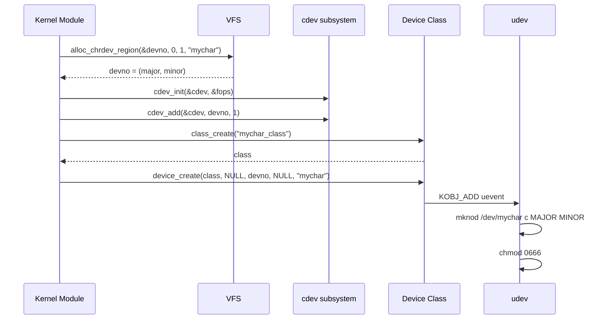
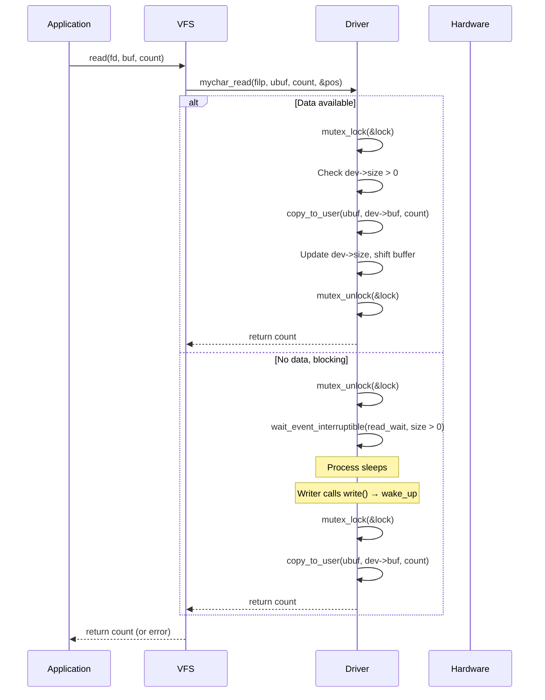
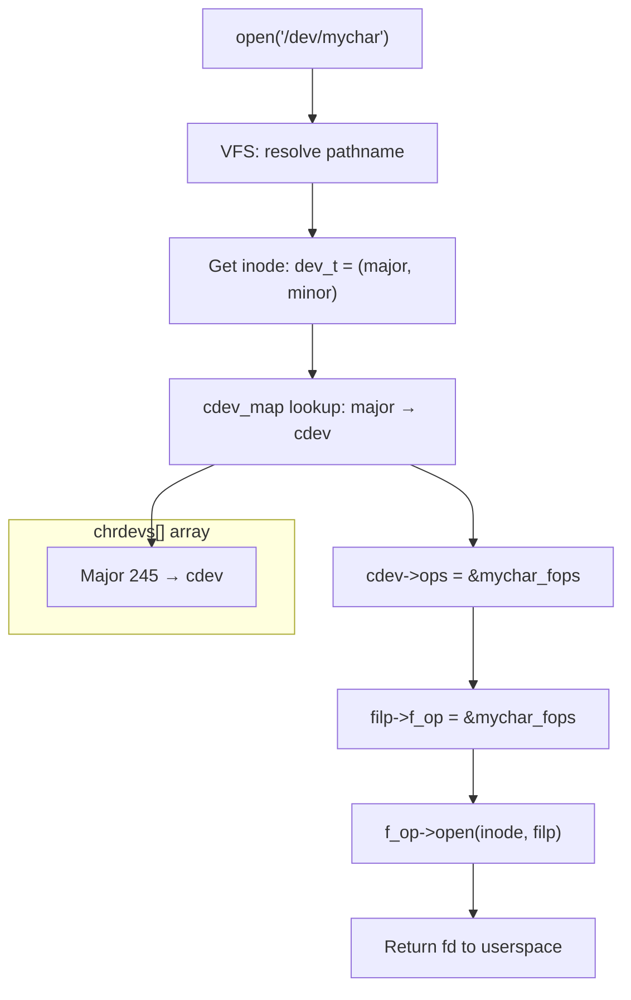

# Chapter 199: Character Device Drivers

## 1. Introduction

Character devices are the simplest and most common type of device in Linux. They present a byte-stream interface to userspace, accessed through device nodes in `/dev`. Serial ports, terminals, mice, sound devices, random number generators, and countless custom devices are implemented as character devices. The character device framework provides the `cdev` infrastructure, the `file_operations` interface, and the `ioctl` mechanism for device-specific commands.

This chapter covers the complete character device framework: registration, file operations, ioctl design, and practical patterns for building robust character device drivers.

## 2. Intuition

### 2.1 What is a Character Device?

A character device is any device that can be accessed as a stream of bytes. Unlike block devices, character devices don't have a concept of "sectors" or "blocks"—you read and write individual bytes (or whatever granularity the device supports).

The kernel represents character devices with a `cdev` structure, which links a device number (`dev_t`) to a set of `file_operations`. When userspace opens a device node (e.g., `/dev/mydev`), the kernel looks up the device number, finds the corresponding `cdev`, and installs the `file_operations` for that device.

### 2.2 Device Numbers

Every character device has a device number (`dev_t`) consisting of:
- **Major number** (12 bits): identifies the driver
- **Minor number** (20 bits): identifies a specific device instance

```c
dev_t devno = MKDEV(major, minor);
major = MAJOR(devno);
minor = MINOR(devno);
```

### 2.3 The file_operations Contract

When a process performs I/O on a device file, the VFS dispatches to the driver's `file_operations`:

| System Call | file_operations Method |
|------------|----------------------|
| `open()` | `.open()` |
| `close()` | `.release()` |
| `read()` | `.read()` |
| `write()` | `.write()` |
| `lseek()` | `.llseek()` |
| `poll()` | `.poll()` |
| `mmap()` | `.mmap()` |
| `ioctl()` | `.unlocked_ioctl()` |
| `fasync()` | `.fasync()` |

## 3. Architecture

### 3.1 Character Device Registration Flow

```
1. Allocate device number(s) → alloc_chrdev_region()
2. Initialize cdev → cdev_init()
3. Add cdev to kernel → cdev_add()
4. Create device class → class_create()
5. Create device node → device_create()
6. Userspace can now open /dev/mydev
```

### 3.2 How open() Works

```
Application calls open("/dev/mydev")
    │
    ▼
VFS resolves pathname to inode
    │
    ▼
VFS finds inode has cdev (S_ISCHR)
    │
    ▼
VFS calls cdev->ops->open()
    │
    ▼
Driver's open() allocates per-file private data
    │
    ▼
file->private_data set to driver's per-file structure
    │
    ▼
File descriptor returned to application
```

### 3.3 Device Node Creation

There are two mechanisms for creating `/dev` nodes:

1. **Static**: `mknod /dev/mydev c MAJOR MINOR`
2. **Dynamic (udev)**: `device_create()` + udev rules

Modern systems use udev, which automatically creates device nodes when the kernel emits uevents via `device_create()`.

## 4. Kernel Implementation

### 4.1 struct cdev

```c
struct cdev {
    struct kobject kobj;              /* embedded kobject */
    struct module *owner;             /* owning module */
    const struct file_operations *ops; /* file operations */
    struct list_head list;            /* list of cdevs */
    dev_t dev;                        /* device number */
    unsigned int count;               /* number of devices */
};
```

### 4.2 struct file_operations

```c
struct file_operations {
    struct module *owner;
    loff_t (*llseek)(struct file *, loff_t, int);
    ssize_t (*read)(struct file *, char __user *, size_t, loff_t *);
    ssize_t (*write)(struct file *, const char __user *, size_t, loff_t *);
    __poll_t (*poll)(struct file *, struct poll_table_struct *);
    long (*unlocked_ioctl)(struct file *, unsigned int, unsigned long);
    long (*compat_ioctl)(struct file *, unsigned int, unsigned long);
    int (*mmap)(struct file *, struct vm_area_struct *);
    int (*open)(struct inode *, struct file *);
    int (*flush)(struct file *, fl_owner_t id);
    int (*release)(struct inode *, struct file *);
    int (*fsync)(struct file *, loff_t, loff_t, int datasync);
    int (*fasync)(int, struct file *, int);
    int (*lock)(struct file *, int, struct file_lock *);
    ssize_t (*splice_read)(struct file *, loff_t *, struct pipe_inode_info *, size_t, unsigned int);
    ssize_t (*splice_write)(struct pipe_inode_info *, struct file *, loff_t *, size_t, unsigned int);
    /* ... */
};
```

### 4.3 Key Registration Functions

```c
/* Allocate device numbers */
int alloc_chrdev_region(dev_t *dev, unsigned baseminor,
                        unsigned count, const char *name);

/* Register a fixed device number */
int register_chrdev_region(dev_t from, unsigned count, const char *name);

/* Free device numbers */
void unregister_chrdev_region(dev_t from, unsigned count);

/* Initialize a cdev */
void cdev_init(struct cdev *cdev, const struct file_operations *fops);

/* Add a cdev to the system */
int cdev_add(struct cdev *cdev, dev_t dev, unsigned count);

/* Remove a cdev */
void cdev_del(struct cdev *cdev);

/* Create a device class */
struct class *class_create(const char *name);

/* Create a device node (with udev notification) */
struct device *device_create(struct class *cls, struct device *parent,
                             dev_t devt, void *drvdata,
                             const char *fmt, ...);

/* Destroy a device node */
void device_destroy(struct class *cls, dev_t devt);

/* Destroy a class */
void class_destroy(struct class *cls);
```

### 4.4 The Legacy register_chrdev API

```c
/* Simplified API (allocates all 256 minors) */
int register_chrdev(unsigned int major, const char *name,
                    const struct file_operations *fops);
void unregister_chrdev(unsigned int major, const char *name);

/* This is less flexible than the cdev API but simpler */
```

### 4.5 Copy To/From Userspace

```c
/* Copy data from kernel to userspace */
unsigned long copy_to_user(void __user *to, const void *from,
                           unsigned long n);

/* Copy data from userspace to kernel */
unsigned long copy_from_user(void *to, const void __user *from,
                             unsigned long n);

/* These handle page faults and return number of bytes NOT copied */
/* Returns 0 on success */

/* Access OK check */
bool access_ok(const void __user *addr, unsigned long size);
```

## 5. Data Structures Summary

| Structure | Header | Purpose |
|-----------|--------|---------|
| `cdev` | `include/linux/cdev.h` | Character device |
| `file_operations` | `include/linux/fs.h` | I/O operations |
| `file` | `include/linux/fs.h` | Open file instance |
| `inode` | `include/linux/fs.h` | File system inode |
| `class` | `include/linux/device/class.h` | Device class |
| `device` | `include/linux/device.h` | Device instance |

## 6. C Examples

### 6.1 Complete Character Device Driver

```c
#include <linux/module.h>
#include <linux/kernel.h>
#include <linux/fs.h>
#include <linux/cdev.h>
#include <linux/device.h>
#include <linux/slab.h>
#include <linux/uaccess.h>
#include <linux/mutex.h>

#define DEVICE_NAME "mychar"
#define CLASS_NAME  "mychar_class"
#define BUF_SIZE    4096

struct mychar_dev {
    struct cdev cdev;
    struct device *device;
    struct class *class;
    dev_t devno;
    char *buf;
    size_t size;
    struct mutex lock;
    wait_queue_head_t read_wait;
};

static struct mychar_dev *my_dev;

/* --- File Operations --- */

static int mychar_open(struct inode *inode, struct file *filp)
{
    struct mychar_dev *dev;

    dev = container_of(inode->i_cdev, struct mychar_dev, cdev);
    filp->private_data = dev;

    pr_info("mychar: opened\n");
    return 0;
}

static int mychar_release(struct inode *inode, struct file *filp)
{
    pr_info("mychar: closed\n");
    return 0;
}

static ssize_t mychar_read(struct file *filp, char __user *buf,
                            size_t count, loff_t *f_pos)
{
    struct mychar_dev *dev = filp->private_data;
    ssize_t ret;

    mutex_lock(&dev->lock);

    while (dev->size == 0) {
        mutex_unlock(&dev->lock);

        if (filp->f_flags & O_NONBLOCK)
            return -EAGAIN;

        if (wait_event_interruptible(dev->read_wait, dev->size > 0))
            return -ERESTARTSYS;

        mutex_lock(&dev->lock);
    }

    if (count > dev->size)
        count = dev->size;

    if (copy_to_user(buf, dev->buf, count)) {
        ret = -EFAULT;
        goto out;
    }

    /* Shift remaining data */
    memmove(dev->buf, dev->buf + count, dev->size - count);
    dev->size -= count;
    ret = count;

out:
    mutex_unlock(&dev->lock);
    return ret;
}

static ssize_t mychar_write(struct file *filp, const char __user *buf,
                             size_t count, loff_t *f_pos)
{
    struct mychar_dev *dev = filp->private_data;
    ssize_t ret;

    mutex_lock(&dev->lock);

    if (count > BUF_SIZE - dev->size)
        count = BUF_SIZE - dev->size;

    if (count == 0) {
        ret = -ENOSPC;
        goto out;
    }

    if (copy_from_user(dev->buf + dev->size, buf, count)) {
        ret = -EFAULT;
        goto out;
    }

    dev->size += count;
    *f_pos += count;
    ret = count;

    /* Wake up any waiting readers */
    wake_up_interruptible(&dev->read_wait);

out:
    mutex_unlock(&dev->lock);
    return ret;
}

static loff_t mychar_llseek(struct file *filp, loff_t offset, int whence)
{
    struct mychar_dev *dev = filp->private_data;
    loff_t new_pos;

    switch (whence) {
    case SEEK_SET:
        new_pos = offset;
        break;
    case SEEK_CUR:
        new_pos = filp->f_pos + offset;
        break;
    case SEEK_END:
        new_pos = dev->size + offset;
        break;
    default:
        return -EINVAL;
    }

    if (new_pos < 0 || new_pos > BUF_SIZE)
        return -EINVAL;

    filp->f_pos = new_pos;
    return new_pos;
}

static __poll_t mychar_poll(struct file *filp, poll_table *wait)
{
    struct mychar_dev *dev = filp->private_data;
    __poll_t mask = 0;

    poll_wait(filp, &dev->read_wait, wait);

    if (dev->size > 0)
        mask |= POLLIN | POLLRDNORM;

    if (dev->size < BUF_SIZE)
        mask |= POLLOUT | POLLWRNORM;

    return mask;
}

static const struct file_operations mychar_fops = {
    .owner      = THIS_MODULE,
    .open       = mychar_open,
    .release    = mychar_release,
    .read       = mychar_read,
    .write      = mychar_write,
    .llseek     = mychar_llseek,
    .poll       = mychar_poll,
};

/* --- Module Init/Exit --- */

static int __init mychar_init(void)
{
    int ret;

    my_dev = kzalloc(sizeof(*my_dev), GFP_KERNEL);
    if (!my_dev)
        return -ENOMEM;

    my_dev->buf = kzalloc(BUF_SIZE, GFP_KERNEL);
    if (!my_dev->buf) {
        ret = -ENOMEM;
        goto err_free_dev;
    }

    mutex_init(&my_dev->lock);
    init_waitqueue_head(&my_dev->read_wait);

    /* Allocate device number */
    ret = alloc_chrdev_region(&my_dev->devno, 0, 1, DEVICE_NAME);
    if (ret)
        goto err_free_buf;

    /* Initialize and add cdev */
    cdev_init(&my_dev->cdev, &mychar_fops);
    my_dev->cdev.owner = THIS_MODULE;
    ret = cdev_add(&my_dev->cdev, my_dev->devno, 1);
    if (ret)
        goto err_unreg;

    /* Create device class */
    my_dev->class = class_create(CLASS_NAME);
    if (IS_ERR(my_dev->class)) {
        ret = PTR_ERR(my_dev->class);
        goto err_cdev;
    }

    /* Create device node */
    my_dev->device = device_create(my_dev->class, NULL,
                                   my_dev->devno, NULL, DEVICE_NAME);
    if (IS_ERR(my_dev->device)) {
        ret = PTR_ERR(my_dev->device);
        goto err_class;
    }

    pr_info("mychar: registered as /dev/%s (major=%d, minor=%d)\n",
            DEVICE_NAME, MAJOR(my_dev->devno), MINOR(my_dev->devno));
    return 0;

err_class:
    class_destroy(my_dev->class);
err_cdev:
    cdev_del(&my_dev->cdev);
err_unreg:
    unregister_chrdev_region(my_dev->devno, 1);
err_free_buf:
    kfree(my_dev->buf);
err_free_dev:
    kfree(my_dev);
    return ret;
}

static void __exit mychar_exit(void)
{
    device_destroy(my_dev->class, my_dev->devno);
    class_destroy(my_dev->class);
    cdev_del(&my_dev->cdev);
    unregister_chrdev_region(my_dev->devno, 1);
    kfree(my_dev->buf);
    kfree(my_dev);
    pr_info("mychar: unregistered\n");
}

module_init(mychar_init);
module_exit(mychar_exit);
MODULE_LICENSE("GPL");
MODULE_DESCRIPTION("Example character device driver");
```

### 6.2 ioctl Implementation

```c
#include <linux/ioctl.h>

/* Define ioctl commands */
#define MYCHAR_IOC_MAGIC 'k'

#define MYCHAR_IOC_RESET    _IO(MYCHAR_IOC_MAGIC, 0)
#define MYCHAR_IOC_GET_SIZE _IOR(MYCHAR_IOC_MAGIC, 1, int)
#define MYCHAR_IOC_SET_SIZE _IOW(MYCHAR_IOC_MAGIC, 2, int)
#define MYCHAR_IOC_GET_DATA _IOWR(MYCHAR_IOC_MAGIC, 3, struct mychar_data)

struct mychar_data {
    int value;
    char name[32];
};

static long mychar_ioctl(struct file *filp, unsigned int cmd,
                          unsigned long arg)
{
    struct mychar_dev *dev = filp->private_data;
    int size;
    struct mychar_data data;

    switch (cmd) {
    case MYCHAR_IOC_RESET:
        mutex_lock(&dev->lock);
        dev->size = 0;
        memset(dev->buf, 0, BUF_SIZE);
        mutex_unlock(&dev->lock);
        pr_info("mychar: reset\n");
        return 0;

    case MYCHAR_IOC_GET_SIZE:
        size = dev->size;
        if (copy_to_user((int __user *)arg, &size, sizeof(size)))
            return -EFAULT;
        return 0;

    case MYCHAR_IOC_SET_SIZE:
        if (copy_from_user(&size, (int __user *)arg, sizeof(size)))
            return -EFAULT;
        if (size < 0 || size > BUF_SIZE)
            return -EINVAL;
        mutex_lock(&dev->lock);
        dev->size = size;
        mutex_unlock(&dev->lock);
        return 0;

    case MYCHAR_IOC_GET_DATA:
        mutex_lock(&dev->lock);
        data.value = dev->size;
        strscpy(data.name, DEVICE_NAME, sizeof(data.name));
        mutex_unlock(&dev->lock);
        if (copy_to_user((void __user *)arg, &data, sizeof(data)))
            return -EFAULT;
        return 0;

    default:
        return -ENOTTY;
    }
}

/* Add to file_operations */
static const struct file_operations mychar_fops = {
    /* ... */
    .unlocked_ioctl = mychar_ioctl,
    .compat_ioctl   = compat_ptr_ioctl,  /* for 32-bit userspace */
};
```

### 6.3 Userspace Test Program

```c
#include <stdio.h>
#include <stdlib.h>
#include <fcntl.h>
#include <unistd.h>
#include <string.h>
#include <sys/ioctl.h>
#include <errno.h>

#define DEVICE_PATH "/dev/mychar"

int main(void)
{
    int fd;
    char buf[256];
    ssize_t n;

    fd = open(DEVICE_PATH, O_RDWR);
    if (fd < 0) {
        perror("open");
        return 1;
    }

    /* Write data */
    const char *msg = "Hello, kernel!";
    n = write(fd, msg, strlen(msg));
    printf("Wrote %zd bytes\n", n);

    /* Read data back */
    n = read(fd, buf, sizeof(buf) - 1);
    if (n > 0) {
        buf[n] = '\0';
        printf("Read %zd bytes: %s\n", n, buf);
    }

    /* Use ioctl */
    int size;
    ioctl(fd, _IOR('k', 1, int), &size);
    printf("Buffer size: %d\n", size);

    close(fd);
    return 0;
}
```

### 6.4 udev Rules

```bash
# /etc/udev/rules.d/99-mychar.rules

# Create /dev/mychar with specific permissions
SUBSYSTEM=="mychar_class", MODE="0666", GROUP="users"

# Or with KERNEL matching:
KERNEL=="mychar", MODE="0666", GROUP="users"

# Create symlinks:
KERNEL=="mychar", SYMLINK+="mychar_device"
```

## 7. Diagrams

### 7.1 Character Device Registration



### 7.2 read() Call Flow



### 7.3 Major/Minor Number Lookup



## 8. Common Pitfalls

### 8.1 Missing copy_to_user/copy_from_user

```c
/* WRONG: directly accessing userspace pointers */
static ssize_t my_read(struct file *f, char __user *buf, size_t count, loff_t *pos)
{
    memcpy(buf, my_data, count);  /* BUG: will crash on most architectures */
}

/* CORRECT: always use copy_to_user */
static ssize_t my_read(struct file *f, char __user *buf, size_t count, loff_t *pos)
{
    if (copy_to_user(buf, my_data, count))
        return -EFAULT;
    return count;
}
```

### 8.2 Not Checking Return Values

```c
/* WRONG: ignoring copy_to_user failure */
copy_to_user(buf, data, count);
return count;  /* Reports success even if copy failed */

/* CORRECT: check return value */
if (copy_to_user(buf, data, count))
    return -EFAULT;
return count;
```

### 8.3 Race Conditions with Concurrent Access

```c
/* WRONG: no synchronization */
static ssize_t my_write(struct file *f, const char __user *buf,
                         size_t count, loff_t *pos)
{
    memcpy(dev->buf + dev->size, buf, count);  /* Race! */
    dev->size += count;  /* Race! */
}

/* CORRECT: use mutex or spinlock */
static ssize_t my_write(struct file *f, const char __user *buf,
                         size_t count, loff_t *pos)
{
    mutex_lock(&dev->lock);
    memcpy(dev->buf + dev->size, buf, count);
    dev->size += count;
    mutex_unlock(&dev->lock);
}
```

### 8.4 Forgetting Module Owner

```c
/* WRONG: no owner set */
static const struct file_operations my_fops = {
    .open = my_open,
    /* .owner not set! */
};

/* CORRECT: always set owner */
static const struct file_operations my_fops = {
    .owner = THIS_MODULE,
    .open = my_open,
};
```

### 8.5 Incorrect Cleanup Order

```c
/* WRONG: destroying class before device */
class_destroy(class);       /* Destroys class first */
device_destroy(class, dev); /* BUG: class already gone! */

/* CORRECT: destroy in reverse order of creation */
device_destroy(class, dev);  /* 1. Remove device node */
class_destroy(class);        /* 2. Remove class */
cdev_del(&cdev);             /* 3. Remove cdev */
unregister_chrdev_region();  /* 4. Free device numbers */
```

## 9. Best Practices

### 9.1 Use container_of for Private Data

```c
static int my_open(struct inode *inode, struct file *filp)
{
    struct my_dev *dev = container_of(inode->i_cdev, struct my_dev, cdev);
    filp->private_data = dev;
    return 0;
}
```

### 9.2 Support O_NONBLOCK

```c
static ssize_t my_read(struct file *filp, char __user *buf,
                        size_t count, loff_t *pos)
{
    if (filp->f_flags & O_NONBLOCK) {
        if (no_data_available)
            return -EAGAIN;
    } else {
        if (wait_event_interruptible(wq, data_available))
            return -ERESTARTSYS;
    }
    /* ... */
}
```

### 9.3 Use _IOC Macros for ioctl

```c
/* Define commands properly */
#define MY_IOC_MAGIC 'M'
#define MY_CMD_READ   _IOR(MY_IOC_MAGIC, 1, struct my_data)
#define MY_CMD_WRITE  _IOW(MY_IOC_MAGIC, 2, struct my_data)
#define MY_CMD_RESET  _IO(MY_IOC_MAGIC, 3)

/* Validate command in ioctl handler */
if (_IOC_TYPE(cmd) != MY_IOC_MAGIC)
    return -ENOTTY;
if (_IOC_NR(cmd) > MY_MAX_CMD)
    return -ENOTTY;
```

### 9.4 Use devm_ for Resource Management

```c
/* Use devm_cdev_alloc if available, or manage manually */
/* Always use devm_ for irq, memory, etc. */
```

### 9.5 Proper Partial Read/Write Handling

```c
static ssize_t my_read(struct file *filp, char __user *buf,
                        size_t count, loff_t *pos)
{
    size_t available = dev->size - *pos;

    if (available == 0)
        return 0;  /* EOF */

    if (count > available)
        count = available;

    if (copy_to_user(buf, dev->buf + *pos, count))
        return -EFAULT;

    *pos += count;
    return count;
}
```

## 10. Exercises

### Exercise 1: Simple Character Device

Implement the complete character device driver from Section 6.1. Write a userspace program that opens the device, writes data, reads it back, and verifies the data matches.

### Exercise 2: ioctl Interface

Extend the character device with the ioctl commands from Section 6.2. Write a test program that exercises each ioctl command.

### Exercise 3: Select/Poll Support

Add poll() support to the character device so that userspace can use `select()` or `epoll()` to wait for data availability. Test with a program that uses non-blocking I/O with poll().

### Exercise 4: Circular Buffer

Modify the character device to use a circular buffer instead of a linear buffer. The read position should advance independently of the write position, wrapping around at the end.

### Exercise 5: Multiple Device Instances

Modify the driver to support multiple device instances (e.g., `/dev/mychar0`, `/dev/mychar1`). Use the minor number to distinguish between instances. Each instance should have its own buffer.

## 11. References

### Kernel Source
- `fs/char_dev.c` — Character device infrastructure
- `include/linux/cdev.h` — cdev structure
- `include/linux/fs.h` — file_operations, file, inode
- `include/uapi/asm-generic/ioctl.h` — ioctl macros
- `Documentation/driver-api/basics.rst` — Driver basics
- `Documentation/filesystems/` — Filesystem documentation

### Books
- *Linux Device Drivers, 3rd Edition* — Chapters 3-5
- *Linux Kernel Development, 3rd Edition* — Chapter 13

### Online
- https://www.kernel.org/doc/html/latest/driver-api/
- https://tldp.org/LDP/lkmpg/2.6/html/
- https://lwn.net/Kernel/LDD3/

## 12. Deep Dive: Character Device Internals

### 12.1 The cdev Infrastructure

The `cdev` structure is the kernel's internal representation of a character device. It's registered in a global hash table (`chrdevs[]`) indexed by major number. When userspace opens a device file, the VFS:

1. Looks up the inode's `i_rdev` (device number)
2. Finds the `cdev` in the hash table
3. Sets `file->f_op = cdev->ops`
4. Calls `file->f_op->open(inode, file)`

### 12.2 Device Number Allocation Strategies

**Dynamic Allocation** (preferred):
```c
dev_t devno;
alloc_chrdev_region(&devno, 0, 1, "mydev");
/* Kernel finds an unused major number */
```

**Static Allocation** (for known devices):
```c
dev_t devno = MKDEV(245, 0);
register_chrdev_region(devno, 1, "mydev");
/* Must ensure major 245 is not already in use */
```

### 12.3 ioctl Command Encoding

Linux ioctl commands are encoded as 32-bit values:

```
Bits 31-30: Direction (00=none, 01=write, 10=read, 11=read/write)
Bits 29-16: Size (14 bits, up to 16KB)
Bits 15-8:  Type (magic number)
Bits 7-0:   Command number
```

The `_IO`, `_IOR`, `_IOW`, `_IOWR` macros generate these values:
```c
_IO(type, nr)           /* No data transfer */
_IOR(type, nr, datatype) /* Read from device */
_IOW(type, nr, datatype) /* Write to device */
_IOWR(type, nr, datatype) /* Both directions */
```

### 12.4 The file Structure

Each `open()` call creates a new `struct file`:

```c
struct file {
    struct path f_path;        /* Path (dentry + vfsmount) */
    struct inode *f_inode;     /* inode */
    const struct file_operations *f_op; /* Operations */
    atomic_long_t f_count;     /* Reference count */
    unsigned int f_flags;      /* O_RDONLY, O_NONBLOCK, etc. */
    fmode_t f_mode;            /* FMODE_READ, FMODE_WRITE */
    loff_t f_pos;              /* Current file position */
    void *private_data;        /* Driver-private data */
    /* ... */
};
```

### 12.5 mmap for Character Devices

The `mmap()` file operation allows userspace to directly map device memory:

```c
static int my_mmap(struct file *filp, struct vm_area_struct *vma)
{
    struct my_dev *dev = filp->private_data;
    unsigned long size = vma->vm_end - vma->vm_start;

    if (size > dev->buf_size)
        return -EINVAL;

    /* Map kernel buffer to userspace */
    if (remap_pfn_range(vma, vma->vm_start,
                        virt_to_phys(dev->buf) >> PAGE_SHIFT,
                        size, vma->vm_page_prot))
        return -EAGAIN;

    return 0;
}
```

### 12.6 fasync for Signal-Based Notification

The `fasync()` operation allows the driver to send signals to userspace when data arrives:

```c
static int my_fasync(int fd, struct file *filp, int on)
{
    struct my_dev *dev = filp->private_data;
    return fasync_helper(fd, filp, on, &dev->async_queue);
}

/* In the interrupt handler or data producer: */
if (dev->async_queue)
    kill_fasync(&dev->async_queue, SIGIO, POLL_IN);
```

### 12.7 sysfs Integration

Character devices can expose attributes through sysfs:

```c
static ssize_t my_attr_show(struct device *dev,
                             struct device_attribute *attr, char *buf)
{
    struct my_dev *mydev = dev_get_drvdata(dev);
    return sprintf(buf, "%d\n", mydev->value);
}

static DEVICE_ATTR_RO(my_attr);

/* In probe: */
device_create_file(dev, &dev_attr_my_attr);
```

### 12.8 procfs Integration

The `/proc` filesystem provides another interface for debugging:

```c
static int my_proc_show(struct seq_file *m, void *v)
{
    struct my_dev *dev = m->private;
    seq_printf(m, "Buffer size: %zu\n", dev->buf_size);
    seq_printf(m, "Data size: %zu\n", dev->data_size);
    seq_printf(m, "Open count: %d\n", atomic_read(&dev->open_count));
    return 0;
}

static int my_proc_open(struct inode *inode, struct file *file)
{
    return single_open(file, my_proc_show, PDE_DATA(inode));
}

static const struct proc_ops my_proc_ops = {
    .proc_open = my_proc_open,
    .proc_read = seq_read,
    .proc_lseek = seq_lseek,
    .proc_release = single_release,
};

/* In init: */
proc_create_data("mydev", 0444, NULL, &my_proc_ops, mydev);
```

### 12.9 Kernel Events (uevent)

Drivers can send custom uevent messages to userspace:

```c
/* Send a custom uevent */
char *envp[] = { "EVENT=data_ready", NULL };
kobject_uevent_env(&dev->kobj, KOBJ_CHANGE, envp);
```

This triggers udev rules and can be used for device-specific notifications.
