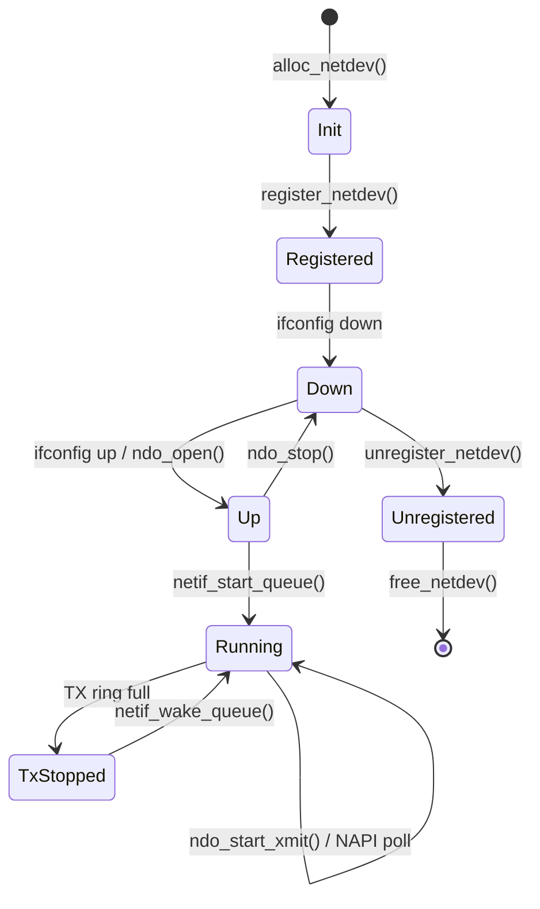
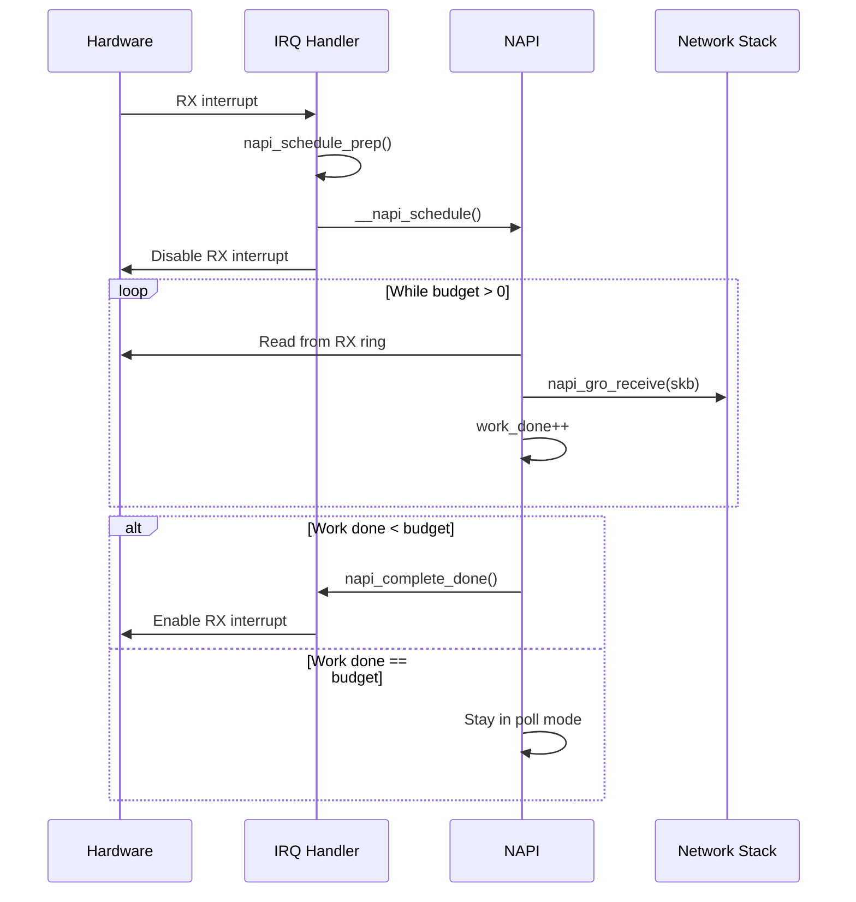
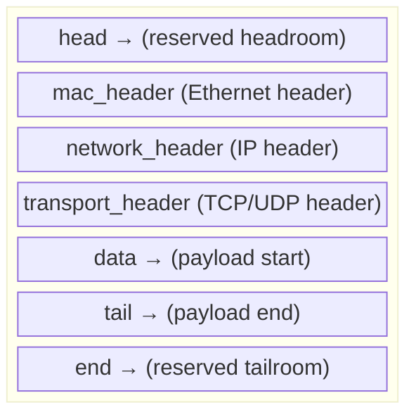

# Chapter 200: Network Device Drivers

## 1. Introduction

Network device drivers are among the most complex and performance-critical drivers in the Linux kernel. They bridge the gap between the kernel's network stack and physical or virtual network hardware, handling packet transmission, reception, interrupt coalescing, and numerous offload features. The Linux network subsystem has evolved into a highly optimized, multi-queue capable framework that supports speeds from 10 Mbps to 400 Gbps and beyond.

This chapter covers the `net_device` structure, the `ndo_ops` callback table, the `sk_buff` (socket buffer) abstraction, NAPI (New API) for interrupt mitigation, ring buffer management, and the complete lifecycle of packet transmission and reception.

## 2. Intuition

### 2.1 Network Device Model

A network device in Linux is a bidirectional packet conduit. Unlike character or block devices, network devices don't have device nodes in `/dev`. Instead, they are accessed through:

- **Socket API**: `socket()`, `bind()`, `send()`, `recv()`
- **Network configuration**: `ifconfig`, `ip link`, `ip addr`
- **sysfs**: `/sys/class/net/<interface>/`

### 2.2 The sk_buff — Socket Buffer

Every packet in the Linux network stack is represented by an `sk_buff` (socket buffer). This is the universal currency of the networking subsystem:

- Contains packet data (headers + payload)
- Tracks metadata (protocol, interface, priority)
- Uses a clever headroom/tailroom design for efficient header manipulation
- Can be linked into lists and queues

### 2.3 NAPI — New API

Traditional network drivers generated an interrupt for every packet. At high packet rates, this leads to "livelock" — the CPU spends all its time handling interrupts and never processes packets. NAPI solves this by:

1. Disabling packet-receive interrupts after the first interrupt
2. Switching to **polling** mode: the kernel periodically calls the driver's `poll()` function
3. Re-enabling interrupts when the queue is empty

This is analogous to blk-mq's interrupt coalescing, but predates it.

## 3. Architecture

### 3.1 Network Stack Layers

```
┌─────────────────────────────────────────────────┐
│              Userspace Applications              │
│          (socket API: send/recv/connect)         │
├─────────────────────────────────────────────────┤
│              Socket Layer                        │
│         (struct sock, struct socket)             │
├─────────────────────────────────────────────────┤
│              Transport Layer                     │
│            (TCP, UDP, SCTP, etc.)                │
├─────────────────────────────────────────────────┤
│              Network Layer                       │
│              (IPv4, IPv6)                        │
├─────────────────────────────────────────────────┤
│              Link Layer                          │
│        (dev_queue_xmit / netif_rx)              │
├─────────────────────────────────────────────────┤
│         Network Device Drivers                   │
│  (e1000e, ixgbe, virtio_net, veth, ...)         │
├─────────────────────────────────────────────────┤
│              Hardware                            │
│        (NIC, switch, virtual bridge)             │
└─────────────────────────────────────────────────┘
```

### 3.2 Packet Flow — Transmit

```
Application: send(fd, data, len)
    │
    ▼
Socket layer: tcp_sendmsg() / udp_sendmsg()
    │
    ▼
Network layer: ip_queue_xmit() / ip6_output()
    │
    ▼
Link layer: dev_queue_xmit(skb)
    │
    ▼
Traffic control (qdisc): enqueue/dequeue
    │
    ▼
Driver: ndo_start_xmit(skb, dev)
    │
    ▼
Hardware TX ring → DMA → Wire
```

### 3.3 Packet Flow — Receive

```
Hardware RX ring → DMA → Interrupt
    │
    ▼
Driver IRQ handler: disable RX interrupt, schedule NAPI
    │
    ▼
NAPI poll: allocate skb, fill from DMA ring
    │
    ▼
netif_receive_skb(skb) or napi_gro_receive(skb)
    │
    ▼
Link layer: packet_type dispatch
    │
    ▼
Network layer: ip_rcv() / ipv6_rcv()
    │
    ▼
Transport layer: tcp_v4_rcv() / udp_rcv()
    │
    ▼
Socket: wake up recv()
```

## 4. Kernel Implementation

### 4.1 struct net_device

```c
struct net_device {
    char name[IFNAMSIZ];              /* interface name */
    struct netdev_name_node *name_node;

    /* Device identification */
    unsigned int ifindex;              /* unique interface index */
    unsigned short hard_header_len;    /* hardware header length */
    unsigned char addr_len;            /* hardware address length */
    unsigned char addr_assign_type;    /* how address was assigned */
    unsigned char dev_addr[MAX_ADDR_LEN]; /* MAC address */
    unsigned char broadcast[MAX_ADDR_LEN]; /* broadcast address */

    /* Network layer */
    unsigned long state;
    struct list_head dev_list;
    struct list_head napi_list;
    struct list_head unreg_list;
    struct list_head close_list;

    /* Hardware features */
    unsigned int features;             /* NETIF_F_* flags */
    unsigned int hw_features;          /* user-changeable features */
    unsigned int wanted_features;

    /* MTU and queue */
    unsigned int mtu;                  /* maximum transfer unit */
    unsigned int min_mtu, max_mtu;
    struct netdev_rx_queue *_rx;
    unsigned int num_rx_queues;
    struct netdev_tx_queue *_tx;
    unsigned int num_tx_queues;

    /* Operations */
    const struct net_device_ops *netdev_ops;
    const struct ethtool_ops *ethtool_ops;
    const struct header_ops *header_ops;

    /* Statistics */
    struct net_device_stats stats;
    struct rtnl_link_stats64 *tstats;

    /* ... hundreds more fields ... */

    /* Private area — driver data follows */
    char priv[] __aligned(NETDEV_ALIGN);
};
```

### 4.2 struct net_device_ops

```c
struct net_device_ops {
    int (*ndo_init)(struct net_device *dev);
    void (*ndo_uninit)(struct net_device *dev);
    int (*ndo_open)(struct net_device *dev);
    int (*ndo_stop)(struct net_device *dev);
    netdev_tx_t (*ndo_start_xmit)(struct sk_buff *skb,
                                   struct net_device *dev);
    u16 (*ndo_select_queue)(struct net_device *dev, struct sk_buff *skb,
                            struct net_device *sb_dev);
    void (*ndo_change_rx_flags)(struct net_device *dev, int flags);
    void (*ndo_set_rx_mode)(struct net_device *dev);
    int (*ndo_set_mac_address)(struct net_device *dev, void *addr);
    int (*ndo_validate_addr)(struct net_device *dev);
    int (*ndo_do_ioctl)(struct net_device *dev, struct ifreq *ifr, int cmd);
    int (*ndo_set_config)(struct net_device *dev, struct ifmap *map);
    int (*ndo_change_mtu)(struct net_device *dev, int new_mtu);
    int (*ndo_neigh_setup)(struct net_device *dev, struct neigh_parms *);
    void (*ndo_tx_timeout)(struct net_device *dev, unsigned int txqueue);
    struct rtnl_link_stats64 *(*ndo_get_stats64)(
        struct net_device *dev, struct rtnl_link_stats64 *storage);
    int (*ndo_set_features)(struct net_device *dev, netdev_features_t features);
    int (*ndo_set_rx_mode)(struct net_device *dev);
    int (*ndo_get_iflink)(const struct net_device *dev);
    int (*ndo_fill_metadata_dst)(struct net_device *dev, struct sk_buff *skb);
    /* ... many more ... */
};
```

### 4.3 struct sk_buff

```c
struct sk_buff {
    /* Linkage */
    struct sk_buff *next, *prev;
    struct sk_buff_head *list;

    /* Timestamps */
    ktime_t tstamp;

    /* Socket ownership */
    struct sock *sk;

    /* Network device */
    struct net_device *dev;

    /* Header pointers */
    unsigned char *head;               /* start of buffer */
    unsigned char *data;               /* start of data */
    unsigned char *tail;               /* end of data */
    unsigned char *end;                /* end of buffer */

    /* Protocol headers */
    union {
        struct tcphdr *th;
        struct udphdr *uh;
        struct icmphdr *icmph;
        struct igmphdr *igmph;
        struct iphdr *iph;
        struct ipv6hdr *ipv6h;
        unsigned char *raw;
    } h;

    union {
        struct iphdr *iph;
        struct ipv6hdr *ipv6h;
        struct arphdr *arph;
        unsigned char *raw;
    } nh;

    union {
        unsigned char *raw;
    } mac;

    /* Lengths */
    unsigned int len;                   /* data length */
    unsigned int data_len;              /* paged data length */
    __u16 mac_len;                      /* MAC header length */
    __u16 hdr_len;                      /* cloned header length */

    /* Checksum */
    __u16 queue_mapping;
    __u8 cloned:1, ip_summed:2, nohdr:1, pkt_type:3;
    __be16 protocol;

    /* Transport header offset */
    __u16 transport_header;
    __u16 network_header;
    __u16 mac_header;

    /* Priority and VLAN */
    __u32 priority;
    __u16 vlan_tci;

    /* ... */
};
```

### 4.4 NAPI Structure

```c
struct napi_struct {
    struct list_head poll_list;        /* list of NAPI contexts */
    unsigned long state;               /* NAPI_STATE_* flags */
    int weight;                        /* budget per poll */
    int gro_count;                     /* GRO packet count */
    int poll;                          /* poll callback index */
    struct net_device *dev;            /* associated device */
    struct sk_buff *gro_flush_timeout; /* GRO flush timer */
    struct list_head dev_list;         /* device linkage */
    struct hlist_node napi_hash_node;
    unsigned int napi_id;
    struct sk_buff_head gro_list;      /* GRO packets */
    /* ... */
};
```

### 4.5 Key Functions

```c
/* Allocate a net_device */
struct net_device *alloc_netdev(int sizeof_priv, const char *name,
                                 unsigned char name_assign_type,
                                 void (*setup)(struct net_device *));

/* Macros for common cases */
#define alloc_etherdev(sizeof_priv) \
    alloc_netdev(sizeof_priv, "eth%d", NET_NAME_UNKNOWN, ether_setup)

/* Register/unregister */
int register_netdev(struct net_device *dev);
void unregister_netdev(struct net_device *dev);

/* NAPI */
void netif_napi_add(struct net_device *dev, struct napi_struct *napi,
                    int (*poll)(struct napi_struct *, int), int weight);
void napi_enable(struct napi_struct *napi);
void napi_disable(struct napi_struct *napi);
bool napi_schedule_prep(struct napi_struct *napi);
void __napi_schedule(struct napi_struct *napi);
bool napi_complete_done(struct napi_struct *napi, int work_done);

/* Packet reception */
int netif_receive_skb(struct sk_buff *skb);
gro_result_t napi_gro_receive(struct napi_struct *napi, struct sk_buff *skb);

/* Packet transmission */
netdev_tx_t dev_queue_xmit(struct sk_buff *skb);

/* SKB allocation */
struct sk_buff *netdev_alloc_skb(struct net_device *dev, unsigned int length);
struct sk_buff *napi_alloc_skb(struct napi_struct *napi, unsigned int length);
void kfree_skb(struct sk_buff *skb);
void dev_consume_skb_any(struct sk_buff *skb);

/* SKB manipulation */
unsigned char *skb_put(struct sk_buff *skb, unsigned int len);
unsigned char *skb_push(struct sk_buff *skb, unsigned int len);
unsigned char *skb_pull(struct sk_buff *skb, unsigned int len);
void skb_reserve(struct sk_buff *skb, int len);

/* Link state */
void netif_carrier_on(struct net_device *dev);
void netif_carrier_off(struct net_device *dev);
void netif_start_queue(struct net_device *dev);
void netif_stop_queue(struct net_device *dev);
void netif_wake_queue(struct net_device *dev);

/* Statistics */
struct net_device_stats *dev_get_stats(struct net_device *dev,
                                        struct net_device_stats *storage);
```

## 5. Data Structures Summary

| Structure | Header | Purpose |
|-----------|--------|---------|
| `net_device` | `include/linux/netdevice.h` | Network device |
| `net_device_ops` | `include/linux/netdevice.h` | Device operations |
| `sk_buff` | `include/linux/skbuff.h` | Socket buffer (packet) |
| `napi_struct` | `include/linux/netdevice.h` | NAPI polling context |
| `ethtool_ops` | `include/linux/ethtool.h` | Ethtool operations |
| `netdev_hw_addr` | `include/linux/netdevice.h` | Hardware address |

## 6. C Examples

### 6.1 Minimal Network Driver (Virtual)

```c
#include <linux/module.h>
#include <linux/netdevice.h>
#include <linux/etherdevice.h>
#include <linux/skbuff.h>

#define MY_DRV_NAME "my_net"
#define MY_MTU 1500

struct my_net_priv {
    struct net_device *dev;
    struct napi_struct napi;
    struct sk_buff_head tx_queue;
    spinlock_t lock;
    unsigned long tx_packets;
    unsigned long tx_bytes;
    unsigned long rx_packets;
    unsigned long rx_bytes;
};

/* --- Transmit --- */

static netdev_tx_t my_net_xmit(struct sk_buff *skb,
                                struct net_device *dev)
{
    struct my_net_priv *priv = netdev_priv(dev);

    /* In a real driver, you would:
     * 1. Map skb data for DMA
     * 2. Add descriptor to TX ring
     * 3. Kick the hardware
     *
     * For this virtual driver, loopback the packet */
    priv->tx_packets++;
    priv->tx_bytes += skb->len;

    /* Simulate receive: clone and receive */
    {
        struct sk_buff *rx_skb;

        rx_skb = skb_clone(skb, GFP_ATOMIC);
        if (rx_skb) {
            rx_skb->dev = dev;
            rx_skb->protocol = eth_type_trans(rx_skb, dev);
            rx_skb->ip_summed = CHECKSUM_UNNECESSARY;
            netif_rx(rx_skb);
            priv->rx_packets++;
            priv->rx_bytes += skb->len;
        }
    }

    /* Free the original TX skb */
    dev_consume_skb_any(skb);

    return NETDEV_TX_OK;
}

/* --- NAPI Poll --- */

static int my_net_poll(struct napi_struct *napi, int budget)
{
    struct my_net_priv *priv = container_of(napi, struct my_net_priv, napi);
    int work_done = 0;

    /* In a real driver, process RX ring:
     * while (work_done < budget) {
     *     skb = get_packet_from_rx_ring(priv);
     *     if (!skb)
     *         break;
     *     skb->protocol = eth_type_trans(skb, priv->dev);
     *     napi_gro_receive(napi, skb);
     *     work_done++;
     * }
     */

    if (work_done < budget) {
        napi_complete_done(napi, work_done);
        /* Re-enable RX interrupts */
    }

    return work_done;
}

/* --- Device Operations --- */

static int my_net_open(struct net_device *dev)
{
    struct my_net_priv *priv = netdev_priv(dev);

    napi_enable(&priv->napi);
    netif_start_queue(dev);
    netif_carrier_on(dev);

    pr_info("%s: interface up\n", dev->name);
    return 0;
}

static int my_net_stop(struct net_device *dev)
{
    struct my_net_priv *priv = netdev_priv(dev);

    netif_carrier_off(dev);
    netif_stop_queue(dev);
    napi_disable(&priv->napi);

    pr_info("%s: interface down\n", dev->name);
    return 0;
}

static void my_net_tx_timeout(struct net_device *dev, unsigned int txqueue)
{
    pr_warn("%s: TX timeout on queue %u\n", dev->name, txqueue);
    /* Reset hardware, restart queue */
    netif_trans_update(dev);
    netif_wake_queue(dev);
}

static int my_net_change_mtu(struct net_device *dev, int new_mtu)
{
    if (new_mtu < 68 || new_mtu > MY_MTU)
        return -EINVAL;
    dev->mtu = new_mtu;
    return 0;
}

static void my_net_get_stats64(struct net_device *dev,
                                struct rtnl_link_stats64 *stats)
{
    struct my_net_priv *priv = netdev_priv(dev);

    stats->tx_packets = priv->tx_packets;
    stats->tx_bytes = priv->tx_bytes;
    stats->rx_packets = priv->rx_packets;
    stats->rx_bytes = priv->rx_bytes;
}

static const struct net_device_ops my_net_ops = {
    .ndo_open            = my_net_open,
    .ndo_stop            = my_net_stop,
    .ndo_start_xmit      = my_net_xmit,
    .ndo_change_mtu      = my_net_change_mtu,
    .ndo_get_stats64     = my_net_get_stats64,
    .ndo_tx_timeout      = my_net_tx_timeout,
    .ndo_set_rx_mode     = NULL,  /* accept all */
};

/* --- Setup --- */

static void my_net_setup(struct net_device *dev)
{
    dev->netdev_ops = &my_net_ops;
    dev->watchdog_timeo = 5 * HZ;  /* 5 second timeout */

    /* Ethernet defaults */
    ether_setup(dev);
    dev->flags |= IFF_NOARP;
    dev->features |= NETIF_F_HW_CSUM;
    dev->mtu = MY_MTU;
}

/* --- Module Init/Exit --- */

static struct net_device *my_net_dev;

static int __init my_net_init(void)
{
    struct my_net_priv *priv;
    int ret;

    my_net_dev = alloc_netdev(sizeof(struct my_net_priv), MY_DRV_NAME,
                              NET_NAME_UNKNOWN, my_net_setup);
    if (!my_net_dev)
        return -ENOMEM;

    priv = netdev_priv(my_net_dev);
    priv->dev = my_net_dev;
    skb_queue_head_init(&priv->tx_queue);
    spin_lock_init(&priv->lock);

    /* Add NAPI */
    netif_napi_add(my_net_dev, &priv->napi, my_net_poll, 64);

    ret = register_netdev(my_net_dev);
    if (ret) {
        free_netdev(my_net_dev);
        return ret;
    }

    pr_info("%s: registered\n", MY_DRV_NAME);
    return 0;
}

static void __exit my_net_exit(void)
{
    unregister_netdev(my_net_dev);
    free_netdev(my_net_dev);
    pr_info("%s: unregistered\n", MY_DRV_NAME);
}

module_init(my_net_init);
module_exit(my_net_exit);
MODULE_LICENSE("GPL");
MODULE_DESCRIPTION("Example virtual network driver");
```

### 6.2 Ring Buffer Management

```c
#define TX_RING_SIZE 256
#define RX_RING_SIZE 256

struct my_ring_desc {
    __le64 addr;       /* DMA address of buffer */
    __le32 len;        /* buffer length */
    __le32 flags;      /* descriptor flags */
} __packed;

struct my_ring {
    struct my_ring_desc *desc;     /* descriptor ring (DMA coherent) */
    dma_addr_t dma;                /* DMA address of ring */
    struct sk_buff **skbs;         /* associated sk_buffs */
    unsigned int head;             /* next to use */
    unsigned int tail;             /* next to complete */
    unsigned int size;             /* ring size */
};

static int my_alloc_tx_ring(struct my_net_priv *priv)
{
    struct my_ring *ring = &priv->tx_ring;
    int size = TX_RING_SIZE * sizeof(struct my_ring_desc);

    ring->desc = dma_alloc_coherent(&priv->pdev->dev, size,
                                     &ring->dma, GFP_KERNEL);
    if (!ring->desc)
        return -ENOMEM;

    ring->skbs = kcalloc(TX_RING_SIZE, sizeof(struct sk_buff *), GFP_KERNEL);
    if (!ring->skbs) {
        dma_free_coherent(&priv->pdev->dev, size, ring->desc, ring->dma);
        return -ENOMEM;
    }

    ring->size = TX_RING_SIZE;
    ring->head = 0;
    ring->tail = 0;

    return 0;
}

static netdev_tx_t my_start_xmit(struct sk_buff *skb,
                                  struct net_device *dev)
{
    struct my_net_priv *priv = netdev_priv(dev);
    struct my_ring *ring = &priv->tx_ring;
    struct my_ring_desc *desc;
    dma_addr_t dma;
    unsigned int entry;

    /* Check if ring is full */
    if ((ring->head + 1) % ring->size == ring->tail) {
        netif_stop_queue(dev);
        return NETDEV_TX_BUSY;
    }

    /* Map skb data for DMA */
    dma = dma_map_single(&priv->pdev->dev, skb->data, skb->len,
                          DMA_TO_DEVICE);
    if (dma_mapping_error(&priv->pdev->dev, dma)) {
        dev_kfree_skb_any(skb);
        return NETDEV_TX_OK;
    }

    /* Fill descriptor */
    entry = ring->head;
    desc = &ring->desc[entry];
    desc->addr = cpu_to_le64(dma);
    desc->len = cpu_to_le32(skb->len);
    desc->flags = cpu_to_le32(DESC_F_EOP | DESC_F_IFCS);

    ring->skbs[entry] = skb;
    ring->head = (entry + 1) % ring->size;

    /* Kick hardware */
    writel(ring->head, priv->regs + TX_TAIL);

    /* Stop queue if ring is nearly full */
    if ((ring->head + 1) % ring->size == ring->tail)
        netif_stop_queue(dev);

    return NETDEV_TX_OK;
}

static void my_clean_tx_ring(struct my_net_priv *priv)
{
    struct my_ring *ring = &priv->tx_ring;

    while (ring->tail != ring->head) {
        unsigned int entry = ring->tail;
        struct my_ring_desc *desc = &ring->desc[entry];
        struct sk_buff *skb = ring->skbs[entry];

        if (!(le32_to_cpu(desc->flags) & DESC_F_DONE))
            break;

        /* Unmap DMA */
        dma_unmap_single(&priv->pdev->dev,
                         le64_to_cpu(desc->addr),
                         le32_to_cpu(desc->len),
                         DMA_TO_DEVICE);

        /* Free skb */
        dev_consume_skb_any(skb);
        ring->skbs[entry] = NULL;

        ring->tail = (entry + 1) % ring->size;
    }

    /* Restart queue if it was stopped */
    if (netif_queue_stopped(priv->dev) &&
        (ring->head + 1) % ring->size != ring->tail)
        netif_wake_queue(priv->dev);
}
```

### 6.3 Ethtool Operations

```c
#include <linux/ethtool.h>

static const char my_stats_strings[][ETH_GSTRING_LEN] = {
    "tx_packets",
    "tx_bytes",
    "rx_packets",
    "rx_bytes",
    "tx_errors",
    "rx_errors",
    "tx_dropped",
    "rx_dropped",
};

static int my_get_sset_count(struct net_device *dev, int sset)
{
    if (sset == ETH_SS_STATS)
        return ARRAY_SIZE(my_stats_strings);
    return -EOPNOTSUPP;
}

static void my_get_strings(struct net_device *dev, u32 sset, u8 *data)
{
    if (sset == ETH_SS_STATS)
        memcpy(data, my_stats_strings, sizeof(my_stats_strings));
}

static void my_get_ethtool_stats(struct net_device *dev,
                                  struct ethtool_stats *stats, u64 *data)
{
    struct my_net_priv *priv = netdev_priv(dev);

    data[0] = priv->tx_packets;
    data[1] = priv->tx_bytes;
    data[2] = priv->rx_packets;
    data[3] = priv->rx_bytes;
    data[4] = priv->tx_errors;
    data[5] = priv->rx_errors;
    data[6] = priv->tx_dropped;
    data[7] = priv->rx_dropped;
}

static const struct ethtool_ops my_ethtool_ops = {
    .get_sset_count = my_get_sset_count,
    .get_strings    = my_get_strings,
    .get_ethtool_stats = my_get_ethtool_stats,
    .get_link       = ethtool_op_get_link,
};

/* In my_net_setup: */
dev->ethtool_ops = &my_ethtool_ops;
```

## 7. Diagrams

### 7.1 Network Device Lifecycle



### 7.2 NAPI Interrupt/Poll Cycle



### 7.3 sk_buff Layout



## 8. Common Pitfalls

### 8.1 Calling netif_rx from IRQ Context Without Proper Setup

```c
/* WRONG: calling netif_rx in hardirq context for high-rate traffic */
irqreturn_t my_irq(int irq, void *data)
{
    while ((skb = get_rx_packet(dev))) {
        netif_rx(skb);  /* Generates softirq for each packet */
    }
}

/* CORRECT: use NAPI for high-rate traffic */
irqreturn_t my_irq(int irq, void *data)
{
    napi_schedule(&priv->napi);
    disable_rx_interrupts(dev);
    return IRQ_HANDLED;
}
```

### 8.2 Forgetting to Stop Queue Before Freeing TX Resources

```c
/* WRONG: freeing TX ring while queue is running */
static void my_cleanup(struct my_net_priv *priv)
{
    free_tx_ring(priv);  /* Race with ndo_start_xmit! */
}

/* CORRECT: stop queue first */
static void my_cleanup(struct my_net_priv *priv)
{
    netif_stop_queue(priv->dev);
    synchronize_net();  /* Wait for all TX to complete */
    free_tx_ring(priv);
}
```

### 8.3 Not Handling DMA Mapping Errors

```c
/* WRONG: ignoring dma_map_single failure */
dma = dma_map_single(dev, skb->data, skb->len, DMA_TO_DEVICE);
desc->addr = dma;  /* May be error value! */

/* CORRECT: check for errors */
dma = dma_map_single(dev, skb->data, skb->len, DMA_TO_DEVICE);
if (dma_mapping_error(dev, dma)) {
    dev_kfree_skb_any(skb);
    return NETDEV_TX_OK;
}
```

### 8.4 Incorrect MTU Handling

```c
/* WRONG: not accounting for headers in buffer allocation */
buf_size = dev->mtu;  /* Doesn't include Ethernet + VLAN headers */

/* CORRECT: include all headers */
buf_size = dev->mtu + ETH_HLEN + VLAN_HLEN + ETH_FCS_LEN;
```

### 8.5 Memory Leak on TX Error

```c
/* WRONG: returning NETDEV_TX_BUSY without freeing skb */
if (error) {
    return NETDEV_TX_BUSY;  /* SKB leaked! */
}

/* CORRECT: NETDEV_TX_OK means driver took ownership of skb */
/* NETDEV_TX_BUSY means driver did NOT take ownership */
/* Only return BUSY before touching the skb */
```

## 9. Best Practices

### 9.1 Use NAPI for All Drivers

```c
/* Even for low-rate drivers, NAPI provides better interrupt handling */
netif_napi_add(dev, &priv->napi, my_poll, 64);
/* weight of 64 is a good default */
```

### 9.2 Implement get_stats64 Properly

```c
static void my_get_stats64(struct net_device *dev,
                            struct rtnl_link_stats64 *stats)
{
    struct my_priv *priv = netdev_priv(dev);
    int i;

    for_each_possible_cpu(i) {
        const struct my_pcpu_stats *pstats = per_cpu_ptr(priv->stats, i);
        u64 tx_packets, tx_bytes, rx_packets, rx_bytes;
        unsigned int start;

        do {
            start = u64_stats_fetch_begin(&pstats->syncp);
            tx_packets = pstats->tx_packets;
            tx_bytes = pstats->tx_bytes;
            rx_packets = pstats->rx_packets;
            rx_bytes = pstats->rx_bytes;
        } while (u64_stats_fetch_retry(&pstats->syncp, start));

        stats->tx_packets += tx_packets;
        stats->tx_bytes += tx_bytes;
        stats->rx_packets += rx_packets;
        stats->rx_bytes += rx_bytes;
    }
}
```

### 9.3 Support Ethtool

```c
/* Implement at minimum: get_link, get_drvinfo, get_settings */
/* Users rely on ethtool for debugging */
```

### 9.4 Proper VLAN Offload Configuration

```c
/* If hardware supports VLAN offload */
dev->features |= NETIF_F_HW_VLAN_CTAG_RX | NETIF_F_HW_VLAN_CTAG_TX;
dev->hw_features |= NETIF_F_HW_VLAN_CTAG_RX | NETIF_F_HW_VLAN_CTAG_TX;
```

### 9.5 Use netdev_priv() for Private Data

```c
/* The priv area is allocated with the net_device */
struct my_priv *priv = netdev_priv(dev);
/* Do NOT separately allocate and store in dev->priv */
```

## 10. Exercises

### Exercise 1: Loopback Driver

Implement the virtual network driver from Section 6.1. Test it by assigning an IP address and pinging it (the driver loops packets back).

### Exercise 2: Packet Counter

Extend the driver to count packets by protocol (ARP, IP, IPv6, other) and expose the counts through ethtool statistics.

### Exercise 3: TX Ring Implementation

Implement the TX ring buffer example. Simulate a hardware device that processes one descriptor per timer tick. Test with `iperf`.

### Exercise 4: Multicast and Promiscuous

Implement `ndo_set_rx_mode` that handles multicast address list changes and promiscuous mode. Log the changes to the kernel log.

### Exercise 5: VLAN Support

Add VLAN offload support to the driver. Test by creating VLAN interfaces on top of the virtual interface and sending tagged traffic.

## 11. References

### Kernel Source
- `drivers/net/` — Network device drivers
- `net/core/dev.c` — Network device core
- `include/linux/netdevice.h` — net_device and related structures
- `include/linux/skbuff.h` — sk_buff
- `include/linux/ethtool.h` — Ethtool API
- `Documentation/networking/netdevices.rst` — Network device documentation
- `Documentation/driver-api/networking/` — Network driver API

### Books
- *Understanding Linux Network Internals* — Christian Benvenuti
- *Linux Device Drivers, 3rd Edition* — Chapter 17

### Online
- https://www.kernel.org/doc/html/latest/networking/
- https://wiki.linuxfoundation.org/networking
- https://lwn.net/Articles/534123/ — NAPI documentation
