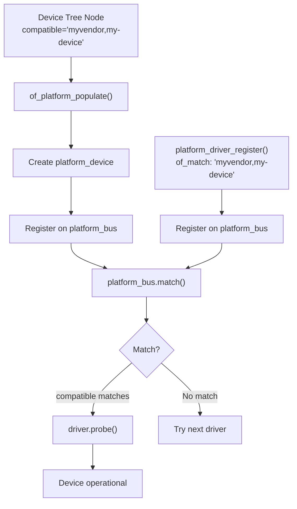
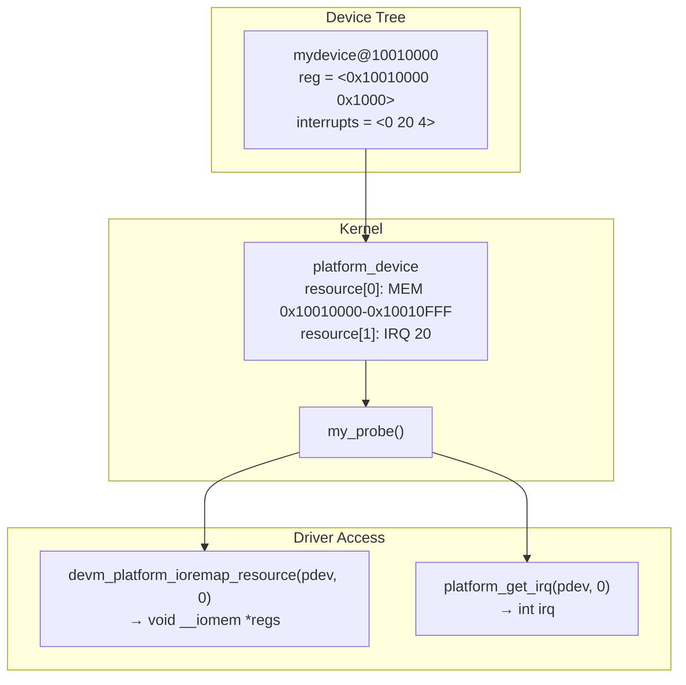
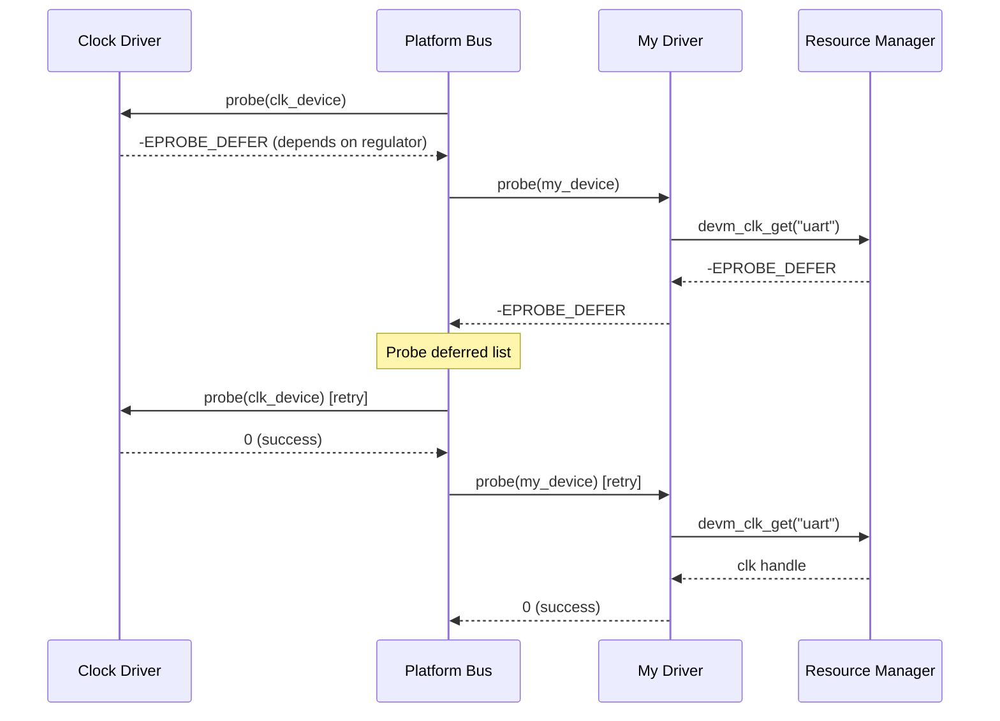

# Chapter 201: Platform Drivers

## 1. Introduction

Platform devices are hardware components that are not discoverable through a standard bus mechanism like PCI or USB. They are typically integrated directly into the SoC (System-on-Chip) or wired to specific addresses on the board — UART controllers, GPIO controllers, I2C/SPI adapters, DMA engines, watchdog timers, and many more. The platform driver framework provides a way to match these devices with their drivers using device tree (DT) bindings, ACPI tables, or static device names.

This chapter covers the platform bus architecture, the `platform_driver` and `platform_device` structures, device tree matching, ACPI matching, resource management, and practical patterns for writing platform drivers for embedded Linux systems.

## 2. Intuition

### 2.1 Why Platform Devices?

On a PCI or USB bus, the hardware itself announces its presence: the kernel scans the bus, reads vendor/device IDs, and automatically matches drivers. But many devices in embedded systems are hardwired at fixed addresses — there's no bus to scan. Instead, the system description comes from:

- **Device Tree (DT)**: A data structure (`.dtb` file) describing the hardware, passed to the kernel by the bootloader.
- **ACPI**: On x86 systems, ACPI tables describe integrated devices.
- **Board files**: Legacy static definitions (deprecated in favor of DT).

The platform bus provides a uniform interface for these non-discoverable devices.

### 2.2 Platform Device vs Platform Driver

- **Platform Device** (`platform_device`): Describes a hardware instance — its address, interrupt, clock, etc. Created from DT, ACPI, or statically.
- **Platform Driver** (`platform_driver`): The software that drives the device. Declares what it supports through matching tables.

The platform bus matches devices and drivers using:
1. **Device Tree compatible strings** (most common on ARM/ARM64)
2. **ACPI IDs** (x86)
3. **Driver name** (legacy, least specific)

### 2.3 Device Tree Basics

A device tree node describes a device:

```dts
serial@10010000 {
    compatible = "vendor,soc-uart";
    reg = <0x10010000 0x1000>;
    interrupts = <0 20 4>;
    clocks = <&clk_uart>;
    clock-frequency = <24000000>;
    status = "okay";
};
```

The `compatible` string is the key that links the device tree node to the driver's `of_match_table`.

## 3. Architecture

### 3.1 Platform Bus Architecture

```
┌─────────────────────────────────────────────────┐
│              Device Tree / ACPI                  │
│         (.dtb / DSDT/SSDT tables)               │
├─────────────────────────────────────────────────┤
│              Platform Core                       │
│  ┌──────────────────┐  ┌─────────────────────┐ │
│  │ OF (DT) Matching │  │ ACPI Matching       │ │
│  └──────────────────┘  └─────────────────────┘ │
│  ┌──────────────────────────────────────────┐  │
│  │ Platform Bus (platform_bus_type)         │  │
│  │ match() → probe() → remove()            │  │
│  └──────────────────────────────────────────┘  │
├─────────────────────────────────────────────────┤
│         Platform Device Drivers                  │
│  (serial, gpio, i2c, spi, watchdog, dma, ...)   │
├─────────────────────────────────────────────────┤
│              Hardware (SoC / Board)              │
└─────────────────────────────────────────────────┘
```

### 3.2 Device Creation from Device Tree

```
Bootloader passes DTB to kernel
    │
    ▼
Kernel parses DTB → device tree nodes
    │
    ▼
For each node with "compatible":
    │
    ▼
of_platform_populate() / of_platform_default_populate()
    │
    ▼
Creates platform_device for each node
    │
    ▼
Registers device on platform_bus
    │
    ▼
platform_bus_type.match() compares:
    - DT compatible strings with driver of_match_table
    - ACPI IDs with driver acpi_match_table
    - Device name with driver name
    │
    ▼
If match found: driver.probe() called
```

### 3.3 Resource Management

Platform devices carry resources (memory regions, interrupts) from the device tree:

```
Device Tree:
    reg = <0x10010000 0x1000>;  →  IORESOURCE_MEM
    interrupts = <0 20 4>;      →  IORESOURCE_IRQ

Platform Device:
    .num_resources = 2
    .resource[0] = { start=0x10010000, end=0x10010FFF, flags=IORESOURCE_MEM }
    .resource[1] = { start=20, end=20, flags=IORESOURCE_IRQ }
```

## 4. Kernel Implementation

### 4.1 struct platform_device

```c
struct platform_device {
    const char *name;                   /* device name */
    int id;                             /* instance ID (-1 for single) */
    bool id_auto;
    struct device dev;                  /* embedded device */
    u32 num_resources;                  /* number of resources */
    struct resource *resource;          /* array of resources */

    const struct platform_device_id *id_entry;
    /* ... */
};
```

### 4.2 struct platform_driver

```c
struct platform_driver {
    int (*probe)(struct platform_device *);
    int (*remove)(struct platform_device *);
    void (*shutdown)(struct platform_device *);
    int (*suspend)(struct platform_device *, pm_message_t state);
    int (*resume)(struct platform_device *);
    struct device_driver driver;        /* embedded driver */
    const struct platform_device_id *id_table;
    bool prevent_deferred_probe;
};
```

### 4.3 Device Tree Matching

```c
struct of_device_id {
    char name[32];
    char type[32];
    char compatible[128];               /* compatible string */
    const void *data;
};

/* In platform_driver: */
static const struct of_device_id my_of_match[] = {
    { .compatible = "vendor,soc-uart" },
    { .compatible = "vendor,soc2-uart" },
    { }  /* terminator */
};
MODULE_DEVICE_TABLE(of, my_of_match);
```

### 4.4 ACPI Matching

```c
struct acpi_device_id {
    __u8 id[ACPI_ID_LEN];
    kernel_ulong_t driver_data;
    __u32 cls;
    __u32 cls_msk;
};

static const struct acpi_device_id my_acpi_match[] = {
    { "VEND0001" },
    { }
};
MODULE_DEVICE_TABLE(acpi, my_acpi_match);
```

### 4.5 Key Platform API Functions

```c
/* Register/unregister platform driver */
int platform_driver_register(struct platform_driver *drv);
void platform_driver_unregister(struct platform_driver *drv);

/* Simplified macro */
#define module_platform_driver(__platform_driver) \
    module_driver(__platform_driver, platform_driver_register, \
                  platform_driver_unregister)

/* Get resources */
struct resource *platform_get_resource(struct platform_device *dev,
                                       unsigned int type, unsigned int num);
int platform_get_irq(struct platform_device *dev, unsigned int num);
int platform_get_irq_optional(struct platform_device *dev, unsigned int num);

/* Device-managed resources */
void __iomem *devm_platform_ioremap_resource(struct platform_device *dev,
                                              unsigned int index);

/* Get DT node */
struct device_node *dev_of_node(struct device *dev);

/* OF property accessors */
int of_property_read_u32(struct device_node *np, const char *propname, u32 *out);
int of_property_read_string(struct device_node *np, const char *propname,
                            const char **out);
int of_property_read_u32_array(struct device_node *np, const char *propname,
                                u32 *out_values, size_t sz);
bool of_property_read_bool(struct device_node *np, const char *propname);

/* Clock API */
struct clk *devm_clk_get(struct device *dev, const char *id);
int clk_prepare_enable(struct clk *clk);
void clk_disable_unprepare(struct clk *clk);
unsigned long clk_get_rate(struct clk *clk);
```

### 4.6 Deferred Probing

When a driver depends on resources that aren't yet available (e.g., a clock driver that hasn't probed yet), it should return `-EPROBE_DEFER`:

```c
static int my_probe(struct platform_device *pdev)
{
    struct clk *clk;

    clk = devm_clk_get(&pdev->dev, "uart");
    if (IS_ERR(clk)) {
        if (PTR_ERR(clk) == -EPROBE_DEFER)
            return -EPROBE_DEFER;  /* Try again later */
        return PTR_ERR(clk);
    }
    /* ... */
}
```

## 5. Data Structures Summary

| Structure | Header | Purpose |
|-----------|--------|---------|
| `platform_device` | `include/linux/platform_device.h` | Platform device |
| `platform_driver` | `include/linux/platform_device.h` | Platform driver |
| `of_device_id` | `include/linux/mod_devicetable.h` | DT match entry |
| `acpi_device_id` | `include/linux/mod_devicetable.h` | ACPI match entry |
| `resource` | `include/linux/ioport.h` | I/O resource |

## 6. C Examples

### 6.1 Simple Platform Driver

```c
#include <linux/module.h>
#include <linux/platform_device.h>
#include <linux/of.h>
#include <linux/io.h>
#include <linux/interrupt.h>
#include <linux/clk.h>

struct my_device {
    void __iomem *regs;
    struct clk *clk;
    int irq;
    struct device *dev;
};

/* Register offsets */
#define MY_REG_CONTROL  0x00
#define MY_REG_STATUS   0x04
#define MY_REG_DATA     0x08

static irqreturn_t my_irq_handler(int irq, void *data)
{
    struct my_device *mydev = data;
    u32 status;

    status = readl(mydev->regs + MY_REG_STATUS);
    if (!(status & BIT(0)))
        return IRQ_NONE;

    /* Acknowledge interrupt */
    writel(status, mydev->regs + MY_REG_STATUS);

    /* Handle interrupt */
    dev_dbg(mydev->dev, "interrupt: status=0x%08x\n", status);

    return IRQ_HANDLED;
}

static int my_probe(struct platform_device *pdev)
{
    struct my_device *mydev;
    struct resource *res;
    int ret;

    mydev = devm_kzalloc(&pdev->dev, sizeof(*mydev), GFP_KERNEL);
    if (!mydev)
        return -ENOMEM;

    mydev->dev = &pdev->dev;
    platform_set_drvdata(pdev, mydev);

    /* Get memory resource */
    mydev->regs = devm_platform_ioremap_resource(pdev, 0);
    if (IS_ERR(mydev->regs))
        return PTR_ERR(mydev->regs);

    /* Get IRQ */
    mydev->irq = platform_get_irq(pdev, 0);
    if (mydev->irq < 0)
        return mydev->irq;

    /* Get clock */
    mydev->clk = devm_clk_get(&pdev->dev, NULL);
    if (IS_ERR(mydev->clk)) {
        if (PTR_ERR(mydev->clk) == -EPROBE_DEFER)
            return -EPROBE_DEFER;
        mydev->clk = NULL;  /* Clock is optional */
    }

    /* Enable clock */
    if (mydev->clk) {
        ret = clk_prepare_enable(mydev->clk);
        if (ret)
            return ret;
    }

    /* Request IRQ */
    ret = devm_request_irq(&pdev->dev, mydev->irq, my_irq_handler,
                           0, dev_name(&pdev->dev), mydev);
    if (ret) {
        dev_err(&pdev->dev, "failed to request IRQ %d\n", mydev->irq);
        goto err_clk;
    }

    /* Initialize hardware */
    writel(0x01, mydev->regs + MY_REG_CONTROL);

    dev_info(&pdev->dev, "probed at %pR, IRQ %d\n",
             platform_get_resource(pdev, IORESOURCE_MEM, 0),
             mydev->irq);
    return 0;

err_clk:
    if (mydev->clk)
        clk_disable_unprepare(mydev->clk);
    return ret;
}

static int my_remove(struct platform_device *pdev)
{
    struct my_device *mydev = platform_get_drvdata(pdev);

    /* Disable hardware */
    writel(0, mydev->regs + MY_REG_CONTROL);

    if (mydev->clk)
        clk_disable_unprepare(mydev->clk);

    dev_info(&pdev->dev, "removed\n");
    return 0;
}

/* Device Tree match table */
static const struct of_device_id my_of_match[] = {
    { .compatible = "myvendor,my-device" },
    { .compatible = "myvendor,my-device-v2" },
    { }
};
MODULE_DEVICE_TABLE(of, my_of_match);

/* ACPI match table */
static const struct acpi_device_id my_acpi_match[] = {
    { "MYDEV0001" },
    { }
};
MODULE_DEVICE_TABLE(acpi, my_acpi_match);

static struct platform_driver my_driver = {
    .probe  = my_probe,
    .remove = my_remove,
    .driver = {
        .name = "my_device",
        .of_match_table = my_of_match,
        .acpi_match_table = my_acpi_match,
    },
};

module_platform_driver(my_driver);

MODULE_LICENSE("GPL");
MODULE_DESCRIPTION("Example platform driver");
```

### 6.2 Reading Device Tree Properties

```c
static int my_parse_dt(struct my_device *mydev)
{
    struct device_node *np = mydev->dev->of_node;
    u32 reg_width;
    const char *mode;
    u32 thresholds[3];
    bool use_dma;

    /* Simple integer property */
    if (of_property_read_u32(np, "reg-width", &reg_width)) {
        dev_err(mydev->dev, "missing reg-width property\n");
        return -EINVAL;
    }
    mydev->reg_width = reg_width;

    /* String property */
    if (of_property_read_string(np, "operating-mode", &mode) == 0) {
        if (strcmp(mode, "high-speed") == 0)
            mydev->mode = MODE_HIGH_SPEED;
        else
            mydev->mode = MODE_NORMAL;
    }

    /* Array property */
    if (of_property_read_u32_array(np, "thresholds", thresholds, 3) == 0) {
        mydev->low_thresh = thresholds[0];
        mydev->mid_thresh = thresholds[1];
        mydev->high_thresh = thresholds[2];
    }

    /* Boolean property */
    use_dma = of_property_read_bool(np, "use-dma");
    mydev->use_dma = use_dma;

    /* Optional property with default */
    if (of_property_read_u32(np, "fifo-depth", &mydev->fifo_depth))
        mydev->fifo_depth = 64;  /* default */

    return 0;
}
```

### 6.3 Device Tree Binding Example

```dts
/* Example device tree node for our driver */
/ {
    soc {
        my_device@10010000 {
            compatible = "myvendor,my-device";
            reg = <0x10010000 0x1000>;
            interrupts = <GIC_SPI 20 IRQ_TYPE_LEVEL_HIGH>;
            clocks = <&clocks CLK_UART0>;
            clock-names = "uart";
            reg-width = <32>;
            operating-mode = "high-speed";
            thresholds = <10 50 90>;
            fifo-depth = <128>;
            use-dma;
            status = "okay";
        };
    };
};
```

### 6.4 PM Support

```c
static int my_suspend(struct device *dev)
{
    struct my_device *mydev = dev_get_drvdata(dev);

    /* Save device state */
    mydev->saved_control = readl(mydev->regs + MY_REG_CONTROL);

    /* Disable device */
    writel(0, mydev->regs + MY_REG_CONTROL);

    if (mydev->clk)
        clk_disable_unprepare(mydev->clk);

    return 0;
}

static int my_resume(struct device *dev)
{
    struct my_device *mydev = dev_get_drvdata(dev);
    int ret;

    if (mydev->clk) {
        ret = clk_prepare_enable(mydev->clk);
        if (ret)
            return ret;
    }

    /* Restore device state */
    writel(mydev->saved_control, mydev->regs + MY_REG_CONTROL);

    return 0;
}

static DEFINE_SIMPLE_DEV_PM_OPS(my_pm_ops, my_suspend, my_resume);

static struct platform_driver my_driver = {
    /* ... */
    .driver = {
        .name = "my_device",
        .pm = &my_pm_ops,
        .of_match_table = my_of_match,
    },
};
```

## 7. Diagrams

### 7.1 Platform Driver Matching



### 7.2 Resource Flow from DT to Driver



### 7.3 Deferred Probing Flow



## 8. Common Pitfalls

### 8.1 Using platform_get_resource for IRQs

```c
/* WRONG: using platform_get_resource for IRQs */
res = platform_get_resource(pdev, IORESOURCE_IRQ, 0);
irq = res->start;  /* May not work with DT */

/* CORRECT: use platform_get_irq */
irq = platform_get_irq(pdev, 0);
```

### 8.2 Not Handling -EPROBE_DEFER

```c
/* WRONG: treating deferred probe as fatal */
clk = devm_clk_get(&pdev->dev, "uart");
if (IS_ERR(clk))
    return PTR_ERR(clk);  /* -EPROBE_DEFER treated as error */

/* CORRECT: handle deferred probe */
clk = devm_clk_get(&pdev->dev, "uart");
if (IS_ERR(clk)) {
    if (PTR_ERR(clk) == -EPROBE_DEFER)
        return -EPROBE_DEFER;
    /* Other errors: clock is optional */
    clk = NULL;
}
```

### 8.3 Hardcoding Addresses Instead of Using DT

```c
/* WRONG: hardcoded addresses */
regs = ioremap(0x10010000, 0x1000);  /* Won't work on different boards */

/* CORRECT: get from device tree/resources */
regs = devm_platform_ioremap_resource(pdev, 0);
```

### 8.4 Missing MODULE_DEVICE_TABLE

```c
/* WRONG: no MODULE_DEVICE_TABLE */
static const struct of_device_id my_of_match[] = {
    { .compatible = "myvendor,my-device" },
    { }
};
/* Module won't auto-load for DT devices! */

/* CORRECT: include MODULE_DEVICE_TABLE */
MODULE_DEVICE_TABLE(of, my_of_match);
```

### 8.5 Not Using devm_ Variants

```c
/* WRONG: manual resource management */
regs = ioremap(res->start, resource_size(res));
/* Must iounmap in remove() and every error path */

/* CORRECT: device-managed */
regs = devm_platform_ioremap_resource(pdev, 0);
/* Automatically unmapped on device removal */
```

## 9. Best Practices

### 9.1 Always Use devm_ for Resources

```c
devm_kzalloc()           /* Memory allocation */
devm_platform_ioremap_resource()  /* Register mapping */
devm_request_irq()       /* Interrupt request */
devm_clk_get()           /* Clock */
devm_regulator_get()     /* Power regulator */
devm_reset_control_get() /* Reset controller */
devm_gpio_request()      /* GPIO */
devm_pwm_get()           /* PWM */
devm_iio_device_alloc()  /* IIO device */
```

### 9.2 Validate DT Properties

```c
/* Always check for required properties */
if (!of_find_property(np, "reg-width", NULL)) {
    dev_err(dev, "missing required property 'reg-width'\n");
    return -EINVAL;
}
```

### 9.3 Use Proper Driver Name

```c
/* Name should match the device tree compatible string's first component */
static struct platform_driver my_driver = {
    .driver = {
        .name = "my_device",  /* Should be descriptive */
    },
};
```

### 9.4 Support Device Tree Overlays for Testing

```bash
# Load a DT overlay for testing
dtbo -r test-overlay.dtbo
# Verify device appears
ls /sys/bus/platform/devices/
```

### 9.5 Document DT Bindings

```yaml
# Documentation/devicetree/bindings/myvendor,my-device.yaml
properties:
  compatible:
    const: myvendor,my-device
  reg:
    minItems: 1
    maxItems: 1
  interrupts:
    minItems: 1
  clocks:
    minItems: 1
    maxItems: 1
required:
  - compatible
  - reg
```

## 10. Exercises

### Exercise 1: Platform Driver Skeleton

Write a complete platform driver that reads its register base and interrupt from the device tree. Create a minimal DT overlay to test it.

### Exercise 2: DT Property Parsing

Extend the driver to read at least five different DT properties (integer, string, boolean, array, optional). Validate required properties and log parsed values.

### Exercise 3: Clock and Reset Support

Add clock and reset control support to the driver. Use `devm_clk_get()` and `devm_reset_control_get()`. Handle `-EPROBE_DEFER` gracefully.

### Exercise 4: PM Suspend/Resume

Implement `suspend()` and `resume()` callbacks. Save and restore device registers. Test with `echo mem > /sys/power/state`.

### Exercise 5: Platform Driver with Multiple Instances

Create a device tree with two instances of the same device. Verify that the driver probes twice with different resources for each instance.

## 11. References

### Kernel Source
- `drivers/base/platform.c` — Platform bus implementation
- `include/linux/platform_device.h` — Platform API
- `drivers/of/platform.c` — OF platform device creation
- `include/linux/of.h` — Device tree API
- `Documentation/driver-api/driver-model/devres.rst` — Device-managed resources
- `Documentation/devicetree/` — Device tree documentation

### Books
- *Linux Device Tree Usage* — various online resources
- *Mastering Embedded Linux Programming* — Chris Simmonds

### Online
- https://www.kernel.org/doc/html/latest/driver-api/
- https://www.devicetree.org/
- https://elinux.org/Device_Tree_Reference

## 12. Deep Dive: Device Tree and Platform Driver Concepts

### 12.1 Device Tree Compiler and Overlays

The device tree source (`.dts`) files are compiled into binary blobs (`.dtb`) using the Device Tree Compiler (DTC):

```bash
# Compile a device tree
dtc -I dts -O dtb -o myboard.dtb myboard.dts

# Decompile a device tree
dtc -I dtb -O dts myboard.dtb

# Device tree overlays (for runtime modification)
dtc -@ -I dts -O dtb -o myoverlay.dtbo myoverlay.dts
```

**Device Tree Overlays** allow adding or modifying device tree nodes at runtime without recompiling the entire DTB. This is particularly useful for testing drivers:

```dts
/* myoverlay.dts */
/dts-v1/;
/plugin/;

/ {
    fragment@0 {
        target = <&soc>;
        __overlay__ {
            my_device@10010000 {
                compatible = "myvendor,my-device";
                reg = <0x10010000 0x1000>;
                interrupts = <0 20 4>;
                clocks = <&clocks CLK_UART0>;
                status = "okay";
            };
        };
    };
};
```

Apply with:
```bash
dtoverlay myoverlay.dtbo
```

### 12.2 Device Tree Binding Documentation

Every device tree binding should be documented in `Documentation/devicetree/bindings/`. Modern bindings use YAML schema:

```yaml
# Documentation/devicetree/bindings/myvendor,my-device.yaml
%YAML 1.2
---
$id: http://devicetree.org/schemas/myvendor,my-device.yaml#
$schema: http://devicetree.org/meta-schemas/core.yaml#

title: My Vendor My Device

maintainers:
  - Your Name <your@email.com>

properties:
  compatible:
    const: myvendor,my-device

  reg:
    minItems: 1
    maxItems: 1
    description: Register base address and size

  interrupts:
    minItems: 1
    maxItems: 1
    description: Device interrupt

  clocks:
    minItems: 1
    maxItems: 1
    description: Input clock

  clock-names:
    items:
      - const: uart

  myvendor,fifo-depth:
    $ref: /schemas/types.yaml#/definitions/uint32
    minimum: 16
    maximum: 256
    default: 64
    description: FIFO depth in entries

  myvendor,use-dma:
    type: boolean
    description: Enable DMA support

required:
  - compatible
  - reg
  - interrupts
  - clocks

additionalProperties: false
```

### 12.3 OF (Open Firmware) API Deep Dive

The OF API provides a rich set of functions for reading device tree properties:

**Reading Properties**:
```c
/* Simple integer */
u32 val;
of_property_read_u32(np, "fifo-depth", &val);

/* Array of integers */
u32 array[4];
of_property_read_u32_array(np, "reg-offsets", array, 4);

/* String */
const char *str;
of_property_read_string(np, "label", &str);

/* String array */
const char *strings[3];
of_property_count_strings(np, "clock-names");
of_property_read_string_index(np, "clock-names", 0, &strings[0]);

/* Boolean (present or not) */
bool has_dma = of_property_read_bool(np, "use-dma");

/* Variable-length array */
int count = of_property_count_u32_elems(np, "thresholds");
```

**Getting References**:
```c
/* Get phandle reference */
struct device_node *clk_node = of_parse_phandle(np, "clocks", 0);

/* Get clock from DT */
struct clk *clk = of_clk_get(np, 0);

/* Get GPIO from DT */
int gpio = of_get_named_gpio(np, "reset-gpios", 0);

/* Get IRQ from DT */
int irq = of_irq_get(np, 0);
```

### 12.4 ACPI Matching for x86 Platforms

On x86 systems, ACPI replaces device tree for device enumeration. Platform drivers can support both:

```c
static const struct acpi_device_id my_acpi_ids[] = {
    { "MYDEV0001", 0 },    /* ACPI HID for version 1 */
    { "MYDEV0002", 0 },    /* ACPI HID for version 2 */
    { }
};
MODULE_DEVICE_TABLE(acpi, my_acpi_ids);
```

ACPI devices expose `_HID` (Hardware ID), `_CID` (Compatible ID), and `_UID` (Unique ID). The ACPI subsystem matches drivers using these IDs.

### 12.5 Platform Driver PM Domains

Power management domains group devices that share power resources:

```c
/* Simple PM domain operations */
static int my_pd_power_on(struct generic_pm_domain *pd)
{
    /* Enable power to the domain */
    return regulator_enable(pd_regulator);
}

static int my_pd_power_off(struct generic_pm_domain *pd)
{
    /* Disable power to the domain */
    return regulator_disable(pd_regulator);
}
```

Devices in a domain are automatically powered on before probe and powered off after remove.

### 12.6 Platform Driver with Multiple Resources

Real devices often have multiple resource types:

```dts
my_device@10010000 {
    compatible = "myvendor,my-device";
    reg = <0x10010000 0x1000>,  /* registers */
          <0x10020000 0x4000>;  /* SRAM */
    reg-names = "regs", "sram";
    interrupts = <GIC_SPI 20 IRQ_TYPE_LEVEL_HIGH>,
                 <GIC_SPI 21 IRQ_TYPE_EDGE_RISING>;
    interrupt-names = "rx", "tx";
    clocks = <&clks CLK_UART>, <&clks CLK_DMA>;
    clock-names = "uart", "dma";
    resets = <&rstc RST_UART>;
    power-domains = <&pd_uart>;
    dmas = <&dma0 0>, <&dma0 1>;
    dma-names = "rx", "tx";
};
```

In the driver:
```c
/* Get named resources */
struct resource *res_regs = platform_get_resource_byname(pdev, IORESOURCE_MEM, "regs");
struct resource *res_sram = platform_get_resource_byname(pdev, IORESOURCE_MEM, "sram");
int irq_rx = platform_get_irq_byname(pdev, "rx");
int irq_tx = platform_get_irq_byname(pdev, "tx");
struct clk *clk_uart = devm_clk_get(&pdev->dev, "uart");
struct clk *clk_dma = devm_clk_get(&pdev->dev, "dma");
struct reset_control *rst = devm_reset_control_get(&pdev->dev, NULL);
```

### 12.7 Common Device Tree Patterns

**Clock Gating**:
```dts
clocks = <&clks CLK_PERIPHERAL>;
clock-names = "peripheral";
```

**Reset Control**:
```dts
resets = <&rstc RST_PERIPHERAL>;
reset-names = "peripheral";
```

**GPIO for Control Lines**:
```dts
reset-gpios = <&gpio1 5 GPIO_ACTIVE_LOW>;
enable-gpios = <&gpio2 10 GPIO_ACTIVE_HIGH>;
```

**Regulator for Power**:
```dts
vdd-supply = <&reg_vdd_3v3>;
vddio-supply = <&reg_vddio_1v8>;
```

**Pin Control**:
```dts
pinctrl-names = "default", "sleep";
pinctrl-0 = <&uart_pins_default>;
pinctrl-1 = <&uart_pins_sleep>;
```

**Multiple Instances**:
```dts
uart0: serial@10010000 {
    compatible = "myvendor,my-uart";
    reg = <0x10010000 0x1000>;
    interrupts = <0 20 4>;
    clocks = <&clks CLK_UART0>;
};

uart1: serial@10011000 {
    compatible = "myvendor,my-uart";
    reg = <0x10011000 0x1000>;
    interrupts = <0 21 4>;
    clocks = <&clks CLK_UART1>;
};
```

The driver's `probe()` function is called once for each matching device, with different resources.
