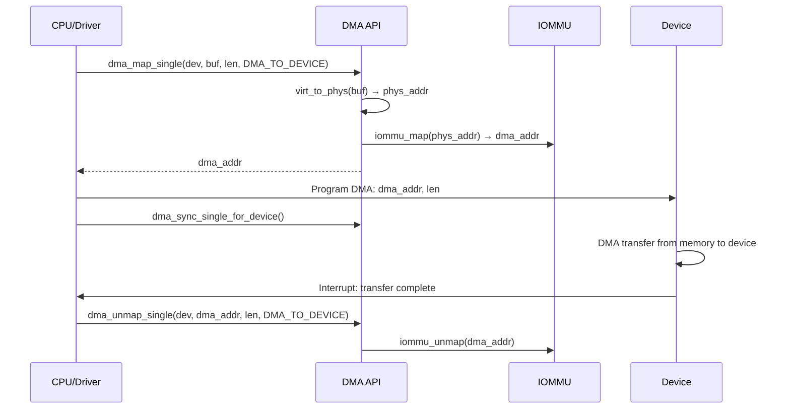
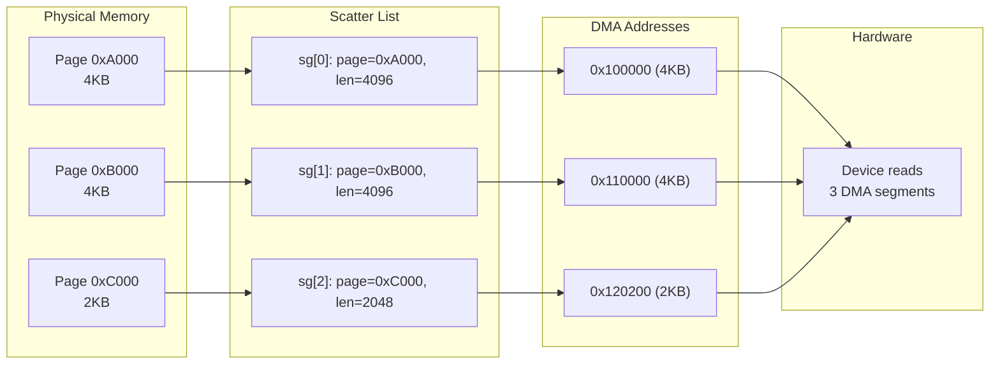

# Chapter 202: DMA in Drivers

## 1. Introduction

Direct Memory Access (DMA) is a hardware mechanism that allows peripheral devices to transfer data to and from system memory without CPU intervention. DMA is essential for high-performance I/O — without it, every byte transferred would require the CPU to read from or write to the device, severely limiting throughput. Modern devices (network cards, storage controllers, GPUs, accelerators) all rely on DMA for data transfer.

This chapter covers the Linux DMA API in depth: streaming DMA for one-shot transfers, coherent DMA for persistent shared buffers, DMA pools for small allocations, scatter-gather DMA for non-contiguous buffers, and the IOMMU (I/O Memory Management Unit) and SVA (Shared Virtual Addressing) for advanced DMA use cases.

## 2. Intuition

### 2.1 Why DMA?

Consider a network card receiving a 1500-byte packet. Without DMA:
1. NIC puts data in its internal buffer
2. CPU reads each byte from NIC I/O port → 1500 port reads
3. CPU writes each byte to memory → 1500 memory writes
4. Total: 3000 bus transactions, CPU fully occupied

With DMA:
1. CPU programs DMA engine: "transfer 1500 bytes from NIC buffer to memory address X"
2. DMA engine performs the transfer directly
3. DMA engine signals completion via interrupt
4. CPU is free to do other work during the transfer

### 2.2 Physical vs Virtual vs DMA Addresses

On modern systems, there are three address spaces:

- **Virtual address**: What the kernel and user space use (e.g., 0xffff880012345678)
- **Physical address**: What the memory controller uses (e.g., 0x0000000012345678)
- **Bus/DMA address**: What devices use (may differ from physical due to IOMMU, swiotlb, etc.)

The DMA API handles the translation between these spaces.

### 2.3 Streaming vs Coherent DMA

- **Streaming DMA**: For one-shot or occasional transfers. Data direction is explicit. Requires explicit synchronization (cache management). Most common pattern.
- **Coherent DMA**: For persistent shared buffers. Memory is uncached or cache-coherent. No explicit synchronization needed. Higher overhead per access. Used for descriptor rings and control structures.

## 3. Architecture

### 3.3 DMA API Layer

```
┌─────────────────────────────────────────────────┐
│              Device Driver                       │
│         (dma_map_single, dma_alloc_coherent)     │
├─────────────────────────────────────────────────┤
│              DMA Mapping API                     │
│    (include/linux/dma-mapping.h)                 │
│  ┌─────────────┐  ┌────────────────────────┐   │
│  │ dma_ops     │  │ IOMMU API              │   │
│  │ (per-bus)   │  │ (iommu_map/unmap)      │   │
│  └─────────────┘  └────────────────────────┘   │
├─────────────────────────────────────────────────┤
│         swiotlb (bounce buffers for highmem)    │
├─────────────────────────────────────────────────┤
│         Platform-specific DMA                   │
│  (arch/arm, arch/x86, arch/arm64)              │
├─────────────────────────────────────────────────┤
│         Hardware                                │
│  (DMA engine, IOMMU, device DMA controller)     │
└─────────────────────────────────────────────────┘
```

### 3.2 DMA Address Translation

```
Driver virtual addr: 0xffff880012345678
         │
         ▼
DMA API: virt_to_phys() → 0x0000000012345678
         │
         ▼
IOMMU (if present): iommu_map() → 0x0000000012345678 (or different IOVA)
         │
         ▼
swiotlb (if needed): bounce buffer → copy to/from low memory
         │
         ▼
DMA address given to device: 0x0000000012345678 (or IOVA)
```

### 3.3 Scatter-Gather DMA

For non-contiguous memory (common with network buffers):

```
Scatter List:
  [0] page=0xA000, offset=0,   len=4096  → DMA addr 0x100000
  [1] page=0xB000, offset=0,   len=4096  → DMA addr 0x110000
  [2] page=0xC000, offset=512, len=2048  → DMA addr 0x120200

Device receives scatter list:
  segment 0: DMA read from 0x100000, length 4096
  segment 1: DMA read from 0x110000, length 4096
  segment 2: DMA read from 0x120200, length 2048
```

## 4. Kernel Implementation

### 4.1 Streaming DMA API

```c
/* Map a single buffer for DMA */
dma_addr_t dma_map_single(struct device *dev, void *ptr, size_t size,
                           enum dma_data_direction dir);

/* Unmap */
void dma_unmap_single(struct device *dev, dma_addr_t addr, size_t size,
                       enum dma_data_direction dir);

/* Map a page */
dma_addr_t dma_map_page(struct device *dev, struct page *page,
                         size_t offset, size_t size,
                         enum dma_data_direction dir);

void dma_unmap_page(struct device *dev, dma_addr_t addr, size_t size,
                     enum dma_data_direction dir);

/* Direction values */
enum dma_data_direction {
    DMA_BIDIRECTIONAL = 0,
    DMA_TO_DEVICE = 1,      /* CPU → Device (TX/Write) */
    DMA_FROM_DEVICE = 2,    /* Device → CPU (RX/Read) */
    DMA_NONE = 3,
};

/* Check for mapping errors */
static inline bool dma_mapping_error(struct device *dev, dma_addr_t dma_addr)
{
    if (dma_addr == DMA_MAPPING_ERROR)
        return true;
    return false;
}

/* Synchronize for CPU access (after DMA_FROM_DEVICE) */
void dma_sync_single_for_cpu(struct device *dev, dma_addr_t addr,
                              size_t size, enum dma_data_direction dir);

/* Synchronize for device access (before DMA_TO_DEVICE) */
void dma_sync_single_for_device(struct device *dev, dma_addr_t addr,
                                 size_t size, enum dma_data_direction dir);
```

### 4.2 Coherent DMA API

```c
/* Allocate coherent (consistent) DMA memory */
void *dma_alloc_coherent(struct device *dev, size_t size,
                          dma_addr_t *dma_handle, gfp_t gfp);

/* Free coherent DMA memory */
void dma_free_coherent(struct device *dev, size_t size,
                        void *vaddr, dma_addr_t dma_handle);

/* Device-managed version */
void *dmam_alloc_coherent(struct device *dev, size_t size,
                           dma_addr_t *dma_handle, gfp_t gfp);
```

### 4.3 DMA Pool API

For many small DMA allocations (e.g., USB control messages):

```c
/* Create a DMA pool */
struct dma_pool *dma_pool_create(const char *name, struct device *dev,
                                  size_t size, size_t align,
                                  size_t boundary);

/* Destroy a DMA pool */
void dma_pool_destroy(struct dma_pool *pool);

/* Allocate from pool */
void *dma_pool_alloc(struct dma_pool *pool, gfp_t mem_flags,
                      dma_addr_t *handle);

/* Free to pool */
void dma_pool_free(struct dma_pool *pool, void *vaddr, dma_addr_t handle);
```

### 4.4 Scatter-Gather DMA

```c
/* Map a scatter-gather list */
int dma_map_sg(struct device *dev, struct scatterlist *sg,
               int nents, enum dma_data_direction dir);

/* Unmap scatter-gather list */
void dma_unmap_sg(struct device *dev, struct scatterlist *sg,
                   int nents, enum dma_data_direction dir);

/* Iterate over mapped scatter-gather entries */
#define for_each_sg(sglist, sg, nr, __i) \
    for (__i = 0, sg = (sglist); __i < (nr); __i++, sg = sg_next(sg))

/* Get DMA address and length for a scatter-gather entry */
dma_addr_t sg_dma_address(struct scatterlist *sg);
unsigned int sg_dma_len(struct scatterlist *sg);

/* Initialize scatter-gather list */
void sg_init_table(struct scatterlist *sg, unsigned int nents);
void sg_set_page(struct scatterlist *sg, struct page *page,
                 unsigned int len, unsigned int offset);
void sg_set_buf(struct scatterlist *sg, const void *buf, unsigned int buflen);

/* Synchronize scatter-gather for CPU/device */
void dma_sync_sg_for_cpu(struct device *dev, struct scatterlist *sg,
                          int nents, enum dma_data_direction dir);
void dma_sync_sg_for_device(struct device *dev, struct scatterlist *sg,
                             int nents, enum dma_data_direction dir);
```

### 4.5 DMA Mask

```c
/* Set DMA addressing capability */
int dma_set_mask(struct device *dev, u64 mask);
int dma_set_coherent_mask(struct device *dev, u64 mask);

/* Convenience: try 64-bit, fall back to 32-bit */
int dma_set_mask_and_coherent(struct device *dev, u64 mask);

/* Common masks */
#define DMA_BIT_MASK(n)  (((n) == 64) ? ~0ULL : ((1ULL<<(n))-1))
#define DMA_32BIT_MASK   DMA_BIT_MASK(32)
#define DMA_64BIT_MASK   DMA_BIT_MASK(64)

/* Check if DMA address is valid */
static inline bool dma_addressing_limited(struct device *dev);
```

### 4.6 IOMMU API

```c
/* Get IOMMU domain for a device */
struct iommu_domain *iommu_domain_alloc(struct bus_type *bus);

/* Map IOVA to physical address */
int iommu_map(struct iommu_domain *domain, unsigned long iova,
              phys_addr_t paddr, size_t size, int prot);

/* Unmap */
size_t iommu_unmap(struct iommu_domain *domain, unsigned long iova,
                    size_t size);

/* Attach device to domain */
int iommu_attach_device(struct iommu_domain *domain, struct device *dev);
void iommu_detach_device(struct iommu_domain *domain, struct device *dev);

/* SVA (Shared Virtual Addressing) — shares process page tables with device */
int iommu_sva_bind_device(struct device *dev, struct mm_struct *mm,
                           unsigned int flags);
void iommu_sva_unbind_device(struct iommu_domain *domain);

/* PASID (Process Address Space ID) */
int iommu_alloc_pasid(struct device *dev, int min, int max);
```

## 5. Data Structures Summary

| Structure | Header | Purpose |
|-----------|--------|---------|
| `dma_map_ops` | `include/linux/dma-map-ops.h` | DMA operations per bus |
| `scatterlist` | `include/linux/scatterlist.h` | Scatter-gather entry |
| `sg_table` | `include/linux/scatterlist.h` | SG table |
| `dma_pool` | `include/linux/dmapool.h` | DMA memory pool |
| `iommu_domain` | `include/linux/iommu.h` | IOMMU domain |
| `iommu_group` | `include/linux/iommu.h` | IOMMU group |

## 6. C Examples

### 6.1 Streaming DMA — Network RX

```c
static int my_net_rx_packet(struct my_net_priv *priv)
{
    struct sk_buff *skb;
    struct my_rx_desc *desc;
    dma_addr_t dma;
    unsigned int len;

    desc = &priv->rx_ring[priv->rx_tail];

    if (!(desc->flags & DESC_F_DONE))
        return 0;  /* No packet */

    len = desc->length;

    /* Allocate new skb for this descriptor */
    skb = netdev_alloc_skb(priv->dev, len + NET_IP_ALIGN);
    if (!skb) {
        priv->rx_dropped++;
        goto refill;
    }

    skb_reserve(skb, NET_IP_ALIGN);

    /* Sync the DMA buffer for CPU access */
    dma = le64_to_cpu(desc->addr);
    dma_sync_single_for_cpu(priv->dev, dma, len, DMA_FROM_DEVICE);

    /* Copy data from DMA buffer to skb */
    memcpy(skb_put(skb, len), phys_to_virt(dma), len);

    /* Sync back for device */
    dma_sync_single_for_device(priv->dev, dma, len, DMA_FROM_DEVICE);

    /* Pass to network stack */
    skb->protocol = eth_type_trans(skb, priv->dev);
    skb->ip_summed = CHECKSUM_UNNECESSARY;
    netif_receive_skb(skb);

    priv->rx_packets++;
    priv->rx_bytes += len;

refill:
    /* Refill descriptor with new DMA buffer */
    refill_rx_descriptor(priv, priv->rx_tail);
    priv->rx_tail = (priv->rx_tail + 1) % RX_RING_SIZE;

    return 1;
}
```

### 6.2 Coherent DMA — Descriptor Ring

```c
struct my_ring {
    struct my_desc *desc;      /* DMA-coherent descriptor ring */
    dma_addr_t dma;            /* DMA address of ring */
    unsigned int size;
};

static int my_alloc_ring(struct device *dev, struct my_ring *ring,
                          unsigned int num_descs)
{
    size_t size = num_descs * sizeof(struct my_desc);

    /* Allocate DMA-coherent memory for descriptor ring */
    ring->desc = dma_alloc_coherent(dev, size, &ring->dma, GFP_KERNEL);
    if (!ring->desc)
        return -ENOMEM;

    ring->size = num_descs;
    memset(ring->desc, 0, size);

    return 0;
}

static void my_free_ring(struct device *dev, struct my_ring *ring)
{
    size_t size = ring->size * sizeof(struct my_desc);

    dma_free_coherent(dev, size, ring->desc, ring->dma);
    ring->desc = NULL;
}
```

### 6.3 Scatter-Gather DMA

```c
#include <linux/scatterlist.h>

static int my_dma_sg_transfer(struct my_device *mydev, struct page **pages,
                               int num_pages, size_t total_len,
                               enum dma_data_direction dir)
{
    struct scatterlist *sg;
    int nents, i;
    size_t remaining = total_len;

    /* Allocate scatter-gather table */
    sg = kmalloc_array(num_pages, sizeof(*sg), GFP_KERNEL);
    if (!sg)
        return -ENOMEM;

    sg_init_table(sg, num_pages);

    /* Fill scatter-gather list */
    for (i = 0; i < num_pages && remaining > 0; i++) {
        size_t len = min_t(size_t, remaining, PAGE_SIZE);

        sg_set_page(&sg[i], pages[i], len, 0);
        remaining -= len;
    }

    /* Map for DMA */
    nents = dma_map_sg(mydev->dev, sg, num_pages, dir);
    if (nents == 0) {
        kfree(sg);
        return -EIO;
    }

    /* Program hardware with scatter-gather entries */
    for_each_sg(sg, sg, nents, i) {
        dma_addr_t addr = sg_dma_address(sg);
        unsigned int len = sg_dma_len(sg);

        /* Write to hardware descriptor */
        writel(lower_32_bits(addr), mydev->regs + DESC_ADDR_LO(i));
        writel(upper_32_bits(addr), mydev->regs + DESC_ADDR_HI(i));
        writel(len, mydev->regs + DESC_LEN(i));
    }

    /* Kick hardware */
    writel(nents, mydev->regs + DESC_COUNT);
    writel(1, mydev->regs + DMA_START);

    /* Wait for completion (simplified) */
    wait_for_completion(&mydev->dma_done);

    /* Unmap */
    dma_unmap_sg(mydev->dev, sg, num_pages, dir);
    kfree(sg);

    return 0;
}
```

### 6.4 DMA Pool for Small Allocations

```c
struct my_device {
    struct dma_pool *pool;
    /* ... */
};

static int my_init_dma_pool(struct my_device *mydev)
{
    /* Create pool: 64-byte blocks, 64-byte aligned, no boundary crossing */
    mydev->pool = dma_pool_create("my_pool", mydev->dev,
                                   64, 64, 0);
    if (!mydev->pool)
        return -ENOMEM;

    return 0;
}

static void my_cleanup_dma_pool(struct my_device *mydev)
{
    dma_pool_destroy(mydev->pool);
}

static int my_send_command(struct my_device *mydev, void *cmd, size_t len)
{
    void *buf;
    dma_addr_t dma;

    /* Allocate from pool */
    buf = dma_pool_alloc(mydev->pool, GFP_KERNEL, &dma);
    if (!buf)
        return -ENOMEM;

    /* Fill command */
    memcpy(buf, cmd, len);

    /* Send to hardware (DMA address) */
    writel(lower_32_bits(dma), mydev->regs + CMD_ADDR);
    writel(len, mydev->regs + CMD_LEN);
    writel(1, mydev->regs + CMD_START);

    /* Wait for completion */
    wait_for_completion(&mydev->cmd_done);

    /* Free back to pool */
    dma_pool_free(mydev->pool, buf, dma);

    return 0;
}
```

### 6.5 Using DMA with sk_buff (Network Driver)

```c
static netdev_tx_t my_start_xmit(struct sk_buff *skb,
                                  struct net_device *dev)
{
    struct my_net_priv *priv = netdev_priv(dev);
    struct my_tx_desc *desc;
    dma_addr_t dma;
    unsigned int entry;

    /* Map skb data for DMA */
    dma = dma_map_single(&priv->pdev->dev, skb->data, skb->len,
                          DMA_TO_DEVICE);
    if (dma_mapping_error(&priv->pdev->dev, dma)) {
        dev_kfree_skb_any(skb);
        return NETDEV_TX_OK;
    }

    entry = priv->tx_head;
    desc = &priv->tx_ring[entry];

    /* Fill descriptor */
    desc->addr = cpu_to_le64(dma);
    desc->len = cpu_to_le32(skb->len);
    desc->flags = cpu_to_le32(TX_DESC_F_EOP);

    /* Store skb for later cleanup */
    priv->tx_skbs[entry] = skb;
    priv->tx_dmas[entry] = dma;

    priv->tx_head = (entry + 1) % TX_RING_SIZE;

    /* Kick hardware */
    writel(priv->tx_head, priv->regs + TX_TAIL);

    return NETDEV_TX_OK;
}

/* TX completion (called from interrupt) */
static void my_tx_complete(struct my_net_priv *priv)
{
    while (priv->tx_tail != priv->tx_head) {
        unsigned int entry = priv->tx_tail;
        struct my_tx_desc *desc = &priv->tx_ring[entry];

        if (!(le32_to_cpu(desc->flags) & TX_DESC_F_DONE))
            break;

        /* Unmap DMA */
        dma_unmap_single(&priv->pdev->dev,
                         priv->tx_dmas[entry],
                         le32_to_cpu(desc->len),
                         DMA_TO_DEVICE);

        /* Free skb */
        dev_consume_skb_any(priv->tx_skbs[entry]);
        priv->tx_skbs[entry] = NULL;

        priv->tx_tail = (entry + 1) % TX_RING_SIZE;
    }
}
```

## 7. Diagrams

### 7.1 Streaming DMA Flow



### 7.2 Coherent vs Streaming DMA

```mermaid
graph TD
    subgraph Coherent["Coherent DMA"]
        CA["dma_alloc_coherent()"] --> CB["Returns: vaddr + dma_addr"]
        CB --> CC["CPU writes to vaddr"]
        CC --> CD["Device reads from dma_addr"]
        CD --> CE["No sync needed — always coherent"]
    end

    subgraph Streaming["Streaming DMA"]
        SA["Normal alloc (kmalloc, alloc_page)"] --> SB["dma_map_single() → dma_addr"]
        SB --> SC["dma_sync_single_for_device()"]
        SC --> SD["Device accesses dma_addr"]
        SD --> SE["dma_sync_single_for_cpu()"]
        SF["CPU accesses buffer via vaddr"]
        SE --> SF
    end
```



### 7.3 Scatter-Gather DMA



## 8. Common Pitfalls

### 8.1 Forgetting dma_sync_single_for_cpu

```c
/* WRONG: reading DMA buffer without sync */
dma = dma_map_single(dev, buf, len, DMA_FROM_DEVICE);
/* ... device writes to buffer ... */
memcpy(dst, buf, len);  /* BUG: stale cache data! */

/* CORRECT: sync before CPU access */
dma_sync_single_for_cpu(dev, dma, len, DMA_FROM_DEVICE);
memcpy(dst, buf, len);
```

### 8.2 Wrong Direction

```c
/* WRONG: using DMA_TO_DEVICE for receiving data */
dma = dma_map_single(dev, buf, len, DMA_TO_DEVICE);
/* Device writes to buffer — may not flush caches properly */

/* CORRECT: use DMA_FROM_DEVICE for device→CPU transfers */
dma = dma_map_single(dev, buf, len, DMA_FROM_DEVICE);
```

### 8.3 Using DMA Addresses for CPU Access

```c
/* WRONG: using DMA address as CPU pointer */
memcpy((void *)dma_addr, data, len);  /* CRASH: DMA addr != virtual addr */

/* CORRECT: use virtual address for CPU access, DMA address for device */
memcpy(buf, data, len);  /* buf is virtual address */
writel(dma_addr, dev->regs + DMA_ADDR);  /* dma_addr for device */
```

### 8.4 Double Unmap

```c
/* WRONG: unmapping twice */
dma_unmap_single(dev, dma, len, dir);
/* ... */
dma_unmap_single(dev, dma, len, dir);  /* BUG: double unmap */

/* CORRECT: unmap once, set to 0 after */
dma_unmap_single(dev, dma, len, dir);
dma = 0;  /* Prevent double unmap */
```

### 8.5 Not Checking dma_mapping_error

```c
/* WRONG: ignoring mapping failure */
dma = dma_map_single(dev, buf, len, DMA_TO_DEVICE);
desc->addr = dma;  /* May be error value! */

/* CORRECT: check for errors */
dma = dma_map_single(dev, buf, len, DMA_TO_DEVICE);
if (dma_mapping_error(dev, dma)) {
    /* Handle error */
    return -EIO;
}
```

## 9. Best Practices

### 9.1 Always Check DMA Mask

```c
ret = dma_set_mask_and_coherent(dev, DMA_BIT_MASK(64));
if (ret) {
    ret = dma_set_mask_and_coherent(dev, DMA_BIT_MASK(32));
    if (ret) {
        dev_err(dev, "DMA configuration failed\n");
        return ret;
    }
}
```

### 9.2 Use dmam_ for Auto-Cleanup

```c
/* Device-managed coherent allocation — auto-freed on device removal */
buf = dmam_alloc_coherent(dev, size, &dma, GFP_KERNEL);
```

### 9.3 Minimize DMA Sync Calls

```c
/* WRONG: syncing in a tight loop */
for (i = 0; i < 1000; i++) {
    dma_sync_single_for_cpu(dev, dma + i * 64, 64, DMA_FROM_DEVICE);
    process(buf + i * 64);
}

/* CORRECT: sync once for entire range */
dma_sync_single_for_cpu(dev, dma, total_len, DMA_FROM_DEVICE);
for (i = 0; i < 1000; i++)
    process(buf + i * 64);
```

### 9.4 Use Proper Alignment

```c
/* DMA descriptors often need specific alignment */
buf = dma_alloc_coherent(dev, size, &dma, GFP_KERNEL);
/* Ensure alignment is correct */
if (dma & 0x3F) {  /* Not 64-byte aligned */
    /* Error: use proper alignment */
}
```

### 9.5 Prefer Streaming DMA When Possible

```c
/* Coherent DMA has higher per-access overhead (uncached)
   Use streaming DMA for most data transfers
   Use coherent DMA only for persistent shared structures (descriptors) */
```

## 10. Exercises

### Exercise 1: Streaming DMA Transfer

Write a kernel module that allocates a buffer, maps it for streaming DMA, writes a pattern, and verifies the mapping is successful (even without real DMA hardware).

### Exercise 2: Coherent DMA Ring Buffer

Implement a DMA-coherent ring buffer with 64 entries. Write a producer (CPU) and consumer (simulated device) that exchange messages through the ring.

### Exercise 3: Scatter-Gather Test

Create a scatter-gather list from multiple pages, map it for DMA, and verify the number of mapped entries matches expectations.

### Exercise 4: DMA Pool Usage

Implement a module that creates a DMA pool and allocates/frees 100 small (32-byte) buffers. Verify that allocations succeed and addresses are properly aligned.

### Exercise 5: 32-bit DMA Limitation

Write a driver that handles the case where the device can only address 32-bit DMA. Test with `dma_set_mask_and_coherent()` on a 64-bit system.

## 11. References

### Kernel Source
- `include/linux/dma-mapping.h` — DMA mapping API
- `include/linux/dma-mapping-ops.h` — DMA operations
- `kernel/dma/` — DMA core implementation
- `kernel/dma/mapping.c` — DMA mapping implementation
- `kernel/dma/coherent.c` — Coherent DMA
- `include/linux/dmapool.h` — DMA pool API
- `include/linux/scatterlist.h` — Scatter-gather API
- `include/linux/iommu.h` — IOMMU API
- `Documentation/core-api/dma-api.rst` — DMA API documentation
- `Documentation/core-api/dma-api-howto.rst` — DMA API howto

### Books
- *Linux Device Drivers, 3rd Edition* — Chapter 15
- *Understanding the Linux Virtual Memory Manager* — Mel Gorman

### Online
- https://www.kernel.org/doc/html/latest/core-api/dma-api.html
- https://lwn.net/Articles/636328/ — DMA API guide

## 12. Deep Dive: DMA Subsystem Internals

### 12.1 DMA Mapping Architecture

The DMA mapping API abstracts the differences between platforms:

- **No IOMMU**: DMA address = physical address
- **With IOMMU**: DMA address = IOVA (I/O Virtual Address), IOMMU translates IOVA → physical
- **swiotlb**: Bounce buffers for devices that can't access all physical memory (e.g., 32-bit DMA on 64-bit systems)

### 12.2 DMA Cache Coherency

On architectures with hardware cache coherency (x86), streaming DMA works transparently. On others (some ARM), explicit cache management is required:

```c
/* Before device reads from buffer (CPU → Device) */
dma_sync_single_for_device(dev, dma_addr, size, DMA_TO_DEVICE);
/* Flushes CPU cache to memory */

/* After device writes to buffer (Device → CPU) */
dma_sync_single_for_cpu(dev, dma_addr, size, DMA_FROM_DEVICE);
/* Invalidates CPU cache, forces read from memory */
```

### 12.3 IOMMU and SVA

**IOMMU (I/O Memory Management Unit)**: Provides memory isolation between devices. Each device can only access memory it's been mapped to:

```c
/* IOMMU group: devices that share the same IOMMU context */
struct iommu_group *group = iommu_group_get(dev);
int id = iommu_group_id(group);

/* IOMMU domain: set of IOVA→physical mappings */
struct iommu_domain *domain = iommu_domain_alloc(&platform_bus_type);
iommu_attach_device(domain, dev);
iommu_map(domain, iova, phys_addr, size, IOMMU_READ | IOMMU_WRITE);
```

**SVA (Shared Virtual Addressing)**: Allows devices to use the same virtual address space as the CPU process:

```c
/* Bind device to process address space */
struct iommu_sva *handle = iommu_sva_bind_device(dev, current->mm, 0);
int pasid = iommu_sva_get_pasid(handle);

/* Device can now use process virtual addresses for DMA */
```

### 12.4 DMA Pool Internals

DMA pools manage small DMA allocations efficiently:

```c
struct dma_pool {
    struct list_head page_list;    /* List of pool pages */
    spinlock_t lock;
    size_t size;                   /* Block size */
    size_t alignment;              /* Alignment requirement */
    size_t allocation;             /* Page allocation size */
    struct device *dev;            /* Associated device */
    /* ... */
};
```

Each pool page is divided into fixed-size blocks. Allocation finds a free block; deallocation returns it. This avoids fragmentation for small allocations.

### 12.5 DMA Debug

The DMA debug subsystem (CONFIG_DMA_API_DEBUG) tracks all DMA operations and catches common errors:

```bash
# Enable DMA debug
# Kernel config: CONFIG_DMA_API_DEBUG=y

# Check DMA debug log
cat /sys/kernel/debug/dma-api/entries
cat /sys/kernel/debug/dma-api/error_log

# Common errors caught:
# - Double free (dma_unmap_single twice)
# - Wrong direction
# - Leaked mappings
# - Unaligned access
# - Address out of range
```

### 12.6 Streaming DMA Best Practices

**Mapping Lifetime**: Map as late as possible, unmap as early as possible:

```c
/* WRONG: map early, unmap late */
dma = dma_map_single(dev, buf, len, dir);
/* ... long time ... */
do_actual_io(dev, dma);
/* ... long time ... */
dma_unmap_single(dev, dma, len, dir);

/* CORRECT: map just before use, unmap right after */
dma = dma_map_single(dev, buf, len, dir);
do_actual_io(dev, dma);
dma_unmap_single(dev, dma, len, dir);
```

**Direction Consistency**: Always use the correct direction:

```c
/* Device reads from memory (TX): DMA_TO_DEVICE */
dma_map_single(dev, tx_buf, len, DMA_TO_DEVICE);

/* Device writes to memory (RX): DMA_FROM_DEVICE */
dma_map_single(dev, rx_buf, len, DMA_FROM_DEVICE);

/* Bidirectional (descriptor rings): DMA_BIDIRECTIONAL */
dma_alloc_coherent(dev, size, &dma, GFP_KERNEL);
```

### 12.7 DMA and High Memory

On 32-bit systems with more than 4GB of RAM, some memory is "high memory" that can't be directly accessed by all devices:

```c
/* If device can only access 32-bit addresses */
dma_set_mask(dev, DMA_BIT_MASK(32));

/* swiotlb will use bounce buffers for high memory */
/* The driver doesn't need to change — the DMA API handles it transparently */
```

### 12.8 DMA with Page Fragments

For network drivers that allocate many small buffers, page fragments are more efficient:

```c
/* Allocate a page fragment */
void *buf = netdev_frag_alloc(GFP_ATOMIC);

/* Free when done */
netdev_frag_free(buf);
```

This amortizes the allocation overhead across multiple buffers sharing the same page.
