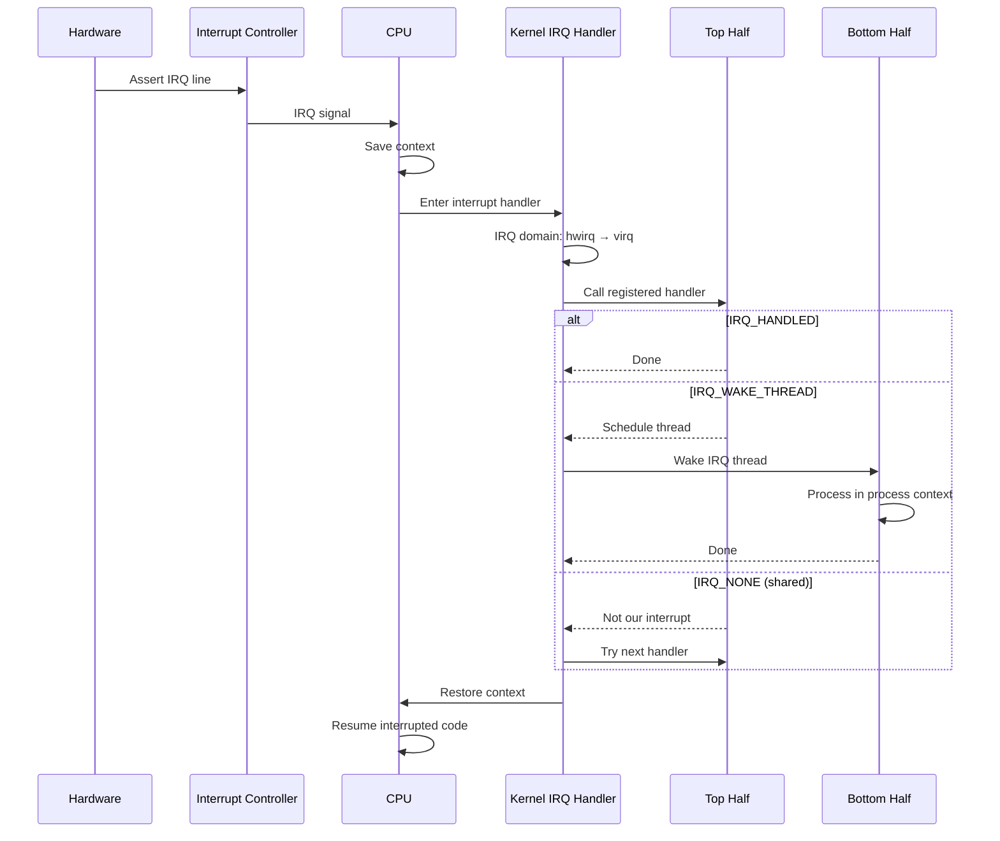
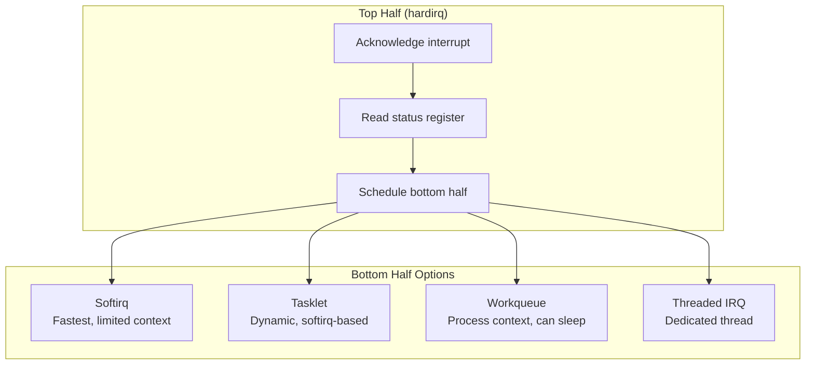
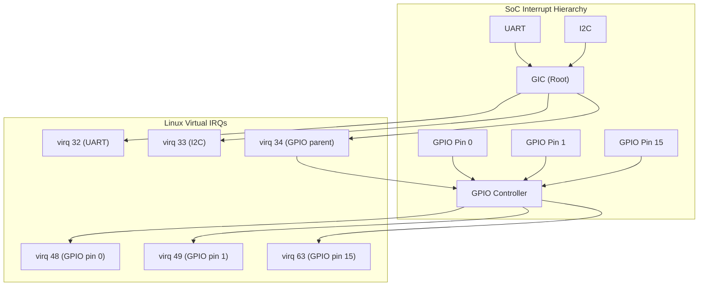

# Chapter 203: Interrupt Handling in Drivers

## 1. Introduction

Interrupts are the primary mechanism by which hardware devices notify the CPU that something has happened — data is ready, a transfer is complete, an error occurred, or a timer expired. Efficient interrupt handling is critical for system performance and responsiveness. The Linux kernel provides a rich framework for interrupt management, including top-half/bottom-half processing, threaded IRQs, IRQ domains for hierarchical interrupt controllers, IRQ affinity for multi-core systems, and various interrupt types (edge, level, MSI).

This chapter covers the complete interrupt handling framework: from registering interrupt handlers to advanced topics like IRQ domains, affinity management, and the threaded IRQ model.

## 2. Intuition

### 2.1 What is an Interrupt?

An interrupt is a signal from hardware to the CPU that causes the current execution to be suspended and a handler function to be called. The process is:

1. Hardware asserts an interrupt line (electrical signal)
2. CPU finishes current instruction, saves state
3. CPU looks up the interrupt vector in the IDT (x86) or GIC (ARM)
4. CPU jumps to the kernel's interrupt entry point
5. Kernel dispatches to the registered handler(s)
6. Handler processes the interrupt
7. CPU restores state and resumes interrupted code

### 2.2 Top Half vs Bottom Half

Interrupt handlers should be fast — they run with interrupts disabled (or at least the current IRQ disabled). For lengthy processing, the kernel provides "bottom half" mechanisms:

- **Top Half** (hardirq context): Quick acknowledgment, read status, schedule bottom half. Runs with current IRQ disabled.
- **Bottom Half** (softirq/tasklet/workqueue context): Longer processing, data copying, network stack processing. Runs with interrupts enabled.

### 2.3 Threaded IRQs

Threaded IRQs (introduced in Linux 2.6.30) run the handler function in a kernel thread:

- The "hardirq" handler does minimal work (acknowledge, check if ours)
- The "threaded" handler runs in process context, can sleep, use mutexes
- Better real-time behavior, lower latency for other interrupts

### 2.4 IRQ Domains

Modern SoCs have hierarchical interrupt controllers:

```
GIC (Generic Interrupt Controller)
├── SPI (Shared Peripheral Interrupt) 32-1019
│   ├── UART0 → SPI 20
│   ├── UART1 → SPI 21
│   ├── GPIO → SPI 33
│   │   ├── GPIO pin 0 → domain IRQ 0
│   │   ├── GPIO pin 1 → domain IRQ 1
│   │   └── ...
│   └── ...
├── PPI (Private Peripheral Interrupt) 16-31
└── SGI (Software Generated Interrupt) 0-15
```

IRQ domains map hardware interrupt numbers to Linux virtual IRQ numbers.

## 3. Architecture

### 3.1 Interrupt Handling Architecture

```
┌─────────────────────────────────────────────────┐
│              Hardware                            │
│  (Devices assert interrupt lines)               │
├─────────────────────────────────────────────────┤
│         Interrupt Controller                    │
│  (GIC, APIC, IOAPIC, GPIO controller)          │
│  ┌──────────────┐  ┌────────────────────────┐  │
│  │ IRQ Domain   │  │ IRQ Chip (hw_ops)      │  │
│  │ (hw→virq map)│  │ (mask/unmask/ack)      │  │
│  └──────────────┘  └────────────────────────┘  │
├─────────────────────────────────────────────────┤
│         Kernel IRQ Framework                    │
│  (kernel/irq/)                                  │
│  ┌─────────────┐  ┌────────────────────────┐  │
│  │ IRQ Desc    │  │ IRQ Action (handlers)  │  │
│  │ Array/Radix │  │ (chain of handlers)    │  │
│  └─────────────┘  └────────────────────────┘  │
├─────────────────────────────────────────────────┤
│         Top Half (hardirq context)              │
│  request_irq() handler — fast, no sleep         │
├─────────────────────────────────────────────────┤
│         Bottom Half                             │
│  ┌──────────┐  ┌──────────┐  ┌──────────────┐ │
│  │ Softirqs │  │ Tasklets │  │ Workqueues   │ │
│  │ (NET, BLOCK, TIMER) │  │ (BH processing)│ │
│  └──────────┘  └──────────┘  └──────────────┘ │
├─────────────────────────────────────────────────┤
│         Threaded IRQs (process context)         │
│  request_threaded_irq() — can sleep             │
└─────────────────────────────────────────────────┘
```

### 3.2 IRQ Flow

```
Hardware asserts IRQ line
    │
    ▼
Interrupt controller: identify IRQ number
    │
    ▼
CPU: save context, enter interrupt handler
    │
    ▼
Kernel: __do_IRQ() / handle_irq()
    │
    ▼
IRQ domain: translate hwirq → virq
    │
    ▼
IRQ descriptor: find registered handlers
    │
    ▼
For each registered handler:
    │
    ▼
Call handler (top half)
    │
    ├─→ IRQ_HANDLED: interrupt processed
    ├─→ IRQ_NONE: not our interrupt (shared IRQ)
    └─→ IRQ_WAKE_THREAD: schedule threaded handler
    │
    ▼
If threaded handler: wake IRQ thread
    │
    ▼
IRQ thread runs in process context
    │
    ▼
Bottom half processing (softirq/tasklet/workqueue)
```

## 4. Kernel Implementation

### 4.1 IRQ Registration

```c
/* Register an interrupt handler */
int request_irq(unsigned int irq, irq_handler_t handler,
                unsigned long flags, const char *name, void *dev);

/* Device-managed version (auto-freed on device removal) */
int devm_request_irq(struct device *dev, unsigned int irq,
                     irq_handler_t handler, unsigned long flags,
                     const char *name, void *dev_id);

/* Free an interrupt handler */
void free_irq(unsigned int irq, void *dev_id);
void devm_free_irq(struct device *dev, unsigned int irq, void *dev_id);

/* Handler type */
typedef irqreturn_t (*irq_handler_t)(int irq, void *dev_id);

/* Return values */
irqreturn_t IRQ_NONE;     /* Not our interrupt */
irqreturn_t IRQ_HANDLED;  /* Interrupt handled */
irqreturn_t IRQ_WAKE_THREAD; /* Schedule threaded handler */
```

### 4.2 Interrupt Flags

```c
#define IRQF_SHARED         0x00000080  /* Shared interrupt line */
#define IRQF_PROBE_SHARED   0x00000100  /* Handler can be shared */
#define IRQF_ONESHOT        0x00002000  /* Keep IRQ disabled until thread done */
#define IRQF_NOBALANCING    0x00000800  /* Excluded from IRQ balancing */
#define IRQF_IRQPOLL        0x00001000  /* Used for polling */
#define IRQF_TRIGGER_RISING 0x00000001  /* Rising edge */
#define IRQF_TRIGGER_FALLING 0x00000002 /* Falling edge */
#define IRQF_TRIGGER_HIGH   0x00000004  /* High level */
#define IRQF_TRIGGER_LOW    0x00000008  /* Low level */
#define IRQF_NO_SUSPEND     0x00004000  /* Don't disable during suspend */
#define IRQF_FORCE_RESUME   0x00008000  /* Force enable on resume */
#define IRQF_NO_THREAD      0x00010000  /* Don't thread this IRQ */
```

### 4.3 Threaded IRQ API

```c
/* Register a threaded IRQ handler */
int request_threaded_irq(unsigned int irq,
                          irq_handler_t handler,        /* hardirq handler */
                          irq_handler_t thread_fn,      /* threaded handler */
                          unsigned long flags,
                          const char *name, void *dev);

int devm_request_threaded_irq(struct device *dev, unsigned int irq,
                               irq_handler_t handler,
                               irq_handler_t thread_fn,
                               unsigned long flags,
                               const char *name, void *dev_id);

/* Example: handler returns IRQ_WAKE_THREAD, thread_fn does the work */
```

### 4.4 IRQ Domain API

```c
/* Create an IRQ domain */
struct irq_domain *irq_domain_add_linear(struct device_node *of_node,
                                          unsigned int size,
                                          const struct irq_domain_ops *ops,
                                          void *host_data);

struct irq_domain *irq_domain_add_hierarchy(struct irq_domain *parent,
                                             unsigned int size,
                                             unsigned int first_irq,
                                             const struct irq_domain_ops *ops,
                                             void *host_data);

/* Map hardware IRQ to virtual IRQ */
unsigned int irq_create_mapping(struct irq_domain *domain,
                                 irq_hw_number_t hwirq);

/* Reverse map: virtual IRQ to hardware IRQ */
irq_hw_number_t irqd_to_hwirq(struct irq_data *data);

/* OF (Device Tree) IRQ parsing */
unsigned int irq_of_parse_and_map(struct device_node *dev, int index);

/* Get IRQ from platform device */
int platform_get_irq(struct platform_device *dev, unsigned int num);
```

### 4.5 IRQ Affinity

```c
/* Set IRQ affinity to specific CPUs */
int irq_set_affinity(unsigned int irq, const struct cpumask *mask);
int irq_set_affinity_hint(unsigned int irq, const struct cpumask *m);

/* Managed affinity (auto-assign on hotplug) */
int irq_set_affinity_notifier(unsigned int irq,
                                struct irq_affinity_notify *notify);

/* Spread IRQs across CPUs (for multi-queue devices) */
int irq_calc_affinity_vectors(int minvec, int maxvec,
                               const struct irq_affinity *affd);
struct irq_affinity_desc *irq_create_affinity_masks(unsigned int nvecs,
                                                      struct irq_affinity *affd);
```

### 4.6 IRQ Chip Operations

```c
struct irq_chip {
    const char *name;
    void (*irq_enable)(struct irq_data *data);
    void (*irq_disable)(struct irq_data *data);
    void (*irq_ack)(struct irq_data *data);
    void (*irq_mask)(struct irq_data *data);
    void (*irq_unmask)(struct irq_data *data);
    void (*irq_eoi)(struct irq_data *data);
    int (*irq_set_affinity)(struct irq_data *data,
                            const struct cpumask *dest, bool force);
    int (*irq_set_type)(struct irq_data *data, unsigned int flow_type);
    int (*irq_set_wake)(struct irq_data *data, unsigned int on);
    /* ... */
};
```

### 4.7 Softirqs and Tasklets

```c
/* Softirq — statically defined, high performance */
void open_softirq(int nr, void (*action)(struct softirq_action *));
void raise_softirq(unsigned int nr);

/* Predefined softirq vectors */
enum {
    HI_SOFTIRQ = 0,
    TIMER_SOFTIRQ,
    NET_TX_SOFTIRQ,
    NET_RX_SOFTIRQ,
    BLOCK_SOFTIRQ,
    IRQ_POLL_SOFTIRQ,
    TASKLET_SOFTIRQ,
    SCHED_SOFTIRQ,
    HRTIMER_SOFTIRQ,
    RCU_SOFTIRQ,
};

/* Tasklet — dynamically created, runs in softirq context */
struct tasklet_struct {
    struct tasklet_struct *next;
    unsigned long state;
    atomic_t count;
    void (*func)(unsigned long);
    unsigned long data;
};

void tasklet_init(struct tasklet_struct *t,
                  void (*func)(unsigned long), unsigned long data);
void tasklet_schedule(struct tasklet_struct *t);
void tasklet_kill(struct tasklet_struct *t);

/* Workqueue — process context, can sleep */
struct workqueue_struct *alloc_workqueue(const char *fmt, unsigned int flags,
                                          int max_active, ...);
bool queue_work(struct workqueue_struct *wq, struct work_struct *work);
bool schedule_work(struct work_struct *work);
```

## 5. Data Structures Summary

| Structure | Header | Purpose |
|-----------|--------|---------|
| `irq_desc` | `include/linux/irqdesc.h` | IRQ descriptor |
| `irqaction` | `include/linux/interrupt.h` | Registered handler |
| `irq_domain` | `include/linux/irqdomain.h` | IRQ domain |
| `irq_chip` | `include/linux/irq.h` | IRQ controller ops |
| `irq_data` | `include/linux/irq.h` | Per-IRQ data |
| `softirq_action` | `include/linux/interrupt.h` | Softirq handler |
| `tasklet_struct` | `include/linux/interrupt.h` | Tasklet |
| `work_struct` | `include/linux/workqueue.h` | Work item |

## 6. C Examples

### 6.1 Basic IRQ Handler

```c
#include <linux/module.h>
#include <linux/interrupt.h>
#include <linux/platform_device.h>

static irqreturn_t my_irq_handler(int irq, void *dev_id)
{
    struct my_device *mydev = dev_id;
    u32 status;

    /* Read interrupt status */
    status = readl(mydev->regs + IRQ_STATUS_REG);

    /* Check if this is our interrupt */
    if (!status)
        return IRQ_NONE;

    /* Acknowledge interrupt */
    writel(status, mydev->regs + IRQ_STATUS_REG);

    /* Quick processing (top half) */
    if (status & IRQ_RX_COMPLETE)
        mydev->rx_pending = 1;

    if (status & IRQ_TX_COMPLETE)
        mydev->tx_pending = 1;

    /* Schedule bottom half */
    schedule_work(&mydev->work);

    return IRQ_HANDLED;
}

static void my_work_handler(struct work_struct *work)
{
    struct my_device *mydev = container_of(work, struct my_device, work);

    /* This runs in process context — can sleep */

    if (mydev->rx_pending) {
        mydev->rx_pending = 0;
        process_rx_data(mydev);
    }

    if (mydev->tx_pending) {
        mydev->tx_pending = 0;
        complete_tx_transfer(mydev);
    }
}

static int my_probe(struct platform_device *pdev)
{
    struct my_device *mydev;
    int irq, ret;

    mydev = devm_kzalloc(&pdev->dev, sizeof(*mydev), GFP_KERNEL);
    if (!mydev)
        return -ENOMEM;

    INIT_WORK(&mydev->work, my_work_handler);

    irq = platform_get_irq(pdev, 0);
    if (irq < 0)
        return irq;

    ret = devm_request_irq(&pdev->dev, irq, my_irq_handler,
                           IRQF_SHARED, "my_device", mydev);
    if (ret)
        return ret;

    return 0;
}
```

### 6.2 Threaded IRQ Handler

```c
#include <linux/interrupt.h>

/* Hard IRQ handler — minimal work */
static irqreturn_t my_hardirq_handler(int irq, void *dev_id)
{
    struct my_device *mydev = dev_id;
    u32 status;

    status = readl(mydev->regs + IRQ_STATUS_REG);
    if (!status)
        return IRQ_NONE;

    /* Acknowledge */
    writel(status, mydev->regs + IRQ_STATUS_REG);
    mydev->irq_status = status;

    /* Tell kernel to run threaded handler */
    return IRQ_WAKE_THREAD;
}

/* Threaded handler — runs in process context */
static irqreturn_t my_threaded_handler(int irq, void *dev_id)
{
    struct my_device *mydev = dev_id;
    u32 status = mydev->irq_status;

    /* This can sleep! Use mutex, kmalloc(GFP_KERNEL), etc. */
    mutex_lock(&mydev->lock);

    if (status & IRQ_RX_READY) {
        /* Read data from device — may involve I2C/SPI transactions */
        my_read_rx_fifo(mydev);
    }

    if (status & IRQ_ERROR) {
        /* Handle error — may need to reset device */
        my_handle_error(mydev);
    }

    mutex_unlock(&mydev->lock);

    return IRQ_HANDLED;
}

static int my_setup_irq(struct my_device *mydev)
{
    return devm_request_threaded_irq(mydev->dev, mydev->irq,
                                      my_hardirq_handler,
                                      my_threaded_handler,
                                      IRQF_ONESHOT | IRQF_TRIGGER_RISING,
                                      "my_device", mydev);
}
```

### 6.3 Shared IRQ Handler

```c
static irqreturn_t my_shared_handler(int irq, void *dev_id)
{
    struct my_device *mydev = dev_id;
    u32 status;

    /* Read device-specific status */
    status = readl(mydev->regs + IRQ_STATUS_REG);

    /* If not our interrupt, return IRQ_NONE */
    if (!status)
        return IRQ_NONE;

    /* It's ours — handle it */
    writel(status, mydev->regs + IRQ_STATUS_REG);
    /* ... handle ... */

    return IRQ_HANDLED;
}

/* Register as shared */
ret = devm_request_irq(&pdev->dev, irq, my_shared_handler,
                       IRQF_SHARED, "my_device", mydev);
```

### 6.4 IRQ Affinity for Multi-Queue Device

```c
#include <linux/interrupt.h>
#include <linux/cpumask.h>

struct my_queue {
    int irq;
    int cpu;
    /* ... */
};

static int my_setup_queue_irqs(struct my_device *mydev)
{
    int i, ret, num_queues = mydev->num_queues;

    for (i = 0; i < num_queues; i++) {
        struct my_queue *q = &mydev->queues[i];

        /* Assign IRQ to specific CPU */
        q->cpu = i % num_online_cpus();

        ret = devm_request_irq(mydev->dev, q->irq,
                               my_queue_irq_handler,
                               0, "my_queue", q);
        if (ret)
            return ret;

        /* Set affinity */
        irq_set_affinity_hint(q->irq, cpumask_of(q->cpu));

        dev_info(mydev->dev, "queue %d: IRQ %d → CPU %d\n",
                 i, q->irq, q->cpu);
    }

    return 0;
}

static void my_cleanup_queue_irqs(struct my_device *mydev)
{
    int i;

    for (i = 0; i < mydev->num_queues; i++)
        irq_set_affinity_hint(mydev->queues[i].irq, NULL);
}
```

### 6.5 IRQ Domain (GPIO Controller)

```c
#include <linux/irqdomain.h>
#include <linux/irq.h>
#include <linux/gpio/driver.h>

struct my_gpio {
    struct gpio_chip gc;
    struct irq_domain *domain;
    void __iomem *regs;
    spinlock_t lock;
};

static void my_gpio_irq_ack(struct irq_data *d)
{
    struct my_gpio *mygc = irq_data_get_irq_chip_data(d);
    irq_hw_number_t hwirq = irqd_to_hwirq(d);

    writel(BIT(hwirq), mygc->regs + GPIO_IRQ_CLEAR);
}

static void my_gpio_irq_mask(struct irq_data *d)
{
    struct my_gpio *mygc = irq_data_get_irq_chip_data(d);
    irq_hw_number_t hwirq = irqd_to_hwirq(d);
    unsigned long flags;
    u32 val;

    spin_lock_irqsave(&mygc->lock, flags);
    val = readl(mygc->regs + GPIO_IRQ_MASK);
    val &= ~BIT(hwirq);
    writel(val, mygc->regs + GPIO_IRQ_MASK);
    spin_unlock_irqrestore(&mygc->lock, flags);
}

static void my_gpio_irq_unmask(struct irq_data *d)
{
    struct my_gpio *mygc = irq_data_get_irq_chip_data(d);
    irq_hw_number_t hwirq = irqd_to_hwirq(d);
    unsigned long flags;
    u32 val;

    spin_lock_irqsave(&mygc->lock, flags);
    val = readl(mygc->regs + GPIO_IRQ_MASK);
    val |= BIT(hwirq);
    writel(val, mygc->regs + GPIO_IRQ_MASK);
    spin_unlock_irqrestore(&mygc->lock, flags);
}

static int my_gpio_irq_set_type(struct irq_data *d, unsigned int type)
{
    struct my_gpio *mygc = irq_data_get_irq_chip_data(d);
    irq_hw_number_t hwirq = irqd_to_hwirq(d);
    u32 val;

    switch (type & IRQ_TYPE_SENSE_MASK) {
    case IRQ_TYPE_EDGE_RISING:
        val = 0x1;
        break;
    case IRQ_TYPE_EDGE_FALLING:
        val = 0x2;
        break;
    case IRQ_TYPE_LEVEL_HIGH:
        val = 0x3;
        break;
    case IRQ_TYPE_LEVEL_LOW:
        val = 0x4;
        break;
    default:
        return -EINVAL;
    }

    writel(val, mygc->regs + GPIO_IRQ_TYPE(hwirq));

    if (type & IRQ_TYPE_LEVEL_MASK)
        irq_set_handler_locked(d, handle_level_irq);
    else
        irq_set_handler_locked(d, handle_edge_irq);

    return 0;
}

static struct irq_chip my_gpio_irqchip = {
    .name = "my-gpio",
    .irq_ack = my_gpio_irq_ack,
    .irq_mask = my_gpio_irq_mask,
    .irq_unmask = my_gpio_irq_unmask,
    .irq_set_type = my_gpio_irq_set_type,
};

static int my_gpio_domain_map(struct irq_domain *d, unsigned int irq,
                               irq_hw_number_t hwirq)
{
    irq_set_chip_data(irq, d->host_data);
    irq_set_chip_and_handler(irq, &my_gpio_irqchip, handle_edge_irq);
    irq_set_noprobe(irq);

    return 0;
}

static const struct irq_domain_ops my_gpio_domain_ops = {
    .map = my_gpio_domain_map,
    .xlate = irq_domain_xlate_twocell,
};

static int my_gpio_probe(struct platform_device *pdev)
{
    struct my_gpio *mygc;
    int irq, ret;

    mygc = devm_kzalloc(&pdev->dev, sizeof(*mygc), GFP_KERNEL);
    if (!mygc)
        return -ENOMEM;

    /* Setup GPIO chip */
    mygc->gc.label = "my-gpio";
    mygc->gc.ngpio = 32;
    /* ... */

    /* Create IRQ domain */
    mygc->domain = irq_domain_add_linear(pdev->dev.of_node, 32,
                                          &my_gpio_domain_ops, mygc);
    if (!mygc->domain)
        return -ENOMEM;

    /* Get parent IRQ (from DT) */
    irq = platform_get_irq(pdev, 0);
    if (irq < 0)
        return irq;

    /* Handle GPIO IRQs cascading from parent */
    ret = devm_request_irq(&pdev->dev, irq, my_gpio_irq_handler,
                           0, "my-gpio", mygc);

    return ret;
}
```

## 7. Diagrams

### 7.1 Interrupt Handling Flow



### 7.2 Top Half vs Bottom Half



### 7.3 IRQ Domain Hierarchy



## 8. Common Pitfalls

### 8.1 Sleeping in Hardirq Context

```c
/* WRONG: sleeping in top half */
static irqreturn_t my_handler(int irq, void *dev_id)
{
    kmalloc(size, GFP_KERNEL);     /* BUG: can sleep! */
    mutex_lock(&my_mutex);          /* BUG: can sleep! */
    msleep(100);                    /* BUG: can sleep! */
    return IRQ_HANDLED;
}

/* CORRECT: use threaded handler for sleeping operations */
static irqreturn_t my_thread_fn(int irq, void *dev_id)
{
    mutex_lock(&my_mutex);  /* OK in threaded context */
    /* ... */
    mutex_unlock(&my_mutex);
    return IRQ_HANDLED;
}
```

### 8.2 Forgetting to Acknowledge Interrupt

```c
/* WRONG: no acknowledgment */
static irqreturn_t my_handler(int irq, void *dev_id)
{
    /* Process interrupt */
    return IRQ_HANDLED;
    /* Interrupt keeps firing because it was never acked! */
}

/* CORRECT: acknowledge in handler */
static irqreturn_t my_handler(int irq, void *dev_id)
{
    writel(IRQ_BIT, dev->regs + IRQ_CLEAR);  /* Acknowledge */
    /* Process interrupt */
    return IRQ_HANDLED;
}
```

### 8.3 Using spin_lock Instead of spin_lock_irqsave

```c
/* WRONG: may deadlock if handler is called with lock held */
spin_lock(&my_lock);
/* ... */
spin_unlock(&my_lock);

/* In handler: */
spin_lock(&my_lock);  /* DEADLOCK: IRQ can fire while lock held */

/* CORRECT: use irqsave variant */
unsigned long flags;
spin_lock_irqsave(&my_lock, flags);
/* ... */
spin_unlock_irqrestore(&my_lock, flags);
```

### 8.4 Not Checking IRQ_NONE for Shared IRQs

```c
/* WRONG: always returning IRQ_HANDLED */
static irqreturn_t my_shared_handler(int irq, void *dev_id)
{
    return IRQ_HANDLED;  /* Prevents other handlers from running */
}

/* CORRECT: check if it's actually our interrupt */
static irqreturn_t my_shared_handler(int irq, void *dev_id)
{
    u32 status = readl(dev->regs + STATUS);
    if (!status)
        return IRQ_NONE;  /* Not ours */
    /* ... */
    return IRQ_HANDLED;
}
```

### 8.5 Requesting IRQ Before Hardware is Ready

```c
/* WRONG: IRQ registered before device is initialized */
ret = devm_request_irq(dev, irq, handler, 0, name, mydev);
my_init_hardware(mydev);  /* Device may fire IRQ during init! */

/* CORRECT: initialize hardware first, then request IRQ */
my_init_hardware(mydev);
ret = devm_request_irq(dev, irq, handler, 0, name, mydev);
```

## 9. Best Practices

### 9.1 Use devm_request_irq

```c
/* Automatically freed on device removal */
ret = devm_request_irq(&pdev->dev, irq, handler, 0, name, mydev);
```

### 9.2 Prefer Threaded IRQs

```c
/* Threaded IRQs provide better latency for other IRQs
   and allow sleeping in the handler */
ret = devm_request_threaded_irq(dev, irq,
                                 my_hardirq,    /* minimal work */
                                 my_thread_fn,  /* heavy lifting */
                                 IRQF_ONESHOT,
                                 name, data);
```

### 9.3 Use IRQF_ONESHOT for Threaded IRQs

```c
/* IRQF_ONESHOT keeps the interrupt disabled until the
   threaded handler completes. Required for threaded IRQs
   that use IRQ_WAKE_THREAD. */
ret = devm_request_threaded_irq(dev, irq,
                                 my_hardirq, my_thread,
                                 IRQF_ONESHOT | IRQF_TRIGGER_RISING,
                                 name, data);
```

### 9.4 Proper Error Handling

```c
ret = devm_request_irq(dev, irq, handler, flags, name, data);
if (ret) {
    if (ret == -EPROBE_DEFER)
        return ret;  /* IRQ controller not ready */
    dev_err(dev, "failed to request IRQ %d: %d\n", irq, ret);
    return ret;
}
```

### 9.5 Minimize Hardirq Handler Duration

```c
static irqreturn_t my_hardirq(int irq, void *data)
{
    struct my_dev *mydev = data;

    /* Minimal work: acknowledge, save state */
    mydev->status = readl(mydev->regs + STATUS);
    writel(mydev->status, mydev->regs + CLEAR);

    return IRQ_WAKE_THREAD;  /* Let thread_fn do the rest */
}
```

## 10. Exercises

### Exercise 1: Basic IRQ Handler

Write a platform driver that registers an IRQ handler. Use a GPIO or timer to generate test interrupts. Verify the handler is called by incrementing a counter.

### Exercise 2: Threaded IRQ

Implement a threaded IRQ handler where the hardirq handler acknowledges the interrupt and the thread_fn processes data. Test with a userspace program that reads the processed data.

### Exercise 3: Shared IRQ

Set up two drivers sharing the same IRQ line. Each driver should correctly identify its own interrupts and return IRQ_NONE for others. Verify both handlers are called appropriately.

### Exercise 4: Workqueue Bottom Half

Implement a driver that uses a workqueue as the bottom half. The workqueue handler should process data in process context (can use mutex, GFP_KERNEL allocations).

### Exercise 5: IRQ Affinity

Write a multi-queue driver with per-queue IRQs. Set CPU affinity so each queue's IRQ is handled by a different CPU. Measure interrupt latency using `ktime_get()`.

## 11. References

### Kernel Source
- `kernel/irq/` — IRQ framework core
- `kernel/irq/manage.c` — IRQ management (request, free, threading)
- `kernel/irq/handle.c` — IRQ handling
- `kernel/irq/chip.c` — IRQ chip operations
- `kernel/irq/irqdomain.c` — IRQ domain management
- `include/linux/interrupt.h` — IRQ API
- `include/linux/irqdomain.h` — IRQ domain API
- `Documentation/core-api/genericirq.rst` — Generic IRQ documentation
- `Documentation/driver-api/` — Driver API documentation

### Books
- *Linux Device Drivers, 3rd Edition* — Chapter 10
- *Linux Kernel Development, 3rd Edition* — Chapter 7

### Online
- https://www.kernel.org/doc/html/latest/core-api/irq/
- https://lwn.net/Articles/302043/ — Threaded IRQs
- https://lwn.net/Articles/493751/ — IRQ domains
