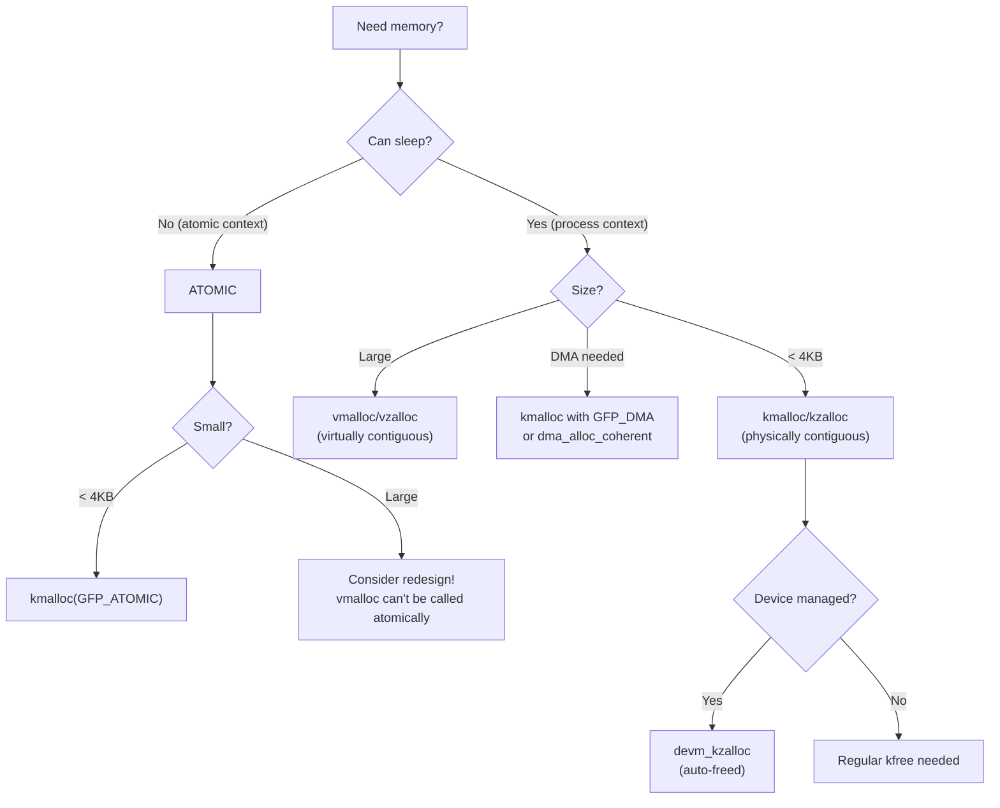
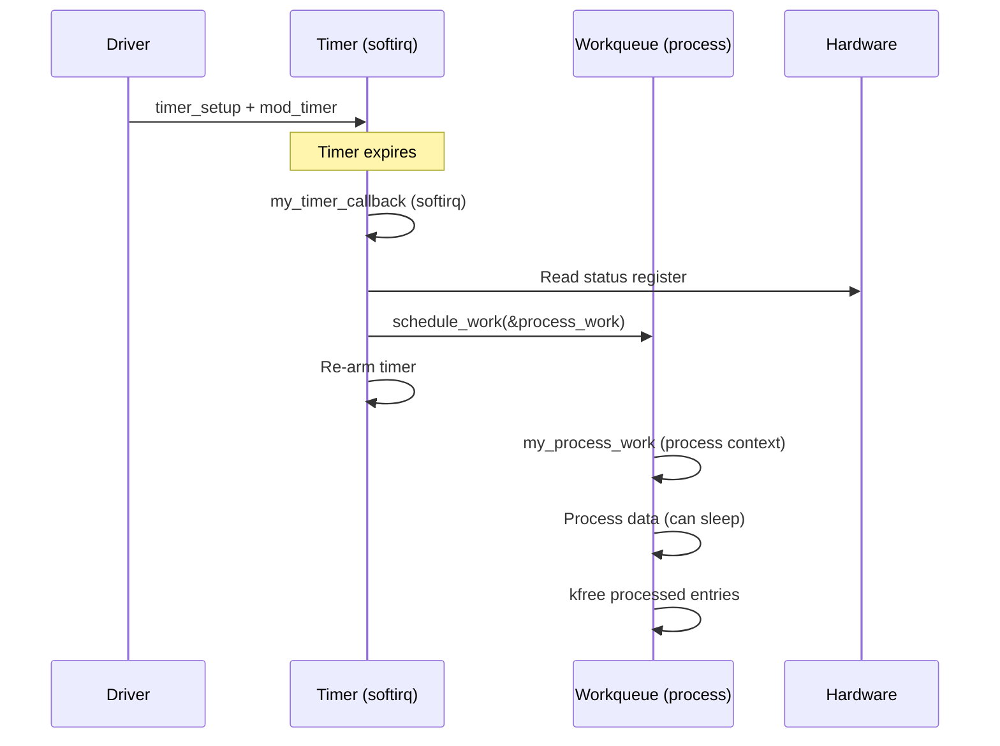

# Chapter 204: Kernel APIs for Driver Writers

## 1. Introduction

Writing a device driver requires proficiency with a wide range of kernel APIs beyond the specific subsystem interfaces (PCI, USB, platform, etc.). This chapter covers the essential general-purpose kernel APIs that every driver writer needs: memory allocation, timers, workqueues, reference counting, locking primitives, linked lists, and other utility functions. These APIs form the foundation upon which all drivers are built.

## 2. Intuition

### 2.1 The Kernel Programming Environment

Kernel programming is fundamentally different from userspace programming:

- **No libc**: You can't call `malloc()`, `printf()`, or `sleep()`. The kernel provides its own equivalents.
- **Limited stack**: The kernel stack is typically 8KB or 16KB. Avoid large local variables.
- **Concurrency everywhere**: Multiple CPUs, interrupts, and preemption mean you must always consider synchronization.
- **Memory zones**: Different allocation functions return memory from different zones with different properties.
- **No page faults in atomic context**: You can't sleep when holding a spinlock or in interrupt context.

### 2.2 GFP Flags — Memory Allocation Modifiers

`GFP` stands for "Get Free Pages." The flags control how memory is allocated:

- `GFP_KERNEL`: Can sleep, may reclaim memory. Use in process context only.
- `GFP_ATOMIC`: Cannot sleep. Use in interrupt context, spinlock-held regions.
- `GFP_DMA`: Allocate from DMA-capable zone.
- `GFP_ZERO`: Zero the allocated memory.
- `__GFP_HIGHMEM`: Allow allocation from high memory.
- `GFP_NOWAIT`: Don't wait for memory at all.

## 3. Architecture

### 3.1 Kernel Memory Allocation Hierarchy

```
┌─────────────────────────────────────────────────┐
│              High-Level APIs                     │
│  (kmalloc, kzalloc, vmalloc, devm_kzalloc)      │
├─────────────────────────────────────────────────┤
│              Slab Allocator                      │
│  (kmem_cache_alloc, SLAB/SLUB/SLQB)             │
├─────────────────────────────────────────────────┤
│              Page Allocator                      │
│  (alloc_pages, __get_free_pages)                │
├─────────────────────────────────────────────────┤
│              Buddy System                       │
│  (manages physical page frames)                 │
└─────────────────────────────────────────────────┘
```

### 3.2 Synchronization Primitives

```
┌─────────────────────────────────────────────────┐
│ Mutual Exclusion                                │
│  mutex        — sleeping lock (process context) │
│  spinlock     — busy-wait lock (any context)    │
│  rwlock       — reader-writer spinlock          │
│  rwsem        — reader-writer semaphore         │
├─────────────────────────────────────────────────┤
│ Atomic Operations                               │
│  atomic_t     — atomic integer                  │
│  atomic_long_t — atomic long                    │
│  refcount_t   — reference counting              │
├─────────────────────────────────────────────────┤
│ Lock-Free                                      │
│  RCU          — Read-Copy-Update                │
│  seqlock      — Sequence lock                   │
│  percpu       — Per-CPU variables               │
├─────────────────────────────────────────────────┤
│ Synchronization                                 │
│  completion   — wait for event                  │
│  wait_queue   — wait for condition              │
│  barrier      — memory barriers                 │
└─────────────────────────────────────────────────┘
```

## 4. Kernel Implementation

### 4.1 Memory Allocation

```c
/* --- kmalloc family (physically contiguous, DMA-able) --- */
void *kmalloc(size_t size, gfp_t flags);
void *kzalloc(size_t size, gfp_t flags);        /* zeroed */
void *kmalloc_array(size_t n, size_t size, gfp_t flags);
void *kcalloc(size_t n, size_t size, gfp_t flags); /* zeroed array */
void *krealloc(const void *p, size_t new_size, gfp_t flags);
void kfree(const void *ptr);
void kvfree(const void *ptr);                     /* kfree or vfree */

/* --- vmalloc family (virtually contiguous, not DMA-able) --- */
void *vmalloc(unsigned long size);
void *vzalloc(unsigned long size);
void *vmalloc_node(unsigned long size, int node);
void vfree(const void *addr);

/* --- Page allocator --- */
struct page *alloc_pages(gfp_t gfp_mask, unsigned int order);
struct page *alloc_page(gfp_t gfp_mask);  /* order = 0 */
void __free_pages(struct page *page, unsigned int order);
void free_page(unsigned long addr);
unsigned long __get_free_pages(gfp_t gfp_mask, unsigned int order);
unsigned long __get_free_page(gfp_t gfp_mask);
void free_pages(unsigned long addr, unsigned int order);

/* --- Device-managed allocation --- */
void *devm_kmalloc(struct device *dev, size_t size, gfp_t gfp);
void *devm_kzalloc(struct device *dev, size_t size, gfp_t gfp);
void *devm_kcalloc(struct device *dev, size_t n, size_t size, gfp_t gfp);
char *devm_kstrdup(struct device *dev, const char *s, gfp_t gfp);
void devm_kfree(struct device *dev, void *p);

/* --- Per-CPU allocation --- */
void __percpu *alloc_percpu(type);
void free_percpu(void __percpu *ptr);
void *per_cpu_ptr(void __percpu *ptr, int cpu);
```

### 4.2 Timers

```c
/* --- Kernel timers (softirq context) --- */
struct timer_list {
    struct hlist_node entry;
    unsigned long expires;
    void (*function)(struct timer_list *);
    u32 flags;
};

/* Initialize */
void timer_setup(struct timer_list *timer,
                 void (*callback)(struct timer_list *),
                 unsigned int flags);

/* Arm/disarm */
int mod_timer(struct timer_list *timer, unsigned long expires);
int del_timer(struct timer_list *timer);
int del_timer_sync(struct timer_list *timer);  /* waits for completion */

/* Time values */
unsigned long jiffies;  /* current time in jiffies */
#define HZ 1000         /* jiffies per second (typically 100, 250, 300, 1000) */

unsigned long msecs_to_jiffies(unsigned int m);
unsigned long usecs_to_jiffies(unsigned int u);
unsigned long jiffies_to_msecs(const unsigned long j);

/* High-resolution timers (nanosecond precision) */
struct hrtimer {
    /* ... */
};

void hrtimer_init(struct hrtimer *timer, clockid_t clock_id,
                  enum hrtimer_mode mode);
int hrtimer_start(struct hrtimer *timer, ktime_t time,
                  const enum hrtimer_mode mode);
int hrtimer_cancel(struct hrtimer *timer);

/* ktime_t */
ktime_t ktime_set(const long secs, const unsigned long nsecs);
ktime_t ktime_get(void);        /* monotonic clock */
ktime_t ktime_get_real(void);   /* real (wall) clock */
s64 ktime_to_ms(ktime_t kt);
ktime_t ms_to_ktime(u64 ms);
```

### 4.3 Workqueues

```c
/* --- Workqueues --- */
struct work_struct {
    atomic_long_t data;
    struct list_head entry;
    work_func_t func;
    /* ... */
};

struct delayed_work {
    struct work_struct work;
    struct timer_list timer;
    /* ... */
};

/* Initialize */
#define DECLARE_WORK(name, function)
#define DECLARE_DELAYED_WORK(name, function)

void INIT_WORK(struct work_struct *work, work_func_t func);
void INIT_DELAYED_WORK(struct delayed_work *work, work_func_t func);

/* Queue work */
bool queue_work(struct workqueue_struct *wq, struct work_struct *work);
bool schedule_work(struct work_struct *work);  /* system_wq */

/* Queue delayed work */
bool queue_delayed_work(struct workqueue_struct *wq,
                        struct delayed_work *dwork,
                        unsigned long delay);
bool schedule_delayed_work(struct delayed_work *dwork,
                           unsigned long delay);

/* Cancel work */
bool cancel_work_sync(struct work_struct *work);
bool cancel_delayed_work(struct delayed_work *dwork);
bool cancel_delayed_work_sync(struct delayed_work *dwork);

/* Flush work */
void flush_work(struct work_struct *work);
void flush_workqueue(struct workqueue_struct *wq);

/* Create custom workqueue */
struct workqueue_struct *alloc_workqueue(const char *fmt,
                                          unsigned int flags,
                                          int max_active, ...);
void destroy_workqueue(struct workqueue_struct *wq);

/* Workqueue flags */
#define WQ_UNBOUND      0x02  /* Not bound to any CPU */
#define WQ_FREEZABLE    0x08  /* Freezable during suspend */
#define WQ_MEM_RECLAIM  0x10  /* Guaranteed forward progress */
#define WQ_HIGHPRI      0x40  /* High priority */
#define WQ_SYSFS        0x80  /* Visible in sysfs */
```

### 4.4 Reference Counting (kref)

```c
struct kref {
    refcount_t refcount;
};

void kref_init(struct kref *kref);                      /* set to 1 */
void kref_get(struct kref *kref);                        /* increment */
int kref_put(struct kref *kref, void (*release)(struct kref *kref));
                                                         /* decrement, free at 0 */

/* Usage pattern */
struct my_object {
    struct kref refcount;
    /* ... */
};

static void my_object_release(struct kref *ref)
{
    struct my_object *obj = container_of(ref, struct my_object, refcount);
    kfree(obj);
}

/* Get reference */
void my_object_get(struct my_object *obj)
{
    kref_get(&obj->refcount);
}

/* Put reference */
void my_object_put(struct my_object *obj)
{
    kref_put(&obj->refcount, my_object_release);
}
```

### 4.5 Linked Lists

```c
/* --- Doubly-linked list --- */
struct list_head {
    struct list_head *next, *prev;
};

#define LIST_HEAD_INIT(name) { &(name), &(name) }
#define LIST_HEAD(name) struct list_head name = LIST_HEAD_INIT(name)

void INIT_LIST_HEAD(struct list_head *list);
void list_add(struct list_head *new, struct list_head *head);
void list_add_tail(struct list_head *new, struct list_head *head);
void list_del(struct list_head *entry);
void list_del_init(struct list_head *entry);
bool list_empty(const struct list_head *head);

/* Iteration */
#define list_for_each(pos, head)
#define list_for_each_entry(pos, head, member)
#define list_for_each_entry_safe(pos, n, head, member)
#define list_for_each_entry_reverse(pos, head, member)

/* container_of: get containing structure */
#define container_of(ptr, type, member)

/* Example */
struct my_entry {
    int data;
    struct list_head list;
};

LIST_HEAD(my_list);

/* Add entry */
struct my_entry *entry = kmalloc(sizeof(*entry), GFP_KERNEL);
entry->data = 42;
list_add_tail(&entry->list, &my_list);

/* Iterate */
struct my_entry *pos;
list_for_each_entry(pos, &my_list, list) {
    pr_info("data = %d\n", pos->data);
}

/* --- Singly-linked list (hlist) --- */
struct hlist_head { struct hlist_node *first; };
struct hlist_node { struct hlist_node *next, **pprev; };
```

### 4.6 Completion

```c
struct completion {
    unsigned int done;
    wait_queue_head_t wait;
};

#define DECLARE_COMPLETION(work)
void init_completion(struct completion *x);
void complete(struct completion *x);       /* wake one waiter */
void complete_all(struct completion *x);   /* wake all waiters */
void wait_for_completion(struct completion *x);
unsigned long wait_for_completion_timeout(struct completion *x,
                                           unsigned long timeout);
bool wait_for_completion_interruptible(struct completion *x);
bool completion_done(struct completion *x);
```

### 4.7 Wait Queues

```c
/* --- Wait queues --- */
wait_queue_head_t wq;
init_waitqueue_head(&wq);

/* Wait for condition */
wait_event(wq, condition);
wait_event_interruptible(wq, condition);
wait_event_timeout(wq, condition, timeout);
wait_event_interruptible_timeout(wq, condition, timeout);

/* Wake up waiters */
wake_up(&wq);
wake_up_interruptible(&wq);
wake_up_all(&wq);
wake_up_interruptible_all(&wq);
```

### 4.8 Atomic Operations

```c
/* Atomic integer */
typedef struct { int counter; } atomic_t;

atomic_t v = ATOMIC_INIT(0);
atomic_set(&v, 42);            /* v = 42 */
int val = atomic_read(&v);     /* read */
atomic_inc(&v);                /* v++ */
atomic_dec(&v);                /* v-- */
atomic_add(10, &v);            /* v += 10 */
atomic_sub(5, &v);             /* v -= 5 */
atomic_inc_and_test(&v);       /* v++, return true if v == 0 */
atomic_dec_and_test(&v);       /* v--, return true if v == 0 */
atomic_cmpxchg(&v, old, new);  /* if v == old, v = new */

/* Atomic bit operations */
set_bit(nr, addr);
clear_bit(nr, addr);
change_bit(nr, addr);
test_bit(nr, addr);
test_and_set_bit(nr, addr);
test_and_clear_bit(nr, addr);
```

### 4.9 Memory Barriers

```c
/* Compiler barrier */
barrier();

/* CPU memory barriers */
mb();    /* full memory barrier */
rmb();   /* read memory barrier */
wmb();   /* write memory barrier */

/* SMP barriers (also compiler barriers) */
smp_mb();
smp_rmb();
smp_wmb();

/* Atomic/barrier combos */
smp_mb__before_atomic();
smp_mb__after_atomic();

/* I/O barriers (for MMIO) */
mb();
wmb();
```

### 4.10 Kernel Logging

```c
/* Print levels */
#define KERN_EMERG   "0"   /* system is unusable */
#define KERN_ALERT   "1"   /* action must be taken immediately */
#define KERN_CRIT    "2"   /* critical conditions */
#define KERN_ERR     "3"   /* error conditions */
#define KERN_WARNING "4"   /* warning conditions */
#define KERN_NOTICE  "5"   /* normal but significant condition */
#define KERN_INFO    "6"   /* informational */
#define KERN_DEBUG   "7"   /* debug-level messages */

/* Pr_* macros (preferred for device drivers) */
pr_emerg(fmt, ...);
pr_alert(fmt, ...);
pr_crit(fmt, ...);
pr_err(fmt, ...);
pr_warn(fmt, ...);
pr_notice(fmt, ...);
pr_info(fmt, ...);
pr_debug(fmt, ...);
pr_info_once(fmt, ...);  /* Print only once */
pr_info_ratelimited(fmt, ...);  /* Rate-limited */

/* Dev_* macros (include device name) */
dev_emerg(dev, fmt, ...);
dev_err(dev, fmt, ...);
dev_warn(dev, fmt, ...);
dev_info(dev, fmt, ...);
dev_dbg(dev, fmt, ...);

/* Dynamic debug */
#define DEBUG
#include <linux/dynamic_debug.h>
/* pr_debug() and dev_dbg() are enabled via dyndbg boot param or sysfs */
```

## 5. Data Structures Summary

| Structure | Header | Purpose |
|-----------|--------|---------|
| `timer_list` | `include/linux/timer.h` | Kernel timer |
| `hrtimer` | `include/linux/hrtimer.h` | High-res timer |
| `work_struct` | `include/linux/workqueue.h` | Work item |
| `delayed_work` | `include/linux/workqueue.h` | Delayed work item |
| `kref` | `include/linux/kref.h` | Reference count |
| `list_head` | `include/linux/list.h` | Doubly-linked list |
| `completion` | `include/linux/completion.h` | Completion |
| `wait_queue_head` | `include/linux/wait.h` | Wait queue |
| `kmem_cache` | `include/linux/slab.h` | Slab cache |
| `mutex` | `include/linux/mutex.h` | Sleeping lock |
| `spinlock_t` | `include/linux/spinlock.h` | Spinlock |
| `rwlock_t` | `include/linux/rwlock.h` | Reader-writer spinlock |
| `rw_semaphore` | `include/linux/rwsem.h` | Reader-writer semaphore |

## 6. C Examples

### 6.1 Timer Example — Periodic Polling

```c
#include <linux/module.h>
#include <linux/timer.h>

struct my_device {
    struct timer_list poll_timer;
    void __iomem *regs;
    unsigned int poll_interval_ms;
};

static void my_timer_callback(struct timer_list *t)
{
    struct my_device *mydev = from_timer(mydev, t, poll_timer);
    u32 status;

    /* Read device status */
    status = readl(mydev->regs + STATUS_REG);
    pr_debug("my_device: status=0x%08x\n", status);

    /* Re-arm timer */
    mod_timer(&mydev->poll_timer,
              jiffies + msecs_to_jiffies(mydev->poll_interval_ms));
}

static int my_probe(struct platform_device *pdev)
{
    struct my_device *mydev;

    mydev = devm_kzalloc(&pdev->dev, sizeof(*mydev), GFP_KERNEL);
    if (!mydev)
        return -ENOMEM;

    mydev->poll_interval_ms = 1000;  /* 1 second */

    /* Setup timer */
    timer_setup(&mydev->poll_timer, my_timer_callback, 0);

    /* Start timer */
    mod_timer(&mydev->poll_timer,
              jiffies + msecs_to_jiffies(mydev->poll_interval_ms));

    return 0;
}

static int my_remove(struct platform_device *pdev)
{
    struct my_device *mydev = platform_get_drvdata(pdev);

    del_timer_sync(&mydev->poll_timer);  /* Wait for callback */
    return 0;
}
```

### 6.2 Workqueue Example — Deferred Processing

```c
#include <linux/module.h>
#include <linux/workqueue.h>
#include <linux/slab.h>

struct my_device {
    struct work_struct process_work;
    struct delayed_work periodic_work;
    struct workqueue_struct *wq;
    struct list_head pending_list;
    spinlock_t lock;
};

static void my_process_work(struct work_struct *work)
{
    struct my_device *mydev = container_of(work, struct my_device, process_work);
    struct my_entry *entry, *tmp;
    LIST_HEAD(local_list);

    /* Move pending items to local list (minimize lock hold time) */
    spin_lock_bh(&mydev->lock);
    list_splice_init(&mydev->pending_list, &local_list);
    spin_unlock_bh(&mydev->lock);

    /* Process in process context (can sleep) */
    list_for_each_entry_safe(entry, tmp, &local_list, list) {
        /* Process entry */
        pr_info("Processing: %d\n", entry->data);
        list_del(&entry->list);
        kfree(entry);
    }
}

static void my_periodic_work(struct work_struct *work)
{
    struct delayed_work *dwork = to_delayed_work(work);
    struct my_device *mydev = container_of(dwork, struct my_device, periodic_work);

    /* Do periodic maintenance */
    pr_info("Periodic maintenance\n");

    /* Re-schedule */
    queue_delayed_work(mydev->wq, &mydev->periodic_work,
                       msecs_to_jiffies(5000));
}

static int my_init(struct my_device *mydev)
{
    /* Create dedicated workqueue */
    mydev->wq = alloc_workqueue("my_device_wq", WQ_MEM_RECLAIM, 0);
    if (!mydev->wq)
        return -ENOMEM;

    INIT_WORK(&mydev->process_work, my_process_work);
    INIT_DELAYED_WORK(&mydev->periodic_work, my_periodic_work);
    spin_lock_init(&mydev->lock);
    INIT_LIST_HEAD(&mydev->pending_list);

    /* Start periodic work */
    queue_delayed_work(mydev->wq, &mydev->periodic_work,
                       msecs_to_jiffies(1000));

    return 0;
}

static void my_cleanup(struct my_device *mydev)
{
    cancel_delayed_work_sync(&mydev->periodic_work);
    cancel_work_sync(&mydev->process_work);
    destroy_workqueue(mydev->wq);
}

/* Called from IRQ handler to schedule work */
static void my_schedule_process(struct my_device *mydev)
{
    queue_work(mydev->wq, &mydev->process_work);
}
```

### 6.3 kref Reference Counting

```c
#include <linux/kref.h>
#include <linux/slab.h>

struct my_object {
    struct kref refcount;
    char name[32];
    void *data;
    size_t size;
};

static void my_object_release(struct kref *ref)
{
    struct my_object *obj = container_of(ref, struct my_object, refcount);

    pr_info("my_object: releasing '%s'\n", obj->name);
    kfree(obj->data);
    kfree(obj);
}

struct my_object *my_object_create(const char *name, size_t size)
{
    struct my_object *obj;

    obj = kzalloc(sizeof(*obj), GFP_KERNEL);
    if (!obj)
        return NULL;

    kref_init(&obj->refcount);  /* refcount = 1 */
    strscpy(obj->name, name, sizeof(obj->name));
    obj->data = kzalloc(size, GFP_KERNEL);
    if (!obj->data) {
        kfree(obj);
        return NULL;
    }
    obj->size = size;

    return obj;
}

/* Caller gets a reference */
void my_object_get(struct my_object *obj)
{
    kref_get(&obj->refcount);
}

/* Caller releases a reference */
void my_object_put(struct my_object *obj)
{
    kref_put(&obj->refcount, my_object_release);
}
```

### 6.4 Completion Example

```c
#include <linux/completion.h>

struct my_device {
    struct completion cmd_done;
    void __iomem *regs;
};

/* IRQ handler signals completion */
static irqreturn_t my_irq_handler(int irq, void *data)
{
    struct my_device *mydev = data;

    writel(IRQ_ACK, mydev->regs + IRQ_CLEAR);
    complete(&mydev->cmd_done);

    return IRQ_HANDLED;
}

/* Send command and wait for completion */
static int my_send_command(struct my_device *mydev, u32 cmd)
{
    unsigned long timeout;

    reinit_completion(&mydev->cmd_done);

    /* Send command to hardware */
    writel(cmd, mydev->regs + CMD_REG);

    /* Wait for IRQ to signal completion */
    timeout = wait_for_completion_timeout(&mydev->cmd_done,
                                           msecs_to_jiffies(5000));
    if (timeout == 0) {
        dev_err(mydev->dev, "command timeout\n");
        return -ETIMEDOUT;
    }

    return 0;
}
```

### 6.5 Linked List with RCU

```c
#include <linux/list.h>
#include <linux/rcupdate.h>

struct my_entry {
    struct list_head list;
    struct rcu_head rcu;
    int data;
};

LIST_HEAD(my_list);
DEFINE_RWLOCK(my_list_lock);

/* Add entry (writer, takes write lock) */
void my_add_entry(int data)
{
    struct my_entry *entry;

    entry = kmalloc(sizeof(*entry), GFP_KERNEL);
    entry->data = data;

    write_lock(&my_list_lock);
    list_add_rcu(&entry->list, &my_list);
    write_unlock(&my_list_lock);
}

/* Read entries (reader, RCU-protected) */
void my_read_entries(void)
{
    struct my_entry *entry;

    rcu_read_lock();
    list_for_each_entry_rcu(entry, &my_list, list) {
        pr_info("data = %d\n", entry->data);
    }
    rcu_read_unlock();
}

/* Remove entry (writer) */
void my_remove_entry(struct my_entry *entry)
{
    list_del_rcu(&entry->list);
    kfree_rcu(entry, rcu);  /* Free after grace period */
}
```

## 7. Diagrams

### 7.1 Memory Allocation Decision Tree



### 7.2 Timer and Workqueue Relationship



## 8. Common Pitfalls

### 8.1 Using GFP_KERNEL in Atomic Context

```c
/* WRONG: GFP_KERNEL while holding spinlock */
spin_lock(&mylock);
buf = kmalloc(size, GFP_KERNEL);  /* BUG: can sleep! */

/* CORRECT: GFP_ATOMIC in atomic context */
spin_lock(&mylock);
buf = kmalloc(size, GFP_ATOMIC);
```

### 8.2 Using vmalloc for DMA

```c
/* WRONG: vmalloc'd memory is not DMA-able */
buf = vmalloc(size);
dma = dma_map_single(dev, buf, size, DMA_TO_DEVICE);  /* May fail! */

/* CORRECT: use kmalloc for DMA buffers */
buf = kmalloc(size, GFP_KERNEL);
dma = dma_map_single(dev, buf, size, DMA_TO_DEVICE);
```

### 8.3 Forgetting del_timer_sync

```c
/* WRONG: removing module while timer may be running */
static void __exit my_exit(void)
{
    del_timer(&mydev->timer);  /* Timer callback may still run! */
    kfree(mydev);
}

/* CORRECT: wait for callback to finish */
static void __exit my_exit(void)
{
    del_timer_sync(&mydev->timer);  /* Waits for callback */
    kfree(mydev);
}
```

### 8.4 Memory Leak with krealloc

```c
/* WRONG: krealloc failure loses original pointer */
buf = krealloc(buf, new_size, GFP_KERNEL);
if (!buf) {
    /* Original buffer leaked! */
    return -ENOMEM;
}

/* CORRECT: use temporary variable */
new_buf = krealloc(buf, new_size, GFP_KERNEL);
if (!new_buf) {
    kfree(buf);
    return -ENOMEM;
}
buf = new_buf;
```

### 8.5 Using list_for_each_entry_safe Incorrectly

```c
/* WRONG: using list_for_each_entry while deleting */
list_for_each_entry(pos, &my_list, list) {
    if (pos->data == target) {
        list_del(&pos->list);  /* BUG: corrupts iteration */
        kfree(pos);
    }
}

/* CORRECT: use _safe variant */
struct my_entry *tmp;
list_for_each_entry_safe(pos, tmp, &my_list, list) {
    if (pos->data == target) {
        list_del(&pos->list);
        kfree(pos);
    }
}
```

## 9. Best Practices

### 9.1 Always Use devm_ When Possible

```c
/* Device-managed allocations are automatically freed on device removal */
devm_kzalloc()       /* Memory */
devm_ioremap()       /* I/O memory */
devm_request_irq()   /* IRQ */
devm_clk_get()       /* Clocks */
devm_regulator_get() /* Regulators */
```

### 9.2 Prefer kcalloc Over kmalloc for Arrays

```c
/* WRONG: potential integer overflow */
buf = kmalloc(n * size, GFP_KERNEL);

/* CORRECT: kcalloc checks for overflow */
buf = kcalloc(n, size, GFP_KERNEL);
```

### 9.3 Use INIT_WORK at Init Time

```c
/* WRONG: initializing work in hot path */
INIT_WORK(&mydev->work, my_func);  /* In probe, before queue_work */

/* CORRECT: initialize once at probe time, queue as needed */
/* In probe: */
INIT_WORK(&mydev->work, my_func);
/* In interrupt: */
schedule_work(&mydev->work);
```

### 9.4 Proper kref Usage

```c
/* Always kref_get before storing a reference */
void my_store_ref(struct my_ref *ref)
{
    kref_get(&ref->kref);  /* Increment before storing */
    global_ref = ref;
}

/* Always kref_put when done */
void my_release_ref(void)
{
    if (global_ref) {
        kref_put(&global_ref->kref, my_release);
        global_ref = NULL;
    }
}
```

### 9.5 Use Proper Print Levels

```c
/* Use appropriate levels */
pr_err("fatal error: device not responding\n");    /* Errors */
pr_warn("low memory, performance may degrade\n");  /* Warnings */
pr_info("device initialized, version %d\n", ver);  /* Info (always shown) */
pr_debug("debug: value=%d\n", val);                /* Debug (dynamic) */

/* Use dev_* for device-specific messages */
dev_err(dev, "DMA mapping failed\n");
dev_dbg(dev, "transfer complete: %u bytes\n", len);
```

## 10. Exercises

### Exercise 1: Timer-Based Polling

Write a kernel module that uses a timer to poll a virtual device register every 500ms. The register value should be a counter that increments each time it's read. Display the count in `/proc`.

### Exercise 2: Workqueue Processing

Implement a module that uses a workqueue to process a list of items. The items should be added from an IRQ handler (simulated) and processed in the workqueue. Use proper locking.

### Exercise 3: kref Object Management

Create a module that manages a shared object using kref. Multiple files should be able to open the device and get references. The object should be freed when the last reference is released.

### Exercise 4: Completion-Based Command Interface

Implement a character device that sends "commands" to a simulated device. Use a completion to wait for the command to finish. Simulate the device completing commands after a random delay.

### Exercise 5: RCU-Protected List

Implement a module with a list that is read frequently (from a timer callback) and modified occasionally (from a character device write). Use RCU for lock-free reads.

## 11. References

### Kernel Source
- `include/linux/slab.h` — kmalloc/kfree API
- `include/linux/vmalloc.h` — vmalloc API
- `include/linux/timer.h` — Timer API
- `include/linux/workqueue.h` — Workqueue API
- `include/linux/kref.h` — kref API
- `include/linux/list.h` — Linked list API
- `include/linux/completion.h` — Completion API
- `include/linux/wait.h` — Wait queue API
- `include/linux/atomic.h` — Atomic operations
- `Documentation/core-api/` — Core kernel API documentation

### Books
- *Linux Kernel Development, 3rd Edition* — Chapters 6, 7, 8, 11
- *Linux Device Drivers, 3rd Edition* — Chapters 6, 10

### Online
- https://www.kernel.org/doc/html/latest/core-api/kernel-api.html
- https://www.kernel.org/doc/html/latest/driver-api/basics.html
