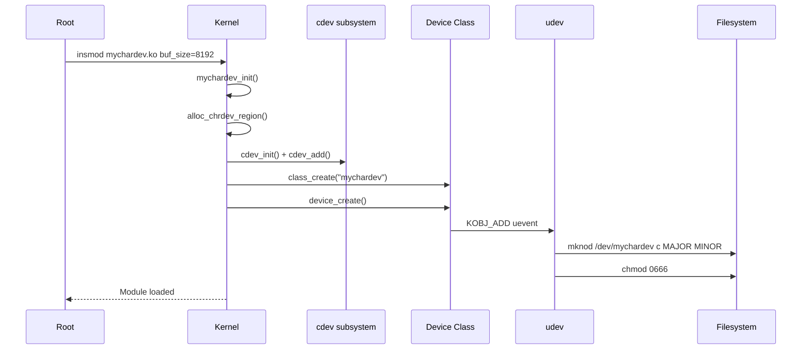
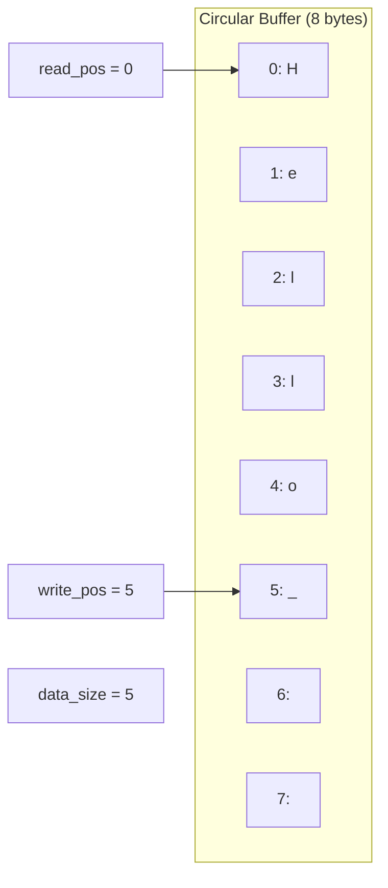

# Chapter 205: Writing a Simple Character Driver — Step by Step

## 1. Introduction

This chapter provides a complete, step-by-step guide to writing a character device driver from scratch. We will build a functional driver that creates a device node in `/dev`, supports read, write, and ioctl operations, handles concurrent access, and integrates properly with the kernel's module and device frameworks. By the end, you will have a working driver skeleton that you can modify for real hardware.

## 2. Intuition

### 2.1 What We're Building

Our driver will create a virtual character device `/dev/mychardev` that:

- Has an internal buffer (like a pipe or FIFO)
- Supports `write()` to add data to the buffer
- Supports `read()` to remove data from the buffer
- Supports `ioctl()` for configuration
- Supports `poll()` for non-blocking I/O
- Handles concurrent access with proper locking
- Works with udev for automatic device node creation

### 2.2 Development Workflow

```
1. Write the driver source (.c)
2. Write a Makefile
3. Build the module (.ko)
4. Load the module (insmod/modprobe)
5. Verify device node creation (/dev/mychardev)
6. Test with userspace program
7. Unload the module (rmmod)
```

## 3. Architecture

### 3.1 Module Structure

```
mychardev.c
├── Module parameters
├── Data structures (my_device)
├── File operations
│   ├── my_open()
│   ├── my_release()
│   ├── my_read()
│   ├── my_write()
│   ├── my_ioctl()
│   ├── my_poll()
│   └── my_llseek()
├── Module init
│   ├── alloc_chrdev_region()
│   ├── cdev_init() + cdev_add()
│   ├── class_create()
│   └── device_create()
└── Module exit
    ├── device_destroy()
    ├── class_destroy()
    ├── cdev_del()
    └── unregister_chrdev_region()
```

### 3.2 Data Flow

```
Userspace write("hello")
    │
    ▼
my_write() called by VFS
    │
    ▼
Copy "hello" from userspace to kernel buffer
    │
    ▼
Wake up any waiting readers
    │
    ▼
Userspace read() → my_read() → copy "hello" to userspace
```

## 4. Kernel Implementation

### 4.1 Key Design Decisions

1. **Buffer size**: Configurable via module parameter (default 4096 bytes)
2. **Blocking behavior**: `read()` blocks when buffer is empty, `write()` blocks when buffer is full
3. **Non-blocking support**: `O_NONBLOCK` returns `-EAGAIN`
4. **Seek support**: `SEEK_SET`, `SEEK_CUR`, `SEEK_END`
5. **Thread safety**: Mutex for all buffer operations
6. **Cleanup**: Proper resource cleanup on error paths and module removal

## 5. Complete Source Code

### 5.1 The Driver (mychardev.c)

```c
/*
 * mychardev.c - A simple character device driver
 *
 * This driver creates a virtual character device with read/write/ioctl/poll
 * support. It demonstrates the complete character device driver framework.
 */

#include <linux/module.h>
#include <linux/kernel.h>
#include <linux/fs.h>
#include <linux/cdev.h>
#include <linux/device.h>
#include <linux/slab.h>
#include <linux/uaccess.h>
#include <linux/mutex.h>
#include <linux/wait.h>
#include <linux/poll.h>
#include <linux/ioctl.h>

#define DEVICE_NAME "mychardev"
#define CLASS_NAME  "mychardev"
#define DEFAULT_BUF_SIZE 4096

/* Module parameters */
static int buf_size = DEFAULT_BUF_SIZE;
module_param(buf_size, int, 0644);
MODULE_PARM_DESC(buf_size, "Buffer size in bytes (default: 4096)");

/* ioctl commands */
#define MYCHARDEV_IOC_MAGIC  'M'
#define MYCHARDEV_IOC_GET_BUFSIZE  _IOR(MYCHARDEV_IOC_MAGIC, 1, int)
#define MYCHARDEV_IOC_CLEAR        _IO(MYCHARDEV_IOC_MAGIC, 2)
#define MYCHARDEV_IOC_SET_NONBLOCK _IO(MYCHARDEV_IOC_MAGIC, 3)
#define MYCHARDEV_IOC_GET_DATASIZE _IOR(MYCHARDEV_IOC_MAGIC, 4, int)

/* Per-device structure */
struct mychardev_dev {
    struct cdev cdev;              /* Character device */
    struct device *device;         /* Device for sysfs/class */
    struct class *class;           /* Device class */
    dev_t devno;                   /* Device number */

    char *buf;                     /* Data buffer */
    size_t buf_size;               /* Total buffer size */
    size_t data_size;              /* Current data in buffer */
    size_t read_pos;               /* Read position */
    size_t write_pos;              /* Write position */

    struct mutex lock;             /* Protects buffer */
    wait_queue_head_t read_wait;   /* Wait queue for readers */
    wait_queue_head_t write_wait;  /* Wait queue for writers */

    atomic_t open_count;           /* Number of openers */
    bool nonblock;                 /* Non-blocking mode */
};

static struct mychardev_dev *mydev;

/* --- File Operations --- */

static int mychardev_open(struct inode *inode, struct file *filp)
{
    struct mychardev_dev *dev;

    dev = container_of(inode->i_cdev, struct mychardev_dev, cdev);
    filp->private_data = dev;

    atomic_inc(&dev->open_count);

    pr_info("mychardev: opened (count=%d)\n",
            atomic_read(&dev->open_count));
    return 0;
}

static int mychardev_release(struct inode *inode, struct file *filp)
{
    struct mychardev_dev *dev = filp->private_data;

    atomic_dec(&dev->open_count);

    pr_info("mychardev: closed (count=%d)\n",
            atomic_read(&dev->open_count));
    return 0;
}

static ssize_t mychardev_read(struct file *filp, char __user *buf,
                               size_t count, loff_t *f_pos)
{
    struct mychardev_dev *dev = filp->private_data;
    ssize_t ret;
    size_t available;

    if (mutex_lock_interruptible(&dev->lock))
        return -ERESTARTSYS;

    /* Wait for data */
    while (dev->data_size == 0) {
        mutex_unlock(&dev->lock);

        if (filp->f_flags & O_NONBLOCK)
            return -EAGAIN;

        if (wait_event_interruptible(dev->read_wait, dev->data_size > 0))
            return -ERESTARTSYS;

        if (mutex_lock_interruptible(&dev->lock))
            return -ERESTARTSYS;
    }

    /* Calculate how much we can read */
    available = dev->data_size;
    if (count > available)
        count = available;

    /* Handle wrap-around */
    if (dev->read_pos + count > dev->buf_size) {
        size_t first = dev->buf_size - dev->read_pos;
        size_t second = count - first;

        if (copy_to_user(buf, dev->buf + dev->read_pos, first)) {
            ret = -EFAULT;
            goto out;
        }
        if (copy_to_user(buf + first, dev->buf, second)) {
            ret = -EFAULT;
            goto out;
        }
    } else {
        if (copy_to_user(buf, dev->buf + dev->read_pos, count)) {
            ret = -EFAULT;
            goto out;
        }
    }

    /* Update read position */
    dev->read_pos = (dev->read_pos + count) % dev->buf_size;
    dev->data_size -= count;
    ret = count;

    /* Wake up writers */
    wake_up_interruptible(&dev->write_wait);

out:
    mutex_unlock(&dev->lock);
    return ret;
}

static ssize_t mychardev_write(struct file *filp, const char __user *buf,
                                size_t count, loff_t *f_pos)
{
    struct mychardev_dev *dev = filp->private_data;
    ssize_t ret;
    size_t space;

    if (mutex_lock_interruptible(&dev->lock))
        return -ERESTARTSYS;

    /* Wait for space */
    while (dev->data_size == dev->buf_size) {
        mutex_unlock(&dev->lock);

        if (filp->f_flags & O_NONBLOCK)
            return -EAGAIN;

        if (wait_event_interruptible(dev->write_wait,
                                      dev->data_size < dev->buf_size))
            return -ERESTARTSYS;

        if (mutex_lock_interruptible(&dev->lock))
            return -ERESTARTSYS;
    }

    /* Calculate how much we can write */
    space = dev->buf_size - dev->data_size;
    if (count > space)
        count = space;

    /* Handle wrap-around */
    if (dev->write_pos + count > dev->buf_size) {
        size_t first = dev->buf_size - dev->write_pos;
        size_t second = count - first;

        if (copy_from_user(dev->buf + dev->write_pos, buf, first)) {
            ret = -EFAULT;
            goto out;
        }
        if (copy_from_user(dev->buf, buf + first, second)) {
            ret = -EFAULT;
            goto out;
        }
    } else {
        if (copy_from_user(dev->buf + dev->write_pos, buf, count)) {
            ret = -EFAULT;
            goto out;
        }
    }

    /* Update write position */
    dev->write_pos = (dev->write_pos + count) % dev->buf_size;
    dev->data_size += count;
    *f_pos += count;
    ret = count;

    /* Wake up readers */
    wake_up_interruptible(&dev->read_wait);

out:
    mutex_unlock(&dev->lock);
    return ret;
}

static loff_t mychardev_llseek(struct file *filp, loff_t offset, int whence)
{
    struct mychardev_dev *dev = filp->private_data;
    loff_t new_pos;

    switch (whence) {
    case SEEK_SET:
        new_pos = offset;
        break;
    case SEEK_CUR:
        new_pos = filp->f_pos + offset;
        break;
    case SEEK_END:
        new_pos = (loff_t)dev->data_size + offset;
        break;
    default:
        return -EINVAL;
    }

    if (new_pos < 0 || new_pos > dev->buf_size)
        return -EINVAL;

    filp->f_pos = new_pos;
    return new_pos;
}

static __poll_t mychardev_poll(struct file *filp, poll_table *wait)
{
    struct mychardev_dev *dev = filp->private_data;
    __poll_t mask = 0;

    poll_wait(filp, &dev->read_wait, wait);
    poll_wait(filp, &dev->write_wait, wait);

    mutex_lock(&dev->lock);

    if (dev->data_size > 0)
        mask |= POLLIN | POLLRDNORM;

    if (dev->data_size < dev->buf_size)
        mask |= POLLOUT | POLLWRNORM;

    mutex_unlock(&dev->lock);

    return mask;
}

static long mychardev_ioctl(struct file *filp, unsigned int cmd,
                             unsigned long arg)
{
    struct mychardev_dev *dev = filp->private_data;
    int val;

    /* Verify ioctl magic */
    if (_IOC_TYPE(cmd) != MYCHARDEV_IOC_MAGIC)
        return -ENOTTY;

    switch (cmd) {
    case MYCHARDEV_IOC_GET_BUFSIZE:
        val = dev->buf_size;
        if (copy_to_user((int __user *)arg, &val, sizeof(val)))
            return -EFAULT;
        return 0;

    case MYCHARDEV_IOC_CLEAR:
        mutex_lock(&dev->lock);
        dev->data_size = 0;
        dev->read_pos = 0;
        dev->write_pos = 0;
        memset(dev->buf, 0, dev->buf_size);
        mutex_unlock(&dev->lock);
        wake_up_interruptible(&dev->write_wait);
        pr_info("mychardev: buffer cleared\n");
        return 0;

    case MYCHARDEV_IOC_SET_NONBLOCK:
        filp->f_flags |= O_NONBLOCK;
        return 0;

    case MYCHARDEV_IOC_GET_DATASIZE:
        mutex_lock(&dev->lock);
        val = dev->data_size;
        mutex_unlock(&dev->lock);
        if (copy_to_user((int __user *)arg, &val, sizeof(val)))
            return -EFAULT;
        return 0;

    default:
        return -ENOTTY;
    }
}

/* --- File Operations Table --- */

static const struct file_operations mychardev_fops = {
    .owner          = THIS_MODULE,
    .open           = mychardev_open,
    .release        = mychardev_release,
    .read           = mychardev_read,
    .write          = mychardev_write,
    .llseek         = mychardev_llseek,
    .poll           = mychardev_poll,
    .unlocked_ioctl = mychardev_ioctl,
    .compat_ioctl   = compat_ptr_ioctl,
};

/* --- Module Init/Exit --- */

static int __init mychardev_init(void)
{
    int ret;

    /* Allocate device structure */
    mydev = kzalloc(sizeof(*mydev), GFP_KERNEL);
    if (!mydev)
        return -ENOMEM;

    /* Allocate buffer */
    mydev->buf_size = buf_size;
    mydev->buf = kzalloc(mydev->buf_size, GFP_KERNEL);
    if (!mydev->buf) {
        ret = -ENOMEM;
        goto err_free_dev;
    }

    /* Initialize synchronization */
    mutex_init(&mydev->lock);
    init_waitqueue_head(&mydev->read_wait);
    init_waitqueue_head(&mydev->write_wait);
    atomic_set(&mydev->open_count, 0);

    /* Allocate device number */
    ret = alloc_chrdev_region(&mydev->devno, 0, 1, DEVICE_NAME);
    if (ret) {
        pr_err("mychardev: failed to allocate device number\n");
        goto err_free_buf;
    }

    /* Initialize cdev */
    cdev_init(&mydev->cdev, &mychardev_fops);
    mydev->cdev.owner = THIS_MODULE;

    /* Add cdev */
    ret = cdev_add(&mydev->cdev, mydev->devno, 1);
    if (ret) {
        pr_err("mychardev: failed to add cdev\n");
        goto err_unreg;
    }

    /* Create device class */
    mydev->class = class_create(CLASS_NAME);
    if (IS_ERR(mydev->class)) {
        ret = PTR_ERR(mydev->class);
        pr_err("mychardev: failed to create class\n");
        goto err_cdev;
    }

    /* Create device node */
    mydev->device = device_create(mydev->class, NULL, mydev->devno,
                                   NULL, DEVICE_NAME);
    if (IS_ERR(mydev->device)) {
        ret = PTR_ERR(mydev->device);
        pr_err("mychardev: failed to create device\n");
        goto err_class;
    }

    pr_info("mychardev: loaded (major=%d, minor=%d, bufsize=%d)\n",
            MAJOR(mydev->devno), MINOR(mydev->devno), mydev->buf_size);
    return 0;

err_class:
    class_destroy(mydev->class);
err_cdev:
    cdev_del(&mydev->cdev);
err_unreg:
    unregister_chrdev_region(mydev->devno, 1);
err_free_buf:
    kfree(mydev->buf);
err_free_dev:
    kfree(mydev);
    return ret;
}

static void __exit mychardev_exit(void)
{
    device_destroy(mydev->class, mydev->devno);
    class_destroy(mydev->class);
    cdev_del(&mydev->cdev);
    unregister_chrdev_region(mydev->devno, 1);
    kfree(mydev->buf);
    kfree(mydev);

    pr_info("mychardev: unloaded\n");
}

module_init(mychardev_init);
module_exit(mychardev_exit);

MODULE_LICENSE("GPL");
MODULE_AUTHOR("Your Name");
MODULE_DESCRIPTION("A simple character device driver");
MODULE_VERSION("1.0");
```

### 5.2 Makefile

```makefile
# Makefile for mychardev kernel module

obj-m += mychardev.o

KDIR ?= /lib/modules/$(shell uname -r)/build
PWD  := $(shell pwd)

all:
	$(MAKE) -C $(KDIR) M=$(PWD) modules

clean:
	$(MAKE) -C $(KDIR) M=$(PWD) clean

install:
	$(MAKE) -C $(KDIR) M=$(PWD) modules_install
	depmod -a

# Load/unload convenience targets
load:
	sudo insmod mychardev.ko buf_size=8192

unload:
	sudo rmmod mychardev

.PHONY: all clean install load unload
```

### 5.3 Userspace Test Program (test_mychardev.c)

```c
/*
 * test_mychardev.c - Test program for mychardev kernel module
 */

#include <stdio.h>
#include <stdlib.h>
#include <string.h>
#include <fcntl.h>
#include <unistd.h>
#include <errno.h>
#include <sys/ioctl.h>
#include <sys/select.h>
#include <pthread.h>

#define DEVICE_PATH "/dev/mychardev"
#define MYCHARDEV_IOC_MAGIC  'M'
#define MYCHARDEV_IOC_GET_BUFSIZE  _IOR(MYCHARDEV_IOC_MAGIC, 1, int)
#define MYCHARDEV_IOC_CLEAR        _IO(MYCHARDEV_IOC_MAGIC, 2)
#define MYCHARDEV_IOC_GET_DATASIZE _IOR(MYCHARDEV_IOC_MAGIC, 4, int)

static void test_basic_rw(void)
{
    int fd;
    char wbuf[] = "Hello, kernel!";
    char rbuf[256];
    ssize_t n;

    printf("=== Test: Basic Read/Write ===\n");

    fd = open(DEVICE_PATH, O_RDWR);
    if (fd < 0) {
        perror("open");
        return;
    }

    /* Write */
    n = write(fd, wbuf, strlen(wbuf));
    printf("  Wrote %zd bytes: '%s'\n", n, wbuf);

    /* Read */
    n = read(fd, rbuf, sizeof(rbuf) - 1);
    if (n > 0) {
        rbuf[n] = '\0';
        printf("  Read %zd bytes: '%s'\n", n, rbuf);
    }

    /* Verify */
    if (n == strlen(wbuf) && memcmp(rbuf, wbuf, n) == 0)
        printf("  PASS: Data matches\n");
    else
        printf("  FAIL: Data mismatch\n");

    close(fd);
}

static void test_ioctl(void)
{
    int fd, bufsize, datasize;
    ssize_t n;

    printf("\n=== Test: ioctl ===\n");

    fd = open(DEVICE_PATH, O_RDWR);
    if (fd < 0) {
        perror("open");
        return;
    }

    /* Get buffer size */
    ioctl(fd, MYCHARDEV_IOC_GET_BUFSIZE, &bufsize);
    printf("  Buffer size: %d\n", bufsize);

    /* Write some data */
    write(fd, "test", 4);

    /* Get data size */
    ioctl(fd, MYCHARDEV_IOC_GET_DATASIZE, &datasize);
    printf("  Data size after write: %d\n", datasize);

    /* Clear buffer */
    ioctl(fd, MYCHARDEV_IOC_CLEAR);
    ioctl(fd, MYCHARDEV_IOC_GET_DATASIZE, &datasize);
    printf("  Data size after clear: %d\n", datasize);

    close(fd);
}

static void test_nonblock(void)
{
    int fd;
    char buf[256];
    ssize_t n;

    printf("\n=== Test: Non-blocking Read ===\n");

    fd = open(DEVICE_PATH, O_RDWR | O_NONBLOCK);
    if (fd < 0) {
        perror("open");
        return;
    }

    /* Try to read from empty buffer */
    n = read(fd, buf, sizeof(buf));
    if (n < 0 && errno == EAGAIN)
        printf("  PASS: Got EAGAIN on empty buffer\n");
    else
        printf("  FAIL: Expected EAGAIN, got %zd (errno=%d)\n", n, errno);

    close(fd);
}

static void test_poll(void)
{
    int fd;
    fd_set rfds;
    struct timeval tv;
    int ret;
    char buf[256];

    printf("\n=== Test: poll/select ===\n");

    fd = open(DEVICE_PATH, O_RDWR | O_NONBLOCK);
    if (fd < 0) {
        perror("open");
        return;
    }

    /* Check if data is available (should not be) */
    FD_ZERO(&rfds);
    FD_SET(fd, &rfds);
    tv.tv_sec = 0;
    tv.tv_usec = 0;

    ret = select(fd + 1, &rfds, NULL, NULL, &tv);
    if (ret == 0)
        printf("  PASS: No data available (select returned 0)\n");
    else
        printf("  FAIL: select returned %d\n", ret);

    /* Write data, then check again */
    write(fd, "poll test", 9);

    FD_ZERO(&rfds);
    FD_SET(fd, &rfds);
    tv.tv_sec = 0;
    tv.tv_usec = 0;

    ret = select(fd + 1, &rfds, NULL, NULL, &tv);
    if (ret > 0 && FD_ISSET(fd, &rfds)) {
        read(fd, buf, sizeof(buf));
        printf("  PASS: Data available after write\n");
    } else {
        printf("  FAIL: Expected data available\n");
    }

    close(fd);
}

static void test_fill_buffer(void)
{
    int fd, bufsize;
    char *wbuf;
    ssize_t n, total;
    int i;

    printf("\n=== Test: Fill Buffer ===\n");

    fd = open(DEVICE_PATH, O_RDWR);
    if (fd < 0) {
        perror("open");
        return;
    }

    ioctl(fd, MYCHARDEV_IOC_GET_BUFSIZE, &bufsize);
    wbuf = malloc(bufsize);
    memset(wbuf, 'A', bufsize);

    /* Fill buffer */
    total = 0;
    for (i = 0; i < 10; i++) {
        n = write(fd, wbuf, bufsize / 10);
        if (n > 0)
            total += n;
        else
            break;
    }
    printf("  Wrote %zd bytes to %d-byte buffer\n", total, bufsize);

    /* Try to write more (should get partial or EAGAIN) */
    n = write(fd, wbuf, 1);
    if (n < 0)
        printf("  Buffer full: write returned %zd (errno=%d: %s)\n",
               n, errno, strerror(errno));
    else
        printf("  Wrote %zd more byte(s)\n", n);

    free(wbuf);
    close(fd);
}

static void *writer_thread(void *arg)
{
    int fd = *(int *)arg;
    char msg[] = "Thread message";
    ssize_t n;

    usleep(100000);  /* Wait 100ms */
    n = write(fd, msg, strlen(msg));
    printf("  Writer thread: wrote %zd bytes\n", n);

    return NULL;
}

static void test_blocking_read(void)
{
    int fd;
    char buf[256];
    ssize_t n;
    pthread_t writer;

    printf("\n=== Test: Blocking Read ===\n");

    fd = open(DEVICE_PATH, O_RDWR);
    if (fd < 0) {
        perror("open");
        return;
    }

    /* Start writer thread */
    pthread_create(&writer, NULL, writer_thread, &fd);

    /* This should block until writer writes */
    printf("  Reader: blocking on read...\n");
    n = read(fd, buf, sizeof(buf) - 1);
    if (n > 0) {
        buf[n] = '\0';
        printf("  Reader: got %zd bytes: '%s'\n", n, buf);
    }

    pthread_join(writer, NULL);
    close(fd);
}

int main(void)
{
    printf("mychardev test program\n");
    printf("======================\n");

    test_basic_rw();
    test_ioctl();
    test_nonblock();
    test_poll();
    test_fill_buffer();
    test_blocking_read();

    printf("\n=== All tests complete ===\n");
    return 0;
}
```

### 5.4 udev Rule

```bash
# /etc/udev/rules.d/99-mychardev.rules
KERNEL=="mychardev", MODE="0666", GROUP="users"
```

## 6. Diagrams

### 6.1 Module Loading Flow



### 6.2 Circular Buffer Operation



## 7. Common Pitfalls

### 7.1 Forgetting THIS_MODULE in file_operations

```c
/* WRONG */
static const struct file_operations fops = {
    .open = my_open,
    /* .owner not set! */
};

/* CORRECT */
static const struct file_operations fops = {
    .owner = THIS_MODULE,
    .open = my_open,
};
```

### 7.2 Not Handling Partial Reads/Writes

```c
/* WRONG: always returning count even if less was available */
return count;

/* CORRECT: return actual bytes read/written */
return actual_bytes;
```

### 7.3 Cleanup Order Errors

```c
/* WRONG */
class_destroy(class);        /* Too early */
device_destroy(class, devno); /* class already gone */

/* CORRECT: reverse order */
device_destroy(class, devno);
class_destroy(class);
cdev_del(&cdev);
unregister_chrdev_region(devno, 1);
```

## 8. Best Practices

### 8.1 Always Use container_of

```c
static int my_open(struct inode *inode, struct file *filp)
{
    struct my_dev *dev = container_of(inode->i_cdev, struct my_dev, cdev);
    filp->private_data = dev;
    return 0;
}
```

### 8.2 Support O_NONBLOCK

```c
if (filp->f_flags & O_NONBLOCK) {
    if (no_data_available)
        return -EAGAIN;
}
```

### 8.3 Use Proper Error Cleanup with goto

```c
ret = alloc_chrdev_region(&devno, 0, 1, name);
if (ret) goto err;
/* ... more init ... */
return 0;
/* ... error cleanup ... */
err:
    return ret;
```

## 9. Exercises

### Exercise 1: Build and Test

Build the driver, load it, run the test program, and verify all tests pass. Experiment with different buffer sizes.

### Exercise 2: Add fasync Support

Add `fasync()` support to the driver so that `fcntl(F_SETSIG)` can be used to receive signals when data arrives.

### Exercise 3: Add procfs Interface

Create a `/proc/mychardev` file that shows the current buffer state (data size, open count, etc.).

### Exercise 4: Multiple Instances

Modify the driver to support multiple device instances (e.g., `/dev/mychardev0`, `/dev/mychardev1`) using a module parameter for the number of instances.

### Exercise 5: mmap Support

Add `mmap()` support to allow userspace to directly map the kernel buffer. Handle page faults and maintain consistency with read/write operations.

## 10. References

### Kernel Source
- `fs/char_dev.c` — Character device infrastructure
- `include/linux/cdev.h` — cdev structure
- `include/linux/fs.h` — file_operations
- `samples/` — Kernel sample drivers

### Books
- *Linux Device Drivers, 3rd Edition* — Chapters 3-5
- *The Linux Kernel Module Programming Guide*

### Online
- https://www.kernel.org/doc/html/latest/driver-api/
- https://lwn.net/Kernel/LDD3/
- https://github.com/sysprog21/lkmpg — Linux Kernel Module Programming Guide

## 11. Deep Dive: Character Device Driver Patterns

### 11.1 Designing the Buffer Strategy

Our driver uses a circular buffer, which is a common pattern for character devices that act as data conduits (like pipes or FIFOs). The circular buffer design has several important properties:

**Wrap-around Handling**: When the write pointer reaches the end of the buffer, it wraps to the beginning. This requires special handling in read and write operations:

```c
/* Write with wrap-around */
if (dev->write_pos + count > dev->buf_size) {
    size_t first = dev->buf_size - dev->write_pos;
    size_t second = count - first;
    memcpy(dev->buf + dev->write_pos, data, first);
    memcpy(dev->buf, data + first, second);
} else {
    memcpy(dev->buf + dev->write_pos, data, count);
}
dev->write_pos = (dev->write_pos + count) % dev->buf_size;
```

**Space Calculation**: The available space is `buf_size - data_size`. The available data is `data_size`. Both must be maintained atomically.

**Empty vs Full**: When `data_size == 0`, the buffer is empty (readers block). When `data_size == buf_size`, the buffer is full (writers block). There's no ambiguity because we track `data_size` separately.

### 11.2 Blocking vs Non-Blocking I/O

The `O_NONBLOCK` flag changes the behavior of read and write:

**Blocking mode** (default):
- `read()` on empty buffer: puts the process to sleep until data arrives
- `write()` on full buffer: puts the process to sleep until space is available

**Non-blocking mode** (`O_NONBLOCK`):
- `read()` on empty buffer: returns `-EAGAIN` immediately
- `write()` on full buffer: returns `-EAGAIN` immediately

The implementation uses `wait_event_interruptible()` for blocking and checks `filp->f_flags & O_NONBLOCK` for non-blocking:

```c
while (dev->data_size == 0) {
    if (filp->f_flags & O_NONBLOCK)
        return -EAGAIN;
    if (wait_event_interruptible(dev->read_wait, dev->data_size > 0))
        return -ERESTARTSYS;  /* Signal received */
}
```

### 11.3 Error Handling Patterns

**Signal Interruption**: `wait_event_interruptible()` can be interrupted by signals. When this happens, the function returns `-ERESTARTSYS`, which tells the VFS to either restart the system call or return `-EINTR` to userspace.

**Partial Transfers**: When a `read()` or `write()` can't transfer the full requested amount, the driver should transfer what it can and return the actual count. This is the standard POSIX behavior.

**Error Cleanup**: When an error occurs mid-transfer (e.g., `copy_to_user()` fails), the driver should clean up any partial state and return the error. It should not report a partial transfer as successful.

### 11.4 The container_of Pattern

The `container_of` macro is fundamental to kernel programming. It retrieves the containing structure from a pointer to a member:

```c
struct my_dev {
    struct cdev cdev;
    int data;
};

/* Given &mydev->cdev, get &mydev */
struct my_dev *dev = container_of(inode->i_cdev, struct my_dev, cdev);
```

This pattern is used everywhere in the kernel because the VFS passes `struct inode *` or `struct file *` to callbacks, and drivers need to access their private data.

### 11.5 Module Parameters

Module parameters allow runtime configuration:

```c
static int buf_size = 4096;
module_param(buf_size, int, 0644);
MODULE_PARM_DESC(buf_size, "Buffer size in bytes");

/* Permissions:
 * 0644 = owner read/write, group/other read (visible in sysfs)
 * 0444 = read-only for everyone
 * 0000 = not visible in sysfs
 */
```

Parameters appear in `/sys/module/mychardev/parameters/buf_size`.

### 11.6 Userspace Testing Strategies

**Automated Testing**: Write test programs that exercise all driver functionality:
- Basic read/write
- Large transfers
- Concurrent access from multiple threads
- Non-blocking I/O
- ioctl commands
- Error conditions (invalid arguments, buffer overflow attempts)

**Stress Testing**: Run long-duration tests to find race conditions:
```bash
# Multiple processes writing simultaneously
for i in $(seq 1 10); do
    dd if=/dev/urandom of=/dev/mychardev bs=4096 &
done
wait
```

**Fuzz Testing**: Use tools like `syzkaller` to automatically generate test cases:
```bash
# syzkaller can find unexpected driver behaviors
# Install and configure for your target kernel
```

### 11.7 Debugging Character Device Issues

**Checking Device Node**:
```bash
ls -la /dev/mychardev
file /dev/mychardev
stat /dev/mychardev
```

**Checking Module Status**:
```bash
lsmod | grep mychardev
cat /proc/devices | grep mychardev
cat /sys/class/mychardev/mychardev/dev
```

**Tracing System Calls**:
```bash
strace -e trace=read,write,ioctl ./test_program
```

**Dynamic Debug**:
```bash
echo "module mychardev +p" > /sys/kernel/debug/dynamic_debug/control
```
