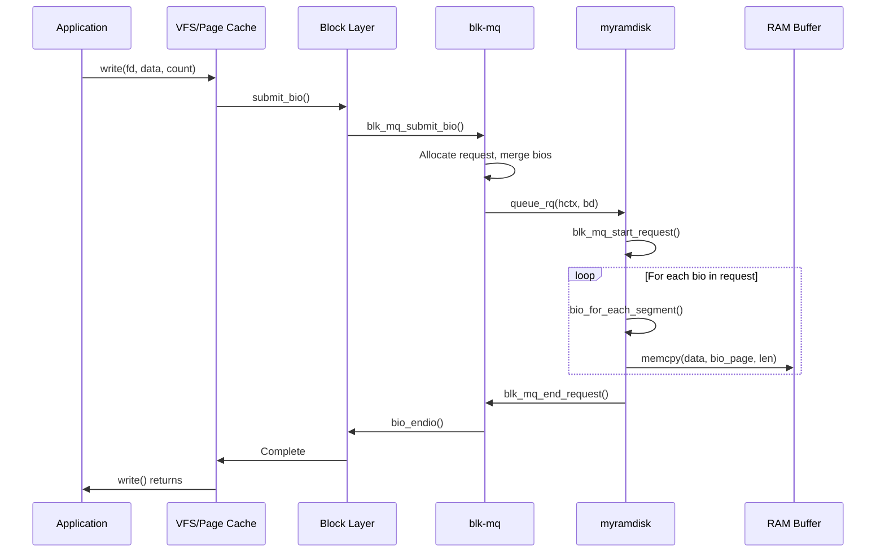
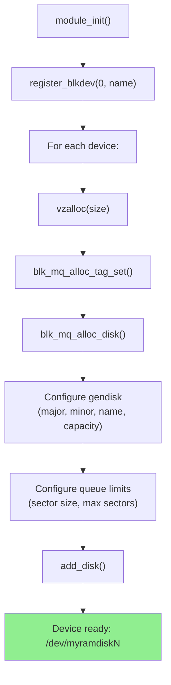

# Chapter 206: Writing a Simple Block Driver — Ramdisk Example

## 1. Introduction

This chapter provides a complete, step-by-step guide to writing a block device driver using the modern blk-mq (block multi-queue) framework. We will build a RAM disk driver that allocates a region of memory and exposes it as a block device. This driver demonstrates the core concepts of block device programming: gendisk setup, request queue configuration, bio handling, and proper integration with the block layer.

## 2. Intuition

### 2.1 What We're Building

Our driver will:

- Allocate a configurable amount of memory (default 16MB)
- Expose it as `/dev/ramdiskN` block device(s)
- Support read and write operations via the blk-mq framework
- Handle bio chains with multiple segments
- Support discard/TRIM operations (zeroing blocks)
- Use proper DMA-safe memory allocation

### 2.2 Block Device vs Character Device

Unlike character devices that deal with byte streams, block devices:
- Operate on fixed-size sectors (512 bytes)
- Go through the block layer's scheduling and merging
- Support random access
- Can be mounted as filesystems

## 3. Architecture

### 3.1 blk-mq Architecture for Our Driver

```
Application: read/write to /dev/ramdisk0
    │
    ▼
VFS → Block Layer → submit_bio()
    │
    ▼
blk-mq: allocate request, merge bios
    │
    ▼
queue_rq() callback → our driver
    │
    ▼
Process bio: memcpy between RAM and bio pages
    │
    ▼
blk_mq_end_request() → completion
    │
    ▼
Application: I/O complete
```

### 3.2 Key Components

1. **gendisk**: Represents the disk device
2. **blk_mq_tag_set**: Defines the hardware queue configuration
3. **block_device_operations**: Device-level operations (open, release, ioctl)
4. **blk_mq_ops**: Request-level operations (queue_rq)

## 4. Complete Source Code

### 4.1 The Driver (myramdisk.c)

```c
/*
 * myramdisk.c - A simple RAM disk block driver using blk-mq
 *
 * This driver creates a virtual block device backed by RAM.
 * It demonstrates the modern blk-mq API for block device drivers.
 */

#include <linux/module.h>
#include <linux/kernel.h>
#include <linux/fs.h>
#include <linux/blkdev.h>
#include <linux/blk-mq.h>
#include <linux/hdreg.h>
#include <linux/slab.h>
#include <linux/vmalloc.h>
#include <linux/bio.h>

#define DEVICE_NAME "myramdisk"
#define SECTOR_SIZE 512
#define DEFAULT_SIZE_MB 16

/* Module parameters */
static int size_mb = DEFAULT_SIZE_MB;
module_param(size_mb, int, 0444);
MODULE_PARM_DESC(size_mb, "RAM disk size in megabytes (default: 16)");

static int num_devices = 1;
module_param(num_devices, int, 0444);
MODULE_PARM_DESC(num_devices, "Number of RAM disk devices (default: 1)");

/* Per-device structure */
struct myramdisk_dev {
    unsigned char *data;            /* Device data buffer */
    size_t size;                    /* Device size in bytes */
    struct gendisk *gd;             /* Gendisk */
    struct blk_mq_tag_set tag_set;  /* blk-mq tag set */
    struct request_queue *queue;    /* Request queue */
    int dev_id;                     /* Device index */
};

static struct myramdisk_dev **devices;
static int major_num;

/* --- Bio Processing --- */

/*
 * Process a single bio: copy data between the RAM disk and bio pages
 */
static void myramdisk_process_bio(struct myramdisk_dev *dev, struct bio *bio)
{
    struct bvec_iter iter;
    struct bio_vec bvec;
    sector_t sector = bio->bi_iter.bi_sector;
    unsigned long offset;
    void *page_addr;

    bio_for_each_segment(bvec, bio, iter) {
        offset = sector * SECTOR_SIZE;

        /* Bounds check */
        if (offset + bvec.bv_len > dev->size) {
            bio->bi_status = BLK_STS_IOERR;
            return;
        }

        page_addr = kmap_local_page(bvec.bv_page);

        switch (bio_op(bio)) {
        case REQ_OP_READ:
            memcpy(page_addr + bvec.bv_offset,
                   dev->data + offset, bvec.bv_len);
            break;

        case REQ_OP_WRITE:
            memcpy(dev->data + offset,
                   page_addr + bvec.bv_offset, bvec.bv_len);
            break;

        case REQ_OP_DISCARD:
        case REQ_OP_SECURE_ERASE:
            /* Zero the discarded region */
            memset(dev->data + offset, 0, bvec.bv_len);
            break;

        default:
            bio->bi_status = BLK_STS_NOTSUPP;
            kunmap_local(page_addr);
            return;
        }

        kunmap_local(page_addr);

        sector += bvec.bv_len / SECTOR_SIZE;
    }

    bio->bi_status = BLK_STS_OK;
}

/* --- blk-mq Operations --- */

/*
 * queue_rq: called by blk-mq when a request is ready to be processed
 */
static blk_status_t myramdisk_queue_rq(struct blk_mq_hw_ctx *hctx,
                                        const struct blk_mq_queue_data *bd)
{
    struct myramdisk_dev *dev = hctx->queue->queuedata;
    struct request *rq = bd->rq;
    struct bio *bio;

    blk_mq_start_request(rq);

    /* Process each bio in the request */
    __rq_for_each_bio(bio, rq)
        myramdisk_process_bio(dev, bio);

    blk_mq_end_request(rq, rq->bio->bi_status);

    return BLK_STS_OK;
}

static const struct blk_mq_ops myramdisk_mq_ops = {
    .queue_rq = myramdisk_queue_rq,
};

/* --- Block Device Operations --- */

static int myramdisk_open(struct block_device *bdev, fmode_t mode)
{
    struct myramdisk_dev *dev = bdev->bd_disk->private_data;

    pr_info("myramdisk%d: opened\n", dev->dev_id);
    return 0;
}

static void myramdisk_release(struct gendisk *gd, fmode_t mode)
{
    struct myramdisk_dev *dev = gd->private_data;

    pr_info("myramdisk%d: closed\n", dev->dev_id);
}

static int myramdisk_getgeo(struct block_device *bdev,
                             struct hd_geometry *geo)
{
    struct myramdisk_dev *dev = bdev->bd_disk->private_data;
    size_t sectors = dev->size / SECTOR_SIZE;

    /*
     * Fake geometry for tools that need it:
     * heads=16, sectors=63, cylinders=calculated
     */
    geo->heads = 16;
    geo->sectors = 63;
    geo->cylinders = sectors / (16 * 63);
    geo->start = 0;

    return 0;
}

static const struct block_device_operations myramdisk_fops = {
    .owner   = THIS_MODULE,
    .open    = myramdisk_open,
    .release = myramdisk_release,
    .getgeo  = myramdisk_getgeo,
};

/* --- Device Setup/Teardown --- */

static int myramdisk_setup_device(struct myramdisk_dev *dev, int id)
{
    int ret;

    dev->dev_id = id;
    dev->size = (size_t)size_mb * 1024 * 1024;

    /* Allocate data buffer */
    dev->data = vzalloc(dev->size);
    if (!dev->data) {
        pr_err("myramdisk%d: failed to allocate %zu bytes\n",
               id, dev->size);
        return -ENOMEM;
    }

    /* Setup blk-mq tag set */
    dev->tag_set.ops = &myramdisk_mq_ops;
    dev->tag_set.nr_hw_queues = 1;
    dev->tag_set.queue_depth = 128;
    dev->tag_set.numa_node = NUMA_NO_NODE;
    dev->tag_set.cmd_size = 0;
    dev->tag_set.flags = BLK_MQ_F_SHOULD_MERGE;
    dev->tag_set.driver_data = dev;

    ret = blk_mq_alloc_tag_set(&dev->tag_set);
    if (ret) {
        pr_err("myramdisk%d: failed to allocate tag set\n", id);
        goto err_vfree;
    }

    /* Allocate gendisk */
    dev->gd = blk_mq_alloc_disk(&dev->tag_set, dev);
    if (IS_ERR(dev->gd)) {
        ret = PTR_ERR(dev->gd);
        pr_err("myramdisk%d: failed to allocate disk\n", id);
        goto err_tags;
    }

    dev->gd->major = major_num;
    dev->gd->first_minor = id;
    dev->gd->minors = 1;
    dev->gd->fops = &myramdisk_fops;
    dev->gd->private_data = dev;
    snprintf(dev->gd->disk_name, DISK_NAME_LEN, "myramdisk%d", id);

    /* Set capacity in sectors */
    set_capacity(dev->gd, dev->size / SECTOR_SIZE);

    /* Configure queue limits */
    blk_queue_logical_block_size(dev->gd->queue, SECTOR_SIZE);
    blk_queue_physical_block_size(dev->gd->queue, SECTOR_SIZE);
    blk_queue_max_hw_sectors(dev->gd->queue, UINT_MAX);
    blk_queue_max_segments(dev->gd->queue, SG_MAX_SEGMENTS);

    /* Enable write cache and discard */
    blk_queue_write_cache(dev->gd->queue, true, true);
    // Note: REQ_OP_DISCARD support requires blk_queue_discard

    /* Register the disk */
    ret = add_disk(dev->gd);
    if (ret) {
        pr_err("myramdisk%d: failed to add disk\n", id);
        goto err_disk;
    }

    pr_info("myramdisk%d: %d MB RAM disk at /dev/%s\n",
            id, size_mb, dev->gd->disk_name);
    return 0;

err_disk:
    put_disk(dev->gd);
err_tags:
    blk_mq_free_tag_set(&dev->tag_set);
err_vfree:
    vfree(dev->data);
    return ret;
}

static void myramdisk_cleanup_device(struct myramdisk_dev *dev)
{
    if (dev->gd) {
        del_gendisk(dev->gd);
        put_disk(dev->gd);
    }
    blk_mq_free_tag_set(&dev->tag_set);
    vfree(dev->data);
}

/* --- Module Init/Exit --- */

static int __init myramdisk_init(void)
{
    int i, ret;

    if (num_devices < 1 || num_devices > 256) {
        pr_err("myramdisk: invalid num_devices (%d)\n", num_devices);
        return -EINVAL;
    }

    if (size_mb < 1 || size_mb > 4096) {
        pr_err("myramdisk: invalid size_mb (%d)\n", size_mb);
        return -EINVAL;
    }

    /* Register block device major number */
    major_num = register_blkdev(0, DEVICE_NAME);
    if (major_num < 0) {
        pr_err("myramdisk: failed to register block device\n");
        return major_num;
    }

    /* Allocate device array */
    devices = kcalloc(num_devices, sizeof(*devices), GFP_KERNEL);
    if (!devices) {
        ret = -ENOMEM;
        goto err_unreg;
    }

    /* Create each device */
    for (i = 0; i < num_devices; i++) {
        devices[i] = kzalloc(sizeof(struct myramdisk_dev), GFP_KERNEL);
        if (!devices[i]) {
            ret = -ENOMEM;
            goto err_cleanup;
        }

        ret = myramdisk_setup_device(devices[i], i);
        if (ret) {
            kfree(devices[i]);
            devices[i] = NULL;
            goto err_cleanup;
        }
    }

    pr_info("myramdisk: loaded (%d x %d MB devices, major %d)\n",
            num_devices, size_mb, major_num);
    return 0;

err_cleanup:
    for (i = 0; i < num_devices; i++) {
        if (devices[i]) {
            myramdisk_cleanup_device(devices[i]);
            kfree(devices[i]);
        }
    }
    kfree(devices);
err_unreg:
    unregister_blkdev(major_num, DEVICE_NAME);
    return ret;
}

static void __exit myramdisk_exit(void)
{
    int i;

    for (i = 0; i < num_devices; i++) {
        if (devices[i]) {
            myramdisk_cleanup_device(devices[i]);
            kfree(devices[i]);
        }
    }
    kfree(devices);
    unregister_blkdev(major_num, DEVICE_NAME);

    pr_info("myramdisk: unloaded\n");
}

module_init(myramdisk_init);
module_exit(myramdisk_exit);

MODULE_LICENSE("GPL");
MODULE_AUTHOR("Your Name");
MODULE_DESCRIPTION("Simple RAM disk block driver using blk-mq");
MODULE_VERSION("1.0");
```

### 4.2 Makefile

```makefile
obj-m += myramdisk.o

KDIR ?= /lib/modules/$(shell uname -r)/build
PWD  := $(shell pwd)

all:
	$(MAKE) -C $(KDIR) M=$(PWD) modules

clean:
	$(MAKE) -C $(KDIR) M=$(PWD) clean

load:
	sudo insmod myramdisk.ko size_mb=64 num_devices=2

unload:
	sudo rmmod myramdisk

test: load
	@echo "=== Creating filesystem ==="
	sudo mkfs.ext4 /dev/myramdisk0
	@echo "=== Mounting ==="
	sudo mkdir -p /mnt/ramdisk
	sudo mount /dev/myramdisk0 /mnt/ramdisk
	@echo "=== Writing test data ==="
	echo "Hello from RAM disk!" | sudo tee /mnt/ramdisk/test.txt
	@echo "=== Reading test data ==="
	cat /mnt/ramdisk/test.txt
	@echo "=== Unmounting ==="
	sudo umount /mnt/ramdisk
	sudo rmdir /mnt/ramdisk
	@echo "=== Test complete ==="

.PHONY: all clean load unload test
```

## 5. Diagrams

### 5.1 Block I/O Flow in Our Driver



### 5.2 Device Setup Flow



## 6. Testing

### 6.1 Basic Test Script

```bash
#!/bin/bash
# test_ramdisk.sh

set -e

echo "=== Loading module ==="
sudo insmod myramdisk.ko size_mb=32 num_devices=1

echo "=== Verifying device ==="
ls -la /dev/myramdisk0

echo "=== Getting device info ==="
sudo fdisk -l /dev/myramdisk0

echo "=== Creating filesystem ==="
sudo mkfs.ext4 -F /dev/myramdisk0

echo "=== Mounting ==="
sudo mkdir -p /mnt/ramdisk
sudo mount /dev/myramdisk0 /mnt/ramdisk

echo "=== Running dd test ==="
sudo dd if=/dev/zero of=/mnt/ramdisk/test bs=1M count=10
sync

echo "=== Reading back ==="
sudo dd if=/mnt/ramdisk/test of=/dev/null bs=1M
sync

echo "=== File listing ==="
ls -la /mnt/ramdisk/

echo "=== Unmounting ==="
sudo umount /mnt/ramdisk
sudo rmdir /mnt/ramdisk

echo "=== Unloading module ==="
sudo rmmod myramdisk

echo "=== All tests passed ==="
```

### 6.2 Performance Test with fio

```ini
# fio_ramdisk.ini
[global]
ioengine=libaio
direct=1
runtime=30
time_based
group_reporting

[randread]
filename=/dev/myramdisk0
rw=randread
bs=4k
iodepth=32
numjobs=4

[randwrite]
filename=/dev/myramdisk0
rw=randwrite
bs=4k
iodepth=32
numjobs=4

[seqread]
filename=/dev/myramdisk0
rw=read
bs=128k
iodepth=16
numjobs=1

[seqwrite]
filename=/dev/myramdisk0
rw=write
bs=128k
iodepth=16
numjobs=1
```

## 7. Common Pitfalls

### 7.1 Wrong Capacity Units

```c
/* WRONG: set_capacity expects sectors, not bytes */
set_capacity(gd, size_bytes);

/* CORRECT: convert to 512-byte sectors */
set_capacity(gd, size_bytes / SECTOR_SIZE);
```

### 7.2 Not Setting Queue Limits

```c
/* WRONG: using default limits */
/* Block layer defaults may not match your device */

/* CORRECT: set limits explicitly */
blk_queue_logical_block_size(q, SECTOR_SIZE);
blk_queue_physical_block_size(q, SECTOR_SIZE);
```

### 7.3 Memory Allocation for DMA

```c
/* WRONG: vmalloc'd memory used for DMA */
dev->data = vmalloc(size);
/* Not DMA-safe! */

/* CORRECT: For RAM disk, vmalloc is fine since we don't do DMA
   But for real devices that DMA, use kmalloc or dma_alloc_coherent */
```

### 7.4 Forgetting to Call add_disk

```c
/* WRONG: creating gendisk but never adding it */
dev->gd = blk_mq_alloc_disk(...);
/* Device never appears in /dev! */

/* CORRECT: always call add_disk */
ret = add_disk(dev->gd);
```

### 7.5 Incorrect Cleanup Order

```c
/* WRONG */
vfree(dev->data);            /* Free data first */
del_gendisk(dev->gd);        /* May still have in-flight I/O! */

/* CORRECT: reverse order */
del_gendisk(dev->gd);         /* Stop accepting I/O */
blk_mq_free_tag_set(&tags);  /* Free tag set */
put_disk(dev->gd);            /* Put gendisk */
vfree(dev->data);             /* Free data last */
```

## 8. Best Practices

### 8.1 Use blk_mq_alloc_disk for Modern Drivers

```c
/* Modern API: combines gendisk and queue allocation */
dev->gd = blk_mq_alloc_disk(&dev->tag_set, dev);
```

### 8.2 Handle bio Errors Properly

```c
static void my_process_bio(struct my_dev *dev, struct bio *bio)
{
    /* ... process ... */
    if (error)
        bio->bi_status = BLK_STS_IOERR;
    else
        bio->bi_status = BLK_STS_OK;
}
```

### 8.3 Set Proper Queue Limits

```c
/* Tell the block layer about your device's capabilities */
blk_queue_logical_block_size(q, 512);    /* Sector size */
blk_queue_physical_block_size(q, 4096);  /* Physical sector */
blk_queue_max_hw_sectors(q, max_sectors); /* Max transfer */
blk_queue_max_segments(q, max_sg);       /* Max SG segments */
```

### 8.4 Support Write Cache

```c
/* Declare write cache support */
blk_queue_write_cache(q, true, true);  /* write cache + FUA */
```

### 8.5 Use module_platform_driver or module_init/exit

```c
/* For platform devices: */
module_platform_driver(my_driver);

/* For block devices (not platform): */
module_init(my_init);
module_exit(my_exit);
```

## 9. Exercises

### Exercise 1: Build and Test

Build the RAM disk driver, load it with `size_mb=32`, format with ext4, mount, create files, and verify data integrity.

### Exercise 2: Multi-Device

Load the driver with `num_devices=4`. Verify all four devices appear in `/dev/`. Format and mount each one independently.

### Exercise 3: Performance Benchmark

Use `fio` to benchmark the RAM disk. Compare sequential vs random, read vs write, different block sizes. What limits performance?

### Exercise 4: Add Discard Support

Implement proper `REQ_OP_DISCARD` handling. Test with `blkdiscard /dev/myramdisk0` and verify the discarded regions are zeroed.

### Exercise 5: Error Injection

Add a module parameter to inject random I/O errors (e.g., 1% of writes fail). Test how the filesystem handles errors.

## 10. References

### Kernel Source
- `block/` — Block layer core
- `block/blk-mq.c` — blk-mq implementation
- `include/linux/blk-mq.h` — blk-mq API
- `include/linux/genhd.h` — gendisk
- `drivers/block/loop.c` — Loop device driver (reference)
- `drivers/block/null_blk.c` — Null block driver (reference)
- `Documentation/block/` — Block layer documentation

### Books
- *Linux Device Drivers, 3rd Edition* — Chapter 16

### Online
- https://www.kernel.org/doc/html/latest/block/
- https://kernel.dk/blk-mq.pdf

## 6. Deep Dive: Key Concepts

### 6.1 The gendisk Structure in Detail

The `gendisk` (generic disk) structure is the central representation of a disk device in the kernel. It ties together the block device number, the request queue, and the device operations. Understanding each field is critical for writing correct block drivers.

**Major and Minor Numbers**: The major number identifies the driver, while the minor number identifies a specific disk instance. When you call `register_blkdev(0, name)`, the kernel dynamically assigns a major number. Each disk gets a unique minor via `first_minor`.

**Minors per Disk**: The `minors` field indicates how many minor numbers this disk reserves. A value of 1 means only one partition is supported (the whole disk). A value of 16 (or 256 for large disks) allows partition detection.

**Disk Name**: The `disk_name` field appears in `/proc/partitions`, `/sys/block/`, and as the device node name. It must be set before `add_disk()`.

**Capacity**: Set via `set_capacity(gd, sectors)`. The value is in 512-byte sectors regardless of the logical block size. The block layer uses this to determine the disk size.

**Block Device Operations**: The `fops` field points to a `block_device_operations` structure that handles device-level operations like `open()`, `release()`, and `ioctl()`. Unlike character device drivers, the actual I/O operations are handled through the request queue, not through `read()`/`write()` in `fops`.

### 6.2 Understanding blk-mq Internals

The blk-mq framework replaces the legacy single-queue block layer with a multi-queue design optimized for modern hardware. Understanding its internals helps write better drivers.

**Tag Sets**: A `blk_mq_tag_set` describes the hardware queues. Each tag set defines:
- `nr_hw_queues`: Number of hardware dispatch queues (typically 1 per CPU or 1 per device queue)
- `queue_depth`: Maximum number of outstanding requests per queue
- `cmd_size`: Extra bytes allocated with each request for driver-private data

**Request Lifecycle in blk-mq**:
1. `submit_bio()` enters the block layer
2. The bio is assigned to a software staging queue (per-CPU)
3. The staging queue dispatches to a hardware dispatch queue
4. `queue_rq()` is called — the driver processes the request
5. On completion, `blk_mq_end_request()` frees the request and notifies waiters

**Tags**: Each in-flight request gets a unique tag (integer). Tags are used to match completions with requests, enabling lock-free completion. The tag set pre-allocates tags at initialization.

### 6.3 Bio Processing Patterns

The `bio` structure represents a single block I/O operation. A request may contain multiple bios (merged by the block layer). Each bio contains a vector of `bio_vec` entries, each pointing to a physical page, offset, and length.

**Iterating Over Bio Segments**:
```c
struct bvec_iter iter;
struct bio_vec bvec;

bio_for_each_segment(bvec, bio, iter) {
    void *page_addr = kmap_local_page(bvec.bv_page);
    /* Access data at page_addr + bvec.bv_offset, length bvec.bv_len */
    kunmap_local(page_addr);
}
```

**Handling Different Operations**: Block drivers must handle at least `REQ_OP_READ` and `REQ_OP_WRITE`. Other operations include:
- `REQ_OP_FLUSH`: Synchronize data to persistent storage
- `REQ_OP_DISCARD`: Indicate data is no longer needed
- `REQ_OP_SECURE_ERASE`: Securely erase data
- `REQ_OP_WRITE_ZEROES`: Write zeros efficiently

**Error Handling**: Set `bio->bi_status` to an appropriate `blk_status_t` value:
- `BLK_STS_OK`: Success
- `BLK_STS_IOERR`: Generic I/O error
- `BLK_STS_NOTSUPP`: Operation not supported
- `BLK_STS_NOSPC`: No space (for thin provisioning)

### 6.4 Queue Limits and Their Significance

Setting proper queue limits is essential for correct operation and performance:

```c
blk_queue_logical_block_size(q, 512);
```
This tells the block layer the minimum unit of I/O. All bios will be aligned to this size. Setting it wrong causes alignment errors.

```c
blk_queue_physical_block_size(q, 4096);
```
This represents the physical sector size of the underlying storage. The block layer uses it for alignment and to optimize write patterns. For SSDs, this is typically the NAND page size.

```c
blk_queue_max_hw_sectors(q, max);
```
Maximum transfer size in sectors. The block layer will split bios that exceed this limit. For RAM disks, this can be `UINT_MAX`. For real devices, it depends on DMA constraints.

```c
blk_queue_max_segments(q, max);
```
Maximum number of scatter-gather segments per request. Each `bio_vec` is a segment. Real devices have DMA scatter-gather list depth limits.

```c
blk_queue_max_segment_size(q, max);
```
Maximum size of a single scatter-gather segment. Some devices can't handle segments larger than a page.

### 6.5 Testing and Validation

**mkfs + mount test**: The most basic validation — create a filesystem, mount it, write and read files:
```bash
mkfs.ext4 /dev/myramdisk0
mount /dev/myramdisk0 /mnt/test
echo "hello" > /mnt/test/file.txt
cat /mnt/test/file.txt
umount /mnt/test
```

**dd test**: Raw I/O test without filesystem overhead:
```bash
dd if=/dev/zero of=/dev/myramdisk0 bs=1M count=10
dd if=/dev/myramdisk0 of=/dev/null bs=1M count=10
```

**fio test**: Professional I/O benchmarking with various patterns:
```bash
fio --name=test --filename=/dev/myramdisk0 --rw=randread --bs=4k --iodepth=32
```

**Integrity test**: Write known patterns and verify:
```bash
dd if=/dev/urandom of=/tmp/testdata bs=1M count=10
dd if=/tmp/testdata of=/dev/myramdisk0 bs=1M
dd if=/dev/myramdisk0 of=/tmp/readback bs=1M count=10
cmp /tmp/testdata /tmp/readback
```

### 6.6 Advanced Block Driver Patterns

**Multi-Queue with Per-CPU Queues**: For high-performance drivers, map hardware queues to CPUs:

```c
/* Setup with multiple hardware queues */
dev->tag_set.nr_hw_queues = num_online_cpus();
dev->tag_set.queue_depth = 256;

/* In queue_rq, determine which hardware queue to use */
static blk_status_t my_queue_rq(struct blk_mq_hw_ctx *hctx,
                                 const struct blk_mq_queue_data *bd)
{
    struct my_hw_queue *hq = hctx->driver_data;
    /* Use hq (per-CPU hardware queue) for this request */
    /* ... */
}
```

**Request Payload Access**: Access request data through the bio chain:

```c
struct request *rq = bd->rq;
sector_t sector = blk_rq_pos(rq);      /* Starting sector */
unsigned int bytes = blk_rq_bytes(rq);  /* Total bytes */
unsigned int nr_sectors = blk_rq_sectors(rq); /* Number of sectors */

/* Iterate over bios in the request */
struct bio *bio;
__rq_for_each_bio(bio, rq) {
    /* Process each bio */
}
```

**Per-Request Private Data**: Store driver-private data with each request:

```c
/* Set cmd_size in tag_set */
dev->tag_set.cmd_size = sizeof(struct my_request_data);

/* Access in queue_rq */
struct my_request_data *prd = blk_mq_rq_to_pdu(rq);
prd->timestamp = ktime_get();
prd->retry_count = 0;
```

**Write Cache and Flush Support**: Modern filesystems expect flush support:

```c
/* Declare write cache support */
blk_queue_write_cache(q, true, true);

/* In queue_rq, handle flush requests */
if (req_op(rq) == REQ_OP_FLUSH) {
    /* Flush device write cache */
    my_flush_cache(dev);
    blk_mq_end_request(rq, BLK_STS_OK);
    return BLK_STS_OK;
}
```

**Discard/Trim Support**: Allow filesystems to inform the driver about unused blocks:

```c
/* Enable discard */
blk_queue_max_discard_sectors(q, UINT_MAX);
q->limits.discard_granularity = SECTOR_SIZE;

/* In queue_rq */
if (req_op(rq) == REQ_OP_DISCARD) {
    sector_t start = blk_rq_pos(rq);
    unsigned int len = blk_rq_bytes(rq);
    my_discard_range(dev, start, len);
    blk_mq_end_request(rq, BLK_STS_OK);
    return BLK_STS_OK;
}
```

### 6.7 Error Handling Strategies

**Retry Logic**: Some errors are transient and can be retried:

```c
#define MAX_RETRIES 3

static void my_process_request(struct my_dev *dev, struct request *rq)
{
    int retries = 0;
    blk_status_t err;

    do {
        err = my_do_hw_io(dev, rq);
        if (err == BLK_STS_OK)
            break;
        retries++;
    } while (retries < MAX_RETRIES);

    blk_mq_end_request(rq, err);
}
```

**Error Propagation**: Different error types have different meanings:

```c
blk_status_t err;
switch (hw_status) {
case HW_OK:
    err = BLK_STS_OK;
    break;
case HW_MEDIA_ERROR:
    err = BLK_STS_MEDIUM;      /* Bad sector */
    break;
case HW_TIMEOUT:
    err = BLK_STS_TIMEOUT;     /* Operation timed out */
    break;
case HW_NOT_READY:
    err = BLK_STS_AGAIN;       /* Retry later */
    break;
default:
    err = BLK_STS_IOERR;       /* Generic I/O error */
    break;
}
```

### 6.8 Performance Monitoring

**Queue Statistics**: Monitor request queue performance:

```bash
# Check queue depth
cat /sys/block/ramdisk0/queue/nr_requests

# Check scheduler
cat /sys/block/ramdisk0/queue/scheduler

# I/O statistics
iostat -x 1

# Per-process I/O
iotop
```

**Block Tracing**: Use ftrace to trace block I/O:

```bash
echo 1 > /sys/kernel/debug/tracing/events/block/block_rq_issue/enable
echo 1 > /sys/kernel/debug/tracing/events/block/block_rq_complete/enable
echo 1 > /sys/kernel/debug/tracing/tracing_on
cat /sys/kernel/debug/tracing/trace
```
