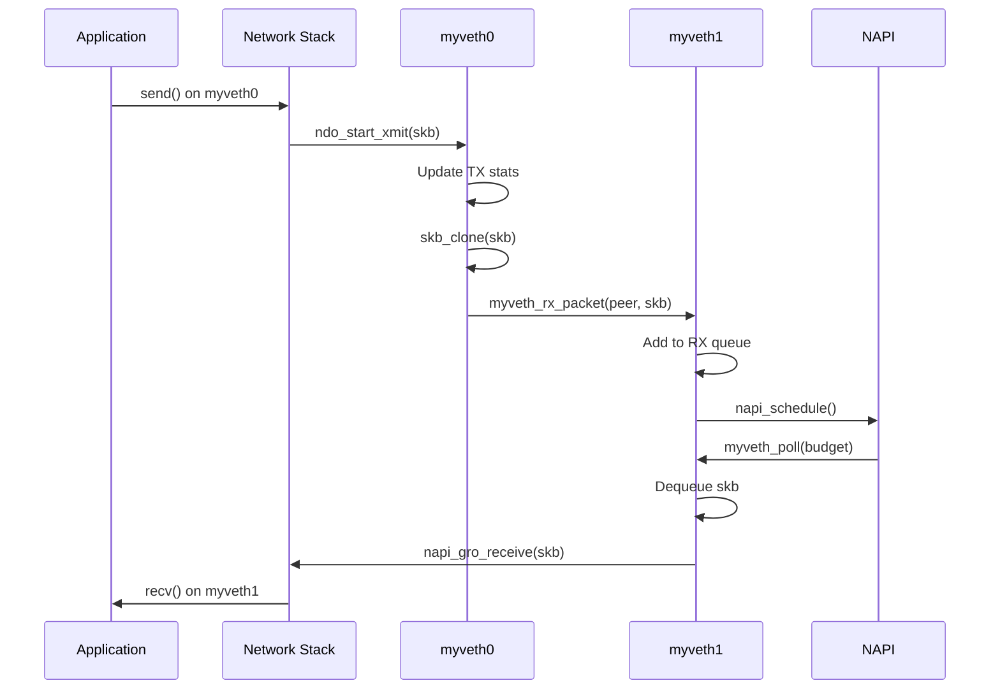
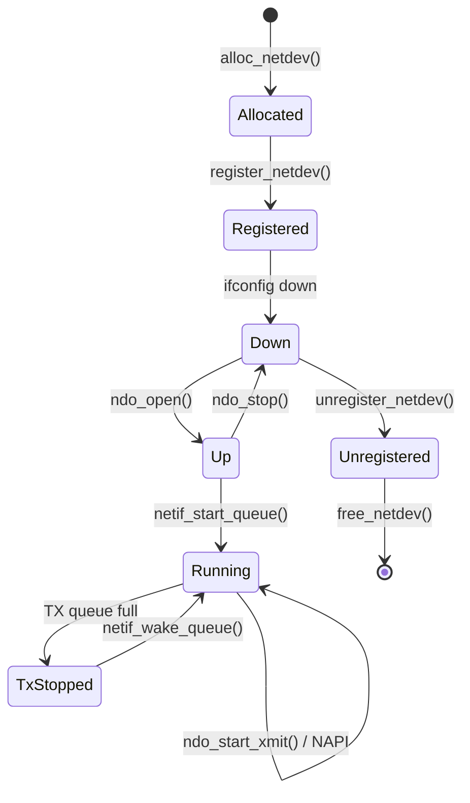

# Chapter 207: Writing a Simple Network Driver — veth-like Skeleton

## 1. Introduction

This chapter provides a complete, step-by-step guide to writing a network device driver. We will build a virtual Ethernet driver similar to `veth` — packets transmitted on one interface are received on another. This driver demonstrates the core concepts of network device programming: `net_device` allocation, `ndo_ops` implementation, `sk_buff` handling, NAPI polling, and proper integration with the networking stack.

## 2. Intuition

### 2.1 What We're Building

Our driver will:

- Create a pair of virtual Ethernet interfaces (`myveth0` and `myveth1`)
- Loop transmitted packets from one interface to the other
- Support NAPI for efficient packet processing
- Implement basic ethtool operations
- Handle MTU changes, link state, and multicast

### 2.2 Network Driver Concepts

A network driver needs to implement:

1. **`ndo_open()`**: Bring the interface up (allocate resources, start queues)
2. **`ndo_stop()`**: Bring the interface down (free resources, stop queues)
3. **`ndo_start_xmit()`**: Transmit a packet
4. **`ndo_set_rx_mode()`**: Handle multicast/promiscuous mode changes
5. **`ndo_change_mtu()`**: Handle MTU changes
6. **`ndo_get_stats64()`**: Return interface statistics
7. **`ndo_tx_timeout()`**: Handle TX timeout

## 3. Architecture

### 3.1 Virtual Ethernet Pair

```
┌─────────────────┐     ┌─────────────────┐
│    myveth0       │     │    myveth1       │
│                  │     │                  │
│  TX → ──────── → RX    │  TX → ──────── → RX    │
│  RX ← ←──────── TX    │  RX ← ←──────── TX    │
│                  │     │                  │
│  [NAPI poll]     │     │  [NAPI poll]     │
└─────────────────┘     └─────────────────┘
        │                        │
        └────── sk_buff ─────────┘
              (loopback)
```

### 3.2 Packet Flow

```
Application sends on myveth0:
    socket → TCP/IP → dev_queue_xmit(skb)
    → myveth0.ndo_start_xmit(skb)
    → skb->dev = myveth1
    → netif_rx(skb) or napi_gro_receive()
    → myveth1 receives packet
    → Network stack processes → Application reads
```

## 4. Complete Source Code

### 4.1 The Driver (myveth.c)

```c
/*
 * myveth.c - A virtual Ethernet pair driver
 *
 * Creates a pair of virtual Ethernet interfaces. Packets sent on one
 * interface are received on the other, similar to the veth driver.
 */

#include <linux/module.h>
#include <linux/kernel.h>
#include <linux/netdevice.h>
#include <linux/etherdevice.h>
#include <linux/skbuff.h>
#include <linux/ethtool.h>
#include <linux/if_ether.h>

#define MYVETH_DRV_NAME   "myveth"
#define MYVETH_MTU        1500
#define MYVETH_TX_QUEUE_LEN 1000
#define NAPI_WEIGHT       64

/* Per-device private data */
struct myveth_priv {
    struct net_device *dev;
    struct net_device *peer;          /* Peer device */
    struct napi_struct napi;
    struct sk_buff_head rx_queue;     /* Simulated RX queue */
    spinlock_t lock;

    /* Statistics */
    u64_stats_t tx_packets;
    u64_stats_t tx_bytes;
    u64_stats_t rx_packets;
    u64_stats_t rx_bytes;
    u64_stats_t tx_dropped;
    struct u64_stats_sync syncp;
};

static struct net_device *myveth_devs[2];

/* --- Packet Processing --- */

/*
 * Receive a packet: add to RX queue and schedule NAPI
 */
static void myveth_rx_packet(struct myveth_priv *priv, struct sk_buff *skb)
{
    /* Set up skb for receive */
    skb->dev = priv->dev;
    skb->protocol = eth_type_trans(skb, priv->dev);
    skb->ip_summed = CHECKSUM_UNNECESSARY;

    /* Add to RX queue */
    spin_lock_bh(&priv->lock);
    skb_queue_tail(&priv->rx_queue, skb);
    spin_unlock_bh(&priv->lock);

    /* Schedule NAPI */
    napi_schedule(&priv->napi);
}

/* --- NAPI Poll --- */

static int myveth_poll(struct napi_struct *napi, int budget)
{
    struct myveth_priv *priv = container_of(napi, struct myveth_priv, napi);
    struct sk_buff *skb;
    int work_done = 0;

    while (work_done < budget) {
        spin_lock_bh(&priv->lock);
        skb = skb_dequeue(&priv->rx_queue);
        spin_unlock_bh(&priv->lock);

        if (!skb)
            break;

        /* Pass to network stack */
        napi_gro_receive(napi, skb);

        u64_stats_update_begin(&priv->syncp);
        u64_stats_inc(&priv->rx_packets);
        u64_stats_add(&priv->rx_bytes, skb->len);
        u64_stats_update_end(&priv->syncp);

        work_done++;
    }

    if (work_done < budget) {
        napi_complete_done(napi, work_done);
    }

    return work_done;
}

/* --- net_device_ops --- */

static netdev_tx_t myveth_xmit(struct sk_buff *skb,
                                struct net_device *dev)
{
    struct myveth_priv *priv = netdev_priv(dev);
    struct myveth_priv *peer_priv;
    struct sk_buff *new_skb;

    /* Drop oversized packets */
    if (skb->len > dev->mtu + ETH_HLEN) {
        dev_kfree_skb_any(skb);
        u64_stats_update_begin(&priv->syncp);
        u64_stats_inc(&priv->tx_dropped);
        u64_stats_update_end(&priv->syncp);
        return NETDEV_TX_OK;
    }

    /* Get peer device */
    if (!priv->peer) {
        dev_kfree_skb_any(skb);
        u64_stats_update_begin(&priv->syncp);
        u64_stats_inc(&priv->tx_dropped);
        u64_stats_update_end(&priv->syncp);
        return NETDEV_TX_OK;
    }

    peer_priv = netdev_priv(priv->peer);

    /* Clone the skb for the peer */
    new_skb = skb_clone(skb, GFP_ATOMIC);
    if (!new_skb) {
        dev_kfree_skb_any(skb);
        u64_stats_update_begin(&priv->syncp);
        u64_stats_inc(&priv->tx_dropped);
        u64_stats_update_end(&priv->syncp);
        return NETDEV_TX_OK;
    }

    /* Update TX stats */
    u64_stats_update_begin(&priv->syncp);
    u64_stats_inc(&priv->tx_packets);
    u64_stats_add(&priv->tx_bytes, skb->len);
    u64_stats_update_end(&priv->syncp);

    /* Free original skb */
    dev_consume_skb_any(skb);

    /* Deliver to peer */
    myveth_rx_packet(peer_priv, new_skb);

    return NETDEV_TX_OK;
}

static int myveth_open(struct net_device *dev)
{
    struct myveth_priv *priv = netdev_priv(dev);

    napi_enable(&priv->napi);
    netif_start_queue(dev);
    netif_carrier_on(dev);

    pr_info("%s: interface up\n", dev->name);
    return 0;
}

static int myveth_stop(struct net_device *dev)
{
    struct myveth_priv *priv = netdev_priv(dev);

    netif_carrier_off(dev);
    netif_stop_queue(dev);
    napi_disable(&priv->napi);

    /* Flush RX queue */
    skb_queue_purge(&priv->rx_queue);

    pr_info("%s: interface down\n", dev->name);
    return 0;
}

static void myveth_get_stats64(struct net_device *dev,
                                struct rtnl_link_stats64 *stats)
{
    struct myveth_priv *priv = netdev_priv(dev);
    unsigned int start;

    do {
        start = u64_stats_fetch_begin(&priv->syncp);
        stats->tx_packets = u64_stats_read(&priv->tx_packets);
        stats->tx_bytes = u64_stats_read(&priv->tx_bytes);
        stats->rx_packets = u64_stats_read(&priv->rx_packets);
        stats->rx_bytes = u64_stats_read(&priv->rx_bytes);
        stats->tx_dropped = u64_stats_read(&priv->tx_dropped);
    } while (u64_stats_fetch_retry(&priv->syncp, start));
}

static int myveth_change_mtu(struct net_device *dev, int new_mtu)
{
    if (new_mtu < ETH_MIN_MTU || new_mtu > 65535)
        return -EINVAL;

    dev->mtu = new_mtu;
    return 0;
}

static void myveth_tx_timeout(struct net_device *dev, unsigned int txqueue)
{
    pr_warn("%s: TX timeout\n", dev->name);
    netif_wake_queue(dev);
}

static netdev_features_t myveth_fix_features(struct net_device *dev,
                                              netdev_features_t features)
{
    return features;
}

static const struct net_device_ops myveth_netdev_ops = {
    .ndo_open            = myveth_open,
    .ndo_stop            = myveth_stop,
    .ndo_start_xmit      = myveth_xmit,
    .ndo_get_stats64     = myveth_get_stats64,
    .ndo_change_mtu      = myveth_change_mtu,
    .ndo_tx_timeout      = myveth_tx_timeout,
    .ndo_set_rx_mode     = NULL,  /* Accept all for virtual device */
    .ndo_fix_features    = myveth_fix_features,
};

/* --- Ethtool Operations --- */

static const char myveth_stats_strings[][ETH_GSTRING_LEN] = {
    "tx_packets",
    "tx_bytes",
    "rx_packets",
    "rx_bytes",
    "tx_dropped",
};

static int myveth_get_sset_count(struct net_device *dev, int sset)
{
    if (sset == ETH_SS_STATS)
        return ARRAY_SIZE(myveth_stats_strings);
    return -EOPNOTSUPP;
}

static void myveth_get_strings(struct net_device *dev, u32 sset, u8 *data)
{
    if (sset == ETH_SS_STATS)
        memcpy(data, myveth_stats_strings, sizeof(myveth_stats_strings));
}

static void myveth_get_ethtool_stats(struct net_device *dev,
                                      struct ethtool_stats *stats, u64 *data)
{
    struct myveth_priv *priv = netdev_priv(dev);
    unsigned int start;

    do {
        start = u64_stats_fetch_begin(&priv->syncp);
        data[0] = u64_stats_read(&priv->tx_packets);
        data[1] = u64_stats_read(&priv->tx_bytes);
        data[2] = u64_stats_read(&priv->rx_packets);
        data[3] = u64_stats_read(&priv->rx_bytes);
        data[4] = u64_stats_read(&priv->tx_dropped);
    } while (u64_stats_fetch_retry(&priv->syncp, start));
}

static void myveth_get_drvinfo(struct net_device *dev,
                                struct ethtool_drvinfo *info)
{
    strscpy(info->driver, MYVETH_DRV_NAME, sizeof(info->driver));
    strscpy(info->version, "1.0", sizeof(info->version));
}

static const struct ethtool_ops myveth_ethtool_ops = {
    .get_drvinfo     = myveth_get_drvinfo,
    .get_sset_count  = myveth_get_sset_count,
    .get_strings     = myveth_get_strings,
    .get_ethtool_stats = myveth_get_ethtool_stats,
    .get_link        = ethtool_op_get_link,
};

/* --- Device Setup --- */

static void myveth_setup(struct net_device *dev)
{
    struct myveth_priv *priv;

    dev->netdev_ops = &myveth_netdev_ops;
    dev->ethtool_ops = &myveth_ethtool_ops;
    dev->watchdog_timeo = 5 * HZ;

    /* Ethernet setup */
    ether_setup(dev);
    dev->flags |= IFF_NOARP;
    dev->features |= NETIF_F_HW_CSUM | NETIF_F_SG;
    dev->hw_features |= NETIF_F_HW_CSUM | NETIF_F_SG;
    dev->mtu = MYVETH_MTU;
    dev->tx_queue_len = MYVETH_TX_QUEUE_LEN;

    /* Initialize private data */
    priv = netdev_priv(dev);
    priv->dev = dev;
    skb_queue_head_init(&priv->rx_queue);
    spin_lock_init(&priv->lock);
    u64_stats_init(&priv->syncp);

    /* Add NAPI */
    netif_napi_add(dev, &priv->napi, myveth_poll, NAPI_WEIGHT);
}

/* --- Module Init/Exit --- */

static int __init myveth_init(void)
{
    struct myveth_priv *priv0, *priv1;
    int ret;

    /* Allocate first device */
    myveth_devs[0] = alloc_netdev(sizeof(struct myveth_priv), "myveth%d",
                                   NET_NAME_UNKNOWN, myveth_setup);
    if (!myveth_devs[0])
        return -ENOMEM;

    /* Allocate second device */
    myveth_devs[1] = alloc_netdev(sizeof(struct myveth_priv), "myveth%d",
                                   NET_NAME_UNKNOWN, myveth_setup);
    if (!myveth_devs[1]) {
        ret = -ENOMEM;
        goto err_free_dev0;
    }

    /* Set up peer relationship */
    priv0 = netdev_priv(myveth_devs[0]);
    priv1 = netdev_priv(myveth_devs[1]);
    priv0->peer = myveth_devs[1];
    priv1->peer = myveth_devs[0];

    /* Register devices */
    ret = register_netdev(myveth_devs[0]);
    if (ret)
        goto err_free_dev1;

    ret = register_netdev(myveth_devs[1]);
    if (ret)
        goto err_unreg_dev0;

    pr_info("myveth: created pair %s <-> %s\n",
            myveth_devs[0]->name, myveth_devs[1]->name);
    return 0;

err_unreg_dev0:
    unregister_netdev(myveth_devs[0]);
err_free_dev1:
    free_netdev(myveth_devs[1]);
err_free_dev0:
    free_netdev(myveth_devs[0]);
    return ret;
}

static void __exit myveth_exit(void)
{
    /* Clear peer references */
    ((struct myveth_priv *)netdev_priv(myveth_devs[0]))->peer = NULL;
    ((struct myveth_priv *)netdev_priv(myveth_devs[1]))->peer = NULL;

    unregister_netdev(myveth_devs[1]);
    unregister_netdev(myveth_devs[0]);
    free_netdev(myveth_devs[1]);
    free_netdev(myveth_devs[0]);

    pr_info("myveth: removed pair\n");
}

module_init(myveth_init);
module_exit(myveth_exit);

MODULE_LICENSE("GPL");
MODULE_AUTHOR("Your Name");
MODULE_DESCRIPTION("Virtual Ethernet pair driver");
MODULE_VERSION("1.0");
```

### 4.2 Makefile

```makefile
obj-m += myveth.o

KDIR ?= /lib/modules/$(shell uname -r)/build
PWD  := $(shell pwd)

all:
	$(MAKE) -C $(KDIR) M=$(PWD) modules

clean:
	$(MAKE) -C $(KDIR) M=$(PWD) clean

load:
	sudo insmod myveth.ko

unload:
	sudo rmmod myveth

test: load
	@echo "=== Setting up interfaces ==="
	sudo ip addr add 10.0.0.1/24 dev myveth0
	sudo ip addr add 10.0.0.2/24 dev myveth1
	sudo ip link set myveth0 up
	sudo ip link set myveth1 up
	@echo "=== Testing connectivity ==="
	ping -c 3 10.0.0.2
	@echo "=== Interface info ==="
	ip addr show myveth0
	ip addr show myveth1
	@echo "=== Test complete ==="

.PHONY: all clean load unload test
```

## 5. Diagrams

### 5.1 Packet Loopback Flow



### 5.2 Network Driver State Machine



## 6. Testing

### 6.1 Basic Connectivity Test

```bash
#!/bin/bash
set -e

echo "=== Loading driver ==="
sudo insmod myveth.ko

echo "=== Configuring interfaces ==="
sudo ip link set myveth0 up
sudo ip link set myveth1 up
sudo ip addr add 192.168.100.1/24 dev myveth0
sudo ip addr add 192.168.100.2/24 dev myveth1

echo "=== Testing ping ==="
ping -c 3 192.168.100.2

echo "=== Testing throughput ==="
# Start iperf server on myveth1
iperf3 -s -D -p 5201
sleep 1
# Run client on myveth0
iperf3 -c 192.168.100.2 -p 5201 -t 5

echo "=== Ethtool stats ==="
ethtool -S myveth0
ethtool -S myveth1

echo "=== Cleanup ==="
killall iperf3 2>/dev/null || true
sudo ip addr del 192.168.100.1/24 dev myveth0
sudo ip addr del 192.168.100.2/24 dev myveth1
sudo ip link set myveth0 down
sudo ip link set myveth1 down
sudo rmmod myveth

echo "=== Tests complete ==="
```

## 7. Common Pitfalls

### 7.1 Not Stopping Queue Before Freeing Resources

```c
/* WRONG */
static int my_stop(struct net_device *dev)
{
    free_my_resources(dev);
    return 0;
}

/* CORRECT */
static int my_stop(struct net_device *dev)
{
    netif_stop_queue(dev);
    napi_disable(&priv->napi);
    synchronize_net();
    free_my_resources(dev);
    return 0;
}
```

### 7.2 Returning NETDEV_TX_BUSY Without Stopping Queue

```c
/* WRONG: returning BUSY without stopping queue */
if (ring_full)
    return NETDEV_TX_BUSY;  /* Queue still running, will loop! */

/* CORRECT: stop queue first, then return BUSY */
if (ring_full) {
    netif_stop_queue(dev);
    return NETDEV_TX_BUSY;
}
```

### 7.3 Not Freeing skb on Error

```c
/* WRONG: dropping skb without freeing */
if (error)
    return NETDEV_TX_OK;  /* SKB leaked! */

/* CORRECT: always free skb on error */
if (error) {
    dev_kfree_skb_any(skb);
    return NETDEV_TX_OK;
}
```

### 7.4 Using GFP_KERNEL in ndo_start_xmit

```c
/* WRONG: sleeping allocation in xmit */
skb = netdev_alloc_skb(dev, len);  /* May sleep with GFP_KERNEL */

/* CORRECT: use GFP_ATOMIC in xmit context */
skb = alloc_skb(len, GFP_ATOMIC);
```

### 7.5 Forgetting napi_complete

```c
/* WRONG: never calling napi_complete */
static int my_poll(struct napi_struct *napi, int budget)
{
    /* process packets */
    return work_done;  /* NAPI never rescheduled properly */
}

/* CORRECT: call napi_complete when done */
static int my_poll(struct napi_struct *napi, int budget)
{
    /* process packets */
    if (work_done < budget)
        napi_complete_done(napi, work_done);
    return work_done;
}
```

## 8. Best Practices

### 8.1 Use u64_stats for Statistics

```c
/* Safe on 32-bit systems */
u64_stats_update_begin(&priv->syncp);
u64_stats_inc(&priv->tx_packets);
u64_stats_add(&priv->tx_bytes, skb->len);
u64_stats_update_end(&priv->syncp);
```

### 8.2 Use dev_consume_skb_any for TX Completion

```c
/* For normal TX completion (packet sent successfully) */
dev_consume_skb_any(skb);

/* For TX errors/drops */
dev_kfree_skb_any(skb);
```

### 8.3 Set Proper Features

```c
/* Declare supported features */
dev->features = NETIF_F_SG | NETIF_F_HW_CSUM | NETIF_F_RXCSUM;
dev->hw_features = dev->features;  /* User can toggle */
dev->vlan_features = dev->features; /* VLAN offload */
```

### 8.4 Use netif_napi_add_weight for Custom Weight

```c
/* Default weight is usually fine, but can customize */
netif_napi_add(dev, &priv->napi, my_poll, 64);
```

### 8.5 Proper Peer Cleanup

```c
/* In module exit, clear peer references before unregistering */
static void __exit my_exit(void)
{
    priv0->peer = NULL;
    priv1->peer = NULL;
    /* ... unregister ... */
}
```

## 9. Exercises

### Exercise 1: Build and Test

Build the driver, load it, configure IP addresses, and ping between the two interfaces. Verify connectivity.

### Exercise 2: Add VLAN Support

Add VLAN offload support. Create VLAN interfaces on top of myveth0 and test connectivity.

### Exercise 3: Multicast Filtering

Implement `ndo_set_rx_mode` that maintains a multicast address list. Log multicast join/leave events.

### Exercise 4: TX Timeout Simulation

Add a module parameter to simulate TX timeout (delay in xmit). Verify that `ndo_tx_timeout` is called and the interface recovers.

### Exercise 5: Performance Optimization

Profile the driver with `perf`. Identify bottlenecks in the packet path. Optimize by using `napi_gro_receive`, reducing lock contention, and batching packets.

## 10. References

### Kernel Source
- `drivers/net/veth.c` — veth driver (reference)
- `drivers/net/loopback.c` — Loopback driver
- `drivers/net/tun.c` — TUN/TAP driver
- `include/linux/netdevice.h` — Network device API
- `include/linux/skbuff.h` — Socket buffer API
- `Documentation/networking/netdevices.rst` — Network device documentation
- `Documentation/driver-api/networking/` — Network driver API

### Books
- *Understanding Linux Network Internals* — Christian Benvenuti
- *Linux Device Drivers, 3rd Edition* — Chapter 17

### Online
- https://www.kernel.org/doc/html/latest/networking/
- https://wiki.linuxfoundation.org/networking

## 6. Deep Dive: Network Driver Concepts

### 6.1 The sk_buff Lifecycle

The `sk_buff` (socket buffer) is the fundamental data structure for packet handling in Linux networking. Understanding its lifecycle is essential for writing correct network drivers.

**Allocation**: When a packet arrives from hardware, the driver allocates an sk_buff:
```c
skb = netdev_alloc_skb(dev, length + NET_IP_ALIGN);
skb_reserve(skb, NET_IP_ALIGN);  /* Align IP header to 16-byte boundary */
```

**Filling**: Copy packet data into the sk_buff:
```c
memcpy(skb_put(skb, packet_length), packet_data, packet_length);
```

**Protocol Setup**: Tell the network stack what kind of packet this is:
```c
skb->protocol = eth_type_trans(skb, dev);  /* Sets protocol from Ethernet header */
skb->ip_summed = CHECKSUM_UNNECESSARY;     /* Hardware already verified checksum */
```

**Delivery**: Pass the packet to the network stack:
```c
netif_receive_skb(skb);        /* Synchronous delivery */
napi_gro_receive(napi, skb);   /* NAPI delivery with GRO */
```

**TX Path**: For transmission, the network stack calls `ndo_start_xmit()`. The driver must:
1. Take ownership of the sk_buff (don't free it on success — the hardware/DMA will)
2. Map the sk_buff data for DMA (if applicable)
3. Program the hardware
4. Return `NETDEV_TX_OK` on success or `NETDEV_TX_BUSY` if the queue is full

On TX completion (interrupt or polling), the driver calls:
```c
dev_consume_skb_any(skb);  /* Successful TX */
dev_kfree_skb_any(skb);    /* Failed TX / drop */
```

### 6.2 NAPI in Detail

NAPI (New API) is the standard mechanism for efficient packet reception in Linux. It solves the interrupt livelock problem by switching from interrupt-driven to polling mode under high packet rates.

**How NAPI Works**:
1. First packet arrives → hardware interrupt fires
2. IRQ handler disables RX interrupt and schedules NAPI: `napi_schedule(&priv->napi)`
3. NAPI poll function is called with a budget (typically 64 packets)
4. Poll function processes up to `budget` packets from the hardware ring
5. If fewer than `budget` packets were available, call `napi_complete_done()` and re-enable interrupts
6. If `budget` packets were processed, stay in poll mode (don't re-enable interrupts)

**NAPI Weight/Budget**: The weight (set in `netif_napi_add`) determines how many packets are processed per poll cycle. A weight of 64 is standard. Higher values increase throughput but may increase latency for other tasks.

**GRO (Generic Receive Offload)**: Using `napi_gro_receive()` instead of `netif_receive_skb()` allows the kernel to merge multiple small packets into larger ones before passing them up the stack, significantly improving throughput for TCP streams.

**NAPI and Multi-Queue**: Modern NICs have multiple RX queues, each with its own NAPI context and IRQ. The kernel distributes NAPI contexts across CPUs for parallel packet processing.

### 6.3 Network Device Features

Linux network drivers declare hardware capabilities through feature flags:

```c
dev->features = NETIF_F_SG           /* Scatter-gather I/O */
              | NETIF_F_IP_CSUM      /* IPv4 checksum offload */
              | NETIF_F_IPV6_CSUM    /* IPv6 checksum offload */
              | NETIF_F_TSO           /* TCP Segmentation Offload */
              | NETIF_F_TSO6          /* TCPv6 Segmentation Offload */
              | NETIF_F_GRO           /* Generic Receive Offload */
              | NETIF_F_RXCSUM        /* RX checksum verification */
              | NETIF_F_HW_VLAN_CTAG_TX  /* VLAN TX offload */
              | NETIF_F_HW_VLAN_CTAG_RX; /* VLAN RX offload */
```

**Checksum Offload**: When `NETIF_F_IP_CSUM` is set, the network stack doesn't compute the TCP/UDP checksum — the hardware does it. The driver sets `skb->ip_summed = CHECKSUM_PARTIAL` for TX and `CHECKSUM_UNNECESSARY` for RX.

**TSO (TCP Segmentation Offload)**: With TSO, the network stack passes a single large TCP segment (up to 64KB) to the driver, and the hardware splits it into MTU-sized packets. This dramatically reduces CPU overhead for large transfers.

**VLAN Offload**: Hardware VLAN tagging/untagging removes the need for the driver to insert/strip 802.1Q headers.

### 6.4 Ethtool Integration

Ethtool is the standard Linux utility for configuring and monitoring network interfaces. Drivers implement `ethtool_ops` to expose:

**Statistics**: Custom per-queue or per-flow counters visible via `ethtool -S`:
```c
static const struct ethtool_ops my_ethtool_ops = {
    .get_strings     = my_get_strings,
    .get_sset_count  = my_get_sset_count,
    .get_ethtool_stats = my_get_stats,
    .get_link        = ethtool_op_get_link,
};
```

**Driver Info**: `get_drvinfo` reports driver name, version, and firmware version.

**Ring Sizes**: `get_ringparam` and `set_ringparam` allow userspace to configure TX/RX ring sizes.

**Channel Count**: `get_channels` and `set_channels` configure the number of hardware queues.

### 6.5 Locking in Network Drivers

Network drivers face unique locking challenges because packet processing can happen concurrently on multiple CPUs:

**TX Lock**: If the hardware has a single TX queue, the driver must serialize access. Options include:
- `netif_tx_lock()` (global TX lock, high contention)
- Per-queue spinlock (better scalability)
- Lock-free with atomic operations (best performance)

**RX Lock**: NAPI inherently serializes per-queue RX processing. Multiple queues don't need shared locks.

**Statistics Lock**: Use `u64_stats_update_begin()`/`u64_stats_update_end()` for safe statistics updates on 32-bit systems where 64-bit writes aren't atomic.

**IRQ and Process Context**: If the IRQ handler and NAPI poll access shared data, use `spin_lock_bh()` (bottom-half disable) in the poll function and `spin_lock()` (already in hardirq) in the IRQ handler.

### 6.6 Performance Optimization Techniques

**Interrupt Coalescing**: Reduce interrupt overhead by batching multiple packets per interrupt. Modern NICs support adaptive coalescing that adjusts based on traffic patterns.

**RSS (Receive Side Scaling)**: Hash incoming packets across multiple RX queues using the packet's 4-tuple (src IP, dst IP, src port, dst port). This distributes load across CPUs.

**XDP (eXpress Data Path)**: For ultra-high-performance packet processing, XDP allows running BPF programs directly in the driver's RX path, before the network stack processes the packet.

**Page Pool**: Allocate RX buffers from a per-CPU page pool instead of calling `alloc_skb()` for each packet. This reduces memory allocation overhead significantly.

**Busy Polling**: For latency-sensitive applications, `SO_BUSY_POLL` allows the socket layer to poll the driver directly without waiting for interrupts.

## 7. Advanced Topics

### 7.1 Netlink Interface

Network drivers can expose configuration through Netlink (RTM_* messages). The `ndo_siocdevprivate()` callback handles private ioctls, while `ndo_get_iflink()` and `ndo_fill_metadata_dst()` provide topology information.

### 7.2 Network Namespaces

Virtual network drivers like our myveth operate within network namespaces. Each namespace has its own set of network interfaces, routing tables, and firewall rules. The `init_net` namespace is the default; containers create their own namespaces.

### 7.3 XDP Integration

For drivers that need ultra-low-latency packet processing, implementing XDP support allows BPF programs to run in the driver's NAPI poll loop:
```c
static int my_xdp(struct net_device *dev, struct netdev_xdp *xdp)
{
    switch (xdp->command) {
    case XDP_SETUP_PROG:
        priv->xdp_prog = xdp->prog;
        return 0;
    /* ... */
    }
}
```
