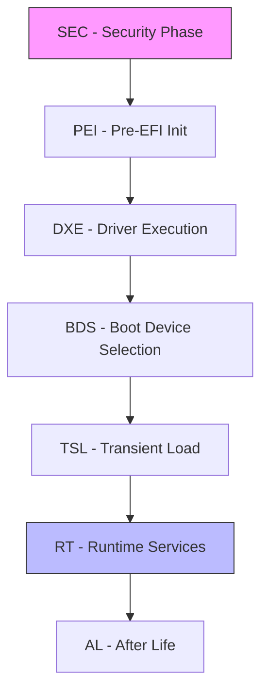
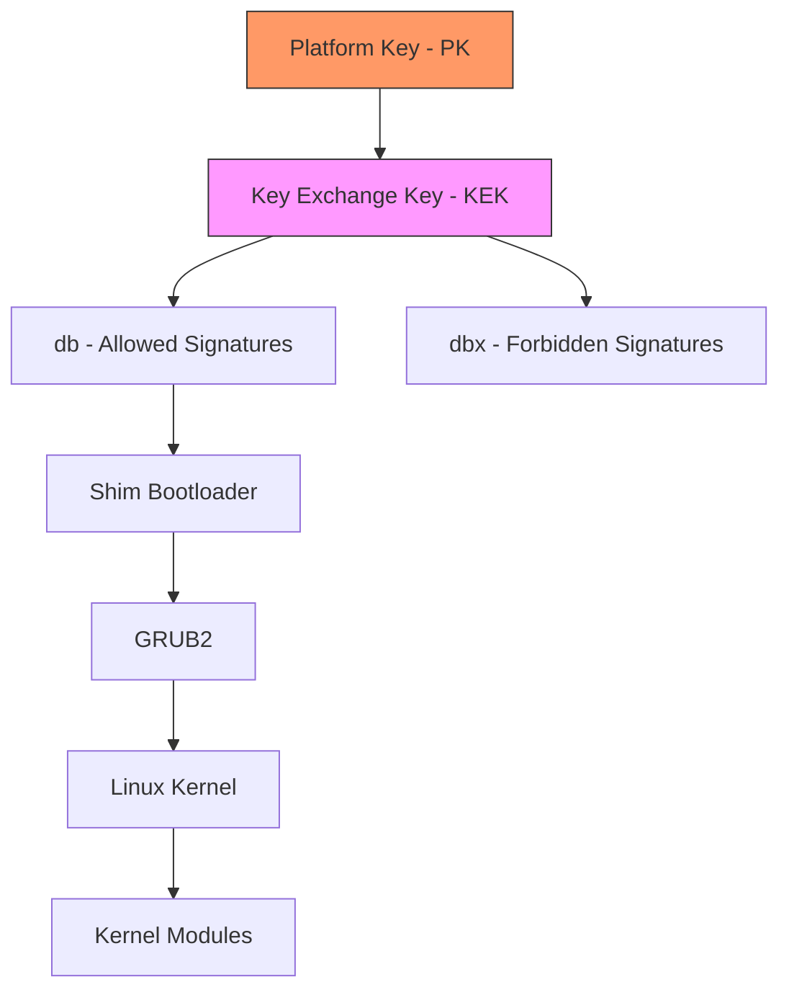
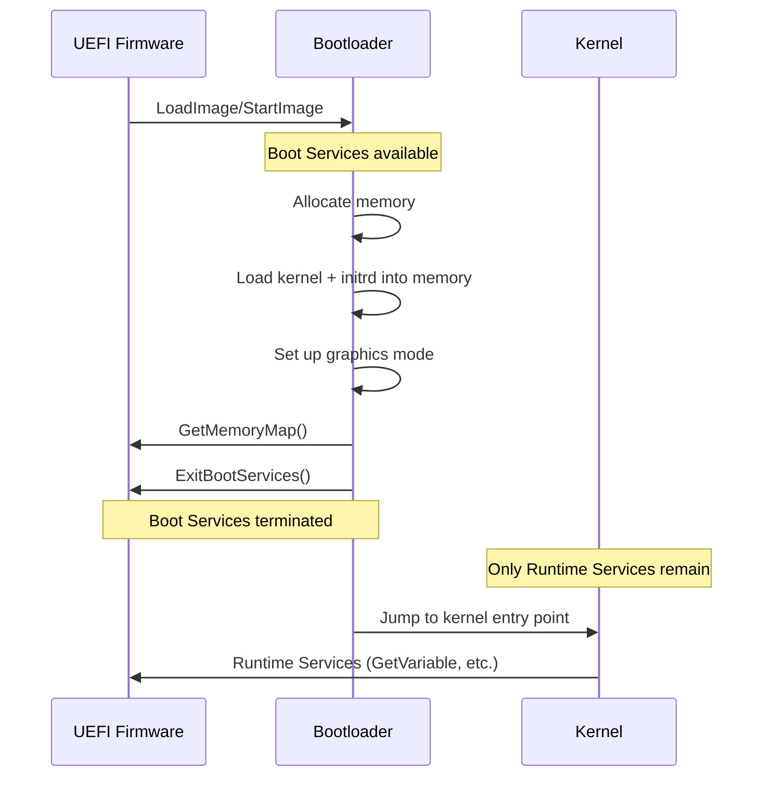
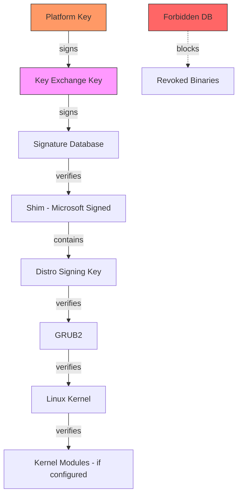

# Chapter 209: Firmware — UEFI and BIOS

## 1. Intuition

Before the operating system kernel can begin executing, something must initialize the hardware, discover bootable media, and transfer control to the first piece of software on that media. That "something" is firmware — the permanent software embedded in the motherboard's non-volatile memory (typically SPI flash). Understanding firmware is the foundation of understanding the entire Linux boot process, because every subsequent stage depends on the contract firmware establishes with the bootloader.

The two dominant firmware architectures are **BIOS** (Basic Input/Output System) and **UEFI** (Unified Extensible Firmware Interface). BIOS dates back to the original IBM PC in 1981; UEFI is its modern replacement, developed by Intel (originally as EFI) and standardized by the UEFI Forum. Today, virtually all x86-64 hardware ships with UEFI firmware, though many implementations retain a **Compatibility Support Module (CSM)** to emulate legacy BIOS behavior.

Think of firmware as the "ground floor" of the boot chain. It runs before anything else, owns the hardware first, and hands off a defined execution environment to the bootloader. The rules of that handoff — what memory is available, what protocols exist, how the disk is partitioned — are what distinguish BIOS from UEFI booting.

## 2. Architecture

### 2.1 BIOS Architecture

The traditional BIOS is a 16-bit real-mode environment. Its responsibilities are narrow:

1. **POST (Power-On Self-Test):** Verify that essential hardware (CPU, RAM, video, keyboard) is functional.
2. **Initialization:** Configure chipset registers, set up memory controllers, enumerate PCI devices.
3. **Bootstrap:** Read the first 512-byte sector (MBR) of the first bootable disk into memory at address `0x7C00` and jump to it.

Key constraints of the BIOS model:
- **16-bit real mode:** Only 1 MB of addressable memory; segmented memory model.
- **No standard runtime environment:** The BIOS provides interrupt-based services (INT 13h for disk, INT 10h for video) that disappear once the OS switches to protected/long mode.
- **MBR partitioning:** Disk partition tables are limited to 4 primary partitions, 2 TiB maximum disk size.
- **No standard driver model:** Every BIOS vendor implements services differently.

### 2.2 UEFI Architecture

UEFI is a complete pre-OS execution environment with its own driver model, filesystem support, and network stack. It runs in the CPU's native mode (32-bit or 64-bit, typically 64-bit long mode on x86-64).

UEFI defines several conceptual layers:

- **SEC (Security Phase):** First code executed; establishes a root of trust, initializes minimal CPU and chipset state.
- **PEI (Pre-EFI Initialization):** Initializes main memory, chipset, and motherboard. Produces data structures (Hand-Off Blocks) for the next phase.
- **DXE (Driver Execution Environment):** Loads and executes UEFI drivers and applications from firmware volumes. This is where most UEFI functionality is implemented.
- **BDS (Boot Device Selection):** Reads the **Boot Order** variable, scans boot entries, and loads the selected bootloader.
- **TSL (Transient System Load):** The bootloader runs here.
- **RT (Runtime):** After `ExitBootServices()`, the OS takes over, but UEFI runtime services remain accessible.



### 2.3 UEFI Protocols and Services

UEFI organizes functionality through **protocols** — interfaces identified by GUIDs. Key protocols include:

- **Block I/O Protocol:** Disk read/write.
- **Simple File System Protocol / FAT:** UEFI mandates FAT12/16/32 support for the EFI System Partition (ESP).
- **Load Image / Start Image:** Load and execute PE/COFF binaries.
- **Graphics Output Protocol (GOP):** Framebuffer-based graphics.
- **Simple Network Protocol:** PXE boot support.

UEFI provides two categories of services:

| Category | Available When | Purpose |
|----------|---------------|---------|
| **Boot Services** | Before `ExitBootServices()` | Memory allocation, protocol access, event handling |
| **Runtime Services** | Always (even after OS boot) | Variable access, time, virtual memory mapping |

### 2.4 The EFI System Partition (ESP)

The ESP is a FAT-formatted partition (typically FAT32) that holds bootloaders. On GPT disks, it uses the partition type GUID `C12A7328-F81F-11D2-BA4B-00A0C93EC93B`. The conventional mount point is `/boot/efi` on Linux.

Directory structure on the ESP:
```
EFI/
├── BOOT/
│   └── BOOTX64.EFI          # Fallback bootloader
├── ubuntu/
│   ├── grubx64.efi           # Distribution-specific bootloader
│   └── shimx64.efi           # Secure Boot shim
├── microsoft/
│   └── boot/
│       └── bootmgfw.efi      # Windows bootloader
└── refind/
    └── refind_x64.efi        # rEFInd bootloader
```

## 3. UEFI Variables

### 3.1 Variable Store

UEFI variables are key-value pairs stored in NVRAM (non-volatile RAM, typically SPI flash). Each variable has:
- A **name** (wide string, e.g., `BootOrder`)
- A **vendor GUID** (identifies the owner)
- **Attributes** (read-only, boot service access, runtime access, non-volatile)
- **Data** (arbitrary byte array)

From Linux, UEFI variables are exposed through **efivarfs**, typically mounted at `/sys/firmware/efi/efivars/`:

```bash
# List all UEFI variables
ls /sys/firmware/efi/efivars/

# Read a specific variable (includes 4-byte attributes header)
hexdump -C /sys/firmware/efi/efivars/BootOrder-8be4df61-93ca-11d2-aa0d-00e098032b8c

# Use efivar tool for proper parsing
efivar -l                                    # List variables
efivar -n BootOrder -p                       # Print BootOrder
```

### 3.2 Critical Boot Variables

| Variable | GUID | Purpose |
|----------|------|---------|
| `BootOrder` | `8be4df61-93ca-11d2-aa0d-00e098032b8c` | Ordered list of boot entries to try |
| `Boot0000` ... `BootFFFF` | Same GUID | Individual boot entry descriptions |
| `BootNext` | Same GUID | One-time boot entry override |
| `BootCurrent` | Same GUID | Currently active boot entry |
| `SecureBoot` | Same GUID | Whether Secure Boot is active (0 or 1) |
| `SetupMode` | Same GUID | 1 = user can enroll keys; 0 = locked |
| `PK`, `KEK`, `db`, `dbx` | Same GUID | Secure Boot key databases |
| `Timeout` | Same GUID | Boot menu timeout in seconds |
| `PlatformLang` | Same GUID | Preferred language |

### 3.3 Boot Entry Format

Each `BootXXXX` variable contains an `EFI_LOAD_OPTION` structure:

```
Offset  Size   Field
0       4      Attributes (bit field)
4       2      FilePathListLength
6       N      Description (null-terminated UTF-16)
6+N     M      DevicePath + OptionalData
```

The `efibootmgr` tool provides a user-friendly interface:

```bash
# Display boot entries
efibootmgr -v

# Output example:
# Boot0000* ubuntu	HD(1,GPT,uuid)/File(\EFI\ubuntu\shimx64.efi)
# Boot0001* Windows Boot Manager	HD(1,GPT,uuid)/File(\EFI\Microsoft\boot\bootmgfw.efi)
# BootOrder: 0000,0001
# BootCurrent: 0000
# Timeout: 5 seconds

# Change boot order
efibootmgr -o 0001,0000

# Create a new boot entry
efibootmgr --create --disk /dev/sda --part 1 \
    --loader '\EFI\linux\vmlinuz.efi' \
    --label "My Linux"

# Set one-time boot entry
efibootmgr -n 0002

# Delete a boot entry
efibootmgr -B -b 0002
```

## 4. Secure Boot

### 4.1 Concept and Architecture

Secure Boot is a UEFI mechanism that ensures only cryptographically signed code executes during the boot process. It establishes a **chain of trust** from firmware to OS:



### 4.2 Key Hierarchy

- **Platform Key (PK):** The root of trust. Typically owned by the hardware vendor. Controls who can modify KEK and Secure Boot policy.
- **Key Exchange Key (KEK):** Used to sign updates to the `db` and `dbx` databases. OS vendors (Microsoft, Linux distributions) have KEK entries.
- **Signature Database (db):** Contains allowed certificates and hashes. Code signed by any certificate in `db` is permitted to execute.
- **Forbidden Signatures Database (dbx):** Contains revoked certificates and hashes. Code matching `dbx` is blocked, even if it matches `db`.

### 4.3 Secure Boot and Linux

Most Linux distributions use a two-stage approach:

1. **Shim:** A small, Microsoft-signed bootloader (`shimx64.efi`). Because Microsoft's key is in virtually all `db` databases, Shim will load. Shim contains the distribution's own key and verifies the next stage.
2. **GRUB2:** Signed with the distribution's key (which Shim trusts). GRUB2 verifies the kernel.
3. **Linux Kernel:** Contains an embedded signature. GRUB2 or the kernel itself verifies it.

```bash
# Check Secure Boot status from Linux
mokutil --sb-state
# or
cat /sys/firmware/efi/efivars/SecureBoot-8be4df61-93ca-11d2-aa0d-00e098032b8c

# Enroll a custom key (requires reboot and MOK manager)
sudo mokutil --import /path/to/my-key.der

# List enrolled keys
sudo mokutil --list-enrolled
```

### 4.4 Managing Secure Boot Keys

The `efi-readvar` and `efi-updatevar` tools from the `efitools` package allow direct manipulation:

```bash
# Read the current PK
efi-readvar -v PK

# Export current db to a file
efi-readvar -v db -o db.esl

# Sign a kernel image with sbsign
sbsign --key /path/to/db.key --cert /path/to/db.crt \
    --output /boot/vmlinuz-signed /boot/vmlinuz

# Verify a signed binary
sbverify --cert /path/to/db.crt /boot/vmlinuz-signed
```

### 4.5 MOK (Machine Owner Key)

MOK is a Shim mechanism that allows machine owners to enroll their own keys without modifying the platform's `db`. This is the recommended way to sign custom kernels or third-party modules (like NVIDIA drivers).

```bash
# Generate a MOK key pair
openssl req -new -x509 -newkey rsa:2048 -keyout MOK.priv \
    -outform DER -out MOK.der -days 36500 -subj "/CN=My MOK/"

# Import into MOK database (requires password for reboot verification)
sudo mokutil --import MOK.der

# Sign a kernel module
/usr/src/linux/scripts/sign-file sha256 MOK.priv MOK.der module.ko

# Sign a kernel
sbsign --key MOK.priv --cert MOK.der --output /boot/vmlinuz-signed /boot/vmlinuz
```

## 5. CSM — Compatibility Support Module

### 5.1 What CSM Does

The CSM is a UEFI module that emulates legacy BIOS behavior. When enabled, the firmware:

1. Presents a legacy Option ROM interface to expansion cards.
2. Supports booting from MBR-partitioned disks via INT 13h.
3. Loads the MBR boot sector at `0x7C00` and executes it in 16-bit real mode.

### 5.2 CSM vs. Native UEFI Boot

| Aspect | CSM (Legacy) | Native UEFI |
|--------|-------------|-------------|
| Partition table | MBR | GPT |
| Bootloader location | MBR + gap after MBR | ESP (FAT32 partition) |
| Execution mode | 16-bit real mode | 64-bit long mode |
| Max disk size | 2 TiB | 8 ZiB (theoretical) |
| Boot speed | Slower (option ROM init) | Faster |
| Secure Boot | Not supported | Supported |
| Multi-boot | Bootloader-dependent | Standardized boot entries |

### 5.3 Disabling CSM

On modern systems, CSM should be disabled for clean UEFI booting. The process varies by vendor:

- **AMI BIOS:** Boot → CSM Parameters → Launch CSM → Disabled
- **Dell:** Boot Sequence → Boot List Option → UEFI
- **HP:** Advanced → Boot Options → Legacy Support → Disable
- **Lenovo:** Startup → UEFI/Legacy Boot → UEFI Only

When CSM is disabled, only EFI-compatible media can boot.

## 6. UEFI Runtime Services

After `ExitBootServices()` is called, only Runtime Services remain accessible. The Linux kernel maps these into its virtual address space.

### 6.1 Key Runtime Services

```c
// From include/linux/efi.h in the Linux kernel

typedef struct {
    // Variable services
    efi_status_t (*get_variable)(efi_char16_t *name, efi_guid_t *vendor,
                                  u32 *attr, unsigned long *data_size, void *data);
    efi_status_t (*set_variable)(efi_char16_t *name, efi_guid_t *vendor,
                                  u32 attr, unsigned long data_size, void *data);
    efi_status_t (*get_next_variable)(unsigned long *name_size,
                                       efi_char16_t *name, efi_guid_t *vendor);
    
    // Time services
    efi_status_t (*get_time)(efi_time_t *time, efi_time_cap_t *cap);
    efi_status_t (*set_time)(efi_time_t *time);
    
    // Reset services
    void (*reset_system)(efi_reset_type_t type, efi_status_t status,
                          unsigned long data_size, efi_char16_t *data);
    
    // Misc
    efi_status_t (*query_variable_info)(u32 attr, u64 *storage_space,
                                         u64 *remaining_space, u64 *max_variable_size);
} efi_runtime_services_t;
```

### 6.2 efivarfs Kernel Module

The Linux kernel module `efivarfs` provides filesystem access to UEFI variables:

```bash
# Ensure efivarfs is mounted
mount -t efivarfs efivarfs /sys/firmware/efi/efivars

# Check if write access is supported (requires kernel >= 3.10)
ls -la /sys/firmware/efi/efivars/BootOrder*

# Variables with EFI_VARIABLE_NON_VOLATILE | EFI_VARIABLE_BOOTSERVICE_ACCESS | EFI_VARIABLE_RUNTIME_ACCESS
# are read-write from userspace

# Dangerous: you can brick your system by writing bad UEFI variables
# Always use efivar/efibootmgr instead of direct writes
```

## 7. Source Code References

### 7.1 Linux Kernel EFI Implementation

The kernel's EFI subsystem is in `drivers/firmware/efi/`:

```
drivers/firmware/efi/
├── efi.c                    # Core EFI runtime services
├── vars.c                   # Variable services implementation
├── efivars.c                # Legacy efivars interface
├── esrt.c                   # EFI System Resource Table
├── capsule.c                # Firmware capsule updates
├── memmap.c                 # EFI memory map handling
├── reboot.c                 # EFI reset system
├── cper.c                   # Common Platform Error Record
├── runtime-wrappers.c       # Runtime service wrappers with locking
└── libstub/                 # EFI stub (kernel as EFI application)
    ├── efi-stub-entry.c     # Entry point for EFI boot
    ├── efilib.c             # EFI library functions
    ├── secureboot.c         # Secure Boot detection
    └── mem.c                # Memory allocation for stub
```

### 7.2 EFI Stub — The Kernel as an EFI Application

Since Linux 3.3, the kernel can be built as a direct EFI application. The `arch/x86/boot/compressed/efi_mixed.S` and `drivers/firmware/efi/libstub/` code allow the kernel to be loaded directly by UEFI firmware without a separate bootloader.

```bash
# Build kernel with EFI stub support
CONFIG_EFI_STUB=y
CONFIG_EFI_MIXED=y    # Support booting 64-bit kernel from 32-bit UEFI

# Boot directly from UEFI (no bootloader needed)
efibootmgr --create --disk /dev/sda --part 1 \
    --loader '\vmlinuz-6.1.0' \
    --unicode 'root=UUID=xxx initrd=\initramfs-6.1.0.img'
```

### 7.3 efivar and efibootmgr Source

- **efivar:** https://github.com/rhboot/efivar — Low-level UEFI variable manipulation library.
- **efibootmgr:** https://github.com/rhboot/efibootmgr — Boot manager using efivar.

## 8. Configuration Examples

### 8.1 GPT Disk Layout with ESP

```bash
# Create GPT disk with ESP using parted
parted /dev/sda -- mklabel gpt
parted /dev/sda -- mkpart ESP fat32 1MiB 512MiB
parted /dev/sda -- set 1 esp on
parted /dev/sda -- mkpart primary ext4 512MiB 100%

# Format ESP
mkfs.fat -F32 /dev/sda1

# Format root
mkfs.ext4 /dev/sda2

# Mount and install GRUB
mount /dev/sda2 /mnt
mkdir -p /mnt/boot/efi
mount /dev/sda1 /mnt/boot/efi

# Install bootloader (from chroot or live system)
grub-install --target=x86_64-efi --efi-directory=/boot/efi \
    --bootloader-id=mylinux --recheck
```

### 8.2 Dual-Boot with Windows

```bash
# After installing Windows, its bootloader occupies:
# /boot/efi/EFI/Microsoft/Boot/bootmgfw.efi

# Install Linux GRUB alongside
grub-install --target=x86_64-efi --efi-directory=/boot/efi \
    --bootloader-id=ubuntu

# os-prober detects Windows automatically
grub-mkconfig -o /boot/grub/grub.cfg

# If Windows overwrites the boot order:
efibootmgr -o 0000,0001    # Put Linux first
```

### 8.3 Secure Boot with Custom Keys

```bash
# Generate a complete PKI hierarchy
# Platform Key
openssl req -new -x509 -newkey rsa:4096 -keyout PK.key -out PK.crt \
    -days 3650 -nodes -subj "/CN=My Platform Key/"

# Key Exchange Key
openssl req -new -x509 -newkey rsa:4096 -keyout KEK.key -out KEK.crt \
    -days 3650 -nodes -subj "/CN=My KEK/"

# Signature Database key
openssl req -new -x509 -newkey rsa:4096 -keyout db.key -out db.crt \
    -days 3650 -nodes -subj "/CN=My DB Key/"

# Convert to DER format
openssl x509 -in PK.crt -out PK.der -outform DER
openssl x509 -in KEK.crt -out KEK.der -outform DER
openssl x509 -in db.crt -out db.der -outform DER

# Create ESL (EFI Signature List) files
cert-to-efi-sig-list -g "$(uuidgen)" PK.crt PK.esl
cert-to-efi-sig-list -g "$(uuidgen)" KEK.crt KEK.esl
cert-to-efi-sig-list -g "$(uuidgen)" db.crt db.esl

# Sign ESL with PK to create auth files
sign-efi-sig-list -g "$(uuidgen)" -k PK.key -c PK.crt PK PK.esl PK.auth
sign-efi-sig-list -g "$(uuidgen)" -k PK.key -c PK.crt KEK KEK.esl KEK.auth
sign-efi-sig-list -g "$(uuidgen)" -k PK.key -c PK.crt db db.esl db.auth

# Enroll from UEFI shell or KeyTool
# Or from Linux in SetupMode:
efi-updatevar -f PK.auth PK
efi-updatevar -f KEK.auth KEK
efi-updatevar -f db.auth db
```

## 9. Diagrams

### 9.1 BIOS vs UEFI Boot Flow

```mermaid
graph TD
    subgraph "BIOS Boot"
        B1[Power On] --> B2[POST]
        B2 --> B3[Read MBR at 0x7C00]
        B3 --> B4[Stage 1 Bootloader - 446 bytes]
        B4 --> B5[Stage 1.5 / Stage 2]
        B5 --> B6[Load Kernel]
    end
    
    subgraph "UEFI Boot"
        U1[Power On] --> U2[SEC/PEI/DXE]
        U2 --> U3[BDS - Read Boot Entries]
        U3 --> U4[Load .efi from ESP]
        U4 --> U5[Execute Bootloader]
        U5 --> U6[Load Kernel]
    end
    
    style B1 fill:#fcc,stroke:#333
    style U1 fill:#ccf,stroke:#333
```



### 9.2 UEFI Boot Services to Runtime Transition



### 9.3 Secure Boot Chain of Trust



## 10. Common Pitfalls

### Pitfall 1: Installing GRUB in BIOS Mode on a UEFI System

**Symptom:** System boots only when CSM is enabled; enabling "UEFI only" shows no bootable device.

**Cause:** `grub-install` was run without `--target=x86_64-efi`, defaulting to BIOS mode.

**Fix:**
```bash
# Boot from live USB in UEFI mode
mount /dev/sda2 /mnt
mount /dev/sda1 /mnt/boot/efi
mount --bind /dev /mnt/dev
mount --bind /proc /mnt/proc
mount --bind /sys /mnt/sys
mount --bind /sys/firmware/efi/efivars /mnt/sys/firmware/efi/efivars
chroot /mnt
grub-install --target=x86_64-efi --efi-directory=/boot/efi --recheck
```

### Pitfall 2: efivars Write Failures

**Symptom:** `efibootmgr` fails with "Could not set variable: Permission denied" or "No such file or directory."

**Cause:** efivarfs not mounted, or the variable has `EFI_VARIABLE_HARDWARE_ERROR_RECORD` attribute (some firmwares block writes).

**Fix:**
```bash
mount -t efivarfs efivarfs /sys/firmware/efi/efivars
# If still failing, check kernel log
dmesg | grep -i efi
# Some firmwares require efivar module parameters
modprobe efivars
```

### Pitfall 3: Bricked System After Bad UEFI Variable Write

**Symptom:** System fails to POST or enters firmware setup repeatedly.

**Cause:** Corrupted UEFI NVRAM variables.

**Fix:**
- Some motherboards have a CMOS clear jumper.
- Some firmwares have a recovery mode (hold specific keys during power-on).
- Last resort: hardware SPI flash programmer to reflash firmware.

**Prevention:** Never write UEFI variables directly; use `efibootmgr`.

### Pitfall 4: Windows Update Overwrites Linux Boot Order

**Symptom:** After a Windows update, the system boots directly to Windows.

**Cause:** Windows writes its bootloader as the first entry and reorders `BootOrder`.

**Fix:**
```bash
# From Linux live USB
efibootmgr -o 0000,0001    # Reorder as needed
```

**Prevention:** Some distributions configure GRUB as the default with `--bootloader-id=BOOT` to use the fallback path `\EFI\BOOT\BOOTX64.EFI`.

### Pitfall 5: Secure Boot Prevents Custom Kernel from Loading

**Symptom:** "Security Violation" error when booting custom-compiled kernel.

**Cause:** Kernel not signed with a key enrolled in `db` or MOK.

**Fix:** Sign the kernel with a MOK-enrolled key (see Section 4.5).

## 11. Best Practices

1. **Always use GPT + UEFI on modern hardware.** MBR/CSM is legacy and limits future flexibility.

2. **Disable CSM** in firmware settings to ensure pure UEFI booting. This prevents accidentally installing a BIOS-mode bootloader.

3. **Keep the ESP at 512 MiB or larger.** While 100 MiB suffices for most cases, firmware updates and multiple OS installations can fill smaller partitions.

4. **Mount the ESP at `/boot/efi`.** This is the conventional location that all major distributions and tools expect.

5. **Use Secure Boot with Shim** rather than disabling it. The `shim → GRUB → kernel` chain is well-tested and provides meaningful security against bootkit attacks.

6. **Back up UEFI variables** before firmware updates:
   ```bash
   eivar -l > /root/efi-vars-backup.txt
   ```

7. **Use `efibootmgr`** for all boot entry management. Direct writes to `/sys/firmware/efi/efivars/` can corrupt NVRAM.

8. **Test firmware updates carefully.** Use the capsule update mechanism (`fwupd` / `fwupdmgr`) when available:
   ```bash
   fwupdmgr get-updates
   fwupdmgr update
   ```

9. **Document your firmware settings** (Secure Boot state, CSM mode, boot order) in your system administration notes.

10. **Prefer the EFI stub kernel** for simple setups (single OS, no dual-boot). It eliminates the bootloader entirely, reducing attack surface and boot time.

## 12. Exercises

### Exercise 1: Examine UEFI Variables

```bash
# 1. List all UEFI variables on your system
ls /sys/firmware/efi/efivars/

# 2. Use efibootmgr to display the current boot configuration
efibootmgr -v

# 3. Identify the partition containing the ESP
findmnt /boot/efi
blkid /dev/sdX1    # Replace with your ESP device

# 4. Examine the Boot0000 variable in hex
hexdump -C /sys/firmware/efi/efivars/Boot0000-8be4df61-93ca-11d2-aa0d-00e098032b8c | head -20

# 5. Use efivar to parse it properly
efivar -n Boot0000 -p
```

### Exercise 2: Create a Custom EFI Boot Entry

```bash
# 1. Create a small EFI application (e.g., a shell script wrapped with PreLoader)
# For this exercise, use an existing EFI binary
ls /boot/efi/EFI/

# 2. Create a new boot entry for a kernel directly
sudo efibootmgr --create --disk /dev/sda --part 1 \
    --loader '\EFI\linux\vmlinuz-6.1.0.efi' \
    --label "Direct Kernel Boot" \
    --unicode 'root=UUID=YOUR-UUID-HERE rw initrd=\EFI\linux\initramfs-6.1.0.img'

# 3. Verify the entry was created
efibootmgr -v

# 4. Set it as a one-time boot (doesn't change permanent order)
sudo efibootmgr -n XXXX    # Replace XXXX with your new entry number

# 5. Reboot and observe the behavior
```

### Exercise 3: Secure Boot Investigation

```bash
# 1. Determine if Secure Boot is enabled
mokutil --sb-state

# 2. Examine the key databases
sudo efi-readvar -v PK
sudo efi-readvar -v KEK
sudo efi-readvar -v db | head -50
sudo efi-readvar -v dbx | head -50

# 3. Check if a binary is signed
sbverify --list /boot/efi/EFI/ubuntu/shimx64.efi

# 4. Generate a test key and sign a kernel
openssl req -new -x509 -newkey rsa:2048 -keyout test.key \
    -outform DER -out test.der -days 365 -subj "/CN=Test/"
sbsign --key test.key --cert <(openssl x509 -in test.der -inform DER) \
    --output /tmp/vmlinuz-signed /boot/vmlinuz-$(uname -r)
sbverify --cert <(openssl x509 -in test.der -inform DER) /tmp/vmlinuz-signed
```

### Exercise 4: Firmware Update with fwupd

```bash
# 1. Check for available firmware updates
sudo fwupdmgr get-updates

# 2. List supported devices
sudo fwupdmgr get-devices

# 3. Check the firmware history
sudo fwupdmgr get-history

# 4. (Optional, with caution) Apply an update
# sudo fwupdmgr update
```

## 13. References

1. **UEFI Specification 2.10** — https://uefi.org/specifications — The authoritative reference for UEFI.

2. **UEFI Forum** — https://uefi.org/ — Organization maintaining the UEFI specification.

3. **Linux Kernel EFI Documentation** — `Documentation/admin-guide/efi-stub.rst` — Official kernel documentation for EFI stub booting.

4. **Rod Smith's EFI Boot Loaders for Linux** — https://www.rodsbooks.com/efi-bootloaders/ — Comprehensive guide to UEFI booting on Linux.

5. **Arch Wiki: UEFI** — https://wiki.archlinux.org/title/Unified_Extensible_Firmware_Interface — Excellent community documentation.

6. **Arch Wiki: Secure Boot** — https://wiki.archlinux.org/title/Unified_Extensible_Firmware_Interface/Secure_Boot — Secure Boot setup guide.

7. **efivar GitHub** — https://github.com/rhboot/efivar — UEFI variable library.

8. **efibootmgr GitHub** — https://github.com/rhboot/efibootmgr — EFI boot manager tool.

9. **shim GitHub** — https://github.com/rhboot/shim — First-stage UEFI Secure Boot bootloader.

10. **fwupd** — https://fwupd.org/ — Linux firmware update daemon.

11. **Intel EFI Development Kit** — https://github.com/tianocore/edk2 — Reference UEFI implementation (TianoCore).

12. **Linux kernel source: `drivers/firmware/efi/`** — The kernel's EFI subsystem implementation.
