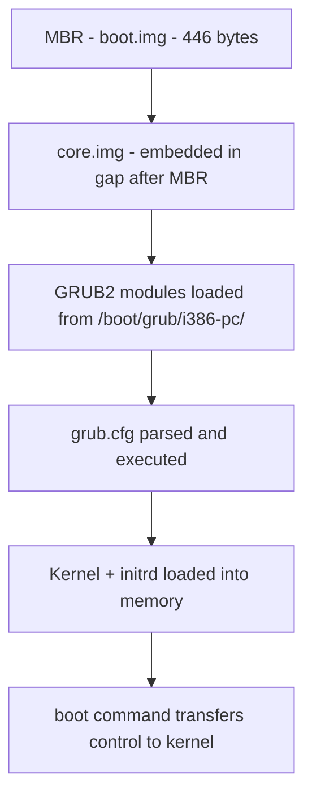
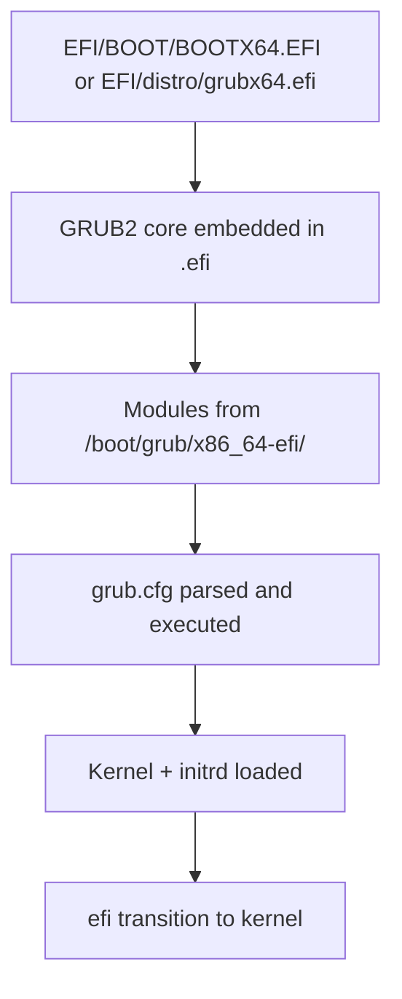
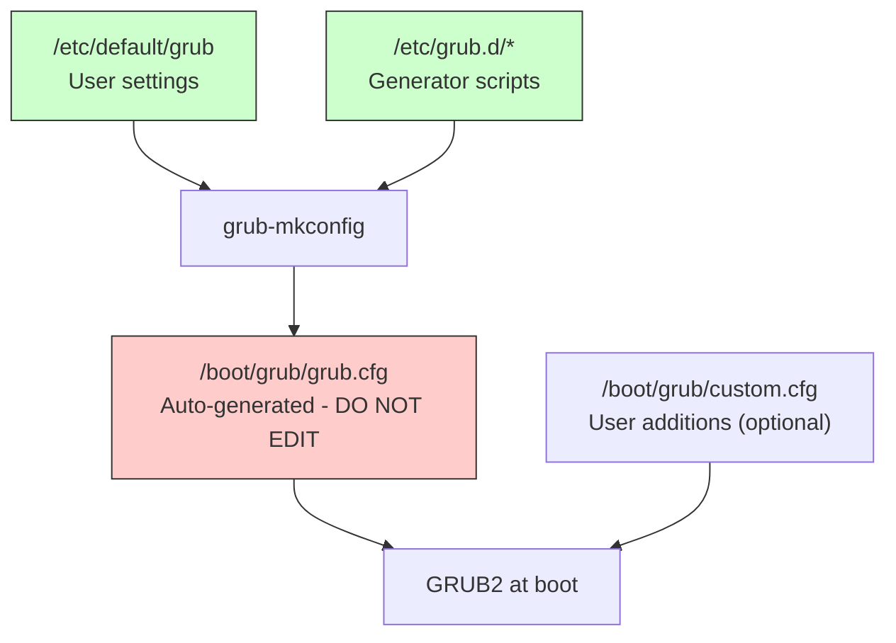
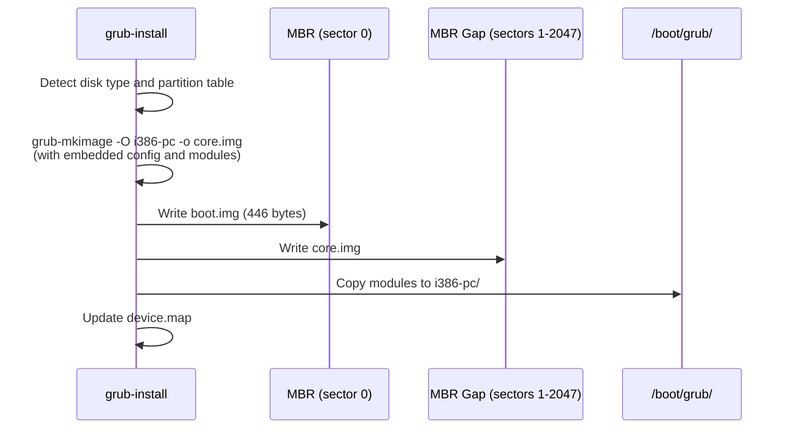
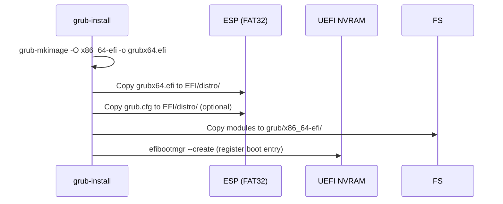

# Chapter 210: GRUB2 — Configuration, Menu Entries, Modules, grub-install, grub-mkconfig

## 1. Intuition

GRUB2 (GRand Unified Bootloader version 2) is the dominant bootloader for Linux systems. It is the first user-space software that runs after firmware, and its job is to load the Linux kernel and initial RAM disk into memory, then transfer control to the kernel. But GRUB2 is far more than a simple loader — it is a miniature operating system in its own right, with its own shell, scripting language, filesystem drivers, and module system.

Understanding GRUB2 is essential because it sits at the critical junction between firmware and kernel. When a system fails to boot, GRUB2 is almost always involved. Mastering its configuration means the difference between a system that boots reliably and one that leaves you staring at a `grub>` prompt wondering what went wrong.

The key insight about GRUB2 is that it replaced the monolithic GRUB Legacy with a modular, script-driven architecture. Where GRUB Legacy used a static `menu.lst` file, GRUB2 uses a layered configuration system: `grub.cfg` is auto-generated from templates and helper scripts, while `grub.cfg` itself is a full script in GRUB2's own scripting language.

## 2. Architecture

### 2.1 GRUB2 Boot Stages

GRUB2 uses a multi-stage loading process that varies between BIOS and UEFI systems:

#### BIOS Boot Path



- **boot.img:** A 446-byte first-stage loader written to the MBR. Its only job is to load `core.img`.
- **core.img:** The second-stage loader, typically written to the "MBR gap" (sectors 1 through ~2047 on GPT disks, or the gap between the MBR and the first partition on MBR disks). `core.img` contains essential modules: partition table drivers, filesystem drivers, and the normal mode dispatcher.
- **GRUB2 modules:** Stored in `/boot/grub/i386-pc/` (BIOS) or `/boot/grub/x86_64-efi/` (UEFI). Loaded on demand as `grub.cfg` references them.

#### UEFI Boot Path



On UEFI systems, GRUB2 is a PE/COFF executable stored on the ESP. The `grubx64.efi` binary includes embedded modules (built with `grub-mkimage`). Additional modules are loaded from the filesystem at runtime.

### 2.2 GRUB2 Naming Conventions

GRUB2 uses its own device naming scheme, distinct from Linux:

| GRUB2 Name | Meaning |
|------------|---------|
| `(hd0)` | First disk |
| `(hd0,msdos1)` | First disk, MBR partition 1 |
| `(hd0,gpt1)` | First disk, GPT partition 1 |
| `(hd0,gpt1)/boot/vmlinuz` | File path on a partition |

Disk numbering starts at 0. Partition numbering starts at 1 for GPT and 1 for MBR (with extended partitions counted).

### 2.3 GRUB2 Module System

GRUB2 is modular. Core functionality is in the `kernel` module, and everything else is loaded on demand:

```
/boot/grub/i386-pc/
├── acpi.mod          # ACPI table support
├── biosdisk.mod      # BIOS disk access
├── boot.mod          # boot command
├── cat.mod           # cat command
├── configfile.mod    # configfile command
├── ext2.mod          # ext2/3/4 filesystem
├── fat.mod           # FAT filesystem
├── gpt.mod           # GPT partition table
├── linux.mod         # Linux kernel loading
├── normal.mod        # Normal mode (menu interface)
├── search.mod        # search command
├── video.mod         # Video subsystem
└── ... (hundreds more)
```

Modules are loaded implicitly by dependency or explicitly with `insmod`:

```grub
insmod part_gpt
insmod fat
insmod ext2
insmod linux
insmod initrd
```

## 3. Configuration Files

### 3.1 The Layered Configuration System

GRUB2's configuration is generated through a layered process:



### 3.2 /etc/default/grub — User Configuration

This file contains shell variables that control `grub-mkconfig` behavior:

```bash
# /etc/default/grub

# Default boot entry (0-based index, or saved, or saved_entry)
GRUB_DEFAULT=0
# Alternative: boot the previously selected entry
# GRUB_DEFAULT=saved
# GRUB_SAVEDEFAULT=true

# Timeout in seconds (-1 = wait indefinitely)
GRUB_TIMEOUT=5
# GRUB_TIMEOUT_STYLE=menu    # Show menu always
# GRUB_TIMEOUT_STYLE=hidden  # Hide unless Esc pressed
# GRUB_TIMEOUT_STYLE=countdown  # Show countdown, hide menu

# Kernel command line parameters
GRUB_CMDLINE_LINUX_DEFAULT="quiet splash"
GRUB_CMDLINE_LINUX=""

# Disable os-prober (for security on multi-boot)
# GRUB_DISABLE_OS_PROBER=false

# Disable submenu for older kernels
GRUB_DISABLE_SUBMENU=true

# Terminal configuration
GRUB_TERMINAL="console"
# GRUB_TERMINAL="serial console"
# GRUB_SERIAL_COMMAND="serial --speed=115200 --unit=0 --word=8 --parity=no --stop=1"

# Graphics
GRUB_GFXMODE=auto
GRUB_GFXPAYLOAD_LINUX=keep

# Theme
# GRUB_THEME="/boot/grub/themes/starfield/theme.txt"

# Distro identification
GRUB_DISTRIBUTOR="MyLinux"

# Disable recovery entries
# GRUB_DISABLE_RECOVERY=true

# Enable/disable UUID usage
GRUB_DISABLE_LINUX_UUID=false

# Enable/disable Linux partuuid
GRUB_DISABLE_LINUX_PARTUUID=false

# Initrd fallback for older kernels
GRUB_EARLY_INITRD_LINUX_STOCK="amd-ucode.img intel-ucode.img"

# Cryptodisk support
# GRUB_ENABLE_CRYPTODISK=y
```

### 3.3 /etc/grub.d/ — Generator Scripts

The `/etc/grub.d/` directory contains executable scripts that `grub-mkconfig` runs in numeric order:

```
/etc/grub.d/
├── 00_header        # Load settings from /etc/default/grub
├── 05_debian_theme  # Background image, colors
├── 10_linux         # Detect and generate entries for installed kernels
├── 20_linux_xen     # Xen hypervisor entries
├── 30_os-prober     # Detect other OSes (Windows, other Linux)
├── 30_uefi-firmware # UEFI firmware setup entry
├── 40_custom        # User-defined custom entries
├── 41_custom        # Drop-in for custom entries (if 40_custom exists)
└── README           # Documentation
```

Each script outputs GRUB2 configuration snippets to stdout. `grub-mkconfig` concatenates them all.

**Custom entries** go in `/etc/grub.d/40_custom`:

```bash
#!/bin/sh
exec tail -n +3 $0
# This file provides an easy way to add custom menu entries.

menuentry "My Custom Linux" {
    set root='(hd0,gpt2)'
    linux /boot/vmlinuz-6.1.0-custom root=UUID=xxxx-xxxx rw quiet
    initrd /boot/initramfs-6.1.0-custom.img
}

menuentry "Memory Test (memtest86+)" {
    set root='(hd0,gpt1)'
    linuxefi /efi/tools/memtest86.efi
}
```

### 3.4 grub.cfg — The Generated Configuration

The generated `/boot/grub/grub.cfg` is a comprehensive GRUB2 script. Key sections:

```grub
# /boot/grub/grub.cfg (auto-generated)

# Preamble - load modules and set variables
set default=0
set timeout=5
set menu_color_normal=cyan/blue
set menu_color_highlight=white/blue

# Load partition and filesystem modules
insmod part_gpt
insmod fat
insmod ext2
search --no-floppy --fs-uuid --set=root abcdef12-3456-7890-abcd-ef1234567890

# Header section (from 00_header)
if [ -s $prefix/grubenv ]; then
  load_env
fi

# Menu entries (from 10_linux)
menuentry 'MyLinux, with Linux 6.1.0-generic' --class mylinux --class gnu-linux {
    recordfail
    load_video
    gfxmode $linux_gfx_mode
    insmod gzio
    insmod part_gpt
    insmod ext2
    search --no-floppy --fs-uuid --set=root abcdef12-3456-7890-abcd-ef1234567890
    linux   /vmlinuz-6.1.0-generic root=UUID=12345678-abcd-efgh-ijkl-mnopqrstuvwx ro quiet splash $vt_handoff
    initrd  /initrd.img-6.1.0-generic
}

menuentry 'MyLinux, with Linux 6.1.0-generic (recovery mode)' --class mylinux {
    insmod gzio
    insmod part_gpt
    insmod ext2
    search --no-floppy --fs-uuid --set=root abcdef12-3456-7890-abcd-ef1234567890
    linux   /vmlinuz-6.1.0-generic root=UUID=12345678-abcd-efgh-ijkl-mnopqrstuvwx ro recovery nomodeset
    initrd  /initrd.img-6.1.0-generic
}

# Submenu for older kernels
submenu 'Advanced options for MyLinux' {
    menuentry 'MyLinux, with Linux 6.0.0-generic' {
        linux   /vmlinuz-6.0.0-generic root=UUID=xxx ro quiet splash
        initrd  /initrd.img-6.0.0-generic
    }
}

# Other OS entries (from 30_os-prober)
menuentry 'Windows Boot Manager (on /dev/sda1)' --class windows --class os {
    insmod part_gpt
    insmod fat
    search --no-floppy --fs-uuid --set=root AAAA-BBBB
    chainloader /EFI/Microsoft/Boot/bootmgfw.efi
}
```

### 3.5 /boot/grub/grubenv — Persistent Environment

GRUB2 can save state between boots:

```grub
# Save the last selected entry
set default=saved
GRUB_DEFAULT=saved
GRUB_SAVEDEFAULT=true

# grubenv file format (binary, managed by grub2-editenv):
# GRUB_DEFAULT=0
# GRUB_SAVEDEFAULT=true
# saved_entry=MyLinux, with Linux 6.1.0-generic

# View environment
grub2-editenv /boot/grub/grubenv list

# Set environment variables
grub2-editenv /boot/grub/grubenv set default=2

# Reset environment
grub2-editenv /boot/grub/grubenv unset default
```

## 4. Key GRUB2 Commands

### 4.1 Command Line Interface

Press `c` at the GRUB menu to enter the command line:

```grub
# List available commands
help

# List block devices
ls

# Examine a partition
ls (hd0,gpt2)/
ls (hd0,gpt2)/boot/

# Find a file by name
search -f /vmlinuz
search --fs-uuid 12345678-abcd-efgh-ijkl-mnopqrstuvwx
search --label "MyBoot"

# Load modules
insmod linux
insmod normal

# Manually boot a kernel
set root='(hd0,gpt2)'
linux /boot/vmlinuz-6.1.0 root=/dev/sda2 ro quiet
initrd /boot/initrd.img-6.1.0
boot

# Load a different config file
configfile /boot/grub/grub.cfg

# Exit to firmware (UEFI only)
fwsetup

# Reboot
reboot
```

### 4.2 Recovery from GRUB Prompt

When the system drops to `grub>`, follow these steps:

```grub
# Step 1: Find the root filesystem
ls
# Output: (hd0) (hd0,gpt1) (hd0,gpt2) (hd0,gpt3)

# Step 2: Identify which partition contains /boot
ls (hd0,gpt2)/
ls (hd0,gpt2)/boot/

# Step 3: Set root and load kernel
set root='(hd0,gpt2)'
linux /boot/vmlinuz-6.1.0-generic root=/dev/sda2 rw
# Or use UUID:
# linux /boot/vmlinuz-6.1.0-generic root=UUID=xxxx-xxxx rw

# Step 4: Load initrd
initrd /boot/initrd.img-6.1.0-generic

# Step 5: Boot
boot

# Step 6: After successful boot, fix GRUB permanently
sudo grub-install /dev/sda
sudo grub-mkconfig -o /boot/grub/grub.cfg
```

### 4.3 GRUB2 Shell Commands Reference

| Command | Purpose |
|---------|---------|
| `boot` | Boot the loaded kernel |
| `cat` | Display file contents |
| `configfile` | Load and parse a configuration file |
| `initrd` | Load initial RAM disk |
| `insmod` | Insert a module |
| `linux` | Load a Linux kernel image |
| `linuxefi` | Load a Linux kernel (EFI handover protocol) |
| `load_env` | Load environment from grubenv |
| `loopback` | Mount an ISO image as a loopback device |
| `ls` | List devices or files |
| `lsmod` | List loaded modules |
| `normal` | Enter normal mode (menu interface) |
| `probe` | Probe a device for filesystem/partition info |
| `reboot` | Reboot the system |
| `search` | Search for a device by UUID, label, or file |
| `set` | Set a variable |
| `syslinux_configfile` | Load a syslinux configuration |

## 5. Kernel Implementation

### 5.1 GRUB2 Source Structure

GRUB2 is a GNU project. Its source code is organized as:

```
grub-core/
├── boot/              # First-stage boot code
│   ├── i386/pc/       # BIOS boot sector (boot.img)
│   └── efi/           # EFI entry points
├── kern/              # Kernel (core runtime)
│   ├── mm.c           # Memory management
│   ├── device.c       # Device abstraction
│   ├── dl.c           # Dynamic module loading
│   ├── file.c         # File abstraction
│   └── main.c         # Main entry point
├── loader/            # OS loaders
│   ├── linux.c        # Linux kernel loader
│   ├── efi/linux.c    # EFI Linux loader
│   └── chainloader.c  # Chainloader for other OSes
├── fs/                # Filesystem drivers
│   ├── ext2.c         # ext2/3/4
│   ├── fat.c          # FAT12/16/32
│   ├── xfs.c          # XFS
│   ├── btrfs.c        # Btrfs
│   └── ntfs.c         # NTFS (read-only)
├── partmap/           # Partition map drivers
│   ├── gpt.c          # GPT
│   ├── msdos.c        # MBR
│   └── apple.c        # Apple partition map
├── video/             # Video subsystem
│   ├── efi_gop.c      # EFI Graphics Output Protocol
│   ├── vbe.c          # VESA BIOS Extensions
│   └── fb.c           # Framebuffer
├── script/            # Scripting engine
│   ├── yylex.l        # Lexer
│   └── script.c       # Script execution
└── commands/          # Individual commands
    ├── boot.c         # boot command
    ├── cat.c          # cat command
    ├── search.c       # search command
    └── ...
```

### 5.2 How GRUB2 Loads a Linux Kernel

The Linux kernel loading process in GRUB2 (`grub-core/loader/i386/linux.c`) follows these steps:

1. **Read the kernel image** from the filesystem using GRUB2's filesystem drivers.
2. **Parse the kernel header** — Linux has a boot protocol header at offset 0x1f1 in the bzImage that describes required parameters.
3. **Set up the boot parameters** — A `struct boot_params` (or legacy `struct zero_page`) is filled with memory map, command line, initrd address, video mode, etc.
4. **Load the kernel** — The protected-mode kernel is loaded at address 0x100000 (1 MiB). On 64-bit, the 64-bit entry point is used.
5. **Load initrd/initramfs** — Placed in memory at a location specified by the boot parameters.
6. **Set up video** — If graphical mode is requested, configure framebuffer parameters.
7. **Transfer control** — Jump to the kernel entry point, passing the boot parameters in registers.

```c
// Simplified from grub-core/loader/i386/linux.c
static grub_err_t
grub_cmd_linux (grub_command_t cmd, int argc, char *argv[])
{
    // Open and read kernel file
    file = grub_file_open (argv[0], GRUB_FILE_TYPE_LINUX_KERNEL);
    
    // Read the setup header
    grub_file_read (file, &lh, sizeof (lh));
    
    // Verify magic number
    if (lh.boot_flag != grub_cpu_to_le16 (0xAA55))
        return grub_error (GRUB_ERR_BAD_OS, "not a Linux kernel");
    
    // Allocate and set up boot parameters
    params = grub_zalloc (sizeof (struct linux_kernel_params));
    
    // Copy command line
    grub_memcpy (params->cmd_line, linux_cmdline, len);
    
    // Load protected-mode kernel
    grub_file_read (file, prot_mode_mem, prot_mode_size);
    
    // Set video parameters if needed
    // ...
    
    return GRUB_ERR_NONE;
}
```

## 6. grub-install and grub-mkconfig

### 6.1 grub-install

`grub-install` installs GRUB2 to a disk. It handles the differences between BIOS and UEFI automatically:

```bash
# BIOS installation
grub-install /dev/sda
# This writes boot.img to MBR and core.img to the MBR gap
# Also installs modules to /boot/grub/i386-pc/

# UEFI installation
grub-install --target=x86_64-efi --efi-directory=/boot/efi
# This creates grubx64.efi on the ESP
# Also installs modules to /boot/grub/x86_64-efi/

# Common options
grub-install --target=x86_64-efi \
    --efi-directory=/boot/efi \
    --bootloader-id=mylinux \
    --recheck \
    --no-floppy \
    --modules="part_gpt fat ext2 normal search linux"

# Force reinstall
grub-install --recheck /dev/sda

# Install to a different root (for chroot recovery)
grub-install --root-directory=/mnt /dev/sda
```

#### What grub-install Does (BIOS)



#### What grub-install Does (UEFI)



### 6.2 grub-mkconfig

`grub-mkconfig` generates `/boot/grub/grub.cfg` by running the scripts in `/etc/grub.d/`:

```bash
# Generate configuration
grub-mkconfig -o /boot/grub/grub.cfg

# Preview without writing
grub-mkconfig

# On some distros, the command is:
grub2-mkconfig -o /boot/grub2/grub.cfg  # RHEL/CentOS/Fedora
```

The generation process:

1. **00_header:** Reads `/etc/default/grub`, sets variables, loads `grubenv`, configures serial terminal, graphics mode, themes.
2. **05_debian_theme:** Sets background image and color scheme.
3. **10_linux:** Scans `/boot/` for `vmlinuz-*` files, generates menu entries for each kernel version. Includes recovery mode entries.
4. **20_linux_xen:** If Xen is installed, generates hypervisor entries.
5. **30_os-prober:** Runs `os-prober` to detect other installed operating systems. Generates chainloader entries for Windows, other Linux distributions, etc.
6. **30_uefi-firmware:** Adds a "UEFI Firmware Settings" menu entry that calls `fwsetup`.
7. **40_custom:** User-defined entries (not auto-generated).

### 6.3 Customizing grub-mkconfig Scripts

You can create custom generator scripts:

```bash
#!/bin/sh
# /etc/grub.d/11_custom_kernels
# Custom kernel generator - finds kernels in /boot/custom/

set -e

echo "Searching for custom kernels..."

for kernel in /boot/custom/vmlinuz-*; do
    version=$(echo "$kernel" | sed 's/.*vmlinuz-//')
    initrd="/boot/custom/initramfs-${version}.img"
    
    cat << EOF
menuentry "Custom Kernel ${version}" --class custom {
    insmod part_gpt
    insmod ext2
    search --no-floppy --fs-uuid --set=root $(blkid -s UUID -o value /dev/sda2)
    linux /custom/vmlinuz-${version} root=UUID=$(blkid -s UUID -o value /dev/sda2) ro quiet
    initrd /custom/initramfs-${version}.img
}
EOF
done
```

Make it executable:
```bash
chmod +x /etc/grub.d/11_custom_kernels
```

## 7. Advanced GRUB2 Features

### 7.1 Password Protection

```bash
# Generate password hash
grub-mkpasswd-pbkdf2
# Enter password, copy the hash

# Add to /etc/grub.d/00_header (or 40_custom)
cat << 'EOF'
set superusers="admin"
password_pbkdf2 admin grub.pbkdf2.sha512.10000.HASH...
EOF

# To protect only certain entries:
menuentry "Advanced options" --users "" {
    # This entry requires authentication
}
```

### 7.2 Theming

```bash
# Install a theme
# Copy theme directory to /boot/grub/themes/
cp -r mytheme /boot/grub/themes/

# Set in /etc/default/grub
GRUB_THEME="/boot/grub/themes/mytheme/theme.txt"
```

Theme file format (`theme.txt`:
```txt
title-text: "My Boot Menu"
title-color: "#ffffff"
title-font: "DejaVu Sans Bold 24"
desktop-image: "background.png"
desktop-color: "#000000"

+ boot-menu {
    left = 25%
    top = 30%
    width = 50%
    height = 40%
    item_color = "#cccccc"
    selected_item_color = "#ffffff"
    item_height = 32
    item_padding = 8
    item_spacing = 4
    item_font = "DejaVu Sans 16"
    selected_item_font = "DejaVu Sans Bold 16"
}
```

### 7.3 Chainloading

Chainloading hands control to another bootloader:

```grub
# Chainload Windows on UEFI
menuentry "Windows" {
    insmod part_gpt
    insmod fat
    search --no-floppy --fs-uuid --set=root AAAA-BBBB
    chainloader /EFI/Microsoft/Boot/bootmgfw.efi
}

# Chainload Windows on BIOS
menuentry "Windows (MBR)" {
    insmod part_msdos
    insmod ntfs
    set root='(hd0,msdos1)'
    chainloader +1
}
```

### 7.4 Loopback Boot (ISO Images)

```grub
# Boot an ISO image directly
menuentry "Ubuntu Live ISO" {
    set isofile="/boot/iso/ubuntu-22.04-desktop-amd64.iso"
    loopback loop $isofile
    set root=(loop)
    linux /casper/vmlinuz boot=casper iso-scan/filename=$isofile quiet splash
    initrd /casper/initrd
}
```

### 7.5 Encrypted Boot

```bash
# For LUKS-encrypted root with separate /boot
# In /etc/default/grub:
GRUB_CMDLINE_LINUX="cryptdevice=UUID=xxx:cryptroot root=/dev/mapper/cryptroot"
GRUB_ENABLE_CRYPTODISK=y

# For fully encrypted /boot (GRUB has built-in LUKS1 support)
# Note: GRUB2 only supports LUKS1, not LUKS2
```

## 8. Common Pitfalls

### Pitfall 1: Editing grub.cfg Directly

**Symptom:** Changes to `/boot/grub/grub.cfg` are lost after kernel update.

**Cause:** `grub-mkconfig` regenerates `grub.cfg` on kernel updates (via `postinst` scripts or `kernel-install`).

**Fix:** Edit `/etc/default/grub` or `/etc/grub.d/40_custom`, then run `grub-mkconfig`.

### Pitfall 2: os-prober Not Installed

**Symptom:** Other operating systems (Windows) not detected.

**Cause:** `os-prober` package not installed, or `GRUB_DISABLE_OS_PROBER=true` in `/etc/default/grub`.

**Fix:**
```bash
apt install os-prober    # Debian/Ubuntu
dnf install os-prober    # Fedora/RHEL
```

### Pitfall 3: Wrong Root Device

**Symptom:** Kernel panic: "Unable to mount root fs."

**Cause:** `root=` parameter in `grub.cfg` points to wrong device or UUID.

**Fix:** Boot from live USB, chroot, verify UUIDs:
```bash
blkid
# Compare with grub.cfg entries
# Update /etc/default/grub and regenerate
grub-mkconfig -o /boot/grub/grub.cfg
```

### Pitfall 4: GRUB Installed to Wrong Disk

**Symptom:** System boots from one disk but not another; GRUB installs to wrong MBR.

**Cause:** `grub-install /dev/sdb` instead of `grub-install /dev/sda`.

**Fix:**
```bash
# Check which disk BIOS/UEFI boots from
# Install GRUB to the correct disk
grub-install /dev/sda
```

### Pitfall 5: Missing initrd/initramfs

**Symptom:** Kernel panic immediately after "Loading Linux..." or "VFS: Unable to mount root."

**Cause:** initrd not found or not generated.

**Fix:**
```bash
# Regenerate initrd
update-initramfs -c -k $(uname -r)   # Debian/Ubuntu
dracut --force --kver $(uname -r)    # RHEL/Fedora
mkinitcpio -P                        # Arch
```

### Pitfall 6: GRUB Rescue Prompt After Partition Resize

**Symptom:** `grub rescue>` prompt with "unknown filesystem" error.

**Cause:** Partition was resized/moved, and GRUB's embedded core.img has stale disk addresses.

**Fix:**
```grub
# At grub rescue> prompt
set prefix=(hd0,gpt2)/boot/grub
insmod normal
normal

# After booting, reinstall GRUB:
sudo grub-install /dev/sda
sudo grub-mkconfig -o /boot/grub/grub.cfg
```

## 9. Best Practices

1. **Never edit `/boot/grub/grub.cfg` directly.** Use `/etc/default/grub` and `/etc/grub.d/` scripts.

2. **Use UUIDs** for root device identification, not device names (`/dev/sda2`). UUIDs survive disk reordering:
   ```bash
   GRUB_CMDLINE_LINUX="root=UUID=12345678-abcd-efgh-ijkl-mnopqrstuvwx"
   ```

3. **Set `GRUB_DISABLE_SUBMENU=true`** to flatten the menu and avoid the confusing "Advanced options" submenu.

4. **Keep `GRUB_TIMEOUT` reasonable** — 5 seconds is usually enough. Use `-1` for headless servers where you want manual selection capability.

5. **Use `GRUB_DEFAULT=saved` and `GRUB_SAVEDEFAULT=true`** to remember the last selected boot entry across reboots.

6. **Test GRUB configuration changes** by previewing:
   ```bash
   grub-mkconfig | less
   ```

7. **Back up the working `grub.cfg`** before changes:
   ```bash
   cp /boot/grub/grub.cfg /boot/grub/grub.cfg.bak
   ```

8. **Keep the GRUB rescue image** accessible:
   ```bash
   # Create a GRUB rescue USB
   grub-mkrescue -o grub-rescue.iso
   ```

9. **For servers**, use serial console configuration:
   ```bash
   GRUB_TERMINAL="serial console"
   GRUB_SERIAL_COMMAND="serial --speed=115200 --unit=0 --word=8 --parity=no --stop=1"
   GRUB_CMDLINE_LINUX_DEFAULT="console=tty0 console=ttyS0,115200n8"
   ```

10. **Regularly update GRUB** after significant changes (new kernels, partition changes, new OS installations).

## 10. Exercises

### Exercise 1: Explore GRUB2 Configuration

```bash
# 1. View your current /etc/default/grub
cat /etc/default/grub

# 2. List the generator scripts
ls -la /etc/grub.d/

# 3. Examine what 10_linux detects
sudo /etc/grub.d/10_linux | head -100

# 4. Preview the full generated config
sudo grub-mkconfig 2>/dev/null | less

# 5. Compare the generated config with the on-disk config
diff <(sudo grub-mkconfig 2>/dev/null) /boot/grub/grub.cfg
```

### Exercise 2: Manual Kernel Boot from GRUB

```bash
# 1. Reboot and press 'c' to get the GRUB command line

# 2. List available partitions
ls

# 3. Find your kernel and initrd
ls (hd0,gpt2)/boot/

# 4. Manually boot
set root='(hd0,gpt2)'
linux /boot/vmlinuz-$(uname -r) root=/dev/sda2 ro single
initrd /boot/initrd.img-$(uname -r)
boot

# 5. After booting, fix any GRUB issues
```

### Exercise 3: Create a Custom Menu Entry

```bash
# 1. Edit /etc/grub.d/40_custom
sudo vim /etc/grub.d/40_custom

# 2. Add a custom entry for a recovery boot
cat << 'EOF'
menuentry "Recovery Shell" --class recovery {
    insmod part_gpt
    insmod ext2
    search --no-floppy --fs-uuid --set=root YOUR-UUID-HERE
    linux /vmlinuz-$(uname -r) root=UUID=YOUR-UUID rw init=/bin/bash
    initrd /initrd.img-$(uname -r)
}
EOF

# 3. Make sure the script is executable
sudo chmod +x /etc/grub.d/40_custom

# 4. Regenerate grub.cfg
sudo grub-mkconfig -o /boot/grub/grub.cfg

# 5. Verify the entry appears
grep -A 10 "Recovery Shell" /boot/grub/grub.cfg
```

### Exercise 4: GRUB Password Protection

```bash
# 1. Generate a password hash
grub-mkpasswd-pbkdf2
# Enter password twice, copy the output hash

# 2. Add to /etc/grub.d/40_custom
sudo vim /etc/grub.d/40_custom
# Add at the top (before menuentry):
# set superusers="admin"
# password_pbkdf2 admin grub.pbkdf2.sha512.HASH...

# 3. Mark specific entries as requiring authentication
# menuentry "Advanced Options" --users "" {
#     submenu 'Kernel Selection' --users "" {
#         ...
#     }
# }

# 4. Regenerate and test
sudo grub-mkconfig -o /boot/grub/grub.cfg
# Reboot and verify authentication is required
```

### Exercise 5: GRUB Recovery

```bash
# Simulate a broken GRUB installation

# 1. Back up current MBR (BIOS) or EFI entry
sudo dd if=/dev/sda of=/tmp/mbr-backup.bin bs=512 count=1  # BIOS
efibootmgr -v > /tmp/efi-backup.txt                         # UEFI

# 2. "Break" GRUB (DON'T actually do this on production!)
# sudo dd if=/dev/zero of=/dev/sda bs=446 count=1  # BIOS only!

# 3. Boot from live USB and repair:
# mount /dev/sda2 /mnt
# mount /dev/sda1 /mnt/boot/efi  # UEFI
# mount --bind /dev /mnt/dev
# mount --bind /proc /mnt/proc
# mount --bind /sys /mnt/sys
# chroot /mnt
# grub-install /dev/sda
# grub-mkconfig -o /boot/grub/grub.cfg
# exit
# reboot
```

## 11. References

1. **GNU GRUB Manual** — https://www.gnu.org/software/grub/manual/grub/ — Official GRUB2 documentation.

2. **GRUB2 Source Code** — https://ftp.gnu.org/gnu/grub/ — GNU FTP mirror.

3. **Arch Wiki: GRUB** — https://wiki.archlinux.org/title/GRUB — Comprehensive GRUB2 guide.

4. **Ubuntu Community Help: GRUB2** — https://help.ubuntu.com/community/Grub2 — Ubuntu-specific GRUB2 documentation.

5. **Debian Wiki: GRUB** — https://wiki.debian.org/Grub — Debian GRUB2 configuration.

6. **Rod Smith: GRUB2 Guide** — https://www.rodsbooks.com/refind/ — Detailed comparison of bootloaders.

7. **Red Hat: GRUB2 Configuration** — https://docs.redhat.com/en/documentation/red_hat_enterprise_linux/9/html/managing_monitoring_and_updating_the_kernel/ — RHEL GRUB2 documentation.

8. **GRUB2 Theming** — https://wiki.archlinux.org/title/GRUB/Tips_and_tricks#Themes — Theme creation guide.

9. **os-prober** — https://wiki.archlinux.org/title/GRUB#Detecting_other_operating_systems — Multi-boot detection.

10. **GRUB2 Cryptography** — https://www.gnu.org/software/grub/manual/grub/html_node/Security.html — GRUB2 security features.
