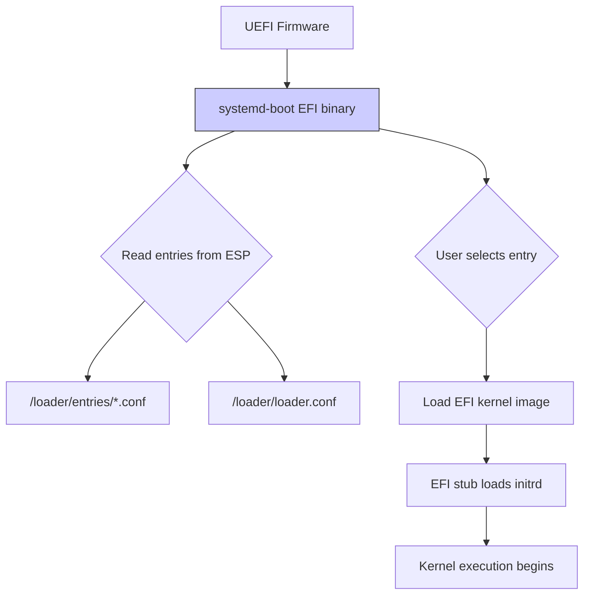
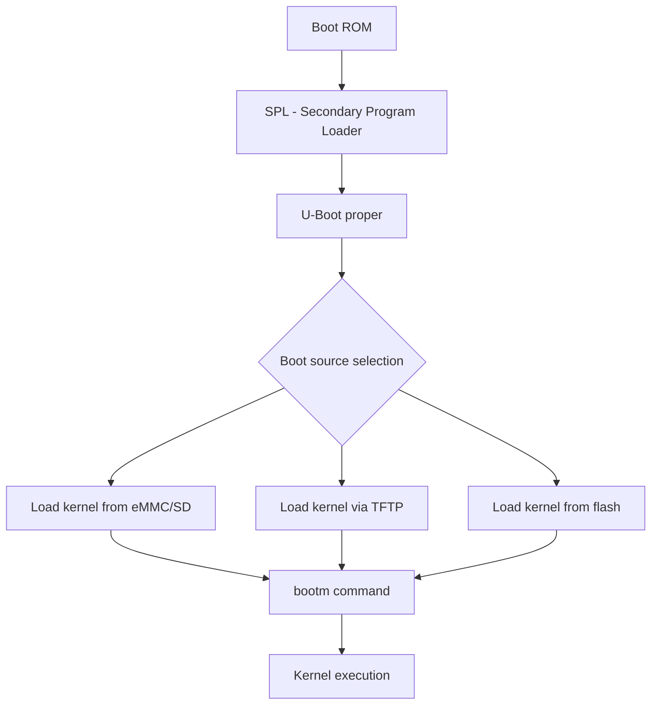
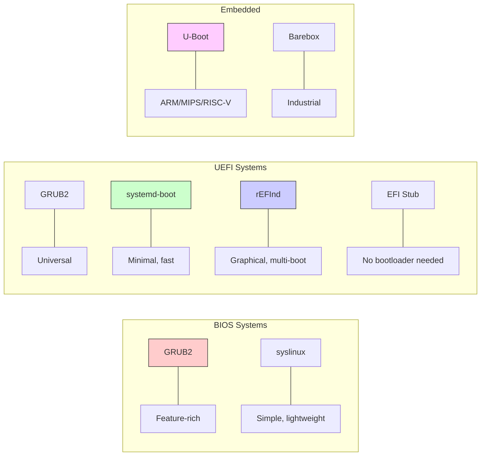
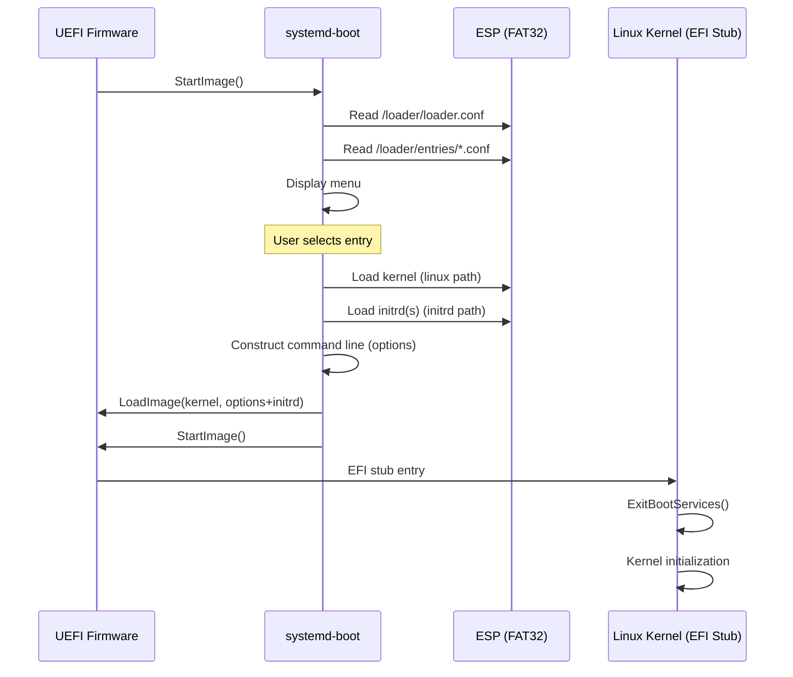
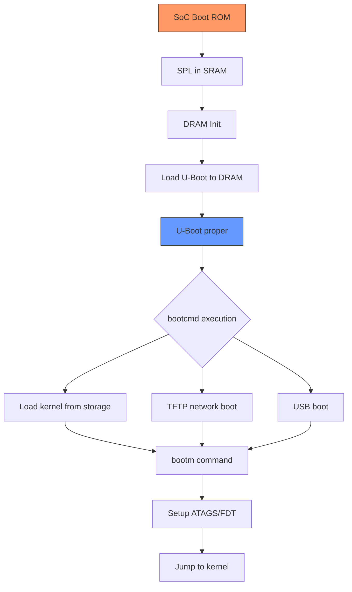

# Chapter 211: systemd-boot and Other Bootloaders

## 1. Intuition

While GRUB2 is the most widely deployed Linux bootloader, it is not the only option. Several alternatives exist for specific use cases, hardware platforms, or philosophical preferences. This chapter covers four important alternatives:

- **systemd-boot:** A minimal UEFI bootloader designed for simplicity and speed.
- **rEFInd:** A graphical UEFI boot manager focused on multi-boot scenarios.
- **syslinux:** A lightweight bootloader family for removable media and embedded systems.
- **U-Boot:** The dominant bootloader for embedded ARM, MIPS, and RISC-V systems.

The choice of bootloader depends on your hardware platform, boot requirements, and operational complexity tolerance. A server running a single Linux distribution benefits from systemd-boot's simplicity. A developer's workstation triple-booting Linux, Windows, and macOS benefits from rEFInd's graphical interface. A Raspberry Pi or embedded router requires U-Boot.

## 2. systemd-boot

### 2.1 Philosophy and Design

systemd-boot (formerly gummiboot) is a simple UEFI boot manager. Its design principles:

- **Minimal code:** ~2000 lines of C. Small attack surface.
- **UEFI-only:** No BIOS/CSM support. No legacy baggage.
- **Simple configuration:** Plain text files in the ESP. No generator scripts.
- **Fast:** No scripting engine, no filesystem drivers beyond FAT.
- **Integrated with systemd:** Uses `kernel-install` for automatic entry management.

systemd-boot is **not** a bootloader in the GRUB2 sense — it does not contain filesystem drivers or a scripting language. It simply presents a menu of EFI boot entries (which are PE/COFF executables on the ESP) and loads the selected one. For Linux, this means loading the kernel as an EFI stub application directly.

### 2.2 Architecture



systemd-boot relies on the **EFI stub** in the Linux kernel. When compiled with `CONFIG_EFI_STUB=y`, the Linux kernel itself is a valid UEFI application. systemd-boot loads it using the standard UEFI `LoadImage()` and `StartImage()` protocols.

### 2.3 Installation

```bash
# Install to ESP mounted at /boot (recommended layout)
bootctl install

# Install to ESP mounted at /boot/efi
bootctl install --esp-path=/boot/efi

# Install to a specific disk
bootctl install --esp-path=/boot/efi --boot-path=/boot

# The above creates:
# /boot/EFI/BOOT/BOOTX64.EFI  (fallback bootloader)
# /boot/EFI/systemd/systemd-bootx64.efi
# /boot/loader/loader.conf
# Registers UEFI boot entry via efibootmgr
```

### 2.4 Configuration

#### loader.conf — Global Configuration

```ini
# /boot/loader/loader.conf

# Default entry (filename without .conf in entries/)
default mylinux.conf

# Timeout in seconds (0 = no menu, -1 = wait forever)
timeout 4

# Console mode (auto, max, keep, or resolution)
console-mode max

# Whether to use firmware console (for serial)
# console-mode 80x25

# Editor access (disable for security)
editor no

# Show entries from all boot partitions
# auto-entries no

# Auto-firmware setup entry
auto-firmware yes
```

#### Boot Entry Files

Each entry is a `.conf` file in `/boot/loader/entries/`:

```ini
# /boot/loader/entries/mylinux-6.1.0.conf

# Entry title shown in menu
title    MyLinux (6.1.0-generic)

# Kernel version (used by kernel-install)
version  6.1.0-generic

# Kernel command line options
options  root=UUID=12345678-abcd-efgh-ijkl-mnopqrstuvwx rw quiet splash

# Path to kernel (relative to ESP)
linux    /vmlinuz-6.1.0-generic

# Path to initrd (relative to ESP)
initrd   /initramfs-6.1.0-generic.img

# Additional initrds (microcode updates)
initrd   /intel-ucode.img
initrd   /amd-ucode.img

# Machine ID (for automatic entry matching)
machine-id abcdef1234567890abcdef1234567890

# Architecture (for multi-arch setups)
architecture x86_64

# Volatile: entry is not permanent (auto-removed)
# volatile yes
```

#### Recovery Entry

```ini
# /boot/loader/entries/mylinux-recovery.conf
title    MyLinux (Recovery)
linux    /vmlinuz-6.1.0-generic
initrd   /initramfs-6.1.0-generic.img
options  root=UUID=xxx rw single
```

### 2.5 kernel-install Integration

systemd-boot integrates with `kernel-install`, which automates entry management:

```bash
# kernel-install is called automatically by package managers
# When a new kernel is installed:

# Debian/Ubuntu
apt install linux-image-6.1.0-generic
# postinst script calls: kernel-install add 6.1.0-generic /boot/vmlinuz-6.1.0-generic

# Fedora/RHEL
dnf install kernel-6.1.0
# postinst script calls: kernel-install add 6.1.0 /lib/modules/6.1.0/vmlinuz

# Manual invocation
kernel-install add 6.1.0-generic /boot/vmlinuz-6.1.0-generic

# Remove a kernel entry
kernel-install remove 6.1.0-generic

# List installed kernels
kernel-install list
```

The `kernel-install` script:
1. Copies the kernel to the ESP (or `/boot` if it's the ESP).
2. Generates the initramfs (if configured).
3. Creates a loader entry in `/boot/loader/entries/`.
4. Runs plugins in `/usr/lib/kernel/install.d/`.

### 2.6 systemd-bootctl Commands

```bash
# Show status
bootctl status

# Show all entries
bootctl list

# Show entries with all details
bootctl list --all

# Set default entry
bootctl set-default mylinux-6.1.0.conf

# Set default to the entry at index 0
bootctl set-default 0

# Set timeout
bootctl set-timeout 5

# Update systemd-boot binaries
bootctl update

# Check if running in EFI mode
bootctl is-installed

# Random seed management
bootctl random-seed
```

### 2.7 Disk Layout for systemd-boot

systemd-boot supports two disk layouts:

**Layout 1: Separate ESP and boot partition (recommended)**
```
/dev/sda1  512 MiB  FAT32  ESP       → mounted at /boot/efi or /efi
/dev/sda2  1 GiB    ext4   /boot     → kernels and initrds here
/dev/sda3  rest     ext4   /
```

**Layout 2: Unified /boot as ESP (simpler)**
```
/dev/sda1  1 GiB    FAT32  ESP/boot  → mounted at /boot
/dev/sda2  rest     ext4   /
```

With Layout 2, kernels live directly on the ESP, and the `linux`/`initrd` paths in entries are simply `/vmlinuz-*`.

```bash
# For Layout 2, create entries that reference files on /boot (the ESP):
# /boot/loader/entries/mylinux.conf
title    MyLinux
linux    /vmlinuz-6.1.0-generic
initrd   /initramfs-6.1.0-generic.img
options  root=UUID=xxx rw quiet
```

## 3. rEFInd

### 3.1 Design and Features

rEFInd is a graphical UEFI boot manager forked from the discontinued rEFIt. It excels at multi-boot environments:

- **Auto-detection:** Scans all EFI partitions for bootloaders and EFI stub kernels.
- **Graphical interface:** Icons for each OS, mouse support, themes.
- **Filesystem drivers:** ext2/3/4, ReiserFS, Btrfs, HFS+, NTFS — can scan `/boot` on Linux partitions.
- **EFI shell:** Built-in UEFI shell access.
- **Cross-platform:** Runs on x86, x86-64, and ARM64.

### 3.2 Installation

```bash
# Ubuntu/Debian
apt install refind

# Automatic installation to ESP
refind-install

# Manual installation
refind-install --usedefault /dev/sda1

# Install to a specific ESP
refind-install --alldrivers --esp /boot/efi
```

### 3.3 Configuration

```ini
# /boot/efi/EFI/refind/refind.conf

# Timeout in seconds
timeout 10

# Default selection (by row number or entry tag)
default_selection 1

# Screen resolution
resolution 1920 1080
# resolution max

# Theme
# theme rEFInd-Ambience

# Hide specific entries
# dont_scan_dirs EFI/boot,EFI/BOOT

# Don't scan for EFI shell
dont_scan_files shimx64.efi,fbx64.efi

# Scan all EFI system partitions
scan_all_linux_kernels true

# Also scan /boot on Linux filesystems
# (requires filesystem driver)
also_scan_dirs boot

# Enable mouse
enable_mouse true

# Show tools row
showtools shell, memtest, mok_tool, firmware, gptsync
```

### 3.4 Manual Boot Stanzas

```ini
# /boot/efi/EFI/refind/refind.conf

menuentry "MyLinux 6.1.0" {
    icon     /EFI/refind/icons/os_linux.png
    volume   "MY_BOOT"
    loader   /vmlinuz-6.1.0-generic
    initrd   /initramfs-6.1.0-generic.img
    options  "root=UUID=xxx rw quiet splash"
    submenuentry "Recovery Mode" {
        add_options "single"
    }
    submenuentry "Verbose Boot" {
        delete_options "quiet splash"
        add_options "debug"
    }
}

menuentry "Windows" {
    icon     /EFI/refind/icons/os_win.png
    loader   /EFI/Microsoft/Boot/bootmgfw.efi
}

menuentry "Ubuntu GRUB" {
    icon     /EFI/refind/icons/os_ubuntu.png
    loader   /EFI/ubuntu/grubx64.efi
}
```

### 3.5 rEFInd Filesystem Drivers

rEFInd can load Linux kernels directly from ext4/Btrfs `/boot` partitions, bypassing the ESP:

```bash
# Install filesystem drivers
cp /usr/share/refind/drivers_x64/* /boot/efi/EFI/refind/drivers_x64/

# Available drivers:
# ext4_x64.efi
# btrfs_x64.efi
# xfs_x64.efi
# hfs_x64.efi
# ntfs_x64.efi
# iso9660_x64.efi
```

With an ext4 driver installed, rEFInd can scan `/boot/vmlinuz-*` files and auto-generate entries. This is the "zero-configuration" path — you install rEFInd and it just works.

## 4. syslinux

### 4.1 Overview

syslinux is a family of bootloaders for different media:

| Variant | Purpose |
|---------|---------|
| **SYSLINUX** | Boot from FAT filesystem (USB sticks, floppies) |
| **ISOLINUX** | Boot from CD/DVD ISO 9660 |
| **PXELINUX** | Network boot via PXE/TFTP |
| **EXTLINUX** | Boot from ext2/3/4, Btrfs, XFS |

syslinux is widely used for:
- **Live USB/CD creation:** Ubuntu, Fedora, rescue disks.
- **PXE boot servers:** Network installation, diskless workstations.
- **Embedded systems:** Simple single-purpose bootloaders.

### 4.2 Installation

```bash
# Install syslinux
apt install syslinux syslinux-common    # Debian/Ubuntu
dnf install syslinux                    # Fedora

# Install to USB stick (FAT32 partition)
syslinux --install /dev/sdb1

# Install MBR code
dd if=/usr/lib/syslinux/mbr/mbr.bin of=/dev/sdb bs=440 count=1

# For ext4 partitions
extlinux --install /boot/extlinux/
```

### 4.3 Configuration (extlinux.conf)

```ini
# /boot/extlinux/extlinux.conf

UI menu.c32
PROMPT 1
TIMEOUT 50
DEFAULT linux

LABEL linux
    MENU LABEL MyLinux (Default)
    LINUX /vmlinuz-6.1.0-generic
    INITRD /initramfs-6.1.0-generic.img
    APPEND root=UUID=xxx rw quiet splash

LABEL linux-recovery
    MENU LABEL MyLinux (Recovery)
    LINUX /vmlinuz-6.1.0-generic
    INITRD /initramfs-6.1.0-generic.img
    APPEND root=UUID=xxx rw single

LABEL memtest
    MENU LABEL Memory Test
    LINUX /memtest86+.bin

MENU TITLE Boot Menu
MENU BACKGROUND #000000
MENU COLOR title 1;36;44
MENU COLOR sel 7;37;40
```

### 4.4 PXELINUX Configuration

```ini
# /srv/tftp/pxelinux.cfg/default

DEFAULT linux
PROMPT 1
TIMEOUT 50

LABEL linux
    KERNEL /images/vmlinuz-6.1.0
    APPEND initrd=/images/initramfs-6.1.0.img root=UUID=xxx rw

LABEL linux-nfs
    KERNEL /images/vmlinuz-6.1.0
    APPEND initrd=/images/initramfs-6.1.0.img root=/dev/nfs nfsroot=192.168.1.1:/export/root ip=dhcp

# Per-machine configuration (by MAC address)
# File: pxelinux.cfg/01-aa-bb-cc-dd-ee-ff
```

### 4.5 ISOLINUX for Live CDs

```bash
# Create a bootable ISO with ISOLINUX
mkdir -p iso/isolinux iso/boot

# Copy ISOLINUX files
cp /usr/lib/syslinux/isolinux.bin iso/isolinux/
cp /usr/lib/syslinux/ldlinux.c32 iso/isolinux/
cp /usr/lib/syslinux/menu.c32 iso/isolinux/
cp /usr/lib/syslinux/libutil.c32 iso/isolinux/
cp /usr/lib/syslinux/libcom32.c32 iso/isolinux/

# Create isolinux.cfg
cat > iso/isolinux/isolinux.cfg << 'EOF'
DEFAULT linux
LABEL linux
    KERNEL /boot/vmlinuz
    APPEND initrd=/boot/initrd.img root=/dev/ram0 rw
EOF

# Copy kernel and initrd
cp /boot/vmlinuz iso/boot/
cp /boot/initrd.img iso/boot/

# Create ISO
genisoimage -o output.iso \
    -b isolinux/isolinux.bin \
    -c isolinux/boot.cat \
    -no-emul-boot \
    -boot-load-size 4 \
    -boot-info-table \
    iso/
```

## 5. U-Boot (Das U-Boot)

### 5.1 Overview

U-Boot is the dominant bootloader for embedded Linux systems. It supports dozens of architectures and hundreds of boards:

- **Architectures:** ARM, ARM64, MIPS, RISC-V, x86, PowerPC, Nios II, MicroBlaze, ARC, Xtensa
- **Storage:** eMMC, SD card, SPI flash, NAND, NOR, USB, SATA, NVMe
- **Network:** TFTP, NFS, HTTP boot
- **Filesystems:** ext2/3/4, FAT, Btrfs, UBIFS, JFFS2, SquashFS

### 5.2 Architecture



U-Boot typically has two stages:
- **SPL (Secondary Program Loader):** Minimal code that fits in SRAM. Initializes DRAM, loads U-Boot proper.
- **U-Boot proper:** Full bootloader with command shell, device drivers, filesystem support.

### 5.3 U-Boot Commands

```bash
# U-Boot command line (serial console)

# List available commands
help
?                  # Same as help

# Examine memory
md.l 0x80000000 16    # Display 16 longwords at address

# Load files from storage
load mmc 0:1 0x80000000 /boot/uImage
load mmc 0:1 0x82000000 /boot/uInitrd

# TFTP network boot
setenv ipaddr 192.168.1.100
setenv serverip 192.168.1.1
tftp 0x80000000 vmlinuz
tftp 0x82000000 initrd.img

# Boot a kernel
bootm 0x80000000 0x82000000 0x83000000
# Arguments: kernel_addr initrd_addr fdt_addr

# Environment variables
printenv                        # Show all variables
setenv bootargs "root=/dev/mmcblk0p2 rw console=ttyS0"
saveenv                         # Save to persistent storage
reset                           # Reboot

# USB operations
usb start
usb storage
load usb 0:1 0x80000000 /boot/vmlinuz

# Disk operations
scsi scan
load scsi 0:1 0x80000000 /boot/vmlinuz
```

### 5.4 U-Boot Environment and Boot Scripts

```bash
# U-Boot environment variables for boot

# Common boot configuration
setenv bootargs "root=/dev/mmcblk0p2 rw console=ttyS0,115200 earlycon"
setenv kernel_addr 0x80000000
setenv initrd_addr 0x82000000
setenv fdt_addr 0x83000000
setenv fdt_file "myboard.dtb"

# Boot command sequence
setenv bootcmd "mmc dev 0; load mmc 0:1 ${kernel_addr} /boot/vmlinuz; load mmc 0:1 ${initrd_addr} /boot/initrd.img; load mmc 0:1 ${fdt_addr} /boot/${fdt_file}; bootm ${kernel_addr} ${initrd_addr} ${fdt_addr}"
saveenv

# Automatic boot from SD card
setenv bootcmd "run mmcboot"
setenv mmcboot "mmc dev 0; load mmc 0:1 0x80000000 boot.scr; source 0x80000000"
```

### 5.5 Boot Scripts (boot.scr)

U-Boot supports boot scripts — compiled text files that run a sequence of commands:

```bash
# boot.cmd (source file)
# Compile: mkimage -C none -A arm64 -T script -d boot.cmd boot.scr

echo "Starting MyLinux boot..."

# Try primary boot (eMMC)
if test -e mmc 0:2 /boot/vmlinuz; then
    echo "Booting from eMMC..."
    setenv rootdev /dev/mmcblk0p2
    run loadkernel
    run loadinitrd
    run loadfdt
    run bootkernel
fi

# Fallback to SD card
if test -e mmc 1:2 /boot/vmlinuz; then
    echo "Booting from SD card..."
    setenv rootdev /dev/mmcblk1p2
    setenv mmcdev 1
    run loadkernel
    run loadinitrd
    run loadfdt
    run bootkernel
fi

# Fallback to network
echo "Attempting network boot..."
dhcp
tftp ${kernel_addr} vmlinuz
tftp ${initrd_addr} initrd.img
setenv rootdev /dev/nfs
run bootkernel

# Subroutines
setenv loadkernel "load mmc ${mmcdev}:2 ${kernel_addr} /boot/vmlinuz"
setenv loadinitrd "load mmc ${mmcdev}:2 ${initrd_addr} /boot/initrd.img"
setenv loadfdt "load mmc ${mmcdev}:2 ${fdt_addr} /boot/${fdt_file}"
setenv bootargs "root=${rootdev} rw console=ttyS0,115200"
setenv bootkernel "bootm ${kernel_addr} ${initrd_addr} ${fdt_addr}"

setenv mmcdev 0
```

### 5.6 U-Boot Build Configuration

```bash
# Building U-Boot for a specific board

# Clone source
git clone https://source.denx.de/u-boot/u-boot.git
cd u-boot

# Configure for a board
make CROSS_COMPILE=aarch64-linux-gnu- rpi_4_defconfig

# Customize
make CROSS_COMPILE=aarch64-linux-gnu- menuconfig

# Build
make CROSS_COMPILE=aarch64-linux-gnu- -j$(nproc)

# Output files:
# u-boot.bin    - Raw binary
# u-boot.img    - With U-Boot header
# u-boot.srec   - S-record format
# spl/u-boot-spl.bin - SPL binary
```

Key configuration options:

```
# .config options
CONFIG_SYS_TEXT_BASE=0x80000000      # U-Boot load address
CONFIG_BOOTDELAY=3                     # Seconds before auto-boot
CONFIG_BOOTCOMMAND="run distro_bootcmd"  # Default boot command
CONFIG_BAUDRATE=115200                 # Serial console baud rate
CONFIG_SYS_MMC_ENV_DEV=0              # MMC device for environment
CONFIG_ENV_IS_IN_MMC=y                # Store env in MMC
CONFIG_CMD_BOOTEFI=y                  # EFI boot support
CONFIG_CMD_UBI=y                      # UBIFS support
```

## 6. Kernel Implementation

### 6.1 EFI Stub Kernel

The EFI stub turns the Linux kernel into a UEFI application. Key source files:

```
drivers/firmware/efi/libstub/
├── efi-stub-entry.c    # Main entry point
├── efilib.c            # EFI helper functions
├── fdt.c               # Flattened Device Tree support
├── secureboot.c        # Secure Boot detection
├── mem.c               # Memory allocation
├── relocate.c          # Relocation handling
├── string.c            # String utilities
└── alignedmem.c        # Memory alignment
```

The EFI stub entry point (`efi_pe_entry`) is called by the UEFI firmware:

```c
// Simplified from drivers/firmware/efi/libstub/efi-stub-entry.c

efi_status_t efi_pe_entry(efi_handle_t handle,
                           efi_system_table_t *sys_table_arg)
{
    // Set up EFI library
    efi_system_table = sys_table_arg;
    
    // Parse kernel command line from load options
    cmdline = efi_convert_cmdline(image, &cmdline_len);
    
    // Allocate memory for kernel
    status = efi_allocate_pages(KERNEL_MEM, ...);
    
    // Load kernel image into memory
    status = efi_load_kernel(image, kernel_addr, ...);
    
    // Load initrd
    status = efi_load_initrd(image, initrd_addr, ...);
    
    // Get memory map
    status = efi_get_memory_map(&map);
    
    // Exit boot services
    status = efi_exit_boot_services(handle, &map);
    
    // Jump to kernel entry
    kernel_entry = (kernel_entry_t)kernel_addr;
    kernel_entry(NULL, NULL);  // x86: real mode entry
    
    return EFI_SUCCESS;  // Never reached
}
```

### 6.2 systemd-boot Source Code

systemd-boot is part of the systemd project:

```
src/boot/efi/
├── boot.c              # Main boot manager
├── console.c           # Console/terminal handling
├── drivers.c           # Driver loading
├── measure.c           # TPM measurement
├── pe.c                # PE/COFF parser
├── random-seed.c       # Random seed management
├── secure-boot.c       # Secure Boot integration
├── shim.c              # Shim protocol support
├── splash.c            # Boot splash screen
├── stub.c              # EFI stub (alternative to kernel's)
├── ukify.py            # UKI builder
└── util.h              # Utility functions
```

## 7. Common Pitfalls

### Pitfall 1: systemd-boot on BIOS System

**Symptom:** `bootctl install` fails with "Not booted with EFI."

**Cause:** systemd-boot requires UEFI firmware. It cannot run on BIOS/CSM systems.

**Fix:** Use GRUB2 or syslinux for BIOS systems.

### Pitfall 2: Kernel Not Built with EFI Stub

**Symptom:** systemd-boot shows no entries, or kernel fails to load.

**Cause:** Kernel compiled without `CONFIG_EFI_STUB=y`.

**Fix:** Enable `CONFIG_EFI_STUB=y` and `CONFIG_EFI=y` in kernel config and rebuild.

### Pitfall 3: Wrong ESP Mount Point

**Symptom:** `bootctl install` creates files in the wrong location.

**Cause:** ESP not mounted at the expected path.

**Fix:**
```bash
# Check ESP mount point
findmnt /boot/efi
# or
findmnt /efi
# or
findmnt /boot

# Install with explicit path
bootctl install --esp-path=/boot/efi
```

### Pitfall 4: rEFInd Not Detecting Linux Kernels

**Symptom:** rEFInd menu shows Windows but not Linux.

**Cause:** Filesystem driver not installed, or kernel not on ESP.

**Fix:**
```bash
# Install filesystem drivers
cp /usr/share/refind/drivers_x64/ext4_x64.efi \
   /boot/efi/EFI/refind/drivers_x64/

# Or copy kernels to ESP
cp /boot/vmlinuz-* /boot/efi/
cp /boot/initrd.img-* /boot/efi/
```

### Pitfall 5: U-Boot Not Finding boot.scr

**Symptom:** U-Boot drops to command prompt instead of booting.

**Cause:** `boot.scr` not found on the expected media/partition.

**Fix:**
```bash
# Check U-Boot environment
printenv bootcmd

# Verify boot.scr location
ls /boot/boot.scr

# Recompile boot script
mkimage -C none -A arm64 -T script -d boot.cmd boot.scr
cp boot.scr /boot/
```

### Pitfall 6: syslinux "Failed to load ldlinux.c32"

**Symptom:** syslinux shows error loading `ldlinux.c32`.

**Cause:** Missing required library files on the boot partition.

**Fix:**
```bash
# Copy all required syslinux files
cp /usr/lib/syslinux/bios/ldlinux.c32 /boot/syslinux/
cp /usr/lib/syslinux/bios/libutil.c32 /boot/syslinux/
cp /usr/lib/syslinux/bios/libcom32.c32 /boot/syslinux/
cp /usr/lib/syslinux/bios/menu.c32 /boot/syslinux/
cp /usr/lib/syslinux/bios/vesamenu.c32 /boot/syslinux/
```

## 8. Best Practices

1. **Choose systemd-boot for single-distro UEFI systems.** Its simplicity is a feature — fewer moving parts means fewer failure modes.

2. **Use rEFInd for multi-boot UEFI systems.** Its auto-detection eliminates manual configuration for each OS.

3. **Use syslinux for removable media.** USB sticks, live CDs, and rescue disks are syslinux's sweet spot.

4. **Use U-Boot for embedded systems.** No alternative exists on most ARM/MIPS/RISC-V boards.

5. **Secure Boot considerations:**
   - systemd-boot works with Shim for Secure Boot.
   - rEFInd can be signed directly or used with Shim.
   - syslinux does not support Secure Boot (it's BIOS-only).
   - U-Boot has its own verified boot mechanism (FIT images).

6. **Keep bootloader updated:**
   ```bash
   # systemd-boot
   bootctl update
   
   # rEFInd
   refind-install
   
   # GRUB2
   grub-install /dev/sda
   grub-mkconfig -o /boot/grub/grub.cfg
   ```

7. **Test boot configuration changes** on a non-production system first. A broken bootloader means manual recovery.

8. **Document your bootloader setup** — which bootloader, where it's installed, what configuration files exist.

9. **For U-Boot, always keep a working backup** of `u-boot.bin` and environment variables on a separate medium.

10. **Consider Unified Kernel Images (UKIs)** for systemd-boot setups — they bundle kernel, initrd, cmdline, and splash into a single signed EFI binary.

## 9. Diagrams

### 9.1 Bootloader Comparison



### 9.2 systemd-boot Entry Resolution



### 9.3 U-Boot Boot Flow



## 10. Exercises

### Exercise 1: Install and Configure systemd-boot

```bash
# 1. Check if your system uses UEFI
[ -d /sys/firmware/efi ] && echo "UEFI" || echo "BIOS"

# 2. If UEFI, install systemd-boot
sudo bootctl install

# 3. Check the installation
bootctl status

# 4. Create a manual boot entry
sudo vim /boot/loader/entries/mylinux.conf
# Add title, linux, initrd, options

# 5. List entries
bootctl list

# 6. Update systemd-boot binaries
sudo bootctl update
```

### Exercise 2: Create a syslinux Bootable USB

```bash
# 1. Prepare a USB stick (WARNING: /dev/sdX is your USB device!)
sudo mkfs.fat -F32 /dev/sdX1

# 2. Install syslinux
sudo syslinux --install /dev/sdX1

# 3. Install MBR
sudo dd if=/usr/lib/syslinux/mbr/mbr.bin of=/dev/sdX bs=440 count=1

# 4. Mount and configure
sudo mount /dev/sdX1 /mnt
sudo mkdir -p /mnt/syslinux
sudo cp /usr/lib/syslinux/bios/{ldlinux.c32,menu.c32,libutil.c32,libcom32.c32,vesamenu.c32} /mnt/syslinux/

# 5. Create configuration
cat > /mnt/syslinux/syslinux.cfg << 'EOF'
UI menu.c32
PROMPT 0
TIMEOUT 50

LABEL linux
    MENU LABEL Boot Linux
    LINUX /vmlinuz
    APPEND initrd=/initrd.img root=/dev/sda1 rw

LABEL memtest
    MENU LABEL Memory Test
    LINUX /memtest86+.bin
EOF

# 6. Copy kernel files
sudo cp /boot/vmlinuz-$(uname -r) /mnt/vmlinuz
sudo cp /boot/initrd.img-$(uname -r) /mnt/initrd.img

# 7. Unmount and test
sudo umount /mnt
```

### Exercise 3: U-Boot Environment Manipulation

```bash
# On an embedded board with U-Boot:

# 1. View current environment
printenv

# 2. View boot configuration
printenv bootcmd
printenv bootargs

# 3. Modify boot arguments
setenv bootargs "root=/dev/mmcblk0p2 rw console=ttyS0,115200 loglevel=7"
saveenv

# 4. Add a fallback boot command
setenv bootcmd_fallback "mmc dev 1; load mmc 1:1 0x80000000 /boot/vmlinuz; bootm 0x80000000"
setenv bootcmd "run bootcmd_primary; run bootcmd_fallback"
saveenv

# 5. Test network boot
setenv ipaddr 192.168.1.100
setenv serverip 192.168.1.1
tftp 0x80000000 vmlinuz
bootm 0x80000000
```

### Exercise 4: Compare Boot Times

```bash
# 1. Measure systemd-boot boot time
# Install systemd-boot, then:
systemd-analyze

# 2. Measure GRUB2 boot time
# Switch to GRUB2, then:
systemd-analyze

# 3. Compare firmware time
systemd-analyze firmware
systemd-analyze bootloader

# 4. Record results
echo "systemd-boot: $(systemd-analyze | head -1)" >> boot-comparison.txt
echo "GRUB2: $(systemd-analyze | head -1)" >> boot-comparison.txt
```

## 11. References

1. **systemd-boot Documentation** — https://www.freedesktop.org/software/systemd/man/systemd-boot.html — Official man page.

2. **bootctl Documentation** — https://www.freedesktop.org/software/systemd/man/bootctl.html — bootctl man page.

3. **rEFInd Documentation** — https://www.rodsbooks.com/refind/ — Rod Smith's comprehensive rEFInd guide.

4. **syslinux Documentation** — https://wiki.syslinux.org/ — Official syslinux wiki.

5. **U-Boot Documentation** — https://docs.u-boot.org/en/latest/ — Official U-Boot documentation.

6. **Arch Wiki: systemd-boot** — https://wiki.archlinux.org/title/systemd-boot — Community documentation.

7. **Arch Wiki: rEFInd** — https://wiki.archlinux.org/title/REFInd — rEFInd setup guide.

8. **Arch Wiki: syslinux** — https://wiki.archlinux.title/Syslinux — syslinux configuration.

9. **DENX U-Boot Project** — https://www.denx.de/wiki/U-Boot — U-Boot home page.

10. **Linux EFI Stub Documentation** — `Documentation/admin-guide/efi-stub.rst` — Kernel EFI stub boot.

11. **Unified Kernel Image (UKI)** — https://uapi-group.org/specifications/specs/unified_kernel_image/ — UKI specification.

12. **kernel-install Documentation** — https://www.freedesktop.org/software/systemd/man/kernel-install.html — kernel-install man page.
