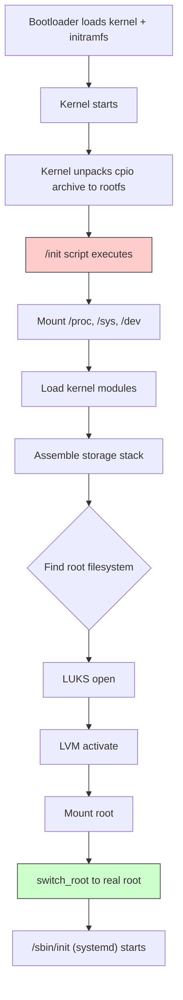
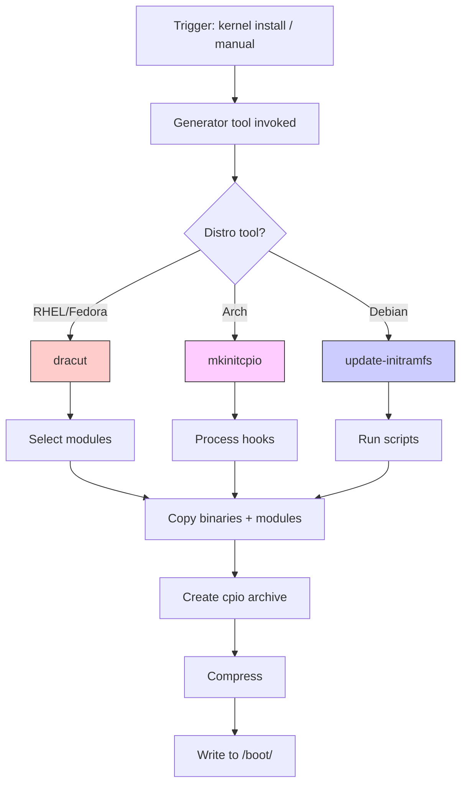
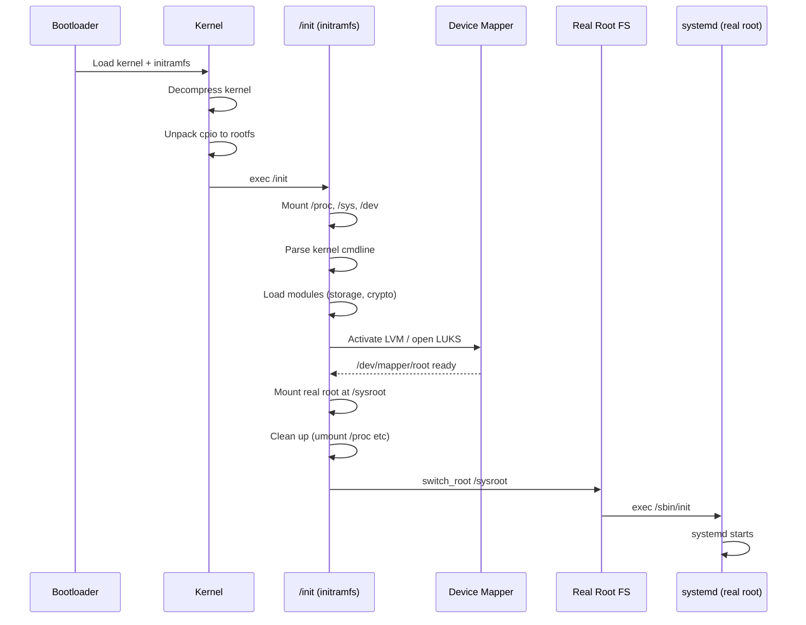
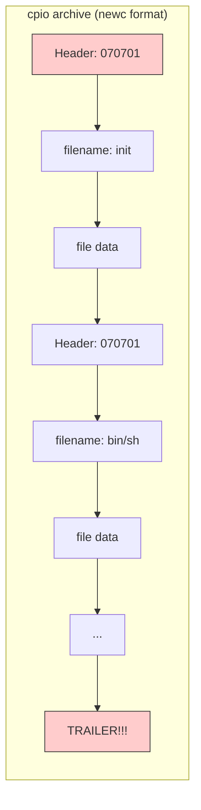

# Chapter 212: initramfs — The Initial RAM Filesystem

## 1. Intuition

When the Linux kernel starts, it needs to mount the root filesystem to find `init` (or `systemd`), configuration files, and essential binaries. But there's a chicken-and-egg problem: the root filesystem may reside on hardware that requires drivers not yet loaded. The root might be on a RAID array, an LVM logical volume, a LUKS-encrypted partition, a network filesystem, or on a device whose driver is compiled as a module rather than built into the kernel.

The **initramfs** (initial RAM filesystem) solves this problem. It is a small, temporary filesystem loaded into memory by the bootloader alongside the kernel. The kernel unpacks it and uses it as the initial root filesystem. From this temporary root, the initramfs runs scripts that load necessary modules, assemble storage stacks (LVM, RAID, LUKS), discover the real root filesystem, and then pivot to it.

Think of the initramfs as a "mini Linux" — just enough userspace to bridge the gap between kernel startup and the real root filesystem. It typically contains essential utilities (`mount`, `modprobe`, `lvm`, `cryptsetup`), kernel modules for storage and filesystem drivers, and an init script that orchestrates the handoff.

The key insight is that the initramfs is **not** a traditional ramdisk. It uses **tmpfs** (a RAM-based filesystem), and its contents are a **cpio archive** (not a disk image). This distinction matters for memory efficiency and boot speed.

## 2. Architecture

### 2.1 initrd vs. initramfs

The terms "initrd" and "initramfs" are often used interchangeably, but they refer to different mechanisms:

| Aspect | initrd (Legacy) | initramfs (Modern) |
|--------|----------------|-------------------|
| Format | ext2/minix disk image | cpio archive |
| Mount | Block device → loopback mount | tmpfs unpack |
| Kernel mechanism | `/dev/ram0` block device | tmpfs rootfs |
| Memory usage | Fixed size (allocated upfront) | Dynamic (grows as needed) |
| Pivot root | `pivot_root` system call | `switch_root` utility |
| Kernel parameter | `initrd=/initrd.img` | `initrd=/initrd.img` (same) |
| Status | Obsolete | Current standard |

### 2.2 Boot Flow with initramfs



### 2.3 initramfs Contents

A typical initramfs contains:

```
/
├── init                  # Main init script (or symlink to /sbin/init)
├── bin/                  # Essential binaries
│   ├── busybox           # Multi-call binary (provides most utilities)
│   ├── mount             # Or provided by busybox
│   ├── modprobe          # Module loader
│   ├── lvm               # LVM management
│   ├── cryptsetup        # LUKS encryption
│   └── udevadm           # Device manager
├── etc/                  # Configuration
│   ├── fstab             # Temporary mount table
│   └── modprobe.d/       # Module configuration
├── lib/                  # Libraries and kernel modules
│   ├── modules/          # Kernel modules
│   │   └── 6.1.0-generic/
│   │       ├── kernel/drivers/
│   │       └── modules.dep
│   └── lib*.so*          # Shared libraries
├── sbin/                 # System binaries
│   ├── init              # init script
│   ├── modprobe
│   └── switch_root
├── proc/                 # procfs mount point
├── sys/                  # sysfs mount point
├── dev/                  # Device nodes
│   ├── console
│   ├── null
│   ├── sda
│   └── mapper/
└── run/                  # Runtime data
```

## 3. cpio Archive Format

### 3.1 Understanding cpio

initramfs uses the **cpio** (copy in/out) archive format, specifically the "newc" (SVR4) variant. The kernel's unpacking code is in `init/initramfs.c`.

```bash
# Examine an initramfs cpio archive
# List contents
lsinitramfs /boot/initrd.img-6.1.0-generic | head -50

# More detailed listing
cpio -t < /boot/initrd.img-6.1.0-generic | head -50

# For gzip-compressed initramfs
zcat /boot/initrd.img-6.1.0-generic | cpio -t | head -50

# For LZ4-compressed initramfs
lz4 -d /boot/initrd.img-6.1.0-generic /tmp/initrd.cpio
cpio -t < /tmp/initrd.cpio | head -50
```

### 3.2 Creating a Minimal initramfs by Hand

Understanding how to build an initramfs manually demystifies the entire process:

```bash
# Create a minimal initramfs from scratch

# Create directory structure
mkdir -p /tmp/initramfs/{bin,dev,etc,lib,proc,root,sbin,sys}

# Install busybox (statically linked)
cp /bin/busybox /tmp/initramfs/bin/
cd /tmp/initramfs/bin
for cmd in sh mount umount modprobe switch_root mknod mkdir \
           cat echo grep sed awk ls cp mv ln; do
    ln -s busybox $cmd
done
cd -

# Create the init script
cat > /tmp/initramfs/init << 'INITEOF'
#!/bin/sh

# Mount essential filesystems
mount -t proc proc /proc
mount -t sysfs sysfs /sys
mount -t devtmpfs devtmpfs /dev

# Create device nodes if devtmpfs doesn't provide them
[ -e /dev/console ] || mknod /dev/console c 5 1
[ -e /dev/null ] || mknod /dev/null c 1 3

# Load essential modules
modprobe ext4
modprobe sd_mod
modprobe ahci

# Wait for root device to appear
echo "Waiting for root device..."
ROOT_UUID="12345678-abcd-efgh-ijkl-mnopqrstuvwx"
ROOT_DEV=""
for i in $(seq 1 30); do
    ROOT_DEV=$(findfs UUID=$ROOT_UUID 2>/dev/null)
    [ -n "$ROOT_DEV" ] && break
    sleep 1
done

if [ -z "$ROOT_DEV" ]; then
    echo "ERROR: Root device not found!"
    echo "Dropping to emergency shell."
    exec /bin/sh
fi

# Mount root filesystem
mount -o ro "$ROOT_DEV" /root

# Clean up
umount /proc
umount /sys
umount /dev

# Switch to real root
exec switch_root /root /sbin/init
INITEOF
chmod +x /tmp/initramfs/init

# Create the cpio archive
cd /tmp/initramfs
find . | cpio -o -H newc > /tmp/initramfs.cpio
cd -

# Compress
gzip -9 /tmp/initramfs.cpio

# Copy to boot
cp /tmp/initramfs.cpio.gz /boot/initramfs-custom.img
```

### 3.3 Multi-segment initramfs

The Linux kernel supports multiple cpio archives concatenated together. This is used for microcode updates:

```bash
# Kernel processes cpio archives in sequence:
# 1. Microcode updates (intel-ucode.img, amd-ucode.img)
# 2. Main initramfs

# The kernel decompresses each archive and unpacks it to rootfs
# Later archives overwrite earlier ones (overlay behavior)

# Create multi-segment initramfs
cat /boot/intel-ucode.img /boot/initrd.img > /boot/initrd-combined.img
```

## 4. Kernel Implementation

### 4.1 Kernel initramfs Processing

The kernel's initramfs handling is in `init/initramfs.c`:

```c
// Simplified from init/initramfs.c

static int __init populate_rootfs(void)
{
    // Check if initrd is a cpio archive (initramfs)
    // or a filesystem image (legacy initrd)
    
    char *err = unpack_to_rootfs(__initramfs_start,
                                  __initramfs_size);
    if (err)
        panic("Failed to unpack initramfs: %s", err);
    
    // If external initrd provided, unpack it too
    if (initrd_start) {
        // Try cpio format first
        err = unpack_to_rootfs((char *)initrd_start,
                                initrd_end - initrd_start);
        if (!err)
            return 0;  // Success: it was initramfs
        
        // Fall back to legacy initrd (block device)
        create_dev("/dev/ram", MKDEV(RAMDISK_MAJOR, 0));
        mount_root_legacy();
    }
    
    return 0;
}
```

The kernel's cpio extraction code:
```c
// From init/initramfs.c - cpio header parsing
struct cpio_header {
    char c_magic[6];      // "070701" for newc format
    char c_ino[8];
    char c_mode[8];
    char c_uid[8];
    char c_gid[8];
    char c_nlink[8];
    char c_mtime[8];
    char c_filesize[8];
    // ... more fields
};

// The kernel extracts each entry and creates it in rootfs:
// - Regular files: written to rootfs
// - Directories: mkdir in rootfs
// - Symlinks: created in rootfs
// - Device nodes: created via init code
```

### 4.2 The /init Process

When the kernel finishes unpacking the initramfs, it attempts to execute one of these (in order):

1. `/init`
2. `/sbin/init`
3. `/etc/init`
4. `/bin/init`
5. `/bin/sh` (if `panic_on_init` is set)

```c
// From init/main.c
static noinline void __init kernel_init_freeable(void)
{
    // Wait for kthreadd to start
    wait_for_completion(&kthreadd_done);
    
    // Initialize subsystems
    do_basic_setup();
    
    // Try to load default init
    if (ramdisk_execute_command)
        run_init_process(ramdisk_execute_command);  // /init
    
    if (execute_command)
        run_init_process(execute_command);  // init= parameter
    
    // Try standard init locations
    if (!run_init_process("/sbin/init") ||
        !run_init_process("/etc/init") ||
        !run_init_process("/bin/init") ||
        !run_init_process("/bin/sh"))
        return;
    
    panic("No working init found.");
}
```

### 4.3 switch_root

`switch_root` is the utility that transitions from the initramfs to the real root filesystem:

```c
// switch_root does the following:
// 1. Mount new root on /mnt
// 2. Delete all files on the initramfs rootfs (to free memory)
// 3. chdir to new root
// 4. mount --move /mnt /
// 5. chroot .
// 6. exec /sbin/init

// Critical: switch_root deletes the old rootfs contents
// If you don't use switch_root, the initramfs stays in memory
```

## 5. dracut

### 5.1 Overview

dracut is the initramfs generator used by Red Hat, Fedora, CentOS, SUSE, and many other distributions. Its name comes from the German "Drache" (dragon) — it generates the initramfs.

### 5.2 Usage

```bash
# Generate initramfs for current kernel
dracut

# Generate for specific kernel version
dracut /boot/initramfs-6.1.0.img 6.1.0

# Force regeneration
dracut --force

# Verbose output
dracut --verbose

# Add specific modules
dracut --add "lvm crypt" /boot/initramfs-6.1.0.img 6.1.0

# Include specific drivers
dracut --add-drivers "ahci ext4" /boot/initramfs-6.1.0.img 6.1.0

# Omit modules
dracut --omit "network iscsi" /boot/initramfs-6.1.0.img 6.1.0

# Show what would be included (dry run)
dracut --list-modules

# Host-only mode (default on most distros)
dracut --hostonly

# Generic mode (includes all drivers — larger but portable)
dracut --no-hostonly

# Set compression
dracut --compress "gzip -9"
dracut --compress "lz4"
dracut --compress "zstd"
dracut --no-compress
```

### 5.3 dracut Configuration

```bash
# /etc/dracut.conf.d/*.conf

# Global settings
# /etc/dracut.conf
# hostonly="yes"
# compress="zstd"

# Custom module configuration
# /etc/dracut.conf.d/custom.conf
add_dracutmodules+=" lvm crypt "
omit_dracutmodules+=" network iscsi "
add_drivers+=" ahci nvme "
kernel_cmdline="rd.luks.uuid=xxx rd.lvm.vg=myvg"
```

### 5.4 dracut Modules

dracut is modular. Each module is a directory in `/usr/lib/dracut/modules.d/`:

```
/usr/lib/dracut/modules.d/
├── 00bash/              # Bash shell
├── 00systemd/           # systemd in initramfs
├── 90crypt/             # LUKS encryption
├── 90lvm/               # LVM support
├── 90mdraid/            # Software RAID
├── 90multipath/         # Multipath I/O
├── 90network/           # Network boot
├── 90iscsi/             # iSCSI boot
├── 95nfs/               # NFS root
├── 95rootfs-block/      # Block device root
├── 95dasd/              # DASD (s390x)
└── 99base/              # Base utilities
```

Each module contains:
- `module-setup.sh` — Called during initramfs generation
- `check()` — Determines if module should be included
- `install()` — Copies files into the initramfs
- `installkernel()` — Copies kernel modules

### 5.5 dracut Emergency Shell

When the initramfs fails to find the root filesystem, dracut drops to an emergency shell:

```bash
# In the dracut emergency shell:

# Check available devices
blkid
ls /dev/sd*
ls /dev/mapper/

# Check if modules are loaded
lsmod

# Try loading a missing module
modprobe ahci

# Manually activate LVM
lvm vgchange -ay

# Manually open LUKS
cryptsetup luksOpen /dev/sda3 cryptroot

# Mount root manually
mount /dev/mapper/cryptroot /sysroot
exit  # Continue boot
```

### 5.6 Analyzing initramfs Contents

```bash
# List contents of an initramfs
lsinitramfs /boot/initramfs-$(uname -r).img | less

# Extract initramfs to directory
mkdir /tmp/initrd-extract
cd /tmp/initrd-extract
/usr/lib/dracut/skipcpio /boot/initramfs-$(uname -r).img | \
    zcat | cpio -idmv 2>/dev/null
# Or for newer dracut:
lsinitrd /boot/initramfs-$(uname -r).img

# Find specific files
lsinitramfs /boot/initramfs-$(uname -r).img | grep -i "crypt"

# Check included modules
lsinitramfs /boot/initramfs-$(uname -r).img | grep -i "module"

# Estimate size
lsinitrd /boot/initramfs-$(uname -r).img | tail -1
```

## 6. mkinitcpio (Arch Linux)

### 6.1 Overview

mkinitcpio is Arch Linux's initramfs generator. It uses a declarative configuration approach with "hooks."

### 6.2 Configuration

```bash
# /etc/mkinitcpio.conf

# Hooks to run during initramfs generation
HOOKS=(base udev autodetect modconf block filesystems keyboard fsck)

# Add for LUKS encryption:
# HOOKS=(base udev autodetect modconf block encrypt filesystems keyboard fsck)

# Add for LVM:
# HOOKS=(base udev autodetect modconf block lvm2 filesystems keyboard fsck)

# Add for RAID:
# HOOKS=(base udev autodetect modconf block mdadm_udev filesystems keyboard fsck)

# Compression algorithm
COMPRESSION="zstd"
# COMPRESSION="gzip"
# COMPRESSION="lz4"
# COMPRESSION="xz"

# Compression options
COMPRESSION_OPTIONS=(-19)  # zstd level 19

# Modules to include (auto-detected if empty)
MODULES=()
# Add specific modules:
# MODULES=(ahci ext4 dm-crypt)

# Binaries to include
BINARIES=()

# Files to include
FILES=()

# Kernel command line for fallback
# (used with fallback image)
```

### 6.3 Hooks

Hooks are shell scripts in `/usr/lib/initcpio/hooks/`:

```
/usr/lib/initcpio/hooks/
├── base         # Base filesystem setup
├── udev         # Device manager
├── autodetect   # Remove unnecessary modules
├── modconf      # Module configuration files
├── block        # Block device drivers
├── filesystems  # Filesystem drivers
├── keyboard     # Keyboard drivers
├── encrypt      # LUKS encryption
├── lvm2         # LVM support
├── mdadm_udev   # Software RAID
├── fsck         # Filesystem check
└── resume       # Hibernate/resume support
```

### 6.4 Usage

```bash
# Generate initramfs for all installed kernels
mkinitcpio -P

# Generate for specific preset
mkinitcpio -p linux

# Generate for specific kernel
mkinitcpio -k 6.1.0-arch1-1 -g /boot/initramfs-custom.img

# Verbose generation
mkinitcpio -P -v

# Dry run (show what would be done)
mkinitcpio -P -n

# Generate fallback image (all modules)
mkinitcpio -P  # Generates both normal and fallback

# List available hooks
mkinitcpio -L

# Test configuration
mkinitcpio -T
```

### 6.5 Custom Hooks

```bash
# Create a custom hook
# /usr/lib/initcpio/hooks/myhook

run_hook() {
    msg "Custom hook: loading additional modules"
    modprobe dm-crypt
    modprobe aesni-intel
}

# /usr/lib/initcpio/install/myhook

build() {
    add_module dm-crypt
    add_module aesni-intel
    add_binary cryptsetup
    add_runscript
}

help() {
    cat <<HELPEOF
This hook loads custom encryption modules.
HELPEOF
}
```

## 7. Unpacking and Modifying initramfs

### 7.1 Manual Unpacking

```bash
# Method 1: Using unmkinitramfs (dracut systems)
unmkinitramfs /boot/initramfs-$(uname -r).img /tmp/initrd/

# Method 2: Manual cpio extraction
mkdir /tmp/initrd
cd /tmp/initrd

# Determine compression
file /boot/initramfs-$(uname -r).img
# Output: /boot/initramfs.img: gzip compressed data
# Output: /boot/initramfs.img: Zstandard compressed data

# Extract based on compression type
zcat /boot/initramfs-$(uname -r).img | cpio -idmv    # gzip
lz4 -dc /boot/initramfs-$(uname -r).img | cpio -idmv  # lz4
zstd -dc /boot/initramfs-$(uname -r).img | cpio -idmv # zstd

# Method 3: For dracut (multi-segment)
# dracut initramfs may have a prepended microcode segment
# Use skipcpio to skip it:
/usr/lib/dracut/skipcpio /boot/initramfs-$(uname -r).img | \
    zcat | cpio -idmv
```

### 7.2 Modifying and Repacking

```bash
# Modify the extracted initramfs
cd /tmp/initrd

# Add a missing module
cp /lib/modules/$(uname -r)/kernel/drivers/scsi/ahci.ko \
   lib/modules/$(uname -r)/kernel/drivers/scsi/

# Edit the init script
vim init

# Add a debug shell
echo '#!/bin/sh' > debug-shell.sh
echo 'exec /bin/sh' >> debug-shell.sh
chmod +x debug-shell.sh

# Repack
find . | cpio -o -H newc | gzip -9 > /tmp/initramfs-modified.img

# Or with different compression:
find . | cpio -o -H newc | zstd -19 > /tmp/initramfs-modified.img
find . | cpio -o -H newc | lz4 -l > /tmp/initramfs-modified.img

# Install
cp /tmp/initramfs-modified.img /boot/initramfs-$(uname -r).img
```

### 7.3 Adding Kernel Modules to initramfs

```bash
# Method 1: Via dracut configuration
echo 'add_drivers+=" mymodule "' > /etc/dracut.conf.d/mymod.conf
dracut --force

# Method 2: Via mkinitcpio
# Add to MODULES array in /etc/mkinitcpio.conf
MODULES=(mymodule)
mkinitcpio -P

# Method 3: Direct modification
cd /tmp/initrd
mkdir -p lib/modules/$(uname -r)/extra
cp /lib/modules/$(uname -r)/extra/mymodule.ko \
   lib/modules/$(uname -r)/extra/
depmod -a -b /tmp/initrd  # Regenerate dependency file
# Repack as shown above
```

## 8. Common Pitfalls

### Pitfall 1: Missing Storage Drivers in initramfs

**Symptom:** Kernel panic: "VFS: Unable to mount root fs on unknown-block(0,0)"

**Cause:** The initramfs doesn't contain the driver for the storage controller.

**Fix:**
```bash
# Determine which driver is needed
lspci -k | grep -A3 "Storage controller"
# Or
lsmod | grep -i "ahci\|nvme\|megaraid"

# Add to initramfs
# For dracut:
echo 'add_drivers+=" ahci nvme "' > /etc/dracut.conf.d/storage.conf
dracut --force

# For mkinitcpio:
MODULES=(ahci nvme)
mkinitcpio -P
```

### Pitfall 2: LUKS-Encrypted Root Not Unlocked

**Symptom:** Boot fails asking for root device password, or drops to emergency shell.

**Cause:** The `cryptsetup` binary or dm-crypt module not in initramfs.

**Fix:**
```bash
# For dracut:
echo 'add_dracutmodules+=" crypt "' > /etc/dracut.conf.d/crypt.conf
echo 'kernel_cmdline+=" rd.luks.uuid=YOUR-LUKS-UUID "' >> /etc/dracut.conf.d/crypt.conf
dracut --force

# For mkinitcpio:
HOOKS=(base udev autodetect modconf block encrypt lvm2 filesystems keyboard fsck)
mkinitcpio -P
```

### Pitfall 3: LVM Not Activated

**Symptom:** Root device on LVM not found.

**Cause:** LVM tools or dm-mod not included in initramfs.

**Fix:**
```bash
# For dracut:
dracut --add "lvm" --force

# For mkinitcpio:
HOOKS=(base udev autodetect modconf block lvm2 filesystems keyboard fsck)
mkinitcpio -P
```

### Pitfall 4: initramfs Too Large

**Symptom:** Slow boot, high memory usage.

**Cause:** Generic initramfs includes all drivers instead of just needed ones.

**Fix:**
```bash
# For dracut: use hostonly mode
dracut --hostonly --force

# For mkinitcpio: use autodetect hook
HOOKS=(base udev autodetect modconf block filesystems keyboard fsck)
# autodetect removes modules not needed for current hardware

# Check size difference
ls -lh /boot/initramfs-*.img
```

### Pitfall 5: Wrong initramfs for Kernel Version

**Symptom:** Kernel panic with version mismatch errors.

**Cause:** initramfs built for a different kernel version.

**Fix:**
```bash
# Rebuild for correct kernel
dracut --force --kver $(uname -r)
# or
mkinitcpio -k $(uname -r) -g /boot/initramfs-$(uname -r).img
```

### Pitfall 6: Microcode Not Loaded

**Symptom:** Early boot warnings about CPU microcode.

**Cause:** Microcode images not prepended to initramfs.

**Fix:**
```bash
# Install microcode packages
apt install intel-microcode    # Debian/Ubuntu (Intel)
apt install amd64-microcode    # Debian/Ubuntu (AMD)
dnf install microcode_ctl      # Fedora/RHEL

# Regenerate initramfs (microcode is auto-included)
dracut --force
# or
mkinitcpio -P

# Verify
lsinitramfs /boot/initramfs-$(uname -r).img | grep -i microcode
```

## 9. Best Practices

1. **Use hostonly mode** for production systems — smaller initramfs, faster boot:
   ```bash
   # dracut
   dracut --hostonly
   # mkinitcpio: autodetect hook handles this
   ```

2. **Use generic mode** for rescue/installation media — all drivers included:
   ```bash
   dracut --no-hostonly
   ```

3. **Include microcode updates** in the initramfs for early CPU bug fixes.

4. **Compress with zstd** for best balance of speed and size:
   ```bash
   # dracut
   echo 'compress="zstd"' >> /etc/dracut.conf
   # mkinitcpio
   COMPRESSION="zstd"
   ```

5. **Test initramfs changes** on a non-critical system first. A broken initramfs means the system won't boot.

6. **Keep the previous initramfs** when making changes:
   ```bash
   cp /boot/initramfs-$(uname -r).img /boot/initramfs-$(uname -r).img.bak
   ```

7. **Regenerate initramfs after:**
   - Kernel updates (usually automatic)
   - Changing root filesystem type
   - Adding/removing LUKS encryption
   - Changing LVM configuration
   - Adding new storage controllers
   - Changing `/etc/fstab` root device

8. **Use `dracut --list-modules`** to verify which modules are included.

9. **For debugging**, add `rd.break` to kernel command line to pause at various stages:
   ```bash
   # In GRUB, edit the kernel line to add:
   rd.break                    # Break before root mount
   rd.break=pre-mount          # Break before mounting
   rd.break=pre-udev           # Break before udev
   rd.shell                    # Shell on failure
   ```

10. **Keep initramfs size reasonable** — under 30 MiB for hostonly, under 100 MiB for generic.

## 10. Diagrams

### 10.1 initramfs Generation Process



### 10.2 initramfs Boot Sequence Detail



### 10.3 cpio Archive Structure



## 11. Exercises

### Exercise 1: Examine Your initramfs

```bash
# 1. Find your current initramfs
ls -lh /boot/initramfs-$(uname -r)*

# 2. List its contents
lsinitramfs /boot/initramfs-$(uname -r).img | head -100

# 3. Count files by type
lsinitramfs /boot/initramfs-$(uname -r).img | wc -l
lsinitramfs /boot/initramfs-$(uname -r).img | grep "\.ko$" | wc -l
lsinitramfs /boot/initramfs-$(uname -r).img | grep "bin/" | wc -l

# 4. Check compression type
file /boot/initramfs-$(uname -r).img

# 5. Measure uncompressed size
zstd -dc /boot/initramfs-$(uname -r).img | wc -c
```

### Exercise 2: Extract and Inspect initramfs

```bash
# 1. Create working directory
mkdir -p /tmp/initrd-inspect && cd /tmp/initrd-inspect

# 2. Extract
unmkinitramfs /boot/initramfs-$(uname -r).img .
# Or manually:
# zcat /boot/initramfs-$(uname -r).img | cpio -idmv

# 3. Examine the init script
cat init
# Or
cat scripts/init

# 4. List included kernel modules
find . -name "*.ko" -o -name "*.ko.zst" | head -50

# 5. Check which binaries are included
find . -type f -executable | head -30

# 6. Check total size
du -sh .
```

### Exercise 3: Build a Minimal initramfs

```bash
# 1. Create directory structure
mkdir -p /tmp/minimal-initramfs/{bin,dev,etc,lib,proc,root,sbin,sys}

# 2. Copy busybox (statically linked)
cp $(which busybox) /tmp/minimal-initramfs/bin/
cd /tmp/minimal-initramfs/bin
for cmd in sh mount umount modprobe mknod mkdir cat echo ls; do
    ln -s busybox $cmd
done
cd -

# 3. Create init script
cat > /tmp/minimal-initramfs/init << 'EOF'
#!/bin/sh
mount -t proc proc /proc
mount -t sysfs sysfs /sys
mount -t devtmpfs devtmpfs /dev
echo "Minimal initramfs loaded!"
echo "Root device: $(cat /proc/cmdline | grep -o 'root=[^ ]*')"
exec /bin/sh
EOF
chmod +x /tmp/minimal-initramfs/init

# 4. Create cpio archive
cd /tmp/minimal-initramfs
find . | cpio -o -H newc | gzip > /tmp/minimal-initramfs.img

# 5. Test with QEMU (if available)
# qemu-system-x86_64 -kernel /boot/vmlinuz-$(uname -r) \
#     -initrd /tmp/minimal-initramfs.img \
#     -append "console=ttyS0" -nographic
```

### Exercise 4: Debug a Boot Failure

```bash
# 1. Add rd.break to kernel command line (in GRUB)
# Edit boot entry, add "rd.break" to kernel parameters

# 2. In the dracut emergency shell:
# Check what devices exist
blkid
ls /dev/sd* /dev/nvme* /dev/mapper/

# Check if modules loaded
lsmod

# Check kernel messages
dmesg | tail -50

# Try manual root mount
mount /dev/sda2 /sysroot
# If this works, the initramfs is missing auto-detection

# 3. After booting, fix the initramfs
dracut --force --add "filesystems block"
```

## 12. References

1. **dracut Documentation** — https://github.com/dracutdevs/dracut/wiki — Official dracut wiki.

2. **dracut.conf Man Page** — https://man7.org/linux/man-pages/man5/dracut.conf.5.html — Configuration reference.

3. **mkinitcpio Documentation** — https://wiki.archlinux.org/title/Mkinitcpio — Arch Wiki mkinitcpio guide.

4. **Linux Kernel initramfs Documentation** — `Documentation/filesystems/ramfs-rootfs-initramfs.rst` — Official kernel docs.

5. **Linux Kernel initrd Documentation** — `Documentation/admin-guide/initrd.rst` — Legacy initrd documentation.

6. **Arch Wiki: mkinitcpio** — https://wiki.archlinux.org/title/Mkinitcpio — Comprehensive mkinitcpio guide.

7. **RHEL: Custom initramfs** — https://docs.redhat.com/en/documentation/red_hat_enterprise_linux/9/ — RHEL initramfs documentation.

8. **BusyBox** — https://busybox.net/ — Minimal userspace for initramfs.

9. **cpio Format Specification** — https://www.freebsd.org/cgi/man.cgi?query=cpio&sektion=5 — cpio archive format.

10. **switch_root Man Page** — https://man7.org/linux/man-pages/man8/switch_root.8.html — switch_root documentation.

11. **systemd in initramfs** — https://systemd.io/INITRD_INTERFACE/ — systemd's initramfs interface specification.
