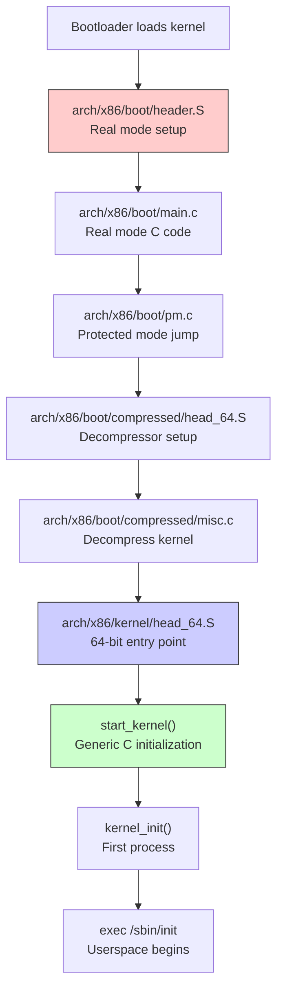
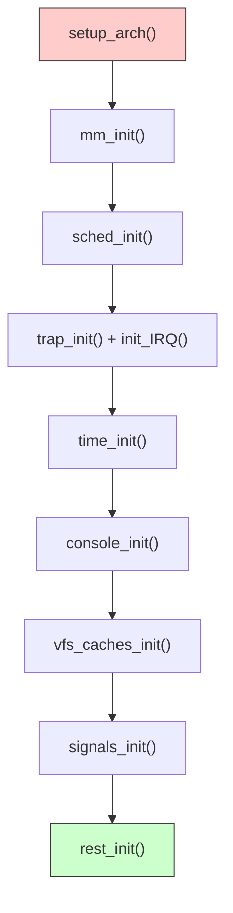
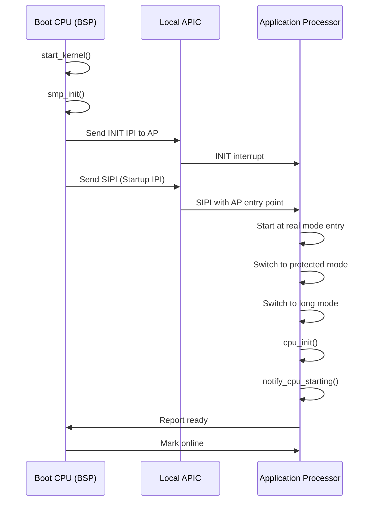
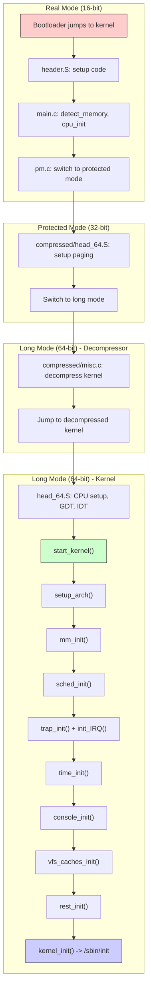
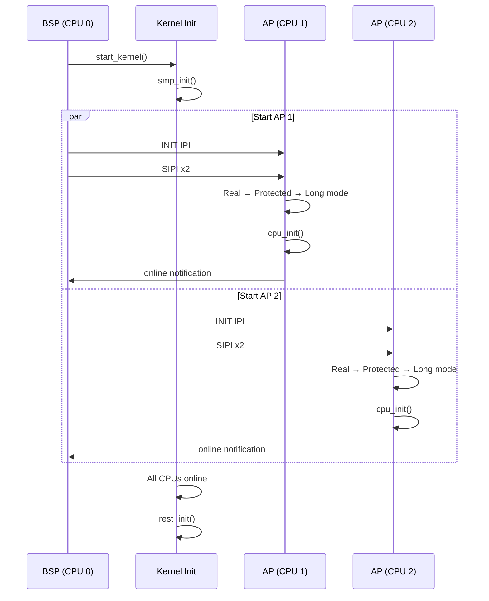

# Chapter 213: Kernel Startup Sequence

## 1. Intuition

When the bootloader hands control to the Linux kernel, a precisely choreographed sequence of initialization begins. The kernel must set up the CPU, memory management, interrupts, device drivers, and the root filesystem — all before the first user-space process can run. Understanding this sequence is essential for diagnosing early boot failures, optimizing boot time, and comprehending how the kernel's major subsystems are initialized.

The kernel startup can be divided into three major phases:

1. **Architecture-specific early setup** (assembly language): Setting up the initial CPU state, page tables, and stack.
2. **Generic kernel initialization** (C code): `start_kernel()` and its many initialization calls.
3. **Init process launch**: Creating the first user-space process.

Each phase has its own failure modes, debugging techniques, and optimization opportunities. The sequence is remarkably consistent across architectures, though the assembly-level details differ between x86, ARM64, RISC-V, and others.

## 2. Architecture

### 2.1 x86-64 Boot Flow Overview



### 2.2 The Three Stages

The x86-64 kernel boots in three distinct stages:

**Stage 1: Real Mode Setup** — Assembly code that sets up the initial environment, queries hardware, and prepares for protected mode. This code runs in 16-bit real mode (the same mode the BIOS runs in).

**Stage 2: Decompression** — Protected-mode (and eventually long-mode) code that decompresses the kernel image. The compressed kernel (bzImage) is typically ~10 MiB; the decompressed kernel is ~30-50 MiB.

**Stage 3: Kernel Initialization** — 64-bit C code starting at `start_kernel()` that initializes all kernel subsystems.

## 3. Kernel Implementation

### 3.1 Stage 1: Real Mode Setup

The boot protocol begins at `arch/x86/boot/header.S`. This is the structure that the bootloader reads to understand how to load the kernel:

```asm
# arch/x86/boot/header.S (simplified)

    .section ".header"
    .code16

# Boot protocol header at offset 0x1f1
setup_sects:    .byte 0          # Number of setup sectors
root_flags:     .word 0
syssize:        .long 0
ram_size:       .word 0
vid_mode:       .word 0
root_dev:       .word 0
boot_flag:      .word 0xAA55     # Magic number

# Extended boot protocol
jump:           .word 0          # Jump instruction
header:         .ascii "HdrS"    # Header signature
version:        .word 0x020c     # Protocol version
```

The real-mode C code in `arch/x86/boot/main.c` performs:

```c
// arch/x86/boot/main.c (simplified)

void main(void)
{
    // Initialize stack
    stack_init();
    
    // Copy boot parameters from bootloader
    copy_boot_params();
    
    // Initialize console for early output
    console_init();
    
    // Query BIOS for memory map
    init_mem();
    
    // Detect CPU type and features
    cpu_init();
    
    // Set up keyboard
    keyboard_init();
    
    // Query BIOS for E820 memory map
    detect_memory();
    
    // Set video mode
    set_video();
    
    // Jump to protected mode
    go_to_protected_mode();
}
```

The memory detection via BIOS INT 15h:

```c
// arch/x86/boot/memory.c

static void detect_memory_e820(void)
{
    struct biosregs ireg, oreg;
    struct e820entry *desc = boot_params.e820_table;
    int count = 0;
    
    initregs(&ireg);
    ireg.ax = 0xe820;
    ireg.edx = SMAP;           // Signature "SMAP"
    ireg.ecx = sizeof(*desc);  // Buffer size
    
    do {
        intcall(0x15, &ireg, &oreg);  // BIOS call
        ireg.ebx = oreg.ebx;          // Continuation value
        
        if (oreg.eax != SMAP)
            break;
        
        desc->addr = oreg.edx << 16 | oreg.ebx;
        desc->size = oreg.ecx;
        desc->type = oreg.eax;
        
        count++;
        desc++;
    } while (ireg.ebx != 0);  // ebx=0 means end
    
    boot_params.e820_entries = count;
}
```

### 3.2 Stage 2: Kernel Decompression

After switching to protected mode, the decompressor runs:

```asm
# arch/x86/boot/compressed/head_64.S (simplified)

    .code32
    .section ".text"

startup_32:
    # Set up segments
    cld
    cli
    lgdt gdt

    # Switch to 64-bit long mode
    # Set up initial page tables
    # Enable PAE
    # Enable long mode in EFER MSR
    # Enable paging

    .code64
    # Now in 64-bit mode
    # Set up stack
    leaq boot_stack_end(%rip), %rsp

    # Decompress kernel
    call extract_kernel

    # Jump to decompressed kernel
    jmp *%rax
```

The decompression code:

```c
// arch/x86/boot/compressed/misc.c

asmlinkage __visible void *extract_kernel(
    void *rmode,           // Real-mode boot params
    unsigned char *output  // Destination for decompressed kernel
)
{
    // Initialize console for decompression messages
    debug_putstr("Decompressing Linux...");
    
    // Choose decompression algorithm
    // (gzip, bzip2, lzma, xz, lz4, zstd — depending on config)
    __decompress(input_data, input_len, NULL, NULL,
                 output, output_len, NULL, error);
    
    debug_putstr("done.\nBooting the kernel.\n");
    
    // Return address of decompressed kernel entry point
    return output;
}
```

### 3.3 Stage 3: start_kernel() — The Heart of Initialization

The function `start_kernel()` in `init/main.c` is the central initialization routine. Every subsystem starts here:

```c
// init/main.c (simplified but comprehensive)

asmlinkage __visible void __init start_kernel(void)
{
    // ---- Very Early Initialization ----
    
    // Disable interrupts
    local_irq_disable();
    
    // Architecture-specific early setup
    setup_arch(&command_line);
    
    // Set up initial stack and thread info
    setup_command_line(command_line);
    setup_per_cpu_areas();
    
    // ---- Core Subsystem Initialization ----
    
    // Scheduler must come first
    sched_init();
    
    // Memory management initialization
    mm_init();    // Includes:
                  //   - mem_init()
                  //   - kmem_cache_init()
                  //   - setup_per_cpu_pageset()
    
    // Interrupt subsystem
    trap_init();
    init_IRQ();
    
    // Timekeeping
    time_init();
    
    // Console (now we can printk!)
    console_init();
    
    // ---- Print the banner ----
    pr_notice("%s", linux_banner);
    
    // ---- Security and Access Control ----
    security_init();
    
    // ---- Virtual Filesystem ----
    vfs_caches_init();
    
    // ---- Process Management ----
    // Rest of initialization continues...
    
    // Set up signals
    signals_init();
    
    // ---- BPF ----
    bpf_init();
    
    // ---- Final Steps ----
    
    // Create the rest_init thread (PID 1 = kernel_init, PID 2 = kthreadd)
    rest_init();
}
```

### 3.4 Key Subsystem Initialization Order

The order of initialization is critical — later subsystems depend on earlier ones:



### 3.5 setup_arch() — Architecture Initialization

`setup_arch()` is the most architecture-specific function in the boot sequence:

```c
// arch/x86/kernel/setup.c (simplified)

void __init setup_arch(char **cmdline_p)
{
    // ---- Memory Detection ----
    
    // Process E820 memory map from bootloader
    e820__memory_setup();
    
    // Parse kernel command line for mem= options
    parse_early_param();
    
    // ---- CPU Setup ----
    
    // Identify CPU model, features, bugs
    identify_boot_cpu();
    
    // Set up per-CPU data
    x86_init.oem.arch_setup();
    
    // ---- Memory Management ----
    
    // Reserve memory regions (kernel text, initrd, etc.)
    reserve_standard_io_resources();
    
    // Set up page tables
    init_mem_mapping();
    
    // ---- Interrupts ----
    
    // Set up APIC (Advanced Programmable Interrupt Controller)
    init_apic_mappings();
    
    // ---- Device Tree / ACPI ----
    
    // Parse ACPI tables
    acpi_boot_init();
    
    // ---- Kernel Command Line ----
    
    *cmdline_p = boot_command_line;
    
    // Copy bootloader parameters
    memcpy(&boot_params, real_mode, sizeof(boot_params));
}
```

### 3.6 mm_init() — Memory Management Initialization

```c
// init/main.c and mm/ functions

void __init mm_init(void)
{
    // Initialize page allocator
    page_ext_init_flatmem();
    mem_init();           // Free bootmem to buddy allocator
    kmem_cache_init();    // Initialize SLAB/SLUB allocator
    // ...
    
    // Set up memory zones
    setup_per_cpu_pageset();
    
    // Initialize page tables
    pgtable_init();
    
    // Reserve memory for vmalloc
    vmalloc_init();
    
    // Initialize KSM (Kernel Same-page Merging)
    ksm_init();
    
    // Initialize memory cgroups
    memory_cgroup_init();
}
```

### 3.7 sched_init() — Scheduler Initialization

```c
// kernel/sched/core.c

void __init sched_init(void)
{
    // Allocate per-CPU runqueues
    for_each_possible_cpu(i) {
        struct rq *rq = cpu_rq(i);
        raw_spin_lock_init(&rq->lock);
        rq->nr_running = 0;
        // Initialize CFS (Completely Fair Scheduler) data
        init_cfs_rq(&rq->cfs);
        // Initialize RT scheduler data
        init_rt_rq(&rq->rt);
        // Initialize deadline scheduler data
        init_dl_rq(&rq->dl);
    }
    
    // Set up scheduler domains
    init_sched_fair_class();
    
    // Initialize load balancing
    sched_init_smp();
}
```

### 3.8 rest_init() — Creating PID 1 and PID 2

After `start_kernel()` completes, `rest_init()` creates the two most important kernel threads:

```c
// init/main.c

static noinline void __init_refok rest_init(void)
{
    int pid;
    
    // ---- Create PID 1: kernel_init (becomes /sbin/init) ----
    rcu_read_lock();
    pid = kernel_thread(kernel_init, NULL, CLONE_FS);
    rcu_read_unlock();
    
    // ---- Create PID 2: kthreadd (kernel thread daemon) ----
    rcu_read_lock();
    pid = kernel_thread(kthreadd, NULL, CLONE_FS | CLONE_FILES);
    rcu_read_unlock();
    
    // Store kthreadd PID for later use
    kthreadd_task = find_task_by_pid_ns(pid, &init_pid_ns);
    
    // Initialize idle for boot CPU
    init_idle_bootup_task(current);
    
    // Enable preemption
    preempt_enable();
    
    // Schedule the first time
    schedule();
    
    // This CPU becomes the idle task
    cpu_startup_entry(CPUHP_ONLINE);
}
```

### 3.9 kernel_init() — From Kernel to Userspace

```c
// init/main.c

static int __ref kernel_init(void *unused)
{
    // Wait for kthreadd to be ready
    wait_for_completion(&kthreadd_done);
    
    // Mark kernel_init as a freeable init task
    kernel_init_freeable();
    
    // ---- Initialize subsystems that need to run as tasks ----
    
    // Initialize kernel memory allocation
    // (done in kernel_init_freeable)
    
    // Initialize basic device model
    do_basic_setup();
    
    // ---- Prepare for init ----
    
    // Delete the init code/data sections (free memory)
    free_initmem();
    
    // Try to run init
    if (ramdisk_execute_command)
        run_init_process(ramdisk_execute_command);  // /init from initramfs
    
    if (execute_command)
        run_init_process(execute_command);  // init= parameter
    
    // Default init locations
    if (!run_init_process("/sbin/init") ||
        !run_init_process("/etc/init") ||
        !run_init_process("/bin/init") ||
        !run_init_process("/bin/sh"))
        return 0;
    
    panic("No working init found.");
}
```

### 3.10 kernel_init_freeable() — Late Initialization

```c
// init/main.c

static noinline void __init kernel_init_freeable(void)
{
    // Wait for all CPUs to come online
    wait_for_completion(&kthreadd_done);
    
    // Initialize basic system components
    do_basic_setup();
    
    // Prepare namespace
    prepare_namespace();
    
    // Load default modules
    load_default_modules();
}
```

### 3.11 do_basic_setup() — Driver and Subsystem Initialization

```c
// init/main.c

static void __init do_basic_setup(void)
{
    // Initialize driver core (device model)
    driver_init();
    
    // Run all initcalls
    do_initcalls();
}

static void __init do_initcalls(void)
{
    int level;
    
    // Run initcalls in order of priority
    for (level = 0; level < ARRAY_SIZE(initcall_levels) - 1; level++)
        do_initcall_level(level);
}
```

### 3.12 Initcall Levels

The kernel uses initcalls to register initialization functions at various priority levels:

```c
// include/linux/init.h

#define early_initcall(fn)    __define_initcall(fn, early)
#define pure_initcall(fn)     __define_initcall(fn, 0)
#define core_initcall(fn)     __define_initcall(fn, 1)
#define core_initcall_sync(fn) __define_initcall(fn, 1s)
#define postcore_initcall(fn) __define_initcall(fn, 2)
#define postcore_initcall_sync(fn) __define_initcall(fn, 2s)
#define arch_initcall(fn)     __define_initcall(fn, 3)
#define arch_initcall_sync(fn) __define_initcall(fn, 3s)
#define subsys_initcall(fn)   __define_initcall(fn, 4)
#define subsys_initcall_sync(fn) __define_initcall(fn, 4s)
#define fs_initcall(fn)       __define_initcall(fn, 5)
#define fs_initcall_sync(fn)  __define_initcall(fn, 5s)
#define rootfs_initcall(fn)   __define_initcall(fn, rootfs)
#define device_initcall(fn)   __define_initcall(fn, 6)
#define late_initcall(fn)     __define_initcall(fn, 7)
```

Initcall execution order:
```
early_initcall       - Very early, minimal environment
pure_initcall        - No dependencies, no side effects
core_initcall        - Core subsystems
postcore_initcall    - After core
arch_initcall        - Architecture-specific
subsys_initcall      - Major subsystems (bus, class)
fs_initcall          - Filesystem initialization
rootfs_initcall      - Root filesystem (initramfs)
device_initcall      - Device drivers (most drivers)
late_initcall        - Last chance initialization
```

## 4. SMP Bringup

### 4.1 Multiprocessor Initialization

On SMP (Symmetric Multi-Processing) systems, the boot CPU (BSP) initializes the system, then brings up the Application Processors (APs):



### 4.2 SMP Initialization Code

```c
// arch/x86/kernel/smpboot.c

void __init smp_init(void)
{
    // Bring up non-boot CPUs
    idle_threads_init();
    cpuhp_threads_init();
    
    // Start each AP
    for_each_present_cpu(cpu) {
        if (num_online_cpus() >= setup_max_cpus)
            break;
        if (!cpu_online(cpu))
            cpu_up(cpu);
    }
}

// AP entry point (called by each Application Processor)
asmlinkage __visible void start_secondary(void)
{
    // Initialize CPU features
    cpu_init();
    
    // Set up per-CPU timer
    setup_secondary_clock();
    
    // Notify boot CPU that this AP is ready
    notify_cpu_starting(smp_processor_id());
    
    // Mark this CPU as online
    set_cpu_online(smp_processor_id(), true);
    
    // Enable interrupts
    local_irq_enable();
    
    // Enter idle scheduling
    cpu_startup_entry(CPUHP_AP_ONLINE_IDLE);
}
```

### 4.3 APIC Initialization

```c
// arch/x86/kernel/apic/apic.c

void __init init_apic_mappings(void)
{
    // Map local APIC MMIO registers
    set_fixmap_nocache(FIX_APIC_BASE, apic_phys);
    
    // Detect APIC version
    apic_version[boot_cpu_physical_apicid] = GET_APIC_VERSION(apic_read(APIC_LVR));
    
    // Set up APIC for BSP
    setup_local_APIC();
}

// Send Inter-Processor Interrupt (IPI) to start AP
static int wakeup_secondary_cpu(int phys_apicid, unsigned long start_eip)
{
    // Send INIT IPI
    apic_icr_write(APIC_INT_LEVELTRIG | APIC_DM_INIT, phys_apicid);
    udelay(10);
    
    // Send SIPI (Startup IPI) twice (Intel recommendation)
    apic_icr_write(APIC_DM_STARTUP | (start_eip >> 12), phys_apicid);
    udelay(300);
    apic_icr_write(APIC_DM_STARTUP | (start_eip >> 12), phys_apicid);
    udelay(300);
    
    return 0;
}
```

## 5. Source Code References

### 5.1 Key Files in the Kernel Source

```
init/
├── main.c                 # start_kernel(), rest_init(), kernel_init()
├── initramfs.c            # initramfs unpacking
├── do_mounts.c            # Root filesystem mounting
└── version.c              # Linux banner

arch/x86/
├── boot/
│   ├── header.S           # Boot protocol header
│   ├── main.c             # Real mode C entry
│   ├── pm.c               # Protected mode switch
│   ├── memory.c           # E820 memory detection
│   └── compressed/
│       ├── head_64.S      # 64-bit decompressor entry
│       └── misc.c         # Decompression code
├── kernel/
│   ├── head_64.S          # 64-bit kernel entry point
│   ├── setup.c            # setup_arch()
│   ├── smpboot.c          # SMP startup
│   ├── cpu/common.c       # CPU initialization
│   ├── apic/apic.c        # APIC initialization
│   ├── irq.c              # IRQ initialization
│   └── tsc.c              # TSC calibration
└── mm/
    ├── init_64.c          # Memory management init
    └── fault.c            # Page fault handler

kernel/
├── sched/core.c           # sched_init()
├── fork.c                 # Process creation
├── signal.c               # Signal initialization
├── time/timekeeping.c     # Time initialization
└── softirq.c              # Soft IRQ initialization

mm/
├── mm_init.c              # mm_init()
├── slab.c                 # SLAB allocator
├── slub.c                 # SLUB allocator
├── page_alloc.c           # Buddy allocator
└── vmalloc.c              # Virtual memory allocation

fs/
├── namespace.c            # VFS namespace
├── dcache.c               # Directory cache
└── inode.c                # Inode cache

drivers/base/
├── init.c                 # driver_init()
├── core.c                 # Device model core
├── bus.c                  # Bus subsystem
├── driver.c               # Driver model
└── platform.c             # Platform devices
```

## 6. Configuration Examples

### 6.1 Kernel Command Line Parameters for Boot Debugging

```bash
# Early console output
console=ttyS0,115200n8    # Serial console
earlycon=uart8250,0x3f8   # Very early serial output
loglevel=7                # Maximum verbosity (0=emerg, 7=debug)
initcall_debug            # Print each initcall as it executes
printk.time=1             # Show timestamps in printk

# Boot timing
initcall_debug            # Time each initcall
boot_delay=100            # Milliseconds delay per printk (for reading)

# Breakpoints in boot process
initcall_blacklist=fn1,fn2  # Skip specific initcalls
init=/bin/bash            # Skip normal init, drop to shell
rd.break                  # Break in initramfs
1                         # Boot to single-user mode (runlevel 1)

# Memory debugging
memtest=1                 # Run memory test at boot
mem=512M                  # Limit visible memory
memmap=nn[KMG]$ss[KMG]   # Mark memory as reserved

# Disable specific subsystems
noapic                    # Don't use APIC
noacpi                    # Disable ACPI
nousb                     # Disable USB subsystem
nosmp                     # Single CPU only
maxcpus=1                 # Limit to 1 CPU
```

### 6.2 Kernel Configuration for Boot Behavior

```bash
# .config options affecting boot

# Console
CONFIG_SERIAL_8250=y              # Serial port driver (built-in)
CONFIG_SERIAL_8250_CONSOLE=y      # Serial console support
CONFIG_VT=y                       # Virtual terminal
CONFIG_VGA_CONSOLE=y              # VGA text console
CONFIG_FRAMEBUFFER_CONSOLE=y      # Framebuffer console

# Init
CONFIG_BLK_DEV_INITRD=y           # initramfs support
CONFIG_INITRAMFS_COMPRESSION_GZIP=y  # initramfs compression

# Boot timing
CONFIG_PRINTK_TIME=y              # Timestamps in printk
CONFIG_BOOT_PRINTK_DELAY=y        # Boot delay support

# Debugging
CONFIG_DEBUG_KERNEL=y              # Enable debug options
CONFIG_INITCALL_DEBUG=y           # initcall_debug equivalent
CONFIG_DEBUG_INFO=y               # Include debug symbols

# Architecture
CONFIG_SMP=y                      # Multi-CPU support
CONFIG_X86_X2APIC=y              # x2APIC support
CONFIG_NUMA=y                     # NUMA support
```

### 6.3 initcall_blacklist Usage

```bash
# In GRUB, add to kernel command line:
initcall_blacklist=pci_apic_init,acpi_init

# Find initcall names:
# Boot with initcall_debug, then:
dmesg | grep "initcall.*returned"
# Output: [    0.123456] initcall pci_apic_init+0x0/0x100 returned 0 after 1234 usecs
```

## 7. Diagrams

### 7.1 Complete x86-64 Boot Sequence



### 7.2 Initcall Execution Flow


### 7.3 SMP CPU Bringup Sequence



## 8. Common Pitfalls

### Pitfall 1: Kernel Panic Before Console Output

**Symptom:** Black screen, no output at all.

**Cause:** Kernel crashes before `console_init()`. No output device configured.

**Fix:** Add `earlycon=uart8250,0x3f8` to kernel command line for very early serial output. Or use `earlyprintk=vga`.

### Pitfall 2: Wrong initrd/initramfs Format

**Symptom:** Kernel panic: "VFS: Unable to mount root fs" despite correct configuration.

**Cause:** initramfs is actually a legacy initrd (ext2 image) or vice versa.

**Fix:**
```bash
# Check format
file /boot/initramfs-$(uname -r).img
# Should show "ASCII cpio archive" or compressed variant

# Regenerate with correct tool
dracut --force  # Creates proper cpio initramfs
```

### Pitfall 3: Kernel Hangs During SMP Bringup

**Symptom:** System hangs after "SMP: Allowing X CPUs" message.

**Cause:** AP (Application Processor) fails to start — often due to firmware bugs.

**Fix:**
```bash
# Boot with single CPU
maxcpus=1

# Or try different APIC mode
nox2apic
apic=verbose

# Check for firmware updates
```

### Pitfall 4: Very Slow Boot Due to Initcall Debugging Left On

**Symptom:** Boot takes minutes instead of seconds.

**Cause:** `initcall_debug` parameter accidentally left in kernel command line.

**Fix:** Remove `initcall_debug` from GRUB configuration.

### Pitfall 5: Kernel Panic After "Freeing unused kernel memory"

**Symptom:** Panic immediately after freeing init memory.

**Cause:** A driver or subsystem that's built as `__init` (freed after boot) is still needed.

**Fix:** This is a kernel bug — report it. Workaround: disable the problematic driver.

### Pitfall 6: TSC Calibration Issues

**Symptom:** Time runs too fast or too slow; system clock is wrong.

**Cause:** TSC (Time Stamp Counter) calibration failed or returned incorrect value.

**Fix:**
```bash
# Use a different clock source
clocksource=hpet    # or acpi_pm

# Check available clock sources
cat /sys/devices/system/clocksource/clocksource0/available_clock_source
cat /sys/devices/system/clocksource/clocksource0/current_clock_source
```

## 9. Best Practices

1. **Use `earlycon` for debugging early boot issues.** It provides output before the full serial driver loads:
   ```bash
   earlycon=uart8250,0x3f8,115200n8
   ```

2. **Use `initcall_debug` to identify slow initialization.** It reports the time each initcall takes:
   ```bash
   dmesg | grep "initcall.*returned" | sort -t'=' -k2 -n | tail -20
   ```

3. **Build critical drivers as built-in (=y), not modules.** Storage and filesystem drivers needed for root mount must be available before initramfs loads modules.

4. **Use `printk.time=1`** to get timestamps in kernel messages for boot time analysis.

5. **Profile boot with `initcall_debug`** and `bootgraph.py` from the kernel source:
   ```bash
   # Collect data
   dmesg > /tmp/dmesg-boot.log
   
   # Generate boot graph (from kernel scripts)
   scripts/bootgraph.py /tmp/dmesg-boot.log > boot.svg
   ```

6. **For embedded systems**, use `CONFIG_KERNEL_GZIP` or `CONFIG_KERNEL_ZSTD` for faster decompression. LZ4 offers the fastest decompression at the cost of larger size.

7. **Optimize initcall ordering** — move critical drivers to earlier initcall levels if they block later initialization.

8. **Test SMP changes** with `nosmp` and `maxcpus=1` to isolate CPU-related boot failures.

9. **Keep boot parameters minimal** — each parameter adds parsing overhead and potential failure points.

10. **Document your kernel command line** in your system's admin notes, especially any workarounds for hardware quirks.

## 10. Exercises

### Exercise 1: Trace the Boot Sequence

```bash
# 1. Enable initcall_debug and verbose logging
# In GRUB, edit the kernel line and add:
# initcall_debug loglevel=7 printk.time=1

# 2. After boot, examine the log
dmesg | head -100

# 3. Find the slowest initcalls
dmesg | grep "initcall.*returned" | \
    sed 's/.*returned \([0-9]*\) after \([0-9]*\) usecs.*/\2 \1/' | \
    sort -rn | head -20

# 4. Identify which subsystems take the most time
dmesg | grep "initcall.*returned" | \
    awk '{print $NF}' | sort -rn | head -20
```

### Exercise 2: Examine start_kernel() Output

```bash
# 1. Collect boot messages
dmesg > /tmp/boot-messages.log

# 2. Identify key milestones
grep -E "(Linux version|Command line|BIOS|Memory|CPU|SMP|Freeing)" \
    /tmp/boot-messages.log

# 3. Calculate time to each milestone
dmesg | grep -E "(Linux version|Booting paravirtualized|Setup_percpu|Freeing)" | \
    head -10
```

### Exercise 3: Modify and Rebuild Kernel with Boot Tracing

```bash
# 1. Download kernel source
apt source linux-image-$(uname -r)
cd linux-*

# 2. Enable boot debugging
scripts/config --enable CONFIG_INITCALL_DEBUG
scripts/config --enable CONFIG_PRINTK_TIME
scripts/config --enable CONFIG_DEBUG_KERNEL

# 3. Build
make -j$(nproc) deb-pkg

# 4. Install and test
sudo dpkg -i ../linux-image-*.deb
sudo reboot

# 5. Analyze with initcall_debug enabled
dmesg | grep "initcall" > /tmp/initcalls.log
```

### Exercise 4: Examine SMP Bringup

```bash
# 1. Check CPU count
nproc
lscpu | grep "^CPU(s):"

# 2. Examine SMP boot messages
dmesg | grep -i "smp\|cpu\|apic"

# 3. Check CPU online status
cat /sys/devices/system/cpu/online
cat /sys/devices/system/cpu/offline

# 4. Force single-CPU boot (add to GRUB: maxcpus=1)
# After reboot:
nproc  # Should show 1

# 5. Bring CPUs back online
echo 1 | sudo tee /sys/devices/system/cpu/cpu1/online
echo 1 | sudo tee /sys/devices/system/cpu/cpu2/online
```

## 11. References

1. **Linux Kernel Source: `init/main.c`** — The heart of kernel initialization.

2. **Linux Kernel Source: `arch/x86/boot/`** — x86 boot protocol implementation.

3. **Linux Kernel Source: `arch/x86/kernel/setup.c`** — x86-specific setup_arch().

4. **Linux Boot Protocol Documentation** — `Documentation/arch/x86/boot.rst` — The boot protocol specification.

5. **Kernel Newbies: Kernel Boot Process** — https://kernelnewbies.org/KernelBoot — Overview of the boot process.

6. **LWN.net: Anatomy of the Linux Kernel Boot Process** — https://lwn.net/Articles/ — Various articles on kernel boot.

7. **Linux Insides** — https://0xax.gitbooks.io/linux-insides/ — Detailed kernel internals walkthrough.

8. **Brendan Gregg: Boot Time Analysis** — https://www.brendangregg.com/bootgraph.html — Boot time visualization.

9. **kernel.org Documentation: `Documentation/admin-guide/kernel-parameters.rst`** — Complete kernel command line parameters.

10. **Intel SDM Volume 3** — https://software.intel.com/en-us/articles/intel-sdm — APIC and multiprocessor specification.
