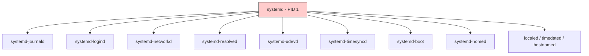
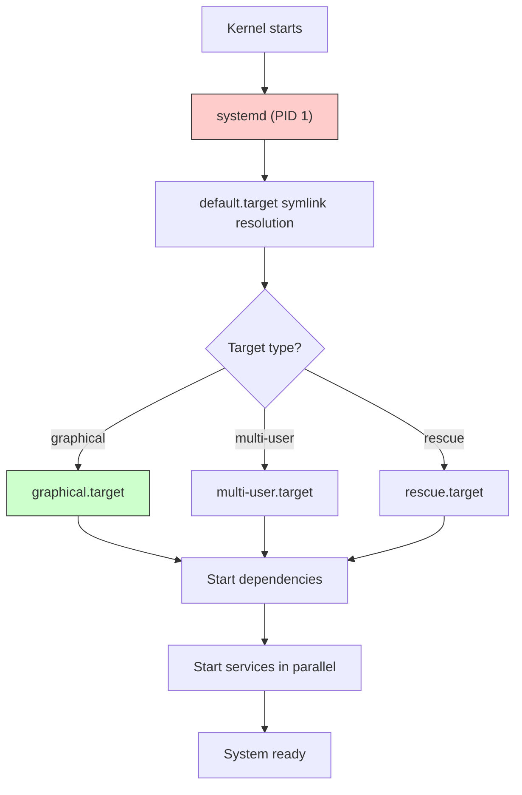
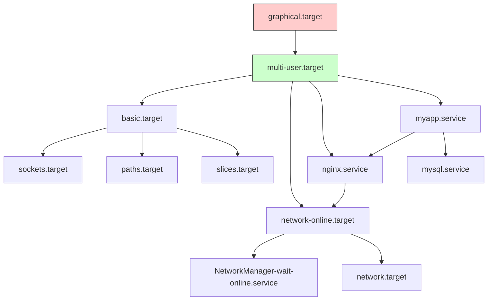
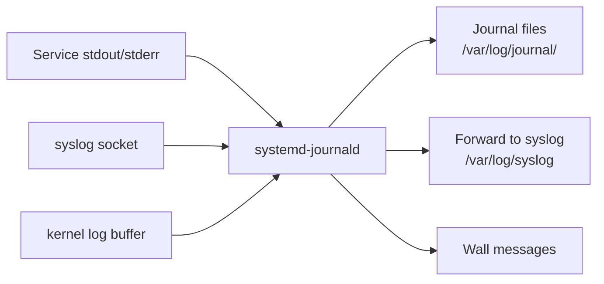
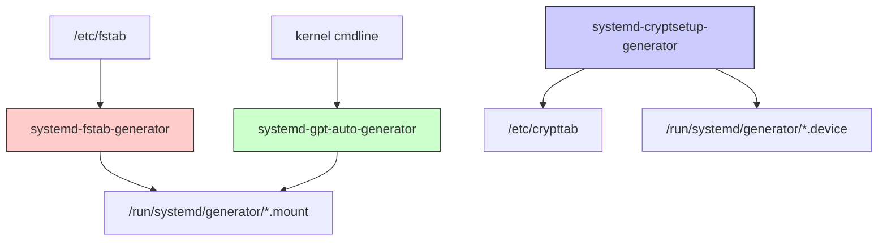
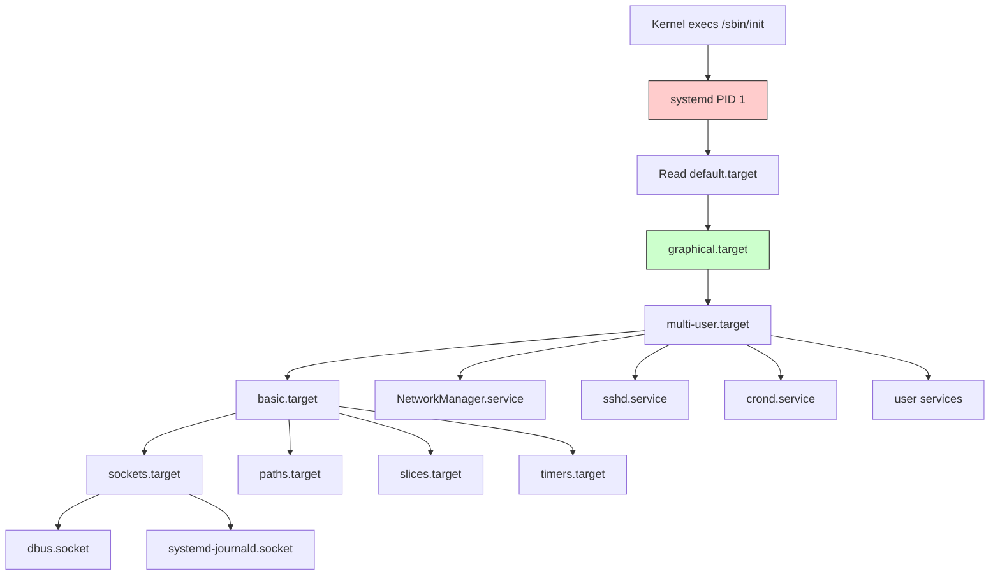
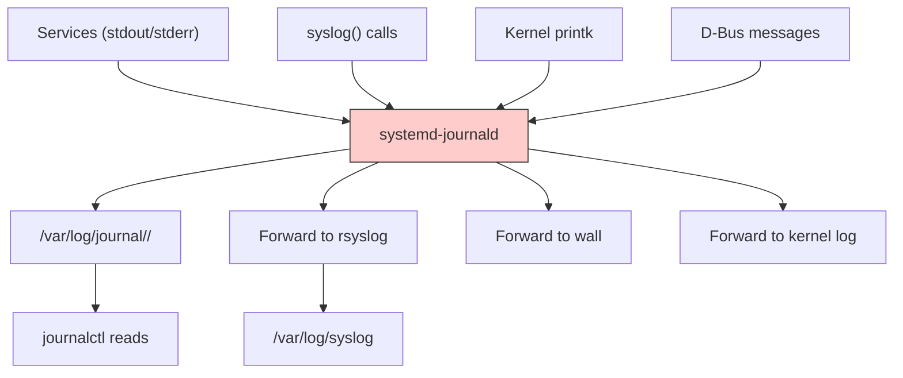

# Chapter 214: systemd — Unit Files, Targets, Dependencies, Journal, Timers, Generators

## 1. Intuition

systemd is the init system and service manager for most modern Linux distributions. It replaces the traditional SysVinit and Upstart init systems with a unified framework that manages not just the boot process, but also services, mounts, timers, networking, logging, and much more.

The key insight about systemd is that it is **declarative** rather than imperative. Instead of writing shell scripts that describe *how* to start a service, you write unit files that describe *what* the service should look like when running. systemd figures out the *how* — starting dependencies, managing processes, handling failures, and cleaning up.

Understanding systemd is essential because it is PID 1 — the first user-space process. Everything else in the system is ultimately a child of systemd (or a child of its children). It manages the entire lifecycle of every process, from boot to shutdown.

## 2. Architecture

### 2.1 systemd Components

systemd is not a single binary — it's a suite of components:



| Component | Purpose |
|-----------|---------|
| **systemd** (PID 1) | Init system, service manager, mount manager |
| **systemd-journald** | Structured logging daemon |
| **systemd-logind** | Login/session/seat management |
| **systemd-networkd** | Network configuration |
| **systemd-resolved** | DNS resolution |
| **systemd-udevd** | Device management (replaces udev) |
| **systemd-timesyncd** | NTP time synchronization |
| **systemd-boot** | UEFI bootloader |
| **systemd-homed** | Portable home directories |
| **localed** | Locale configuration D-Bus service |
| **timedated** | Time/date configuration D-Bus service |
| **hostnamed** | Hostname configuration D-Bus service |

### 2.2 Boot Flow



## 3. Unit Files

### 3.1 Unit Types

systemd uses "units" to manage system resources. Each unit type has a file extension:

| Extension | Type | Purpose |
|-----------|------|---------|
| `.service` | Service | Daemons, applications |
| `.socket` | Socket | Socket-activated services |
| `.mount` | Mount | Filesystem mounts |
| `.automount` | Automount | On-demand mounts |
| `.swap` | Swap | Swap spaces |
| `.target` | Target | Grouping unit (like runlevels) |
| `.timer` | Timer | Scheduled tasks (like cron) |
| `.path` | Path | Filesystem path monitoring |
| `.device` | Device | Device units (from udev) |
| `.scope` | Scope | Externally-created process groups |
| `.slice` | Slice | CGroup hierarchies |
| `.snapshot` | Snapshot | Saved state of the manager |

### 3.2 Unit File Locations

```bash
# System units (packaged)
/usr/lib/systemd/system/        # Distribution-provided units

# System units (local admin)
/etc/systemd/system/            # Admin overrides (highest priority)

# System units (runtime, auto-generated)
/run/systemd/system/            # Runtime units (lost on reboot)

# User units
~/.config/systemd/user/         # Per-user units
/usr/lib/systemd/user/          # System-wide user units

# Unit search order (highest to lowest priority):
# 1. /etc/systemd/system/
# 2. /run/systemd/system/
# 3. /usr/lib/systemd/system/
```

### 3.3 Service Unit File Structure

```ini
# /etc/systemd/system/myapp.service

[Unit]
# Metadata
Description=My Application Server
Documentation=https://myapp.example.com/docs

# Ordering and dependencies
After=network-online.target mysql.service
Wants=network-online.target
Requires=mysql.service
BindsTo=docker.service

# Conflicts (cannot run simultaneously)
Conflicts=shutdown.target

# Condition checks (skip if false)
ConditionPathExists=/etc/myapp/config.yaml
ConditionACPower=true
AssertPathExists=/usr/bin/myapp

[Service]
# Service type
Type=simple
# Type options:
#   simple  - ExecStart is the main process
#   forking - Forks and parent exits (traditional daemons)
#   oneshot - Runs once and exits
#   notify  - Sends readiness notification via sd_notify()
#   dbus    - Acquires a D-Bus name
#   idle    - Waits until all jobs complete

# Process management
ExecStart=/usr/bin/myapp --config /etc/myapp/config.yaml
ExecStartPre=/usr/bin/myapp-check-config
ExecStartPost=/usr/bin/myapp-post-setup
ExecReload=/bin/kill -HUP $MAINPID
ExecStop=/bin/kill -TERM $MAINPID
ExecStopPost=/usr/bin/myapp-cleanup

# Restart behavior
Restart=on-failure
# Restart options: no, on-success, on-failure, on-abnormal, on-watchdog, on-abort, always
RestartSec=5
StartLimitIntervalSec=300
StartLimitBurst=5

# Process environment
Environment=MYAPP_ENV=production
EnvironmentFile=/etc/myapp/env
WorkingDirectory=/var/lib/myapp

# User and permissions
User=myapp
Group=myapp
SupplementaryGroups=www-data

# Resource limits
LimitNOFILE=65536
LimitNPROC=4096
MemoryMax=2G
CPUQuota=200%

# Security
ProtectSystem=strict
ProtectHome=true
PrivateTmp=true
NoNewPrivileges=true
ReadWritePaths=/var/lib/myapp /var/log/myapp
CapabilityBoundingSet=CAP_NET_BIND_SERVICE
AmbientCapabilities=CAP_NET_BIND_SERVICE

# Logging
StandardOutput=journal
StandardError=journal
SyslogIdentifier=myapp

# Watchdog
WatchdogSec=30

[Install]
# What to enable this service for
WantedBy=multi-user.target
# Also: RequiredBy=, Alias=, Also=
```

### 3.4 Socket Unit File

Socket activation allows systemd to listen on behalf of a service and start it on demand:

```ini
# /etc/systemd/system/myapp.socket

[Unit]
Description=My Application Socket

[Socket]
ListenStream=8080
ListenStream=/run/myapp.sock

# Socket options
Backlog=128
ReusePort=true
SocketUser=myapp
SocketGroup=www-data
SocketMode=0660

# Pass to service
Service=myapp.service

[Install]
WantedBy=sockets.target
```

```ini
# /etc/systemd/system/myapp.service (for socket activation)
[Unit]
Description=My Application Server
Requires=myapp.socket

[Service]
Type=simple
ExecStart=/usr/bin/myapp --socket-activated
# Note: stdin/stdout are the socket fd
```

### 3.5 Path Unit File

Path units watch filesystem paths and trigger services:

```ini
# /etc/systemd/system/watch-config.path

[Unit]
Description=Watch configuration directory

[Path]
PathModified=/etc/myapp/
PathChanged=/etc/myapp/config.yaml
MakeDirectory=yes
Unit=myapp-reload.service

[Install]
WantedBy=multi-user.target
```

### 3.6 Drop-in Overrides

Instead of copying and modifying vendor unit files, use drop-in directories:

```bash
# Create override directory
mkdir -p /etc/systemd/system/nginx.service.d/

# Create override file
cat > /etc/systemd/system/nginx.service.d/override.conf << 'EOF'
[Service]
# Increase open files limit
LimitNOFILE=65536

# Add environment variables
Environment=NGINX_WORKER_CONNECTIONS=4096

# Modify restart behavior
Restart=always
RestartSec=10
EOF

# Reload systemd to pick up changes
systemctl daemon-reload

# Or use the interactive editor:
systemctl edit nginx.service
```

## 4. Targets

### 4.1 What Are Targets?

Targets are synchronization points — they group units that should be started together. They replace SysVinit runlevels:

| Target | Equivalent | Purpose |
|--------|------------|---------|
| `poweroff.target` | Runlevel 0 | Shutdown |
| `rescue.target` | Runlevel 1 | Single-user/rescue |
| `multi-user.target` | Runlevel 3 | Multi-user, no GUI |
| `graphical.target` | Runlevel 5 | Multi-user with GUI |
| `reboot.target` | Runlevel 6 | Reboot |
| `emergency.target` | — | Emergency shell |
| `default.target` | — | Symlink to actual default |

### 4.2 Target Unit File

```ini
# /usr/lib/systemd/system/multi-user.target

[Unit]
Description=Multi-User System
Documentation=man:systemd.special(7)
Requires=basic.target
Conflicts=rescue.service rescue.target
After=basic.target rescue.service rescue.target
AllowIsolate=yes
```

### 4.3 Working with Targets

```bash
# Get default target
systemctl get-default

# Set default target
systemctl set-default multi-user.target

# Switch to a target (without changing default)
systemctl isolate rescue.target

# List units for a target
systemctl list-dependencies graphical.target

# Show target properties
systemctl show graphical.target

# Emergency mode (minimal, root filesystem read-only)
systemctl emergency

# Rescue mode (single-user)
systemctl rescue
```

### 4.4 Custom Targets

```ini
# /etc/systemd/system/myapp.target

[Unit]
Description=My Application Stack
Requires=myapp.service nginx.service redis.service
After=network-online.target
Wants=myapp-monitoring.service
AllowIsolate=yes
```

## 5. Dependencies

### 5.1 Dependency Types

| Directive | Effect |
|-----------|--------|
| `Requires=` | Hard dependency — if dependency fails, this unit fails too |
| `Wants=` | Soft dependency — try to start, but don't fail if unavailable |
| `Requisite=` | Must already be active — fail if not |
| `BindsTo=` | Like Requires, but also stops if dependency stops |
| `PartOf=` | Stop/restart this unit when dependency stops/restarts |
| `Conflicts=` | Cannot run simultaneously — starting one stops the other |

### 5.2 Ordering Directives

| Directive | Effect |
|-----------|--------|
| `After=` | Start this unit *after* the specified unit |
| `Before=` | Start this unit *before* the specified unit |

**Important:** `After=`/`Before=` control *order*, not *dependency*. `Requires=`/`Wants=` control *dependency*, not order. You need both for dependent ordering.

```ini
# This ensures nginx starts after network is ready AND requires it
[Unit]
Requires=network-online.target
After=network-online.target
```

### 5.3 Dependency Graph

```bash
# View full dependency tree
systemctl list-dependencies myapp.service

# View reverse dependencies (what depends on this)
systemctl list-dependencies --reverse myapp.service

# View all dependencies recursively
systemctl list-dependencies --all myapp.service
```



## 6. The systemd Journal

### 6.1 Architecture

The journal is systemd's structured logging system. Unlike syslog, it stores log entries in a binary format with rich metadata:



### 6.2 journalctl Usage

```bash
# View all logs (newest first)
journalctl

# Follow new messages (like tail -f)
journalctl -f

# View logs for a specific service
journalctl -u nginx.service
journalctl -u nginx.service -u php-fpm.service

# View logs since boot
journalctl -b
journalctl -b -1    # Previous boot
journalctl -b -2    # Two boots ago

# View logs by time
journalctl --since "2024-01-01 00:00:00"
journalctl --since "1 hour ago"
journalctl --since "2024-01-01" --until "2024-01-02"

# Filter by priority
journalctl -p err              # Error and above
journalctl -p warning          # Warning and above
journalctl -p debug            # Debug and above
# Priorities: emerg, alert, crit, err, warning, notice, info, debug

# Filter by PID
journalctl _PID=1234

# Filter by user
journalctl _UID=1000

# Filter by executable
journalctl /usr/bin/nginx

# Filter by syslog facility
journalctl -k                  # Kernel messages (like dmesg)

# View in real-time with details
journalctl -o verbose -u nginx.service

# Output formats
journalctl -o json-pretty      # JSON format
journalctl -o short-precise    # With microsecond timestamps
journalctl -o cat              # Message only (no metadata)

# Disk usage
journalctl --disk-usage

# Verify journal integrity
journalctl --verify

# Show available boots
journalctl --list-boots

# Vacuum old logs
journalctl --vacuum-time=30d
journalctl --vacuum-size=500M
journalctl --vacuum-files=10
```

### 6.3 Journal Configuration

```ini
# /etc/systemd/journald.conf

[Journal]
# Storage: volatile (RAM only), persistent (disk), auto, none
Storage=auto

# Compress journal files
Compress=yes

# Seal journal with Forward Secure Sealing
Seal=yes

# Split journal by user
SplitMode=uid

# Rate limiting
RateLimitIntervalSec=30s
RateLimitBurst=10000

# Maximum journal size
SystemMaxUse=1G
SystemKeepFree=2G
SystemMaxFileSize=128M
SystemMaxFiles=100

# Runtime journal (in /run/log/journal/)
RuntimeMaxUse=200M
RuntimeKeepFree=100M

# Forward to syslog
ForwardToSyslog=yes

# Forward to wall (broadcast)
ForwardToWall=yes

# Max level to forward
MaxLevelStore=debug
MaxLevelSyslog=debug
MaxLevelWall=err

# Line max
LineMax=48K
```

### 6.4 Structured Logging from Applications

```bash
# Log with metadata using systemd-cat
echo "Hello from my script" | systemd-cat -t myscript -p info

# Shell script logging
systemd-cat -t backup -p info << 'EOF'
Starting backup process
Backing up /home
Backup complete
EOF

# Python example
import systemd.journal
journal.send("Application started", PRIORITY=6, MY_CUSTOM_FIELD="value")

# C example
#include <systemd/sd-journal.h>
sd_journal_print(LOG_INFO, "Connection from %s", ip_addr);
sd_journal_send("MESSAGE=New connection",
                "PRIORITY=%i", LOG_INFO,
                "CLIENT_IP=%s", ip_addr,
                NULL);
```

## 7. Timers

### 7.1 Timer Units

systemd timers replace cron jobs. They are more flexible and integrate with the rest of systemd:

```ini
# /etc/systemd/system/backup.timer

[Unit]
Description=Daily Backup Timer

[Timer]
# Run daily at 2:00 AM
OnCalendar=*-*-* 02:00:00

# Alternative: run 15 minutes after boot
# OnBootSec=15min

# Alternative: run 1 hour after the last run completed
# OnUnitActiveSec=1h

# Run 30 seconds after the timer activates
# OnActiveSec=30s

# Persistent timer (catch up if system was off)
Persistent=true

# Randomized delay (prevent thundering herd)
RandomizedDelaySec=30min

# Accuracy
AccuracySec=1min

# Reference the service to activate
Unit=backup.service

[Install]
WantedBy=timers.target
```

```ini
# /etc/systemd/system/backup.service

[Unit]
Description=Daily Backup

[Service]
Type=oneshot
ExecStart=/usr/local/bin/backup.sh
User=backup
Nice=19
IOSchedulingClass=idle
```

### 7.2 Timer Calendar Events

```bash
# Calendar event format: DOW YEAR-MONTH-DAY HOUR:MINUTE:SECOND

# Examples:
OnCalendar=Mon *-*-* 09:00:00     # Every Monday at 9 AM
OnCalendar=*-*-01 00:00:00        # First day of every month
OnCalendar=*-01,04,07,10-01       # Quarterly (Jan, Apr, Jul, Oct)
OnCalendar=Mon..Fri *-*-* 08:00   # Weekdays at 8 AM
OnCalendar=Sat,Sun *-*-* 10:00    # Weekends at 10 AM
OnCalendar=hourly                  # Every hour
OnCalendar=daily                   # Every day at midnight
OnCalendar=weekly                  # Every Monday at midnight
OnCalendar=monthly                 # First day of month at midnight
OnCalendar=yearly                  # January 1st at midnight

# Test calendar expressions
systemd-analyze calendar "Mon *-*-* 09:00:00"
systemd-analyze calendar --iterations=5 "daily"

# View active timers
systemctl list-timers
systemctl list-timers --all

# Enable and start timer
systemctl enable --now backup.timer

# Check timer status
systemctl status backup.timer
```

### 7.3 Timer vs. Cron Comparison

| Feature | cron | systemd timer |
|---------|------|---------------|
| Missed runs | Lost | Can catch up (`Persistent=true`) |
| Dependencies | None | Full systemd dependency graph |
| Resource limits | None | CGroups, memory, CPU limits |
| Logging | Syslog/manual | Automatic journal integration |
| Randomization | Manual | `RandomizedDelaySec` |
| Activation types | Time only | Time, boot, idle, unit activity |
| Security | User permissions | Full systemd sandboxing |
| Rate limiting | None | Built-in |

## 8. Generators

### 8.1 What Are Generators?

Generators are executables that translate non-native configuration formats into systemd unit files at boot time. They run early in the boot process and create transient units in `/run/systemd/generator/`.



### 8.2 Key Built-in Generators

| Generator | Input | Output |
|-----------|-------|--------|
| `systemd-fstab-generator` | `/etc/fstab` | `.mount` and `.automount` units |
| `systemd-cryptsetup-generator` | `/etc/crypttab` | `.device` units for encrypted volumes |
| `systemd-gpt-auto-generator` | GPT partition labels | Root/home/swap mount units |
| `systemd-getty-generator` | Serial consoles | Getty service units |
| `systemd-hibernate-resume-generator` | Kernel cmdline | Hibernate resume unit |
| `systemd-rc-local-generator` | `/etc/rc.local` | Service unit for rc.local |

### 8.3 Custom Generators

```bash
# Create a custom generator
# Generators are executables in /etc/systemd/system-generators/

cat > /etc/systemd/system-generators/my-generator << 'EOF'
#!/bin/bash
# Custom generator: create mount units for USB drives

GENERATOR_DIR="$1"
EARLY_DIR="$2"
LATE_DIR="$3"

# Check for USB drives
for dev in /dev/sd[b-z]1; do
    [ -b "$dev" ] || continue
    uuid=$(blkid -s UUID -o value "$dev")
    [ -z "$uuid" ] && continue
    
    # Create mount unit
    cat > "${LATE_DIR}/media-usb-${uuid}.mount" << MOUNT
[Unit]
Description=USB Drive $uuid

[Mount]
What=/dev/disk/by-uuid/$uuid
Where=/media/usb-$uuid
Type=auto
Options=defaults,noauto,x-systemd.automount

[Install]
WantedBy=multi-user.target
MOUNT
done

exit 0
EOF

chmod +x /etc/systemd/system-generators/my-generator
```

## 9. Key systemctl Commands

```bash
# Service management
systemctl start nginx.service
systemctl stop nginx.service
systemctl restart nginx.service
systemctl reload nginx.service       # Send SIGHUP
systemctl try-restart nginx.service  # Only restart if running
systemctl reload-or-restart nginx.service

# Enable/disable (start at boot)
systemctl enable nginx.service
systemctl disable nginx.service
systemctl enable --now nginx.service  # Enable and start
systemctl mask nginx.service          # Completely prevent starting
systemctl unmask nginx.service

# Status
systemctl status nginx.service
systemctl is-active nginx.service
systemctl is-enabled nginx.service
systemctl is-failed nginx.service

# List units
systemctl list-units
systemctl list-units --type=service
systemctl list-units --state=running
systemctl list-units --state=failed
systemctl list-unit-files

# Show properties
systemctl show nginx.service
systemctl show nginx.service --property=MainPID
systemctl show nginx.service --property=MemoryCurrent

# Edit unit files
systemctl edit nginx.service          # Create drop-in override
systemctl edit --full nginx.service   # Edit full unit file
systemctl revert nginx.service        # Revert to vendor version

# Daemon management
systemctl daemon-reload               # Reload unit files
systemctl daemon-reexec               # Reexecute systemd itself

# Power management
systemctl poweroff
systemctl reboot
systemctl suspend
systemctl hibernate
systemctl hybrid-sleep

# Analyze
systemd-analyze                       # Boot time summary
systemd-analyze blame                 # Per-unit boot time
systemd-analyze critical-chain        # Critical path
systemd-analyze plot > boot.svg       # Boot chart
systemd-analyze verify nginx.service  # Verify unit syntax
systemd-analyze security nginx.service # Security score
```

## 10. Common Pitfalls

### Pitfall 1: Editing Vendor Unit Files Directly

**Symptom:** Changes lost after package update.

**Cause:** `/usr/lib/systemd/system/` files are overwritten by package updates.

**Fix:** Use drop-in overrides:
```bash
systemctl edit nginx.service
# Creates /etc/systemd/system/nginx.service.d/override.conf
systemctl daemon-reload
```

### Pitfall 2: Missing daemon-reload After Editing

**Symptom:** Changes not taking effect.

**Cause:** systemd hasn't reloaded unit files.

**Fix:**
```bash
systemctl daemon-reload
systemctl restart myservice
```

### Pitfall 3: Wants= vs Requires= Confusion

**Symptom:** Service fails to start or doesn't start dependency.

**Cause:** `Wants=` only tries to start the dependency; `Requires=` will fail if the dependency fails. `After=` only controls ordering.

**Fix:**
```ini
# For hard dependency with correct ordering:
[Unit]
Requires=postgresql.service
After=postgresql.service

# For soft dependency:
[Unit]
Wants=redis.service
After=redis.service
```

### Pitfall 4: Service Doesn't Start After Boot

**Symptom:** Service works manually but not at boot.

**Cause:** Missing `WantedBy=` in `[Install]` section, or dependency not available at boot time.

**Fix:**
```ini
[Install]
WantedBy=multi-user.target

# Add ordering:
[Unit]
After=network-online.target
Wants=network-online.target
```

### Pitfall 5: Journal Filling Disk

**Symptom:** `/var/log/journal/` grows very large.

**Cause:** No journal size limits configured.

**Fix:**
```ini
# /etc/systemd/journald.conf
[Journal]
SystemMaxUse=1G
SystemMaxFileSize=128M

# Or vacuum immediately:
journalctl --vacuum-size=500M
journalctl --vacuum-time=30d
```

### Pitfall 6: OnCalendar Timer Not Firing

**Symptom:** Timer exists but service never runs.

**Cause:** Timer not enabled, or `WantedBy=timers.target` missing.

**Fix:**
```bash
systemctl enable --now mytimer.timer
systemctl list-timers    # Verify it appears
```

## 11. Best Practices

1. **Use drop-in overrides** instead of editing vendor unit files.

2. **Always run `daemon-reload`** after editing unit files.

3. **Use `Wants=` over `Requires=`** unless a hard dependency is truly needed. `Requires=` causes cascading failures.

4. **Set `Restart=on-failure`** for long-running services with `RestartSec=5` to avoid restart loops.

5. **Use security hardening directives:**
   ```ini
   ProtectSystem=strict
   ProtectHome=true
   PrivateTmp=true
   NoNewPrivileges=true
   ```
   Check score: `systemd-analyze security myservice`

6. **Use socket activation** for services that are rarely accessed — saves memory.

7. **Use timers over cron** for new scheduled tasks — better logging, dependency management, and resource control.

8. **Configure journal limits** to prevent disk exhaustion:
   ```ini
   SystemMaxUse=2G
   ```

9. **Use `systemd-analyze blame`** to identify slow services during boot optimization.

10. **Document custom units** with `Description=` and `Documentation=` directives.

## 12. Diagrams

### 12.1 systemd Boot Sequence



### 12.2 Unit File Processing Pipeline


### 12.3 Journal Data Flow



## 13. Exercises

### Exercise 1: Create a Service Unit

```bash
# 1. Create a simple service
cat > /tmp/test-service.sh << 'EOF'
#!/bin/bash
echo "Service started at $(date)"
while true; do
    echo "Heartbeat at $(date)"
    sleep 60
done
EOF
chmod +x /tmp/test-service.sh

# 2. Create the unit file
sudo tee /etc/systemd/system/test-heartbeat.service << 'EOF'
[Unit]
Description=Test Heartbeat Service
After=network.target

[Service]
Type=simple
ExecStart=/tmp/test-service.sh
Restart=on-failure
RestartSec=10

[Install]
WantedBy=multi-user.target
EOF

# 3. Enable and start
sudo systemctl daemon-reload
sudo systemctl enable --now test-heartbeat.service

# 4. Check status
systemctl status test-heartbeat.service

# 5. View logs
journalctl -u test-heartbeat.service -f

# 6. Clean up
sudo systemctl disable --now test-heartbeat.service
sudo rm /etc/systemd/system/test-heartbeat.service /tmp/test-service.sh
sudo systemctl daemon-reload
```

### Exercise 2: Create a Timer

```bash
# 1. Create the service
sudo tee /etc/systemd/system/hello-timer.service << 'EOF'
[Unit]
Description=Hello Timer Service

[Service]
Type=oneshot
ExecStart=/bin/echo "Timer fired at $(date)"
StandardOutput=journal
EOF

# 2. Create the timer
sudo tee /etc/systemd/system/hello-timer.timer << 'EOF'
[Unit]
Description=Run Hello every 5 minutes

[Timer]
OnBootSec=1min
OnUnitActiveSec=5min
Persistent=true
RandomizedDelaySec=30s

[Install]
WantedBy=timers.target
EOF

# 3. Enable the timer (not the service)
sudo systemctl daemon-reload
sudo systemctl enable --now hello-timer.timer

# 4. Check timers
systemctl list-timers

# 5. View logs
journalctl -u hello-timer.service

# 6. Clean up
sudo systemctl disable --now hello-timer.timer
sudo rm /etc/systemd/system/hello-timer.{service,timer}
sudo systemctl daemon-reload
```

### Exercise 3: Analyze Boot Performance

```bash
# 1. Boot time summary
systemd-analyze

# 2. Per-service boot time
systemd-analyze blame | head -20

# 3. Critical chain
systemd-analyze critical-chain

# 4. Generate boot chart
systemd-analyze plot > /tmp/boot-chart.svg

# 5. Security audit of services
systemd-analyze security nginx.service 2>/dev/null
systemd-analyze security ssh.service

# 6. Verify unit files
systemd-analyze verify /etc/systemd/system/*.service
```

### Exercise 4: Journal Investigation

```bash
# 1. Show journal disk usage
journalctl --disk-usage

# 2. List available boots
journalctl --list-boots

# 3. View errors from current boot
journalctl -b -p err

# 4. View kernel messages
journalctl -k

# 5. Filter by time
journalctl --since "1 hour ago" --until "30 min ago"

# 6. View in JSON format
journalctl -u nginx.service -o json-pretty | head -50

# 7. Verify journal integrity
journalctl --verify

# 8. Vacuum to reclaim space
journalctl --vacuum-size=500M
```

## 14. References

1. **systemd Documentation** — https://systemd.io/ — Official systemd project page.

2. **systemd.unit(5) Man Page** — https://www.freedesktop.org/software/systemd/man/systemd.unit.html — Unit file syntax.

3. **systemd.service(5) Man Page** — https://www.freedesktop.org/software/systemd/man/systemd.service.html — Service unit options.

4. **systemd.timer(5) Man Page** — https://www.freedesktop.org/software/systemd/man/systemd.timer.html — Timer unit options.

5. **journalctl(1) Man Page** — https://www.freedesktop.org/software/systemd/man/journalctl.html — Journal query tool.

6. **systemd.journal-fields(7)** — https://www.freedesktop.org/software/systemd/man/systemd.journal-fields.html — Journal metadata fields.

7. **systemd.generator(7)** — https://www.freedesktop.org/software/systemd/man/systemd.generator.html — Generator specification.

8. **Arch Wiki: systemd** — https://wiki.archlinux.org/title/Systemd — Comprehensive community documentation.

9. **systemd for Administrators Blog Series** — https://0pointer.de/blog/ — Lennart Poettering's blog posts on systemd.

10. **systemd Security** — `systemd-analyze security` — Built-in security auditing tool.

11. **Fedora systemd Packaging Guidelines** — https://docs.fedoraproject.org/en-US/packaging-guidelines/Systemd/ — Best practices for packaging systemd units.
