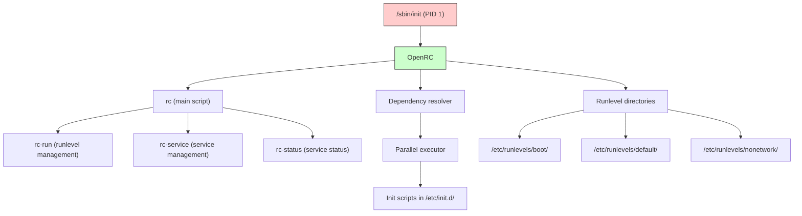
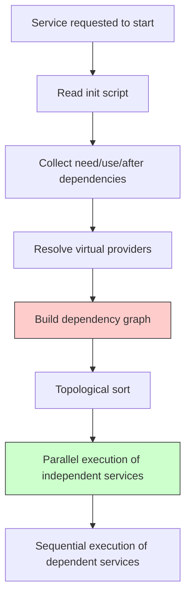
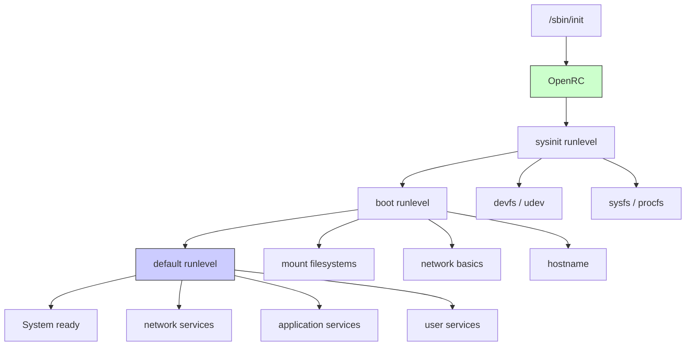
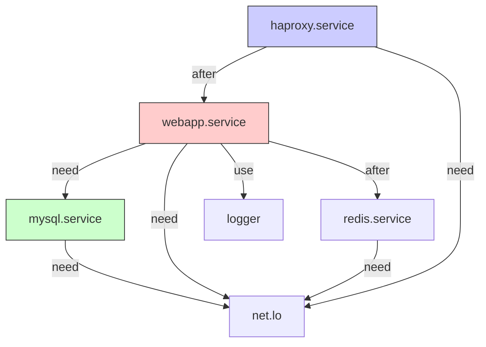
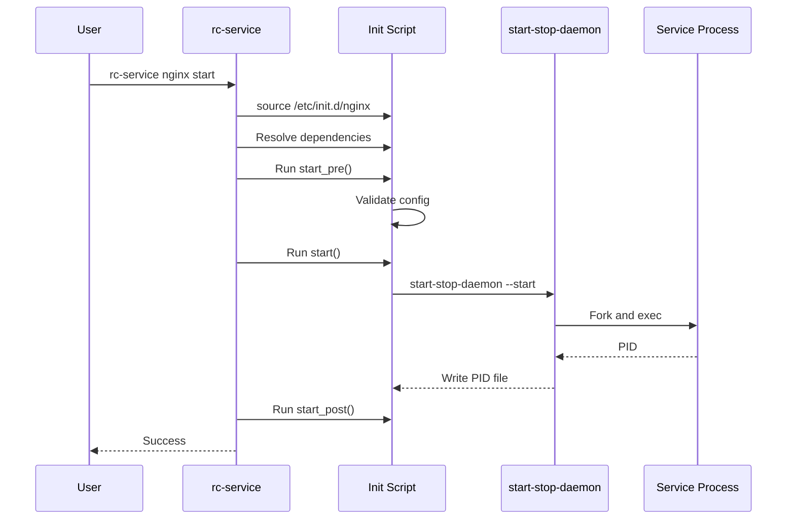

# Chapter 215: OpenRC — Gentoo/Alpine Init System

## 1. Intuition

OpenRC is a dependency-based init system that maintains compatibility with the traditional Unix init model while adding modern features like dependency management, parallel service startup, and per-service resource limits. It is the default init system on Gentoo Linux, Alpine Linux, and several BSD distributions.

Where systemd takes a "everything in one framework" approach, OpenRC follows the Unix philosophy of small, composable tools. It manages init scripts and service dependencies, but does not replace syslog, cron, or device management. This makes it lightweight, portable, and easy to understand — but it also means you need separate tools for logging, scheduling, and device management.

Understanding OpenRC is valuable even if you primarily use systemd, because it represents a fundamentally different philosophy of init system design. Many concepts (runlevels, init scripts, dependency ordering) are shared with SysVinit, and understanding OpenRC helps you understand the historical evolution of Linux init systems.

## 2. Architecture

### 2.1 Design Philosophy

OpenRC's core design principles:

- **Init system, not system manager:** OpenRC manages services, not the entire system.
- **Portable:** Works on Linux, FreeBSD, NetBSD, and other Unix-like systems.
- **Shell-based:** Init scripts are readable shell scripts, not compiled binaries.
- **Dependency-based:** Services declare dependencies; OpenRC resolves the order.
- **Parallel startup:** Independent services can start simultaneously.
- **CGroups integration:** Optional CGroups support for resource management.

### 2.2 Component Overview



### 2.3 Runlevels

Runlevels define system states. OpenRC extends the traditional SysVinit runlevels:

| Runlevel | Purpose |
|----------|---------|
| `sysinit` | Early system initialization (devfs, udev) |
| `boot` | Basic system services (filesystems, networking basics) |
| `bootlocal` | Local boot customizations |
| `default` | Normal multi-user operation |
| `nonetwork` | Multi-user without networking |
| `single` | Single-user maintenance mode |
| `shutdown` | System shutdown |
| `reboot` | System reboot |

```bash
# View current runlevel
rc-status

# List available runlevels
ls /etc/runlevels/

# List services in a runlevel
rc-status default

# Change runlevel
openrc nonetwork

# Add a service to a runlevel
rc-update add nginx default

# Remove a service from a runlevel
rc-update del nginx default

# List services and their runlevels
rc-update show
```

## 3. Init Scripts

### 3.1 Basic Init Script Structure

```bash
#!/sbin/openrc-run
# /etc/init.d/nginx
# Copyright 2024 Gentoo Authors
# Distributed under the terms of the GNU General Public License v2

description="Nginx web server"

# Dependencies
need() {
    # Hard dependency: must start after these services
    after net.lo
}

want() {
    # Soft dependency: prefer to start after these
    want logger
}

# Command to start the service
command="/usr/sbin/nginx"
command_args="-c /etc/nginx/nginx.conf"
command_user="nginx:nginx"
command_background=true
pidfile="/run/nginx.pid"

# Environment variables
export NGINX_CONF="/etc/nginx/nginx.conf"

# Start function (default provided by openrc-run)
# start() {
#     ebegin "Starting nginx"
#     start-stop-daemon --start --exec $command \
#         --pidfile $pidfile --background \
#         --make-pidfile -- $command_args
#     eend $?
# }

# Stop function
stop() {
    ebegin "Stopping nginx"
    start-stop-daemon --stop --exec $command \
        --pidfile $pidfile --retry TERM/30/KILL/5
    eend $?
}

# Reload function
reload() {
    ebegin "Reloading nginx"
    start-stop-daemon --signal HUP --exec $command \
        --pidfile $pidfile
    eend $?
}

# Custom configuration check
configtest() {
    ebegin "Checking nginx configuration"
    $command -t -c $NGINX_CONF
    eend $?
}

# Define available extra commands
extra_commands="configtest"
extra_started_commands="reload"

# Dependencies using rc_need variable
rc_need="net.lo"
rc_use="logger"
rc_after="net.lo"
rc_before=""
rc_provide="webserver"
```

### 3.2 Detailed Init Script Components

```bash
#!/sbin/openrc-run

# ---- Metadata ----
description="My Application Server"
description_configtest="Test configuration"
description_reload="Reload configuration"

# ---- Dependency Declarations ----
# These variables control service ordering and dependencies

# Hard dependencies: these services must be started first
rc_need="net.lo"

# Soft dependencies: start after if available
rc_use="logger dns"

# Ordering: start after these services
rc_after="net.lo mysql"

# Ordering: start before these services
rc_before="apache2"

# What this service provides (for dependency resolution)
rc_provide="webserver"

# Services that cannot run simultaneously
rc_keyword="shutdown"

# ---- Service Configuration ----
command="/usr/bin/myapp"
command_args="--config /etc/myapp/config.yaml"
command_user="myapp:myapp"
command_group="myapp"

# Background daemon
command_background=true
pidfile="/run/myapp.pid"

# Or foreground (openrc-run manages the process)
# command_background=false

# Resource limits
rc_ulimit="-n 65536 -u 4096"
rc_cgroup_max="memory 2G"
rc_cgroup_cpu="50%"

# Restart behavior
rc_crashed_restart=true
rc_crashed_resume=true

# ---- Environment ----
env_file="/etc/myapp/env"
export MYAPP_HOME="/var/lib/myapp"

# ---- Functions ----
# Default start/stop provided by openrc-run
# Override for custom behavior

depend() {
    need net.lo
    use logger
    after mysql
    provide webserver
}

start_pre() {
    # Run before start
    checkpath --directory --owner myapp:myapp /run/myapp
    configtest || return 1
}

start_post() {
    # Run after start
    einfo "MyApp started on port 8080"
}

stop_pre() {
    # Run before stop
    einfo "Gracefully shutting down MyApp"
}

stop_post() {
    # Run after stop
    rm -f /run/myapp.pid
}

reload() {
    ebegin "Reloading MyApp configuration"
    start-stop-daemon --signal HUP --pidfile $pidfile
    eend $?
}

configtest() {
    ebegin "Testing MyApp configuration"
    $command --test-config $command_args
    eend $?
}

# ---- Extra Commands ----
extra_commands="configtest"
extra_started_commands="reload"
```

### 3.3 start-stop-daemon

`start-stop-daemon` is the primary utility for managing daemon processes in OpenRC scripts:

```bash
# Start a daemon
start-stop-daemon --start \
    --exec /usr/bin/myapp \
    --pidfile /run/myapp.pid \
    --background \
    --make-pidfile \
    --user myapp \
    --group myapp \
    --chuid myapp:myapp \
    --chdir /var/lib/myapp \
    --umask 022 \
    -- /usr/bin/myapp --config /etc/myapp.yaml

# Stop a daemon
start-stop-daemon --stop \
    --exec /usr/bin/myapp \
    --pidfile /run/myapp.pid \
    --retry TERM/30/KILL/5

# Send signal
start-stop-daemon --signal HUP \
    --pidfile /run/myapp.pid

# Check if running
start-stop-daemon --status \
    --pidfile /run/myapp.pid

# Key options:
# --start          Start the daemon
# --stop           Stop the daemon
# --signal SIG     Send a signal
# --status         Check if running
# --exec PATH      Path to executable
# --pidfile FILE   PID file path
# --background     Fork to background
# --make-pidfile   Create PID file
# --user USER      Run as user
# --group GROUP    Run as group
# --chuid USER:GRP Change user/group
# --chdir DIR      Change directory
# --umask MASK     Set umask
# --retry SIG/SEC  Retry with signal after timeout
# --stdout FILE    Redirect stdout
# --stderr FILE    Redirect stderr
```

## 4. Dependency Resolution

### 4.1 Dependency Types

OpenRC uses several dependency keywords:

| Keyword | Meaning |
|---------|---------|
| `need` | Hard dependency — must be started first |
| `use` | Soft dependency — start after if available |
| `after` | Ordering only — start after, but don't require |
| `before` | Ordering only — start before |
| `provide` | Virtual service name this script provides |
| `keyword` | Special keywords (e.g., `-stop` for shutdown-only) |

### 4.2 Dependency Resolution Algorithm



### 4.3 Dependency Example

```bash
# /etc/init.d/webapp
depend() {
    # Must have network
    need net.lo
    
    # Must start after database
    need mysql
    
    # Prefer to start after logging is available
    use logger
    
    # Start after cache service if it exists
    after redis
    
    # Start before the load balancer
    before haproxy
    
    # This service provides "webapp" for other services to depend on
    provide webapp
}

# /etc/init.d/haproxy
depend() {
    need net.lo
    after webapp  # Start after webapp (resolved from "provide webapp")
}
```

### 4.4 Virtual Dependencies

Virtual dependencies allow services to depend on functionality rather than specific implementations:

```bash
# /etc/init.d/syslog-ng
depend() {
    provide logger
    need net.lo
}

# /etc/init.d/rsyslog
depend() {
    provide logger
    need net.lo
}

# /etc/init.d/myapp
depend() {
    use logger  # Works with either syslog-ng or rsyslog
}
```

## 5. Configuration

### 5.1 OpenRC Configuration Files

```bash
# /etc/rc.conf — Main OpenRC configuration

# Use Unicode output
rc_unicode="YES"

# Parallel startup
rc_parallel="YES"
# Options: YES, NO, "Unicorn" (aggressive parallelism)

# Dependency tracing
rc_depend_strict="YES"

# Crash recovery
rc_crashed_stop="YES"
rc_crashed_start="YES"

# Verbose logging
rc_logger="YES"
rc_log_path="/var/log/rc.log"

# CGroups
rc_controller_cgroups="YES"
rc_cgroup_mode="automatic"

# Network scripts
rc_net_lo="YES"

# Override service settings
# rc_svcname_variable="value"
rc_nicelevel="-10"
```

### 5.2 /etc/conf.d/ — Service Configuration

Each service can have a configuration file in `/etc/conf.d/`:

```bash
# /etc/conf.d/nginx

# Configuration file
NGINX_CONF="/etc/nginx/nginx.conf"

# User to run as
NGINX_USER="nginx"
NGINX_GROUP="nginx"

# Extra command line arguments
NGINX_OPTS="-c ${NGINX_CONF}"

# PID file location
NGINX_PID="/run/nginx.pid"

# Graceful stop timeout (seconds)
NGINX_STOP_TIMEOUT="30"

# Nice level
NICELEVEL="-5"
```

```bash
# /etc/conf.d/myapp

# Application configuration
MYAPP_CONFIG="/etc/myapp/config.yaml"
MYAPP_LOG="/var/log/myapp/myapp.log"
MYAPP_USER="myapp"
MYAPP_GROUP="myapp"

# Resource limits
MYAPP_MAX_OPEN_FILES=65536
MYAPP_MAX_PROCESSES=4096

# JVM options (if Java application)
JAVA_OPTS="-Xmx2g -Xms512m"

# Environment
RACK_ENV="production"
RAILS_ENV="production"
```

### 5.3 /etc/init.d/local — Local Custom Scripts

```bash
# /etc/init.d/local — Run local commands at boot/shutdown
# This is similar to /etc/rc.local

#!/sbin/openrc-run

description="Local startup commands"

start() {
    ebegin "Running local startup commands"
    
    # Custom commands here
    echo 1 > /proc/sys/net/ipv4/ip_forward
    iptables -t nat -A POSTROUTING -o eth0 -j MASQUERADE
    
    # Set CPU governor
    for cpu in /sys/devices/system/cpu/cpu*/cpufreq/scaling_governor; do
        echo "performance" > $cpu 2>/dev/null
    done
    
    eend $?
}

stop() {
    ebegin "Running local shutdown commands"
    # Cleanup commands here
    eend $?
}
```

```bash
# Enable local script
rc-update add local default
```

## 6. Commands Reference

### 6.1 rc-service — Service Management

```bash
# Start a service
rc-service nginx start

# Stop a service
rc-service nginx stop

# Restart a service
rc-service nginx restart

# Reload configuration (SIGHUP)
rc-service nginx reload

# Check status
rc-service nginx status

# Test configuration
rc-service nginx configtest

# Custom commands (defined in init script)
rc-service nginx rotate
```

### 6.2 rc-update — Runlevel Management

```bash
# Add service to runlevel
rc-update add nginx default
rc-update add sshd boot

# Remove service from runlevel
rc-update del nginx default

# Show all services and their runlevels
rc-update show
rc-update show -v

# Show services for a specific runlevel
rc-update show default

# Change runlevel
rc-update change default

# Rename a runlevel
rc-update rename oldname newname
```

### 6.3 rc-status — Service Status

```bash
# Show all services and status
rc-status

# Show services in a specific runlevel
rc-status default

# Show crashed services
rc-status --crashed

# Show manually started services
rc-status --manual

# Show all runlevels
rc-status --all

# Machine-readable output
rc-status --nocolor
```

### 6.4 openrc — Runlevel Management

```bash
# Switch to a runlevel
openrc nonetwork

# Start a runlevel (without stopping services not in it)
openrc -n default

# Show current runlevel
rc-status -l

# Re-run current runlevel
openrc
```

### 6.5 rc — Legacy Interface

```bash
# Start service
/etc/init.d/nginx start

# Stop service
/etc/init.d/nginx stop

# Restart service
/etc/init.d/nginx restart

# Status
/etc/init.d/nginx status

# These are equivalent to rc-service commands
```

## 7. CGroups Integration

OpenRC can manage services with CGroups for resource control:

```bash
# /etc/init.d/myapp (with CGroups)

#!/sbin/openrc-run

command="/usr/bin/myapp"
command_background=true
pidfile="/run/myapp.pid"

# CGroups configuration
rc_cgroup_controller="cpu memory"
rc_cgroup_cpu="50%"                    # Limit to 50% of one CPU
rc_cgroup_cpu_max="200000 1000000"     # CFS bandwidth: 200ms per 1s period
rc_cgroup_memory="2G"                  # Memory limit
rc_cgroup_memory_max="2G"              # Hard memory limit
rc_cgroup_memory_swap="1G"             # Swap limit
rc_cgroup_io_weight="500"              # I/O weight (10-1000)
rc_cgroup_pids_max="512"               # Maximum number of processes
```

```bash
# /etc/rc.conf — Enable CGroups
rc_controller_cgroups="YES"
rc_cgroup_mode="automatic"
rc_cgroup_cleanup="YES"
```

## 8. Source Code References

### 8.1 OpenRC Source Structure

```
openrc/
├── src/
│   ├── rc/                  # Main rc command
│   │   ├── rc.c             # Entry point
│   │   ├── rc-run.c         # Runlevel execution
│   │   └── rc-service.c     # Service management
│   ├── librc/               # Core library
│   │   ├── librc.c          # Library initialization
│   │   ├── rc.h             # Header file
│   │   └── misc.c           # Utility functions
│   ├── shared/              # Shared utilities
│   │   ├── misc.c           # Common functions
│   │   └── plugin.c         # Plugin system
│   └── openrc-run/          # openrc-run (script interpreter)
│       └── openrc-run.c     # Init script runner
├── etc/
│   ├── conf.d/              # Service configuration templates
│   └── init.d/              # Init script templates
├── sh/                      # Shell functions
│   ├── openrc-run.sh.in     # Shell functions for init scripts
│   └── init.sh.in           # Early init shell functions
└── runlevels/               # Default runlevel definitions
    ├── boot/
    ├── default/
    ├── nonetwork/
    ├── shutdown/
    └── sysinit/
```

### 8.2 Key Source Files

```bash
# The openrc-run script interpreter processes init scripts
# src/openrc-run/openrc-run.c handles:
# - Parsing init script metadata
# - Resolving dependencies
# - Managing start-stop-daemon
# - CGroups management

# Shell functions available to init scripts
# sh/openrc-run.sh.in provides:
# - ebegin() / eend() — progress messages
# - ewarn() / eerror() — warning/error messages
# - yesno() — boolean parsing
# - service_started() — check if service is running
# - mountinfo() — filesystem information
```

## 9. Common Pitfalls

### Pitfall 1: Missing Dependencies

**Symptom:** Service fails to start because network or database isn't ready.

**Cause:** Init script doesn't declare proper dependencies.

**Fix:**
```bash
depend() {
    need net.lo    # For network-dependent services
    need mysql     # For database-dependent services
    after redis    # For optional dependencies
}
```

### Pitfall 2: Stale PID File

**Symptom:** Service can't start — "already running" — but it's not.

**Cause:** PID file exists from a crashed process.

**Fix:**
```bash
# In init script, clean up stale PID files
start_pre() {
    if [ -f "$pidfile" ]; then
        local pid
        pid=$(cat "$pidfile")
        if ! kill -0 "$pid" 2>/dev/null; then
            einfo "Removing stale PID file"
            rm -f "$pidfile"
        fi
    fi
}
```

### Pitfall 3: Service Not in Correct Runlevel

**Symptom:** Service works manually but doesn't start at boot.

**Cause:** Service not added to the default runlevel.

**Fix:**
```bash
rc-update add myservice default
rc-update show | grep myservice
```

### Pitfall 4: Configuration File Syntax Error

**Symptom:** Service fails silently or with cryptic errors.

**Cause:** Syntax error in `/etc/conf.d/myservice`.

**Fix:**
```bash
# Test the configuration file
source /etc/conf.d/myservice
echo "Config loaded OK"

# In init script, validate before starting
start_pre() {
    if ! source /etc/conf.d/${SVCNAME}; then
        eerror "Configuration error in /etc/conf.d/${SVCNAME}"
        return 1
    fi
}
```

### Pitfall 5: Parallel Startup Race Conditions

**Symptom:** Intermittent failures during boot with `rc_parallel="YES"`.

**Cause:** Undeclared dependencies cause services to race.

**Fix:** Declare all dependencies explicitly. Use `rc_depend_strict="YES"`.

### Pitfall 6: Wrong Shell in Init Script

**Symptom:** Script fails with syntax errors.

**Cause:** Using `#!/bin/bash` instead of `#!/sbin/openrc-run`.

**Fix:** Always use `#!/sbin/openrc-run` as the shebang. This provides the OpenRC framework functions.

## 10. Best Practices

1. **Always use `#!/sbin/openrc-run`** as the shebang in init scripts.

2. **Declare all dependencies explicitly.** Use `need` for hard dependencies, `use` for soft dependencies, and `after`/`before` for ordering.

3. **Use `command_background=true`** for daemons that don't fork themselves. Let OpenRC manage the process.

4. **Use `start-stop-daemon`** instead of raw `start-stop-daemon` calls. It handles PID files, user switching, and clean shutdown.

5. **Validate configuration** in `start_pre()` before starting the service.

6. **Use `/etc/conf.d/`** for service configuration — never hard-code paths in init scripts.

7. **Test init scripts** before adding to runlevels:
   ```bash
   /etc/init.d/myservice start
   /etc/init.d/myservice status
   /etc/init.d/myservice stop
   ```

8. **Use `extra_commands` and `extra_started_commands`** for custom operations:
   ```bash
   extra_commands="configtest"
   extra_started_commands="reload rotate"
   ```

9. **Clean up resources** in `stop_post()` — remove PID files, temporary files, sockets.

10. **Use `provide` for virtual services** — this allows other services to depend on functionality rather than specific implementations.

## 11. Diagrams

### 11.1 OpenRC Boot Flow



### 11.2 Service Dependency Resolution



### 11.3 Init Script Processing



## 12. Exercises

### Exercise 1: Create a Basic Init Script

```bash
# 1. Create a simple daemon script
sudo tee /usr/local/bin/simple-daemon << 'EOF'
#!/bin/bash
trap "exit 0" TERM INT
while true; do
    echo "$(date): Simple daemon heartbeat" >> /var/log/simple-daemon.log
    sleep 60
done
EOF
sudo chmod +x /usr/local/bin/simple-daemon

# 2. Create the init script
sudo tee /etc/init.d/simple-daemon << 'SCRIPT'
#!/sbin/openrc-run

description="Simple test daemon"
command="/usr/local/bin/simple-daemon"
command_background=true
pidfile="/run/simple-daemon.pid"
command_user="root"

depend() {
    need net.lo
    after logger
}

start_pre() {
    checkpath --directory /run/simple-daemon
}

stop_post() {
    rm -f /pidfile
}
SCRIPT
sudo chmod +x /etc/init.d/simple-daemon

# 3. Test the script
sudo /etc/init.d/simple-daemon start
sudo /etc/init.d/simple-daemon status
sudo /etc/init.d/simple-daemon stop

# 4. Add to default runlevel
sudo rc-update add simple-daemon default
rc-update show | grep simple-daemon

# 5. Clean up
sudo rc-update del simple-daemon default
sudo /etc/init.d/simple-daemon stop 2>/dev/null
sudo rm /etc/init.d/simple-daemon /usr/local/bin/simple-daemon
sudo rm -rf /run/simple-daemon /var/log/simple-daemon.log
```

### Exercise 2: Create a Service with Dependencies

```bash
# 1. Create a database service (simulated)
sudo tee /usr/local/bin/fake-db << 'EOF'
#!/bin/bash
trap "exit 0" TERM INT
echo "Fake database started" > /run/fake-db/ready
while true; do sleep 60; done
EOF
sudo chmod +x /usr/local/bin/fake-db

sudo tee /etc/init.d/fake-db << 'SCRIPT'
#!/sbin/openrc-run
description="Fake database service"
command="/usr/local/bin/fake-db"
command_background=true
pidfile="/run/fake-db.pid"

start_pre() {
    checkpath --directory /run/fake-db
}

stop_post() {
    rm -rf /run/fake-db
}
SCRIPT
sudo chmod +x /etc/init.d/fake-db

# 2. Create an app that depends on the database
sudo tee /etc/init.d/myapp << 'SCRIPT'
#!/sbin/openrc-run
description="My application"
command="/bin/sleep"
command_args="infinity"
command_background=true
pidfile="/run/myapp.pid"

depend() {
    need fake-db
    after net.lo
}
SCRIPT
sudo chmod +x /etc/init.d/myapp

# 3. Add to runlevels
sudo rc-update add fake-db default
sudo rc-update add myapp default

# 4. Start and verify order
sudo /etc/init.d/fake-db start
sudo /etc/init.d/myapp start
rc-status

# 5. Check dependencies
rc-service --list

# 6. Clean up
sudo /etc/init.d/myapp stop
sudo /etc/init.d/fake-db stop
sudo rc-update del myapp default
sudo rc-update del fake-db default
sudo rm /etc/init.d/{fake-db,myapp} /usr/local/bin/fake-db
```

### Exercise 3: Explore Runlevels

```bash
# 1. List all runlevels
ls /etc/runlevels/

# 2. Show services in each runlevel
for rl in /etc/runlevels/*/; do
    echo "=== $(basename $rl) ==="
    ls $rl 2>/dev/null
done

# 3. Show current status
rc-status

# 4. Create a custom runlevel
sudo mkdir /etc/runlevels/maintenance
sudo rc-update add sshd maintenance
sudo rc-update add local maintenance

# 5. Switch to maintenance runlevel
sudo openrc maintenance

# 6. Return to default
sudo openrc default
```

### Exercise 4: OpenRC vs systemd Comparison

```bash
# Compare the same service in both systems:

# systemd unit file (for reference)
cat > /tmp/nginx-systemd.service << 'EOF'
[Unit]
Description=Nginx Web Server
After=network-online.target
Wants=network-online.target

[Service]
Type=forking
PIDFile=/run/nginx.pid
ExecStartPre=/usr/sbin/nginx -t
ExecStart=/usr/sbin/nginx
ExecReload=/bin/kill -s HUP $MAINPID
ExecStop=/bin/kill -s QUIT $MAINPID
Restart=on-failure
RestartSec=5

[Install]
WantedBy=multi-user.target
EOF

# OpenRC init script (equivalent)
cat > /tmp/nginx-openrc << 'SCRIPT'
#!/sbin/openrc-run
description="Nginx web server"
command="/usr/sbin/nginx"
pidfile="/run/nginx.pid"

depend() {
    need net.lo
    after logger
}

start_pre() {
    $command -t
}

reload() {
    ebegin "Reloading nginx"
    start-stop-daemon --signal HUP --pidfile $pidfile
    eend $?
}

extra_started_commands="reload"
SCRIPT

echo "Compare the two approaches. Note how:"
echo "- systemd uses declarative configuration"
echo "- OpenRC uses imperative shell scripts"
echo "- Both handle dependencies and restart"
```

## 13. References

1. **OpenRC Official Documentation** — https://github.com/OpenRC/openrc — Source code and documentation.

2. **Gentoo Handbook: OpenRC** — https://wiki.gentoo.org/wiki/Handbook:AMD64/Full/Init — Gentoo init system documentation.

3. **Alpine Linux: Init System** — https://wiki.alpinelinux.org/wiki/Init_system — Alpine Linux OpenRC documentation.

4. **Gentoo Wiki: OpenRC** — https://wiki.gentoo.org/wiki/OpenRC — Comprehensive OpenRC guide.

5. **Gentoo Wiki: Writing Init Scripts** — https://wiki.gentoo.org/wiki/Handbook:X86/Working/InitScripts — Init script authoring guide.

6. **OpenRC Man Pages:**
   - `openrc-run(8)` — Init script runner
   - `rc-service(8)` — Service management
   - `rc-update(8)` — Runlevel management
   - `rc-status(8)` — Status display

7. **start-stop-daemon(8)** — Process management utility.

8. **Arch Wiki: Init** — https://wiki.archlinux.org/title/Init — Comparison of init systems.
