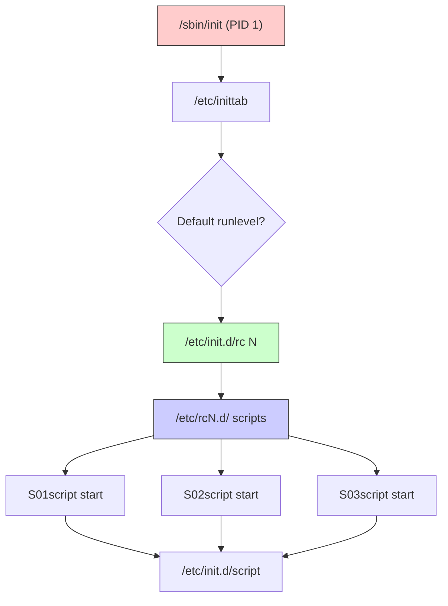
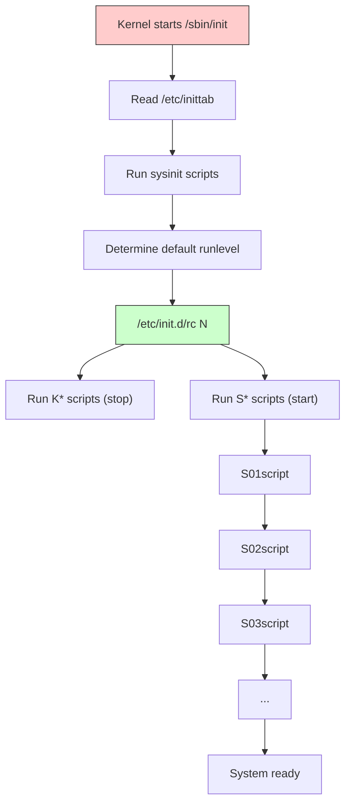
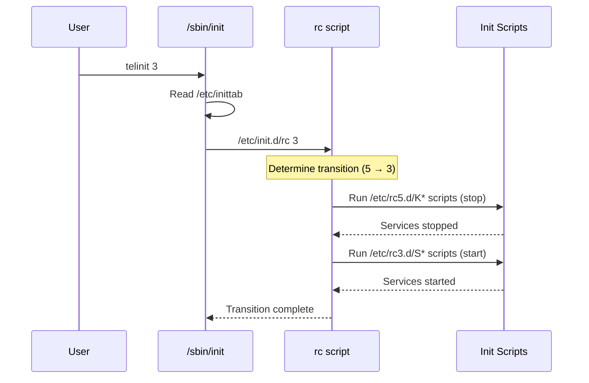
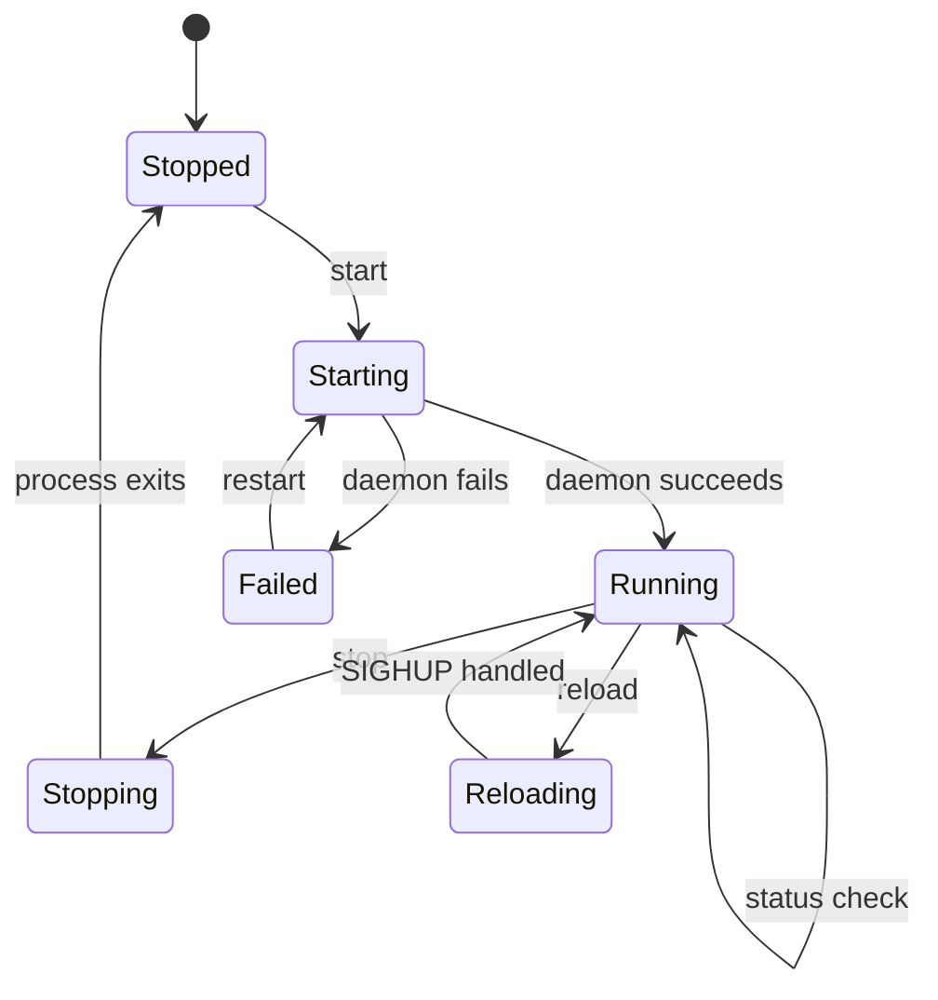

# Chapter 216: SysVinit — /etc/inittab, rc Scripts, Runlevels, chkconfig

## 1. Intuition

SysVinit (System V initialization) is the oldest and most traditional init system for Linux. Named after AT&T's UNIX System V from 1983, it was the dominant init system for decades before being supplanted by systemd and OpenRC. While no longer the default on major distributions, understanding SysVinit is essential for:

- Maintaining legacy systems that still run it
- Understanding the conceptual foundation that all modern init systems build upon
- Working with embedded systems and appliances that use it
- Comprehending the historical evolution of Linux boot processes

SysVinit's core concept is **runlevels** — numbered system states (0-6) that define which services are running. The init process (PID 1) reads `/etc/inittab` to determine the default runlevel, then executes the appropriate sequence of shell scripts to start or stop services.

The key insight is that SysVinit is **sequential** — services start one after another in a fixed order. This makes boot predictable and easy to debug, but slow on modern multi-core hardware. The simplicity is both its greatest strength and its greatest weakness.

## 2. Architecture

### 2.1 System Components



### 2.2 Runlevels

| Runlevel | Name | Purpose |
|----------|------|---------|
| 0 | halt | Shutdown and power off |
| 1 | single | Single-user mode (maintenance) |
| 2 | multiuser | Multi-user without networking (Debian/Ubuntu default) |
| 3 | multiuser+net | Multi-user with networking (RHEL/CentOS default) |
| 4 | unused | Custom (user-definable) |
| 5 | graphical | Multi-user with GUI |
| 6 | reboot | Reboot |

```bash
# Check current runlevel
runlevel
# Output: N 5  (N = no previous, current = 5)

# Change runlevel
init 3                    # Switch to runlevel 3
telinit 3                 # Same as init 3

# Check default runlevel
cat /etc/inittab | grep "^id:"

# Set default runlevel
# Edit /etc/inittab: id:3:initdefault:
```

### 2.3 Directory Structure

```
/etc/
├── inittab                  # Main init configuration
├── init.d/                  # Init scripts (the actual scripts)
│   ├── sshd                 # SSH daemon script
│   ├── httpd                # Apache script
│   ├── network              # Network initialization
│   └── ...
├── rc                       # Main rc dispatcher
├── rc.local                 # Local customizations
├── rc.sysinit               # System initialization
├── rc0.d/                   # Runlevel 0 (halt) scripts
│   ├── K01sshd -> ../init.d/sshd
│   ├── K02httpd -> ../init.d/httpd
│   └── ...
├── rc1.d/                   # Runlevel 1 (single user)
├── rc2.d/                   # Runlevel 2
├── rc3.d/                   # Runlevel 3
├── rc4.d/                   # Runlevel 4
├── rc5.d/                   # Runlevel 5
├── rc6.d/                   # Runlevel 6 (reboot)
└── rcS.d/                   # System initialization scripts
```

## 3. /etc/inittab

### 3.1 File Format

`/etc/inittab` is the master configuration file for SysVinit. Each line has the format:

```
id:runlevels:action:process
```

| Field | Description |
|-------|-------------|
| `id` | Unique identifier (1-4 characters) |
| `runlevels` | Which runlevels apply (empty = all) |
| `action` | When to execute |
| `process` | Command to execute |

### 3.2 Action Types

| Action | Description |
|--------|-------------|
| `respawn` | Restart process if it dies |
| `wait` | Start process once, wait for completion |
| `once` | Start process once, don't wait |
| `boot` | Run during boot, don't wait |
| `bootwait` | Run during boot, wait for completion |
| `off` | Disable this entry |
| `initdefault` | Default runlevel |
| `sysinit` | Run before any boot processing |
| `powerwait` | Run when power fails (UPS) |
| `powerfail` | Like powerwait, but don't wait |
| `powerokwait` | Run when power restored |
| `ctrlaltdel` | Run when Ctrl+Alt+Del pressed |
| `kbrequest` | Run on keyboard signal |

### 3.3 Example inittab

```bash
# /etc/inittab - SysVinit configuration

# Default runlevel (3 = multi-user with networking, 5 = graphical)
id:3:initdefault:

# System initialization
si::sysinit:/etc/init.d/rcS

# Runlevel 0 (halt)
l0:0:wait:/etc/init.d/rc 0

# Runlevel 1 (single user)
l1:1:wait:/etc/init.d/rc 1

# Runlevel 2 (multi-user, no networking)
l2:2:wait:/etc/init.d/rc 2

# Runlevel 3 (multi-user with networking)
l3:3:wait:/etc/init.d/rc 3

# Runlevel 4 (unused)
l4:4:wait:/etc/init.d/rc 4

# Runlevel 5 (graphical)
l5:5:wait:/etc/init.d/rc 5

# Runlevel 6 (reboot)
l6:6:wait:/etc/init.d/rc 6

# Ctrl+Alt+Del handling
ca:12345:ctrlaltdel:/sbin/shutdown -t1 -a -r now

# Power management
pf::powerwait:/etc/init.d/powerfail start
pn::powerfailnow:/etc/init.d/powerfail now
po::powerokwait:/etc/init.d/powerfail stop

# Serial consoles
1:2345:respawn:/sbin/agetty tty1 9600
2:2345:respawn:/sbin/agetty tty2 9600
3:2345:respawn:/sbin/agetty tty3 9600
4:2345:respawn:/sbin/agetty tty4 9600
5:2345:respawn:/sbin/agetty tty5 9600
6:2345:respawn:/sbin/agetty tty6 9600

# Serial console (for servers)
T0:2345:respawn:/sbin/agetty -L ttyS0 115200 vt100

# Single user mode
~~:S:wait:/sbin/sulogin
```

### 3.4 Getty Configuration

The `agetty` entries in `/etc/inittab` manage virtual consoles:

```bash
# Basic virtual console
1:2345:respawn:/sbin/agetty tty1 9600

# With login banner
1:2345:respawn:/sbin/agetty -i -n tty1 9600

# Serial console (for remote servers)
T0:2345:respawn:/sbin/agetty -L ttyS0 115200 vt100

# Serial console with auto-login
T0:2345:respawn:/sbin/agetty -a root -L ttyS0 115200 vt100

# USB serial console
T0:2345:respawn:/sbin/agetty -L ttyUSB0 115200 vt100

# With specific terminal type
1:2345:respawn:/sbin/agetty --noclear tty1 linux
```

## 4. Init Scripts

### 4.1 Standard Init Script Structure

```bash
#!/bin/bash
# /etc/init.d/myservice
# SysVinit init script for MyService
#
# chkconfig: 2345 80 20
# description: MyService is a custom application server
# processname: myservice
# pidfile: /var/run/myservice.pid
# config: /etc/myservice/config.yaml

### BEGIN INIT INFO
# Provides:          myservice
# Required-Start:    $network $syslog
# Required-Stop:     $network $syslog
# Default-Start:     2 3 4 5
# Default-Stop:      0 1 6
# Short-Description: MyService application server
# Description:       MyService provides web application services
### END INIT INFO

# Source function library
. /etc/init.d/functions

# Variables
NAME="myservice"
DAEMON="/usr/bin/myservice"
PIDFILE="/var/run/${NAME}.pid"
CONFIG="/etc/${NAME}/config.yaml"
LOGFILE="/var/log/${NAME}/${NAME}.log"
USER="myservice"
GROUP="myservice"
LOCKFILE="/var/lock/subsys/${NAME}"

# Read configuration if exists
[ -f /etc/sysconfig/${NAME} ] && . /etc/sysconfig/${NAME}
[ -f /etc/default/${NAME} ] && . /etc/default/${NAME}

# Check if daemon exists
[ -x "$DAEMON" ] || exit 0

# ---- Functions ----

check_running() {
    if [ -f "$PIDFILE" ]; then
        local pid
        pid=$(cat "$PIDFILE")
        if kill -0 "$pid" 2>/dev/null; then
            return 0
        fi
        # Stale PID file
        rm -f "$PIDFILE"
    fi
    return 1
}

start() {
    echo -n $"Starting ${NAME}: "
    
    # Check if already running
    if check_running; then
        echo -n $"${NAME} is already running"
        success
        echo
        return 0
    fi
    
    # Create necessary directories
    mkdir -p "$(dirname "$LOGFILE")"
    chown "${USER}:${GROUP}" "$(dirname "$LOGFILE")"
    
    # Start the daemon
    daemon --user="${USER}" --pidfile="${PIDFILE}" \
        "${DAEMON}" --config "${CONFIG}" &
    
    # Write PID file
    echo $! > "$PIDFILE"
    
    # Create lock file
    touch "$LOCKFILE"
    
    # Check success
    if check_running; then
        success
        echo
        return 0
    else
        failure
        echo
        return 1
    fi
}

stop() {
    echo -n $"Stopping ${NAME}: "
    
    if ! check_running; then
        echo -n $"${NAME} is not running"
        success
        echo
        return 0
    fi
    
    # Send TERM signal
    killproc -p "$PIDFILE" -d 30 "$DAEMON"
    
    # Remove PID and lock files
    rm -f "$PIDFILE" "$LOCKFILE"
    
    if ! check_running; then
        success
        echo
        return 0
    else
        failure
        echo
        return 1
    fi
}

restart() {
    stop
    sleep 2
    start
}

reload() {
    echo -n $"Reloading ${NAME}: "
    
    if check_running; then
        killproc -p "$PIDFILE" "$DAEMON" -HUP
        success
        echo
        return 0
    else
        echo -n $"${NAME} is not running"
        failure
        echo
        return 1
    fi
}

status() {
    if check_running; then
        echo $"${NAME} (pid $(cat "$PIDFILE")) is running..."
        return 0
    else
        if [ -f "$LOCKFILE" ]; then
            echo $"${NAME} is dead but lock file exists"
            return 2
        elif [ -f "$PIDFILE" ]; then
            echo $"${NAME} is dead but pid file exists"
            return 1
        else
            echo $"${NAME} is stopped"
            return 3
        fi
    fi
}

configtest() {
    echo -n $"Testing ${NAME} configuration: "
    "${DAEMON}" --test-config --config "${CONFIG}"
    if [ $? -eq 0 ]; then
        success
    else
        failure
    fi
    echo
}

# ---- Main Logic ----

case "$1" in
    start)
        start
        ;;
    stop)
        stop
        ;;
    restart|force-reload)
        restart
        ;;
    reload)
        reload
        ;;
    status)
        status
        ;;
    configtest)
        configtest
        ;;
    condrestart|try-restart)
        if check_running; then
            restart
        fi
        ;;
    *)
        echo $"Usage: $0 {start|stop|restart|reload|force-reload|status|configtest|condrestart}"
        exit 2
        ;;
esac

exit $?
```

### 4.2 LSB Headers (Linux Standard Base)

The LSB header block provides dependency information for tools like `insserv` and `update-rc.d`:

```bash
### BEGIN INIT INFO
# Provides:          myservice webserver
# Required-Start:    $network $syslog $remote_fs
# Required-Stop:     $network $syslog $remote_fs
# Should-Start:      $named mysql postgresql
# Should-Stop:       $named mysql postgresql
# Default-Start:     2 3 4 5
# Default-Stop:      0 1 6
# Short-Description: MyService application server
# Description:       MyService provides web application services
#                    with support for dynamic content generation.
# X-Start-Before:    apache2 nginx
# X-Stop-After:      apache2 nginx
### END INIT INFO
```

| Field | Purpose |
|-------|---------|
| `Provides` | Virtual facilities this script provides |
| `Required-Start` | Hard dependencies (must start before) |
| `Required-Stop` | Hard dependencies (must stop after) |
| `Should-Start` | Soft dependencies (prefer to start after) |
| `Should-Stop` | Soft dependencies (prefer to stop after) |
| `Default-Start` | Runlevels to start in by default |
| `Default-Stop` | Runlevels to stop in by default |
| `X-Start-Before` | Services that should start after this one |
| `X-Stop-After` | Services that should stop before this one |

### 4.3 Special Facility Names

The `$` prefixed names are virtual facilities:

| Facility | Description |
|----------|-------------|
| `$network` | Network interfaces are up |
| `$local_fs` | Local filesystems are mounted |
| `$remote_fs` | Remote filesystems are mounted |
| `$syslog` | System logger is running |
| `$named` | DNS server is running |
| `$time` | System time is synchronized |
| `$portmap` | RPC portmapper is running |
| `$all` | All services (use with caution) |

## 5. The rc Scripts

### 5.1 /etc/init.d/rc — The Main Dispatcher

The `/etc/init.d/rc` script is called by init when changing runlevels:

```bash
#!/bin/bash
# /etc/init.d/rc - Runlevel change dispatcher

# This script is called by /sbin/init when changing runlevels
# It runs the appropriate scripts in /etc/rcN.d/

runlevel=$1

# Get current and previous runlevel
previous=$(runlevel | awk '{print $1}')
current=$(runlevel | awk '{print $2}')

# Determine scripts to run
# For entering a runlevel:
# 1. Run K* (kill) scripts from the previous runlevel
# 2. Run S* (start) scripts from the new runlevel

# Kill scripts (stop services not in new runlevel)
for script in /etc/rc${previous}.d/K[0-9][0-9]*; do
    [ -x "$script" ] || continue
    "$script" stop
done

# Start scripts (start services for new runlevel)
for script in /etc/rc${runlevel}.d/S[0-9][0-9]*; do
    [ -x "$script" ] || continue
    "$script" start
done
```

### 5.2 Script Naming Convention

Scripts in `/etc/rcN.d/` are symlinks to `/etc/init.d/` scripts:

```
/etc/rc3.d/
├── S10network -> ../init.d/network      # Start (priority 10)
├── S12syslog -> ../init.d/syslog        # Start (priority 12)
├── S20sshd -> ../init.d/sshd            # Start (priority 20)
├── S80httpd -> ../init.d/httpd          # Start (priority 80)
├── S99local -> ../init.d/local          # Start (priority 99)
├── K10httpd -> ../init.d/httpd          # Kill (priority 10)
├── K20sshd -> ../init.d/sshd            # Kill (priority 20)
└── K80network -> ../init.d/network      # Kill (priority 80)
```

Naming convention:
- **S** = Start this service when entering this runlevel
- **K** = Kill (stop) this service when leaving this runlevel
- **NN** = Priority number (00-99), determines execution order
- Lower numbers execute first

### 5.3 /etc/rc.local

`/etc/rc.local` runs at the end of each runlevel startup:

```bash
#!/bin/bash
# /etc/rc.local
# Commands in this file run at the end of each multi-user runlevel

# Set CPU governor
for cpu in /sys/devices/system/cpu/cpu*/cpufreq/scaling_governor; do
    echo "performance" > "$cpu" 2>/dev/null
done

# Enable IP forwarding
echo 1 > /proc/sys/net/ipv4/ip_forward

# Custom firewall rules
iptables -t nat -A POSTROUTING -o eth0 -j MASQUERADE

# Start custom application
/usr/local/bin/myapp &

exit 0
```

## 6. chkconfig and update-rc.d

### 6.1 chkconfig (RHEL/CentOS/Fedora)

`chkconfig` manages init script links in `/etc/rcN.d/`:

```bash
# List all services and their runlevel status
chkconfig --list

# List a specific service
chkconfig --list nginx

# Enable service for runlevels 2, 3, 4, 5
chkconfig nginx on

# Enable for specific runlevels
chkconfig --level 2345 nginx on

# Disable service
chkconfig nginx off

# Disable for specific runlevels
chkconfig --level 2345 nginx off

# Add a new service
chkconfig --add myservice

# Remove a service
chkconfig --del myservice

# Set specific runlevel settings
chkconfig --level 35 nginx on
chkconfig --level 01246 nginx off
```

### 6.2 update-rc.d (Debian/Ubuntu)

`update-rc.d` is the Debian equivalent:

```bash
# Enable service with default runlevels (from LSB header)
update-rc.d nginx enable

# Disable service
update-rc.d nginx disable

# Remove service links
update-rc.d -f nginx remove

# Add service with specific runlevels
update-rc.d nginx start 80 2 3 4 5 . stop 20 0 1 6 .

# Add with dependencies (uses insserv)
update-rc.d nginx defaults

# Add with specific priorities
update-rc.d nginx start 20 2 3 4 5 . stop 80 0 1 6 .

# Force removal
update-rc.d -f nginx remove
```

### 6.3 insserv (Dependency-Based)

`insserv` uses LSB headers for dependency-based boot ordering:

```bash
# Calculate and set boot order based on dependencies
insserv nginx

# Remove service
insserv -r nginx

# Dry run (show what would be done)
insserv -n nginx

# Verbose output
insserv -v nginx
```

## 7. Common Pitfalls

### Pitfall 1: Wrong Priority Numbers

**Symptom:** Service starts before its dependency.

**Cause:** Priority number (SNN) is too low — lower numbers run first.

**Fix:** Use `chkconfig` or `update-rc.d` to set correct priorities, or use LSB headers for automatic dependency resolution.

### Pitfall 2: Service Doesn't Stop Cleanly

**Symptom:** Service left running after runlevel change.

**Cause:** No K (kill) symlink in the target runlevel, or the stop function doesn't work.

**Fix:**
```bash
# Check for K symlinks
ls /etc/rc0.d/ | grep myservice
# Add if missing
chkconfig --level 01 myservice on
```

### Pitfall 3: rc.local Not Executing

**Symptom:** Commands in `/etc/rc.local` don't run.

**Cause:** `rc.local` not executable, or missing `exit 0`.

**Fix:**
```bash
chmod +x /etc/rc.local
# Ensure it ends with exit 0
```

### Pitfall 4: Serial Console Not Working

**Symptom:** No login prompt on serial port.

**Cause:** Missing or incorrect `agetty` entry in `/etc/inittab`.

**Fix:**
```bash
# Add to /etc/inittab:
T0:2345:respawn:/sbin/agetty -L ttyS0 115200 vt100

# Tell init to re-read inittab
telinit q
```

### Pitfall 5: Single User Mode Requires Password

**Symptom:** Can't enter single-user mode for maintenance.

**Cause:** `/etc/inittab` has `~~:S:wait:/sbin/sulogin` (requires root password).

**Fix:** For emergency access, boot with `init=/bin/bash` at the bootloader prompt.

### Pitfall 6: Stale PID Files

**Symptom:** Service can't restart — "already running" but it's not.

**Cause:** PID file exists from a crashed process.

**Fix:**
```bash
# Check if process exists
kill -0 $(cat /var/run/myservice.pid) 2>/dev/null
# If not, remove stale PID
rm -f /var/run/myservice.pid
```

## 8. Best Practices

1. **Always include LSB headers** in init scripts for proper dependency management.

2. **Use `chkconfig` or `update-rc.d`** to manage runlevel links — never create symlinks manually.

3. **Test init scripts** before enabling:
   ```bash
   /etc/init.d/myservice start
   /etc/init.d/myservice status
   /etc/init.d/myservice stop
   ```

4. **Use the `daemon` and `killproc` functions** from `/etc/init.d/functions` (RHEL) for consistent behavior.

5. **Handle PID files carefully** — always check for stale PIDs before assuming a service is running.

6. **Use `/etc/sysconfig/` (RHEL) or `/etc/default/` (Debian)** for service configuration — not the init script itself.

7. **Set appropriate priority numbers:**
   - Network services: 10-30
   - Database services: 40-60
   - Application services: 70-90
   - Local customizations: 99

8. **Always provide `status`, `restart`, and `reload` commands** in init scripts.

9. **Use `condrestart` (RHEL) or `try-restart`** to restart only if already running — useful for package post-install scripts.

10. **Keep `/etc/rc.local` minimal** — prefer proper init scripts for services that need to run at boot.

## 9. Diagrams

### 9.1 SysVinit Boot Flow



### 9.2 Runlevel Transition



### 9.3 Service Lifecycle



## 10. Exercises

### Exercise 1: Examine SysVinit Configuration

```bash
# 1. Check default runlevel (if using SysVinit)
cat /etc/inittab | grep "^id:" 2>/dev/null
# Or on a systemd system, check:
systemctl get-default

# 2. List all init scripts
ls /etc/init.d/

# 3. Show runlevel links
for rl in 0 1 2 3 4 5 6; do
    echo "=== Runlevel $rl ==="
    ls /etc/rc${rl}.d/ 2>/dev/null
done

# 4. Check service status
/etc/init.d/sshd status 2>/dev/null
/etc/init.d/network status 2>/dev/null

# 5. Examine an init script
cat /etc/init.d/sshd | head -50
```

### Exercise 2: Create a SysVinit Script

```bash
# 1. Create the init script
sudo tee /etc/init.d/test-daemon << 'SCRIPT'
#!/bin/bash
# test-daemon SysVinit script

### BEGIN INIT INFO
# Provides:          test-daemon
# Required-Start:    $network
# Required-Stop:     $network
# Default-Start:     2 3 4 5
# Default-Stop:      0 1 6
# Short-Description: Test daemon
### END INIT INFO

NAME="test-daemon"
DAEMON="/usr/local/bin/test-daemon"
PIDFILE="/var/run/${NAME}.pid"

case "$1" in
    start)
        echo -n "Starting ${NAME}: "
        if [ -f "$PIDFILE" ] && kill -0 $(cat "$PIDFILE") 2>/dev/null; then
            echo "already running"
            exit 0
        fi
        $DAEMON &
        echo $! > "$PIDFILE"
        echo "OK"
        ;;
    stop)
        echo -n "Stopping ${NAME}: "
        if [ -f "$PIDFILE" ]; then
            kill $(cat "$PIDFILE") 2>/dev/null
            rm -f "$PIDFILE"
        fi
        echo "OK"
        ;;
    restart)
        $0 stop
        sleep 1
        $0 start
        ;;
    status)
        if [ -f "$PIDFILE" ] && kill -0 $(cat "$PIDFILE") 2>/dev/null; then
            echo "${NAME} is running (PID: $(cat $PIDFILE))"
        else
            echo "${NAME} is not running"
        fi
        ;;
    *)
        echo "Usage: $0 {start|stop|restart|status}"
        exit 2
        ;;
esac
exit 0
SCRIPT
sudo chmod +x /etc/init.d/test-daemon

# 2. Add to runlevels (chkconfig style)
sudo chkconfig --add test-daemon
sudo chkconfig test-daemon on

# Or with update-rc.d:
# sudo update-rc.d test-daemon defaults

# 3. Test the service
sudo /etc/init.d/test-daemon start
sudo /etc/init.d/test-daemon status
sudo /etc/init.d/test-daemon stop
```

### Exercise 3: Manage Runlevels

```bash
# 1. Show current runlevel
runlevel

# 2. List services in current runlevel
ls /etc/rc$(runlevel | awk '{print $2}').d/

# 3. Disable a service for a runlevel
sudo update-rc.d -f nginx remove 2>/dev/null
# Or
sudo chkconfig nginx off 2>/dev/null

# 4. Enable a service for specific runlevels
sudo chkconfig --level 35 nginx on 2>/dev/null

# 5. Create a custom runlevel
sudo mkdir /etc/rc7.d
sudo cp -r /etc/rc3.d/* /etc/rc7.d/

# 6. Add inittab entry for custom runlevel
# (requires editing /etc/inittab)
```

### Exercise 4: Serial Console Configuration

```bash
# 1. Check existing serial console configuration
grep -i "agetty\|getty\|ttyS" /etc/inittab 2>/dev/null

# 2. Add serial console
# (Only works with actual SysVinit)
# sudo tee -a /etc/inittab << 'EOF'
# T0:2345:respawn:/sbin/agetty -L ttyS0 115200 vt100
# EOF

# 3. Tell init to re-read configuration
# sudo telinit q

# 4. Check if serial console is active
# sudo lsof /dev/ttyS0
```

## 11. References

1. **init(8) Man Page** — https://man7.org/linux/man-pages/man8/init.8.html — SysVinit init process.

2. **inittab(5) Man Page** — https://man7.org/linux/man-pages/man5/inittab.5.html — inittab configuration.

3. **chkconfig(8) Man Page** — https://man7.org/linux/man-pages/man8/chkconfig.8.html — RHEL service management.

4. **update-rc.d(8) Man Page** — https://man7.org/linux/man-pages/man8/update-rc.d.8.html — Debian service management.

5. **insserv(8) Man Page** — https://man7.org/linux/man-pages/man8/insserv.8.html — Dependency-based boot ordering.

6. **Linux Standard Base Init Scripts** — https://refspecs.linuxbase.org/LSB_5.0.0/LSB-Core-generic/LSB-Core-generic/initscrcomconv.html — LSB header specification.

7. **Gentoo Wiki: SysVinit** — https://wiki.gentoo.org/wiki/SysVinit — SysVinit documentation.

8. **Debian Wiki: Init Scripts** — https://wiki.debian.org/LSBInitScripts — Debian init script guidelines.

9. **Red Hat: Customizing Init Scripts** — https://docs.redhat.com/en/documentation/red_hat_enterprise_linux/ — RHEL init script documentation.

10. **UNIX System V Release 4 Documentation** — Historical reference for the original SysVinit design.
