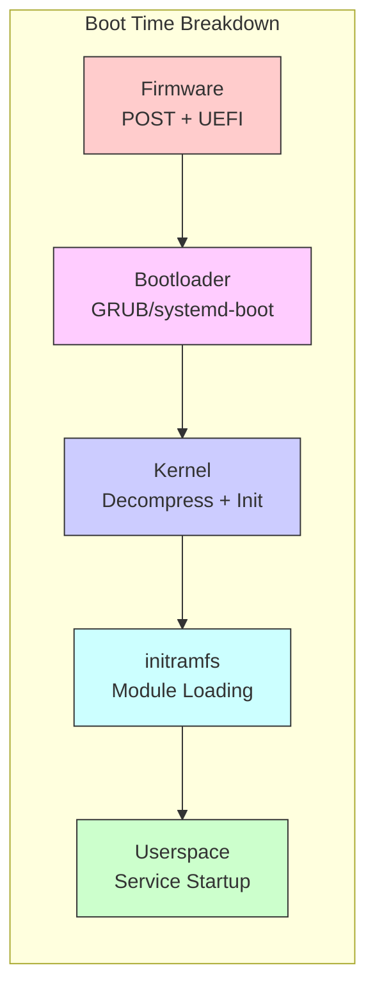
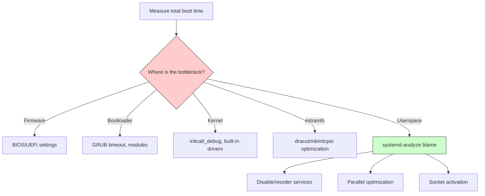
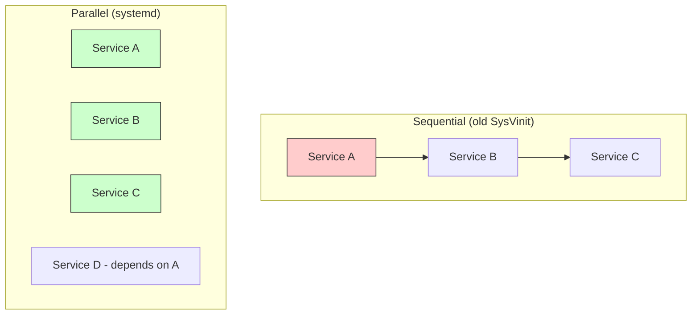
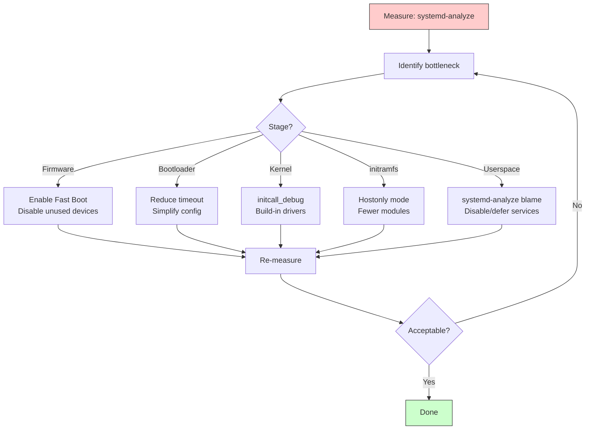
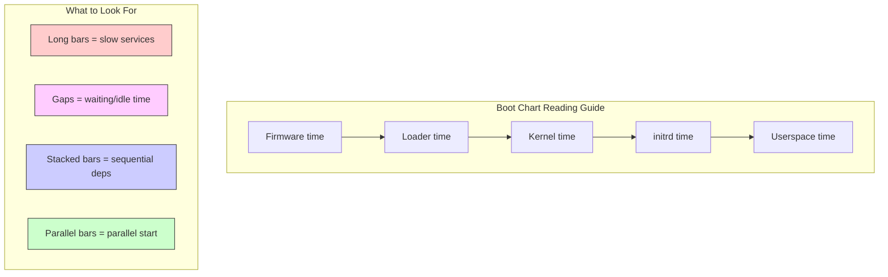

# Chapter 217: Boot Optimization — systemd-analyze, Parallel Boot, Readahead, Kernel Tuning

## 1. Intuition

Boot time is one of the most visible performance metrics. Users expect their laptops to boot in seconds, embedded devices must reach operational state quickly, and cloud instances that boot faster cost less money. Boot optimization is the systematic process of measuring, analyzing, and reducing the time from power-on to a fully operational system.

The key insight about boot optimization is that it follows the standard performance engineering methodology: **measure first, then optimize the bottleneck**. The boot process is a pipeline with several stages (firmware, bootloader, kernel, initramfs, userspace), and optimizing a stage that isn't the bottleneck yields no benefit. A system that spends 30 seconds in firmware and 2 seconds in kernel initialization won't benefit from kernel optimization — you need to fix the firmware.

Modern Linux systems provide excellent tooling for boot analysis, particularly `systemd-analyze`. Combined with kernel-level profiling and careful configuration, it's possible to reduce boot times from minutes to seconds.

## 2. Architecture

### 2.1 Boot Time Components



| Stage | Typical Time | Optimizable? |
|-------|-------------|-------------|
| Firmware | 2-30 seconds | Limited (disable CSM, fast boot) |
| Bootloader | 0.5-5 seconds | Yes (reduce timeout, remove menu) |
| Kernel | 0.5-5 seconds | Yes (built-in drivers, fewer modules) |
| initramfs | 0.5-5 seconds | Yes (hostonly, fewer modules) |
| Userspace | 2-60 seconds | Yes (parallel start, disable services) |

### 2.2 Measurement Strategy



## 3. systemd-analyze

### 3.1 Basic Boot Time Analysis

```bash
# Overall boot time summary
systemd-analyze
# Output:
# Startup finished in 5.123s (firmware) + 4.567s (loader) + 2.345s (kernel) + 12.890s (initrd) + 15.234s (userspace) = 40.159s
# graphical.target reached after 15.123s in userspace

# Break down by stage
systemd-analyze time
# Shows firmware, loader, kernel, initrd, userspace times
```

### 3.2 Per-Service Boot Time

```bash
# List services by startup time (slowest first)
systemd-analyze blame
# Output:
#          10.234s NetworkManager-wait-online.service
#           5.678s dev-sda2.device
#           3.456s lvm2-monitor.service
#           2.345s systemd-udev-settle.service
#           1.234s accounts-daemon.service
#           ...

# Show only the slowest N services
systemd-analyze blame | head -20

# Filter by service type
systemd-analyze blame --user    # User services only
```

### 3.3 Critical Chain Analysis

The critical chain shows the longest dependency path through the boot:

```bash
# Show critical chain
systemd-analyze critical-chain
# Output:
# The time after the unit is active or started is printed after the "@" character.
# The time the unit takes to start is printed after the "+" character.
#
# graphical.target @15.123s
# └─multi-user.target @15.123s
#   └─nginx.service @10.567s +2.345s
#     └─network-online.target @10.456s
#       └─NetworkManager-wait-online.service @5.123s +5.333s
#         └─NetworkManager.service @4.567s +556ms
#           └─basic.target @4.234s
#             └─sockets.target @4.234s
#               └─dbus.socket @4.234s
#                 └─sysinit.target @4.123s
#                   └─systemd-update-utmp.service @4.012s +111ms

# Show critical chain for a specific unit
systemd-analyze critical-chain nginx.service

# Show with timestamps
systemd-analyze critical-chain --fuzz=1s
```

### 3.4 Boot Visualization

```bash
# Generate SVG boot chart
systemd-analyze plot > boot-chart.svg

# Generate SVG with detailed timing
systemd-analyze plot --no-legend > boot-chart-detailed.svg

# Generate dot graph
systemd-analyze dot > boot-graph.dot
dot -Tsvg boot-graph.dot > boot-graph.svg

# Filter dot graph by service
systemd-analyze dot nginx.service | dot -Tsvg > nginx-deps.svg

# Show dependency graph
systemd-analyze dot --to-pattern='*.target' --from-pattern='*.service' | dot -Tsvg > targets.svg
```

### 3.5 Security Analysis

```bash
# Security score for services
systemd-analyze security nginx.service
# Output:
#   NAME                                        DESCRIPTION
# ✗ Service runs as the root user               UNSAFE
# ✓ Service has no special privileges            SAFE
# ✗ Service has access to the kernel ring buffer UNSAFE
# ...

# Security score for all services
systemd-analyze security --no-pager

# Compare security scores
systemd-analyze security nginx.service ssh.service
```

### 3.6 Verify Unit Files

```bash
# Verify all unit files
systemd-analyze verify

# Verify specific unit
systemd-analyze verify /etc/systemd/system/nginx.service

# Check for syntax errors and missing dependencies
systemd-analyze verify /etc/systemd/system/*.service
```

## 4. Parallel Boot Optimization

### 4.1 Understanding Parallelism

systemd starts services in parallel by default. The key to maximizing parallelism is proper dependency declaration:



### 4.2 Maximizing Parallelism

```bash
# 1. Remove unnecessary dependencies
# Bad: Forces sequential start
# After=network.target mysql.service postgresql.service

# Good: Only what's actually needed
# After=network.target
# Wants=network.target

# 2. Use Wants= instead of Requires= when possible
# Wants= allows parallel start even if dependency isn't ready yet
# Requires= blocks until dependency is fully started

# 3. Avoid Type=notify unless necessary
# Type=notify forces systemd to wait for readiness notification
# Type=simple starts immediately

# 4. Use socket activation for dependent services
# This eliminates ordering dependencies for network services
```

### 4.3 Socket Activation for Parallel Start

Socket activation allows services to start in parallel without ordering dependencies:

```ini
# /etc/systemd/system/webapp.socket
[Unit]
Description=Web Application Socket

[Socket]
ListenStream=8080
Service=webapp.service

[Install]
WantedBy=sockets.target
```

```ini
# /etc/systemd/system/webapp.service
[Unit]
Description=Web Application
Requires=webapp.socket

[Service]
Type=simple
ExecStart=/usr/bin/webapp
```

With socket activation:
- `webapp.socket` starts immediately at boot
- Connections are queued until `webapp.service` starts
- `webapp.service` can start later, in parallel with other services
- No ordering dependency needed

### 4.4 Avoiding Ordering Bottlenecks

```bash
# Bad: Everything waits for network
# Many services declare: After=network-online.target
# This creates a serialization point

# Good: Use network.target for ordering (available early)
# network-online.target waits for actual connectivity
# network.target just means "network stack initialized"

# For services that don't need actual connectivity:
# After=network.target  (fast)
# Not: After=network-online.target  (slow, waits for DHCP etc.)

# Check what's waiting for network-online.target
systemd-analyze critical-chain | grep network
```

## 5. Readahead and Prefetching

### 5.1 systemd-readahead (Deprecated)

systemd used to include a readahead daemon that pre-loaded files during boot. It has been removed in modern versions, but the concept is still relevant:

```bash
# The readahead concept:
# 1. Record which files are accessed during boot
# 2. On subsequent boots, pre-load these files into page cache
# 3. Reduces disk I/O during boot (especially on HDDs)

# Modern alternatives:
# - SSD storage eliminates most seek time
# - Kernel readahead (block device level)
# - fscache for network filesystems
```

### 5.2 Kernel-Level Readahead

```bash
# Configure kernel readahead for block devices
# Default: 128 KB
blockdev --setra 2048 /dev/sda    # 1 MB readahead

# View current readahead
blockdev --getra /dev/sda

# Make persistent in /etc/udev/rules.d/
echo 'ACTION=="add", KERNEL=="sda", ATTR{bdi/read_ahead_kb}="1024"' | \
    sudo tee /etc/udev/rules.d/99-readahead.rules

# For NVMe drives (larger readahead beneficial)
echo 'ACTION=="add", KERNEL=="nvme[0-9]*", ATTR{bdi/read_ahead_kb}="2048"' | \
    sudo tee /etc/udev/rules.d/99-nvme-readahead.rules
```

### 5.3 Filesystem Readahead

```bash
# ext4 readahead
# /etc/fstab options
# defaults,readahead=256    (256 blocks = 128 KB)

# For SSDs, readahead is less important due to low seek time
# For HDDs, larger readahead can help

# Check filesystem readahead
tune2fs -l /dev/sda2 | grep -i read

# Set readahead
tune2fs -o readahead=256 /dev/sda2
```

## 6. Kernel Tuning for Boot Speed

### 6.1 Kernel Configuration for Fast Boot

```bash
# .config options for faster boot

# Compression (faster decompression = faster boot)
CONFIG_KERNEL_LZ4=y              # Fastest decompression
# CONFIG_KERNEL_GZIP=y           # Default, good balance
# CONFIG_KERNEL_ZSTD=y           # Best compression ratio

# Built-in drivers (avoid module loading overhead)
CONFIG_ATA=y                     # SATA drivers built-in
CONFIG_NVME=y                    # NVMe built-in
CONFIG_EXT4_FS=y                 # ext4 built-in
CONFIG_BTRFS_FS=y                # Btrfs built-in (if used)

# Disable unnecessary features
# CONFIG_MODULES is not set      # No module support (extreme)
CONFIG_PRINTK_TIME=y             # Timestamps for analysis
# CONFIG_DEBUG_KERNEL is not set # Disable debug overhead

# Faster console
CONFIG_SERIAL_8250=y
CONFIG_SERIAL_8250_CONSOLE=y
# CONFIG_VT is not set           # Disable virtual terminals (embedded)
```

### 6.2 Kernel Command Line Optimization

```bash
# Minimal console output
quiet loglevel=0                  # Suppress all messages
# Or for debugging:
# loglevel=7 initcall_debug

# Disable unnecessary subsystems
noapic                            # Skip APIC init (if not needed)
nousb                             # Skip USB subsystem (headless servers)
nohz_full=1-N                     # Tickless for all CPUs except 0

# Faster console
console=ttyS0,115200n8           # Serial console (faster than VGA)
# console=tty0                    # VGA console (slow)

# Disable microcode loading (if firmware handles it)
# Disabling is generally not recommended

# Skip initramfs (if root is built-in)
# root=/dev/sda2 rootfstype=ext4
# (Requires root driver built into kernel)

# Disable quiet for analysis, re-enable for production
# quiet splash                    # Fast, no output
# initcall_debug                  # Slow, detailed analysis
```

### 6.3 Module Loading Optimization

```bash
# 1. Build critical modules into kernel
# In kernel .config:
CONFIG_EXT4_FS=y                  # Not =m
CONFIG_ATA_PIIX=y                 # Not =m
CONFIG_AHCI=y                     # Not =m

# 2. Blacklist unnecessary modules
cat > /etc/modprobe.d/blacklist-boot.conf << 'EOF'
# Modules not needed at boot
blacklist pcspkr
blacklist snd_pcsp
blacklist joydev
blacklist floppy
EOF

# 3. Pre-load modules in parallel
cat > /etc/modules-load.d/fast-boot.conf << 'EOF'
# Load these modules early
ext4
ahci
nvme
EOF

# 4. Optimize module loading order
# In initramfs, load storage drivers first
# dracut: add_drivers+=" ahci ext4 nvme "
# mkinitcpio: MODULES=(ahci ext4 nvme)
```

## 7. Userspace Service Optimization

### 7.1 Identifying Slow Services

```bash
# List services by startup time
systemd-analyze blame | head -30

# Common culprits:
# - NetworkManager-wait-online.service (waits for network)
# - lvm2-monitor.service (LVM monitoring)
# - systemd-udev-settle.service (waits for udev)
# - plymouth-quit-wait.service (splash screen)
# - apt-daily.service (daily package updates)
# - snapd.service (snap daemon)
# - ModemManager.service (modem detection)
```

### 7.2 Disabling Unnecessary Services

```bash
# Disable services not needed at boot
sudo systemctl disable ModemManager.service    # No modem
sudo systemctl disable bluetooth.service       # No Bluetooth
sudo systemctl disable cups.service            # No printing
sudo systemctl disable avahi-daemon.service    # No mDNS
sudo systemctl disable accounts-daemon.service # No user account mgmt

# Mask services (prevents even manual start)
sudo systemctl mask plymouth-quit-wait.service
sudo systemctl mask systemd-udev-settle.service

# Check what's enabled
systemctl list-unit-files --state=enabled

# Disable socket activation for unused services
sudo systemctl disable cups.socket
sudo systemctl disable avahi-daemon.socket
```

### 7.3 Optimizing NetworkManager Wait

```bash
# NetworkManager-wait-online.service is often the biggest bottleneck

# Option 1: Disable it (if you don't need network at boot)
sudo systemctl disable NetworkManager-wait-online.service

# Option 2: Reduce timeout
sudo mkdir -p /etc/systemd/system/NetworkManager-wait-online.service.d/
cat > /etc/systemd/system/NetworkManager-wait-online.service.d/timeout.conf << 'EOF'
[Service]
ExecStart=
ExecStart=/usr/bin/nm-online -s -q --timeout=10
EOF

# Option 3: Use systemd-networkd instead (faster)
# See networking chapter for migration guide
```

### 7.4 Optimizing LVM and Storage

```bash
# 1. Reduce LVM monitoring
sudo systemctl disable lvm2-monitor.service

# 2. Optimize LVM event handling
# /etc/lvm/lvm.conf
event_activation = 0              # Don't wait for events at boot

# 3. Use SSD-appropriate settings
# /etc/lvm/lvm.conf
issue_discards = 1                # Enable TRIM/discard

# 4. Reduce fsck frequency
# /etc/fstab: pass=0 for non-root filesystems
# /dev/sda2 / ext4 defaults 1 1    # Root: check first
# /dev/sda3 /home ext4 defaults 0 2 # Home: don't check at boot

# 5. Use nofail for non-critical mounts
# /dev/sdb1 /data ext4 defaults,nofail 0 0
```

### 7.5 Deferred Service Start

```bash
# Start services after boot completes (not during boot)

# Method 1: Timer-based start
# Create a timer that starts the service 30 seconds after boot
cat > /etc/systemd/system/deferred-app.timer << 'EOF'
[Unit]
Description=Deferred Application Start

[Timer]
OnBootSec=30s
Unit=deferred-app.service

[Install]
WantedBy=timers.target
EOF

# Method 2: idle service type
cat > /etc/systemd/system/idle-app.service << 'EOF'
[Unit]
Description=Idle Application

[Service]
Type=idle
ExecStart=/usr/bin/myapp
EOF

# Method 3: Use systemd-notify for readiness
cat > /etc/systemd/system/notify-app.service << 'EOF'
[Unit]
Description=Notify Application

[Service]
Type=notify
ExecStart=/usr/bin/myapp --notify-ready
EOF
```

## 8. Firmware Optimization

### 8.1 UEFI Fast Boot

```bash
# Most UEFI firmware has a "Fast Boot" option:
# - Skip memory test
# - Skip USB device initialization
# - Skip option ROM loading
# - Use cached hardware configuration

# In UEFI settings:
# - Enable "Fast Boot" or "Ultra Fast Boot"
# - Disable "Full Screen Logo Show"
# - Disable unused boot devices
# - Set boot order to only include the boot disk

# Measure firmware time
systemd-analyze firmware
# Typical: 2-5 seconds with fast boot, 10-30 seconds without
```

### 8.2 Bootloader Optimization

```bash
# GRUB2: Minimize timeout
# /etc/default/grub
GRUB_TIMEOUT=0                    # No menu (hold Shift for menu)
# Or
GRUB_TIMEOUT=1                    # 1 second timeout

# Disable os-prober (scans for other OSes)
GRUB_DISABLE_OS_PROBER=true

# Use simple graphics
GRUB_TERMINAL=console             # Text mode (faster)
GRUB_GFXPAYLOAD_LINUX=text        # No graphics mode switch

# Regenerate configuration
sudo grub-mkconfig -o /boot/grub/grub.cfg

# systemd-boot: Minimize timeout
# /boot/loader/loader.conf
timeout 0                         # No menu
# Or
timeout 1                         # 1 second timeout
editor no                         # Disable editor (faster)
```

## 9. Profiling and Analysis Tools

### 9.1 systemd-analyze Commands Summary

```bash
# Boot time summary
systemd-analyze

# Per-service boot time
systemd-analyze blame

# Critical dependency chain
systemd-analyze critical-chain

# Boot chart (SVG)
systemd-analyze plot > boot.svg

# Dependency graph (DOT format)
systemd-analyze dot | dot -Tsvg > deps.svg

# Security analysis
systemd-analyze security

# Unit file verification
systemd-analyze verify

# Calendar expression testing
systemd-analyze calendar "daily"

# Condition evaluation
systemd-analyze condition /etc/systemd/system/myservice.service

# File descriptor analysis
systemd-analyze fdstore

# Timestamp analysis
systemd-analyze timestamp "1h ago"

# Compare two timestamps
systemd-analyze timespan "2h 30min"
```

### 9.2 Kernel Boot Profiling

```bash
# 1. Enable initcall_debug
# Add to kernel command line: initcall_debug

# 2. Collect boot messages
dmesg > /tmp/boot.log

# 3. Analyze initcall times
grep "initcall.*returned" /tmp/boot.log | \
    sed 's/.*initcall \([^+]*\)+.*/\1/' | \
    sort | uniq -c | sort -rn | head -20

# 4. Show slowest initcalls
grep "initcall.*returned" /tmp/boot.log | \
    awk -F'after ' '{print $2}' | \
    awk '{print $1, $0}' | sort -rn | head -20

# 5. Use kernel's bootgraph.py (from kernel source)
scripts/bootgraph.py /tmp/boot.log > /tmp/boot.svg

# 6. Trace boot with ftrace
# Add to kernel command line: trace_event=initcall
# After boot:
cat /sys/kernel/debug/tracing/trace > /tmp/boot-trace.log
```

### 9.3 Boot Chart Tools

```bash
# systemd-analyze plot (built-in)
systemd-analyze plot > /tmp/boot.svg

# bootchart (classic tool)
apt install bootchart
# Reboot, then:
pybootchartgui /var/log/bootchart/*.tar.gz

# Bootchart2 (more detailed)
apt install bootchart2
# Reboot, then:
bootchart2 /var/log/bootchart/*.tar.gz

# Grabserial (serial console timing)
pip install grabserial
grabserial -d /dev/ttyS0 -t -m "Booting Linux"
```

### 9.4 Comparing Boot Times

```bash
# Baseline measurement
systemd-analyze > /tmp/boot-baseline.txt
systemd-analyze blame > /tmp/boot-blame-baseline.txt

# Make changes, then compare
systemd-analyze > /tmp/boot-optimized.txt
systemd-analyze blame > /tmp/boot-blame-optimized.txt

# Diff the results
diff /tmp/boot-baseline.txt /tmp/boot-optimized.txt
```

## 10. Common Pitfalls

### Pitfall 1: Optimizing the Wrong Stage

**Symptom:** Spent hours optimizing kernel, but boot time barely changed.

**Cause:** The bottleneck is in firmware or userspace, not the kernel.

**Fix:** Always use `systemd-analyze` to identify the slowest stage first.

### Pitfall 2: Disabling Critical Services

**Symptom:** System boots fast but doesn't work properly.

**Cause:** Disabled a service that other services depend on.

**Fix:**
```bash
# Check what depends on a service before disabling
systemctl list-dependencies --reverse myservice
```

### Pitfall 3: NetworkManager-wait-online Timeout

**Symptom:** Boot stalls for 60+ seconds.

**Cause:** NetworkManager-wait-online.service waiting for network connectivity that never comes (e.g., misconfigured interface).

**Fix:**
```bash
# Disable or reduce timeout
sudo systemctl disable NetworkManager-wait-online.service
```

### Pitfall 4: initramfs Too Large

**Symptom:** Slow kernel/initrd stage.

**Cause:** Generic initramfs includes all drivers.

**Fix:**
```bash
# Use hostonly mode
dracut --hostonly --force
# mkinitcpio: autodetect hook handles this
```

### Pitfall 5: Checking Services That Don't Need Checking

**Symptom:** Long fsck at boot.

**Cause:** Filesystems configured to check at every boot (pass=1 or pass=2 in fstab).

**Fix:**
```bash
# Set pass=0 for non-root filesystems
# /etc/fstab
/dev/sda2 / ext4 defaults 1 1       # Root: check
/dev/sda3 /home ext4 defaults 0 2   # Home: don't check at boot
/dev/sda4 /data ext4 defaults 0 0   # Data: never check
```

### Pitfall 6: Snap/Flatpak Services

**Symptom:** Boot takes 20+ seconds longer than expected.

**Cause:** snapd.service and related snap services add significant overhead.

**Fix:**
```bash
# Remove snap entirely
sudo snap remove --purge firefox
sudo snap remove --purge ...
sudo apt purge snapd

# Or just disable snap services
sudo systemctl disable snapd.service
sudo systemctl disable snapd.socket
sudo systemctl mask snapd.service
```

## 11. Best Practices

1. **Measure before optimizing.** Use `systemd-analyze blame` and `critical-chain` to find the actual bottleneck.

2. **Focus on the critical chain.** Optimizing a service that's not on the critical path has zero impact on total boot time.

3. **Use `Wants=` instead of `Requires=`** when a hard dependency isn't needed. This allows more parallel execution.

4. **Avoid `After=network-online.target`** unless the service truly needs network connectivity. Use `After=network.target` instead.

5. **Use socket activation** for services that other services depend on. This eliminates ordering constraints.

6. **Build critical drivers into the kernel** instead of loading them as modules. This eliminates module loading overhead.

7. **Use `Type=simple`** for services whenever possible. `Type=notify` and `Type=forking` force systemd to wait.

8. **Disable unnecessary services:**
   ```bash
   systemctl list-unit-files --state=enabled | wc -l
   # Aim for < 30 enabled services
   ```

9. **Use SSDs** — they eliminate storage seek time, which is the biggest hardware bottleneck for boot.

10. **Keep firmware updated** — firmware updates often include boot time improvements.

11. **Use `Persistent=true`** in timers instead of running services at boot — defer non-critical work.

12. **Profile with `systemd-analyze plot`** — the SVG chart shows exactly what's happening in parallel and what's blocking.

## 12. Diagrams

### 12.1 Boot Time Optimization Workflow



### 12.2 Parallel vs Sequential Boot

```mermaid
gantt
    title Boot Timeline Comparison
    dateFormat  s
    axisFormat %Ss
    
    section Sequential
    Service A   :a1, 0, 3s
    Service B   :a2, after a1, 2s
    Service C   :a3, after a2, 4s
    Service D   :a4, after a3, 1s
    
    section Parallel
    Service A   :b1, 0, 3s
    Service B   :b2, 0, 2s
    Service C   :b3, 0, 4s
    Service D   :b4, after b1, 1s
```



### 12.3 Boot Chart Analysis



## 13. Exercises

### Exercise 1: Baseline Boot Analysis

```bash
# 1. Measure current boot time
systemd-analyze

# 2. List slowest services
systemd-analyze blame | head -20

# 3. Show critical chain
systemd-analyze critical-chain

# 4. Generate boot chart
systemd-analyze plot > /tmp/boot-baseline.svg

# 5. Count enabled services
systemctl list-unit-files --state=enabled | wc -l

# 6. Document results
echo "=== Boot Baseline ===" > /tmp/boot-analysis.txt
systemd-analyze >> /tmp/boot-analysis.txt
echo "" >> /tmp/boot-analysis.txt
echo "=== Top 10 Slowest ===" >> /tmp/boot-analysis.txt
systemd-analyze blame | head -10 >> /tmp/boot-analysis.txt
```

### Exercise 2: Optimize Service Startup

```bash
# 1. Identify NetworkManager-wait-online impact
systemd-analyze blame | grep -i network

# 2. Check if it's on the critical chain
systemd-analyze critical-chain | grep -i network

# 3. If not needed, disable it
sudo systemctl disable NetworkManager-wait-online.service

# 4. Or reduce its timeout
sudo mkdir -p /etc/systemd/system/NetworkManager-wait-online.service.d/
sudo tee /etc/systemd/system/NetworkManager-wait-online.service.d/override.conf << 'EOF'
[Service]
ExecStart=
ExecStart=/usr/bin/nm-online -s -q --timeout=5
EOF
sudo systemctl daemon-reload

# 5. Re-measure
systemd-analyze
```

### Exercise 3: Disable Unnecessary Services

```bash
# 1. List enabled services
systemctl list-unit-files --state=enabled

# 2. Identify services you don't need
# Common candidates:
# - ModemManager (no modem)
# - bluetooth (no Bluetooth)
# - cups (no printer)
# - avahi-daemon (no mDNS needed)

# 3. Disable them
for svc in ModemManager bluetooth cups avahi-daemon; do
    sudo systemctl disable ${svc}.service 2>/dev/null
    sudo systemctl stop ${svc}.service 2>/dev/null
done

# 4. Mask services that should never start
sudo systemctl mask systemd-udev-settle.service

# 5. Re-measure
systemd-analyze blame | head -10
```

### Exercise 4: Kernel Boot Profiling

```bash
# 1. Add initcall_debug to kernel command line
# Edit GRUB: add "initcall_debug" to GRUB_CMDLINE_LINUX_DEFAULT
sudo sed -i 's/GRUB_CMDLINE_LINUX_DEFAULT="\(.*\)"/GRUB_CMDLINE_LINUX_DEFAULT="\1 initcall_debug"/' /etc/default/grub
sudo grub-mkconfig -o /boot/grub/grub.cfg

# 2. Reboot
sudo reboot

# 3. After boot, analyze initcalls
dmesg | grep "initcall.*returned" | \
    awk -F'after ' '{split($2,a," "); print a[1], $0}' | \
    sort -rn | head -20

# 4. Generate kernel boot graph (if kernel scripts available)
# scripts/bootgraph.py $(dmesg) > /tmp/kernel-boot.svg

# 5. Remove initcall_debug (for production)
sudo sed -i 's/ initcall_debug//' /etc/default/grub
sudo grub-mkconfig -o /boot/grub/grub.cfg
```

### Exercise 5: Comprehensive Boot Optimization

```bash
#!/bin/bash
# boot-optimize.sh - Automated boot optimization

echo "=== Boot Optimization Script ==="

# 1. Baseline
echo "Baseline boot time:"
systemd-analyze

# 2. Disable unnecessary services
echo ""
echo "Disabling unnecessary services..."
SERVICES="ModemManager bluetooth cups avahi-daemon accounts-daemon"
for svc in $SERVICES; do
    if systemctl is-enabled ${svc}.service &>/dev/null; then
        sudo systemctl disable ${svc}.service
        echo "  Disabled: ${svc}"
    fi
done

# 3. Reduce NetworkManager wait
echo "Optimizing NetworkManager..."
sudo mkdir -p /etc/systemd/system/NetworkManager-wait-online.service.d/
sudo tee /etc/systemd/system/NetworkManager-wait-online.service.d/override.conf > /dev/null << 'EOF'
[Service]
ExecStart=
ExecStart=/usr/bin/nm-online -s -q --timeout=5
EOF
sudo systemctl daemon-reload

# 4. Mask slow services
echo "Masking slow startup services..."
sudo systemctl mask systemd-udev-settle.service

# 5. Optimize initramfs (if dracut)
if command -v dracut &>/dev/null; then
    echo "Optimizing initramfs..."
    sudo dracut --hostonly --force
fi

# 6. Final measurement
echo ""
echo "Optimized boot time:"
systemd-analyze

# 7. Report
echo ""
echo "Top 10 slowest services:"
systemd-analyze blame | head -10
```

## 14. References

1. **systemd-analyze(1) Man Page** — https://www.freedesktop.org/software/systemd/man/systemd-analyze.html — Official documentation.

2. **Arch Wiki: Improving Performance/Boot Process** — https://wiki.archlinux.org/title/Improving_performance/Boot_process — Boot optimization guide.

3. **Fedora Boot Optimization** — https://fedoraproject.org/wiki/Boot_Optimization — Fedora boot optimization wiki.

4. **LWN.net: Boot Time Analysis** — https://lwn.net/Articles/ — Various articles on boot optimization.

5. **Brendan Gregg: Boot Chart Analysis** — https://www.brendangregg.com/bootgraph.html — Boot time visualization.

6. **systemd Optimization Tips** — https://systemd.io/OPTIMIZATIONS/ — Official optimization documentation.

7. **Linux Kernel Boot Parameters** — `Documentation/admin-guide/kernel-parameters.rst` — Kernel parameters affecting boot.

8. **systemd.io: For Service Developers** — https://systemd.io/WRITING_A_SERVICE/ — Best practices for service units.

9. **Embedded Linux Boot Time Optimization** — https://elinux.org/Boot_Time — Embedded systems boot optimization.

10. **Freedesktop.org: systemd for Administrators** — https://0pointer.de/blog/ — Blog series on systemd management.
