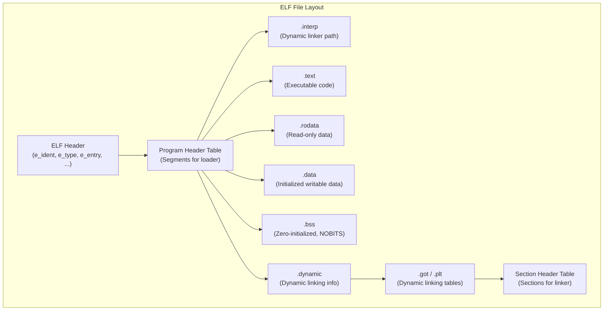
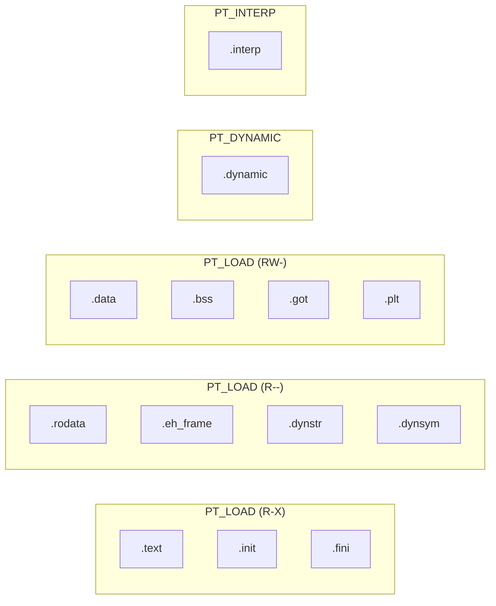
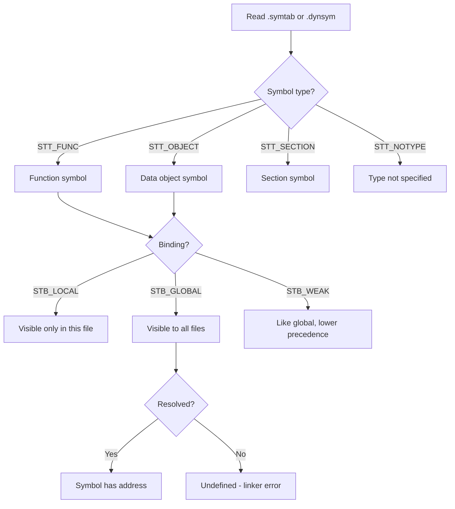

# Chapter 218: ELF Format

## 1. Intuition

Every executable, shared library, and object file on a Linux system speaks one common language: the **Executable and Linkable Format (ELF)**. Think of ELF as the "file system" for compiled code—it defines how bytes are organized so that both the **linker** (which combines object files) and the **loader** (which places a program into memory) can understand what they're dealing with.

Before ELF, Unix systems used formats like `a.out` (which was extremely simple and inflexible) and `COFF` (Common Object File Format, which added sections but remained limited). ELF was designed by the **Unix System Laboratories (USL)** as part of the **System V Release 4 (SVR4)** ABI, and it won the format wars of the early 1990s. Today it is the standard on Linux, *BSD, Solaris, and many embedded platforms.

The key insight is that ELF serves **two masters**:

- **Static link time** — the linker needs to know about *sections* (`.text`, `.data`, `.rodata`, `.bss`, `.symtab`, `.rela.text`, etc.) and *symbols* to combine object files into an executable or shared library.
- **Run time** — the loader and dynamic linker need to know about *segments* (loadable regions, dynamic linking info) to map the file into memory correctly.

A single ELF file contains both views simultaneously, which is why you see both **section headers** and **program headers** in the same file.

### Analogy

Imagine a shipping container (the ELF file). The **program headers** are like the loading instructions on the outside: "Place this pallet at offset 0x400000 in the warehouse, make it read-execute." The **section headers** are like the inventory manifest inside: "Box 1 is code, Box 2 is read-only data, Box 3 is uninitialized data." The loader reads the outside labels; the linker reads the inside manifest.

## 2. Architecture

### 2.1 ELF File Types

The `e_type` field in the ELF header identifies the file type:

| Value | Name | Description |
|-------|------|-------------|
| 0 | `ET_NONE` | Unknown / no file type |
| 1 | `ET_REL` | Relocatable file (`.o` object file) |
| 2 | `ET_EXEC` | Executable file (traditional statically-linked or PIE) |
| 3 | `ET_DYN` | Shared object (`.so`) or position-independent executable |
| 4 | `ET_CORE` | Core dump |

Note that modern PIE (Position-Independent Executable) binaries are `ET_DYN`, not `ET_EXEC`. This is because they are loaded at a random base address, just like shared libraries.

### 2.2 Overall Layout

```
+-------------------+
|   ELF Header      |  ← Always at offset 0
+-------------------+
| Program Header    |  ← Table of segments (for loader)
| Table             |
+-------------------+
| Segment 1         |  ← .text, .rodata, etc. mapped into memory
| (LOAD segment)    |
+-------------------+
| Segment 2         |  ← .data, .bss, .got, .plt
| (LOAD segment)    |
+-------------------+
| Segment 3         |  ← Dynamic linking info
| (DYNAMIC segment) |
+-------------------+
| .interp           |  ← Path to dynamic linker
+-------------------+
| Section 1 (.text) |
| Section 2 (.data) |
| ...               |
+-------------------+
| Section Header    |  ← Table of sections (for linker/debugger)
| Table             |
+-------------------+
```

The section header table is typically at the very end of the file. The program header table is usually right after the ELF header (at offset 0x40 for 64-bit).

### 2.3 Data Encoding

The `e_ident[EI_DATA]` field specifies the byte order:

- `ELFDATA2LSB` (1) — Little-endian (x86, x86-64, ARM default)
- `ELFDATA2MSB` (2) — Big-endian (SPARC, MIPS big-endian, PowerPC big-endian)

### 2.4 Machine Architecture

The `e_machine` field identifies the target ISA:

| Value | Name |
|-------|------|
| 0x03 | `EM_386` (x86) |
| 0x3E | `EM_X86_64` (x86-64) |
| 0x28 | `EM_ARM` |
| 0xB7 | `EM_AARCH64` (ARM64) |
| 0x08 | `EM_MIPS` |
| 0xF3 | `EM_RISCV` |

## 3. Kernel Implementation

### 3.1 ELF Loading in the Kernel

When you call `execve()` on an ELF binary, the kernel's ELF loader takes over. The relevant source is in the Linux kernel tree:

**Key source files:**
- `fs/binfmt_elf.c` — The main ELF binary format handler
- `include/linux/elf.h` — ELF structure definitions
- `include/uapi/linux/elf.h` — User-space ELF constants

The loading process:

1. **`load_elf_binary()`** is called from the VFS `exec` path.
2. It reads and validates the ELF header (`Elf64_Ehdr`).
3. It reads the program header table.
4. For each `PT_LOAD` segment, it calls `elf_map()` → `vm_mmap()` to create a VMA (Virtual Memory Area) mapping.
5. If there's a `PT_INTERP` segment (path to the dynamic linker, e.g., `/lib64/ld-linux-x86-64.so.2`), the kernel loads that too.
6. It sets up the initial stack with `argc`, `argv`, `envp`, and the ELF **auxiliary vector** (`AT_PHDR`, `AT_ENTRY`, `AT_BASE`, etc.).
7. It transfers control to either the ELF entry point or the dynamic linker's entry point.

```c
// Simplified from fs/binfmt_elf.c
static int load_elf_binary(struct linux_binprm *bprm)
{
    struct elfhdr elf_ex;
    // Read ELF header
    elf_ex = *((struct elfhdr *)bprm->buf);

    // Validate: magic number, class, data encoding
    if (memcmp(elf_ex.e_ident, ELFMAG, SELFMAG) != 0)
        return -ENOEXEC;

    // Read program headers
    elf_phdata = load_elf_phdrs(elf_ex, bprm->file);
    if (!elf_phdata)
        return -ENOMEM;

    // Find PT_INTERP (dynamic linker path)
    for (i = 0; i < elf_ex.e_phnum; i++) {
        if (elf_ppnt->p_type == PT_INTERP) {
            // Read interpreter path
            elf_interpreter = kmalloc(elf_ppnt->p_filesz, GFP_KERNEL);
            kernel_read(bprm->file, elf_ppnt->p_offset,
                       elf_interpreter, elf_ppnt->p_filesz);
        }
    }

    // Map PT_LOAD segments into process address space
    for (i = 0; i < elf_ex.e_phnum; i++) {
        if (elf_ppnt->p_type != PT_LOAD)
            continue;
        // Create VMA mapping
        elf_map(bprm->file, load_bias + elf_ppnt->p_vaddr,
                elf_ppnt, elf_prot, elf_flags, total_size);
    }

    // Set up auxiliary vector
    NEW_AUX_ENT(AT_PHDR, load_addr + exec->e_phoff);
    NEW_AUX_ENT(AT_PHNUM, exec->e_phnum);
    NEW_AUX_ENT(AT_ENTRY, exec->e_entry);

    // Transfer control
    start_thread(regs, elf_entry, bprm->p);
}
```

### 3.2 The Auxiliary Vector

The kernel passes information to the dynamic linker via the auxiliary vector (`auxv`), which sits on the user stack after `envp`:

```c
typedef struct {
    long a_type;
    union {
        long a_val;
        void *a_ptr;
        void (*a_fnc)();
    } a_un;
} Elf64_auxv_t;
```

Common auxiliary vector entries:

| Type | Meaning |
|------|---------|
| `AT_PHDR` | Address of program header table in memory |
| `AT_PHENT` | Size of a program header entry |
| `AT_PHNUM` | Number of program headers |
| `AT_ENTRY` | Entry point address of the executable |
| `AT_BASE` | Base address of the dynamic linker |
| `AT_PAGESZ` | System page size |
| `AT_HWCAP` | Hardware capability flags |
| `AT_CLKTCK` | Clock ticks per second (for `times()`) |

## 4. Data Structures

### 4.1 ELF Header (`Elf64_Ehdr`)

```c
#define EI_NIDENT 16

typedef struct {
    unsigned char e_ident[EI_NIDENT]; // Magic number + identification
    Elf64_Half    e_type;             // Object file type
    Elf64_Half    e_machine;          // Architecture
    Elf64_Word    e_version;          // Object file version
    Elf64_Addr    e_entry;            // Entry point virtual address
    Elf64_Off     e_phoff;            // Program header table file offset
    Elf64_Off     e_shoff;            // Section header table file offset
    Elf64_Word    e_flags;            // Processor-specific flags
    Elf64_Half    e_ehsize;           // ELF header size in bytes
    Elf64_Half    e_phentsize;        // Program header entry size
    Elf64_Half    e_phnum;            // Number of program header entries
    Elf64_Half    e_shentsize;        // Section header entry size
    Elf64_Half    e_shnum;            // Number of section header entries
    Elf64_Half    e_shstrndx;         // Section name string table index
} Elf64_Ehdr;
```

**The `e_ident` array:**

| Index | Name | Value | Meaning |
|-------|------|-------|---------|
| 0-3 | `ELFMAG` | `\x7fELF` | Magic number |
| 4 | `EI_CLASS` | 1 or 2 | 32-bit (1) or 64-bit (2) |
| 5 | `EI_DATA` | 1 or 2 | Little-endian (1) or big-endian (2) |
| 6 | `EI_VERSION` | 1 | ELF version (always 1) |
| 7 | `EI_OSABI` | 0 or 3 | OS/ABI (0=UNIX System V, 3=Linux) |
| 8-15 | `EI_PAD` | 0 | Reserved padding |

### 4.2 Section Header (`Elf64_Shdr`)

```c
typedef struct {
    Elf64_Word    sh_name;      // Section name (index into .shstrtab)
    Elf64_Word    sh_type;      // Section type
    Elf64_Xword   sh_flags;     // Section flags
    Elf64_Addr    sh_addr;      // Section virtual address at execution
    Elf64_Off     sh_offset;    // Section file offset
    Elf64_Xword   sh_size;      // Section size in bytes
    Elf64_Word    sh_link;      // Link to another section
    Elf64_Word    sh_info;      // Additional section information
    Elf64_Xword   sh_addralign; // Section alignment
    Elf64_Xword   sh_entsize;   // Entry size if section holds table
} Elf64_Shdr;
```

**Common section types (`sh_type`):**

| Value | Name | Description |
|-------|------|-------------|
| 0 | `SHT_NULL` | Inactive / no associated section |
| 1 | `SHT_PROGBITS` | Program-defined content (code, data) |
| 2 | `SHT_SYMTAB` | Symbol table |
| 3 | `SHT_STRTAB` | String table |
| 8 | `SHT_NOBITS` | Occupies no file space (`.bss`) |
| 9 | `SHT_REL` | Relocation entries (no addend) |
| 4 | `SHT_RELA` | Relocation entries (with explicit addend) |
| 6 | `SHT_DYNAMIC` | Dynamic linking information |
| 11 | `SHT_DYNSYM` | Dynamic symbol table |

**Common section flags (`sh_flags`):**

| Flag | Meaning |
|------|---------|
| `SHF_WRITE` (0x1) | Writable at runtime |
| `SHF_ALLOC` (0x2) | Occupies memory at runtime |
| `SHF_EXECINSTR` (0x4) | Contains executable machine instructions |
| `SHF_MERGE` (0x10) | May be merged |
| `SHF_STRINGS` (0x20) | Contains null-terminated strings |

### 4.3 Program Header (`Elf64_Phdr`)

```c
typedef struct {
    Elf64_Word    p_type;    // Segment type
    Elf64_Word    p_flags;   // Segment flags
    Elf64_Off     p_offset;  // Segment file offset
    Elf64_Addr    p_vaddr;   // Segment virtual address
    Elf64_Addr    p_paddr;   // Segment physical address (rarely used)
    Elf64_Xword   p_filesz;  // Segment size in file
    Elf64_Xword   p_memsz;   // Segment size in memory
    Elf64_Xword   p_align;   // Segment alignment
} Elf64_Phdr;
```

**Common segment types (`p_type`):**

| Value | Name | Description |
|-------|------|-------------|
| 1 | `PT_LOAD` | Loadable segment |
| 2 | `PT_DYNAMIC` | Dynamic linking information |
| 3 | `PT_INTERP` | Path to dynamic linker |
| 4 | `PT_NOTE` | Auxiliary information |
| 6 | `PT_PHDR` | Program header table itself |
| 7 | `PT_TLS` | Thread-Local Storage template |

### 4.4 Symbol Table Entry (`Elf64_Sym`)

```c
typedef struct {
    Elf64_Word    st_name;   // Symbol name (index into .strtab or .dynstr)
    unsigned char st_info;   // Symbol type and binding
    unsigned char st_other;  // Symbol visibility
    Elf64_Half    st_shndx;  // Section index
    Elf64_Addr    st_value;  // Symbol value (address or offset)
    Elf64_Xword   st_size;   // Symbol size in bytes
} Elf64_Sym;
```

**Symbol binding** (upper 4 bits of `st_info`):

| Value | Name | Meaning |
|-------|------|---------|
| 0 | `STB_LOCAL` | Not visible outside the object file |
| 1 | `STB_GLOBAL` | Visible to all object files |
| 2 | `STB_WEAK` | Like global but lower precedence |

**Symbol type** (lower 4 bits of `st_info`):

| Value | Name | Meaning |
|-------|------|---------|
| 0 | `STT_NOTYPE` | Type not specified |
| 1 | `STT_OBJECT` | Data object (variable, array) |
| 2 | `STT_FUNC` | Function or other executable code |
| 3 | `STT_SECTION` | Section symbol |
| 4 | `STT_FILE` | Source file name |

## 5. Key Sections

### 5.1 `.text` — Executable Code

This section contains the actual machine instructions of your program. It is mapped as **read-only and executable** (`SHF_ALLOC | SHF_EXECINSTR`). Modifying `.text` at runtime causes a segmentation fault (unless you explicitly use `mprotect()` to make it writable).

```bash
$ readelf -S /usr/bin/ls | grep .text
  [13] .text             PROGBITS    0000000000001060  00001060
       0000000000005c7a  0000000000000000  AX  0   0  16
```

### 5.2 `.data` — Initialized Writable Data

Contains global and static variables that have a non-zero initial value:

```c
int global_var = 42;          // → goes into .data
static int counter = 100;     // → goes into .data
char *message = "hello";      // → pointer in .data, string in .rodata
```

Flags: `SHF_ALLOC | SHF_WRITE`. This section occupies file space and memory.

### 5.3 `.bss` — Uninitialized Data

Contains zero-initialized or uninitialized global/static variables:

```c
int buffer[1024];             // → .bss (zero-initialized by convention)
static int uninitialized;     // → .bss
```

The key property of `.bss` is `SHT_NOBITS`: it occupies **no space in the file** but is allocated in memory and zero-filled by the loader. This is why a large `int array[1000000]` doesn't make your executable 4MB.

```bash
$ readelf -S /usr/bin/ls | grep .bss
  [26] .bss              NOBITS      0000000000008d80  00007d78
       0000000000000320  0000000000000000  WA  0   0  32
```

### 5.4 `.rodata` — Read-Only Data

Contains constant data: string literals, `const` global variables, jump tables:

```c
const char *greeting = "Hello, World!";  // string in .rodata, pointer may be in .rodata too
const int MAX_RETRIES = 3;               // in .rodata
switch (x) { /* compiler may generate jump table in .rodata */ }
```

Flags: `SHF_ALLOC` (no `SHF_WRITE`). Attempting to write to `.rodata` causes `SIGSEGV`.

### 5.5 Other Important Sections

| Section | Purpose |
|---------|---------|
| `.symtab` | Full symbol table (not needed at runtime) |
| `.dynsym` | Dynamic symbol table (needed at runtime) |
| `.strtab` | String table for `.symtab` |
| `.dynstr` | String table for `.dynsym` |
| `.shstrtab` | String table for section names |
| `.rela.text` | Relocations for `.text` |
| `.rela.dyn` | Dynamic relocations |
| `.rela.plt` | PLT relocations |
| `.got` | Global Offset Table |
| `.plt` | Procedure Linkage Table |
| `.dynamic` | Dynamic linking metadata (used by `ld.so`) |
| `.init` / `.fini` | Constructor/destructor code |
| `.init_array` / `.fini_array` | Constructor/destructor function pointer arrays |
| `.comment` | Compiler version string |
| `.debug_*` | DWARF debug information |
| `.note.*` | Vendor-specific notes (build ID, ABI tags) |

## 6. C/Assembly Examples

### 6.1 Minimal ELF from Scratch

We can hand-craft a minimal ELF executable that writes "Hello\n" and exits:

```nasm
; hello.asm - Minimal ELF64 executable (NASM syntax)
; Assemble: nasm -f bin -o hello hello.asm
; Run:      chmod +x hello && ./hello

BITS 64
ORG 0x400000                ; Traditional load address for ET_EXEC

; --- ELF Header (64 bytes) ---
db 0x7f, "ELF"             ; e_ident[EI_MAG0..3]
db 2                        ; e_ident[EI_CLASS] = ELFCLASS64
db 1                        ; e_ident[EI_DATA] = ELFDATA2LSB
db 1                        ; e_ident[EI_VERSION] = EV_CURRENT
db 0                        ; e_ident[EI_OSABI] = ELFOSABI_NONE
db 0, 0, 0, 0, 0, 0, 0, 0 ; e_ident[EI_ABIVERSION..EI_PAD]
dw 2                        ; e_type = ET_EXEC
dw 0x3e                     ; e_machine = EM_X86_64
dd 1                        ; e_version = EV_CURRENT
dq _start                   ; e_entry = 0x400078
dq 64                       ; e_phoff = 64 (right after ELF header)
dq 0                        ; e_shoff = 0 (no section headers)
dd 0                        ; e_flags
dw 64                       ; e_ehsize
dw 56                       ; e_phentsize
dw 1                        ; e_phnum
dw 0                        ; e_shentsize
dw 0                        ; e_shnum
dw 0                        ; e_shstrndx

; --- Program Header (56 bytes) ---
dd 1                        ; p_type = PT_LOAD
dd 5                        ; p_flags = PF_R | PF_X
dq 0                        ; p_offset
dq 0x400000                 ; p_vaddr
dq 0x400000                 ; p_paddr
dq filesize                 ; p_filesz
dq filesize                 ; p_memsz
dq 0x200000                 ; p_align = 2MB

; --- Code ---
_start:
    ; write(1, msg, 6)
    mov rax, 1               ; sys_write
    mov rdi, 1               ; fd = stdout
    lea rsi, [rel msg]       ; buffer (use RIP-relative if ORG is used)
    mov rdx, 6               ; length
    syscall

    ; exit(0)
    mov rax, 60              ; sys_exit
    xor rdi, rdi             ; status = 0
    syscall

msg: db "Hello", 10          ; "Hello\n"

filesize equ $ - $$
```

### 6.2 Parsing ELF Header in C

```c
// elf_dump.c — Dump basic ELF header information
#include <stdio.h>
#include <stdlib.h>
#include <stdint.h>
#include <string.h>
#include <elf.h>
#include <fcntl.h>
#include <unistd.h>
#include <sys/mman.h>
#include <sys/stat.h>

int main(int argc, char *argv[])
{
    if (argc != 2) {
        fprintf(stderr, "Usage: %s <elf-file>\n", argv[0]);
        return 1;
    }

    int fd = open(argv[1], O_RDONLY);
    if (fd < 0) { perror("open"); return 1; }

    struct stat st;
    fstat(fd, &st);

    void *map = mmap(NULL, st.st_size, PROT_READ, MAP_PRIVATE, fd, 0);
    if (map == MAP_FAILED) { perror("mmap"); return 1; }

    // Verify ELF magic
    unsigned char *e_ident = (unsigned char *)map;
    if (memcmp(e_ident, ELFMAG, SELFMAG) != 0) {
        fprintf(stderr, "Not an ELF file\n");
        return 1;
    }

    printf("ELF Class: %s\n", e_ident[EI_CLASS] == ELFCLASS64 ? "64-bit" : "32-bit");
    printf("Encoding:  %s\n", e_ident[EI_DATA] == ELFDATA2LSB ? "Little-endian" : "Big-endian");

    if (e_ident[EI_CLASS] == ELFCLASS64) {
        Elf64_Ehdr *ehdr = (Elf64_Ehdr *)map;

        const char *type_str;
        switch (ehdr->e_type) {
            case ET_REL:  type_str = "REL (Relocatable)"; break;
            case ET_EXEC: type_str = "EXEC (Executable)"; break;
            case ET_DYN:  type_str = "DYN (Shared object/PIE)"; break;
            case ET_CORE: type_str = "CORE (Core dump)"; break;
            default:      type_str = "Unknown"; break;
        }

        printf("Type:      %s\n", type_str);
        printf("Machine:   0x%x\n", ehdr->e_machine);
        printf("Entry:     0x%lx\n", ehdr->e_entry);
        printf("PH offset: 0x%lx (%u entries, %u bytes each)\n",
               ehdr->e_phoff, ehdr->e_phnum, ehdr->e_phentsize);
        printf("SH offset: 0x%lx (%u entries, %u bytes each)\n",
               ehdr->e_shoff, ehdr->e_shnum, ehdr->e_shentsize);

        // Dump program headers
        printf("\n=== Program Headers ===\n");
        Elf64_Phdr *phdr = (Elf64_Phdr *)((char *)map + ehdr->e_phoff);
        for (int i = 0; i < ehdr->e_phnum; i++) {
            const char *ptype;
            switch (phdr[i].p_type) {
                case PT_NULL:    ptype = "NULL"; break;
                case PT_LOAD:    ptype = "LOAD"; break;
                case PT_DYNAMIC: ptype = "DYNAMIC"; break;
                case PT_INTERP:  ptype = "INTERP"; break;
                case PT_NOTE:    ptype = "NOTE"; break;
                case PT_PHDR:    ptype = "PHDR"; break;
                case PT_TLS:     ptype = "TLS"; break;
                case PT_GNU_EH_FRAME: ptype = "GNU_EH_FRAME"; break;
                case PT_GNU_STACK:    ptype = "GNU_STACK"; break;
                case PT_GNU_RELRO:    ptype = "GNU_RELRO"; break;
                default:         ptype = "???"; break;
            }
            printf("  [%2d] %-12s offset=0x%06lx vaddr=0x%08lx "
                   "filesz=0x%06lx memsz=0x%06lx flags=%c%c%c\n",
                   i, ptype, phdr[i].p_offset, phdr[i].p_vaddr,
                   phdr[i].p_filesz, phdr[i].p_memsz,
                   phdr[i].p_flags & PF_R ? 'R' : '-',
                   phdr[i].p_flags & PF_W ? 'W' : '-',
                   phdr[i].p_flags & PF_X ? 'E' : '-');
        }

        // Dump section headers
        printf("\n=== Section Headers ===\n");
        Elf64_Shdr *shdr = (Elf64_Shdr *)((char *)map + ehdr->e_shoff);
        // Get section name string table
        const char *shstrtab = NULL;
        if (ehdr->e_shstrndx != SHN_UNDEF) {
            shstrtab = (char *)map + shdr[ehdr->e_shstrndx].sh_offset;
        }
        for (int i = 0; i < ehdr->e_shnum; i++) {
            const char *name = shstrtab ? shstrtab + shdr[i].sh_name : "???";
            printf("  [%2d] %-20s addr=0x%08lx off=0x%06lx "
                   "size=0x%06lx type=%u\n",
                   i, name, shdr[i].sh_addr, shdr[i].sh_offset,
                   shdr[i].sh_size, shdr[i].sh_type);
        }
    }

    munmap(map, st.st_size);
    close(fd);
    return 0;
}
```

Compile and test:
```bash
gcc -o elf_dump elf_dump.c
./elf_dump /usr/bin/ls
./elf_dump /lib/x86_64-linux-gnu/libc.so.6
```

### 6.3 Examining .data, .bss, and .rodata

```c
// sections.c — Demonstrates which data goes where
#include <stdio.h>

const char *ro_message = "Hello from .rodata";  // string literal → .rodata
const int ro_value = 42;                         // const global → .rodata

int global_init = 100;          // initialized global → .data
int global_array[1024];         // zero-initialized → .bss
static int static_uninit;       // zero-initialized → .bss

int main(void)
{
    // Local variables live on the stack, not in any section
    int local = 1;

    printf("Address of ro_message:   %p (.rodata)\n", (void *)&ro_message);
    printf("Address of ro_value:     %p (.rodata)\n", (void *)&ro_value);
    printf("Address of global_init:  %p (.data)\n", (void *)&global_init);
    printf("Address of global_array: %p (.bss)\n", (void *)&global_array);
    printf("Address of static_uninit:%p (.bss)\n", (void *)&static_uninit);
    printf("Address of main:         %p (.text)\n", (void *)&main);
    printf("Address of local:        %p (stack)\n", (void *)&local);

    return 0;
}
```

Verify with `readelf`:
```bash
gcc -o sections sections.c
readelf -S sections | grep -E '\.(text|data|bss|rodata)'
# .text is R-X (read-execute)
# .rodata is R-- (read-only)
# .data is RW- (read-write)
# .bss is RW- (read-write, NOBITS)
```

### 6.4 Verifying Section Addresses

```bash
# Show the segments and their mapping
readelf -l /usr/bin/ls

# Typical output:
# Program Headers:
#   Type   Offset             VirtAddr           PhysAddr
#          FileSiz            MemSiz              Flags  Align
#   LOAD   0x0000000000000000 0x0000000000400000 0x0000000000400000
#          0x0000000000000a24 0x0000000000000a24  R      0x200000
#   LOAD   0x0000000000001000 0x0000000000401000 0x0000000000401000
#          0x0000000000005a6e 0x0000000000005a6e  R E    0x200000
#   LOAD   0x0000000000007000 0x0000000000407000 0x0000000000407000
#          0x00000000000010c4 0x00000000000010c4  R      0x200000
#   LOAD   0x0000000000007d78 0x0000000000408d78 0x0000000000408d78
#          0x0000000000000420 0x0000000000000640  RW     0x200000
```

Notice how multiple sections are grouped into a single `PT_LOAD` segment based on their permissions.

## 7. Diagrams

### 7.1 ELF File Structure Overview



### 7.2 Section-to-Segment Mapping



### 7.3 Symbol Resolution Flow



## 8. Common Pitfalls

### 8.1 Confusing Sections and Segments

**Sections** are for the linker (static linking, debugging). **Segments** are for the loader (mapping into memory). A single `PT_LOAD` segment typically contains multiple sections. Use `readelf -S` for sections, `readelf -l` for segments.

### 8.2 .bss Size in File vs Memory

`.bss` has `SHT_NOBITS` type, meaning `p_filesz < p_memsz` for the containing segment. The difference is the `.bss` region. The kernel zero-fills the extra memory pages. This is why:

```c
int huge_array[10000000]; // 40MB in memory, ~0 bytes in file
```

### 8.3 String Literals Are Read-Only

```c
char *p = "hello";
p[0] = 'H';  // UNDEFINED BEHAVIOR — "hello" is in .rodata
```

The compiler places string literals in `.rodata`. Writing to them is a runtime crash (or silent corruption on some systems). Use `char p[] = "hello";` if you need a mutable copy.

### 8.4 Forgetting ELF Magic Validation

Always check `e_ident[EI_MAG0..3] == "\x7fELF"` before processing an ELF file. Never trust a file extension—files can be mislabeled.

### 8.5 Endianness Mismatch

If you parse a big-endian ELF file on a little-endian machine (or vice versa), you must byte-swap all multi-byte fields. Libraries like `libelf` handle this automatically.

### 8.6 Section Header Table Is Optional

The section header table can be stripped (`strip` command) and the binary will still run. The program header table, however, is mandatory. Debuggers and tools like `readelf` rely on section headers, but the kernel does not.

## 9. Best Practices

1. **Use `readelf` and `objdump`** as your primary inspection tools—they don't require the binary to be runnable.

2. **Understand the two views**: When writing linkers, loaders, or binary analysis tools, remember that sections and segments serve different purposes.

3. **Minimize `.data` usage**: Prefer `.rodata` for constants (use `const` liberally). Every byte in `.data` costs disk space and memory; `.bss` is free on disk.

4. **Use `strip` for production**: The `.symtab` and `.debug_*` sections can be large. Strip them for release builds but keep separate debug symbols (`objcopy --only-keep-debug`).

5. **Validate ELF structure**: When parsing ELF files, validate every offset and size against the file size. Malformed ELF files can cause buffer overflows in naive parsers.

6. **Use `libelf` or `elfutils`**: For production code, don't hand-parse ELF. Use established libraries:
   - `libelf` (from elfutils) — the standard ELF manipulation library
   - `LIEF` — cross-platform library for ELF, PE, Mach-O
   - `Goblin` — Rust ELF parser

7. **Check `PT_GNU_STACK`**: If a binary has `PT_GNU_STACK` with `PF_W` but not `PF_X`, the kernel will not allow stack execution. If it's missing entirely, some kernels default to executable stacks (security risk).

## 10. Exercises

### Exercise 1: ELF Header Inspector
Write a C program that reads an ELF file and prints all fields of the ELF header. Handle both 32-bit and 64-bit ELF files.

### Exercise 2: Section Content Dumper
Extend the ELF parser from Exercise 1 to dump the first 64 bytes of each section in hex and ASCII format (like `xxd` or `hexdump`).

### Exercise 3: Hand-Crafted ELF
Create a minimal ELF executable using only `nasm` (no linker) that:
- Prints "OK" to stdout
- Exits with status 42
- Is under 200 bytes total

### Exercise 4: Segment Mapper
Write a program that, given an ELF executable, prints the virtual address ranges and permissions of all `PT_LOAD` segments. Cross-reference with `/proc/<pid>/maps` when running the same binary.

### Exercise 5: Symbol Table Browser
Write a tool that lists all symbols in an ELF file, grouped by section. Filter by binding (local/global/weak) and type (func/object).

### Exercise 6: .bss vs .data Investigation
Create a C program with various global variables (initialized, zero-initialized, uninitialized, const). Use `readelf -S` to verify which section each variable lands in. Write a script that automates this verification.

## 11. References

1. **System V Application Binary Interface** — The official ELF specification
   - https://www.sco.com/developers/gabi/latest/contents.html

2. **ELF specification (generic)** — TIS Committee document
   - https://refspecs.linuxfoundation.org/elf/elf.pdf

3. **Linux man pages:**
   - `man 5 elf` — ELF format documentation
   - `man 1 readelf` — ELF file reader
   - `man 1 objdump` — Object file dumper
   - `man 1 nm` — Symbol listing

4. **Linux kernel source:**
   - `fs/binfmt_elf.c` — ELF loader
   - `include/uapi/linux/elf.h` — ELF definitions

5. **"Linkers and Loaders" by John R. Levine** — The classic reference

6. **"Learning Linux Binary Analysis" by Ryan "elfmaster" O'Neill** — Deep ELF internals

7. **ELF format on Wikipedia:**
   - https://en.wikipedia.org/wiki/Executable_and_Linkable_Format

8. **`readelf` source code (GNU binutils):**
   - https://sourceware.org/git/binutils-gdb.git
