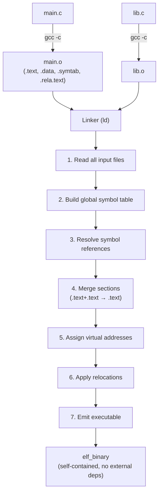
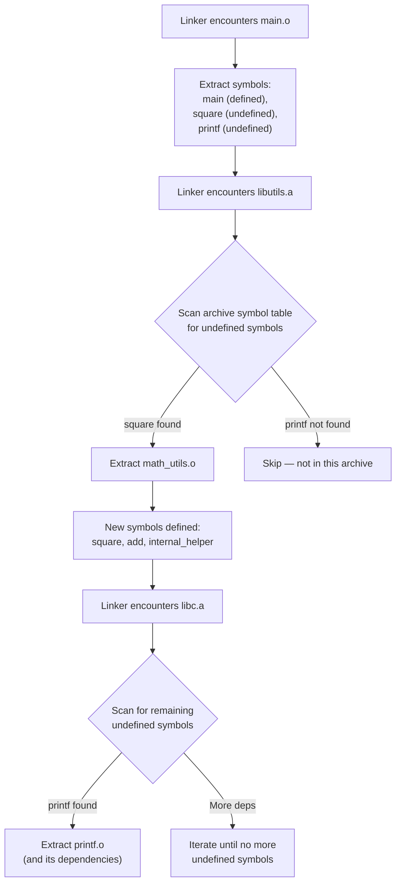
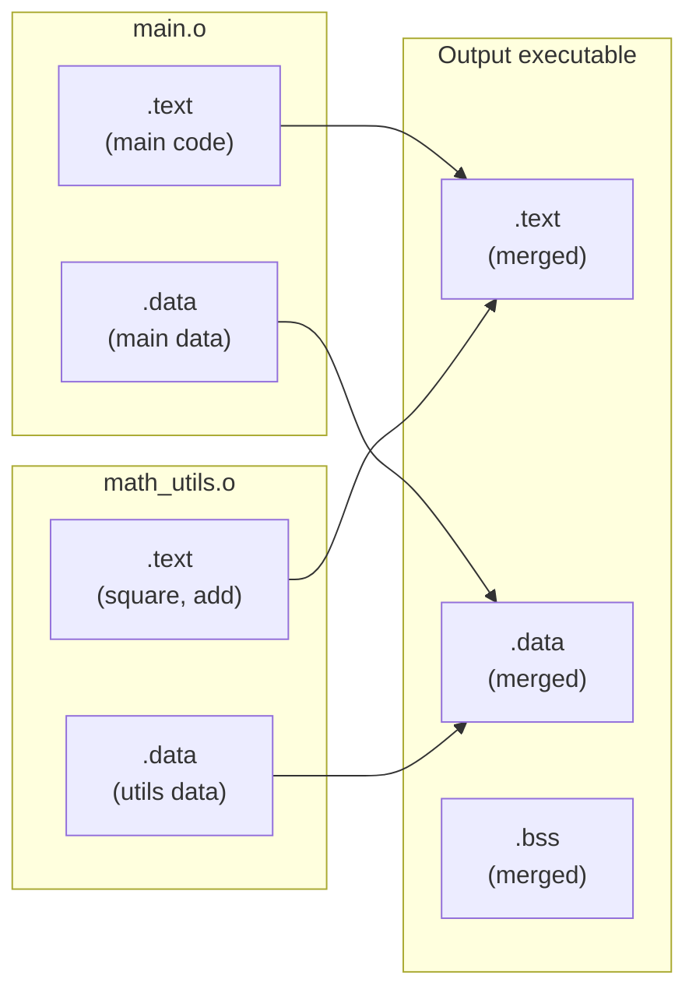

# Chapter 219: Static Linking

## 1. Intuition

Static linking is the process of combining multiple relocatable object files (`.o` files) and static libraries (`.a` archives) into a single executable binary. Unlike dynamic linking, where the resolution of symbols is deferred until runtime, static linking resolves **all** symbol references at **link time**, producing a self-contained binary that has no external dependencies (other than the kernel's system call interface).

Think of static linking as a book editor combining chapters from different authors into a single volume. Each author submits a manuscript (`.o` file) with cross-references like "see Chapter 5 for details." The editor (linker) resolves all these cross-references, assigns final page numbers, and produces the complete book. Once published, the reader doesn't need any other books to understand it.

The linker (`ld`, typically invoked through `gcc` or `clang`) performs several critical tasks:

1. **Symbol resolution** — matching each symbol reference to exactly one symbol definition
2. **Section merging** — combining `.text` sections from all inputs into one `.text` in the output
3. **Relocation** — patching addresses so that code and data reference the correct final locations
4. **Layout** — assigning virtual addresses to all sections and segments

### Historical Context

Static linking was the only linking method in early Unix systems. The `a.out` format was the original executable format, and even after ELF was adopted, static linking remained the default. Dynamic linking was added later to solve the problem of code duplication (multiple programs shipping their own copies of `libc`) and to enable shared library updates without recompilation. Today, most Linux distributions use dynamic linking by default, but static linking remains important for containers, embedded systems, and security-sensitive applications.

## 2. Architecture

### 2.1 The Linking Pipeline

```
                  +---------+
source.c -------> | compiler | ------> source.o (relocatable)
                  +---------+

                  +---------+
source2.c ------> | compiler | ------> source2.o
                  +---------+

                         |
                         v
               +-------------------+
source.o  ---> |                   |
source2.o ---> | linker (ld)       | ------> executable
libfoo.a  ---> |                   |
libc.a    ---> +-------------------+
```

### 2.2 Linker Input and Output

**Inputs:**
- Relocatable object files (`.o`) — from compiling individual source files
- Static archive libraries (`.a`) — collections of `.o` files
- Linker scripts (`.ld`) — control the linking process

**Output:**
- Executable (`ET_EXEC` or `ET_DYN` for PIE)
- Shared library (`ET_DYN`)
- Another relocatable object (`ET_REL`, with `ld -r`)

### 2.3 Link Order Matters

The order in which you specify inputs to the linker is significant. The linker processes files **left to right**, maintaining a set of:
- **Defined symbols** seen so far
- **Undefined symbols** that need resolution

When it encounters an archive (`.a`), it only extracts members that resolve currently-undefined symbols. If a library is listed before the object file that needs it, the symbols won't be extracted:

```bash
# WRONG — libc functions not found
gcc -lc main.o -o main

# CORRECT — object files first, then libraries
gcc main.o -lc -o main
```

To work around ordering issues, you can:
- Use `-Wl,--start-group ... --end-group` to allow circular dependencies
- List libraries multiple times
- Use `pkg-config --libs` which handles ordering

### 2.4 Symbol Resolution Rules

The linker follows specific rules when resolving symbols:

1. **Strong vs Weak symbols**: A strong definition always wins over a weak definition. Initialized globals are strong; uninitialized globals (common symbols) and `__attribute__((weak))` are weak.

2. **Multiple strong definitions**: If two object files define the same strong symbol, the linker emits an error ("multiple definition").

3. **One strong, multiple weak**: The strong definition wins. Weak definitions are used for default implementations that can be overridden.

4. **Multiple weak definitions**: The linker picks one (typically the first one encountered). This is fragile and should be avoided.

```c
// strong.c
int global_var = 42;           // Strong definition

// weak.c
__attribute__((weak)) int global_var = 0;  // Weak definition

// Result: strong.c's global_var wins
```

### 2.5 Common Symbols

Uninitialized global variables in C are "common symbols" — they don't get a section assignment until link time:

```c
// a.c
int common_var;  // Common symbol (tentative definition)

// b.c
int common_var;  // Also common — linker merges them
```

This is a legacy C behavior. Modern compilers with `-fno-common` (which is now the default in GCC 10+) treat these as strong definitions in `.bss`, which will cause multiple-definition errors. Use `extern` for declarations:

```c
// a.c
int common_var = 0;  // Definition

// b.c
extern int common_var;  // Declaration only
```

## 3. Kernel Implementation

### 3.1 How Static Executives Are Loaded

When you `execve()` a statically-linked ELF binary, the kernel loading process is simpler than for dynamically-linked ones:

1. No `PT_INTERP` segment exists (no dynamic linker path).
2. The kernel maps `PT_LOAD` segments directly into the process address space.
3. The entry point (`e_entry`) points directly to the program's `_start` symbol (or whatever the linker placed there).
4. The `_start` code (typically from `crt1.o` in glibc) calls `__libc_start_main`, which calls `main()`.

Since there's no dynamic linker, the `AT_BASE` auxiliary vector entry is not set, and there's no `PT_DYNAMIC` segment.

### 3.2 Static vs Dynamic Memory Footprint

Static binaries are larger because they embed all library code. A simple "Hello World" program:
- Dynamically linked: ~16KB (plus shared libc mapped at runtime)
- Statically linked: ~800KB+ (entire libc embedded)

The kernel handles both identically in terms of page mapping and execution. The difference is purely in file size and the absence of dynamic linking overhead.

## 4. Source Code References

- **GNU ld source**: `binutils-gdb/ld/ldmain.c` — linker main entry point
- **Symbol resolution**: `binutils-gdb/ld/ldlang.c` — language-independent linker operations
- **Archive handling**: `binutils-gdb/bfd/archive.c` — `.a` file parsing
- **ELF linker backend**: `binutils-gdb/ld/emultempl/elf.em` — ELF-specific emulation
- **Relocation processing**: `binutils-gdb/bfd/elf64-x86-64.c` — x86-64 relocation handling
- **LTO implementation**: `gcc/lto/lto.c` — GCC Link-Time Optimization
- **LLVM LTO**: `llvm/lib/LTO/LTO.cpp` — LLVM's LTO framework

## 5. Data Structures

### 5.1 Archive File Structure (`.a`)

An archive file starts with the magic string `!<arch>\n`, followed by members:

```
!<arch>\n
Member 1 header (60 bytes)
  Name:     16 bytes (space-padded, /-terminated)
  ModTime:  12 bytes
  OwnerID:  6 bytes
  GroupID:  6 bytes
  Mode:     8 bytes
  Size:     10 bytes
  End:      2 bytes (`\n`)
Member 1 data (padded to even byte boundary)
Member 2 header
Member 2 data
...
```

Special members:
- `/` — Symbol table (maps symbol names to member file offsets)
- `//` — Long name table (for filenames longer than 16 characters)

### 5.2 Symbol Table Entry in the Linker

The GNU linker maintains internal symbol structures:

```c
// Simplified from bfd/elf-bfd.h
typedef struct bfd_link_hash_entry {
    struct bfd_link_hash_entry *next;    // Hash chain
    const char *string;                  // Symbol name
    bfd_link_hash_type type;             // Symbol type
    union {
        struct bfd_link_hash_def {
            asection *section;           // Section containing definition
            bfd_vma value;               // Symbol value
        } def;
        struct bfd_link_hash_undef {
            struct bfd_link_hash_entry *next; // Undefined list
        } undef;
    } u;
    unsigned int non_ir_ref : 1;         // Referenced from non-IR
    unsigned int ref_regular : 1;        // Regular reference
    unsigned int def_regular : 1;        // Regular definition
    unsigned int ref_dynamic : 1;        // Dynamic reference
    unsigned int def_dynamic : 1;        // Dynamic definition
} bfd_link_hash_entry;
```

### 5.3 Linker Script Structure

Linker scripts control memory layout. The default script can be viewed with:
```bash
ld --verbose
```

Key sections of a linker script:

```ld
/* Simple linker script */
ENTRY(_start)

SECTIONS
{
    . = 0x400000;           /* Set location counter */

    .text : {
        *(.text)            /* All .text sections from all inputs */
        *(.text.*)
    }

    .rodata : {
        *(.rodata)
        *(.rodata.*)
    }

    .data : {
        *(.data)
        *(.data.*)
    }

    .bss : {
        *(.bss)
        *(.bss.*)
        *(COMMON)           /* Uninitialized globals */
    }

    /DISCARD/ : {
        *(.comment)         /* Discard these sections */
        *(.note.*)
    }
}
```

## 6. C/Assembly Examples

### 6.1 Multi-File Static Linking

**math_utils.c:**
```c
// math_utils.c — Provides utility functions
static int internal_helper(int x)
{
    return x * x;  // This symbol is LOCAL, won't be visible
}

int square(int x)
{
    return internal_helper(x);
}

int add(int a, int b)
{
    return a + b;
}
```

**string_utils.c:**
```c
// string_utils.c — String utilities
#include <string.h>

int count_char(const char *s, char c)
{
    int count = 0;
    while (*s) {
        if (*s == c) count++;
        s++;
    }
    return count;
}
```

**main.c:**
```c
// main.c — Uses both utility libraries
#include <stdio.h>

// External declarations
extern int square(int x);
extern int add(int a, int b);
extern int count_char(const char *s, char c);

int main(void)
{
    printf("square(5) = %d\n", square(5));
    printf("add(3, 4) = %d\n", add(3, 4));
    printf("count_char(\"hello world\", 'l') = %d\n",
           count_char("hello world", 'l'));
    return 0;
}
```

Build and link statically:
```bash
# Compile each file separately
gcc -c -o math_utils.o math_utils.c
gcc -c -o string_utils.o string_utils.c
gcc -c -o main.o main.c

# Link statically
gcc -static -o program main.o math_utils.o string_utils.o

# Or use the linker directly:
ld -static -o program \
   /usr/lib/x86_64-linux-gnu/crt1.o \
   /usr/lib/x86_64-linux-gnu/crti.o \
   main.o math_utils.o string_utils.o \
   -lc \
   /usr/lib/x86_64-linux-gnu/crtn.o \
   -L/usr/lib/x86_64-linux-gnu \
   -dynamic-linker /lib64/ld-linux-x86-64.so.2
```

### 6.2 Creating Static Archives

```bash
# Create a static library
ar rcs libutils.a math_utils.o string_utils.o

# List archive members
ar t libutils.a
# math_utils.o
# string_utils.o

# Show the archive symbol table (ranlib index)
nm libutils.a
# math_utils.o:
# 0000000000000000 T add
# 0000000000000010 T square
# 0000000000000000 t internal_helper
#
# string_utils.o:
# 0000000000000000 T count_char

# Link against the archive
gcc -o program main.o -L. -lutils

# Or with explicit path:
gcc -o program main.o libutils.a
```

### 6.3 Controlling Archive Extraction

```bash
# Problem: library listed before object that needs it
gcc -L. -lutils main.o -o program
# undefined reference to 'square'

# Solution 1: Reorder
gcc main.o -L. -lutils -o program

# Solution 2: Use --start-group for circular dependencies
gcc -Wl,--start-group main.o libutils.a -Wl,--end-group -o program

# Solution 3: Use --whole-archive to force all members in
gcc -Wl,--whole-archive libutils.a -Wl,--no-whole-archive -o program
```

### 6.4 Linker Script Example

```ld
/* custom.ld — Custom memory layout */
OUTPUT_FORMAT("elf64-x86-64")
OUTPUT_ARCH(i386:x86-64)
ENTRY(_start)

MEMORY
{
    code (rx)  : ORIGIN = 0x400000, LENGTH = 2M
    data (rw)  : ORIGIN = 0x600000, LENGTH = 1M
    stack (rw) : ORIGIN = 0x800000, LENGTH = 4K
}

SECTIONS
{
    /* Code region */
    .text : {
        *(.text.startup)
        *(.text)
        *(.text.*)
    } > code

    .rodata : {
        *(.rodata)
        *(.rodata.*)
    } > code

    /* Data region */
    .data : {
        *(.data)
        *(.data.*)
    } > data

    .bss : {
        *(.bss)
        *(.bss.*)
        *(COMMON)
    } > data

    /* Stack pointer initialization */
    .stack : {
        . = ALIGN(16);
        . = . + 4096;
        _stack_top = .;
    } > stack
}
```

Use it:
```bash
gcc -c -o main.o main.c
ld -T custom.ld -o program main.o -lc
```

### 6.5 LTO (Link-Time Optimization) Example

```bash
# Compile with LTO — emits GIMPLE/IR instead of machine code
gcc -flto -O2 -c math_utils.c -o math_utils.o
gcc -flto -O2 -c string_utils.c -o string_utils.o
gcc -flto -O2 -c main.c -o main.o

# Link with LTO — linker invokes the compiler backend
gcc -flto -O2 -o program main.o math_utils.o string_utils.o

# The linker can now:
# 1. Inline cross-file functions
# 2. Remove unused functions across all translation units
# 3. Perform whole-program optimization
```

With LTO, the `.o` files contain both LLVM IR (or GCC GIMPLE) and regular object code. At link time, the linker plugin re-reads the IR and performs whole-program optimization before generating final machine code.

### 6.6 Garbage-Collecting Unused Sections

```bash
# Compile with -ffunction-sections and -fdata-sections
gcc -ffunction-sections -fdata-sections -c math_utils.c -o math_utils.o

# Each function now gets its own section:
# .text.square, .text.add, .text.internal_helper

# Link with --gc-sections to remove unused sections
gcc -Wl,--gc-sections -o program main.o math_utils.o

# If main() only calls square() and add(), internal_helper
# may be removed (if not called by square — it is, so keep it)

# Verify with:
nm program | grep internal_helper
```

### 6.7 Examining the Linking Process with --print-map

You can ask the linker to produce a map file showing where every symbol ended up:

```bash
# Generate a linker map
ld -Map=output.map -o program main.o math_utils.o string_utils.o -lc

# Or with gcc:
gcc -Wl,-Map=output.map -o program main.o -lc

# The map file shows:
# - Memory configuration (MEMORY regions from linker script)
# - Linker script commands executed
# - Each archive member loaded and why
# - Symbol assignments with final addresses
# - Cross-reference tables
```

The map file is invaluable for understanding why a particular symbol was included or excluded, and for debugging memory layout issues in embedded systems.

## 7. Diagrams

### 7.1 Static Linking Process



### 7.2 Archive Extraction Logic



### 7.3 Section Merging



## 8. Common Pitfalls

### 8.1 Link Order Issues

The most common static linking error is "undefined reference" caused by incorrect library ordering:

```bash
# WRONG: -lfoo listed before main.o
gcc -lfoo main.o -o main  # "undefined reference to 'foo_func'"

# CORRECT: objects first, then libraries
gcc main.o -lfoo -o main
```

**Why?** The linker only pulls in archive members that resolve currently-undefined symbols. If no undefined symbols exist when it reads the archive, it pulls in nothing.

### 8.2 Multiple Definitions

If two `.o` files define the same global symbol, the linker emits a "multiple definition" error. The old C behavior of "tentative definitions" (common symbols) can mask this:

```c
// a.c
int x = 10;  // Strong definition

// b.c
int x = 20;  // Strong definition → linker error!
```

Use `static` for file-local symbols, or `extern` for declarations:

```c
// b.c
extern int x;  // Declaration, not definition
```

### 8.3 Static Linking and NSS

Glibc's Name Service Switch (NSS) relies on dynamic loading for some backends (e.g., `libnss_files.so`). Statically linked programs may not resolve hostnames or look up users correctly unless the relevant NSS modules are compiled in.

### 8.4 Static Linking and Threads

When linking statically with pthreads, you must explicitly link with `-lpthread`. Unlike dynamic linking where `libc.so` has weak references, static linking requires explicit specification.

### 8.5 Large Static Binaries

Statically linking with glibc produces large binaries (800KB+ for "Hello World"). Consider using `musl-libc` for smaller static binaries:

```bash
# With musl
musl-gcc -static -o hello hello.c  # ~30KB for "Hello World"
```

### 8.6 Symbol Interposition

In static linking, there's no symbol interposition (the dynamic linker's ability to override symbols). This means `LD_PRELOAD` and `dlsym(RTLD_NEXT, ...)` won't work with statically linked binaries.

## 9. Best Practices

### 9.1 When to Use Static Linking

- **Containers and minimal environments**: No dependency on shared libraries in the filesystem
- **Embedded systems**: Predictable runtime environment
- **Security-sensitive applications**: No risk of library replacement attacks
- **Reproducible builds**: No variation from different library versions
- **Go/Rust default**: These languages prefer static linking by default

### 9.2 Use `-ffunction-sections` and `-fdata-sections`

When building static libraries, compile with these flags and link with `-Wl,--gc-sections` to remove unused code. This significantly reduces binary size:

```bash
CFLAGS="-ffunction-sections -fdata-sections"
LDFLAGS="-Wl,--gc-sections"
```

### 9.3 Use LTO for Cross-File Optimization

LTO enables the linker to inline functions across translation units and remove dead code globally. The compile-time overhead is worth it for release builds:

```bash
gcc -flto -O2 -c file.c    # Compile
gcc -flto -O2 -o prog *.o  # Link
```

### 9.4 Use Linker Scripts for Embedded

For embedded systems, custom linker scripts give precise control over memory layout. Define memory regions for flash, RAM, and special peripherals.

### 9.5 Consider musl-libc for Static Builds

Glibc is not well-suited for static linking due to NSS, iconv plugin loading, and size. Use musl-libc instead:

```bash
# Install musl-tools
apt install musl-tools

# Build
musl-gcc -static -o prog prog.c
```

### 9.6 Use `--as-needed` to Avoid Unnecessary Linking

```bash
gcc -Wl,--as-needed -o prog main.o -lfoo -lbar
```

This prevents the output from having `DT_NEEDED` entries for libraries that aren't actually used, reducing startup time and binary size.

## 10. Exercises

### Exercise 1: Multi-File Project
Create a project with 4 source files (a calculator library with `add.c`, `sub.c`, `mul.c`, and a `main.c`). Compile each to `.o`, create a static archive `libcalc.a`, and link the final executable. Verify with `nm` that only used functions appear.

### Exercise 2: Link Order Investigation
Create a program that depends on `libm.a` (math library). Demonstrate the link order problem by placing `-lm` before the object file. Then fix it. Document the error messages.

### Exercise 3: Custom Linker Script
Write a linker script that places `.text` at address `0x1000000`, `.data` at `0x2000000`, and `.bss` at `0x3000000`. Compile a simple program with this script and verify the addresses with `readelf`.

### Exercise 4: LTO Comparison
Compile the same multi-file project with and without LTO. Compare:
- Binary size (`size` command)
- Whether cross-file inlining occurred (check with `objdump -d`)
- Build time

### Exercise 5: Static vs Dynamic Size Analysis
Build the same "Hello World" program both statically and dynamically linked. Use `readelf -l` to compare the number and sizes of `PT_LOAD` segments. Use `size` to compare section sizes.

### Exercise 6: Archive Symbol Table
Write a script that extracts the symbol table from a `.a` file using `nm` and creates a summary showing which symbols each member defines and which it leaves undefined.

## 11. References

1. **"Linkers and Loaders" by John R. Levine** — Comprehensive coverage of linking theory and practice
2. **System V ABI** — https://www.sco.com/developers/gabi/latest/contents.html
3. **GNU ld manual** — https://sourceware.org/binutils/docs/ld/
4. **GNU ar manual** — https://sourceware.org/binutils/docs/ar/
5. **LLVM LTO design** — https://llvm.org/docs/LinkTimeOptimization.html
6. **GCC LTO documentation** — https://gcc.gnu.org/onlinedocs/gccint/LTO.html
7. **musl-libc** — https://musl.libc.org/
8. **"Static Linking Considered Harmful"** — https://wiki.musl-libc.org/faq.html (musl FAQ on static linking tradeoffs)
9. **Linux kernel `fs/binfmt_elf.c`** — ELF binary format handler
10. **`ld --verbose` output** — The default linker script for your platform
