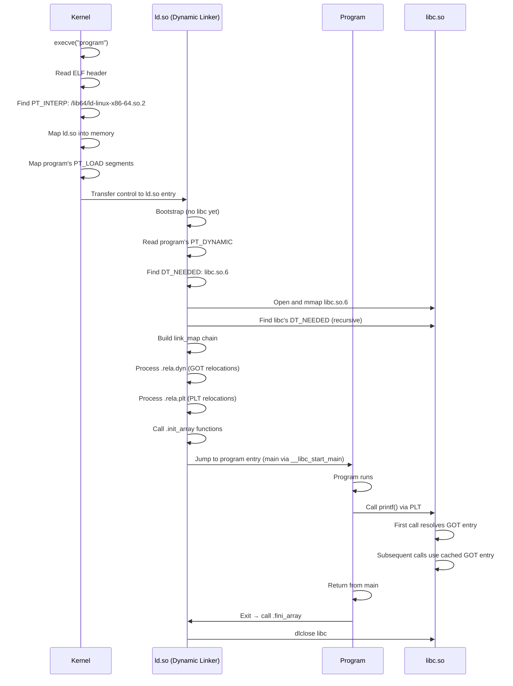
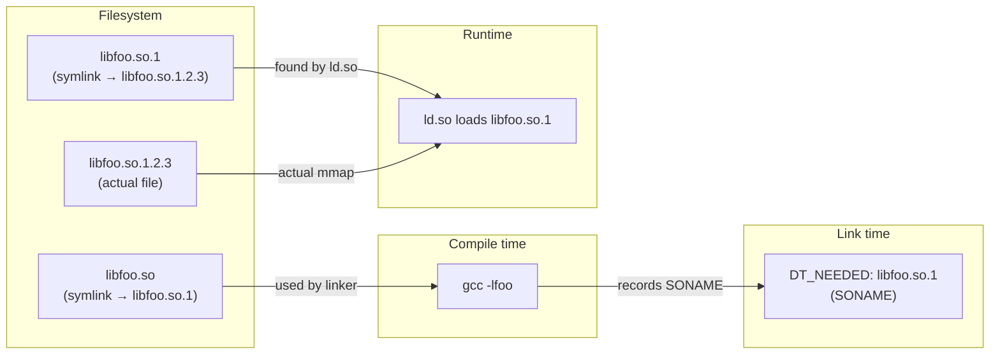
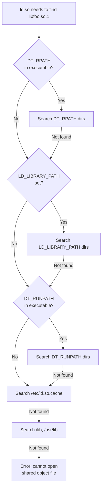

# Chapter 220: Dynamic Linking

## 1. Intuition

Dynamic linking is the mechanism by which symbol references in an executable or shared library are resolved **at runtime** by the dynamic linker (`ld.so`), rather than at compile or link time. This allows multiple programs to share a single copy of library code in memory, reduces disk usage, and enables libraries to be updated independently of the programs that use them.

Imagine a city where every household needs electricity. **Static linking** is like each house having its own generator — self-contained but wasteful. **Dynamic linking** is like connecting to a shared power grid — efficient, updatable, but dependent on the grid being available.

The dynamic linking process involves several players:
- **The compiler** generates position-independent code and external references
- **The static linker** (`ld`) produces the executable with dynamic relocation entries and a `PT_DYNAMIC` segment
- **The dynamic linker** (`ld.so`) loads shared libraries, resolves symbols, and applies relocations at runtime
- **The shared libraries** (`.so` files) provide the actual code and data

### The Bootstrapping Problem

The dynamic linker itself is a shared library (`ld-linux-x86-64.so.2`), but it also needs to be loaded. The kernel solves this chicken-and-egg problem: when it sees a `PT_INTERP` segment, it loads the interpreter (dynamic linker) first, maps it into memory, and transfers control to its entry point. The dynamic linker then loads everything else, including `libc.so`.

## 2. Architecture

### 2.1 The Dynamic Linking Pipeline

```
Source code
    |
    v
Compiler (gcc -c -fPIC)
    |
    v
Object file (.o) with relocations
    |
    v
Static linker (ld / gcc)
    |
    v
Executable with:
  - PT_INTERP (path to ld.so)
  - PT_DYNAMIC (dynamic section)
  - DT_NEEDED entries
  - .got, .plt sections
  - .rela.dyn, .rela.plt sections
    |
    v
Kernel execve()
    |
    v
Kernel loads ld.so (from PT_INTERP)
    |
    v
ld.so reads PT_DYNAMIC
    |
    v
ld.so loads DT_NEEDED libraries (recursively)
    |
    v
ld.so resolves symbols and applies relocations
    |
    v
Control transferred to program entry point
```

### 2.2 Shared Library Search Order

When the dynamic linker needs to find a shared library, it searches in this order:

1. `DT_RPATH` in the executable (deprecated)
2. `LD_LIBRARY_PATH` environment variable
3. `DT_RUNPATH` in the executable
4. `/etc/ld.so.cache` (compiled from `/etc/ld.so.conf`)
5. `/lib` and `/usr/lib` (default fallback)

### 2.3 DT_NEEDED Chain

Each ELF file has a list of `DT_NEEDED` entries in its `.dynamic` section, specifying which shared libraries it depends on. The dynamic linker follows this chain recursively:

```
program
├── DT_NEEDED: libc.so.6
│   ├── DT_NEEDED: ld-linux-x86-64.so.2
│   └── DT_NEEDED: libm.so.6 (if used)
├── DT_NEEDED: libpthread.so.0
│   └── DT_NEEDED: libc.so.6 (already loaded)
└── DT_NEEDED: libfoo.so.1
    └── DT_NEEDED: libc.so.6 (already loaded)
```

Each library is loaded only once. If multiple `DT_NEEDED` entries reference the same SONAME, the library is loaded once and shared.

## 3. Kernel Implementation

### 3.1 Kernel ELF Loader and Dynamic Linking

The kernel's role in dynamic linking is limited but critical:

**Key source file:** `fs/binfmt_elf.c`

```c
// Simplified from load_elf_binary()
static int load_elf_binary(struct linux_binprm *bprm)
{
    // ... (validation, header reading) ...

    // Check for PT_INTERP
    for (i = 0; i < elf_ex->e_phnum; i++) {
        struct elf_phdr *eppnt = elf_phdata + i;
        if (eppnt->p_type == PT_INTERP) {
            // Read the interpreter path
            char *elf_interpreter = kmalloc(eppnt->p_filesz + 1, GFP_KERNEL);
            elf_read(bprm->file, eppnt->p_offset, elf_interpreter, eppnt->p_filesz);

            // Open and load the interpreter (ld.so)
            interpreter = open_exec(elf_interpreter);
            // ... load interpreter ELF ...
        }
    }

    // Map PT_LOAD segments of the executable
    for (i = 0; i < elf_ex->e_phnum; i++) {
        if (elf_ppnt->p_type == PT_LOAD) {
            elf_map(bprm->file, load_bias + elf_ppnt->p_vaddr,
                    elf_ppnt, elf_prot, elf_flags, total_size);
        }
    }

    // Set up auxiliary vector for the dynamic linker
    NEW_AUX_ENT(AT_PHDR, load_bias + exec->e_phoff);
    NEW_AUX_ENT(AT_PHNUM, exec->e_phnum);
    NEW_AUX_ENT(AT_ENTRY, exec->e_entry);
    NEW_AUX_ENT(AT_BASE, interp_load_addr);  // Base address of ld.so
    NEW_AUX_ENT(AT_FLAGS, 0);
    NEW_AUX_ENT(AT_PAGESZ, PAGE_SIZE);

    // If dynamic linker exists, jump to it; otherwise jump to executable entry
    if (interpreter)
        elf_entry = interp_load_addr + elf_entry_of_interpreter;
    else
        elf_entry = exec->e_entry;

    start_thread(regs, elf_entry, bprm->p);
}
```

### 3.2 The Auxiliary Vector

The kernel passes the following to the dynamic linker via the auxiliary vector:

| Entry | Purpose |
|-------|---------|
| `AT_PHDR` | Program headers of the executable in memory |
| `AT_PHENT` | Size of one program header entry |
| `AT_PHNUM` | Number of program headers |
| `AT_BASE` | Load address of the dynamic linker |
| `AT_ENTRY` | Entry point of the executable |
| `AT_PAGESZ` | System page size (usually 4096) |
| `AT_HWCAP` | CPU feature flags |
| `AT_SYSINFO_EHDR` | Address of vDSO ELF header |

## 4. Source Code References

### 4.1 glibc Dynamic Linker

The glibc dynamic linker is the most important implementation:

- **`elf/rtld.c`** — Main dynamic linker entry point (`_dl_start`, `_dl_start_final`)
- **`elf/dl-load.c`** — Shared library loading (`_dl_map_object`, `open_path`)
- **`elf/dl-reloc.c`** — Relocation processing (`_dl_relocate_object`)
- **`elf/dl-lookup.c`** — Symbol lookup (`_dl_lookup_symbol_x`)
- **`elf/dl-fini.c`** — Library finalization
- **`elf/dl-deps.c`** — Dependency resolution (`_dl_map_object_deps`)
- **`elf/dl-cache.c`** — `/etc/ld.so.cache` handling
- **`elf/dl-version.c`** — Symbol versioning
- **`elf/dynamic-link.h`** — Dynamic relocation macros
- **`elf/get-dynamic-info.h`** — Parsing the `.dynamic` section

### 4.2 musl Dynamic Linker

musl's dynamic linker is simpler and more readable:

- **`ldso/dynlink.c`** — Entire dynamic linker in ~2500 lines
- Known for clean, understandable code; good for learning

### 4.3 Key Data Structures

```c
// From glibc: sysdeps/generic/ldsodefs.h

struct link_map {
    Elf64_Addr l_addr;        // Base address where library is loaded
    char *l_name;             // Absolute file name
    Elf64_Dyn *l_ld;          // Dynamic section pointer
    struct link_map *l_next;   // Next in chain
    struct link_map *l_prev;   // Previous in chain
    // ... many more fields ...
};

struct link_map_chain {
    struct link_map *head;
    struct link_map *tail;
};
```

## 5. Data Structures

### 5.1 The `.dynamic` Section

The `.dynamic` section is an array of `Elf64_Dyn` entries:

```c
typedef struct {
    Elf64_Sxword d_tag;    // Type of entry
    union {
        Elf64_Xword d_val; // Integer value
        Elf64_Addr d_ptr;  // Virtual address
    } d_un;
} Elf64_Dyn;
```

**Common `d_tag` values:**

| Tag | Value | d_un | Description |
|-----|-------|------|-------------|
| `DT_NEEDED` | 1 | d_val | Index into `.dynstr` for a required library name |
| `DT_PLTRELSZ` | 2 | d_val | Size of PLT relocation entries |
| `DT_PLTGOT` | 3 | d_ptr | Address of the PLT/GOT |
| `DT_HASH` | 4 | d_ptr | Address of symbol hash table |
| `DT_STRTAB` | 5 | d_ptr | Address of `.dynstr` (string table) |
| `DT_SYMTAB` | 6 | d_ptr | Address of `.dynsym` (symbol table) |
| `DT_RELA` | 7 | d_ptr | Address of `.rela.dyn` |
| `DT_RELASZ` | 8 | d_val | Size of `.rela.dyn` |
| `DT_STRSZ` | 10 | d_val | Size of `.dynstr` |
| `DT_SYMENT` | 11 | d_val | Size of one `.dynsym` entry |
| `DT_SONAME` | 14 | d_val | Index into `.dynstr` for the library's SONAME |
| `DT_RPATH` | 15 | d_val | Library search path (deprecated) |
| `DT_SYMBOLIC` | 16 | — | Symbolic binding (deprecated) |
| `DT_REL` | 17 | d_ptr | Address of `.rel.dyn` |
| `DT_INIT` | 12 | d_ptr | Address of initialization function |
| `DT_FINI` | 13 | d_ptr | Address of finalization function |
| `DT_RUNPATH` | 29 | d_val | Library search path (preferred over DT_RPATH) |
| `DT_FLAGS` | 30 | d_val | Flag bits |
| `DT_PREINIT_ARRAY` | 32 | d_ptr | Pre-initialization array |
| `DT_INIT_ARRAY` | 25 | d_ptr | Initialization function array |
| `DT_FINI_ARRAY` | 26 | d_ptr | Finalization function array |
| `DT_FLAGS_1` | 0x6ffffffb | d_val | Additional flags |

### 5.2 SONAME Versioning

The SONAME (Shared Object Name) is a versioned name for a shared library:

```
libfoo.so → libfoo.so.1 → libfoo.so.1.2.3
```

- `libfoo.so` — Development symlink (for `-lfoo` at compile time)
- `libfoo.so.1` — SONAME (embedded in the library, recorded in executables as `DT_NEEDED`)
- `libfoo.so.1.2.3` — Real file (actual library with full version)

This scheme provides:
- **Binary compatibility**: Programs link against SONAME (`.so.1`), not the full version
- **Independent updates**: You can install `libfoo.so.1.3.0` alongside `libfoo.so.1.2.3`
- **Major version changes**: When ABI breaks, bump to `.so.2` (old programs still use `.so.1`)

```bash
# Create a versioned shared library
gcc -shared -fPIC -Wl,-soname,libfoo.so.1 -o libfoo.so.1.2.3 foo.c

# Create symlinks
ln -s libfoo.so.1.2.3 libfoo.so.1
ln -s libfoo.so.1 libfoo.so
```

### 5.3 Symbol Versioning

ELF symbol versioning allows a single shared library to export multiple versions of the same symbol:

```c
// version.map
GLIBC_2.2.5 {
    global:
        pthread_create;
};

GLIBC_2.3.2 {
    global:
        pthread_create;  /* New version */
} GLIBC_2.2.5;          /* Inherits from GLIBC_2.2.5 */
```

The `.gnu.version` (`SHT_GNU_versym`) section contains a version index for each symbol in `.dynsym`. The `.gnu.version_d` section defines version definitions, and `.gnu.version_r` contains version requirements.

```bash
# View symbol versions
objdump -T /lib/x86_64-linux-gnu/libc.so.6 | grep malloc
# 000000000009a060 g    DF .text  00000000000001c0  GLIBC_2.2.5 malloc
```

## 6. C/Assembly Examples

### 6.1 Creating a Shared Library

**libmath_custom.c:**
```c
// libmath_custom.c — A simple shared library
#include <math.h>

double custom_sqrt(double x)
{
    // Use Newton's method for demonstration
    if (x < 0) return -1.0;
    if (x == 0) return 0.0;

    double guess = x / 2.0;
    for (int i = 0; i < 100; i++) {
        guess = (guess + x / guess) / 2.0;
    }
    return guess;
}

double custom_pow(double base, int exp)
{
    double result = 1.0;
    for (int i = 0; i < exp; i++) {
        result *= base;
    }
    return result;
}

// Version information
const char *lib_version = "1.2.3";
```

Build the shared library:
```bash
# Step 1: Compile with PIC
gcc -fPIC -c libmath_custom.c -o libmath_custom.o

# Step 2: Create shared library with SONAME
gcc -shared -Wl,-soname,libmath_custom.so.1 \
    -o libmath_custom.so.1.2.3 libmath_custom.o

# Step 3: Create symlinks
ln -sf libmath_custom.so.1.2.3 libmath_custom.so.1
ln -sf libmath_custom.so.1 libmath_custom.so

# Step 4: Verify
readelf -d libmath_custom.so.1.2.3 | grep SONAME
# 0x000000000000000e (SONAME) Library soname: [libmath_custom.so.1]
```

### 6.2 Linking Against a Shared Library

**main.c:**
```c
#include <stdio.h>

// These symbols are defined in libmath_custom.so
extern double custom_sqrt(double x);
extern double custom_pow(double base, int exp);
extern const char *lib_version;

int main(void)
{
    printf("Library version: %s\n", lib_version);
    printf("sqrt(144) = %.2f\n", custom_sqrt(144.0));
    printf("2^10 = %.0f\n", custom_pow(2.0, 10));
    return 0;
}
```

Build and run:
```bash
# Compile and link
gcc -o main main.c -L. -lmath_custom -Wl,-rpath,./

# Or use LD_LIBRARY_PATH at runtime
gcc -o main main.c -L. -lmath_custom
LD_LIBRARY_PATH=. ./main

# Verify dynamic dependencies
ldd main
# linux-vdso.so.1 => (0x00007ffd...)
# libmath_custom.so.1 => ./libmath_custom.so.1 (0x00007f...)
# libc.so.6 => /lib/x86_64-linux-gnu/libc.so.6 (0x00007f...)
# /lib64/ld-linux-x86-64.so.2 (0x00007f...)
```

### 6.3 Inspecting Dynamic Linking

```bash
# Show dynamic dependencies
ldd /usr/bin/ls

# Show dynamic section
readelf -d /usr/bin/ls

# Show DT_NEEDED entries
readelf -d /usr/bin/ls | grep NEEDED

# Trace dynamic linking at runtime
LD_DEBUG=all ./main 2>&1 | head -50
# Shows: file loading, symbol lookup, relocation, init calls

# Specific debug categories
LD_DEBUG=libs ./main       # Library search and loading
LD_DEBUG=symbols ./main    # Symbol resolution
LD_DEBUG=reloc ./main      # Relocations
LD_DEBUG=bindings ./main   # Symbol bindings
LD_DEBUG=init ./main       # Initialization/finalization
```

### 6.4 Using dlopen/dlsym

```c
// dynload.c — Dynamic loading at runtime
#include <stdio.h>
#include <dlfcn.h>

int main(void)
{
    // Load the shared library
    void *handle = dlopen("./libmath_custom.so.1", RTLD_LAZY);
    if (!handle) {
        fprintf(stderr, "dlopen: %s\n", dlerror());
        return 1;
    }

    // Look up a symbol
    typedef double (*sqrt_func)(double);
    sqrt_func my_sqrt = (sqrt_func)dlsym(handle, "custom_sqrt");

    char *error = dlerror();
    if (error) {
        fprintf(stderr, "dlsym: %s\n", error);
        dlclose(handle);
        return 1;
    }

    printf("sqrt(256) = %.2f\n", my_sqrt(256.0));

    // Look up a data symbol
    const char **version = (const char **)dlsym(handle, "lib_version");
    if (!version) {
        fprintf(stderr, "dlsym: %s\n", dlerror());
    } else {
        printf("Version: %s\n", *version);
    }

    dlclose(handle);
    return 0;
}
```

```bash
gcc -o dynload dynload.c -ldl
./dynload
```

### 6.5 Symbol Visibility Control

```c
// visibility.c — Controlling symbol visibility
__attribute__((visibility("default")))
int public_function(void) {
    return 42;
}

__attribute__((visibility("hidden")))
int internal_function(void) {
    return 100;
}

// Compile with:
// gcc -fvisibility=hidden -fPIC -shared -o libvis.so visibility.c
// This makes all symbols hidden by default, only public_function is exported
```

```bash
# Verify symbol visibility
nm -D libvis.so
# Shows only public_function

readelf --dyn-syms libvis.so
# Shows only public_function with GLOBAL visibility
```

## 7. Diagrams

### 7.1 Dynamic Linking Runtime Process



### 7.2 SONAME and Symlink Structure



### 7.3 Shared Library Search Path



## 8. Common Pitfalls

### 8.1 LD_LIBRARY_PATH in Production

`LD_LIBRARY_PATH` overrides the normal search order, which can cause:
- Loading wrong library versions (security risk)
- Works on developer's machine, fails in production
- Can be exploited for privilege escalation in setuid binaries (glibc ignores it for setuid)

**Better alternatives:** Use `DT_RUNPATH` (via `-Wl,-rpath,$ORIGIN`) or install libraries to standard paths.

### 8.2 Missing SONAME

If you create a shared library without `-Wl,-soname,libfoo.so.1`, the executable won't record a `DT_NEEDED` for the SONAME. Instead, it records the name used at link time (e.g., `libfoo.so`). This breaks when you version the library.

### 8.3 Symbol Version Mismatch

If a program was compiled against `libfoo.so.1.2` (with symbol version `FOO_1.2`) but you install `libfoo.so.1.0` (with only `FOO_1.0`), the dynamic linker will refuse to load it because the required version isn't available.

### 8.4 ABI Breakage Without SONAME Bump

If you change the ABI (e.g., change a struct layout) without bumping the SONAME (from `.so.1` to `.so.2`), existing programs will silently corrupt data or crash. **Always bump the SONAME when the ABI changes.**

### 8.5 Forgetting -fPIC

Shared libraries **must** be compiled with `-fPIC`. On x86-64, position-independent code is the default, but on x86-32 and some other architectures, forgetting `-fPIC` produces text relocations that the dynamic linker must process, which:
- Slows down loading
- Prevents sharing the `.text` page between processes
- May be forbidden by security-hardened systems

### 8.6 Circular DT_NEEDED

If library A depends on B and B depends on A, the dynamic linker handles this correctly (it loads each library only once). But it processes them in a specific order, and initialization functions are called in dependency order, which can cause issues if both libraries expect the other to be initialized first.

## 9. Best Practices

### 9.1 Use Versioned SONAMEs

Always include a SONAME with major version:
```bash
gcc -shared -Wl,-soname,libfoo.so.1 -o libfoo.so.1.0.0 foo.c
```

### 9.2 Use Symbol Visibility

Compile with `-fvisibility=hidden` and explicitly export only the public API:
```c
__attribute__((visibility("default"))) int public_api(void);
```

This reduces the symbol table size, improves load time, and prevents accidental symbol conflicts.

### 9.3 Use DT_RUNPATH with $ORIGIN

For relocatable installations, embed a relative library path:
```bash
gcc -Wl,-rpath,'$ORIGIN/../lib' -o program main.c -lfoo
```

`$ORIGIN` is replaced at runtime with the directory containing the executable.

### 9.4 Use ldconfig for System Libraries

After installing shared libraries to non-standard paths:
```bash
echo "/opt/mylib/lib" > /etc/ld.so.conf.d/mylib.conf
ldconfig
```

This rebuilds `/etc/ld.so.cache` for fast library lookup.

### 9.5 Use LD_DEBUG for Troubleshooting

```bash
LD_DEBUG=libs ./program          # Library loading
LD_DEBUG=symbols ./program       # Symbol resolution
LD_DEBUG=all ./program 2>&1      # Everything (very verbose)
```

### 9.6 Separate Development and Runtime Packages

- Development package: `libfoo.so` symlink + headers + `pkg-config` file
- Runtime package: `libfoo.so.1` symlink + `libfoo.so.1.2.3` actual file

## 10. Exercises

### Exercise 1: Create and Use a Shared Library
Write a shared library `libstring_ops.so` with functions `string_reverse()` and `string_count_words()`. Create a test program that links against it. Verify with `ldd` and `readelf -d`.

### Exercise 2: Symbol Visibility
Create a shared library with 5 functions, but only export 2 of them using `__attribute__((visibility(...)))`. Compile with `-fvisibility=hidden` and verify with `nm -D`.

### Exercise 3: Library Versioning
Create `libfoo.so.1.0.0` with function `foo_v1()`. Then create `libfoo.so.1.1.0` that adds `foo_v2()` while keeping `foo_v1()`. Show that a program compiled against the older version works with the newer one.

### Exercise 4: dlopen Plugin System
Write a program that dynamically loads plugins from a `plugins/` directory using `dlopen()` and `dlsym()`. Each plugin should export a `plugin_init()` function. Demonstrate adding a new plugin without recompiling the main program.

### Exercise 5: LD_DEBUG Analysis
Use `LD_DEBUG=all` on a simple program and trace:
- The order libraries are loaded
- How symbols are resolved (first definition wins)
- When `.init` and `.init_array` functions are called

### Exercise 6: Symbol Conflict Resolution
Create two shared libraries (`libA.so` and `libB.so`) that both define a function called `process()`. Write a program that links against both. Use `LD_DEBUG=bindings` to show which `process()` is called and explain why.

## 11. References

1. **glibc dynamic linker source:**
   - `elf/rtld.c` — Main dynamic linker
   - `elf/dl-load.c` — Library loading
   - `elf/dl-lookup.c` — Symbol resolution
   - `elf/dl-reloc.c` — Relocation processing

2. **musl dynamic linker:**
   - `ldso/dynlink.c` — Clean, readable implementation

3. **"How to Write Shared Libraries" by Ulrich Drepper:**
   - https://www.akkadia.org/drepper/dsohowto.pdf

4. **System V ABI:**
   - https://www.sco.com/developers/gabi/latest/contents.html

5. **Linux man pages:**
   - `man 8 ld.so` — Dynamic linker documentation
   - `man 3 dlopen` — Dynamic loading API
   - `man 1 ldd` — List dynamic dependencies
   - `man 8 ldconfig` — Configure dynamic linker run-time bindings

6. **"Learning Linux Binary Analysis" by Ryan O'Neill** — ELF internals

7. **Solaris Linker and Libraries Guide:**
   - https://docs.oracle.com/cd/E88353_01/html/E37839/ — Comprehensive linking documentation
