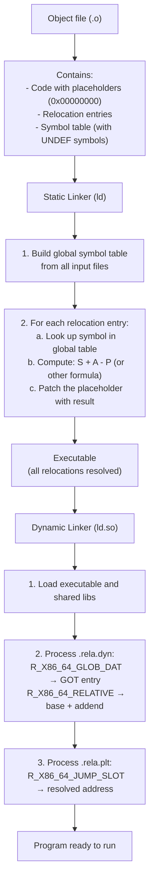
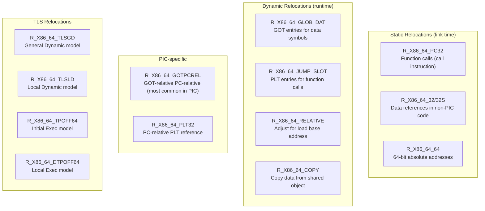
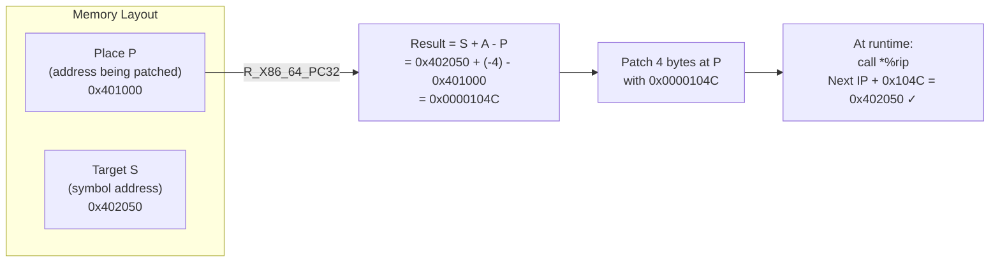

# Chapter 221: Relocations

## 1. Intuition

A **relocation** is a patch that the linker applies to a binary to make symbolic references point to the correct addresses. When the compiler generates code that calls a function or accesses a variable, it often doesn't know the final address of that symbol. Instead, it leaves a placeholder and generates a **relocation entry** that says: "At offset X in section Y, write the address of symbol Z (with adjustment S)."

Think of relocation entries as forwarding addresses. When you move to a new house, you leave a forwarding address at the post office. The post office (linker) takes every piece of mail (reference) and stamps the correct new address on it. The relocation entries are the forwarding address forms.

Relocations occur in two contexts:
- **Static relocations**: Applied by the static linker (`ld`) during the link step. These produce the final executable.
- **Dynamic relocations**: Applied by the dynamic linker (`ld.so`) at runtime. These fix up addresses that can only be determined when the program is loaded (because shared libraries are loaded at variable addresses).

## 2. Architecture

### 2.1 When Relocations Are Needed

The compiler generates relocations whenever it cannot determine the final address:

1. **External symbol references**: Calling `printf()` — the compiler doesn't know where `printf` lives
2. **Global data access**: Reading a global variable defined in another translation unit
3. **Position-dependent code on position-independent systems**: The compiler generates code assuming a base address, but PIE/shared libraries can be loaded anywhere
4. **PC-relative references across section boundaries**: Jumping to code in a different section that may be relocated independently

### 2.2 Relocation Sections

ELF files contain relocation sections named:
- `.rela.text` — Relocations for `.text` (static link time)
- `.rela.data` — Relocations for `.data` (static link time)
- `.rela.dyn` — Dynamic relocations (runtime)
- `.rela.plt` — PLT relocations (runtime, for function calls)

The `.rel` form (without explicit addend) stores the addend in the location being relocated. The `.rela` form stores it in the relocation entry itself. x86-64 uses `.rela` exclusively.

### 2.3 Relocation Processing Flow

```
Compile time:
  source.c → compiler → source.o
  source.o contains:
    - Code with placeholder addresses (usually 0)
    - Relocation entries pointing to those placeholders
    - Symbol table with undefined symbols

Link time (static):
  ld reads all .o files
  → Builds global symbol table
  → Resolves symbol references
  → Applies relocations: patches placeholder with final address
  → Produces executable with no static relocations (all resolved)

Run time (dynamic):
  ld.so loads the executable and shared libraries
  → Reads .rela.dyn and .rela.plt
  → For each relocation, looks up the symbol in loaded libraries
  → Patches the GOT/PLT with the resolved address
```

## 3. Kernel Implementation

### 3.1 Kernel's Role in Relocations

The kernel itself does **not** process relocations for user-space binaries. That's the dynamic linker's job. However, the kernel does handle relocations in two contexts:

1. **Kernel modules** (`kernel/module.c`): When loading a `.ko` file, the kernel applies relocations to bind the module to the running kernel's symbol table. This is analogous to what `ld.so` does for user space.

2. **Kernel ELF loader** (`fs/binfmt_elf.c`): Sets up the memory layout that the dynamic linker will use, including mapping segments at the correct addresses.

```c
// From kernel/module.c (simplified)
static int simplify_symbols(struct module *mod, const struct load_info *info)
{
    // For each relocation section
    for (i = 0; i < info->hdr->e_shnum; i++) {
        if (info->sechdrs[i].sh_type == SHT_RELA) {
            // Process each relocation entry
            Elf64_Rela *rel = (void *)info->secstrings + info->sechdrs[i].sh_offset;
            for (j = 0; j < info->sechdrs[i].sh_size / sizeof(*rel); j++) {
                // Look up the symbol
                Elf64_Sym *sym = info->symoffs + ELF64_R_SYM(rel[j].r_info);
                // Apply relocation
                apply_relocate_add(info->sechdrs, info->strtab,
                                   info->symoffs, rel[j], sym, loc);
            }
        }
    }
}
```

## 4. Source Code References

- **x86-64 relocation handling**: `bfd/elf64-x86-64.c` in GNU binutils
- **ARM64 relocation handling**: `bfd/elf64-aarch64.c`
- **glibc dynamic relocations**: `elf/dl-reloc.c`, `sysdeps/x86_64/dl-machine.h`
- **Kernel module relocations**: `kernel/module.c`
- **LLVM relocation handling**: `llvm/lib/Object/RelocationResolver.cpp`

## 5. Data Structures

### 5.1 Relocation Entry (with Addend)

```c
typedef struct {
    Elf64_Addr    r_offset;  // Location to apply the relocation
    Elf64_Xword   r_info;    // Symbol index and relocation type
    Elf64_Sxword  r_addend;  // Constant addend
} Elf64_Rela;
```

**Extracting symbol index and type from `r_info`:**

```c
// For ELF64:
#define ELF64_R_SYM(info)    ((info) >> 32)       // Symbol table index
#define ELF64_R_TYPE(info)   ((info) & 0xffffffffL) // Relocation type
#define ELF64_R_INFO(sym, type) (((sym) << 32) + ((type) & 0xffffffffL))
```

### 5.2 Relocation Without Addend

```c
typedef struct {
    Elf64_Addr    r_offset;  // Location to apply the relocation
    Elf64_Xword   r_info;    // Symbol index and relocation type
} Elf64_Rel;
```

The addend is stored at the `r_offset` location in the section being relocated. x86-64 uses `Elf64_Rela` exclusively.

### 5.3 x86-64 Relocation Types

The x86-64 ABI defines the following relocation types:

| Type | Value | Calculation | Description |
|------|-------|-------------|-------------|
| `R_X86_64_NONE` | 0 | — | No relocation |
| `R_X86_64_64` | 1 | S + A | 64-bit absolute |
| `R_X86_64_PC32` | 2 | S + A - P | 32-bit PC-relative |
| `R_X86_64_GOT32` | 3 | G + A | 32-bit GOT entry offset |
| `R_X86_64_PLT32` | 4 | L + A - P | 32-bit PLT entry PC-relative |
| `R_X86_64_COPY` | 5 | — | Copy data from shared object |
| `R_X86_64_GLOB_DAT` | 6 | S | Set GOT entry to symbol address |
| `R_X86_64_JUMP_SLOT` | 7 | S | Set GOT/PLT entry to symbol address |
| `R_X86_64_RELATIVE` | 8 | B + A | Adjust by load base address |
| `R_X86_64_GOTPCREL` | 9 | G + GOT + A - P | 32-bit GOT-relative PC-relative |
| `R_X86_64_32` | 10 | S + A | 32-bit absolute (zero-extended) |
| `R_X86_64_32S` | 11 | S + A | 32-bit absolute (sign-extended) |
| `R_X86_64_16` | 12 | S + A | 16-bit absolute |
| `R_X86_64_PC16` | 13 | S + A - P | 16-bit PC-relative |
| `R_X86_64_8` | 14 | S + A | 8-bit absolute |
| `R_X86_64_PC8` | 15 | S + A - P | 8-bit PC-relative |
| `R_X86_64_DTPMOD64` | 16 | — | Module ID for TLS |
| `R_X86_64_DTPOFF64` | 17 | — | Offset in TLS block |
| `R_X86_64_TPOFF64` | 18 | — | Offset in thread pointer |
| `R_X86_64_TLSGD` | 19 | — | TLS General Dynamic |
| `R_X86_64_TLSLD` | 20 | — | TLS Local Dynamic |
| `R_X86_64_PC32_BND` | 24 | S + A - P | PC-relative with BND prefix |
| `R_X86_64_PLT32_BND` | 25 | L + A - P | PLT PC-relative with BND |
| `R_X86_64_GOTPCRELX` | 41 | G + GOT + A - P | Relaxed GOT PC-relative |
| `R_X86_64_REX_GOTPCRELX` | 42 | G + GOT + A - P | REX-prefixed relaxed GOT PC-relative |

**Legend:**
- **S** = Symbol value (address of the symbol)
- **A** = Addend
- **P** = Place (address of the relocation target: `section_addr + r_offset`)
- **B** = Base address (load address of the shared object)
- **G** = GOT offset for this symbol
- **L** = PLT entry address for this symbol
- **GOT** = Address of the Global Offset Table

### 5.4 AArch64 Relocation Types

| Type | Value | Calculation |
|------|-------|-------------|
| `R_AARCH64_ABS64` | 257 | S + A |
| `R_AARCH64_ABS32` | 258 | S + A |
| `R_AARCH64_CALL26` | 283 | S + A (26-bit branch) |
| `R_AARCH64_JUMP26` | 282 | S + A (26-bit branch) |
| `R_AARCH64_ADR_PREL_PG_HI21` | 275 | Page(S+A) - Page(P) |
| `R_AARCH64_ADD_ABS_LO12_NC` | 277 | (S + A) & 0xFFF |
| `R_AARCH64_GOTREL64` | 309 | S + A - GOT |
| `R_AARCH64_GOTREL32` | 308 | S + A - GOT |
| `R_AARCH64_CALL_PLT` | 304 | S + A (PLT) |
| `R_AARCH64_JUMP_PLT` | 303 | S + A (PLT) |

## 6. C/Assembly Examples

### 6.1 Viewing Relocation Entries

```c
// reloc_view.c — Display relocations in an ELF file
#include <stdio.h>
#include <stdlib.h>
#include <string.h>
#include <elf.h>
#include <fcntl.h>
#include <unistd.h>
#include <sys/mman.h>
#include <sys/stat.h>

static const char *x86_64_reloc_name(unsigned type)
{
    switch (type) {
        case R_X86_64_NONE:        return "R_X86_64_NONE";
        case R_X86_64_64:          return "R_X86_64_64";
        case R_X86_64_PC32:        return "R_X86_64_PC32";
        case R_X86_64_GOT32:       return "R_X86_64_GOT32";
        case R_X86_64_PLT32:       return "R_X86_64_PLT32";
        case R_X86_64_COPY:        return "R_X86_64_COPY";
        case R_X86_64_GLOB_DAT:    return "R_X86_64_GLOB_DAT";
        case R_X86_64_JUMP_SLOT:   return "R_X86_64_JUMP_SLOT";
        case R_X86_64_RELATIVE:    return "R_X86_64_RELATIVE";
        case R_X86_64_GOTPCREL:    return "R_X86_64_GOTPCREL";
        case R_X86_64_32:          return "R_X86_64_32";
        case R_X86_64_32S:         return "R_X86_64_32S";
        default:                   return "UNKNOWN";
    }
}

int main(int argc, char *argv[])
{
    if (argc != 2) {
        fprintf(stderr, "Usage: %s <elf-file>\n", argv[0]);
        return 1;
    }

    int fd = open(argv[1], O_RDONLY);
    struct stat st;
    fstat(fd, &st);
    void *map = mmap(NULL, st.st_size, PROT_READ, MAP_PRIVATE, fd, 0);

    Elf64_Ehdr *ehdr = (Elf64_Ehdr *)map;
    Elf64_Shdr *shdr = (Elf64_Shdr *)((char *)map + ehdr->e_shoff);
    const char *shstrtab = (char *)map + shdr[ehdr->e_shstrndx].sh_offset;

    // Find .dynstr for symbol names
    const char *dynstr = NULL;
    Elf64_Sym *dynsym = NULL;
    for (int i = 0; i < ehdr->e_shnum; i++) {
        if (shdr[i].sh_type == SHT_DYNSYM) {
            dynsym = (Elf64_Sym *)((char *)map + shdr[i].sh_offset);
            int link = shdr[i].sh_link;
            dynstr = (char *)map + shdr[link].sh_offset;
        }
    }

    // Iterate relocation sections
    for (int i = 0; i < ehdr->e_shnum; i++) {
        if (shdr[i].sh_type != SHT_RELA)
            continue;

        const char *sec_name = shstrtab + shdr[i].sh_name;
        printf("\n=== %s ===\n", sec_name);
        printf("%-18s %-8s %-12s %-30s %s\n",
               "Offset", "Type", "Addend", "Symbol", "Calculation hint");

        Elf64_Rela *rela = (Elf64_Rela *)((char *)map + shdr[i].sh_offset);
        int count = shdr[i].sh_size / sizeof(Elf64_Rela);

        for (int j = 0; j < count; j++) {
            unsigned sym_idx = ELF64_R_SYM(rela[j].r_info);
            unsigned type = ELF64_R_TYPE(rela[j].r_info);

            const char *sym_name = "N/A";
            if (dynsym && sym_idx > 0 && dynstr) {
                sym_name = dynstr + dynsym[sym_idx].st_name;
            }

            printf("0x%016lx %-30s %+ld        %-30s\n",
                   rela[j].r_offset,
                   x86_64_reloc_name(type),
                   rela[j].r_addend,
                   sym_name);
        }
    }

    munmap(map, st.st_size);
    close(fd);
    return 0;
}
```

```bash
gcc -o reloc_view reloc_view.c
./reloc_view /usr/bin/ls
readelf -r /usr/bin/ls  # Compare with readelf output
```

### 6.2 Understanding R_X86_64_PC32

This is the most common relocation for function calls on x86-64:

```nasm
; Before relocation:
; The compiler emits a call with a placeholder (0x00000000)
main:
    call 0x00000000      ; Placeholder for target function
    ; The .rela.text section has:
    ;   r_offset = address of the 0x00000000 placeholder
    ;   r_info   = R_X86_64_PC32 | (sym_idx << 32)
    ;   r_addend = -4  (because PC-relative is relative to *next* instruction)

; After relocation (static linker resolves):
main:
    call 0x000010a0      ; Actual address of target function
    ; Calculation: S + A - P
    ; S = symbol address = 0x000010a0
    ; A = addend = -4
    ; P = place = address of the 4-byte field being patched
    ; Result: 0x000010a0 + (-4) - P = relative offset
```

### 6.3 Dynamic Relocations at Runtime

```c
// dyn_reloc.c — Observe dynamic relocations
#include <stdio.h>

// An external function (resolved at runtime via GOT/PLT)
extern int printf(const char *format, ...);

// A global variable in a shared library (resolved via GOT)
extern int errno;

int main(void)
{
    // This call generates a R_X86_64_JUMP_SLOT relocation for printf
    printf("Hello, World!\n");

    // Accessing errno generates a R_X86_64_GLOB_DAT relocation
    int e = errno;

    return 0;
}
```

```bash
gcc -o dyn_reloc dyn_reloc.c
readelf -r dyn_reloc | grep -E 'JUMP_SLOT|GLOB_DAT|RELATIVE'
# Shows relocations that the dynamic linker must process
```

### 6.4 COPY Relocations

When an executable accesses a global variable defined in a shared library, and the executable is not PIE, the linker creates a `R_X86_64_COPY` relocation:

```c
// global_var defined in libfoo.so
// Executable references it directly (not through GOT)
// Linker creates a COPY relocation:
//   1. Allocates space for global_var in the executable's .bss
//   2. At runtime, dynamic linker copies the initial value from libfoo.so
//   3. Both the executable and libfoo.so refer to the same copy
```

```bash
# See COPY relocations
readelf -r /usr/bin/ls | grep COPY
```

### 6.5 Implementing a Simple Relocation Applier

```c
// apply_reloc.c — Apply a single R_X86_64_64 relocation
#include <stdio.h>
#include <stdint.h>

typedef struct {
    uint64_t r_offset;
    uint64_t r_info;
    int64_t  r_addend;
} Rela64;

uint64_t resolve_symbol(const char *name)
{
    // In a real linker, this looks up the symbol table
    // Here we simulate with known addresses
    if (strcmp(name, "target_func") == 0) return 0x4010a0;
    if (strcmp(name, "target_data") == 0) return 0x602000;
    return 0;
}

void apply_relocation(uint8_t *section_data, uint64_t section_addr,
                      Rela64 *rela, const char *sym_name)
{
    uint64_t S = resolve_symbol(sym_name);  // Symbol value
    int64_t  A = rela->r_addend;            // Addend
    uint64_t P = section_addr + rela->r_offset; // Place

    uint32_t type = rela->r_info & 0xffffffff;
    uint64_t result;

    switch (type) {
        case 1:  // R_X86_64_64
            result = S + A;
            printf("R_X86_64_64: patch 0x%lx = S(%lx) + A(%ld) = 0x%lx\n",
                   P, S, A, result);
            *(uint64_t *)(section_data + rela->r_offset) = result;
            break;

        case 2:  // R_X86_64_PC32
            result = (uint64_t)((int64_t)S + A - (int64_t)P);
            printf("R_X86_64_PC32: patch 0x%lx = S(%lx) + A(%ld) - P(%lx) = 0x%lx\n",
                   P, S, A, P, result);
            *(uint32_t *)(section_data + rela->r_offset) = (uint32_t)result;
            break;

        case 10: // R_X86_64_32
            result = S + A;
            printf("R_X86_64_32: patch 0x%lx = S(%lx) + A(%ld) = 0x%lx\n",
                   P, S, A, result);
            *(uint32_t *)(section_data + rela->r_offset) = (uint32_t)result;
            break;

        default:
            printf("Unsupported relocation type: %u\n", type);
            break;
    }
}

int main(void)
{
    // Simulate a .data section with a relocation placeholder
    uint8_t data_section[64] = {0};
    uint64_t section_addr = 0x602000;

    // Relocation: write absolute address of target_func at offset 0
    Rela64 rela = {
        .r_offset = 0,
        .r_info = 1,  // R_X86_64_64
        .r_addend = 0
    };

    apply_relocation(data_section, section_addr, &rela, "target_func");
    printf("Value at offset 0: 0x%lx\n", *(uint64_t *)data_section);

    return 0;
}
```

## 7. Diagrams

### 7.1 Relocation Processing Flow



### 7.2 Relocation Types and Their Usage



### 7.3 PC-Relative Relocation Calculation



## 8. Common Pitfalls

### 8.1 Text Relocations (TEXTREL)

If a shared library contains dynamic relocations in its `.text` section (marked with `DT_TEXTREL`), the dynamic linker must modify read-only pages, requiring `mprotect()` to make them writable first. This:
- Slows down loading
- Breaks sharing of `.text` pages between processes
- May be forbidden by SELinux or other security mechanisms
- Indicates the library was not compiled with `-fPIC`

```bash
# Check for text relocations
readelf -d libfoo.so | grep TEXTREL
# Should show nothing for a well-built library
```

### 8.2 Relocation Overflow

A 32-bit PC-relative relocation (`R_X86_64_PC32`) can only reach ±2GB. If the target is further away, you get a "relocation truncated to fit" error:

```bash
# Error example:
/usr/bin/ld: foo.o: relocation R_X86_64_PC32 against symbol `bar' 
  can not be used when making a shared object; 
  recompile with -fPIC
```

### 8.3 Missing Relocation Sections

If you strip a relocatable object file (`.o`), the relocation sections are removed, and the linker can't process it. Only strip final executables and shared libraries.

### 8.4 Addend Confusion

The addend in `R_X86_64_PC32` is typically `-4` because PC-relative addressing on x86 is relative to the **end** of the instruction (the next instruction's address), not the start of the displacement field.

### 8.5 REL vs RELA

x86-64 uses `SHT_RELA` (explicit addend). Some architectures (like x86-32, ARM) use `SHT_REL` (implicit addend stored at the target location). Mixing them up leads to incorrect address calculations.

## 9. Best Practices

### 9.1 Always Use -fPIC for Shared Libraries

```bash
gcc -fPIC -shared -o libfoo.so foo.c
```

On x86-64, `-fPIC` is often the default, but explicitly specifying it ensures portability and avoids text relocations.

### 9.2 Understand Relocation Error Messages

Common linker errors related to relocations:
- "relocation R_X86_64_PC32 against symbol" — symbol too far away or missing `-fPIC`
- "relocation truncated to fit" — code model too small for address range
- "undefined reference" — symbol not found (not a relocation issue per se, but relocation resolution failure)

### 9.3 Use readelf -r for Debugging

```bash
readelf -r program    # Show all relocations
readelf -r libfoo.so  # Show dynamic relocations
```

### 9.4 Minimize Dynamic Relocations

Each dynamic relocation is processed at startup. Reduce them by:
- Using `-fPIC` (avoids TEXTREL)
- Reducing global data accessed across shared library boundaries
- Using symbol visibility (`-fvisibility=hidden`)
- Avoiding `R_X86_64_COPY` by accessing globals through functions

### 9.5 Use RELRO (Relocation Read-Only)

The `GNU_RELRO` segment marks a region as read-only after relocations are applied:

```bash
gcc -Wl,-z,relro,-z,now -o program main.c
```

With `-z now` (full RELRO), all relocations are resolved at startup (no lazy binding). This improves security by making GOT entries read-only.

## 10. Exercises

### Exercise 1: Relocation Table Viewer
Write a C program that reads an ELF file and prints all relocation entries with their type, symbol name, and addend. Support both `.rela` and `.rel` section types.

### Exercise 2: Manual Relocation Application
Create a relocatable object file (`.o`) and use `readelf -r` to identify its relocations. Write a program that simulates what the linker does to resolve those relocations.

### Exercise 3: PC-Relative Calculation
Given a code section at address `0x401000` with a `call` instruction at offset `0x10`, and a target function at `0x403000`, calculate the `R_X86_64_PC32` relocation value. Verify with a real binary.

### Exercise 4: Dynamic Relocation Audit
Use `readelf -r` on `/usr/bin/ls` and categorize each relocation by type. Count `GLOB_DAT`, `JUMP_SLOT`, and `RELATIVE` relocations. Explain what each category represents.

### Exercise 5: COPY Relocation Reproduction
Create a scenario where a `R_X86_64_COPY` relocation is generated. Build a shared library with a global variable and an executable that directly references it. Show the COPY relocation in `readelf -r` output.

### Exercise 6: Cross-Architecture Comparison
Compare relocation types for x86-64 and AArch64. For a simple function call, what relocation type does each architecture use? Why are they different?

## 11. References

1. **System V ABI x86-64 Supplement:**
   - https://gitlab.com/x86-psABIs/x86-64-ABI

2. **AArch64 ELF ABI:**
   - https://github.com/ARM-software/abi-aa/blob/main/aaelf64/aaelf64.rst

3. **GNU binutils relocation handling:**
   - `bfd/elf64-x86-64.c` — x86-64 backend
   - `bfd/elf64-aarch64.c` — AArch64 backend

4. **glibc dynamic relocation processing:**
   - `elf/dl-reloc.c` — Main relocation loop
   - `sysdeps/x86_64/dl-machine.h` — x86-64 specific relocation code

5. **"Linkers and Loaders" by John R. Levine** — Chapter on relocations

6. **"Learning Linux Binary Analysis" by Ryan O'Neill** — ELF relocations deep dive

7. **Linux man pages:**
   - `man 5 elf` — ELF format
   - `man 1 readelf` — ELF reader (use `-r` for relocations)
