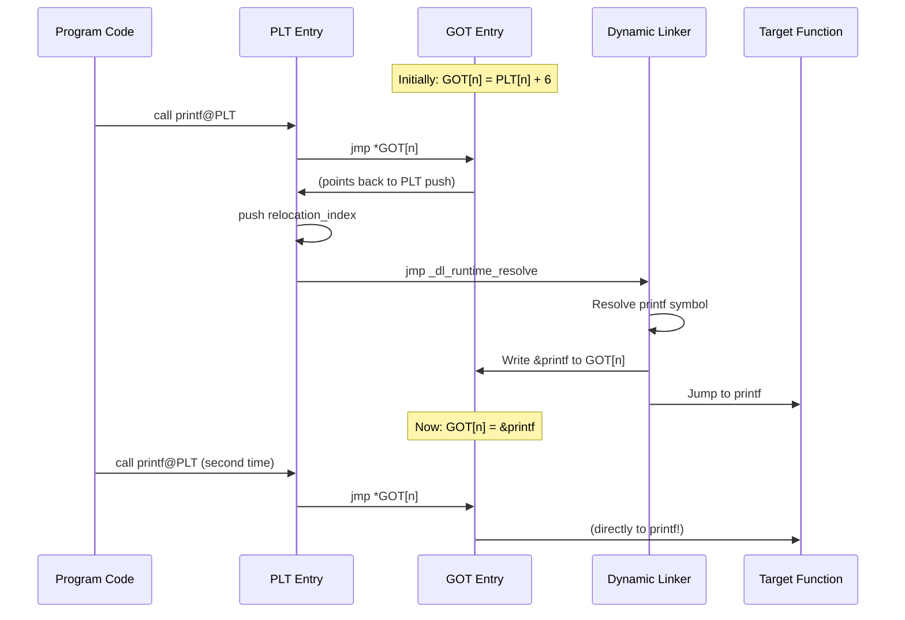
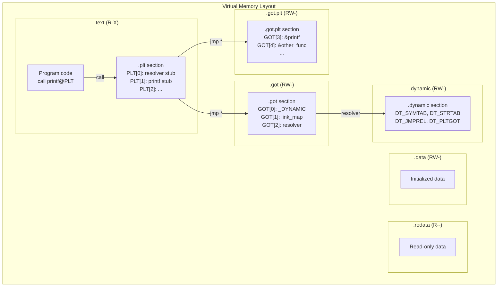
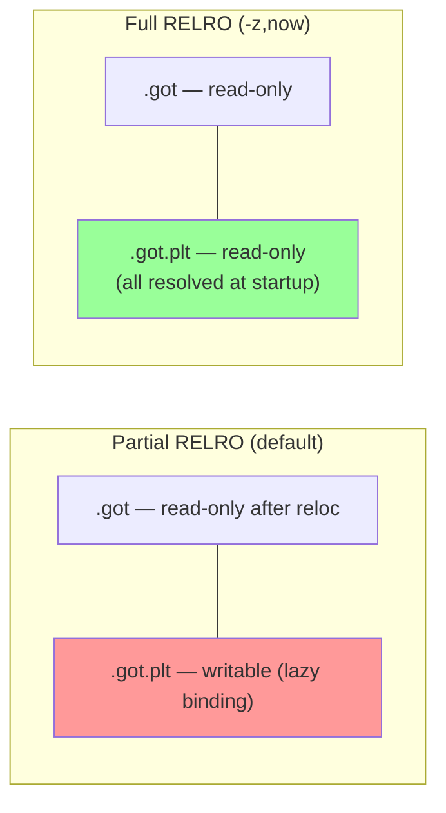

# Chapter 222: PLT and GOT

## 1. Intuition

The **Procedure Linkage Table (PLT)** and **Global Offset Table (GOT)** are the dynamic linker's primary mechanisms for resolving function calls and data accesses across shared library boundaries at runtime. They work together to implement **lazy binding** — the strategy of deferring symbol resolution until a function is actually called, rather than resolving every symbol at program startup.

### Why Do We Need Them?

Consider a program that calls `printf()`. The compiler generates a `call` instruction, but at compile time, it doesn't know where `printf` will be in memory (because shared libraries are loaded at random addresses due to ASLR). Two approaches:

1. **Eager binding**: Resolve all symbols at startup. This is secure (RELRO) but slow for programs with many shared library dependencies.

2. **Lazy binding**: Resolve each symbol the first time it's called. This is fast to start up but requires indirection through PLT/GOT.

### The Analogy

Think of the PLT as a **receptionist** and the GOT as a **phone book**:
- When you call a function, you go to the receptionist (PLT entry).
- The receptionist looks up the number in the phone book (GOT entry).
- The first time, the phone book says "ask the manager" (dynamic linker), so the receptionist calls the manager to get the real number, writes it in the phone book, and connects you.
- Subsequent calls go directly to the real number from the phone book.

## 2. Architecture

### 2.1 How PLT and GOT Work Together

```
Program code                     PLT                         GOT
+------------------+     +------------------+      +------------------+
| ...              |     | PLT[0]:          |      | GOT[0]: _DYNAMIC |
| call printf@PLT -|---->|   push GOT[1]    |----->| GOT[1]: ld.so    |
| ...              |     |   jmp GOT[2]     |----->| GOT[2]: PLT[0]   |
|                  |     |                  |      |                  |
|                  |     | PLT[1]: printf   |      | GOT[3]: &printf  |
|                  |     |   jmp GOT[3]  ---|----->| (initially: PLT  |
|                  |     |   push 0x0       |      |  [1]+6 for lazy) |
|                  |     |   jmp PLT[0]     |      |                  |
+------------------+     +------------------+      +------------------+
```

### 2.2 Lazy Binding Sequence

1. Program calls `printf@PLT`
2. PLT entry jumps to GOT entry (which initially points back to PLT)
3. PLT pushes the relocation index and jumps to PLT[0]
4. PLT[0] jumps to the dynamic linker (address stored in GOT[1])
5. Dynamic linker resolves `printf`, writes its address to GOT[3]
6. Dynamic linker transfers control to `printf`
7. Next call to `printf@PLT` jumps directly to `printf` via GOT[3]

### 2.3 Eager Binding (Full RELRO)

With `-Wl,-z,now`, all relocations are resolved at startup:
1. The dynamic linker processes all `R_X86_64_JUMP_SLOT` entries in `.rela.plt`
2. Each GOT entry is filled with the resolved address
3. The `GNU_RELRO` segment is marked read-only
4. No lazy resolution occurs — all PLT entries jump directly to their targets

### 2.4 PLT Stub Variations

Different architectures implement PLT stubs differently:

**x86-64** (traditional): Each PLT entry is 16 bytes — a jump through GOT, a push, and a jump to PLT[0].

**AArch64**: PLT entries use `adrp` and `ldr` to load the GOT entry, then `br` to branch:
```asm
PLT1:
    adrp x16, GOT+16
    ldr  x17, [x16, #16]
    add  x16, x16, #16
    br   x17
    ; If lazy: fall through to resolver
    adrp x17, GOT+8
    ldr  x17, [x17, #8]
    br   x17
```

**ARM (32-bit)**: Similar to x86 but uses `ldr pc, [pc, #offset]` for indirect jumps through the GOT.

**RISC-V**: Uses `auipc` and `ld` to load GOT entries, then `jr` to jump.

The exact PLT stub layout varies by architecture and linker implementation, but the principle is always the same: indirect jump through a GOT entry that the dynamic linker can overwrite.

## 3. Kernel Implementation

### 3.1 The Kernel's Role

The kernel does not directly interact with PLT/GOT. Its role is limited to:

1. **Loading the executable and interpreter**: The kernel maps the ELF segments into memory, including the PLT and GOT regions.

2. **Setting up the auxiliary vector**: The kernel provides `AT_PHDR`, `AT_ENTRY`, and other entries that the dynamic linker uses to find the `.dynamic` section and thus the GOT/PLT.

3. **Page fault handling**: When the dynamic linker modifies GOT entries (which are in writable pages), the kernel handles the page faults transparently.

The PLT/GOT mechanism is entirely implemented in user space by the static linker (creating the structures) and the dynamic linker (resolving symbols at runtime).

## 4. Source Code References

- **GOT/PLT creation**: `bfd/elf64-x86-64.c` (`elf_x86_64_finish_dynamic_sections`)
- **PLT entry generation**: `bfd/elf64-x86-64.c` (`elf_x86_64_finish_dynamic_symbol`)
- **glibc lazy binding**: `sysdeps/x86_64/dl-machine.h` (`_dl_runtime_resolve`)
- **glibc PLT trampoline**: `sysdeps/x86_64/dl-trampoline.S`
- **musl PLT handling**: `ldso/dynlink.c`
- **LLVM PLT/GOT**: `llvm/lib/Target/X86/X86ISelLowering.cpp`

## 5. Data Structures

### 5.1 GOT Layout (x86-64)

```
GOT[0]:  Address of _DYNAMIC (.dynamic section)
GOT[1]:  Identifier for the dynamic linker (link_map pointer)
GOT[2]:  Address of _dl_runtime_resolve (dynamic linker's resolver)
GOT[3]:  First user-accessible GOT entry (for PLT[1])
GOT[4]:  Second user-accessible GOT entry (for PLT[2])
...
```

GOT entries 0-2 are reserved for the dynamic linker. User entries start at GOT[3].

### 5.2 PLT Layout (x86-64)

```nasm
; PLT[0] — Common prefix (jumped to by all lazy PLT entries)
PLT0:
    push   QWORD PTR [rip + GOT1]   ; Push link_map (GOT[1])
    jmp    QWORD PTR [rip + GOT2]   ; Jump to _dl_runtime_resolve (GOT[2])

; PLT[1] — printf
PLT1:
    jmp    QWORD PTR [rip + GOT3]   ; Jump to GOT[3] (initially: PLT1+6)
    push   0x0                       ; Relocation index for printf
    jmp    PLT0                      ; Jump to common prefix

; PLT[2] — another_function
PLT2:
    jmp    QWORD PTR [rip + GOT4]   ; Jump to GOT[4]
    push   0x1                       ; Relocation index
    jmp    PLT0
```

### 5.3 GOT/PLT Correspondence

Each PLT entry has a corresponding GOT entry:
- `PLT[n]` uses `GOT[n+3]` (because GOT[0-2] are reserved)
- The `.rela.plt` section has one `R_X86_64_JUMP_SLOT` entry per PLT entry
- The relocation index pushed by the PLT stub corresponds to the index in `.rela.plt`

### 5.4 The `.got.plt` Section

On many architectures, the GOT is split into two sections:
- `.got` — For data symbol relocations (`R_X86_64_GLOB_DAT`)
- `.got.plt` — For function symbol relocations (`R_X86_64_JUMP_SLOT`)

This separation allows the `.got` section to be made read-only with RELRO while keeping `.got.plt` writable (for lazy binding). The `.got.plt` section has a well-defined layout:

```
.got.plt[0]: Address of .dynamic
.got.plt[1]: Link map pointer (set by ld.so)
.got.plt[2]: Address of _dl_runtime_resolve (set by ld.so)
.got.plt[3]: PLT entry for symbol 0 (initially → PLT[0]+6)
.got.plt[4]: PLT entry for symbol 1 (initially → PLT[1]+6)
...
```

The first three entries are reserved for the dynamic linker. After lazy binding resolves a symbol, the corresponding `.got.plt` entry is overwritten with the actual function address, so subsequent calls go directly to the function without re-entering the resolver.

## 6. C/Assembly Examples

### 6.1 Disassembling PLT Entries

```bash
# View PLT entries
objdump -d -j .plt /usr/bin/ls

# Typical output (x86-64):
# Disassembly of section .plt:
#
# 0000000000401020 <.plt>:
#   401020: ff 35 ca 2f 00 00    push   0x2fca(%rip)  # 403ff0 <_GLOBAL_OFFSET_TABLE_+0x8>
#   401026: ff 25 cc 2f 00 00    jmp    *0x2fcc(%rip)  # 403ff8 <_GLOBAL_OFFSET_TABLE_+0x10>
#   40102c: 0f 1f 40 00          nopl   0x0(%rax)
#
# 0000000000401030 <printf@plt>:
#   401030: ff 25 d2 2f 00 00    jmp    *0x2fd2(%rip)  # 404008 <printf@GLIBC_2.2.5>
#   401036: 68 00 00 00 00       push   $0x0
#   40103b: e9 e0 ff ff ff       jmp    401020 <.plt>
#
# 0000000000401040 <__libc_start_main@plt>:
#   401040: ff 25 ca 2f 00 00    jmp    *0x2fca(%rip)  # 404010
#   401046: 68 01 00 00 00       push   $0x1
#   40104b: e9 d0 ff ff ff       jmp    401020 <.plt>
```

### 6.2 Viewing GOT Entries

```bash
# View GOT entries
objdump -R /usr/bin/ls  # Dynamic relocations (GOT/PLT entries)

# View .got.plt section content
objdump -s -j .got.plt /usr/bin/ls

# Or use readelf
readelf -r /usr/bin/ls | grep JUMP_SLOT
# Shows all PLT relocations
```

### 6.3 Tracing Lazy Binding

```c
// lazy_binding.c — Observe lazy binding in action
#include <stdio.h>

void function_a(void) { printf("A\n"); }
void function_b(void) { printf("B\n"); }

int main(void)
{
    printf("Before first call\n");

    // First call to function_a — triggers lazy resolution
    function_a();

    // Second call to function_a — uses cached GOT entry
    function_a();

    // First call to function_b — triggers lazy resolution
    function_b();

    return 0;
}
```

```bash
gcc -o lazy_binding lazy_binding.c

# Trace symbol resolution
LD_DEBUG=bindings ./lazy_binding 2>&1 | grep -E 'binding|symbol'
# Shows each symbol being bound the first time it's called

# Trace relocations
LD_DEBUG=reloc ./lazy_binding 2>&1 | grep JUMP_SLOT
```

### 6.4 GOT Entry Modification

```c
// got_hack.c — Demonstrate GOT-based function hooking (educational only)
#include <stdio.h>
#include <stdint.h>
#include <string.h>
#include <sys/mman.h>

// The original function
int original_func(int x) {
    return x * 2;
}

// Our replacement function
int hooked_func(int x) {
    return x * 3;
}

int main(void)
{
    printf("original_func(5) = %d\n", original_func(5));

    // Find the GOT entry for original_func
    // In practice, you'd parse the ELF to find this
    // Here we use a simplified approach
    void **got_entry = (void **)original_func;  // Simplified

    // Note: Modifying GOT entries of other processes or
    // libraries requires ptrace or LD_PRELOAD.
    // This is for educational purposes only.

    // Using LD_PRELOAD is the correct approach:
    // LD_PRELOAD=./hook.so ./program

    return 0;
}
```

### 6.5 Full RELRO vs Partial RELRO

```bash
# Partial RELRO (default on most systems)
gcc -Wl,-z,relro -o partial partial.c
readelf -l partial | grep RELRO
# GNU_RELRO segment present, but .got.plt is still writable

# Full RELRO (all relocations resolved at startup)
gcc -Wl,-z,relro,-z,now -o full full.c
readelf -l full | grep RELRO
# GNU_RELRO segment covers more area
# .got.plt is resolved eagerly and made read-only

# Compare startup time (full RELRO is slightly slower)
time ./partial
time ./full
```

### 6.6 Implementing a PLT Stub (x86-64 Assembly)

```nasm
; plt_impl.asm — Manual PLT implementation (educational)
BITS 64

section .text
global _start

; Simulated GOT (in real ELF, this is in .got.plt)
section .data
got_base:
    dq 0                  ; GOT[0]: _DYNAMIC (unused here)
    dq 0                  ; GOT[1]: link_map
    dq resolve_stub       ; GOT[2]: resolver function
    dq plt_stub_1 + 6    ; GOT[3]: Initially points to push instruction
                          ;         (will be overwritten by resolver)

section .text

; PLT[0] — Common resolver entry
plt_common:
    push QWORD [got_base + 8]   ; Push link_map (GOT[1])
    jmp  QWORD [got_base + 16]  ; Jump to resolver (GOT[2])

; PLT stub for a function
plt_stub_1:
    jmp  QWORD [got_base + 24]  ; Jump via GOT[3]
    push 0                        ; Relocation index 0
    jmp  plt_common               ; Go to resolver

; Simplified resolver
resolve_stub:
    ; In a real dynamic linker, this would:
    ; 1. Look up the symbol
    ; 2. Write its address to GOT[3]
    ; 3. Jump to the resolved function
    ; Here, we simulate by writing a known address
    mov QWORD [got_base + 24], actual_function
    jmp actual_function

; The actual function
actual_function:
    mov rax, 1        ; sys_write
    mov rdi, 1        ; stdout
    lea rsi, [msg]
    mov rdx, msg_len
    syscall
    ret

msg: db "Hello from resolved function!", 10
msg_len equ $ - msg

_start:
    call plt_stub_1    ; First call: goes through resolver
    call plt_stub_1    ; Second call: jumps directly (GOT[3] resolved)

    ; Exit
    mov rax, 60
    xor rdi, rdi
    syscall
```

## 7. Diagrams

### 7.1 PLT/GOT Interaction



### 7.2 Memory Layout with PLT/GOT



### 7.3 Full RELRO vs Partial RELRO



## 8. Common Pitfalls

### 8.1 PLT Overhead

Every function call through the PLT incurs extra overhead:
- One indirect jump (through GOT)
- Potential push + jump to resolver (first call only)
- Branch predictor may miss the indirect jump

For performance-critical code, consider:
- Using `-fno-plt` (generates direct GOT-relative calls)
- Linking with `-Bsymbolic` to bind symbols within the same shared library
- Using `-Wl,-z,now` (eliminates lazy resolution overhead after startup)

### 8.2 GOT as Attack Target

The GOT is a prime target for attackers because:
- It contains function pointers that can be overwritten
- GOT entries are in writable memory (with partial RELRO)
- Overwriting a GOT entry redirects function calls to attacker code

**Mitigation**: Use full RELRO (`-Wl,-z,relro,-z,now`).

### 8.3 Symbol Interposition and PLT

When a shared library calls a function like `malloc()`, it goes through the PLT. This means the call can be intercepted by `LD_PRELOAD` or by the executable defining its own `malloc()`. This is by design (symbol interposition) but can be surprising:

```c
// mylib.so calls malloc()
// If the main program defines malloc(), it overrides libc's
// This is PLT-based symbol interposition
```

### 8.4 -fno-plt and Its Consequences

With `-fno-plt`, the compiler generates:
```nasm
; Instead of:
call printf@PLT

; It generates:
call *printf@GOTPCREL(%rip)
```

This avoids the PLT overhead but:
- Each call site has its own indirect call (more relocations)
- The GOT entry must be resolved before the call (no lazy binding possible)
- Debugging may be harder (no PLT entries to set breakpoints on)

### 8.5 Missing PLT Entry

If you get "PLT symbol not found" errors, it usually means:
- The symbol is not exported by any shared library
- The library containing the symbol isn't linked
- The symbol has been stripped or has wrong visibility

## 9. Best Practices

### 9.1 Use Full RELRO for Security

```bash
gcc -Wl,-z,relro,-z,now -o program main.c
```

This makes the GOT read-only after startup, preventing GOT overwrite attacks. Full RELRO is now the default on many hardened distributions (Debian, Ubuntu, Fedora).

### 9.2 Use -fno-plt When Performance Matters

For hot paths where every cycle counts:
```bash
gcc -fno-plt -O2 -o program main.c
```

Note that `-fno-plt` requires all called functions to be resolved at load time (no lazy binding), which slightly increases startup time but eliminates PLT overhead at runtime.

### 9.3 Understand PLT Breakpoints

When debugging, you can set breakpoints on PLT entries:
```bash
(gdb) break *0x401030  # Break on printf@PLT
(gdb) break printf      # GDB resolves to PLT entry automatically
```

### 9.4 Use Bsymbolic for Internal Calls

If a shared library calls its own functions, `-Bsymbolic` binds them directly without going through the PLT:
```bash
gcc -shared -Wl,-Bsymbolic -o libfoo.so foo.c
```

This improves performance and prevents external interposition.

### 9.5 Minimize PLT Entries

Reduce the number of PLT entries by:
- Using symbol visibility (`-fvisibility=hidden`) to reduce exports
- Using `-Wl,--as-needed` to avoid linking unused libraries
- Defining functions as `static` when they don't need external visibility

## 10. Exercises

### Exercise 1: PLT/GOT Tracing
Write a program that calls 3 different `libc` functions. Use `objdump -d` to find the PLT entries, `readelf -r` to find the GOT relocations, and `LD_DEBUG=bindings` to trace lazy binding.

### Exercise 2: PLT Breakpoint Debugging
In GDB, set breakpoints on a PLT entry and the corresponding function. Show that:
- Before the first call, the GOT entry points back to the PLT
- After the first call, the GOT entry points to the real function
- Subsequent calls go directly to the real function

### Exercise 3: Full RELRO Comparison
Build the same program with partial RELRO (default) and full RELRO (`-z,now`). Compare:
- Startup time (using `time`)
- Writable memory regions (using `readelf -l` and `/proc/pid/maps`)
- GOT entry values before and after function calls

### Exercise 4: PLT Stub Disassembly
Compile a "Hello World" program and disassemble the PLT section. Identify:
- PLT[0] (common resolver stub)
- Each function's PLT entry
- The corresponding GOT entries
- The relocation indices

### Exercise 5: GOT Dump Tool
Write a C program that reads its own `/proc/self/maps` and the ELF file to dump the current values of its GOT entries. Compare with the expected function addresses from `dlsym()`.

### Exercise 6: Symbol Interposition Experiment
Create two shared libraries that both define a function `process()`. Write a program that links against both. Use `LD_PRELOAD` to interpose a third version. Trace with `LD_DEBUG=bindings` to show which version is actually called.

### 10.6 Benchmarking PLT Overhead

Measure the overhead of PLT-based function calls vs direct calls:

```c
// plt_bench.c
#include <stdio.h>
#include <time.h>

// External function (goes through PLT)
extern int external_func(int x);

// Direct call (no PLT)
static int direct_func(int x) { return x + 1; }

int main(void) {
    volatile int sum = 0;
    struct timespec start, end;

    // Benchmark direct calls
    clock_gettime(CLOCK_MONOTONIC, &start);
    for (int i = 0; i < 100000000; i++) {
        sum += direct_func(i);
    }
    clock_gettime(CLOCK_MONOTONIC, &end);
    long direct_ns = (end.tv_sec - start.tv_sec) * 1000000000L +
                     (end.tv_nsec - start.tv_nsec);

    // Benchmark PLT calls
    clock_gettime(CLOCK_MONOTONIC, &start);
    for (int i = 0; i < 100000000; i++) {
        sum += external_func(i);
    }
    clock_gettime(CLOCK_MONOTONIC, &end);
    long plt_ns = (end.tv_sec - start.tv_sec) * 1000000000L +
                  (end.tv_nsec - start.tv_nsec);

    printf("Direct: %ld ns\n", direct_ns);
    printf("PLT:    %ld ns\n", plt_ns);
    printf("Overhead: %.2f%%\n", (double)(plt_ns - direct_ns) / direct_ns * 100);
    return 0;
}
```

Typical results show PLT overhead is 1-5% on modern CPUs, thanks to the branch predictor caching GOT entries after the first call.

## 11. References

1. **System V ABI x86-64 Supplement** — PLT/GOT specification
2. **glibc dynamic linker source:**
   - `sysdeps/x86_64/dl-machine.h` — PLT resolution
   - `sysdeps/x86_64/dl-trampoline.S` — PLT trampoline assembly
   - `elf/dl-runtime.c` — `_dl_runtime_resolve`
3. **GNU ld PLT/GOT generation:**
   - `bfd/elf64-x86-64.c` — `elf_x86_64_finish_dynamic_sections`
4. **"How to Write Shared Libraries" by Ulrich Drepper** — PLT/GOT design rationale
5. **"Learning Linux Binary Analysis" by Ryan O'Neill** — PLT/GOT internals
6. **GOT overwrite techniques:**
   - https://systemoverlord.com/2017/03/19/got-and-plt-for-pwning.html
7. **RELRO documentation:**
   - https://www.redhat.com/en/blog/hardening-elf-binaries-using-relocation-read-only-relro
8. **PLT on different architectures:**
   - https://www.codeproject.com/Articles/1262465/How-Linux-Shared-Libraries-Work
9. **AArch64 PLT implementation:**
   - https://github.com/ARM-software/abi-aa/blob/main/aaelf64/aaelf64.rst
