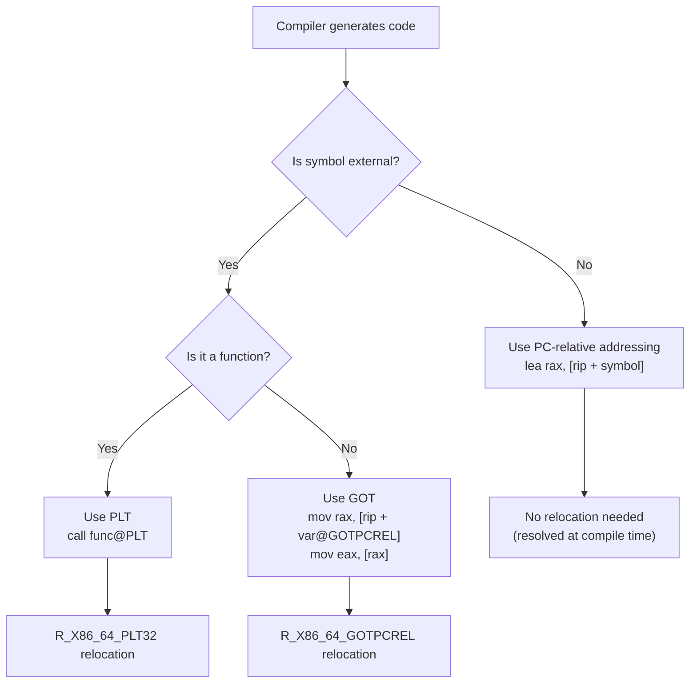
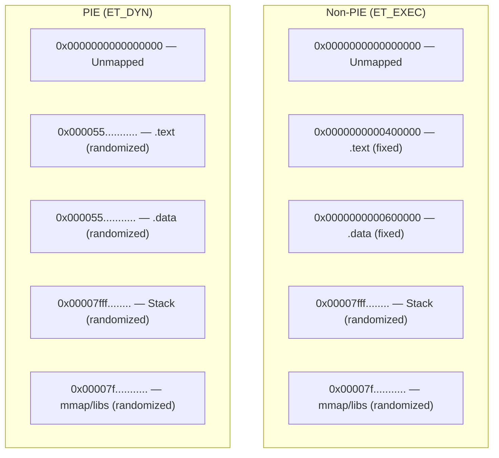
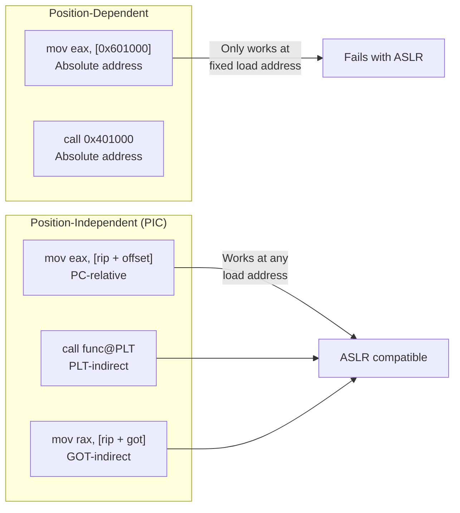

# Chapter 223: PIC and PIE

## 1. Intuition

**Position-Independent Code (PIC)** and **Position-Independent Executables (PIE)** are techniques that allow code to execute correctly regardless of where it is loaded in memory. They are the foundation of **Address Space Layout Randomization (ASLR)**, a critical security feature that randomizes memory addresses to make exploitation harder.

### The Problem PIC Solves

Before PIC, code was compiled with absolute addresses:

```nasm
; Position-dependent code
mov eax, [0x601000]    ; Absolute address — only works if loaded at 0x400000
call 0x401000          ; Absolute address — only works at specific load address
```

This is fine for executables loaded at a fixed address (traditional `ET_EXEC`), but shared libraries can be loaded at **any address** in any process. If two processes use `libc.so`, it might be at `0x7f1234567000` in one and `0x7f9876543000` in another.

### The Solution: PC-Relative Addressing

PIC uses the fact that the **distance** between code and data within the same module is constant, even if the absolute addresses change. x86-64 makes this natural with RIP-relative addressing:

```nasm
; Position-independent code
mov eax, [rip + offset_to_my_data]  ; PC-relative — works at any load address
call [rip + offset_to_got_entry]    ; PC-relative indirect — works anywhere
```

### PIC vs PIE

- **PIC** (`-fPIC`): Generates position-independent code for **shared libraries** (`.so` files). All code references use GOT/PLT indirection.
- **PIE** (`-fPIE` + `-pie`): Generates position-independent **executables**. The executable itself can be loaded at a random address. PIE executables are `ET_DYN` (like shared libraries), not `ET_EXEC`.

PIE is the default on modern Linux distributions. A PIE executable is essentially a shared library that happens to have a `main()` function.

## 2. Architecture

### 2.1 Addressing Modes in PIC/PIE

| Mode | Code Pattern | Description |
|------|-------------|-------------|
| **Absolute** | `mov eax, [0x601000]` | Fixed address, not position-independent |
| **PC-relative data** | `mov eax, [rip + offset]` | Data within same module (x86-64 default) |
| **GOT-indirect** | `mov rax, [rip + got_offset]` | Data in another module (via GOT) |
| **PLT-indirect** | `call [rip + plt_offset]` | Function in another module (via PLT) |
| **RIP-relative LEA** | `lea rdi, [rip + string]` | Load address of string/data (no memory access) |

### 2.2 Code Models

The x86-64 ABI defines several code models that affect how addresses are generated:

| Model | Description | Range |
|-------|-------------|-------|
| **Tiny** | All code and data in low 2MB | ±1MB from 0 |
| **Small (default)** | Code and data up to 2GB | ±2GB from 0 |
| **Small PIC** | Small model with PIC | ±2GB GOT-relative |
| **Kernel** | Code in top 2GB of address space | -2GB to 0 from top |
| **Medium** | Code up to 2GB, data anywhere | ±2GB code, any data |
| **Large** | No restrictions | Any address |

For shared libraries, **Small PIC** is the default. For PIE executables, **Small PIC** is also used.

### 2.3 The GOT in PIC

In PIC, the GOT is the central mechanism for accessing external data:

```
Module A (shared library)
+------------------+
| .text            |
|   mov rax, [rip + got_offset]  ; Load address of external_var from GOT
|   mov ebx, [rax]               ; Load value of external_var
+------------------+
| .got             |
|   GOT[0]: &external_var        ; Filled by dynamic linker
+------------------+
```

For internal data (within the same module), the compiler can use PC-relative addressing directly, avoiding the GOT:

```nasm
; Internal data access (no GOT needed)
lea rax, [rip + my_data]    ; Address of my_data (PC-relative)
mov ebx, [rax]               ; Load value
```

### 2.4 PIC on Different Architectures

**x86-64**: PIC is relatively easy because RIP-relative addressing is available for most instructions. The compiler uses `[rip + offset]` for data access and `call [rip + plt_offset]` for function calls.

**x86-32**: PIC is harder because there's no equivalent of RIP-relative addressing. The compiler uses a "global base register" (`%ebx`) that points to the GOT:

```nasm
; x86-32 PIC function prologue
call __x86.get_pc_thunk.bx    ; Load PC into %ebx
add  ebx, _GLOBAL_OFFSET_TABLE_ ; Adjust to point to GOT

; Now use %ebx-relative addressing
mov  eax, [ebx + var@GOT]     ; Load GOT entry for var
mov  eax, [eax]                ; Load value of var
```

**AArch64**: PIC is straightforward with PC-relative addressing (ADR, ADRP+ADD sequences):

```asm
; AArch64 PIC
adrp x0, :got:external_var    ; Load GOT page address
ldr  x0, [x0, :got_lo12:external_var]  ; Load GOT entry
ldr  x0, [x0]                 ; Load value
```

## 3. Kernel Implementation

### 3.1 ASLR Implementation

The kernel's ASLR implementation is what makes PIE valuable:

**Key source file:** `fs/binfmt_elf.c`, `arch/x86/kernel/process.c`

```c
// From arch/x86/mm/mmap.c (simplified)
unsigned long arch_mmap_rnd(void)
{
    unsigned long rnd;

    // Get random bits for mmap randomization
    if (mmap_is_ia32())
        rnd = get_random_long() & 0xFFFFF;  // 32-bit: 20 bits = 1MB alignment
    else
        rnd = get_random_long() & 0x3FFFFFFF; // 64-bit: 30 bits = 1GB alignment

    return rnd << PAGE_SHIFT;
}
```

The kernel randomizes:
- **Executable base** (for PIE): Random offset from default load address
- **Shared libraries**: Random mmap base
- **Stack**: Random top of stack
- **Heap**: Random brk base
- **vdso**: Random mapping address

### 3.2 PIE Loading

When the kernel loads a PIE executable (which is `ET_DYN`):

```c
// From fs/binfmt_elf.c (simplified)
static int load_elf_binary(struct linux_binprm *bprm)
{
    // ... validation ...

    if (elf_ex->e_type == ET_DYN) {
        // PIE executable or shared library
        // Load at a random address (ASLR)
        load_bias = ELF_ET_DYN_BASE;  // Default base
        if (randomize_va_space) {
            load_bias += arch_mmap_rnd();  // Add random offset
        }
        // Align to segment alignment
        load_bias = ELF_PAGESTART(load_bias - vaddr);
    }

    // Map segments with load_bias
    for (i = 0; i < elf_ex->e_phnum; i++) {
        if (elf_ppnt->p_type == PT_LOAD) {
            elf_map(file, load_bias + elf_ppnt->p_vaddr, ...);
        }
    }
}
```

### 3.3 Disabling ASLR

```bash
# Disable ASLR system-wide (requires root)
echo 0 > /proc/sys/kernel/randomize_va_space

# Disable ASLR for a single program
setarch $(uname -m) -R ./program

# Values:
# 0 = no randomization
# 1 = conservative (mmap, stack, vdso)
# 2 = full (also PIE base, heap) — default
```

## 4. Source Code References

- **GCC PIC generation**: `gcc/config/i386/i386.cc` — x86 PIC/PIE code generation
- **LLVM PIC**: `llvm/lib/Target/X86/X86ISelLowering.cpp` — PIC lowering
- **Kernel ASLR**: `arch/x86/mm/mmap.c` — Random address generation
- **Kernel ELF loader**: `fs/binfmt_elf.c` — PIE loading with random base
- **glibc PIC support**: `sysdeps/x86_64/dl-machine.h` — Dynamic linker PIC handling
- **Linker PIE support**: `bfd/elf64-x86-64.c` — PIE linking

## 5. Data Structures

### 5.1 PIC Symbol Access Patterns

For each type of symbol reference in PIC, the compiler generates a specific pattern:

**Global function (external):**
```nasm
; Call external function
call func@PLT                  ; Goes through PLT (always)

; Take address of external function (e.g., for function pointer)
mov rax, [rip + func@GOTPCREL] ; Load address from GOT
```

**Global data (external):**
```nasm
; Access external global variable
mov rax, [rip + var@GOTPCREL]  ; Load address from GOT
mov eax, [rax]                  ; Load value
```

**Global data (internal, same module):**
```nasm
; Access internal global variable
lea rax, [rip + var]           ; Address is PC-relative (no GOT)
mov eax, [rax]                  ; Load value
```

**String literal:**
```nasm
; Load address of string
lea rdi, [rip + .LC0]         ; PC-relative (no GOT needed)
```

### 5.2 GOT Entry Types in PIC

| Entry Type | Relocation | Description |
|------------|------------|-------------|
| `R_X86_64_GLOB_DAT` | Eager | Data symbol address (resolved at load time) |
| `R_X86_64_JUMP_SLOT` | Lazy/Eager | Function symbol address (resolved lazily or eagerly) |
| `R_X86_64_RELATIVE` | Eager | Base-relative address (no symbol lookup needed) |
| `R_X86_64_64` | Eager | Absolute address with symbol |

### 5.3 PIE vs Non-PIE Comparison

```
Non-PIE (ET_EXEC):
  .text at 0x401000 (fixed)
  .data at 0x602000 (fixed)
  All addresses known at link time
  No ASLR for code/data (only mmap, stack)

PIE (ET_DYN):
  .text at 0x555555554000 + random (ASLR)
  .data at 0x555555556000 + random
  All internal addresses computed at load time
  Full ASLR
```

## 6. C/Assembly Examples

### 6.1 PIC vs Non-PIC Code Comparison

```c
// pic_demo.c — Compare PIC and non-PIC code generation
#include <stdio.h>

int global_var = 42;

int get_global(void) {
    return global_var;
}

int call_external(void) {
    return printf("Hello\n");
}
```

```bash
# Non-PIC compilation (x86-64, but PIC is default)
gcc -fno-pic -S -o pic_demo_nopic.s pic_demo.c

# PIC compilation
gcc -fPIC -S -o pic_demo_pic.s pic_demo.c

# Compare the assembly output
diff pic_demo_nopic.s pic_demo_pic.s
```

**Non-PIC output (get_global):**
```nasm
get_global:
    mov eax, DWORD PTR global_var[rip]   ; Still RIP-relative on x86-64
    ret
```

**PIC output (get_global):**
```nasm
get_global:
    mov eax, DWORD PTR global_var[rip]   ; Same! Internal symbols use PC-relative
    ret
```

For **external** symbols, the difference is more pronounced:

**Non-PIC (call_external):**
```nasm
call_external:
    lea rdi, .LC0[rip]
    mov eax, 0
    call printf        ; Direct call (resolved at link time)
```

**PIC (call_external):**
```nasm
call_external:
    lea rdi, .LC0[rip]
    mov eax, 0
    call printf@PLT    ; Indirect call through PLT
```

### 6.2 Creating a PIE Executable

```bash
# Compile with PIE (default on most modern systems)
gcc -o pie_program main.c

# Verify it's PIE
file pie_program
# pie_program: ELF 64-bit LSB pie executable, x86-64, ...

# Verify it's ET_DYN
readelf -h pie_program | grep Type
# Type: DYN (Position-Independent Executable)

# Non-PIE executable
gcc -no-pie -o nopie_program main.c
file nopie_program
# nopie_program: ELF 64-bit LSB executable, x86-64, ...
readelf -h nopie_program | grep Type
# Type: EXEC (Executable)
```

### 6.3 ASLR Demonstration

```c
// aslr_demo.c — Show ASLR in action
#include <stdio.h>
#include <stdlib.h>

int global_var = 42;

void function(void) {
    int stack_var;
    void *heap_var = malloc(1);

    printf("Code (function): %p\n", (void *)function);
    printf("Data (global):   %p\n", (void *)&global_var);
    printf("Stack:           %p\n", (void *)&stack_var);
    printf("Heap:            %p\n", heap_var);
    printf("libc printf:     %p\n", (void *)printf);

    free(heap_var);
}

int main(void) {
    function();
    return 0;
}
```

```bash
gcc -o aslr_demo aslr_demo.c

# Run multiple times — addresses change each time
./aslr_demo
./aslr_demo
./aslr_demo

# With ASLR disabled — addresses are stable
setarch $(uname -m) -R ./aslr_demo
setarch $(uname -m) -R ./aslr_demo
```

### 6.4 GOT-Relative Addressing

```nasm
; got_relative.asm — Demonstrates GOT-relative addressing in PIC
BITS 64

section .text
global _start

; In PIC, we need the GOT to access external data
; The dynamic linker fills GOT entries at load time

_start:
    ; Get the address of the GOT using PC-relative call
    call .get_got_base
.get_got_base:
    pop rbx                     ; rbx = current PC
    add rbx, _GLOBAL_OFFSET_TABLE_ - .get_got_base  ; rbx = GOT base

    ; Now we can access GOT entries
    ; ... use rbx-relative addressing ...

    ; Exit
    mov rax, 60
    xor rdi, rdi
    syscall
```

### 6.5 PIC Function Prologue (x86-32)

```nasm
; pic_x86_32.asm — x86-32 PIC function with GOT register
BITS 32

section .text
global my_function

my_function:
    ; Save and set up GOT pointer
    push ebx
    call __x86.get_pc_thunk.bx   ; ebx = address of next instruction
    add  ebx, _GLOBAL_OFFSET_TABLE_  ; ebx = GOT base

    ; Access global variable through GOT
    mov  eax, [ebx + global_var@GOT]   ; Load address from GOT
    mov  eax, [eax]                     ; Load value

    ; Access external function through PLT
    call external_func@PLT

    pop  ebx
    ret

; This function returns the PC in ebx
; (often provided by crtbegin.o or libgcc)
__x86.get_pc_thunk.bx:
    mov  ebx, [esp]
    ret
```

### 6.6 Verifying PIC/PIE with readelf

```bash
# Check if a shared library is PIC
readelf -d libfoo.so | grep TEXTREL
# No output = PIC (good)
# TEXTREL present = has text relocations (bad, not fully PIC)

# Check if executable is PIE
readelf -h program | grep Type
# DYN = PIE
# EXEC = non-PIE

# Check ASLR randomization
readelf -l program | grep LOAD
# VAddr shows the base address (low for PIE, 0x400000 for non-PIE)
```

## 7. Diagrams

### 7.1 PIC Address Resolution



### 7.2 ASLR Layout



### 7.3 PIC vs Position-Dependent Code



## 8. Common Pitfalls

### 8.1 PIC Overhead on x86-32

On x86-32, PIC requires dedicating `%ebx` as the GOT pointer. This:
- Reduces available registers (x86-32 has few already)
- Requires function prologue/epilogue to save/restore `%ebx`
- Can cause 5-10% performance overhead

On x86-64, this is much less of an issue because RIP-relative addressing is available and there are more registers.

### 8.2 PIE Security vs Performance

PIE enables full ASLR but has a small performance cost:
- Extra indirection through GOT/PLT
- Slightly larger code due to PC-relative addressing
- More relocations at load time

The performance impact is typically 1-3% on x86-64, which is usually acceptable for the security benefit.

### 8.3 Non-PIE Executables and Partial ASLR

Non-PIE executables (`ET_EXEC`) have their `.text` and `.data` at fixed addresses. Even with ASLR enabled, the kernel can only randomize:
- mmap region (shared libraries, stack)
- brk region (heap)

The executable's own code is not randomized. This is why PIE is important for full ASLR — without it, attackers know exactly where the executable's code and data are in memory, making ROP (Return-Oriented Programming) attacks much easier.

The tradeoff is that PIE adds a small amount of overhead:
- An extra level of indirection for external symbol access (through the GOT)
- Slightly larger code due to PC-relative addressing patterns
- More relocations to process at load time (R_X86_64_RELATIVE for all absolute addresses)
- Potentially worse cache behavior due to the additional indirection

On modern x86-64 hardware, this overhead is typically 1-3%, which is almost always acceptable given the significant security improvement.

### 8.4 Mixing PIC and Non-PIC Objects

You cannot link a PIC object file with a non-PIC shared library (or vice versa). The linker will complain about incompatible relocations:

```bash
# This will fail:
gcc -fno-pic -c main.c -o main.o
gcc -shared main.o -o libfoo.so  # Error: relocation R_X86_64_32 
                                   # against `.rodata' can not be used
                                   # when making a shared object
```

The reason is that position-dependent code uses absolute addresses (like `R_X86_64_32`), which require the code to be loaded at a specific address. Shared libraries can be loaded anywhere, so they need PC-relative or GOT-relative addressing (like `R_X86_64_PC32` or `R_X86_64_GOTPCREL`).

On x86-64, the compiler defaults to PIC code generation even without `-fPIC`, because the small code model already uses PC-relative addressing for internal symbols. The difference mainly shows up for external symbols and function calls.

### 8.5 dlopen and PIC

Shared libraries loaded with `dlopen()` **must** be PIC. Non-PIC shared libraries will have text relocations that may be rejected by the dynamic linker on hardened systems.

### 8.6 Copy Relocations Break PIC

If a non-PIE executable directly accesses a global variable in a shared library (without going through the GOT), the linker creates an `R_X86_64_COPY` relocation. This:
- Allocates space in the executable's `.bss`
- Copies the initial value from the shared library at load time
- Both the executable and library refer to the same copy

This breaks if the shared library is updated and the variable size changes. PIE executables avoid this.

## 9. Best Practices

### 9.1 Always Use PIE

PIE is the default on modern Linux distributions. Ensure your build system uses it:

```bash
# Default (PIE)
gcc -o program main.c

# Explicit PIE
gcc -pie -fPIE -o program main.c

# Verify
readelf -h program | grep Type  # Should show DYN
```

### 9.2 Use -fPIC for Shared Libraries

Always compile shared library code with `-fPIC`:

```bash
gcc -fPIC -shared -o libfoo.so foo.c
```

### 9.3 Consider -fno-plt for Performance

If PLT overhead matters, use `-fno-plt` to generate direct GOT-relative calls:

```bash
gcc -fno-plt -O2 -o program main.c
```

### 9.4 Use -fvisibility=hidden

Reduce the number of GOT entries by hiding internal symbols:

```bash
gcc -fPIC -fvisibility=hidden -shared -o libfoo.so foo.c
```

### 9.5 Profile Before Disabling PIE

If you think PIE is causing performance issues, measure first. The overhead is usually negligible:

```bash
# Benchmark with PIE
gcc -pie -fPIE -O2 -o prog_pie main.c
time ./prog_pie

# Benchmark without PIE
gcc -no-pie -O2 -o prog_nopie main.c
time ./prog_nopie
```

### 9.6 Use RELRO with PIE

Combine PIE with full RELRO for maximum security:

```bash
gcc -pie -fPIE -Wl,-z,relro,-z,now -o program main.c
```

## 10. Exercises

### Exercise 1: PIC vs Non-PIC Assembly
Compile the same C file with `-fPIC` and `-fno-pic`. Compare the assembly output for:
- Accessing a global variable
- Calling an external function
- Using a string literal

### Exercise 2: ASLR Measurement
Write a program that prints the addresses of code, data, stack, heap, and shared library functions. Run it 10 times and compute the randomization range for each.

### Exercise 3: PIE Verification Script
Write a bash script that checks whether a binary is PIE, has full RELRO, and has no text relocations. Use `readelf` and `file` commands.

### Exercise 4: GOT Access Pattern
Compile a program with `-fPIC` and `-fno-plt`. Use `objdump -d` to show how the compiler accesses the GOT differently with and without `-fno-plt`.

### Exercise 5: Code Model Comparison
Compile the same program with different x86-64 code models (`-mcmodel=small`, `-mcmodel=medium`, `-mcmodel=large`). Compare the generated assembly for function calls and data access.

### Exercise 6: PIC on Different Architectures
If you have access to cross-compilers, compare PIC code generation on x86-64, AArch64, and ARM (32-bit). Focus on how each architecture accesses the GOT.

## 11. References

1. **System V ABI x86-64 Supplement** — Code models and PIC
   - https://gitlab.com/x86-psABIs/x86-64-ABI

2. **GCC documentation on code models:**
   - https://gcc.gnu.org/onlinedocs/gcc/x86-Options.html (search for `-mcmodel`)

3. **"Position Independent Executables" (PaX Team):**
   - https://pax.grsecurity.net/docs/pie.txt

4. **Linux kernel ASLR implementation:**
   - `arch/x86/mm/mmap.c` — Random address generation
   - `fs/binfmt_elf.c` — PIE loading

5. **"How to Write Shared Libraries" by Ulrich Drepper** — PIC design rationale

6. **ASLR documentation:**
   - https://en.wikipedia.org/wiki/Address_space_layout_randomization

7. **GCC `-fPIC` and `-fPIE` documentation:**
   - https://gcc.gnu.org/onlinedocs/gcc/Code-Gen-Options.html
