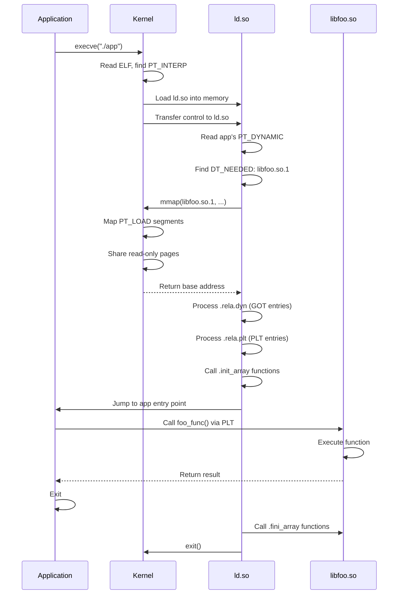
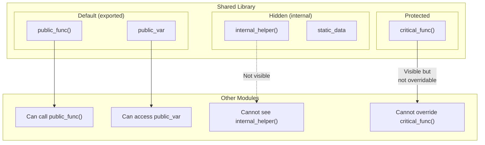
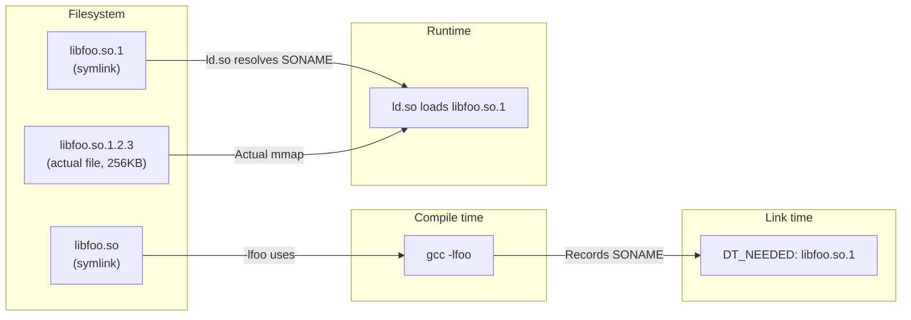

# Chapter 224: Shared Libraries

## 1. Intuition

A **shared library** (`.so` file on Linux, `.dylib` on macOS, `.dll` on Windows) is a compiled collection of code and data that can be loaded and used by multiple programs simultaneously. Unlike static libraries (`.a` files), which are copied into each executable at link time, shared libraries exist as separate files that are mapped into a process's address space at runtime by the dynamic linker.

### Why Shared Libraries?

1. **Code sharing**: Multiple programs using `libc.so` share a single copy of the code in physical memory (via the kernel's page cache and copy-on-write).
2. **Independent updates**: You can update `libssl.so` to fix a security vulnerability without recompiling every program that uses OpenSSL.
3. **Reduced disk usage**: Instead of each executable containing its own copy of `printf`, they all reference the same `libc.so`.
4. **Plugin systems**: Programs can load functionality at runtime using `dlopen()`.
5. **ABI stability**: The SONAME versioning scheme allows binary compatibility across minor updates.

### The Tradeoff

Shared libraries introduce complexity:
- Symbol resolution must happen at runtime (startup cost)
- Versioning must be managed carefully (SONAME, symbol versions)
- Position-independent code has a small performance overhead
- Dependency management is more complex (DLL hell, though less common on Linux than Windows)

## 2. Architecture

### 2.1 Shared Library Lifecycle

```
Development:
  foo.c → gcc -fPIC -c → foo.o
  bar.c → gcc -fPIC -c → bar.o

Linking:
  foo.o + bar.o → ld -shared → libfoo.so.1.2.3
  Create symlinks: libfoo.so.1 → libfoo.so.1.2.3
                   libfoo.so → libfoo.so.1

Installation:
  Copy to /usr/lib/ or /usr/local/lib/
  Run ldconfig to update /etc/ld.so.cache

Usage (compile time):
  gcc -o program main.c -lfoo  # Links against libfoo.so (the dev symlink)

Usage (runtime):
  ./program → ld.so finds libfoo.so.1 (via SONAME in executable)
           → mmap's it into process address space
           → Resolves symbols
           → Program runs
```

### 2.2 Shared Library File Structure

A shared library is an `ET_DYN` ELF file with:
- `PT_DYNAMIC` segment (contains `DT_SONAME`, `DT_NEEDED`, `DT_SYMTAB`, etc.)
- `.dynamic` section (array of `Elf64_Dyn` entries)
- `.dynsym` (dynamic symbol table)
- `.dynstr` (dynamic string table)
- `.rela.dyn` (dynamic relocations for data)
- `.rela.plt` (dynamic relocations for PLT)
- `.got` and `.got.plt` (Global Offset Table)
- `.hash` or `.gnu.hash` (symbol hash tables for fast lookup)
- `.gnu.version` (symbol versioning)
- `.init` / `.fini` / `.init_array` / `.fini_array` (initialization/finalization)

### 2.3 Symbol Visibility

Shared libraries can export or hide symbols:

| Visibility | Description | Use Case |
|------------|-------------|----------|
| `default` | Exported, visible to other modules | Public API |
| `hidden` | Not exported, internal to the module | Implementation details |
| `protected` | Exported but cannot be overridden | Strong definition |
| `internal` | Processor-specific, rarely used | Special cases |

## 3. Kernel Implementation

### 3.1 Shared Library Mapping

When the dynamic linker loads a shared library, it uses `mmap()` to map the library's segments into the process address space:

```c
// From glibc: elf/dl-map-segments.h (simplified)
static int
_dl_map_segments (struct link_map *l, int fd)
{
    // Map each PT_LOAD segment
    for (const Elf64_Phdr *ph = l->l_phdr; ph < l->l_phdr + l->l_phnum; ph++) {
        if (ph->p_type != PT_LOAD)
            continue;

        // Calculate map parameters
        Elf64_Addr mapstart = ELF_PAGESTART(l->l_addr + ph->p_vaddr);
        Elf64_Addr mapend = ELF_PAGEEND(l->l_addr + ph->p_vaddr + ph->p_filesz);
        Elf64_Addr allocend = l->l_addr + ph->p_vaddr + ph->p_memsz;

        // Determine protection flags
        int prot = 0;
        if (ph->p_flags & PF_R) prot |= PROT_READ;
        if (ph->p_flags & PF_W) prot |= PROT_WRITE;
        if (ph->p_flags & PF_X) prot |= PROT_EXEC;

        // Map the segment
        void *map = mmap((void *)mapstart, mapend - mapstart,
                        prot, MAP_PRIVATE | MAP_FIXED, fd, ph->p_offset);

        // Handle .bss (memsz > filesz)
        if (allocend > mapend) {
            mmap((void *)mapend, allocend - mapend,
                 prot, MAP_PRIVATE | MAP_FIXED | MAP_ANONYMOUS, -1, 0);
        }
    }
}
```

The kernel's `mmap()` system call handles the actual page table setup. The kernel:
1. Creates VMA (Virtual Memory Area) entries for each mapping
2. Maps file-backed pages into the page table (demand paging)
3. Sets page protection flags (read, write, execute)
4. Shares read-only pages between processes (page cache)

### 3.2 Page Sharing

When multiple processes use the same shared library:
- Read-only pages (`.text`, `.rodata`) are shared in physical memory via the page cache
- Writable pages (`.data`, `.got`) are copy-on-write — each process gets its own copy when it writes
- This is why shared libraries save memory: the code is shared, only data is per-process

## 4. Source Code References

- **GCC shared library support**: `gcc/config/i386/i386.cc` — PIC code generation
- **GNU ld shared library creation**: `bfd/elf64-x86-64.c` — `elf_x86_64_size_dynamic_sections`
- **glibc shared library loading**: `elf/dl-load.c` — `_dl_map_object`
- **glibc symbol lookup**: `elf/dl-lookup.c` — `_dl_lookup_symbol_x`
- **musl shared library support**: `ldso/dynlink.c`
- **Linux kernel mmap**: `mm/mmap.c` — `do_mmap`
- **Linux kernel page cache**: `mm/filemap.c` — Page sharing

## 5. Data Structures

### 5.1 Shared Library Versioning

A versioned shared library has three names:

```
Real name:     libfoo.so.1.2.3    (actual file)
SONAME:        libfoo.so.1        (embedded in library, recorded in executables)
Linker name:   libfoo.so          (symlink for -lfoo at compile time)
```

```bash
# Creating a versioned shared library
gcc -shared -fPIC -Wl,-soname,libfoo.so.1 -o libfoo.so.1.2.3 foo.c

# Creating symlinks
ln -sf libfoo.so.1.2.3 libfoo.so.1
ln -sf libfoo.so.1 libfoo.so
```

### 5.2 Symbol Version Scripts

Version scripts control which symbols are exported and their version tags:

```c
/* version.map */
LIBFOO_1.0 {
    global:
        foo_init;
        foo_process;
        foo_cleanup;
    local:
        *;  /* Hide everything else */
};

LIBFOO_1.1 {
    global:
        foo_new_feature;  /* Added in 1.1 */
} LIBFOO_1.0;  /* Inherits all symbols from 1.0 */

LIBFOO_1.2 {
    global:
        foo_another_feature;
} LIBFOO_1.1;
```

```bash
# Use the version script
gcc -shared -fPIC -Wl,-soname,libfoo.so.1 \
    -Wl,--version-script=version.map \
    -o libfoo.so.1.2.3 foo.c
```

### 5.3 Symbol Hash Tables

The dynamic linker uses hash tables to quickly look up symbols:

**Traditional hash (`.hash`):**
```c
// .hash section layout
typedef struct {
    uint32_t nbucket;   // Number of buckets
    uint32_t nchain;    // Number of chains (= number of symbols)
    uint32_t bucket[nbucket];  // Bucket array
    uint32_t chain[nchain];    // Chain array
} Elf_Hash;
```

**GNU hash (`.gnu.hash`):**
```c
// More efficient, supports bloom filters
typedef struct {
    uint32_t nbuckets;     // Number of hash buckets
    uint32_t symoffset;    // First symbol in hash table
    uint32_t bloom_size;   // Number of bloom filter words
    uint32_t bloom_shift;  // Bloom filter shift
    // Followed by: bloom filter, buckets, chains
} Elf_GnuHash;
```

The GNU hash table is faster because:
- Bloom filter quickly rejects non-existent symbols
- Symbols are sorted by bucket, enabling faster lookup
- Chain entries use fewer bits (relative offsets instead of absolute indices)

### 5.4 Initialization and Finalization

Shared libraries can have initialization and finalization functions:

```c
// Using constructor/destructor attributes
__attribute__((constructor))
void lib_init(void) {
    // Called when the library is loaded
    // (after dlopen() or at program startup)
}

__attribute__((destructor))
void lib_fini(void) {
    // Called when the library is unloaded
    // (before dlclose() or at program exit)
}
```

These are stored in:
- `.init` / `.init_array` — Constructor functions
- `.fini` / `.fini_array` — Destructor functions

The dynamic linker calls them in dependency order (libraries that depend on others are initialized after their dependencies).

## 6. C/Assembly Examples

### 6.1 Complete Shared Library Example

**logger.h:**
```c
// logger.h — Public API
#ifndef LOGGER_H
#define LOGGER_H

typedef enum {
    LOG_DEBUG = 0,
    LOG_INFO  = 1,
    LOG_WARN  = 2,
    LOG_ERROR = 3
} log_level_t;

// Initialize the logger
int logger_init(const char *logfile, log_level_t min_level);

// Log a message
void logger_log(log_level_t level, const char *fmt, ...);

// Close the logger
void logger_close(void);

// Get version string
const char *logger_version(void);

#endif
```

**logger.c:**
```c
// logger.c — Implementation
#include "logger.h"
#include <stdio.h>
#include <stdarg.h>
#include <string.h>
#include <time.h>

static FILE *log_file = NULL;
static log_level_t min_level = LOG_INFO;

// Internal function (hidden from outside)
__attribute__((visibility("hidden")))
static const char *level_str(log_level_t level) {
    switch (level) {
        case LOG_DEBUG: return "DEBUG";
        case LOG_INFO:  return "INFO";
        case LOG_WARN:  return "WARN";
        case LOG_ERROR: return "ERROR";
        default:        return "???";
    }
}

__attribute__((constructor))
static void logger_auto_init(void) {
    // Auto-initialize to stderr if not explicitly initialized
    if (!log_file) {
        log_file = stderr;
    }
}

int logger_init(const char *logfile, log_level_t level) {
    log_file = fopen(logfile, "a");
    if (!log_file) return -1;
    min_level = level;
    return 0;
}

void logger_log(log_level_t level, const char *fmt, ...) {
    if (level < min_level || !log_file) return;

    time_t now = time(NULL);
    struct tm *tm = localtime(&now);
    char timebuf[64];
    strftime(timebuf, sizeof(timebuf), "%Y-%m-%d %H:%M:%S", tm);

    fprintf(log_file, "[%s] [%s] ", timebuf, level_str(level));

    va_list args;
    va_start(args, fmt);
    vfprintf(log_file, fmt, args);
    va_end(args);

    fprintf(log_file, "\n");
    fflush(log_file);
}

void logger_close(void) {
    if (log_file && log_file != stderr) {
        fclose(log_file);
    }
    log_file = NULL;
}

const char *logger_version(void) {
    return "1.0.0";
}
```

**Build:**
```bash
gcc -fPIC -fvisibility=hidden -shared \
    -Wl,-soname,liblogger.so.1 \
    -o liblogger.so.1.0.0 logger.c

ln -sf liblogger.so.1.0.0 liblogger.so.1
ln -sf liblogger.so.1 liblogger.so

# Verify exports
nm -D liblogger.so.1.0.0 | grep ' T '
# Should show: logger_init, logger_log, logger_close, logger_version
```

### 6.2 Using the Shared Library

**main.c:**
```c
#include "logger.h"

int main(void) {
    logger_init("/tmp/app.log", LOG_DEBUG);

    logger_log(LOG_INFO, "Application started");
    logger_log(LOG_DEBUG, "Debug message: x=%d", 42);
    logger_log(LOG_WARN, "Warning: disk space low");
    logger_log(LOG_ERROR, "Error: connection failed");

    logger_close();
    return 0;
}
```

```bash
gcc -o app main.c -L. -llogger -Wl,-rpath,.
./app
cat /tmp/app.log
```

### 6.3 Plugin System with dlopen

**plugin_api.h:**
```c
// plugin_api.h — Plugin interface
#ifndef PLUGIN_API_H
#define PLUGIN_API_H

typedef struct {
    const char *name;
    const char *version;
    int (*init)(void);
    int (*process)(const char *input, char *output, int max_len);
    void (*cleanup)(void);
} plugin_t;

// Plugin must export this
typedef plugin_t *(*plugin_create_func)(void);

#endif
```

**plugin_hello.c:**
```c
#include "plugin_api.h"
#include <string.h>
#include <stdio.h>

static int hello_init(void) {
    printf("Hello plugin initialized\n");
    return 0;
}

static int hello_process(const char *input, char *output, int max_len) {
    snprintf(output, max_len, "Hello, %s!", input);
    return 0;
}

static void hello_cleanup(void) {
    printf("Hello plugin cleaned up\n");
}

static plugin_t hello_plugin = {
    .name = "hello",
    .version = "1.0",
    .init = hello_init,
    .process = hello_process,
    .cleanup = hello_cleanup
};

plugin_t *plugin_create(void) {
    return &hello_plugin;
}
```

**host.c:**
```c
#include <stdio.h>
#include <dlfcn.h>
#include "plugin_api.h"

int main(int argc, char *argv[]) {
    if (argc < 2) {
        fprintf(stderr, "Usage: %s <plugin.so> [input]\n", argv[0]);
        return 1;
    }

    // Load plugin
    void *handle = dlopen(argv[1], RTLD_NOW);
    if (!handle) {
        fprintf(stderr, "dlopen: %s\n", dlerror());
        return 1;
    }

    // Get plugin creator
    plugin_create_func create = (plugin_create_func)dlsym(handle, "plugin_create");
    if (!create) {
        fprintf(stderr, "dlsym: %s\n", dlerror());
        dlclose(handle);
        return 1;
    }

    // Create and use plugin
    plugin_t *plugin = create();
    printf("Plugin: %s v%s\n", plugin->name, plugin->version);

    plugin->init();

    char output[256];
    const char *input = argc > 2 ? argv[2] : "World";
    plugin->process(input, output, sizeof(output));
    printf("Result: %s\n", output);

    plugin->cleanup();
    dlclose(handle);
    return 0;
}
```

```bash
# Build plugin
gcc -fPIC -shared -o plugin_hello.so plugin_hello.c

# Build host
gcc -o host host.c -ldl

# Run
./host plugin_hello.so "Linux"
# Plugin: hello v1.0
# Hello plugin initialized
# Result: Hello, Linux!
# Hello plugin cleaned up
```

### 6.4 Symbol Versioning Example

**libversioned.c:**
```c
// libversioned.c — Library with versioned symbols
#include <stdio.h>

// Version 1.0
__asm__(".symver old_api_v1,api_function@LIBVER_1.0");
int old_api_v1(int x) {
    return x * 2;
}

// Version 2.0 (improved implementation)
__asm__(".symver new_api_v2,api_function@@LIBVER_2.0");
int new_api_v2(int x) {
    return x * 3;  // Better algorithm in v2
}

// New function only in v2.0
int new_function(int x) {
    return x + 100;
}
```

**version.map:**
```
LIBVER_1.0 {
    global: api_function;
    local: *;
};

LIBVER_2.0 {
    global: api_function;
    global: new_function;
} LIBVER_1.0;
```

```bash
gcc -shared -fPIC -Wl,-soname,libversioned.so.1 \
    -Wl,--version-script=version.map \
    -o libversioned.so.2.0.0 libversioned.c

# Check symbol versions
objdump -T libversioned.so.2.0.0 | grep api_function
# Shows both LIBVER_1.0 and LIBVER_2.0 versions
```

### 6.5 Controlling Symbol Visibility

```bash
# Default: all symbols exported
gcc -shared -fPIC -o libdefault.so foo.c
nm -D libdefault.so | wc -l  # Many exported symbols

# Hidden by default: only explicit exports
gcc -shared -fPIC -fvisibility=hidden -o libhidden.so foo.c
nm -D libhidden.so | wc -l  # Only explicitly exported symbols
```

```c
// visibility_example.c
__attribute__((visibility("default")))
int public_function(void) { return 1; }

int another_public(void) { return 2; }  // Hidden by -fvisibility=hidden

__attribute__((visibility("default")))
int also_public(void) { return 3; }
```

## 7. Diagrams

### 7.1 Shared Library Loading Process



### 7.2 Symbol Visibility Levels



### 7.3 Library Version Symlinks



## 8. Common Pitfalls

### 8.1 Missing -fPIC

Forgetting `-fPIC` when creating a shared library causes text relocations:

```bash
# WRONG
gcc -c foo.c -o foo.o        # No -fPIC
gcc -shared -o libfoo.so foo.o  # Warning: text relocations

# CORRECT
gcc -fPIC -c foo.c -o foo.o
gcc -shared -o libfoo.so foo.o
```

### 8.2 Forgetting SONAME

Without `-Wl,-soname,libfoo.so.1`, the executable won't record the SONAME:

```bash
# WRONG: No SONAME
gcc -shared -o libfoo.so.1.0.0 foo.c
# Executable will have DT_NEEDED: libfoo.so.1.0.0 (full name)

# CORRECT: With SONAME
gcc -shared -Wl,-soname,libfoo.so.1 -o libfoo.so.1.0.0 foo.c
# Executable will have DT_NEEDED: libfoo.so.1 (stable name)
```

### 8.3 ABI Breakage Without Version Bump

If you change the ABI (struct layout, function signature) without bumping the SONAME:

```c
// libfoo.so.1.0.0
struct config {
    int width;
    int height;
};

// libfoo.so.1.1.0 — ABI BREAK!
struct config {
    int width;
    int height;
    int depth;  // NEW FIELD — breaks existing code!
};
```

Programs compiled against the old version will pass `sizeof(struct config)` = 8, but the new library expects 12. This causes memory corruption. **Always bump SONAME for ABI changes.**

The safest way to extend an ABI without breaking it is to:
1. Add new fields only at the end of structures
2. Never change the size or meaning of existing fields
3. Provide new functions (with new names or version tags) instead of changing existing ones
4. Use opaque pointers so callers don't depend on struct layout

```c
// Safe ABI evolution: opaque handle
struct config;  // Opaque — callers don't know the layout

struct config *config_create(int width, int height);
int config_get_width(const struct config *cfg);
void config_set_depth(struct config *cfg, int depth);  // New in v1.1
void config_destroy(struct config *cfg);
```

### 8.4 Circular Dependencies

If `libA.so` depends on `libB.so` and `libB.so` depends on `libA.so`:

```bash
# The dynamic linker handles this, but initialization order matters:
# libA's constructor runs, calls libB's function
# But libB's constructor hasn't run yet!
```

**Solution**: Use lazy initialization or restructure to avoid circular dependencies.

### 8.5 Symbol Conflicts

If two libraries export the same symbol, the first one loaded wins (symbol interposition):

```c
// libA.so and libB.so both define process()
// If libA is loaded first, libB's calls to process() will use libA's version!
```

**Solution**: Use symbol visibility, version scripts, or `dlsym(RTLD_LOCAL, ...)`.

### 8.6 Not Running ldconfig

After installing shared libraries to non-standard paths:

```bash
# Install
cp libfoo.so.1.2.3 /usr/local/lib/
ln -sf libfoo.so.1.2.3 /usr/local/lib/libfoo.so.1
ln -sf libfoo.so.1 /usr/local/lib/libfoo.so

# FORGOT THIS:
ldconfig  # Updates /etc/ld.so.cache

# Without ldconfig, the dynamic linker won't find the library
```

## 9. Best Practices

### 9.1 Use Semantic Versioning

Follow a clear versioning scheme:
- **Major version** (SONAME bump): ABI-incompatible changes
- **Minor version**: New features, backward-compatible
- **Patch version**: Bug fixes, no API changes

```
libfoo.so.1.2.3
           ^ ^ ^
           | | └── Patch (no ABI change)
           | └──── Minor (backward-compatible additions)
           └────── Major (ABI break = new SONAME)
```

### 9.2 Use Version Scripts

Control symbol exports explicitly:

```bash
gcc -shared -fPIC -Wl,--version-script=exports.map -o libfoo.so foo.c
```

### 9.3 Use pkg-config

Create a `.pc` file for your library:

```ini
# libfoo.pc
prefix=/usr/local
exec_prefix=${prefix}
libdir=${exec_prefix}/lib
includedir=${prefix}/include

Name: libfoo
Description: A foo library
Version: 1.2.3
Libs: -L${libdir} -lfoo
Cflags: -I${includedir}
```

### 9.4 Use -Wl,--as-needed

Prevent unnecessary library dependencies:

```bash
gcc -Wl,--as-needed -o program main.c -lfoo -lbar
# Only links against libraries actually used
```

### 9.5 Separate Development and Runtime Packages

- **Development**: `libfoo.so` symlink, headers, pkg-config file
- **Runtime**: `libfoo.so.1` symlink, `libfoo.so.1.2.3` actual file

### 9.6 Use LD_DEBUG for Troubleshooting

```bash
LD_DEBUG=libs ./program     # Library loading
LD_DEBUG=symbols ./program  # Symbol resolution
LD_DEBUG=versions ./program # Version checking
```

## 10. Exercises

### Exercise 1: Create a Versioned Library
Create `libcalc.so.1.0.0` with `add()`, `sub()`, `mul()`, `div()` functions. Create proper symlinks and a `.pc` file. Write a test program that uses all functions.

### Exercise 2: Symbol Visibility
Create a library with 10 functions but export only 3 using `__attribute__((visibility(...)))`. Compile with `-fvisibility=hidden` and verify with `nm -D`.

### Exercise 3: Plugin System
Build a plugin-based calculator where each operation (add, sub, mul, div) is a separate `.so` file loaded with `dlopen()`. The host program should discover plugins in a directory.

### Exercise 4: Version Script
Create a library with versioned symbols (v1.0 and v2.0). Write two programs: one compiled against v1.0 and one against v2.0. Show that both work with the v2.0 library.

### Exercise 5: Library Dependency Chain
Create three libraries: `libA.so` depends on `libB.so` depends on `libC.so`. Use `ldd` and `LD_DEBUG=init` to verify initialization order.

### Exercise 6: SONAME Investigation
Create two versions of a library (v1.0 and v2.0) with the same SONAME. Show that a program compiled against v1.0 silently uses v2.0 (potential ABI issue). Then create a v2.0 with a different SONAME and show the proper behavior.

## 11. References

1. **"How to Write Shared Libraries" by Ulrich Drepper:**
   - https://www.akkadia.org/drepper/dsohowto.pdf

2. **glibc shared library source:**
   - `elf/dl-load.c` — Library loading
   - `elf/dl-lookup.c` — Symbol resolution
   - `elf/dl-version.c` — Version checking

3. **Solaris Linker and Libraries Guide:**
   - https://docs.oracle.com/cd/E88353_01/html/E37839/

4. **Linux man pages:**
   - `man 1 ld` — Linker options
   - `man 8 ld.so` — Dynamic linker
   - `man 3 dlopen` — Dynamic loading
   - `man 1 ldd` — List dependencies
   - `man 1 pkg-config` — Package configuration

5. **GNU ld version script documentation:**
   - https://sourceware.org/binutils/docs/ld/VERSION.html

6. **"Learning Linux Binary Analysis" by Ryan O'Neill**

7. **Library packaging guide (Debian):**
   - https://wiki.debian.org/SharedLibs
