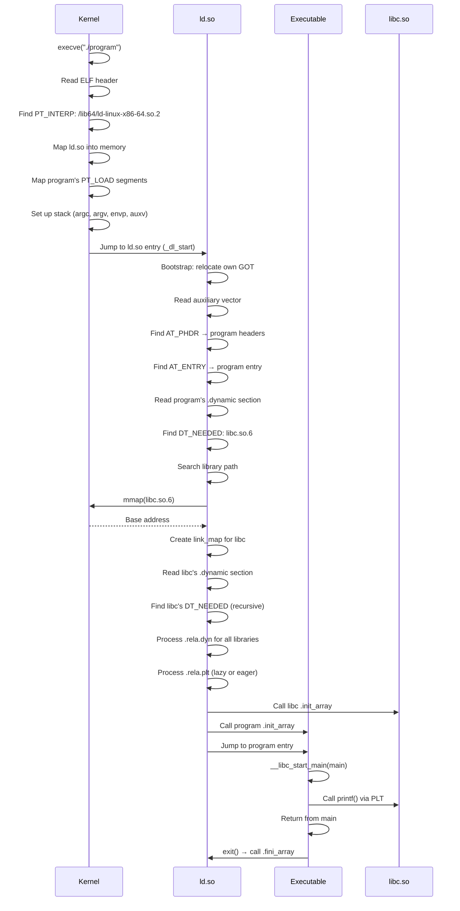
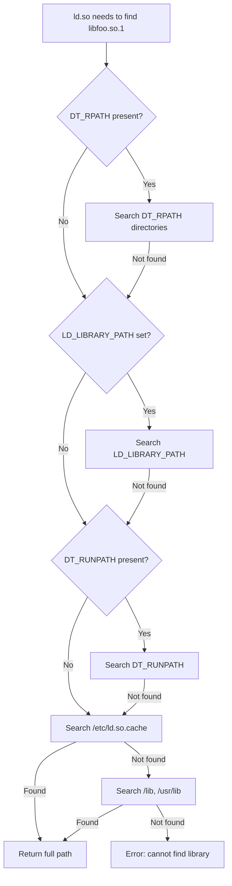
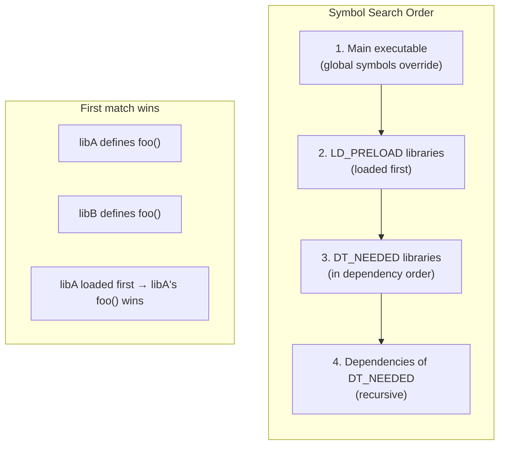

# Chapter 225: The Dynamic Loader

## 1. Intuition

The **dynamic loader** (`ld.so` on Linux, also known as the runtime linker or dynamic linker) is the program that loads shared libraries into a process's address space and resolves symbol references at runtime. It is the bridge between the static world of ELF files on disk and the dynamic world of running processes in memory.

### The Bootstrap Problem

The dynamic loader faces a unique challenge: it must load itself before it can load anything else. It cannot rely on `libc` (which it's responsible for loading), cannot use `malloc()` (which is in `libc`), and cannot call `printf()` for debugging. The loader is entirely self-contained.

On Linux, the process is:
1. The kernel reads the executable's `PT_INTERP` segment, which contains the path to the dynamic loader (e.g., `/lib64/ld-linux-x86-64.so.2`).
2. The kernel maps the dynamic loader into memory and transfers control to its entry point.
3. The dynamic loader bootstraps itself (sets up its own GOT, resolves its own symbols).
4. It reads the executable's `.dynamic` section to find all `DT_NEEDED` dependencies.
5. It recursively loads all required shared libraries.
6. It resolves all symbol references and applies relocations.
7. It calls initialization functions (`.init`, `.init_array`).
8. It transfers control to the executable's entry point.

### The Dynamic Loader IS a Shared Library

The dynamic loader (`ld-linux-x86-64.so.2`) is itself an ELF shared library (`ET_DYN`). It's special because:
- It's the first thing loaded (by the kernel)
- It must be completely self-sufficient (no libc dependency)
- It uses a custom, stripped-down startup sequence
- It has its own `_start` entry point that bootstraps the loading process

## 2. Architecture

### 2.1 Dynamic Loader Components

```
+---------------------------+
| Dynamic Loader (ld.so)    |
+---------------------------+
| Bootstrap                 |  ← Self-initialization
| Object Mapper             |  ← mmap shared libraries
| Symbol Resolver           |  ← Look up symbols in loaded libraries
| Relocation Processor      |  ← Apply .rela.dyn and .rela.plt
| Initialization Engine     |  ← Call .init/.init_array functions
| Lazy Binding Trampoline   |  ← PLT resolution at runtime
| Cache Reader              |  ← Parse /etc/ld.so.cache
| Configuration             |  ← Process LD_* environment variables
+---------------------------+
```

### 2.2 Loading Sequence

```
1. Kernel execve()
   ├─ Read ELF header
   ├─ Find PT_INTERP → "/lib64/ld-linux-x86-64.so.2"
   ├─ Map ld.so into memory
   ├─ Map executable's PT_LOAD segments
   ├─ Set up stack (argc, argv, envp, auxv)
   └─ Jump to ld.so entry point

2. ld.so Bootstrap
   ├─ Self-relocate (fix up ld.so's own GOT)
   ├─ Set up internal data structures
   └─ Read auxiliary vector from stack

3. Load Executable
   ├─ Read executable's .dynamic section
   ├─ Find DT_NEEDED entries
   └─ Create link_map for executable

4. Load Dependencies (recursive)
   ├─ For each DT_NEEDED:
   │   ├─ Search for library (RPATH, RUNPATH, cache, default)
   │   ├─ Open and mmap the library
   │   ├─ Read its .dynamic section
   │   ├─ Add to link_map chain
   │   └─ Recursively process its DT_NEEDED
   └─ Build complete dependency graph

5. Relocate
   ├─ Process .rela.dyn (GOT relocations)
   ├─ If lazy binding: set up PLT stubs
   ├─ If eager binding (-z,now): resolve all PLT entries
   └─ Apply R_X86_64_RELATIVE, R_X86_64_GLOB_DAT, etc.

6. Initialize
   ├─ Call DT_INIT functions (in dependency order)
   └─ Call DT_INIT_ARRAY functions (in dependency order)

7. Transfer Control
   └─ Jump to executable's entry point (main via __libc_start_main)
```

### 2.3 Environment Variables

The dynamic loader respects several environment variables:

| Variable | Description |
|----------|-------------|
| `LD_LIBRARY_PATH` | Additional library search paths |
| `LD_PRELOAD` | Libraries to load before all others |
| `LD_DEBUG` | Enable debug output (libs, symbols, reloc, etc.) |
| `LD_TRACE_LOADED_OBJECTS` | Like `ldd` — show library dependencies |
| `LD_BIND_NOW` | Disable lazy binding (resolve all at startup) |
| `LD_AUDIT` | Load an auditing library (LD_AUDIT mechanism) |
| `LD_PROFILE` | Profile a shared library |
| `LD_ORIGIN_PATH` | Override $ORIGIN resolution |

## 3. Kernel Implementation

### 3.1 The ELF Interpreter

The kernel finds the dynamic loader path from the executable's `PT_INTERP` segment:

```c
// From fs/binfmt_elf.c (simplified)
static int load_elf_binary(struct linux_binprm *bprm)
{
    // ... read ELF header, program headers ...

    // Find PT_INTERP
    for (i = 0; i < elf_ex->e_phnum; i++) {
        if (elf_phdata[i].p_type == PT_INTERP) {
            // Read the interpreter path
            char *elf_interpreter = kmalloc(elf_phdata[i].p_filesz + 1, GFP_KERNEL);
            kernel_read(bprm->file, elf_phdata[i].p_offset,
                       elf_interpreter, elf_phdata[i].p_filesz);

            // Typical value: "/lib64/ld-linux-x86-64.so.2"

            // Open the interpreter
            interpreter = open_exec(elf_interpreter);

            // Read interpreter's ELF header
            // Map interpreter's segments
            // ...

            break;
        }
    }

    // If interpreter found, transfer control to it
    if (interpreter) {
        // Map interpreter at its preferred address or random address
        interp_load_addr = load_elf_interp(...);

        // Set AT_BASE in auxiliary vector
        // Entry point is interpreter's entry point
        elf_entry = interp_entry;
    } else {
        // No interpreter — static executable
        elf_entry = elf_ex->e_entry;
    }

    // Set up auxiliary vector
    NEW_AUX_ENT(AT_PHDR, load_bias + exec->e_phoff);
    NEW_AUX_ENT(AT_PHNUM, exec->e_phnum);
    NEW_AUX_ENT(AT_ENTRY, exec->e_entry);
    NEW_AUX_ENT(AT_BASE, interp_load_addr);
    NEW_AUX_ENT(AT_PAGESZ, PAGE_SIZE);

    // Transfer control
    start_thread(regs, elf_entry, bprm->p);
}
```

### 3.2 Auxiliary Vector Details

The kernel passes critical information to the dynamic loader via the auxiliary vector:

```c
// From include/uapi/linux/elf.h
#define AT_NULL     0   // End of vector
#define AT_IGNORE   1   // Entry should be ignored
#define AT_PHDR     3   // Program headers for executable
#define AT_PHENT    4   // Size of program header entry
#define AT_PHNUM    5   // Number of program headers
#define AT_PAGESZ   6   // System page size
#define AT_BASE     7   // Base address of interpreter
#define AT_FLAGS    8   // Flags
#define AT_ENTRY    9   // Entry point of executable
#define AT_NOTELF   10  // Program is not ELF
#define AT_UID      11  // Real UID
#define AT_EUID     12  // Effective UID
#define AT_GID      13  // Real GID
#define AT_EGID     14  // Effective GID
#define AT_HWCAP    16  // Machine-dependent hints about processor capabilities
#define AT_CLKTCK   17  // Frequency of times()
#define AT_SECURE   23  // Secure mode (setuid, etc.)
#define AT_BASE_PLATFORM 24  // String identifying real platform
#define AT_RANDOM   25  // Address of 16 random bytes
#define AT_HWCAP2   26  // Extended machine-dependent hints
#define AT_SYSINFO_EHDR 33  // Address of VDSO ELF header
```

### 3.3 The vDSO

The kernel provides a special shared library called the **vDSO** (virtual Dynamic Shared Object) that is mapped into every process. It contains fast implementations of certain system calls (e.g., `gettimeofday`, `clock_gettime`) that can be executed in user space without a context switch.

The dynamic loader finds the vDSO via `AT_SYSINFO_EHDR` in the auxiliary vector and adds it to the link map.

## 4. Source Code References

### 4.1 glibc Dynamic Loader

The glibc dynamic loader is the most important implementation:

- **`elf/rtld.c`** — Main entry point (`_dl_start`, `_dl_start_final`, `dl_main`)
- **`elf/dl-load.c`** — Library loading (`_dl_map_object`, `open_path`, `open_verify`)
- **`elf/dl-lookup.c`** — Symbol lookup (`_dl_lookup_symbol_x`, `do_lookup_x`)
- **`elf/dl-reloc.c`** — Relocation processing (`_dl_relocate_object`)
- **`elf/dl-deps.c`** — Dependency resolution (`_dl_map_object_deps`)
- **`elf/dl-cache.c`** — `/etc/ld.so.cache` handling
- **`elf/dl-version.c`** — Symbol versioning
- **`elf/dl-fini.c`** — Finalization
- **`elf/dl-addr.c`** — `dladdr()` implementation
- **`elf/dl-open.c`** — `dlopen()` implementation
- **`elf/dl-close.c`** — `dlclose()` implementation
- **`elf/dl-error.c`** — Error handling
- **`elf/dl-misc.c`** — Miscellaneous utilities
- **`sysdeps/x86_64/dl-machine.h`** — x86-64 specific code
- **`sysdeps/x86_64/dl-trampoline.S`** — PLT trampoline assembly

### 4.2 musl Dynamic Loader

musl's dynamic linker is simpler and more readable:

- **`ldso/dynlink.c`** — Entire dynamic linker (~2500 lines)
- Known for clean, understandable code
- Good for learning how dynamic linking works

### 4.3 Key Entry Points

```c
// glibc: elf/rtld.c
void _dl_start(void)
{
    // Bootstrap: relocate ld.so itself
    // Then call _dl_start_final
}

static void _dl_start_final(void *arg)
{
    // Set up basic structures
    // Call dl_main to do the real work
}

static void dl_main(const ElfW(Phdr) *phdr,
                    ElfW(Word) phnum,
                    ElfW(Addr) *user_entry)
{
    // This is where the real loading happens:
    // 1. Parse auxiliary vector
    // 2. Find the executable's .dynamic section
    // 3. Load all DT_NEEDED dependencies
    // 4. Sort dependencies (topological order)
    // 5. Relocate everything
    // 6. Call initialization functions
    // 7. Return to executable entry point
}
```

## 5. Data Structures

### 5.1 The Link Map

The link map is the central data structure of the dynamic loader:

```c
// From glibc: include/link.h (simplified)
struct link_map {
    Elf64_Addr l_addr;        // Difference between loaded address and ELF address
    char *l_name;              // Absolute file name
    Elf64_Dyn *l_ld;           // Dynamic section pointer
    struct link_map *l_next;    // Next in chain
    struct link_map *l_prev;    // Previous in chain

    // Symbol lookup
    const Elf64_Sym *l_symtab;  // Symbol table
    const char *l_strtab;        // String table
    const Elf64_Sym *l_gnu_symtab;  // GNU hash table symbols
    uint32_t *l_gnu_buckets;    // GNU hash buckets
    uint32_t *l_gnu_chain;      // GNU hash chains

    // Relocations
    const Elf64_Rela *l_rela;   // Relocation table
    int l_rela_count;            // Number of relocations

    // Versioning
    const Elf64_Versym *l_versyms;  // Symbol versions

    // Initialization
    Elf64_Addr l_init;          // DT_INIT function
    Elf64_Addr l_fini;          // DT_FINI function
    Elf64_Addr *l_init_array;   // DT_INIT_ARRAY
    size_t l_init_array_size;
    Elf64_Addr *l_fini_array;   // DT_FINI_ARRAY
    size_t l_fini_array_size;

    // Flags
    int l_flags;                 // Various flags
    int l_flags_1;               // DF_1_* flags

    // Search list
    struct r_search_path_struct l_rpath;
};
```

### 5.2 The Global Link Map Chain

All loaded libraries are linked together in a chain:

```c
// The head of the link map chain
struct link_map *_dl_loaded;

// The link map for the executable itself
struct link_map *_dl_main_map;

// The link map for the dynamic linker itself
struct link_map _dl_rtld_map;
```

### 5.3 The Global Scope

The symbol search scope is an ordered list of link maps:

```c
struct r_scope_elem {
    struct link_map **r_list;   // Array of link map pointers
    unsigned int r_nlist;       // Number of entries
};

// Each link map has its own scope
struct link_map {
    // ...
    struct r_scope_elem l_searchlist;  // Direct dependencies
    struct r_scope_elem l_symbolic_rlist;  // Symbolic search list
};
```

### 5.4 /etc/ld.so.cache

The cache file maps SONAMEs to full paths for fast lookup:

```c
// From glibc: elf/dl-cache.c
struct cache_file {
    char magic[sizeof CACHEMAGIC - 1];  // "ld.so-1.7.0"
    uint32_t nlibs;                       // Number of entries
    struct file_entry {
        int32_t flags;           // Flags
        uint32_t osversion;      // OS version
        uint32_t key;            // Offset to SONAME string
        uint32_t value;          // Offset to full path string
    } libs[nlibs];
};
```

```bash
# View cache contents
ldconfig -p
# Shows all cached libraries

# Rebuild cache
ldconfig

# Cache file location
# /etc/ld.so.cache (binary format, not human-readable)
```

## 6. C/Assembly Examples

### 6.1 Using dlopen/dlsym/dlclose

```c
// dynlinker_demo.c — Complete dlopen/dlsym/dlclose example
#include <stdio.h>
#include <stdlib.h>
#include <dlfcn.h>

int main(void)
{
    // Open the math library
    void *handle = dlopen("libm.so.6", RTLD_LAZY);
    if (!handle) {
        fprintf(stderr, "dlopen: %s\n", dlerror());
        return 1;
    }

    // Clear any existing error
    dlerror();

    // Look up cos() function
    double (*cos_func)(double) = (double (*)(double))dlsym(handle, "cos");
    char *error = dlerror();
    if (error) {
        fprintf(stderr, "dlsym: %s\n", error);
        dlclose(handle);
        return 1;
    }

    // Use the function
    printf("cos(0) = %f\n", cos_func(0.0));
    printf("cos(π) = %f\n", cos_func(3.14159265358979));

    // Look up a data symbol
    double *nan_val = (double *)dlsym(handle, "nan");
    error = dlerror();
    if (!error) {
        printf("NaN value: %f\n", *nan_val);
    }

    // Get info about a loaded library
    Dl_info info;
    if (dladdr((void *)cos_func, &info)) {
        printf("Function from: %s\n", info.dli_fname);
        printf("Symbol name:   %s\n", info.dli_sname);
    }

    // Close the library
    dlclose(handle);
    return 0;
}
```

```bash
gcc -o dynlinker_demo dynlinker_demo.c -ldl
./dynlinker_demo
```

### 6.2 LD_PRELOAD — Function Interposition

```c
// malloc_hook.c — Interpose malloc() to track allocations
#define _GNU_SOURCE
#include <stdio.h>
#include <stdlib.h>
#include <dlfcn.h>

static int alloc_count = 0;
static size_t total_bytes = 0;

// Original malloc pointer
static void *(*real_malloc)(size_t) = NULL;

// Our replacement malloc
void *malloc(size_t size)
{
    if (!real_malloc) {
        // Get the real malloc from libc
        real_malloc = (void *(*)(size_t))dlsym(RTLD_NEXT, "malloc");
    }

    void *ptr = real_malloc(size);
    if (ptr) {
        alloc_count++;
        total_bytes += size;
        // Uncomment for verbose output:
        // fprintf(stderr, "malloc(%zu) = %p (total: %d allocs, %zu bytes)\n",
        //         size, ptr, alloc_count, total_bytes);
    }
    return ptr;
}

// Destructor to print summary
__attribute__((destructor))
static void print_summary(void)
{
    fprintf(stderr, "\n=== Malloc Summary ===\n");
    fprintf(stderr, "Total allocations: %d\n", alloc_count);
    fprintf(stderr, "Total bytes:       %zu\n", total_bytes);
}
```

```bash
# Build the interposition library
gcc -shared -fPIC -o malloc_hook.so malloc_hook.c -ldl

# Use it with any program
LD_PRELOAD=./malloc_hook.so ls
# Shows malloc summary at the end

LD_PRELOAD=./malloc_hook.so cat /dev/null
# Different allocation pattern
```

### 6.3 Implementing a Minimal Dynamic Loader

```c
// mini_loader.c — Minimal dynamic loader demonstration
// This is educational only — real ld.so is much more complex
#include <stdio.h>
#include <stdlib.h>
#include <string.h>
#include <elf.h>
#include <fcntl.h>
#include <unistd.h>
#include <sys/mman.h>
#include <sys/stat.h>

// Load an ELF shared library into memory
void *load_so(const char *path)
{
    int fd = open(path, O_RDONLY);
    if (fd < 0) {
        perror("open");
        return NULL;
    }

    struct stat st;
    fstat(fd, &st);

    // Read ELF header
    Elf64_Ehdr ehdr;
    read(fd, &ehdr, sizeof(ehdr));

    // Verify it's an ELF shared object
    if (memcmp(ehdr.e_ident, ELFMAG, SELFMAG) != 0 ||
        ehdr.e_type != ET_DYN) {
        fprintf(stderr, "Not a shared object\n");
        close(fd);
        return NULL;
    }

    // Read program headers
    Elf64_Phdr *phdrs = malloc(ehdr.e_phentsize * ehdr.e_phnum);
    lseek(fd, ehdr.e_phoff, SEEK_SET);
    read(fd, phdrs, ehdr.e_phentsize * ehdr.e_phnum);

    // Find the load address range
    Elf64_Addr min_addr = UINT64_MAX;
    Elf64_Addr max_addr = 0;
    for (int i = 0; i < ehdr.e_phnum; i++) {
        if (phdrs[i].p_type != PT_LOAD)
            continue;
        if (phdrs[i].p_vaddr < min_addr)
            min_addr = phdrs[i].p_vaddr;
        Elf64_Addr end = phdrs[i].p_vaddr + phdrs[i].p_memsz;
        if (end > max_addr)
            max_addr = end;
    }

    // Map the entire range
    size_t map_size = max_addr - min_addr;
    void *base = mmap(NULL, map_size,
                      PROT_READ | PROT_WRITE | PROT_EXEC,
                      MAP_PRIVATE | MAP_ANONYMOUS, -1, 0);
    if (base == MAP_FAILED) {
        perror("mmap");
        free(phdrs);
        close(fd);
        return NULL;
    }

    // Map each PT_LOAD segment
    for (int i = 0; i < ehdr.e_phnum; i++) {
        if (phdrs[i].p_type != PT_LOAD)
            continue;

        void *seg_addr = (char *)base + phdrs[i].p_vaddr - min_addr;
        lseek(fd, phdrs[i].p_offset, SEEK_SET);
        read(fd, seg_addr, phdrs[i].p_filesz);

        // Zero-fill .bss (memsz > filesz)
        if (phdrs[i].p_memsz > phdrs[i].p_filesz) {
            memset((char *)seg_addr + phdrs[i].p_filesz, 0,
                   phdrs[i].p_memsz - phdrs[i].p_filesz);
        }
    }

    free(phdrs);
    close(fd);

    printf("Loaded %s at %p\n", path, base);
    return base;
}

int main(int argc, char *argv[])
{
    if (argc < 2) {
        fprintf(stderr, "Usage: %s <shared-library>\n", argv[0]);
        return 1;
    }

    void *lib = load_so(argv[1]);
    if (!lib) return 1;

    // In a real loader, we would:
    // 1. Parse .dynamic section
    // 2. Load DT_NEEDED dependencies
    // 3. Process relocations
    // 4. Call initialization functions

    printf("Library loaded successfully (minimal loader)\n");
    return 0;
}
```

### 6.4 LD_DEBUG Tracing

```bash
# Trace library loading
LD_DEBUG=libs ./program 2>&1 | head -20
# Shows: searching for libraries, opening, mapping

# Trace symbol resolution
LD_DEBUG=symbols ./program 2>&1 | head -20
# Shows: symbol lookup, which library provides it

# Trace relocations
LD_DEBUG=reloc ./program 2>&1 | head -20
# Shows: relocation processing

# Trace initialization
LD_DEBUG=init ./program 2>&1
# Shows: constructor/destructor calls

# Everything (very verbose)
LD_DEBUG=all ./program 2>&1 | wc -l
# Can produce millions of lines
```

### 6.5 dl_iterate_phdr — Inspect Loaded Libraries

```c
// dl_iterate.c — List all loaded shared libraries
#define _GNU_SOURCE
#include <link.h>
#include <stdio.h>

static int callback(struct dl_phdr_info *info, size_t size, void *data)
{
    printf("Name: %-30s", info->dlpi_name[0] ? info->dlpi_name : "(executable)");
    printf("  Base: %p", (void *)info->dlpi_addr);
    printf("  Phdrs: %d\n", info->dlpi_phnum);

    for (int i = 0; i < info->dlpi_phnum; i++) {
        const Elf64_Phdr *phdr = &info->dlpi_phdr[i];
        if (phdr->p_type == PT_LOAD) {
            printf("    LOAD: vaddr=0x%lx size=0x%lx flags=%c%c%c\n",
                   phdr->p_vaddr, phdr->p_memsz,
                   phdr->p_flags & PF_R ? 'R' : '-',
                   phdr->p_flags & PF_W ? 'W' : '-',
                   phdr->p_flags & PF_X ? 'E' : '-');
        }
    }
    return 0;
}

int main(void)
{
    dl_iterate_phdr(callback, NULL);
    return 0;
}
```

```bash
gcc -o dl_iterate dl_iterate.c
./dl_iterate
# Shows all loaded libraries with their segments
```

## 7. Diagrams

### 7.1 Dynamic Loader Boot Sequence



### 7.2 Library Search Process



### 7.3 Symbol Resolution Priority



## 8. Common Pitfalls

### 8.1 LD_LIBRARY_PATH Security

`LD_LIBRARY_PATH` is ignored for setuid/setgid programs (by glibc's dynamic loader). This prevents privilege escalation attacks:

```bash
# This does NOT work for setuid binaries:
LD_LIBRARY_PATH=/tmp/evil ./setuid_program
# glibc ignores LD_LIBRARY_PATH for secure executives
```

### 8.2 LD_PRELOAD Limitations

`LD_PRELOAD` only works with dynamically linked programs:

```bash
# Works:
LD_PRELOAD=./hook.so ./dynamic_program

# Does NOT work:
LD_PRELOAD=./hook.so ./static_program
# Static programs don't use ld.so
```

### 8.3 dlopen() Errors

Common `dlopen()` failures:
- Library not found (check `LD_LIBRARY_PATH`, `ldconfig`)
- Missing dependency (check `ldd`)
- Symbol not found (check `nm -D`)
- Wrong architecture (32-bit vs 64-bit)
- Missing permissions

```bash
# Debug dlopen failures
LD_DEBUG=libs ./program  # Shows search paths
ldd libfoo.so            # Shows dependencies
```

### 8.4 dlclose() Doesn't Always Unload

The dynamic loader uses reference counting for `dlclose()`. A library is only actually unloaded when its reference count reaches zero. If another library still depends on it, it stays loaded.

### 8.5 Constructor/Destructor Order

Initialization order matters:
- Dependencies are initialized before the libraries that depend on them
- Within a single library, `.init_array` functions are called in order
- Destruction happens in reverse order

If you have circular dependencies, the order may be unpredictable.

### 8.6 /etc/ld.so.cache Staleness

After installing new libraries, always run `ldconfig`:

```bash
# Install library
cp libfoo.so.1 /usr/lib/
# FORGOT: ldconfig
./program  # Error: libfoo.so.1 not found

# Fix:
ldconfig
./program  # Works
```

## 9. Best Practices

### 9.1 Use LD_PRELOAD for Debugging

```bash
# Track memory allocations
LD_PRELOAD=./malloc_track.so ./program

# Replace a buggy library
LD_PRELOAD=./fixed_libc.so ./program
```

### 9.2 Use LD_DEBUG for Troubleshooting

```bash
LD_DEBUG=libs ./program     # Library loading
LD_DEBUG=symbols ./program  # Symbol resolution
LD_DEBUG=all ./program 2>&1 | grep "symbol"  # Filtered output
```

### 9.3 Use dlopen() with RTLD_NOW for Error Detection

```bash
# RTLD_NOW: resolve all symbols immediately (catches errors early)
void *h = dlopen("libfoo.so", RTLD_NOW);

# RTLD_LAZY: defer resolution (may fail later at first call)
void *h = dlopen("libfoo.so", RTLD_LAZY);
```

### 9.4 Use dl_iterate_phdr for Introspection

```c
dl_iterate_phdr(callback, NULL);
// Lists all loaded libraries — useful for debugging and profiling
```

### 9.5 Audit Libraries

Use `LD_AUDIT` for advanced monitoring:

```c
// audit.c — Audit library (simplified)
#include <link.h>
#include <stdio.h>

unsigned int la_version(unsigned int version) {
    return version;
}

char *la_objsearch(const char *name, uintptr_t *cookie, unsigned int flag) {
    printf("Searching: %s\n", name);
    return (char *)name;
}
```

```bash
gcc -shared -fPIC -o audit.so audit.c
LD_AUDIT=./audit.so ./program
# Shows all library searches
```

### 9.6 Prefer RTLD_NEXT Over Hardcoded Paths

```c
// BAD: Hardcoded path
void *libc = dlopen("/lib/x86_64-linux-gnu/libc.so.6", RTLD_LAZY);

// GOOD: Use RTLD_NEXT to find the next definition
void *real_func = dlsym(RTLD_NEXT, "my_func");
```

## 10. Exercises

### Exercise 1: LD_DEBUG Analysis
Run `LD_DEBUG=all ./hello 2>&1` on a simple program. Categorize the output into: library loading, symbol resolution, relocation processing, and initialization. Count the number of each type.

### Exercise 2: LD_PRELOAD Interposition
Create an `LD_PRELOAD` library that intercepts `open()` and logs all file opens (path, flags, return value). Test it with `ls`, `cat`, and a custom program.

### Exercise 3: Library Search Path
Create a shared library and place it in a non-standard directory. Demonstrate three ways to make the dynamic loader find it: `LD_LIBRARY_PATH`, `DT_RUNPATH`, and `ldconfig`.

### Exercise 4: dl_iterate_phdr Tool
Write a program that uses `dl_iterate_phdr()` to list all loaded shared libraries, their base addresses, and the number of `PT_LOAD` segments. Compare output with `/proc/self/maps`.

### Exercise 5: dlopen Plugin Discovery
Write a program that scans a directory for `.so` files, loads each with `dlopen()`, and calls a standard `plugin_info()` function to get the plugin's name and version.

### Exercise 6: Audit Library
Write an `LD_AUDIT` library that counts how many times each library is searched during program startup. Use `la_objsearch()` and print a summary at exit.

## 11. References

1. **glibc dynamic linker source:**
   - `elf/rtld.c` — Main entry point
   - `elf/dl-load.c` — Library loading
   - `elf/dl-lookup.c` — Symbol resolution
   - `elf/dl-reloc.c` — Relocation processing
   - `elf/dl-deps.c` — Dependency resolution

2. **musl dynamic linker:**
   - `ldso/dynlink.c` — Clean, readable implementation

3. **Linux man pages:**
   - `man 8 ld.so` — Dynamic linker documentation
   - `man 3 dlopen` — Dynamic loading API
   - `man 3 dladdr` — Address to symbol lookup
   - `man 1 ldd` — List dynamic dependencies
   - `man 8 ldconfig` — Configure dynamic linker

4. **"How to Write Shared Libraries" by Ulrich Drepper:**
   - https://www.akkadia.org/drepper/dsohowto.pdf

5. **Solaris Linker and Libraries Guide:**
   - https://docs.oracle.com/cd/E88353_01/html/E37839/

6. **LD_AUDIT specification:**
   - https://man7.org/linux/man-pages/man7/rtld-audit.7.html

7. **"Learning Linux Binary Analysis" by Ryan O'Neill** — Dynamic linker internals
