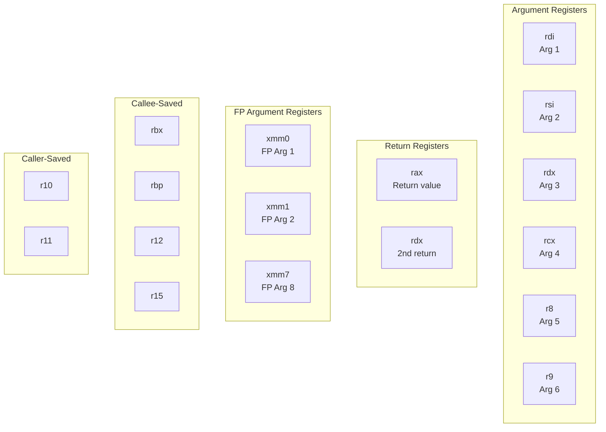
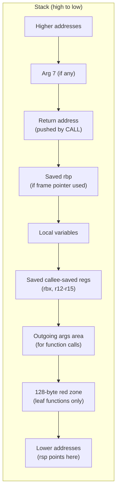
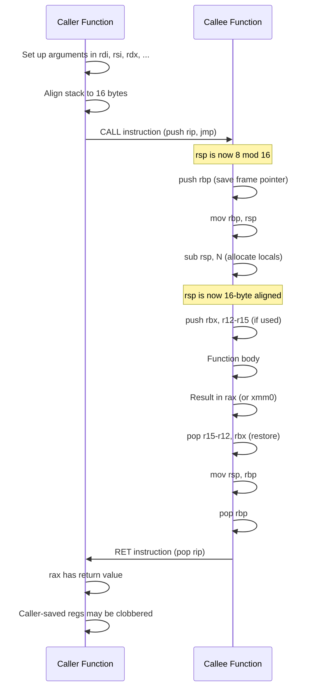

# Chapter 226: ELF ABI

## 1. Intuition

The **Application Binary Interface (ABI)** is the contract between compiled code and the system it runs on. While the ELF format defines the structure of binary files, the ABI defines how that code **behaves** at runtime: how functions are called, how the stack is organized, which registers are used for what purpose, and how data is laid out in memory.

Think of the ABI as the "rules of the road" for compiled code. The ELF format is the car (how the binary is structured), but the ABI is the traffic laws (how the code interacts with other code and the operating system). Two compilers can produce different ELF files that are ABI-compatible — they can call each other's functions because they follow the same calling conventions.

### The System V ABI

The **System V ABI** (often abbreviated SysV ABI) is the dominant ABI on Linux, x86-64, ARM, and many other architectures. It specifies:
- **Calling conventions**: How function arguments are passed, how return values are delivered
- **Stack layout**: How the stack grows, what's on it, alignment requirements
- **Register usage**: Which registers are caller-saved, callee-saved, or reserved
- **Data types**: Sizes and alignment of basic types
- **Object file format**: ELF structure (covered in previous chapters)
- **System call interface**: How to invoke the kernel

## 2. Architecture

### 2.1 ABI Layers

```
+---------------------------+
| Language ABI              |  ← C++ name mangling, exception handling
+---------------------------+
| Calling Convention        |  ← Argument passing, return values
+---------------------------+
| Stack Frame Layout        |  ← Local variables, saved registers
+---------------------------+
| Register Convention       |  ← Which registers do what
+---------------------------+
| Data Layout               |  ← Struct padding, alignment
+---------------------------+
| System Call Convention    |  ← How to invoke the kernel
+---------------------------+
| ELF Object Format         |  ← File structure (previous chapters)
+---------------------------+
```

### 2.2 Architecture-Specific ABIs

Each architecture has its own ABI specification:

| Architecture | ABI Document |
|-------------|--------------|
| x86-64 | System V AMD64 ABI |
| x86-32 | System V i386 ABI |
| AArch64 | Procedure Call Standard for the Arm 64-bit Architecture (AAPCS64) |
| ARM (32-bit) | Procedure Call Standard for the Arm Architecture (AAPCS) |
| RISC-V | RISC-V Calling Conventions |
| MIPS | MIPS O32/N32/N64 ABIs |
| PowerPC | PowerPC ELF ABI |

## 3. x86-64 Calling Convention

### 3.1 Register Usage

The x86-64 ABI defines the following register roles:

| Register | Purpose | Saved By |
|----------|---------|----------|
| `rax` | Return value (integer) | Caller |
| `rbx` | General purpose | **Callee** |
| `rcx` | 4th integer argument | Caller |
| `rdx` | 3rd integer argument / 2nd return | Caller |
| `rsi` | 2nd integer argument | Caller |
| `rdi` | 1st integer argument | Caller |
| `rbp` | Frame pointer (optional) | **Callee** |
| `rsp` | Stack pointer | Special |
| `r8` | 5th integer argument | Caller |
| `r9` | 6th integer argument | Caller |
| `r10` | Temporary / static chain pointer | Caller |
| `r11` | Temporary | Caller |
| `r12`-`r15` | General purpose | **Callee** |
| `xmm0`-`xmm7` | Floating-point arguments / return | Caller |
| `xmm8`-`xmm15` | Floating-point temporaries | Caller |

**Caller-saved** registers may be clobbered by a function call. The caller must save them if needed after the call.

**Callee-saved** registers must be preserved by the called function. If a function uses them, it must save and restore them.

### 3.2 Integer Argument Passing

The first 6 integer/pointer arguments are passed in registers:

```
Argument 1: rdi
Argument 2: rsi
Argument 3: rdx
Argument 4: rcx
Argument 5: r8
Argument 6: r9
Argument 7+: pushed on stack (right to left)
```

```c
void func(int a, int b, int c, int d, int e, int f, int g)
//         rdi   rsi   rdx   rcx   r8    r9    stack
```

### 3.3 Floating-Point Argument Passing

Floating-point arguments use `xmm0`-`xmm7`:

```
FP Argument 1: xmm0
FP Argument 2: xmm1
FP Argument 3: xmm2
...
FP Argument 8: xmm7
FP Argument 9+: pushed on stack
```

```c
double func(double a, double b, double c, double d,
            double e, double f, double g, double h, double i)
//           xmm0   xmm1   xmm2   xmm3   xmm4   xmm5   xmm6   xmm7   stack
```

### 3.4 Mixed Integer and Floating-Point

When arguments are a mix of integers and floats, each uses its own register file:

```c
void func(int a, double b, int c, double d)
//         rdi   xmm0     rsi   xmm1
```

Note: The second integer argument goes in `rsi` (not `rdx`), because the register assignment is based on argument position within each class, not overall argument position.

### 3.5 Return Values

| Type | Register |
|------|----------|
| Integer (up to 64 bits) | `rax` |
| Integer (65-128 bits) | `rax` (low) + `rdx` (high) |
| Floating-point | `xmm0` |
| Struct (≤16 bytes, all integer) | `rax` + `rdx` |
| Struct (≤16 bytes, all FP) | `xmm0` + `xmm1` |
| Struct (≤16 bytes, mixed) | `rax` + `xmm0` (or similar) |
| Struct (>16 bytes) | Caller-allocated hidden pointer in `rdi` |

### 3.6 Variadic Functions

For variadic functions (like `printf`):
- `rax` (or `al`) must be set to the number of XMM registers used (0-8)
- This allows the callee to save XMM registers if needed
- Integer arguments follow the normal convention

```c
// printf("format", arg1, arg2)
// rdi = "format"
// rsi = arg1
// rdx = arg2
// rax = number of XMM registers used (0 if no float args)
```

## 4. Stack Layout

### 4.1 Stack Frame Structure

```
High addresses
+---------------------------+
| Argument 7+               |  ← Pushed by caller (if >6 integer args)
+---------------------------+
| Return address            |  ← Pushed by CALL instruction
+---------------------------+
| Saved rbp (optional)      |  ← Pushed by callee (frame pointer)
+---------------------------+
| Local variables           |  ← Allocated by callee (sub rsp, N)
+---------------------------+
| Saved callee-saved regs   |  ← rbx, r12-r15 (if used)
+---------------------------+
| Outgoing arguments        |  ← For calls to other functions
| (if >6 integer args)      |
+---------------------------+
| ... stack grows down ...  |
+---------------------------+
Low addresses (rsp points here)
```

### 4.2 Stack Alignment

The x86-64 ABI requires **16-byte stack alignment** at the point of a `CALL` instruction. This means:
- When a function is entered (after `CALL`), `rsp` is 16-byte aligned + 8 (because `CALL` pushes the 8-byte return address)
- The function must align `rsp` to 16 bytes before making further calls
- `movdqa` (aligned SSE) requires 16-byte aligned operands on the stack

```
After CALL instruction:
  rsp = ...8 (8 mod 16)

After prologue (push rbp):
  rsp = ...0 (0 mod 16)

After sub rsp, N (where N is 16-aligned):
  rsp = ...0 (0 mod 16) — ready for function calls
```

### 4.3 The Red Zone

The x86-64 ABI defines a **128-byte red zone** below `rsp`:
- Functions can use this area without adjusting `rsp`
- Signal handlers and interrupts will not clobber it
- Only leaf functions (functions that don't call other functions) can safely use it
- The kernel interrupt handler respects the red zone

```
+---------------------------+
| ...                       |
+---------------------------+
| rsp points here           |
+---------------------------+
| 128-byte red zone         |  ← Leaf functions can use this
| (safe from signal/        |     without adjusting rsp
|  interrupt clobbering)    |
+---------------------------+
```

### 4.4 Frame Pointer (rbp)

The use of `rbp` as a frame pointer is optional on x86-64. Modern compilers often omit it (`-fomit-frame-pointer`) for better register allocation:

**With frame pointer:**
```nasm
func:
    push rbp
    mov  rbp, rsp
    sub  rsp, 32          ; Local variables
    ; ... function body ...
    mov  rsp, rbp
    pop  rbp
    ret
```

**Without frame pointer (modern):**
```nasm
func:
    sub  rsp, 32          ; Local variables
    ; ... function body ...
    add  rsp, 32
    ret
```

## 5. AArch64 Calling Convention

### 5.1 Register Usage

| Register | Purpose | Saved By |
|----------|---------|----------|
| `x0`-`x7` | Arguments / return values | Caller |
| `x8` | Indirect result location | Caller |
| `x9`-`x15` | Temporary | Caller |
| `x16`-`x17` | Intra-procedure call (IP0, IP1) | Caller |
| `x18` | Platform register (reserved) | — |
| `x19`-`x28` | General purpose | **Callee** |
| `x29` | Frame pointer (FP) | **Callee** |
| `x30` | Link register (LR) | Caller |
| `sp` | Stack pointer | Special |
| `xzr` | Zero register | — |
| `v0`-`v7` | FP arguments / return | Caller |
| `v8`-`v15` | FP callee-saved (low 64 bits) | **Callee** |
| `v16`-`v31` | FP temporary | Caller |

### 5.2 Argument Passing (AArch64)

```
Integer args: x0, x1, x2, x3, x4, x5, x6, x7
FP args:      v0, v1, v2, v3, v4, v5, v6, v7
Args 9+:      Stack (8-byte aligned)
Return:       x0 (integer), v0 (FP)
Struct return: x8 (pointer to caller-allocated space)
```

### 5.3 AArch64 Stack Frame

```
+---------------------------+
| Callee's arguments (if >8)|
+---------------------------+
| Saved x30 (LR)           |  ← Link register
+---------------------------+
| Saved x29 (FP)           |  ← Frame pointer
+---------------------------+
| Local variables           |
+---------------------------+
| Saved callee-saved regs   |  ← x19-x28
+---------------------------+
| Saved FP callee-saved     |  ← v8-v15 (low 64 bits)
+---------------------------+
```

AArch64 requires **16-byte stack alignment** at all times.

## 6. Kernel Implementation

### 6.1 System Call Convention (x86-64)

The kernel's system call ABI on x86-64:

```
System call number: rax
Arguments:          rdi, rsi, rdx, r10, r8, r9 (note: r10, not rcx)
Return value:       rax (negative errno on error)
Clobbered:          rcx, r11 (and rax)
Instruction:        syscall
```

```nasm
; write(1, buffer, length)
mov rax, 1          ; SYS_write
mov rdi, 1          ; fd = stdout
lea rsi, [buffer]   ; buffer address
mov rdx, length     ; byte count
syscall              ; invoke kernel
; rax = bytes written (or negative errno)
```

### 6.2 System Call Convention (AArch64)

```
System call number: x8
Arguments:          x0, x1, x2, x3, x4, x5
Return value:       x0 (negative errno on error)
Instruction:        svc #0
```

### 6.3 Signal Handler Stack Frame

When the kernel delivers a signal, it creates a special stack frame for the signal handler:

```c
// From arch/x86/include/asm/sigcontext.h
struct sigcontext {
    unsigned long r8, r9, r10, r11;
    unsigned long r12, r13, r14, r15;
    unsigned long rdi, rsi;
    unsigned long rbp, rbx;
    unsigned long rdx, rax;
    unsigned long rcx, rsp;
    unsigned long rip, eflags;
    unsigned short cs, gs, fs, ss;
    // ... FP state, etc.
};
```

The kernel pushes this frame onto the stack before transferring control to the signal handler. The handler returns via `sigreturn()` system call, which restores the original context.

## 7. Source Code References

- **x86-64 ABI specification**: https://gitlab.com/x86-psABIs/x86-64-ABI
- **AArch64 ABI**: https://github.com/ARM-software/abi-aa/blob/main/aapcs64/aapcs64.rst
- **GCC calling convention implementation**: `gcc/config/i386/i386.cc`
- **Linux kernel system call entry**: `arch/x86/entry/entry_64.S`
- **Linux kernel signal handling**: `arch/x86/kernel/signal.c`
- **glibc system call wrappers**: `sysdeps/unix/sysv/linux/x86_64/syscall.S`

## 8. Data Structures

### 8.1 ELF Auxiliary Vector (ABI-Related)

The auxiliary vector passes ABI information from the kernel to user space:

```c
typedef struct {
    long a_type;
    union {
        long a_val;
    } a_un;
} auxv_t;

// ABI-relevant entries:
// AT_HWCAP    — CPU feature flags (SSE, AVX, etc.)
// AT_HWCAP2   — Extended CPU features
// AT_CLKTCK   — Clock ticks per second
// AT_FLAGS    — Processor flags
// AT_SECURE   — Secure execution mode
```

### 8.2 ELF Program Header Flags (ABI)

The `p_flags` field in program headers encodes memory protection:

```c
#define PF_X  0x1  // Execute
#define PF_W  0x2  // Write
#define PF_R  0x4  // Read

// Common combinations:
// PF_R | PF_X           = Code (read-execute)
// PF_R                  = Read-only data
// PF_R | PF_W           = Data (read-write)
// PF_R | PF_W | PF_X    = Special (e.g., JIT code)
```

### 8.3 ELF Section Flags (ABI)

```c
#define SHF_WRITE     0x1  // Writable at runtime
#define SHF_ALLOC     0x2  // Occupies memory at runtime
#define SHF_EXECINSTR 0x4  // Contains executable instructions
#define SHF_MERGE     0x10 // May be merged
#define SHF_STRINGS   0x20 // Contains null-terminated strings
#define SHF_INFO_LINK 0x40 // sh_info contains section header index
#define SHF_LINK_ORDER 0x80 // Preserve link order
#define SHF_OS_NONCONFORMING 0x100 // Non-standard OS-specific handling
#define SHF_GROUP     0x200 // Member of a section group
#define SHF_TLS       0x400 // Thread-Local Storage
```

### 8.4 ELF Symbol Binding and Type (ABI)

```c
// Binding (upper 4 bits of st_info)
#define STB_LOCAL   0  // Local scope
#define STB_GLOBAL  1  // Global scope
#define STB_WEAK    2  // Weak global

// Type (lower 4 bits of st_info)
#define STT_NOTYPE  0  // No type
#define STT_OBJECT  1  // Data object
#define STT_FUNC    2  // Function
#define STT_SECTION 3  // Section
#define STT_FILE    4  // Source file
#define STT_COMMON  5  // Common data
#define STT_TLS     6  // Thread-local storage

// Visibility (st_other)
#define STV_DEFAULT   0  // Default visibility
#define STV_INTERNAL  1  // Processor-specific
#define STV_HIDDEN    2  // Not exported
#define STV_PROTECTED 3  // Exported but not overridable
```

## 9. C/Assembly Examples

### 9.1 Calling Convention Demonstration

```nasm
; calling_conv.asm — x86-64 calling convention demo
BITS 64

section .text
global demo_call

; void demo_call(int a, int b, int c, int d, int e, int f, int g)
; Arguments: rdi, rsi, rdx, rcx, r8, r9, [rsp+8]
demo_call:
    ; Save callee-saved registers we'll use
    push rbx
    push r12

    ; Move arguments to callee-saved registers
    mov  r12d, edi          ; a
    mov  ebx, esi           ; b
    ; rdx = c, rcx = d, r8 = e, r9 = f

    ; Access 7th argument from stack
    mov  eax, [rsp + 16]    ; g (after two pushes: 8+8=16 offset)

    ; Call another function (stack must be 16-byte aligned)
    ; We pushed 2 registers (16 bytes), so rsp is aligned
    sub  rsp, 8             ; Align to 16 bytes (2 pushes + sub = 24 bytes from entry)
    call another_function
    add  rsp, 8

    ; Restore callee-saved registers
    pop  r12
    pop  rbx
    ret

another_function:
    ; This function receives no arguments in this example
    ; Just return
    xor  eax, eax
    ret
```

### 9.2 Stack Frame Layout

```c
// stack_frame.c — Examine stack frame layout
#include <stdio.h>
#include <stdint.h>

void print_stack(const char *label)
{
    // Get current stack pointer (approximate)
    uintptr_t rsp;
    __asm__ volatile ("mov %%rsp, %0" : "=r"(rsp));

    printf("%s:\n", label);
    printf("  rsp = 0x%lx\n", rsp);
    printf("  rsp mod 16 = %lu\n", rsp % 16);

    // Print stack contents (carefully!)
    uintptr_t *sp = (uintptr_t *)rsp;
    for (int i = 0; i < 8; i++) {
        printf("  [rsp+%d] = 0x%lx\n", i * 8, sp[i]);
    }
}

void inner_func(int x)
{
    int local = 42;
    print_stack("inner_func");
    printf("  local = %d at %p\n", local, (void *)&local);
}

void outer_func(int a, int b, int c, int d, int e, int f, int g)
{
    int local_outer = 100;
    print_stack("outer_func");
    printf("  local_outer = %d at %p\n", local_outer, (void *)&local_outer);
    inner_func(a + b);
}

int main(void)
{
    print_stack("main");
    outer_func(1, 2, 3, 4, 5, 6, 7);
    return 0;
}
```

```bash
gcc -O0 -o stack_frame stack_frame.c
./stack_frame
```

### 9.3 Register Preservation

```nasm
; register_preserve.asm — Demonstrate callee-saved vs caller-saved
BITS 64

section .text

; Function that preserves callee-saved registers
global callee_func
callee_func:
    ; MUST preserve: rbx, rbp, r12-r15
    push rbx
    push r12

    ; Use callee-saved registers
    mov  rbx, rdi           ; Save argument
    mov  r12, 42            ; Use r12

    ; Call another function (rbx and r12 are preserved)
    call some_other_func

    ; rbx and r12 still have our values!
    add  rax, rbx
    add  rax, r12

    pop  r12
    pop  rbx
    ret

some_other_func:
    ; Can freely clobber: rax, rcx, rdx, rsi, rdi, r8-r11
    ; MUST preserve: rbx, rbp, r12-r15
    mov  rax, 10
    ret
```

### 9.4 Variadic Function Implementation

```c
// variadic.c — Implementing a variadic function (ABI details)
#include <stdio.h>
#include <stdarg.h>

// The compiler generates code that:
// 1. Sets AL = number of XMM registers used
// 2. Saves XMM registers to stack (if AL > 0)
// 3. Saves integer argument registers to stack

int my_printf(const char *fmt, ...)
{
    va_list args;
    va_start(args, fmt);

    int count = 0;
    const char *p = fmt;
    while (*p) {
        if (*p == '%') {
            p++;
            switch (*p) {
                case 'd':
                    printf("%d", va_arg(args, int));
                    count++;
                    break;
                case 's':
                    printf("%s", va_arg(args, const char *));
                    count++;
                    break;
                case 'f':
                    printf("%f", va_arg(args, double));
                    count++;
                    break;
                case '%':
                    putchar('%');
                    break;
            }
        } else {
            putchar(*p);
        }
        p++;
    }

    va_end(args);
    return count;
}

int main(void)
{
    my_printf("Hello %s, x=%d, pi=%f\n", "World", 42, 3.14);
    return 0;
}
```

### 9.5 System Call Interface

```nasm
; syscall_demo.asm — Direct system calls (no libc)
BITS 64

section .data
msg:    db "Hello from syscall!", 10
msglen equ $ - msg

section .text
global _start

_start:
    ; write(1, msg, msglen)
    mov rax, 1              ; SYS_write
    mov rdi, 1              ; fd = stdout
    lea rsi, [rel msg]      ; buffer
    mov rdx, msglen         ; length
    syscall

    ; exit(0)
    mov rax, 60             ; SYS_exit
    xor rdi, rdi            ; status = 0
    syscall
```

```bash
nasm -f elf64 -o syscall_demo.o syscall_demo.asm
ld -o syscall_demo syscall_demo.o
./syscall_demo
```

### 9.6 Struct Return Value ABI

```c
// struct_return.c — How structs are returned (ABI rules)
#include <stdio.h>

// Small struct (≤16 bytes, all integers) → returned in rax + rdx
typedef struct {
    long a;  // → rax
    long b;  // → rdx
} small_struct_t;

small_struct_t make_small(void) {
    small_struct_t s = {42, 100};
    return s;
}

// Large struct (>16 bytes) → caller passes hidden pointer in rdi
typedef struct {
    long a, b, c;  // 24 bytes → hidden pointer
} large_struct_t;

large_struct_t make_large(void) {
    large_struct_t s = {1, 2, 3};
    return s;
}

int main(void) {
    small_struct_t small = make_small();
    printf("small: a=%ld, b=%ld\n", small.a, small.b);

    large_struct_t large = make_large();
    printf("large: a=%ld, b=%ld, c=%ld\n", large.a, large.b, large.c);

    return 0;
}
```

```bash
gcc -O0 -S struct_return.c -o struct_return.s
# Examine the assembly to see ABI in action
```

## 10. Diagrams

### 10.1 x86-64 Register Convention



### 10.2 Stack Frame Layout



### 10.3 Function Call Flow



## 11. Common Pitfalls

### 11.1 Stack Alignment Violation

If the stack is not 16-byte aligned before a `CALL`, SSE instructions that require aligned data may crash:

```nasm
; WRONG: Stack misaligned
push rax         ; rsp = 8 mod 16
call some_func   ; After CALL: rsp = 0 mod 16
                 ; But callee expects rsp = 8 mod 16 on entry!

; CORRECT: Maintain alignment
push rax         ; rsp = 8 mod 16
sub  rsp, 8      ; rsp = 0 mod 16
call some_func   ; After CALL: rsp = 8 mod 16 ✓
add  rsp, 8
```

### 11.2 Forgetting Caller-Saved Registers

```nasm
; WRONG: rdi is caller-saved, but we rely on it after the call
mov  rdi, important_value
call some_function
; rdi may be clobbered!
mov  rax, rdi  ; BUG!

; CORRECT: Save caller-saved register
mov  rdi, important_value
push rdi
call some_function
pop  rdi         ; Restore
mov  rax, rdi    ; Now it's safe
```

### 11.3 Incorrect Variadic Function Implementation

For variadic functions, `rax` (or `al`) must be set to the number of XMM registers used. Forgetting this causes the callee to skip saving XMM registers, potentially corrupting them:

```nasm
; WRONG: Not setting rax for variadic call
mov  rdi, fmt
mov  rsi, arg1
call printf       ; printf expects al = number of XMM args

; CORRECT:
mov  rdi, fmt
mov  rsi, arg1
xor  eax, eax     ; No XMM arguments
call printf
```

### 11.4 Red Zone Violation

Only leaf functions can use the red zone. Non-leaf functions that use the red zone will have it clobbered by the `CALL` instruction (which pushes the return address into the red zone):

```nasm
; WRONG: Non-leaf function using red zone
non_leaf_func:
    mov [rsp - 8], rdi    ; Store in red zone
    call other_func        ; Pushes return address → clobbers red zone!
    mov rdi, [rsp - 8]    ; WRONG: return address overwrote our data!

; CORRECT: Non-leaf function adjusts rsp
non_leaf_func:
    sub rsp, 24            ; Allocate space (not in red zone)
    mov [rsp + 8], rdi     ; Store safely
    call other_func
    mov rdi, [rsp + 8]     ; Safe
    add rsp, 24
    ret
```

### 11.5 AArch64 Link Register (LR) Confusion

On AArch64, the return address is in `x30` (LR), not on the stack. Functions that call other functions must save LR:

```asm
; WRONG: Non-leaf function doesn't save LR
func:
    bl other_func    ; Overwrites LR!
    ret              ; Returns to other_func's return address!

; CORRECT: Save LR
func:
    stp x29, x30, [sp, -16]!  ; Save FP and LR
    mov x29, sp
    bl other_func
    ldp x29, x30, [sp], 16    ; Restore FP and LR
    ret
```

### 11.6 ABI Mismatch Between Languages

Different languages may have different ABI expectations:
- C and Fortran generally follow the System V ABI
- C++ adds name mangling, exception handling, `this` pointer
- Rust follows the C ABI by default (`extern "C"`)
- Go has its own ABI (registers for arguments, different stack management)

Mixing languages without explicit `extern "C"` (or equivalent) causes ABI mismatches.

## 12. Best Practices

### 12.1 Use Compiler-Generated Assembly as Reference

```bash
# See how the compiler implements the ABI
gcc -O2 -S -masm=intel function.c
```

### 12.2 Use -Wall -Wextra for ABI Warnings

The compiler warns about many ABI-related issues:
- Incorrect function prototypes
- Missing return values
- Stack alignment issues

### 12.3 Use extern "C" for C/C++ Interoperability

```cpp
// C++ code calling C functions
extern "C" {
    #include "c_header.h"
}
```

### 12.4 Verify Stack Alignment in Assembly

```bash
# Use GDB to check stack alignment
(gdb) p $rsp
(gdb) p $rsp % 16
# Should be 0 or 8 depending on context
```

### 12.5 Use Compiler Intrinsics for System Calls

Instead of raw assembly, use compiler-provided intrinsics:

```c
#include <sys/syscall.h>
long result = syscall(SYS_write, 1, buffer, length);
```

### 12.6 Document ABI Contracts

When writing libraries that will be used from multiple languages, document the ABI:
- Calling convention
- Register usage
- Struct layout (padding, alignment)
- Error handling (return codes, errno)

## 13. Exercises

### Exercise 1: Calling Convention Verification
Write a C program that calls a function with 8 integer arguments. Compile to assembly (`gcc -S`) and verify that the first 6 arguments are in registers and arguments 7-8 are on the stack.

### Exercise 2: Stack Frame Analysis
Write a recursive function and use GDB to examine the stack frames at each recursion level. Identify the return address, saved registers, and local variables.

### Exercise 3: Register Preservation Test
Write two functions: one that calls the other. Use inline assembly to set all callee-saved registers to known values before the call. Verify they're preserved after the call returns.

### Exercise 4: Variadic Function ABI
Implement a simplified `printf` using `<stdarg.h>`. Compile to assembly and examine how `va_start`, `va_arg`, and `va_end` map to register/stack access.

### Exercise 5: Cross-ABI Comparison
Compile the same C function for x86-64 and AArch64 (using a cross-compiler if available). Compare the generated assembly for:
- Argument passing
- Return value handling
- Stack frame setup

### Exercise 6: System Call Interface
Write a "Hello World" program using direct system calls (no libc) for both x86-64 (`syscall` instruction) and AArch64 (`svc #0` instruction). Compare the system call conventions.

## 14. References

1. **System V Application Binary Interface (x86-64):**
   - https://gitlab.com/x86-psABIs/x86-64-ABI

2. **AArch64 Procedure Call Standard:**
   - https://github.com/ARM-software/abi-aa/blob/main/aapcs64/aapcs64.rst

3. **System V ABI (generic):**
   - https://www.sco.com/developers/gabi/latest/contents.html

4. **RISC-V Calling Conventions:**
   - https://github.com/riscv-non-isa/riscv-elf-psabi-doc

5. **Linux system call conventions:**
   - https://man7.org/linux/man-pages/man2/syscall.2.html

6. **"Computer Systems: A Programmer's Perspective" by Bryant & O'Hallaron:**
   - Chapter 3 (Machine-Level Representation of Programs)

7. **GCC internals documentation:**
   - https://gcc.gnu.org/onlinedocs/gccint/

8. **Agner Fog's calling convention guide:**
   - https://www.agner.org/optimize/calling_conventions.pdf
