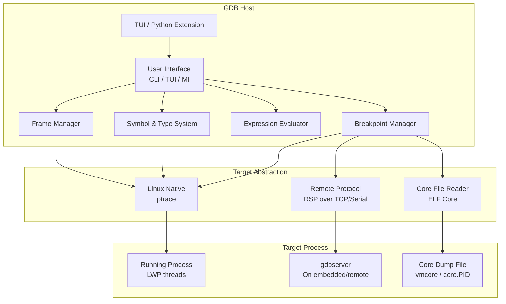
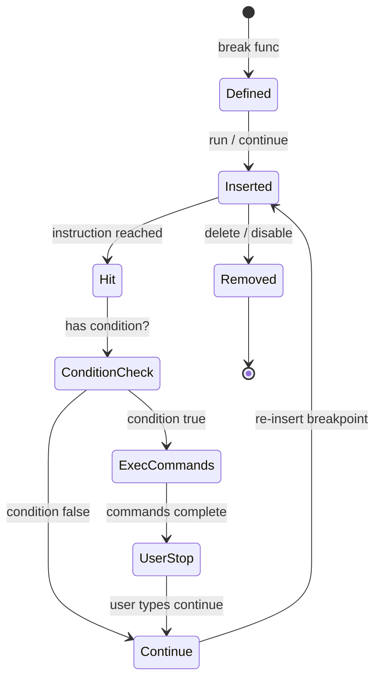
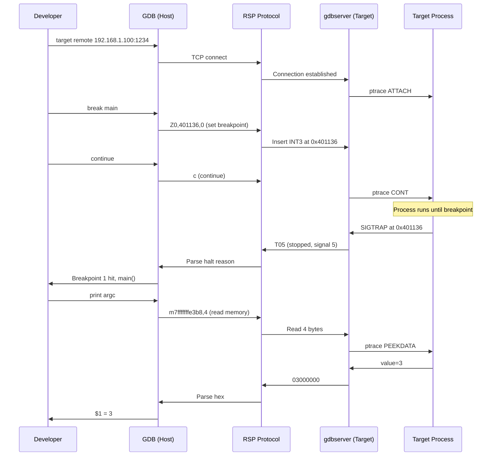

# Chapter 227: GDB — The GNU Debugger

## 1. Intuition

The GNU Debugger (GDB) is the de facto standard debugger for Linux systems. At its core, GDB answers a deceptively simple question: *what is my program doing right now, and why is it doing that?* Every bug ultimately manifests as a divergence between what the programmer intended and what the machine executes. GDB bridges that gap by giving you a controlled window into a running (or crashed) program's state — its memory, registers, call stack, and the values of variables at any point in execution.

Think of GDB as a time machine for your program. You can pause execution at any instruction (breakpoints), examine the state at that frozen moment (print, inspect, backtrace), step forward or backward through instructions, and even modify state on the fly. For post-mortem analysis, GDB reads core dumps — snapshots of a crashed process — and lets you perform the same investigation without needing to reproduce the crash live.

GDB's power lies in its universality. It supports C, C++, Rust, Go, Fortran, Ada, and dozens of other languages compiled to native code. It can attach to running processes, debug remotely over serial or network connections, debug kernel code (when paired with tools like QEMU or kgdb), and be extended with Python scripts for automated analysis.

## 2. Architecture

### 2.1 GDB's Internal Model

GDB maintains an internal representation of the target program's state:

```
┌─────────────────────────────────────────────┐
│                  GDB Process                │
│                                             │
│  ┌──────────┐  ┌──────────┐  ┌───────────┐ │
│  │ Symbol   │  │ Breakpoint│  │ Frame     │ │
│  │ Tables   │  │ Manager  │  │ Stack     │ │
│  └──────────┘  └──────────┘  └───────────┘ │
│  ┌──────────┐  ┌──────────┐  ┌───────────┐ │
│  │ Type     │  │ Expression│  │ Thread    │ │
│  │ System   │  │ Parser   │  │ Manager   │ │
│  └──────────┘  └──────────┘  └───────────┘ │
│  ┌──────────────────────────────────────┐   │
│  │        Target Abstraction Layer      │   │
│  │   (ptrace / remote / core file)      │   │
│  └──────────────────────────────────────┘   │
└─────────────────────────────────────────────┘
           │              │              │
    ┌──────┘     ┌────────┘     ┌────────┘
    ▼            ▼              ▼
 Live Process  Remote Target  Core Dump
 (ptrace)      (gdbserver)    (vmcore)
```

**Target Abstraction Layer:** GDB communicates with the target through a well-defined interface. For local debugging, it uses `ptrace(2)` to inspect and control the target process. For remote debugging, it uses the GDB Remote Serial Protocol (RSP) over TCP or serial. For core dumps, it reads the ELF core file directly.

**Symbol Tables:** GDB reads DWARF debug information (or STABS for older binaries) from the executable to map memory addresses back to source lines, variable names, and type definitions. Without debug symbols (`-g`), GDB can still work but only with raw addresses and register values.

**Breakpoint Manager:** Maintains a list of software breakpoints (replacing instructions with trap instructions) and hardware breakpoints (using CPU debug registers). The manager handles enabling, disabling, and hit counting.

**Frame Stack:** Each function call creates a stack frame. GDB's frame model lets you navigate the call stack and examine local variables in any frame.

### 2.2 The GDB Remote Serial Protocol

When GDB connects to a remote target (gdbserver, QEMU, OpenOCD), it communicates via RSP:

```
┌──────┐    RSP Packets ($...#xx)    ┌──────────┐
│ GDB  │ ◄──────────────────────────►│ gdbserver│
│Client│   TCP / Serial / UDP        │  / QEMU  │
└──────┘                             └──────────┘
```

Key RSP packets:
- `g` / `G` — Read/write all registers
- `m` / `M` — Read/write memory
- `s` / `c` — Step / continue
- `Z0` / `z0` — Set/remove software breakpoint
- `Z2` / `z2` — Set/remove hardware watchpoint
- `?` — Get halt reason
- `qSupported` — Negotiate features

### 2.3 ptrace — The Foundation

Local debugging on Linux is built on `ptrace(2)`:

```c
// GDB's core interaction with target process
ptrace(PTRACE_ATTACH, pid, NULL, NULL);    // Attach to process
ptrace(PTRACE_CONT, pid, NULL, NULL);      // Continue execution
ptrace(PTRACE_SINGLESTEP, pid, NULL, NULL); // Single instruction
ptrace(PTRACE_PEEKDATA, pid, addr, NULL);  // Read memory
ptrace(PTRACE_POKEDATA, pid, addr, data);  // Write memory
ptrace(PTRACE_GETREGS, pid, NULL, &regs);  // Read registers
```

## 3. Usage Examples

### 3.1 Basic Debugging Session

Compile with debug symbols:

```bash
gcc -g -O0 -o myprogram myprogram.c
```

Start GDB:

```bash
gdb ./myprogram
```

```
(gdb) break main                    # Set breakpoint at main()
Breakpoint 1 at 0x401136: file myprogram.c, line 10.

(gdb) run arg1 arg2                 # Start program with arguments
Starting program: /home/user/myprogram arg1 arg2
Breakpoint 1, main (argc=3, argv=0x7fffffffe3b8) at myprogram.c:10
10        int total = 0;

(gdb) list                          # Show source code
5       #include <stdlib.h>
6
7       int main(int argc, char *argv[]) {
8           int count = argc;
9           int *array = malloc(count * sizeof(int));
10          int total = 0;
11
12          for (int i = 0; i < count; i++) {
13              array[i] = atoi(argv[i]);
14              total += array[i];
15          }

(gdb) next                          # Step over (source line)
12          for (int i = 0; i < count; i++) {

(gdb) step                          # Step into function calls
(gdb) print count                   # Print variable value
$1 = 3

(gdb) print array                   # Print pointer
$2 = (int *) 0x5555555592a0

(gdb) print *array@count            # Print array of 'count' elements
$3 = {0, 0, 0}

(gdb) continue                      # Continue to next breakpoint
Continuing.
```

### 3.2 Breakpoints in Detail

```bash
# Break at function name
(gdb) break process_data

# Break at file:line
(gdb) break parser.c:142

# Break at address (useful for stripped binaries)
(gdb) break *0x401234

# Conditional breakpoint — only stop when condition is true
(gdb) break process_data if len > 100

# Breakpoint with command list — auto-execute commands on hit
(gdb) break compute
(gdb) commands
Type commands for breakpoint(s), one per line.
End with a line saying just "end".
> print input_array
> print output_array
> continue
> end

# Hardware breakpoint (survives program modification, works on read-only memory)
(gdb) hbreak *0x401234

# Temporary breakpoint (deleted after first hit)
(gdb) tbreak main

# Catchpoint — break on events
(gdb) catch throw              # C++ exception thrown
(gdb) catch syscall open       # System call
(gdb) catch fork               # Process fork
(gdb) catch exec               # Program exec
```

### 3.3 Watchpoints

Watchpoints stop execution when a memory location changes:

```bash
# Watch a variable — stop when it changes
(gdb) watch global_counter

# Watch an expression — stop when the expression becomes true
(gdb) watch *(int *)0x601000 != 0

# Read watchpoint — stop when value is read
(gdb) rwatch sensitive_data

# Access watchpoint — stop on read or write
(gdb) awatch config_flag

# Hardware watchpoints (limited, typically 4 on x86)
(gdb) info watchpoints
```

### 3.4 Examining State

```bash
# Print variables with type info
(gdb) print mystruct
$1 = {name = 0x5555555592a0 "hello", value = 42, flags = 0x7}

# Pretty-print C++ STL containers (enabled by default with libstdc++)
(gdb) print myvector
$2 = std::vector of length 3 = {10, 20, 30}

# Examine memory directly
(gdb) x/16xb 0x601000          # 16 hex bytes
(gdb) x/10i $pc                # 10 instructions at program counter
(gdb) x/s 0x5555555592a0       # Print as string
(gdb) x/4dw &array             # 4 decimal words

# Display expressions automatically on each stop
(gdb) display/i $pc            # Show current instruction
(gdb) display total            # Show 'total' variable

# Backtrace (call stack)
(gdb) bt                       # Full backtrace
(gdb) bt full                  # With local variables
(gdb) bt 5                     # Top 5 frames

# Frame navigation
(gdb) frame 3                  # Switch to frame 3
(gdb) up                       # Move up one frame
(gdb) down                     # Move down one frame

# Register inspection
(gdb) info registers
(gdb) info registers rax rbx
(gdb) print $rax               # Individual register
```

### 3.5 Debugging Multi-Threaded Programs

```bash
# List all threads
(gdb) info threads
  Id   Target Id                    Frame
* 1    Thread 0x7ffff7fc4740 (LWP 12345) "myapp" main () at main.c:42
  2    Thread 0x7ffff77c3700 (LWP 12346) "myapp" worker () at worker.c:18
  3    Thread 0x7ffff6fc2700 (LWP 12347) "myapp" io_thread () at io.c:55

# Switch to another thread
(gdb) thread 2

# Break in specific thread
(gdb) break worker.c:25 thread 2

# Apply command to all threads
(gdb) thread apply all bt

# Debug deadlocks
(gdb) thread apply all bt full
(gdb) info threads
(gdb) thread 1
(gdb) bt
(gdb) thread 2
(gdb) bt
# Look for mutex waits in both threads
```

### 3.6 Debugging Core Dumps

```bash
# Generate a core dump
ulimit -c unlimited
./myprogram    # crashes, produces core.12345

# Load core dump into GDB
gdb ./myprogram core.12345

# GDB shows the crash point
# Program terminated with signal SIGSEGV, Segmentation fault.
# #0  0x0000555555555159 in process (ptr=0x0) at crash.c:12
# 12        *ptr = 42;

(gdb) bt                     # Full backtrace at crash
(gdb) info locals            # Local variables at crash
(gdb) print ptr              # Why did it crash?
$1 = (int *) 0x0             # NULL pointer dereference!

# Generate core dump from running process
(gdb) generate-core-file     # While debugging live process
(gdb) gcore core.dump         # Alternative command
```

### 3.7 Remote Debugging with gdbserver

On the target machine:
```bash
# Install gdbserver on target
apt install gdbserver

# Start program under gdbserver
gdbserver :1234 ./myprogram

# Or attach to running process
gdbserver --attach :1234 12345
```

On the host machine:
```bash
gdb ./myprogram
(gdb) target remote 192.168.1.100:1234
Remote debugging from 192.168.1.100:1234
(gdb) break main
(gdb) continue
```

### 3.8 Reverse Debugging (Record and Replay)

```bash
# Record execution history
(gdb) target record-full

# Run until crash
(gdb) continue
# Program crashes

# Now go BACKWARDS in time
(gdb) reverse-continue          # Run backwards to previous stop
(gdb) reverse-next              # Step backwards (source line)
(gdb) reverse-step              # Step backwards (into functions)
(gdb) reverse-finish            # Go back to before current function

# Set a bookmark
(gdb) bookmark myposition
(gdb) # ... continue debugging ...
(gdb) record goto myposition    # Jump back to bookmark
```

### 3.9 GDB Python Scripting

```python
# Save as pretty_print.py and load with: source pretty_print.py

import gdb

class DumpHashTable(gdb.Command):
    """Dump all entries in a hash table structure."""

    def __init__(self):
        super().__init__("dump-htable", gdb.COMMAND_DATA)

    def invoke(self, arg, from_tty):
        table = gdb.parse_and_eval(arg)
        num_buckets = int(table['num_buckets'])
        buckets = table['buckets']

        for i in range(num_buckets):
            entry = buckets[i]
            while entry != 0:
                key = entry['key'].string()
                val = int(entry['value'])
                print(f"  [{i}] key={key!r}, value={val}")
                entry = entry['next']

        print(f"Total buckets: {num_buckets}")

DumpHashTable()

# Python pretty-printer for custom types
class MyVectorPrinter:
    def __init__(self, val):
        self.val = val

    def to_string(self):
        size = int(self.val['size_'])
        data = self.val['data_']
        items = []
        for i in range(size):
            items.append(str(data[i]))
        return f"MyVector[{size}] = [{', '.join(items)}]"

    def display_hint(self):
        return 'array'

def lookup_type(val):
    if str(val.type) == 'MyVector':
        return MyVectorPrinter(val)
    return None

gdb.pretty_printers.append(lookup_type)
```

Use in GDB:
```
(gdb) source pretty_print.py
(gdb) dump-htable my_hash_table
  [0] key="name", value=42
  [1] key="version", value=3
Total buckets: 16
```

### 3.10 TUI (Text User Interface) Mode

```bash
# Enable TUI mode
(gdb) layout src          # Source code window
(gdb) layout asm          # Assembly window
(gdb) layout split        # Source + assembly
(gdb) layout regs         # Source + registers

# Navigation
(gdb) winheight src +5    # Make source window bigger
(gdb) winheight regs -3   # Make register window smaller
(gdb) focus cmd           # Focus on command window
(gdb) refresh             # Redraw screen

# Toggle between TUI and normal mode
Ctrl+x, a
```

## 4. Source Code References

GDB's source code is maintained in the GNU Binutils-GDB repository:

| Component | File | Description |
|-----------|------|-------------|
| Breakpoint engine | `gdb/breakpoint.c` | Breakpoint creation, hit detection, conditions |
| Target abstraction | `gdb/target.c` | Target ops interface (ptrace, remote, core) |
| ptrace target | `gdb/linux-nat.c` | Linux native debugging via ptrace |
| Remote protocol | `gdb/remote.c` | RSP client implementation |
| Frame handling | `gdb/frame.c` | Stack frame management |
| Symbol reading | `gdb/dwarf2/read.c` | DWARF debug info parsing |
| Python bindings | `gdb/python/python.c` | Python scripting interface |
| Record/replay | `gdb/record.c` | Execution recording and replay |

Key system call used by GDB:
- `ptrace(2)` — The kernel interface for process inspection and control
- `/proc/[pid]/maps` — Memory map of target process
- `/proc/[pid]/status` — Thread and signal information

## 5. Diagrams

### GDB Debugging Architecture



### Breakpoint Lifecycle



### Remote Debugging Flow



## 6. Common Pitfalls

### 6.1 Missing Debug Symbols

**Problem:** Variables show as `<optimized out>`, source lines don't match, backtraces are incomplete.

**Cause:** Compiled without `-g` or with optimizations that rearrange code.

**Solution:**
```bash
# Always compile with debug info for debugging
gcc -g -O0 -o myapp myapp.c

# For release builds with debug info
gcc -g -O2 -o myapp myapp.c

# Check if binary has debug info
readelf --debug-dump=info myapp | head -20
file myapp    # Should mention "not stripped" or "with debug_info"

# Install debug symbols for system libraries
apt install libc6-dbg           # Debian/Ubuntu
debuginfo-install glibc         # RHEL/CentOS
```

### 6.2 Optimized Code Confusion

**Problem:** Stepping jumps around randomly, variables are `<optimized out>`, breakpoints hit in unexpected order.

**Cause:** Compiler optimizations (-O2, -O3) inline functions, reorder code, eliminate dead variables.

**Solution:**
```bash
# Debug with -O0 (no optimization)
gcc -g -O0 -o debug_build source.c

# Or keep some optimization but with debug-friendly options
gcc -g -Og -o debug_build source.c  # -Og: optimize for debugging

# Tell GDB to handle optimized code
(gdb) set print frame-arguments all
(gdb) set debugvarobj 1    # Debug variable objects
```

### 6.3 Attaching to the Wrong Thread

**Problem:** `bt` shows a different thread than expected when attaching to a multi-threaded program.

**Solution:**
```bash
(gdb) attach 12345
(gdb) info threads          # See all threads
(gdb) thread 1              # Usually the crashing thread
(gdb) bt                    # Now inspect the right stack
```

### 6.4 GDB Hanging on ptrace

**Problem:** GDB hangs when trying to attach, or child process won't stop.

**Cause:** `ptrace_scope` security setting.

**Solution:**
```bash
# Check current setting
cat /proc/sys/kernel/yama/ptrace_scope
# 0 = no restrictions, 1 = parent only (default), 2 = admin only, 3 = no ptrace

# Temporary fix
sudo sysctl kernel.yama.ptrace_scope=0

# Permanent fix (add to /etc/sysctl.d/10-ptrace.conf)
kernel.yama.ptrace_scope = 0

# Better: use capabilities instead of disabling restrictions
sudo setcap cap_sys_ptrace=eip /usr/bin/gdb
```

### 6.5 Core Dump Not Generated

**Problem:** Program crashes but no core file appears.

**Solution:**
```bash
# Check core dump limit
ulimit -c                    # Should be "unlimited"

# Enable core dumps
ulimit -c unlimited

# Check core pattern
cat /proc/sys/kernel/core_pattern
# May be piped to systemd-coredump or abrt

# For systemd systems, use coredumpctl
coredumps list
coredumps info myapp
gdb ./myapp /var/lib/systemd/coredump/core.myapp.*

# Set core pattern manually
echo "core.%p.%s.%t" | sudo tee /proc/sys/kernel/core_pattern
```

### 6.6 Stepping Into Library Functions

**Problem:** `step` enters glibc internals instead of user code.

**Solution:**
```bash
(gdb) set step-mode on            # Don't skip functions without debug info
(gdb) set print pretty on        # Prettify struct output

# Skip specific files
(gdb) skip file /usr/include/stdio.h
(gdb) skip function printf

# Install debug info for libraries
apt install libc6-dbg
(gdb) set debug-file-directory /usr/lib/debug
```

## 7. Best Practices

### 7.1 GDB Initialization File (~/.gdbinit)

```
# ~/.gdbinit — Personal GDB configuration

# Pretty printing
set print pretty on
set print array on
set print array-indexes on
set print elements 200

# History
set history save on
set history filename ~/.gdb_history
set history size 10000

# Disassembly
set disassembly-flavor intel

# Safety
set confirm off
set pagination off

# Useful aliases
define ll
    info locals
end
define rr
    info registers
end
define qq
    bt full
end

# Load project-specific scripts
source ~/myproject/.gdbinit
```

### 7.2 Efficient Debugging Workflow

```bash
# 1. Compile with appropriate flags
CFLAGS="-g -O0 -fsanitize=address -fno-omit-frame-pointer"

# 2. Set a catch-all for signals
(gdb) handle SIGSEGV stop print
(gdb) handle SIGABRT stop print

# 3. Use conditional breakpoints to filter noise
(gdb) break process_item if item->type == 42

# 4. Use commands for automated inspection
(gdb) break compute
(gdb) commands
> silent
> printf "compute(%d, %d)\n", a, b
> continue
> end

# 5. Log to file
(gdb) set logging file gdb.log
(gdb) set logging on
(gdb) bt
(gdb) set logging off
```

### 7.3 Debugging Shared Libraries

```bash
# Set breakpoint in shared library (will resolve when loaded)
(gdb) break 'mylib::process'

# Or set pending breakpoints
(gdb) set breakpoint pending on
(gdb) break mylib_process

# Load shared library symbols manually
(gdb) sharedlibrary /path/to/libmylib.so

# Add debug symbol paths
(gdb) set debug-file-directory /usr/lib/debug:/path/to/debug/symbols
```

### 7.4 Post-Mortem Analysis Checklist

```bash
# Load core dump
gdb ./binary core.PID

# Essential investigation steps:
(gdb) bt                        # 1. Where did it crash?
(gdb) bt full                   # 2. With all local variables
(gdb) info registers            # 3. Register state
(gdb) info threads              # 4. All threads
(gdb) thread apply all bt       # 5. All thread stacks
(gdb) x/20i $pc-10              # 6. Disassembly around crash
(gdb) info proc mappings        # 7. Memory map
(gdb) print errno               # 8. Check errno
```

### 7.5 Scripting GDB for Automated Analysis

```bash
# Run GDB commands from a script file
gdb -batch -x analyze.gdb ./myprogram core.12345

# analyze.gdb:
# bt full
# info threads
# thread apply all bt
# print my_global_state
# quit
```

## 8. Exercises

### Exercise 1: Basic Debugging
Compile the following program with `-g`, find and fix the bug using GDB:

```c
#include <stdio.h>
#include <stdlib.h>
#include <string.h>

char *greet(const char *name) {
    char buf[64];
    sprintf(buf, "Hello, %s!", name);
    return buf;  // Bug: returning pointer to local buffer
}

int main() {
    char *msg = greet("World");
    printf("%s\n", msg);
    return 0;
}
```

Steps:
1. Set a breakpoint in `greet()`
2. Examine `buf` address and frame layout
3. Step out of the function and observe the dangling pointer
4. Fix the bug (hint: use `strdup()` or `malloc()`)

### Exercise 2: Watchpoint Investigation
Debug this program that silently corrupts memory:

```c
#include <stdio.h>

int data[4] = {1, 2, 3, 4};
int sentinel = 0xDEADBEEF;

void buggy_write(int index, int value) {
    data[index] = value;
}

int main() {
    buggy_write(5, 42);  // Out of bounds!
    if (sentinel != 0xDEADBEEF) {
        printf("CORRUPTION DETECTED: sentinel = 0x%x\n", sentinel);
    }
    return 0;
}
```

Steps:
1. Set a watchpoint on `sentinel`
2. Run the program — GDB will stop when `sentinel` is overwritten
3. Identify which write caused the corruption
4. Examine the stack trace and memory layout

### Exercise 3: Multi-Threaded Deadlock Analysis
Create a program with two mutexes and two threads that deadlock. Debug it:
1. When the program hangs, attach GDB to it
2. Inspect all thread stacks
3. Identify which threads hold which mutexes
4. Determine the deadlock cycle

### Exercise 4: Core Dump Analysis
Write a program that dereferences a NULL pointer inside a deeply nested call chain. Run it to generate a core dump, then:
1. Load the core dump in GDB
2. Walk the full call stack
3. Identify the NULL pointer at each frame level
4. Determine the root cause

### Exercise 5: Python Scripting
Write a GDB Python command that:
1. Takes a pointer to a linked list head
2. Walks the entire list
3. Prints each node's data value
4. Detects cycles (list loops back to a previous node)

```python
# Template
import gdb

class WalkLinkedList(gdb.Command):
    def __init__(self):
        super().__init__("walk-list", gdb.COMMAND_DATA)

    def invoke(self, arg, from_tty):
        head = gdb.parse_and_eval(arg)
        visited = set()
        node = head
        while node != 0:
            addr = int(node)
            if addr in visited:
                print(f"CYCLE DETECTED at 0x{addr:x}")
                break
            visited.add(addr)
            print(f"  Node 0x{addr:x}: data = {node['data']}")
            node = node['next']

WalkLinkedList()
```

## 9. References

1. **GDB Manual** — https://sourceware.org/gdb/documentation/ — The official GDB reference manual
2. **GDB Internals** — https://sourceware.org/gdb/wiki/Internals — Architecture and development guide
3. **GDB Python API** — https://sourceware.org/gdb/current/onlinedocs/gdb.html/Python-API.html — Python scripting reference
4. **Debugging with GDB** — Stallman, Roland, Pesch, Shebs — Free Software Foundation, 2002
5. **GDB Remote Serial Protocol** — https://sourceware.org/gdb/current/onlinedocs/gdb.html/Remote-Protocol.html
6. **DWARF Debugging Standard** — https://dwarfstd.org/ — The debug information format GDB reads
7. **ptrace(2) man page** — `man 2 ptrace` — The kernel debugging API
8. **Reverse Debugging** — https://sourceware.org/gdb/wiki/ProcessRecord — GDB record and replay
9. **GDB Dashboard** — https://github.com/cyrus-and/gdb-dashboard — Modular visual interface for GDB
10. **Pwndbg** — https://github.com/pwndbg/pwndbg — GDB plugin for exploit development and reverse engineering
