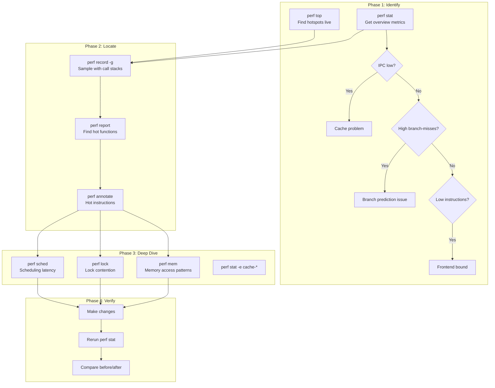
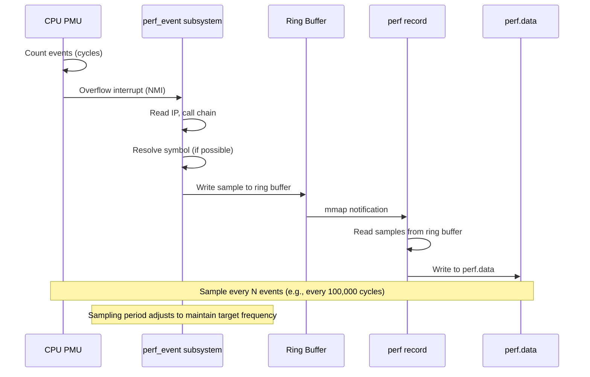
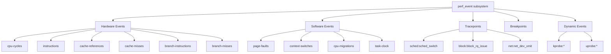

# Chapter 228: perf — Performance Analysis

## 1. Intuition

`perf` is Linux's Swiss Army knife for performance analysis. While GDB tells you *what* your program is doing, `perf` tells you *where it's spending time* — and more importantly, *why*. It leverages hardware performance counters (special CPU registers that count events like cache misses, branch mispredictions, and instruction cycles) and kernel software events to build a detailed picture of system behavior.

The fundamental insight behind `perf` is that most performance problems follow a power-law distribution: a small fraction of code accounts for the majority of execution time or resource consumption. `perf` helps you find that fraction efficiently. Rather than guessing where bottlenecks are, you measure. Rather than instrumenting every function manually, you sample. The result is data-driven optimization that actually moves the needle.

`perf` operates at three levels: **counting** (how many events occurred?), **sampling** (where did they occur?), and **tracing** (what was the sequence of events?). Each level provides progressively more detail at progressively higher overhead. The art of performance analysis is choosing the right level for your question.

## 2. Architecture

### 2.1 The perf Ecosystem

```
┌─────────────────────────────────────────────────────┐
│                    User Space                       │
│                                                     │
│  ┌─────────┐ ┌──────────┐ ┌────────┐ ┌──────────┐  │
│  │perf stat│ │perf record│ │perf top│ │perf trace│  │
│  └────┬────┘ └─────┬────┘ └───┬────┘ └─────┬────┘  │
│       │            │          │             │       │
│  ┌────┴────────────┴──────────┴─────────────┴────┐  │
│  │              libperf (perf library)            │  │
│  └───────────────────┬───────────────────────────┘  │
│                      │                              │
├──────────────────────┼──────────────────────────────┤
│                      │  perf_event_open() syscall    │
├──────────────────────┼──────────────────────────────┤
│                      ▼                              │
│  ┌───────────────────────────────────────────────┐  │
│  │          Kernel perf_event Subsystem          │  │
│  │                                               │  │
│  │  ┌──────────┐  ┌──────────┐  ┌─────────────┐ │  │
│  │  │ Hardware │  │ Software │  │ Tracepoints  │ │  │
│  │  │ Counters │  │ Events   │  │ (static)     │ │  │
│  │  │ (PMU)    │  │          │  │              │ │  │
│  │  └──────────┘  └──────────┘  └─────────────┘ │  │
│  │  ┌──────────┐  ┌──────────┐  ┌─────────────┐ │  │
│  │  │ Intel    │  │ AMD      │  │ ARM SPE      │ │  │
│  │  │ PMU      │  │ PMU      │  │ /CoreSight   │ │  │
│  │  └──────────┘  └──────────┘  └─────────────┘ │  │
│  └───────────────────────────────────────────────┘  │
│                      │                              │
│  ┌───────────────────┴───────────────────────────┐  │
│  │              CPU Hardware                      │  │
│  │  Performance Monitoring Unit (PMU)             │  │
│  │  Fixed counters: cycles, instructions, refs    │  │
│  │  General counters: cache-misses, branches, ... │  │
│  └───────────────────────────────────────────────┘  │
└─────────────────────────────────────────────────────┘
```

### 2.2 The perf_event_open System Call

All perf functionality is accessed through a single system call:

```c
#include <linux/perf_event.h>

int perf_event_open(
    struct perf_event_attr *attr,  // Event configuration
    pid_t pid,                     // Process to monitor (-1 for all)
    int cpu,                       // CPU to monitor (-1 for all)
    int group_fd,                  // Group leader (-1 for independent)
    unsigned long flags            // Flags (e.g., PERF_FLAG_FD_CLOEXEC)
);
```

The returned file descriptor can be:
- `read()` to get counter values
- `mmap()`'d for sample data (ring buffer)
- Used with `ioctl()` for control operations

### 2.3 Event Types

| Category | Events | Description |
|----------|--------|-------------|
| Hardware | `cpu-cycles`, `instructions`, `cache-references`, `cache-misses`, `branch-instructions`, `branch-misses` | CPU PMU counters |
| Software | `page-faults`, `context-switches`, `cpu-migrations`, `minor-faults`, `major-faults` | Kernel software events |
| Tracepoints | `sched:sched_switch`, `block:block_rq_issue`, etc. | Static kernel tracepoints |
| Breakpoints | Memory addresses | Hardware watchpoints |
| Dynamic | `kprobe:*`, `uprobe:*` | Dynamic kernel/user probes |

### 2.4 Sampling vs. Counting

**Counting** (`perf stat`): Reports aggregate counts of events over a period.
```
1,234,567,890  cycles
    456,789,012  instructions    # IPC = 0.37
     12,345,678  cache-misses    # 4.2% miss rate
```

**Sampling** (`perf record`): Periodically records the instruction pointer and call stack, building a statistical profile.
```
Overhead  Command  Shared Object      Symbol
  23.45%  myapp    libc.so.6          [.] memcpy
  15.67%  myapp    myapp              [.] process_data
  10.23%  myapp    libc.so.6          [.] malloc
```

## 3. Usage Examples

### 3.1 perf stat — Aggregate Event Counting

```bash
# Basic statistics for a command
perf stat ./myprogram

# Output:
#  Performance counter stats for './myprogram':
#
#          1,234.56 msec  task-clock                #    0.987 CPUs utilized
#                15       context-switches          #   12.152 /sec
#                 2       cpu-migrations            #    1.620 /sec
#               456       page-faults               #  369.378 /sec
#     3,456,789,012       cycles                    #    2.800 GHz
#     2,345,678,901       instructions              #    0.68  insn per cycle
#       234,567,890       branches                  #  190.006 M/sec
#         5,678,901       branch-misses             #    2.42% of all branches
#       45,678,901       cache-references           #   37.003 M/sec
#        2,345,678       cache-misses               #    5.13% of all cache refs
#
#      1.250567890 seconds time elapsed

# Specific events
perf stat -e cycles,instructions,cache-misses,L1-dcache-load-misses ./myprogram

# System-wide (needs root)
sudo perf stat -a sleep 10

# Per-CPU breakdown
perf stat -e cycles -C 0,1,2,3 ./myprogram

# Count for a running process
perf stat -p 12345 sleep 5

# Repeat measurements for statistical confidence
perf stat -r 10 ./myprogram   # Run 10 times, report mean/stddev

# Detailed metrics (Intel)
perf stat -M IPC -M CacheHitRate ./myprogram

# Group events (counted simultaneously)
perf stat -e '{cycles,instructions}:S1' -e '{cache-references,cache-misses}:S1' ./myprogram
```

### 3.2 perf record and perf report — Sampling Profiling

```bash
# Record a CPU profile
perf record -g ./myprogram               # With call graphs
perf record -F 99 -g ./myprogram         # At 99 Hz frequency
perf record -c 100000 -g ./myprogram     # Every 100K events

# Record with specific event
perf record -e cache-misses -g ./myprogram

# Record system-wide
sudo perf record -a -g sleep 30

# Record for a specific process
perf record -p 12345 -g -- sleep 10

# Generate report
perf report                              # Interactive TUI
perf report --stdio                      # Text output
perf report --sort comm,dso,symbol       # Sort by fields
perf report --call-graph callee          # Call graph mode
perf report -n --stdio                   # With sample counts

# Annotate source code (requires debug info)
perf annotate process_data               # Disassembly with percentages
perf annotate --stdio                    # Text mode

# Generate flame graph
perf script | stackcollapse-perf.pl | flamegraph.pl > flame.svg

# Generate call graph
perf report --gprof --stdio
```

### 3.3 perf top — Live System Profiling

```bash
# Real-time system-wide profiler
sudo perf top

# Profile specific event
sudo perf top -e cache-misses

# Profile specific process
perf top -p 12345

# With call chain display
sudo perf top -g

# Sort by different columns (interactive: press 's')
# Overhead  Shared Object       Symbol
#   15.23%  [kernel]            [k] copy_user_generic_string
#    8.45%  libc.so.6           [.] __memcpy_avx_unaligned
#    5.12%  myapp               [.] process_buffer
```

### 3.4 perf trace — System Call Tracing

```bash
# Trace all system calls
perf trace ./myprogram

# Trace specific syscalls
perf trace -e open,read,write ./myprogram

# Trace with arguments
perf trace -e open -- ./myprogram

# Trace a running process
perf trace -p 12345

# Summary statistics
perf trace --summary ./myprogram

# Trace with call stacks
perf trace -g ./myprogram

# Output:
# 0.000 ( 0.005 ms): myprogram/12345 open(filename: "/etc/ld.so.cache", flags: CLOEXEC) = 3
# 0.012 ( 0.002 ms): myprogram/12345 read(fd: 3, buf: 0x7fff..., count: 4096) = 2048
# 0.018 ( 0.001 ms): myprogram/12345 close(fd: 3) = 0
```

### 3.5 perf mem — Memory Access Profiling

```bash
# Record memory access patterns (requires hardware support)
sudo perf mem record ./myprogram

# Report memory access statistics
perf mem report

# Output:
# Total memory accesses: 1234567
# Loads: 789012 (63.9%)
# Stores: 445555 (36.1%)
#
# Access latency distribution:
#   0-3 cycles:   45.2%  (L1 hit)
#   4-10 cycles:  23.1%  (L2 hit)
#   11-30 cycles: 15.6%  (L3 hit)
#   31+ cycles:   16.1%  (Memory)

# NUMA analysis
sudo perf mem record -t load ./myprogram
perf mem report --sort mem,sym,dso
```

### 3.6 perf lock — Lock Contention Analysis

```bash
# Record lock contention events
sudo perf lock record ./myprogram

# Report lock contention
perf lock report

# Output:
#               Name    acquired  contended  total wait  max wait  min wait
#        &rq->__lock      54321       1234    567.890ms   12.345ms   0.001ms
#   &mm->page_table       12345        567    234.567ms    8.901ms   0.002ms
#
# Contention histogram:
#  &rq->__lock:
#    0-1ms:   ██████████████████████████████ 80%
#    1-5ms:   ████████ 15%
#    5-10ms:  ██ 4%
#    10ms+:   █ 1%

# Trace lock events live
sudo perf lock trace

# With call stacks for contention
sudo perf lock record -g ./myprogram
perf lock report -g
```

### 3.7 perf sched — Scheduler Analysis

```bash
# Record scheduler events
sudo perf sched record sleep 10

# Latency report — how long tasks wait to run
perf sched latency

# Output:
#   Task               | Runtime ms  | Switches | Average delay | Maximum delay
#   ------------------------------------------------------------------------------
#   myapp              | 5678.901    |    234   |     0.234 ms  |    12.345 ms
#   kworker/0:1        |  234.567    |    567   |     0.012 ms  |     0.567 ms
#   swapper            |  123.456    |    890   |     0.000 ms  |     0.000 ms

# Timehist — timeline of scheduling events
perf sched timehist

# Map — visual scheduling timeline
perf sched map

# Output (textual scheduling map):
#              CPU 0          CPU 1          CPU 2          CPU 3
#   0.000000   swapper        myapp[1234]    swapper        kworker
#   0.001234   myapp[1235]    myapp[1234]    swapper        kworker
#   0.002345   myapp[1235]    swapper        myapp[1236]    kworker

# Script output for custom analysis
perf sched script
```

### 3.8 perf stat for Hardware-Specific Metrics

```bash
# List all available events
perf list

# Intel-specific events
perf stat -e cpu/event=0xc0,umask=0x00/ ./myprogram      # instructions retired
perf stat -e cpu/event=0x2e,umask=0x41/ ./myprogram      # LLC misses

# Calculate derived metrics
perf stat -M IPC ./myprogram                    # Instructions Per Cycle
perf stat -M Frontend_Bound ./myprogram         # TopDown L1 analysis

# TopDown methodology (Intel)
perf stat --topdown -a sleep 5
# Output:
# TopDownL1 (Overall)
# retiring:   35.2%  (good)
# bad speculation: 15.3%
# frontend bound: 22.1%
# backend bound: 27.4%

# Cache simulation
perf stat -e L1-dcache-loads,L1-dcache-load-misses,\
LLC-loads,LLC-load-misses ./myprogram
```

### 3.9 perf script — Raw Sample Dump

```bash
# Dump raw samples
perf script

# With custom formatting
perf script -F comm,pid,tid,cpu,time,event,ip,sym,dso

# Output for flame graph generation
perf script --header > perf.data.txt

# Filter by time range
perf script --time 10.000000,20.000000

# Convert to other formats
perf script --script=python:perf-script.py   # Python scripting
```

### 3.10 perf probe — Dynamic Tracing

```bash
# Add a kprobe (kernel probe)
sudo perf probe --add 'do_sys_open filename'

# Add a kretprobe (function return)
sudo perf probe --add 'do_sys_open%return $retval'

# Add a uprobe (user-space probe)
perf probe -x /usr/lib/libc.so.6 --add 'malloc size'

# List probes
perf probe -l

# Record probe events
sudo perf record -e probe:do_sys_open -ag -- sleep 5
perf report

# Remove probes
sudo perf probe --del do_sys_open
sudo perf probe --del -x /usr/lib/libc.so.6 malloc

# Add probes in shared libraries
perf probe -x /usr/lib/libc.so.6 -a 'malloc+0'

# Line-level probes
sudo perf probe --add 'process_data.c:42'
```

## 4. Source Code References

| Component | File | Description |
|-----------|------|-------------|
| perf tool | `tools/perf/` | Entire perf userspace tool |
| perf_event subsystem | `kernel/events/core.c` | Core perf_event kernel code |
| perf_event_open | `kernel/events/core.c` | `sys_perf_event_open()` implementation |
| PMU drivers | `arch/x86/events/` | Hardware-specific PMU code |
| Intel PMU | `arch/x86/events/intel/core.c` | Intel CPU event handling |
| Tracepoint infrastructure | `kernel/trace/trace_events.c` | Static tracepoint support |
| Ring buffer | `kernel/events/ring_buffer.c` | mmap'd sample buffer |
| libperf | `tools/lib/perf/` | perf userspace library |
| perf scripts | `tools/perf/scripts/` | Perl/Python scripting support |

Key interfaces:
- `/sys/bus/event_source/devices/` — PMU device enumeration
- `/sys/kernel/tracing/events/` — Available tracepoints
- `perf_event_open(2)` — The single syscall for all perf operations

## 5. Diagrams

### Performance Analysis Workflow



### Sampling Mechanism



### perf Event Hierarchy



## 6. Common Pitfalls

### 6.1 Permission Denied

**Problem:** `perf stat` or `perf record` fails with "Permission denied" or "Permission error."

**Cause:** Performance monitoring requires special privileges on modern kernels.

**Solution:**
```bash
# Option 1: Run as root
sudo perf stat ./myprogram

# Option 2: Adjust perf_event_paranoid
cat /proc/sys/kernel/perf_event_paranoid
# -1 = no restrictions
#  0 = allow user access to CPU-specific data
#  1 = allow user access (default on many distros)
#  2 = restrict to root only
sudo sysctl kernel.perf_event_paranoid=-1

# Option 3: Use capabilities
sudo setcap cap_sys_admin,cap_sys_ptrace,cap_net_admin=eip /usr/bin/perf

# Option 4: Use perf user group
sudo usermod -aG perf_user $USER
```

### 6.2 Missing Kernel Symbols (Unknown in perf report)

**Problem:** `perf report` shows `[unknown]` or `[kernel.kallsyms]` with no function names.

**Solution:**
```bash
# Ensure kernel symbols are available
sudo sysctl kernel.kptr_restrict=0

# Install kernel debug symbols
apt install linux-image-$(uname -r)-dbg        # Debian/Ubuntu
debuginfo-install kernel-$(uname -r)            # RHEL/CentOS

# Rebuild perf with debug support
cd tools/perf && make
```

### 6.3 Call Graph Missing or Incomplete

**Problem:** `perf report -g` shows no call graph, or only partial chains.

**Cause:** Missing frame pointers (default with `-O2` on x86-64).

**Solution:**
```bash
# Option 1: Compile with frame pointers
gcc -g -fno-omit-frame-pointer -O2 -o myapp myapp.c

# Option 2: Use DWARF-based unwinding (slower but accurate)
perf record --call-graph dwarf ./myprogram

# Option 3: Use last branch record (Intel CPUs, very fast)
perf record --call-graph lbr ./myprogram

# Check what unwinding method was used
perf report --header-only | grep "callchain"
```

### 6.4 perf.data Files Are Huge

**Problem:** `perf.data` grows to gigabytes during profiling.

**Solution:**
```bash
# Reduce frequency
perf record -F 99 -g ./myprogram    # 99 Hz is usually sufficient

# Use --no-buffer to avoid buffering overhead
perf record --no-buffer -g ./myprogram

# Limit event types
perf record -e cpu-cycles -g ./myprogram  # One event type

# Compress output
perf record -z -g ./myprogram       # zlib compression

# Filter by time
timeout 10 perf record -a -g        # Only 10 seconds
```

### 6.5 Virtualized/Container Environment Issues

**Problem:** Many perf events don't work in VMs or containers.

**Cause:** Hypervisor may not expose PMU, or `perf_event_paranoid` is restricted.

**Solution:**
```bash
# Check if PMU is available
dmesg | grep -i pmu
ls /sys/bus/event_source/devices/

# In KVM, enable PMU passthrough
# -cpu host,pmu=on

# Use software events only (always available)
perf stat -e task-clock,page-faults,context-switches ./myprogram

# For containers, use --privileged or add capabilities
docker run --privileged ...
```

## 7. Best Practices

### 7.1 The TopDown Analysis Methodology

Intel's TopDown method systematically identifies bottlenecks:

```bash
# Level 1: Where are cycles spent?
perf stat --topdown -a sleep 10
# retiring | bad_speculation | frontend_bound | backend_bound

# Level 2: Drill into the dominant category
# If frontend_bound is high:
perf stat -e idq_uops_not_delivered.core,frontend_retired.latency_ge_16 -a sleep 10

# If backend_bound is high:
perf stat -e mem_load_retired.l2_miss,mem_load_retired.l3_miss -a sleep 10

# If bad_speculation is high:
perf stat -e br_misp_retired.all_branches -a sleep 10
```

### 7.2 Systematic Performance Investigation

```bash
# Step 1: Get a baseline
perf stat -r 5 ./myprogram > baseline.txt 2>&1

# Step 2: Profile to find hotspots
perf record -F 99 -g ./myprogram
perf report --stdio > profile.txt

# Step 3: Drill into hot function
perf annotate --stdio process_data > annotation.txt

# Step 4: Investigate specific subsystems
perf stat -e cache-misses,cache-references ./myprogram > cache.txt
perf stat -e branch-misses,branches ./myprogram > branch.txt

# Step 5: Make changes, re-measure
perf stat -r 5 ./myprogram > optimized.txt 2>&1

# Step 6: Compare
diff baseline.txt optimized.txt
```

### 7.3 Flame Graph Generation

```bash
# Install FlameGraph tools
git clone https://github.com/brendangregg/FlameGraph

# Generate flame graph
perf record -F 99 -g ./myprogram
perf script | ./FlameGraph/stackcollapse-perf.pl | ./FlameGraph/flamegraph.pl > flame.svg

# Differential flame graph (compare before/after)
perf script > before.perf
# ... make changes ...
perf script > after.perf
./FlameGraph/difffolded.pl before.perf after.perf | ./FlameGraph/flamegraph.pl > diff.svg
```

### 7.4 Continuous Performance Monitoring

```bash
# Record key metrics periodically
while true; do
    echo "=== $(date) ===" >> perf_monitor.log
    perf stat -e cycles,instructions,cache-misses \
        -p $(pidof myapp) --timeout 5000 2>> perf_monitor.log
    sleep 60
done
```

## 8. Exercises

### Exercise 1: Finding a Hot Loop
Write a program that processes a large array. Make one function intentionally slow (e.g., with cache-unfriendly access patterns). Use `perf stat` and `perf record` to:
1. Identify the hot function
2. Measure cache miss rates
3. Determine if the bottleneck is frontend or backend

### Exercise 2: Lock Contention
Write a multi-threaded program with a shared mutex. Use `perf lock` to:
1. Measure contention time
2. Identify which lock is most contended
3. Replace with a lock-free data structure and re-measure

### Exercise 3: Branch Prediction
Write a program that processes sorted and unsorted arrays with conditional branches. Use `perf stat -e branch-misses` to:
1. Demonstrate the performance difference between sorted and unsorted data
2. Measure the exact branch miss rate for each case
3. Rewrite using branchless techniques and measure improvement

### Exercise 4: Memory Access Patterns
Write a program that iterates over a 2D array in both row-major and column-major order. Use `perf mem` and cache events to:
1. Measure cache miss rates for each access pattern
2. Calculate effective memory bandwidth
3. Demonstrate the impact of cache line utilization

### Exercise 5: System-Wide Analysis
Use `perf` to analyze a running system under load:
1. Use `perf top` to identify the hottest kernel function
2. Use `perf sched latency` to find scheduling delays
3. Use `perf trace --summary` to find the most frequent system calls
4. Generate a flame graph of the entire system

## 9. References

1. **perf Wiki** — https://perf.wiki.kernel.org/ — Official perf documentation
2. **Brendan Gregg's perf page** — https://www.brendangregg.com/perf.html — Comprehensive perf examples
3. **Brendan Gregg's Linux Performance** — https://www.brendangregg.com/linuxperf.html — Performance analysis methodology
4. **perf_event_open(2) man page** — `man 2 perf_event_open` — Kernel interface
5. **Intel Optimization Manual** — https://software.intel.com/en-us/articles/intel-sdm — PMU event definitions
6. **TopDown Analysis** — https://software.intel.com/content/www/us/en/develop/articles/how-to-tune-applications-using-a-top-down-microarchitecture-analysis-method.html
7. **Flame Graphs** — https://www.brendangregg.com/flamegraphs.html — Visualization methodology
8. **perf book** — `tools/perf/Documentation/` — In-tree documentation
9. **PMU Tools** — https://github.com/andikleen/pmu-tools — Intel PMU programming tools
10. **perf Examples** — https://www.brendangregg.com/perf.html — Real-world usage patterns
