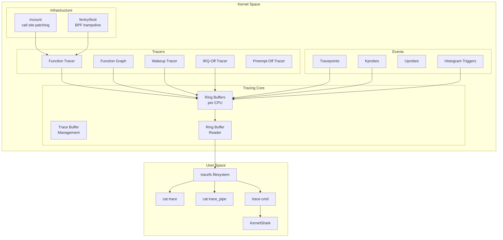
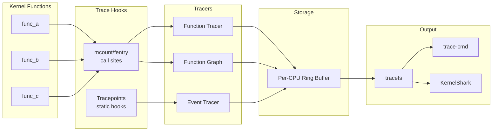
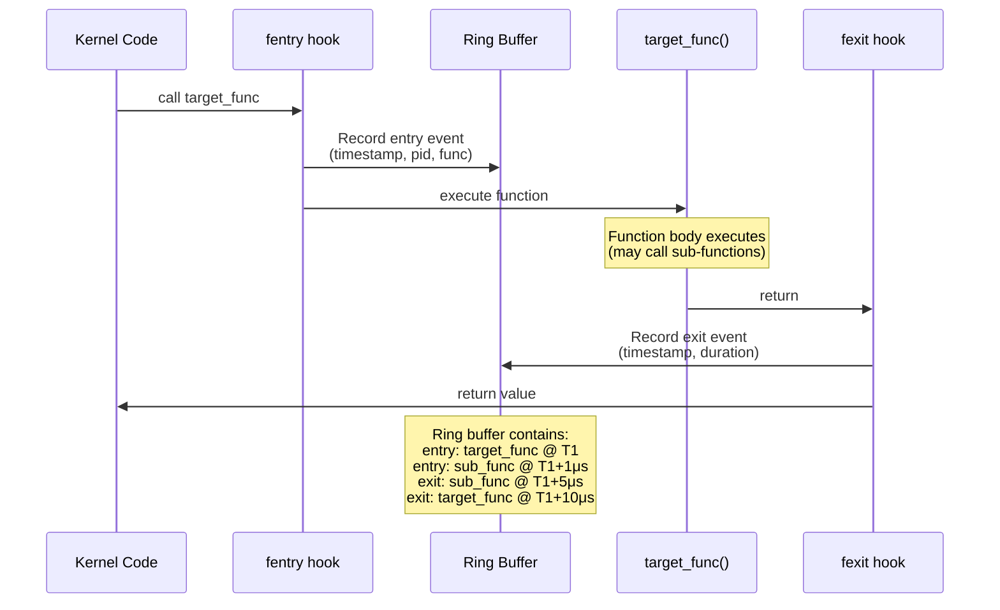
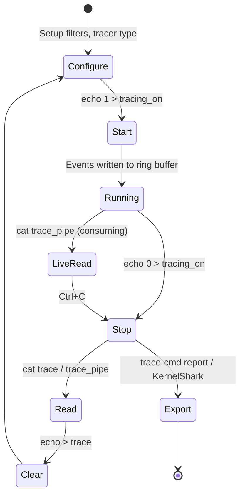

# Chapter 229: ftrace and tracefs — Function Tracer

## 1. Intuition

ftrace is the Linux kernel's built-in tracing infrastructure. While `perf` focuses on *where* time is spent (sampling), ftrace focuses on *what happens* (tracing). It records the exact sequence of function calls, context switches, interrupts, and other kernel events with timestamps. Think of it as a flight recorder for the kernel — every event is logged in order, giving you a precise timeline of kernel behavior.

The name "ftrace" comes from "function tracer," its original purpose: tracing every kernel function call. Over time, it evolved into a general-purpose tracing framework with dozens of trace backends. The function tracer is just one of many; there's also function_graph (showing call/return pairs as a hierarchical tree), latency tracers (measuring interrupt-disabled time), event tracers (recording static tracepoints), and histogram triggers (aggregating data in-kernel).

ftrace's power comes from its zero-dependency design. It requires no external tools, no kernel modules, and no special configuration — it's built into every modern Linux kernel. You interact with it through a virtual filesystem (`tracefs`, typically mounted at `/sys/kernel/tracing/`) using simple file reads and writes. This makes it invaluable for debugging on embedded systems, production servers, and any environment where installing additional tools isn't feasible.

## 2. Architecture

### 2.1 The tracefs Filesystem

```
/sys/kernel/tracing/
├── available_tracers          # List of compiled-in tracers
├── current_tracer             # Active tracer (nop, function, function_graph, ...)
├── tracing_on                 # 1 = tracing active, 0 = paused
├── trace                      # The trace output (ring buffer contents)
├── trace_pipe                 # Like trace, but consumes data (for live reading)
├── buffer_size_kb             # Per-CPU ring buffer size
├── set_ftrace_filter          # Filter which functions to trace
├── set_ftrace_notrace         # Functions to exclude from tracing
├── set_ftrace_pid             # Trace only specific PIDs
├── set_graph_function         # Functions to graph-trace
├── options/                   # Tracer options
│   ├── func_stack_trace       # Record stack trace on each function entry
│   ├── funcgraph-proc         # Show process names in function_graph
│   ├── context-info           # Show context info (irqs, need_resched)
│   └── ...
├── events/                    # Static tracepoints
│   ├── sched/
│   │   ├── sched_switch/
│   │   │   ├── enable
│   │   │   ├── filter
│   │   │   └── format
│   │   ├── sched_wakeup/
│   │   └── ...
│   ├── block/
│   ├── irq/
│   ├── net/
│   └── ...
├── per_cpu/
│   ├── cpu0/
│   │   ├── trace              # Per-CPU trace buffer
│   │   └── stats              # Buffer statistics
│   ├── cpu1/
│   └── ...
├── trace_stat/                # Histogram/statistics
│   ├── irq/                   # Interrupt latency stats
│   ├── preemptoff/            # Preemption-off latency
│   └── ...
└── saved_cmdlines             # Mapping of PIDs to command names
```

### 2.2 Internal Architecture



### 2.3 The mcount/fentry Mechanism

When function tracing is enabled, the kernel patches every traced function's prologue to call the tracer:

```
Before patching:
    func:
        push rbp
        mov rbp, rsp
        ...

After patching (mcount):
    func:
        call mcount          ← inserted by the kernel
        push rbp
        mov rbp, rsp
        ...

After patching (fentry, newer):
    func:
        call fentry          ← inserted by the kernel
        push rbp
        mov rbp, rsp
        ...
```

`fentry` is preferred on x86-64 because it's called before the function prologue, making it more compatible with function graph tracing and BPF.

### 2.4 The Ring Buffer

Each CPU has its own ring buffer. The buffer is lockless for writers (trace events) using a per-CPU reserve/commit model:

```
CPU 0 Ring Buffer:
┌──────┬──────┬──────┬──────┬──────┬──────┬──────┬──────┐
│event1│event2│event3│ empty │ empty │ empty │event4│event5│
└──────┴──────┴──────┴──────┴──────┴──────┴──────┴──────┘
^                              ^                    ^
read                           write               overwrite boundary
```

Events are variable-length records containing:
- Timestamp (TSC-based)
- CPU ID
- PID/TID
- Event type and data
- Optional stack trace

## 3. Usage Examples

### 3.1 Basic Function Tracing

```bash
# Check available tracers
cat /sys/kernel/tracing/available_tracers
# nop function function_graph ...

# Set the function tracer
echo function > /sys/kernel/tracing/current_tracer

# Start tracing
echo 1 > /sys/kernel/tracing/tracing_on

# Run your workload
./myprogram

# Stop tracing
echo 0 > /sys/kernel/tracing/tracing_on

# Read the trace
cat /sys/kernel/tracing/trace

# Output format:
# # tracer: function
# #
# #                                _-----=> irqs-off
# #                               / _----=> need-resched
# #                              | / _---=> hardirq/softirq
# #                              || / _--=> preempt-depth
# #                              ||| /     delay
# #           TASK-PID     CPU#  ||||   TIMESTAMP  FUNCTION
# #              | |         |   ||||      |         |
#             bash-1234  [000] d... 12345.678901: kfree <-do_execve
#             bash-1234  [000] d... 12345.678902: __kmalloc <-do_execve
#          myprogram-5678  [001] .... 12345.679000: do_sys_open <-sys_open
#          myprogram-5678  [001] .... 12345.679001: getname <-do_sys_open
#          myprogram-5678  [001] .... 12345.679002: strncpy_from_user <-getname
```

### 3.2 Filtering Functions

```bash
# List all traceable functions
cat /sys/kernel/tracing/available_filter_functions | wc -l
# Typically 50,000+ functions

# Filter: only trace specific functions
echo do_sys_open > /sys/kernel/tracing/set_ftrace_filter
echo function > /sys/kernel/tracing/current_tracer
echo 1 > /sys/kernel/tracing/tracing_on

# Multiple filters
echo -e "do_sys_open\ndo_sys_close\nkmalloc" > /sys/kernel/tracing/set_ftrace_filter

# Wildcard filtering
echo 'sys_*' > /sys/kernel/tracing/set_ftrace_filter
echo 'mm_*' >> /sys/kernel/tracing/set_ftrace_filter

# Exclude functions
echo '__lock_page_slowpath' > /sys/kernel/tracing/set_ftrace_notrace

# Filter by module
echo ':mod:ext4' > /sys/kernel/tracing/set_ftrace_filter

# Clear filters
echo > /sys/kernel/tracing/set_ftrace_filter
echo > /sys/kernel/tracing/set_ftrace_notrace
```

### 3.3 Function Graph Tracer

The function_graph tracer shows hierarchical call/return relationships:

```bash
# Set function_graph tracer
echo function_graph > /sys/kernel/tracing/current_tracer

# Filter to specific function and its callees
echo do_sys_open > /sys/kernel/tracing/set_graph_function

# Start and read
echo 1 > /sys/kernel/tracing/tracing_on
cat /sys/kernel/tracing/trace_pipe

# Output:
#  CPU  DURATION                  FUNCTION CALLS
#  [000]               |  do_sys_open() {
#  [000]               |    getname() {
#  [000]   0.342 us    |      kmem_cache_alloc();
#  [000]   1.234 us    |      strncpy_from_user();
#  [000]   2.567 us    |    }
#  [000]               |    do_filp_open() {
#  [000]   0.123 us    |      path_init();
#  [000]               |      link_path_walk() {
#  [000]   0.045 us    |        may_lookup();
#  [000]   0.234 us    |        walk_component();
#  [000]   0.890 us    |      }
#  [000]   0.012 us    |      complete_walk();
#  [000]   2.345 us    |    }
#  [000]               |    fd_install() {
#  [000]   0.056 us    |      __fd_install();
#  [000]   0.123 us    |    }
#  [000]   8.901 us    |  } /* do_sys_open */
```

Key options for function_graph:

```bash
# Show process/command names
echo 1 > /sys/kernel/tracing/options/funcgraph-proc

# Show timestamps relative to trace start
echo 0 > /sys/kernel/tracing/options/funcgraph-abstime

# Control depth of nested calls
echo 5 > /sys/kernel/tracing/options/max_graph_depth

# Show only leaf functions (no children)
echo 1 > /sys/kernel/tracing/options/funcgraph-leaf

# Trace specific PID
echo 12345 > /sys/kernel/tracing/set_ftrace_pid

# Overhead threshold (skip fast functions)
echo 100 > /sys/kernel/tracing/tracing_thresh  # 100+ microseconds only
```

### 3.4 Event Tracing (Tracepoints)

```bash
# List available events
ls /sys/kernel/tracing/events/

# Enable a specific event
echo 1 > /sys/kernel/tracing/events/sched/sched_switch/enable

# Enable all events in a category
echo 1 > /sys/kernel/tracing/events/sched/enable

# Enable all events (very noisy!)
echo 1 > /sys/kernel/tracing/events/enable

# Read event trace
cat /sys/kernel/tracing/trace

# Output:
# myprogram-1234 [001] 12345.678: sched_switch: prev_comm=myprogram prev_pid=1234 prev_prio=120 prev_state=S ==> next_comm=swapper/1 next_pid=0 next_prio=120

# Filter events
echo 'prev_pid == 1234' > /sys/kernel/tracing/events/sched/sched_switch/filter
echo 'bytes > 4096' > /sys/kernel/tracing/events/block/block_rq_issue/filter

# Complex filters
echo 'prev_comm == "myprogram" || next_comm == "myprogram"' \
    > /sys/kernel/tracing/events/sched/sched_switch/filter

# Trigger actions on events
echo 'stacktrace if bytes > 4096' \
    > /sys/kernel/tracing/events/block/block_rq_issue/trigger
```

### 3.5 Trace-cmd — The User-Friendly Frontend

`trace-cmd` is a command-line tool that simplifies ftrace usage:

```bash
# Install
apt install trace-cmd    # Debian/Ubuntu
yum install trace-cmd    # RHEL/CentOS

# Record a trace (starts and stops tracing automatically)
sudo trace-cmd record -p function_graph -g do_sys_open -o trace.dat

# Record with event tracing
sudo trace-cmd record -e sched_switch -e sched_wakeup -o trace.dat

# Record specific function with stack traces
sudo trace-cmd record -p function -l do_sys_open --func-stack -o trace.dat

# Record for specific process
sudo trace-cmd record -p function_graph -P 12345 -o trace.dat

# Record system-wide for 10 seconds
sudo trace-cmd record -e all sleep 10

# Replay the trace
trace-cmd report -i trace.dat

# Live tracing (display as it happens)
sudo trace-cmd stream -p function_graph -g do_sys_open

# List available plugins (tracers)
trace-cmd list -t

# List available events
trace-cmd list -e

# Split recordings per-CPU
sudo trace-cmd record -p function -o trace.dat --per-cpu

# Profile (record with statistics)
sudo trace-cmd profile -p function_graph -g do_sys_open
```

### 3.6 Histogram Triggers

Histogram triggers aggregate data in-kernel, reducing overhead for statistical analysis:

```bash
# Create a histogram of function call durations
echo 'hist:key=func:val=total_duration:sort=total_duration' \
    > /sys/kernel/tracing/events/kmem/kmalloc/trigger

# Latency histogram for scheduler events
echo 'hist:key=next_pid:val=lat:sort=lat.descending' \
    > /sys/kernel/tracing/events/sched/sched_wakeup/trigger

# Multi-key histogram
echo 'hist:key=comm,pid:val=hitcount:sort=hitcount.descending' \
    > /sys/kernel/tracing/events/sched/sched_switch/trigger

# Read histogram output
cat /sys/kernel/tracing/events/sched/sched_switch/hist

# Output:
# { comm(myprogram) pid(1234) } hitcount: 5678
# { comm(swap) pid(0) } hitcount: 3456
# { comm(kworker) pid(56) } hitcount: 2345
#
# Totals:
#     Hits: 11479
#     Entries: 156
#     Dropped: 0

# Inter-event histograms (synthetic events)
echo 'my_latency u64 lat; pid_t pid;' \
    > /sys/kernel/tracing/synthetic_events

echo 'hist:key=pid:val=ts0:onmatch(sched.sched_wakeup).trace(my_latency,$lat,ts0)' \
    > /sys/kernel/tracing/events/sched/sched_wakeup/trigger

echo 'hist:key=next_pid:val=lat:ts1=$ts0:onmatch(sched.sched_switch).trace(my_latency,$lat,ts1-tS)' \
    > /sys/kernel/tracing/events/sched/sched_switch/trigger
```

### 3.7 Latency Tracers

```bash
# IRQ-Off latency tracer — measures longest interrupt-disabled period
echo irqsoff > /sys/kernel/tracing/current_tracer
echo 1 > /sys/kernel/tracing/tracing_on
# ... workload ...
echo 0 > /sys/kernel/tracing/tracing_on
cat /sys/kernel/tracing/trace

# Preempt-Off latency tracer
echo preemptoff > /sys/kernel/tracing/current_tracer

# Combined IRQ + Preempt off
echo preemptirqsoff > /sys/kernel/tracing/current_tracer

# Wakeup tracer — measures longest scheduling latency
echo wakeup > /sys/kernel/tracing/current_tracer
echo wakeup_rt > /sys/kernel/tracing/current_tracer   # For RT tasks
echo wakeup_dl > /sys/kernel/tracing/current_tracer   # For deadline tasks

# View latency statistics
cat /sys/kernel/tracing/trace_stat/irqsoff
cat /sys/kernel/tracing/trace_stat/preemptoff
```

### 3.8 KernelShark — GUI Visualization

```bash
# Install
apt install kernelshark

# Record a trace
sudo trace-cmd record -e sched_switch -e sched_wakeup -e sched_migrate_task

# Open in KernelShark
kernelshark trace.dat

# KernelShark features:
# - Timeline view of all CPUs
# - Color-coded events by type
# - Filter by process, CPU, event
# - Zoom into time ranges
# - Plot CPU usage, frequency, events
# - Select events and see details
# - Search for specific events
```

### 3.9 trace-cmd with BPF Integration

```bash
# trace-cmd can use BPF for custom analysis
# Requires kernel 5.x+ with BTF

# Simple BPF histogram
sudo trace-cmd record -B bpf \
    -e sched:sched_switch \
    --bpf hist:key=next_comm:val=hitcount

# BPF-based latency measurement
sudo trace-cmd record -B bpf \
    -e block:block_rq_issue \
    -e block:block_rq_complete \
    --bpf hist:key=dev:val=lat
```

### 3.10 ftrace for Debugging Specific Problems

```bash
# Debug slow I/O
echo 1 > /sys/kernel/tracing/events/block/enable
echo 1 > /sys/kernel/tracing/tracing_on
dd if=/dev/zero of=/tmp/test bs=1M count=100
echo 0 > /sys/kernel/tracing/tracing_on
cat /sys/kernel/tracing/trace | grep block_rq

# Debug interrupt storms
echo 1 > /sys/kernel/tracing/events/irq/enable
echo 1 > /sys/kernel/tracing/tracing_on
sleep 10
echo 0 > /sys/kernel/tracing/tracing_on
cat /sys/kernel/tracing/trace | grep irq_handler

# Debug networking
echo 1 > /sys/kernel/tracing/events/net/enable
echo 1 > /sys/kernel/tracing/events/napi/enable
echo 1 > /sys/kernel/tracing/tracing_on
ping -c 100 192.168.1.1
echo 0 > /sys/kernel/tracing/tracing_on
cat /sys/kernel/tracing/trace

# Debug memory allocation failures
echo 1 > /sys/kernel/tracing/events/kmem/enable
echo 'hitcount if bytes > 1048576' \
    > /sys/kernel/tracing/events/kmem/kmalloc/trigger
```

## 4. Source Code References

| Component | File | Description |
|-----------|------|-------------|
| Trace core | `kernel/trace/trace.c` | Main tracing infrastructure |
| Ring buffer | `kernel/trace/ring_buffer.c` | Lockless ring buffer implementation |
| Function tracer | `kernel/trace/trace_functions.c` | Function call tracing |
| Function graph | `kernel/trace/trace_functions_graph.c` | Hierarchical call tracing |
| Event infrastructure | `kernel/trace/trace_events.c` | Tracepoint event management |
| Histogram triggers | `kernel/trace/trace_events_hist.c` | In-kernel histograms |
| tracefs filesystem | `kernel/trace/trace.c` (tracefs_mount) | Virtual filesystem |
| mcount/fentry | `arch/x86/kernel/ftrace.c` | Function call site patching |
| trace-cmd | `tools/trace-cmd/` | Userspace frontend tool |
| KernelShark | `tools/kernel-shark/` | GUI visualization tool |

Key kernel interfaces:
- `/sys/kernel/tracing/` — tracefs mount point
- `CONFIG_FUNCTION_TRACER` — Kernel config for function tracing
- `CONFIG_FTRACE=y` — Base ftrace support
- `CONFIG_DYNAMIC_FTRACE=y` — Runtime function filtering

## 5. Diagrams

### ftrace Data Flow



### Function Graph Execution Model



### tracefs Interaction Model



## 6. Common Pitfalls

### 6.1 Tracing Overhead Too High

**Problem:** Tracing all functions makes the system unresponsive.

**Cause:** Function tracing adds a hook to every kernel function call — tens of thousands per second.

**Solution:**
```bash
# Always use filters to limit scope
echo 'do_sys_open*' > /sys/kernel/tracing/set_ftrace_filter

# Trace specific PID only
echo 12345 > /sys/kernel/tracing/set_ftrace_pid

# Use events instead of function tracing (much lower overhead)
echo 1 > /sys/kernel/tracing/events/sched/sched_switch/enable

# Reduce buffer size if memory is limited
echo 1024 > /sys/kernel/tracing/buffer_size_kb
```

### 6.2 Missing ftrace Support in Kernel Config

**Problem:** `/sys/kernel/tracing/` doesn't exist or is empty.

**Solution:**
```bash
# Check kernel config
grep -i ftrace /boot/config-$(uname -r)
# Should have:
# CONFIG_FTRACE=y
# CONFIG_FUNCTION_TRACER=y
# CONFIG_FUNCTION_GRAPH_TRACER=y

# Mount tracefs manually
mount -t tracefs nodev /sys/kernel/tracing

# Or add to fstab
echo 'tracefs /sys/kernel/tracing tracefs defaults 0 0' >> /etc/fstab
```

### 6.3 Ring Buffer Overflow

**Problem:** Events are being lost (`LOST EVENTS` in trace output).

**Solution:**
```bash
# Check buffer stats
cat /sys/kernel/tracing/per_cpu/cpu0/stats
# entries: 12345
# overrun: 6789      ← events lost!
# commit overrun: 0

# Increase buffer size
echo 65536 > /sys/kernel/tracing/buffer_size_kb  # 64MB per CPU

# Reduce event rate with more specific filters
echo 'prev_pid == 1234' > /sys/kernel/tracing/events/sched/sched_switch/filter

# Use a shorter tracing window
timeout 5 cat /sys/kernel/tracing/trace_pipe > trace.txt
```

### 6.4 Can't Trace Specific Processes

**Problem:** `set_ftrace_pid` doesn't seem to filter correctly.

**Cause:** Must enable the `function-fork` option and set the PID correctly.

**Solution:**
```bash
# Enable fork tracking (new threads inherit tracing)
echo 1 > /sys/kernel/tracing/options/function-fork

# Set PID (must re-set after process creates new threads)
echo 12345 > /sys/kernel/tracing/set_ftrace_pid

# For function_graph, also set set_graph_function
echo do_sys_open > /sys/kernel/tracing/set_graph_function
echo 12345 > /sys/kernel/tracing/set_ftrace_pid
```

### 6.5 Timestamps Not Accurate

**Problem:** Events appear to be out of order or timestamps don't match wall clock.

**Cause:** Each CPU has its own TSC, and cross-CPU ordering may be imperfect.

**Solution:**
```bash
# Use absolute timestamps
echo 1 > /sys/kernel/tracing/options/irq-info

# Enable TSC synchronization (if available)
# Usually automatic on modern hardware

# trace-cmd handles cross-CPU ordering
trace-cmd report -i trace.dat | sort -k4
```

## 7. Best Practices

### 7.1 Systematic ftrace Debugging Workflow

```bash
# Step 1: Start broad
echo 1 > /sys/kernel/tracing/events/sched/enable
echo 1 > /sys/kernel/tracing/events/irq/enable
echo nop > /sys/kernel/tracing/current_tracer
echo 1 > /sys/kernel/tracing/tracing_on
# Run workload
echo 0 > /sys/kernel/tracing/tracing_on
# Analyze: are there unexpected context switches? Long IRQs?

# Step 2: Narrow down
# If you see scheduling delays:
echo function_graph > /sys/kernel/tracing/current_tracer
echo schedule > /sys/kernel/tracing/set_graph_function
echo 12345 > /sys/kernel/tracing/set_ftrace_pid
echo 1 > /sys/kernel/tracing/tracing_on
# Run workload
echo 0 > /sys/kernel/tracing/tracing_on
cat /sys/kernel/tracing/trace

# Step 3: Measure
echo wakeup > /sys/kernel/tracing/current_tracer
echo 12345 > /sys/kernel/tracing/set_ftrace_pid
# Check latency statistics
cat /sys/kernel/tracing/trace_stat/wakeup
```

### 7.2 Using trace-cmd for Production Debugging

```bash
# Minimal-overhead recording with trace-cmd
sudo trace-cmd record \
    -p nop \
    -e sched_switch \
    -e sched_wakeup \
    -e block_rq_issue \
    -e block_rq_complete \
    -b 8192 \
    --clock mono \
    -o /tmp/trace.dat \
    sleep 30

# Analyze offline (no impact on production)
trace-cmd report -i /tmp/trace.dat
```

### 7.3 Combining ftrace with Other Tools

```bash
# ftrace + perf: use perf for sampling, ftrace for tracing
perf record -e sched:sched_switch -ag -- sleep 10

# ftrace + BPF: custom filtering in-kernel
# Modern approach: use bpftrace instead of raw ftrace for complex queries

# ftrace + strace: ftrace for kernel internals, strace for syscall interface
# Use ftrace events for scheduler + perf for CPU profiling simultaneously
```

## 8. Exercises

### Exercise 1: Function Call Tracing
Trace the execution of `open()` system call in the kernel:
1. Set up function_graph tracing for `do_sys_open` and its callees
2. Run `cat /etc/hostname` and capture the trace
3. Identify the full call chain from syscall entry to file open
4. Measure the time spent in each major function

### Exercise 2: Scheduler Analysis
Analyze scheduler behavior of a multi-threaded program:
1. Enable `sched_switch` and `sched_wakeup` events
2. Run a program with 4 threads on 2 CPU cores
3. Use trace-cmd to record the trace
4. Analyze: How often do threads migrate between CPUs? What's the average wakeup latency?

### Exercise 3: Histogram Triggers
Use histogram triggers to measure I/O latency distribution:
1. Create a histogram of block I/O request sizes
2. Create a latency histogram for `block_rq_complete` events
3. Use inter-event histograms to measure time from `block_rq_issue` to `block_rq_complete`
4. Interpret the results: what's the P99 latency?

### Exercise 4: IRQ Latency Analysis
Find the longest interrupt-disabled period:
1. Use the `irqsoff` tracer
2. Run a busy workload
3. Find the function that disables interrupts for the longest time
4. Compare with `preemptoff` tracer results

### Exercise 5: Custom Event Tracing
Create a custom ftrace event for a specific kernel subsystem:
1. Enable all events in the `ext4` category
2. Run `dd` to create a file
3. Trace the complete I/O path from VFS to disk
4. Identify which operations take the most time

## 9. References

1. **ftrace Documentation** — `Documentation/trace/ftrace.rst` — In-kernel ftrace documentation
2. **ftrace - Function Tracer** — https://www.kernel.org/doc/html/latest/trace/ftrace.html
3. **trace-cmd man page** — `man 1 trace-cmd` — trace-cmd reference
4. **KernelShark** — https://kernelshark.org/ — GUI trace analysis
5. **Steven Rostedt's ftrace talks** — https://blog.linuxplumbersconf.org/ — ftrace author's presentations
6. **Debugging the kernel using Ftrace** — https://lwn.net/Articles/365835/ — LWN article series
7. **histogram triggers** — `Documentation/trace/histogram.rst` — Histogram trigger documentation
8. **Event Tracing** — `Documentation/trace/events.rst` — Tracepoint event system
9. **Brendan Gregg's ftrace page** — https://www.brendangregg.com/blog/2014-09-17/ftrace-one-liners.html
10. **trace-cmd source** — https://git.kernel.org/pub/scm/utils/trace-cmd/trace-cmd.git/ — trace-cmd repository
