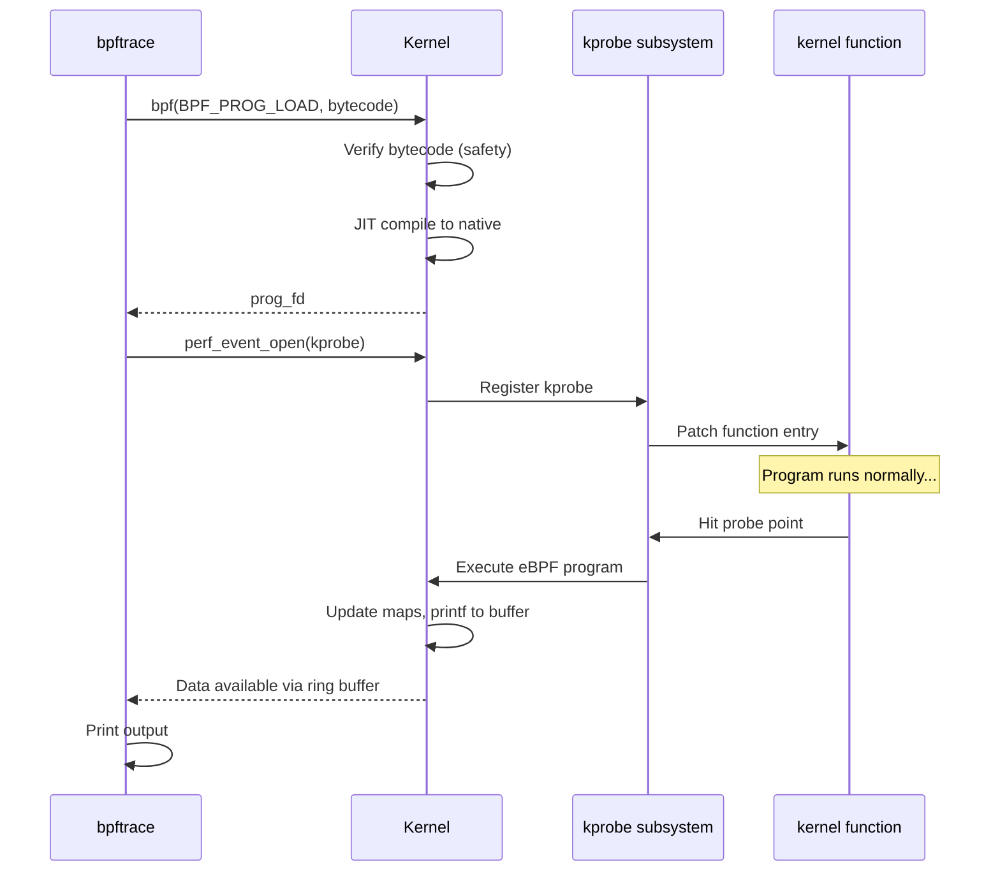

# Chapter 230: bpftrace — One-liners, Probes, Maps, printf

## 1. Intuition

bpftrace is a high-level tracing language for Linux that brings the power of eBPF (extended Berkeley Packet Filter) to system administrators and developers in an accessible, awk-like syntax. While raw eBPF requires writing C programs compiled with clang, loading them via bpf() syscall, and managing maps and ring buffers manually — bpftrace lets you express the same ideas in a single line of text.

Think of bpftrace as the "awk of tracing." Just as awk processes text streams with pattern-action rules, bpftrace processes kernel and user-space events with probe-action rules. The probe says *when* to fire (function entry, function exit, timer, custom event), and the action says *what to do* (print a value, count occurrences, measure latency, build a histogram).

bpftrace sits at the intersection of several powerful ideas: DTrace's one-liner philosophy (from Brendan Gregg's work at Sun Microsystems), eBPF's safe in-kernel execution (verified bytecode that can't crash the kernel), and Linux's rich tracing infrastructure (kprobes, uprobes, tracepoints, perf events). The result is a tool that can answer ad-hoc performance and debugging questions in seconds rather than hours.

## 2. Architecture

### 2.1 The bpftrace Pipeline

```
┌─────────────────────────────────────────────────────────────┐
│                      bpftrace process                       │
│                                                             │
│  ┌─────────┐    ┌──────────┐    ┌──────────┐    ┌────────┐ │
│  │ Parser  │───►│ AST      │───►│ Code     │───►│ BPF    │ │
│  │ (bison) │    │ Builder  │    │ Generator│    │ Loader │ │
│  └─────────┘    └──────────┘    └──────────┘    └───┬────┘ │
│                                                      │      │
├──────────────────────────────────────────────────────┼──────┤
│                           bpf() syscall              │      │
├──────────────────────────────────────────────────────┼──────┤
│                                                      ▼      │
│  ┌───────────────────────────────────────────────────────┐  │
│  │              eBPF Virtual Machine (Kernel)            │  │
│  │                                                       │  │
│  │  ┌──────────┐  ┌──────────┐  ┌──────────┐            │  │
│  │  │ Verifier │  │ JIT      │  │ Maps     │            │  │
│  │  │ (safety) │  │ Compiler │  │ (data)   │            │  │
│  │  └──────────┘  └──────────┘  └──────────┘            │  │
│  └───────────────────────────────────────────────────────┘  │
│                           │                                 │
│  ┌────────────────────────┼──────────────────────────────┐  │
│  │                        │  Probe Attachment Points     │  │
│  │  kprobes  uprobes  tracepoints  perf_events  USDT    │  │
│  └──────────────────────────────────────────────────────┘  │
└─────────────────────────────────────────────────────────────┘
```

### 2.2 eBPF Safety Model

bpftrace programs compile to eBPF bytecode, which is verified before execution:

1. **Termination guarantee:** The verifier ensures every program path terminates (no infinite loops).
2. **Memory safety:** All memory accesses are bounds-checked.
3. **No arbitrary kernel calls:** Only whitelisted helper functions are callable.
4. **Stack limit:** eBPF stack is limited to 512 bytes.
5. **Instruction limit:** Maximum 1 million instructions per program (increased from 4096 in recent kernels).

This means bpftrace programs are safe to run in production — they cannot crash the kernel or corrupt memory.

### 2.3 Probe Types

| Probe Type | Syntax | Description |
|-----------|--------|-------------|
| Kernel function entry | `kprobe:func` | Fires when kernel function is called |
| Kernel function return | `kretprobe:func` | Fires when kernel function returns |
| User function entry | `uprobe:/path:func` | Fires when user function is called |
| User function return | `uretprobe:/path:func` | Fires when user function returns |
| Kernel tracepoint | `tracepoint:category:event` | Static kernel instrumentation point |
| User SDT probe | `usdt:/path:probe` | User Statically-Defined Tracepoint |
| Software event | `software:event:count` | CPU, page fault, etc. |
| Hardware event | `hardware:event:count` | Cache miss, branch miss, etc. |
| Profile timer | `profile:hz:N` | Fires N times per second per CPU |
| Interval timer | `interval:s:N` | Fires every N seconds |
| BEGIN/END | `BEGIN`/`END` | Program start/exit |
| Watchpoint | `watchpoint:addr:len:mode` | Memory access |

## 3. Usage Examples

### 3.1 One-Liner Collection

```bash
# Syscall tracing — which syscalls are being called?
bpftrace -e 'tracepoint:syscalls:sys_enter_* { @[probe] = count(); }'

# Count syscalls by process
bpftrace -e 'tracepoint:syscalls:sys_enter_* { @[comm] = count(); }'

# Read/write bytes by process
bpftrace -e '
tracepoint:syscalls:sys_exit_read /args->ret > 0/ { @bytes[comm] = sum(args->ret); }
tracepoint:syscalls:sys_exit_write /args->ret > 0/ { @bytes[comm] = sum(args->ret); }
'

# File opens by process
bpftrace -e 'tracepoint:syscalls:sys_enter_openat { printf("%-16s %s\n", comm, str(args->filename)); }'

# Disk I/O latency histogram
bpftrace -e 'tracepoint:block:block_rq_issue { @start[args->sector] = nsecs; }
tracepoint:block:block_rq_complete /@start[args->sector]/ { @ns = hist(nsecs - @start[args->sector]); delete(@start[args->sector]); }'

# TCP connection latency
bpftrace -e 'kprobe:tcp_v4_connect { @start[tid] = nsecs; }
kretprobe:tcp_v4_connect /@start[tid]/ { @usecs = hist((nsecs - @start[tid]) / 1000); delete(@start[tid]); }'

# Process creation tracing
bpftrace -e 'tracepoint:sched:sched_process_exec { printf("EXEC %s (pid=%d)\n", comm, pid); }'

# Page fault counter by process
bpftrace -e 'software:page-faults:1 { @[comm, kstack] = count(); }'

# CPU profiling at 99 Hz
bpftrace -e 'profile:hz:99 { @[kstack] = count(); }'

# Count function calls in kernel module
bpftrace -e 'kprobe:ext4_* { @[func] = count(); }'

# VFS latency
bpftrace -e '
kprobe:vfs_read { @[tid] = nsecs; }
kretprobe:vfs_read /@[tid]/ { @usecs = hist((nsecs - @tid) / 1000); delete(@tid); }
'
```

### 3.2 Probes in Detail

```bash
# Kernel function probe with arguments
bpftrace -e 'kprobe:do_sys_open {
    printf("open: pid=%d comm=%s filename=%s\n", pid, comm, str(arg1));
}'

# kretprobe with return value
bpftrace -e 'kretprobe:do_sys_open {
    printf("open returned fd=%d\n", retval);
}'

# User-space function probe
bpftrace -e 'uprobe:/usr/lib/libc.so.6:malloc {
    printf("malloc(%d) by pid=%d\n", arg0, pid);
}'

# User-space return probe
bpftrace -e 'uretprobe:/usr/lib/libc.so.6:malloc {
    printf("malloc returned %p\n", retval);
}'

# Tracepoint with format inspection
# First, check available fields:
# cat /sys/kernel/tracing/events/sched/sched_switch/format
bpftrace -e 'tracepoint:sched:sched_switch {
    printf("%s[%d] -> %s[%d]\n", args->prev_comm, args->prev_pid,
           args->next_comm, args->next_pid);
}'

# USDT probe (if application has USDT markers)
bpftrace -e 'usdt:/usr/sbin/mysqld:mysql:query__start {
    printf("query: %s\n", str(arg0));
}'

# Multiple probes in one program
bpftrace -e '
kprobe:do_sys_open { printf("ENTER open\n"); }
kretprobe:do_sys_open { printf("EXIT open, fd=%d\n", retval); }
tracepoint:sched:sched_process_exec { printf("EXEC: %s\n", comm); }
BEGIN { printf("tracing started\n"); }
END { printf("tracing ended\n"); }
'
```

### 3.3 Maps and Aggregations

Maps are eBPF's key-value data structures for in-kernel aggregation:

```bash
# Count events by key
bpftrace -e '
tracepoint:syscalls:sys_enter_read {
    @reads[comm] = count();
}
interval:s:5 {
    print(@reads);
    clear(@reads);
}
'

# Sum values
bpftrace -e '
tracepoint:syscalls:sys_exit_read /args->ret > 0/ {
    @total_bytes[comm] = sum(args->ret);
}
'

# Statistics (avg, count, total)
bpftrace -e '
tracepoint:syscalls:sys_exit_read /args->ret > 0/ {
    @stats[comm] = stats(args->ret);
}
'
# Output:
# @stats[cat]: count 15, average 4096.00, total 61440

# Min/Max
bpftrace -e '
tracepoint:syscalls:sys_exit_read /args->ret > 0/ {
    @min_read[comm] = min(args->ret);
    @max_read[comm] = max(args->ret);
}
'

# Histograms
bpftrace -e '
tracepoint:syscalls:sys_exit_read /args->ret > 0/ {
    @read_size = hist(args->ret);
}
'
# Output:
# @read_size:
# [0]                12 |                                        |
# [1]                34 |@                                       |
# [2, 4)             56 |@@                                      |
# [4, 8)            123 |@@@@                                    |
# [8, 16)           456 |@@@@@@@@@@@@@                           |
# [16, 32)          789 |@@@@@@@@@@@@@@@@@@@@@@@@                |
# [32, 64)         1234 |@@@@@@@@@@@@@@@@@@@@@@@@@@@@@@@@@@@@@@@@|
# [64, 128)         567 |@@@@@@@@@@@@@@@@@@                      |
# ...

# Custom bucket sizes
bpftrace -e '
tracepoint:block:block_rq_complete {
    @latency_usecs = lhist(args->rwbs == "R" ? (nsecs - @start) / 1000 : 0, 0, 10000, 100);
}
'

# Delete map entries
bpftrace -e '
interval:s:1 {
    print(@count);
    clear(@count);
}
tracepoint:syscalls:sys_enter_* {
    @count = count();
}
'
```

### 3.4 printf and Output Formatting

```bash
# Basic printf
bpftrace -e 'tracepoint:syscalls:sys_enter_openat {
    printf("openat(%s)\n", str(args->filename));
}'

# Formatted table output
bpftrace -e '
BEGIN {
    printf("%-16s %-6s %-6s %s\n", "COMM", "PID", "PPID", "FILENAME");
}
tracepoint:syscalls:sys_enter_openat {
    printf("%-16s %-6d %-6d %s\n", comm, pid, ppid, str(args->filename));
}
'

# Hex output
bpftrace -e 'kprobe:do_sys_open {
    printf("open from %s (%d), arg1=%p\n", comm, pid, arg1);
}'

# Time stamps
bpftrace -e '
tracepoint:syscalls:sys_enter_openat {
    printf("%lld.%09lld %s\n", nsecs / 1000000000, nsecs % 1000000000,
           str(args->filename));
}
'

# Conditional printing
bpftrace -e 'kprobe:do_sys_open /str(args->filename) == "/etc/passwd"/ {
    printf("OPENING /etc/passwd! pid=%d comm=%s\n", pid, comm);
}'

# str() for user-space strings
bpftrace -e 'uprobe:/usr/bin/cat:main {
    printf("cat called with: %s\n", str(arg0));
}'
```

### 3.5 Advanced Scripts

#### System-wide Disk I/O Latency Analysis

```bash
#!/usr/bin/env bpftrace
// disk_io_latency.bt - Disk I/O latency analysis

BEGIN {
    printf("Tracing disk I/O latency... Hit Ctrl-C to end.\n");
}

tracepoint:block:block_rq_issue {
    @start[args->dev, args->sector] = nsecs;
}

tracepoint:block:block_rq_complete
    /@start[args->dev, args->sector]/ {

    $latency_us = (nsecs - @start[args->dev, args->sector]) / 1000;

    @usecs = hist($latency_us);
    @dev_latency[args->dev] = hist($latency_us);
    @total_io = count();
    @total_latency_us = sum($latency_us);

    delete(@start[args->dev, args->sector]);
}

interval:s:1 {
    printf("\n--- I/O Latency (usecs) ---\n");
    print(@usecs);
    print(@dev_latency);
    clear(@usecs);
    clear(@dev_latency);
}

END {
    printf("\nTotal I/Os: ");
    print(@total_io);
    printf("\nTotal latency (us): ");
    print(@total_latency_us);
    clear(@start);
}
```

#### Network Latency Analysis

```bash
#!/usr/bin/env bpftrace
// tcp_latency.bt - TCP round-trip time analysis

kprobe:tcp_v4_connect {
    @connect_start[tid] = nsecs;
}

kretprobe:tcp_v4_connect /@connect_start[tid]/ {
    $dur = nsecs - @connect_start[tid];
    @connect_latency_us = hist($dur / 1000);
    delete(@connect_start[tid]);
}

kprobe:tcp_rcv_established {
    @recv_start[tid] = nsecs;
}

kretprobe:tcp_rcv_established /@recv_start[tid]/ {
    $dur = nsecs - @recv_start[tid];
    @recv_latency_ns = hist($dur);
    delete(@recv_start[tid]);
}

interval:s:5 {
    printf("\n--- TCP Connect Latency (usecs) ---\n");
    print(@connect_latency_us);
    printf("\n--- TCP Receive Latency (nsecs) ---\n");
    print(@recv_latency_ns);
}
```

#### Process Memory Allocation Tracker

```bash
#!/usr/bin/env bpftrace
// mem_alloc.bt - Track memory allocations by process

uprobe:/usr/lib/libc.so.6:malloc {
    @alloc_size[tid] = arg0;
    @alloc_count[comm] = count();
    @alloc_total[comm] = sum(arg0);
}

uretprobe:/usr/lib/libc.so.6:malloc /retval != 0/ {
    @active[retval] = @alloc_size[tid];
    delete(@alloc_size[tid]);
}

uprobe:/usr/lib/libc.so.6:free /arg0 != 0/ {
    @freed_size = sum(@active[arg0]);
    @freed_count = count();
    delete(@active[arg0]);
}

interval:s:5 {
    printf("\n--- Allocation Stats ---\n");
    print(@alloc_count);
    print(@alloc_total);
    print(@freed_size);
    print(@freed_count);
}
```

### 3.6 Performance Profiling with bpftrace

```bash
# CPU profiling — where does the kernel spend time?
bpftrace -e 'profile:hz:99 { @[kstack] = count(); }' | head -50

# User-space CPU profiling
bpftrace -e 'profile:hz:99 { @[ustack] = count(); }' | head -50

# Combined stacks
bpftrace -e 'profile:hz:99 { @[kstack, ustack] = count(); }' | head -50

# Cache miss profiling
bpftrace -e 'hardware:cache-misses:1000 { @[kstack] = count(); }'

# Branch misprediction profiling
bpftrace -e 'hardware:branch-misses:1000 { @[kstack] = count(); }'

# Off-CPU analysis (time spent sleeping/blocking)
bpftrace -e '
tracepoint:sched:sched_switch {
    @offcpu[args->prev_pid] = nsecs;
}
tracepoint:sched:sched_wakeup /@offcpu[args->pid]/ {
    $dur = nsecs - @offcpu[args->pid];
    @usecs = hist($dur / 1000);
    @offcomm[args->pid] = comm;
    delete(@offcpu[args->pid]);
}
'

# Function latency distribution
bpftrace -e '
kprobe:ext4_file_write_iter { @start[tid] = nsecs; }
kretprobe:ext4_file_write_iter /@start[tid]/ {
    @usecs = hist((nsecs - @start[tid]) / 1000);
    delete(@start[tid]);
}
'
```

### 3.7 Listing Probes and Checking Availability

```bash
# List all available tracepoints
bpftrace -l 'tracepoint:*'

# List syscalls
bpftrace -l 'tracepoint:syscalls:sys_enter_*'

# List kernel functions matching pattern
bpftrace -l 'kprobe:tcp_*'

# List user-space probes
bpftrace -l 'uprobe:/usr/lib/libc.so.6:*'

# Verbose mode — show eBPF bytecode
bpftrace -d -e 'tracepoint:syscalls:sys_enter_openat { printf("hi\n"); }'

# Check if specific probe exists
bpftrace -l 'usdt:/usr/sbin/mysqld:*'
```

### 3.8 bpftrace with Containers

```bash
# Trace inside a container (requires root or CAP_BPF)
# For Docker containers, bpftrace sees the host kernel's tracepoints

# Trace container-specific PID namespace
bpftrace -e 'tracepoint:syscalls:sys_enter_openat /pid >= 10000/ {
    printf("container pid=%d file=%s\n", pid, str(args->filename));
}'

# Use cgroup filtering (kernel 5.x+)
bpftrace -e '
tracepoint:syscalls:sys_enter_openat
/cgroup == 0x100001/  // specific cgroup ID
{
    printf("open: %s\n", str(args->filename));
}
'

# In Kubernetes, use nsenter or run bpftrace as privileged
# kubectl exec -it pod -- bpftrace -e '...'
```

## 4. Source Code References

| Component | File | Description |
|-----------|------|-------------|
| bpftrace source | `github.com/bpftrace/bpftrace` | Main bpftrace repository |
| Parser | `src/parser.y` | Bison grammar for bpftrace language |
| AST | `src/ast/ast.cpp` | Abstract syntax tree |
| Codegen | `src/ast/codegen_llvm.cpp` | LLVM IR generation |
| BPF loader | `src/bpfprogram.cpp` | eBPF program loading |
| Runtime | `src/bpftrace.cpp` | Main runtime loop |
| Map management | `src/map.cpp` | eBPF map handling |
| Kernel verifier | `kernel/bpf/verifier.c` | eBPF bytecode verification |
| BPF JIT | `arch/x86/net/bpf_jit_comp.c` | x86 BPF JIT compiler |
| Helper functions | `kernel/bpf/helpers.c` | eBPF helper function implementations |

Key kernel interfaces:
- `bpf(BPF_PROG_LOAD, ...)` — Load eBPF program
- `bpf(BPF_MAP_CREATE, ...)` — Create eBPF map
- `perf_event_open()` — Attach to probe points
- `/sys/kernel/debug/tracing/` — tracefs for tracepoint access

## 5. Diagrams

### bpftrace Program Lifecycle

```mermaid
graph TB
    subgraph "User Space"
        SCRIPT[bpftrace script<br/>'tracepoint:... { ... }']
        PARSE[Parser / AST Builder]
        CODEGEN[LLVM Code Generator]
        LOAD[Program Loader]
    end

    subgraph "Kernel Space"
        VERIFIER[eBPF Verifier<br/>Safety checks]
        JIT[BPF JIT Compiler<br/>Native x86/ARM]
        MAPS[eBPF Maps<br/>Hash, Array, Hist]
        PROBES[Probe Attachment<br/>kprobe, tracepoint, etc.]
    end

    subgraph "Output"
        PRINT[printf / maps]
        HIST[Histograms]
        COUNT[Counters]
    end

    SCRIPT --> PARSE
    PARSE --> CODEGEN
    CODEGEN --> LOAD
    LOAD -->|bpf() syscall| VERIFIER
    VERIFIER --> JIT
    JIT --> PROBES
    PROBES --> MAPS
    MAPS --> PRINT
    MAPS --> HIST
    MAPS --> COUNT
```

### Probe Attachment Model



### Map Data Flow

```mermaid
graph LR
    subgraph "Probe fires"
        P[tracepoint:sched:sched_switch]
    end

    subgraph "eBPF Program"
        EXTRACT[Extract args]
        FILTER[Apply filter]
        AGGREGATE[Update map]
    end

    subgraph "eBPF Maps"
        HASH[Hash Map<br/>@[comm] = count()]
        HISTO[Histogram Map<br/>@bytes = hist()]
        LIFO[LIFO/Stack<br/>@stack]
    end

    subgraph "Output"
        PRINT[print() / interval]
        STDOUT[stdout]
    end

    P --> EXTRACT
    EXTRACT --> FILTER
    FILTER --> AGGREGATE
    AGGREGATE --> HASH
    AGGREGATE --> HISTO
    HASH --> PRINT
    HISTO --> PRINT
    PRINT --> STDOUT
```

## 6. Common Pitfalls

### 6.1 Kernel Version Too Old

**Problem:** bpftrace fails with "BTF not available" or features not working.

**Cause:** bpftrace requires kernel 4.9+ for basic functionality, 5.2+ for BTF (BPF Type Format) support.

**Solution:**
```bash
# Check kernel version
uname -r  # Need 4.9+ minimum, 5.2+ recommended

# Check BTF support
ls /sys/kernel/btf/vmlinux

# Install from package manager (may be newer than repo)
apt install bpftrace   # Ubuntu 20.04+
# Or build from source
git clone https://github.com/bpftrace/bpftrace
cd bpftrace && mkdir build && cd build
cmake .. && make -j$(nproc) && make install
```

### 6.2 Permission Denied

**Problem:** bpftrace fails with "Permission denied" or "Operation not permitted."

**Solution:**
```bash
# Run as root
sudo bpftrace -e '...'

# Or use capabilities
sudo setcap cap_sys_admin,cap_bpf,cap_perfmon=eip /usr/bin/bpftrace

# Check kernel lockdown mode
cat /sys/kernel/security/lockdown
# Must be "none" or "integrity" (not "confidentiality")

# Disable lockdown if needed (security risk!)
sudo sysctl kernel.lockdown=0
```

### 6.3 String Truncation

**Problem:** Strings appear truncated or garbled.

**Cause:** eBPF has limited stack space (512 bytes), and string operations are limited.

**Solution:**
```bash
# Use str() with length limit
bpftrace -e 'kprobe:do_sys_open { printf("%.64s\n", str(arg1)); }'

# Store strings in maps (limited to 64 bytes by default)
# Use printf directly instead of storing in maps when possible
```

### 6.4 High Overhead on Busy Systems

**Problem:** bpftrace causes noticeable slowdown on production systems.

**Cause:** Too many probe points or high-frequency events without filtering.

**Solution:**
```bash
# Always filter early and aggressively
bpftrace -e 'tracepoint:syscalls:sys_enter_read /pid == 12345/ { ... }'

# Use sampling instead of tracing everything
bpftrace -e 'profile:hz:99 { @[kstack] = count(); }'  # Not 1000 Hz

# Limit output with count()
bpftrace -e 'kprobe:... { @[kstack] = count(); }'  # Print at exit

# Use interval aggregation instead of per-event output
bpftrace -e '
tracepoint:syscalls:sys_enter_read { @count = count(); }
interval:s:5 { print(@count); clear(@count); }
'
```

### 6.5 Missing USDT Probes

**Problem:** `bpftrace -l usdt:*` shows no probes for an application.

**Cause:** Application not compiled with USDT markers, or markers are stripped.

**Solution:**
```bash
# Check if binary has USDT probes
readelf -n /usr/sbin/mysqld | grep -i stap

# Install debug symbols
apt install mysql-server-dbgsym

# For custom applications, add USDT markers using SystemTap headers
# or use dtrace-compatible markers

# Alternative: use uprobes instead
bpftrace -l 'uprobe:/usr/sbin/mysqld:*' | head -20
```

## 7. Best Practices

### 7.1 Production-Safe Tracing

```bash
# Start with lowest overhead probes
# 1. Tracepoints (safest, stable ABI)
bpftrace -e 'tracepoint:sched:sched_switch { ... }'

# 2. kprobes (less stable, but low overhead)
bpftrace -e 'kprobe:tcp_sendmsg { ... }'

# 3. uprobes (moderate overhead)
bpftrace -e 'uprobe:/usr/lib/libc.so.6:malloc { ... }'

# 4. profile (CPU overhead, but predictable)
bpftrace -e 'profile:hz:99 { ... }'

# Always use filters for high-frequency events
# BAD:  tracepoint:syscalls:sys_enter_* { @[comm] = count(); }
# GOOD: tracepoint:syscalls:sys_enter_* /pid == target_pid/ { @[comm] = count(); }
```

### 7.2 Building a bpftrace Toolkit

```bash
# Create a library of commonly used scripts
mkdir -p ~/bpftrace-scripts

# disk_latency.bt - disk I/O latency
# tcp_latency.bt - TCP connection latency
# memleak.bt - memory leak detection
# offcpu.bt - off-CPU time analysis
# runqlat.bt - run queue latency

# Use shebang for easy execution
#!/usr/bin/env bpftrace
# File: runqlat.bt
tracepoint:sched:sched_wakeup { @qstart[args->pid] = nsecs; }
tracepoint:sched:sched_switch /@qstart[args->next_pid]/ {
    @usecs = hist((nsecs - @qstart[args->next_pid]) / 1000);
    delete(@qstart[args->next_pid]);
}
```

### 7.3 Combining with Other Tools

```bash
# bpftrace + perf: bpftrace for tracing, perf for sampling
# Use bpftrace to identify what to investigate deeper with perf

# bpftrace + flamegraph: generate off-CPU flame graphs
bpftrace -e '
tracepoint:sched:sched_switch {
    @offcpu[args->prev_pid] = nsecs;
    @stacks[args->prev_pid] = kstack;
}
' > offcpu_stacks.txt
# Process with flamegraph tools

# bpftrace + strace: bpftrace for performance, strace for debugging
# strace is better for understanding arguments, bpftrace for counting/timing
```

## 8. Exercises

### Exercise 1: Syscall Tracing
Write a bpftrace one-liner that:
1. Counts the top 10 most frequent system calls system-wide
2. Breaks down by process name
3. Shows results every 5 seconds

### Exercise 2: File I/O Profiling
Write a bpftrace script that:
1. Traces all file read/write operations
2. Measures latency per operation
3. Builds a histogram of I/O sizes
4. Identifies the process with the most I/O bytes

### Exercise 3: Network Latency
Write a bpftrace script that:
1. Measures TCP connect() latency
2. Measures DNS resolution time (UDP send → response)
3. Builds per-destination latency histograms

### Exercise 4: Memory Leak Detection
Write a bpftrace script that:
1. Tracks malloc/free calls for a specific process
2. Reports unfreed allocations (potential leaks)
3. Shows the allocation call stack for leaked memory

### Exercise 5: Off-CPU Analysis
Write a bpftrace script that:
1. Measures time spent off-CPU (sleeping/blocked) per process
2. Records the blocking call stack
3. Builds a histogram of off-CPU durations
4. Identifies the most common blocking reasons

## 9. References

1. **bpftrace Reference Guide** — https://github.com/bpftrace/bpftrace/blob/master/docs/reference_guide.md — Complete language reference
2. **bpftrace One-Liners** — https://www.brendangregg.com/BPF/bpftrace-cheat-sheet.html — Brendan Gregg's cheat sheet
3. **BPF Performance Tools** — Brendan Gregg, Addison-Wesley, 2019 — Comprehensive book on BPF tracing
4. **eBPF Documentation** — https://ebpf.io/ — eBPF architecture and concepts
5. **bpftrace GitHub** — https://github.com/bpftrace/bpftrace — Source code and examples
6. **BPF CO-RE** — https://nakryiko.com/posts/bpf-core-reference-guide/ — Compile Once, Run Everywhere
7. **BPF Type Format (BTF)** — https://www.kernel.org/doc/html/latest/bpf/btf.html — Kernel type information
8. **DTrace to bpftrace** — https://www.brendangregg.com/BPF/bpftrace.html — Migration guide from DTrace
9. **libbpf** — https://github.com/libbpf/libbpf — Low-level BPF library
10. **bpftrace.bt examples** — `tools/testing/selftests/bpf/` — Kernel selftests with bpftrace examples
