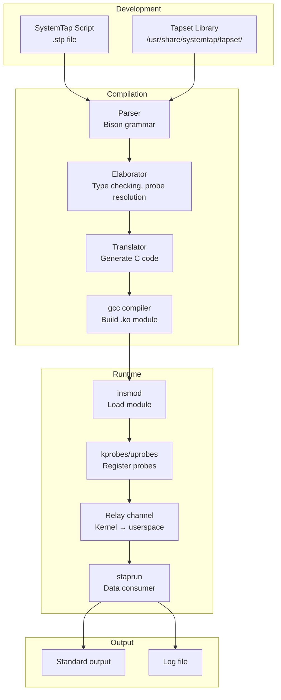
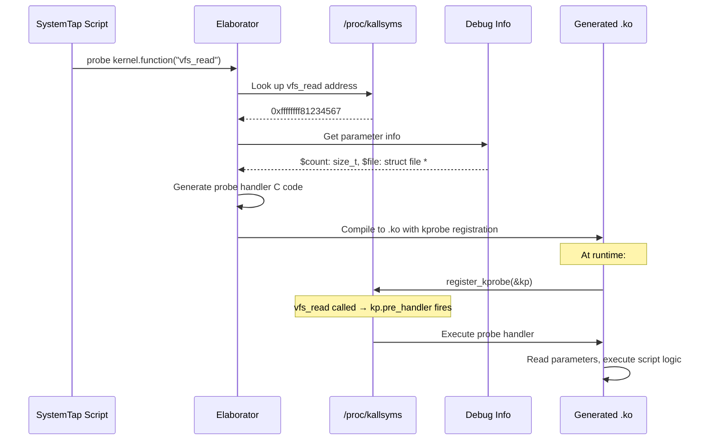

# Chapter 231: SystemTap — Script Language, Tapsets, Kernel Probing

## 1. Intuition

SystemTap is a scripting language and runtime for instrumenting Linux systems in real time. Think of it as "printf debugging on steroids" — you write a script that specifies what events to watch for and what to do when they happen, and SystemTap compiles your script into a kernel module that runs at native speed.

Where bpftrace excels at one-liners and simple aggregations, SystemTap's strength is its full-featured scripting language. It supports variables, conditionals, loops, functions, arrays, and a rich standard library. SystemTap also has an extensive **tapset** library — pre-written probe definitions and helper functions that make it easy to instrument common kernel and user-space subsystems without knowing the internal function names.

SystemTap was originally created by Red Hat as a response to Sun's DTrace. While DTrace had a more elegant design, SystemTap's deep integration with the Linux kernel and its tapset library made it the go-to tool for enterprise Linux debugging. Today, SystemTap and bpftrace serve similar purposes — SystemTap offers more mature scripting capabilities and tapsets, while bpftrace offers lower overhead and safer in-kernel execution via eBPF.

## 2. Architecture

### 2.1 The SystemTap Pipeline

```
┌─────────────────────────────────────────────────────────────┐
│                    SystemTap Script                          │
│  probe vfs.read { printf("%s read %d bytes\n", execname(), $count) }
└───────────────────────────┬─────────────────────────────────┘
                            │
                            ▼
┌─────────────────────────────────────────────────────────────┐
│                     stap Frontend                           │
│  1. Parse script                                           │
│  2. Resolve probe points (tapsets)                         │
│  3. Elaborate (expand wildcards, check types)              │
│  4. Translate to C                                         │
└───────────────────────────┬─────────────────────────────────┘
                            │
                            ▼
┌─────────────────────────────────────────────────────────────┐
│                  C Compiler (gcc)                           │
│  Compile generated C code to kernel module (.ko)           │
└───────────────────────────┬─────────────────────────────────┘
                            │
                            ▼
┌─────────────────────────────────────────────────────────────┐
│              Kernel Module (.ko)                            │
│  insmod → module registers probes → probes fire → output   │
└─────────────────────────────────────────────────────────────┘
```

### 2.2 Alternative Runtime Modes

SystemTap has multiple backends:

| Mode | Description | Overhead |
|------|-------------|----------|
| **Kernel module** (default) | Compiles script to .ko, loads with insmod | Lowest at runtime, highest startup |
| **Dyninst** (user-space only) | Uses Dyninst library for runtime rewriting | Moderate |
| **eBPF** (experimental) | Compiles to eBPF bytecode | Lowest startup, moderate runtime |
| **Remote** | Cross-compile on host, deploy on target | For embedded systems |
| **Cache** | Reuse previously compiled modules | Near-instant startup |

### 2.3 Probe Point Categories

```mermaid
graph TD
    subgraph "Kernel Probes"
        KERNEL[kernel.function("func")]
        KRETURN[kernel.function("func").return]
        KSTMT[kernel.statement("addr")]
        MODULE[module("name").function("func")]
    end

    subgraph "User-Space Probes"
        PROCESS[process("/path").function("func")]
        PLT[process("/path").plt("func")]
        USTATEMENT[process("/path").statement("addr")]
    end

    subgraph "Tracepoints"
        TPOINT[tracepoint("category:event")]
    end

    subgraph "Timers"
        TIMER1[timer.s(N)]
        TIMER2[timer.ms(N)]
        TIMER3[timer.us(N)]
        TIMER4[timer.hz(N)]
    end

    subgraph "System Events"
        BEGINP[begin]
        ENDP[end]
        ERRORP[error]
        NEVERR[never]
    end

    PROBE[Probe Point] --> KERNEL
    PROBE --> KRETURN
    PROBE --> KSTMT
    PROBE --> MODULE
    PROBE --> PROCESS
    PROBE --> PLT
    PROBE --> TPOINT
    PROBE --> TIMER1
    PROBE --> BEGINP
```

### 2.4 SystemTap vs. Other Tracing Tools

```
┌─────────────┬────────────────┬────────────────┬──────────────┐
│ Feature     │ SystemTap      │ bpftrace       │ ftrace       │
├─────────────┼────────────────┼────────────────┼──────────────┤
│ Language    │ Full scripting │ One-liners +   │ File-based   │
│             │ (variables,    │ awk-like       │              │
│             │ loops, funcs)  │                │              │
│ Safety      │ Module unload  │ eBPF verifier  │ Inherent     │
│             │ on error       │                │              │
│ Overhead    │ Low (module)   │ Very low (BPF) │ Very low     │
│ Tapsets     │ Extensive      │ Limited        │ N/A          │
│ User-space  │ Strong         │ Moderate       │ uprobes      │
│ Stability   │ Kernel version │ BTF-based      │ Stable ABI   │
│             │ dependent      │ portable       │              │
│ Enterprise  │ RHEL/SLES      │ Universal      │ Universal    │
└─────────────┴────────────────┴────────────────┴──────────────┘
```

## 3. Usage Examples

### 3.1 Basic SystemTap Scripting

```bash
# Install SystemTap
apt install systemtap systemtap-runtime    # Debian/Ubuntu
yum install systemtap systemtap-runtime    # RHEL/CentOS

# Also install kernel debug symbols
apt install linux-image-$(uname -r)-dbg    # Debian/Ubuntu
debuginfo-install kernel-$(uname -r)       # RHEL/CentOS

# Simple hello world
stap -e 'probe begin { printf("Hello, World!\n"); exit(); }'

# Trace a syscall
stap -e '
probe syscall.open {
    printf("%s(%d) opened %s\n", execname(), pid(), filename)
}
'

# Count function calls
stap -e '
probe kernel.function("vfs_read") { reads++ }
probe timer.s(5) {
    printf("vfs_read calls in 5s: %d\n", reads)
    reads = 0
}
probe end { printf("Final read count: %d\n", reads) }
'
```

### 3.2 Tapsets — The Standard Library

Tapsets are pre-written probe definitions in `/usr/share/systemtap/tapset/`:

```bash
# List available tapsets
ls /usr/share/systemtap/tapset/

# Common tapsets:
# process.stp    - Process-related probes
# syscall.stp    - System call probes
# vfs.stp        - Virtual filesystem probes
# net.stp        - Networking probes
# scsi.stp       - SCSI/block device probes
# signal.stp     - Signal handling probes
# scheduler.stp  - Scheduler probes
# memory.stp     - Memory management probes

# Use tapset-defined probes
stap -e '
probe vfs.read {
    printf("%s read %d bytes from inode %d\n",
           execname(), bytes, inode)
}
'

# Available tapset variables for vfs.read:
# filename - file name
# bytes    - bytes read
# inode    - inode number
# dev      - device number
# ret      - return value
# offset   - file offset

# Use tapset helper functions
stap -e '
probe vfs.read {
    printf("%s (%d/%d) read %d bytes: %s\n",
           execname(), pid(), tid(), bytes, filename)
    printf("  CPU: %d, timestamp: %d\n", cpu(), gettimeofday_us())
}
'
```

### 3.3 System Call Tracing

```bash
# Trace all system calls
stap -e '
probe syscall.* {
    printf("%s -> %s(%s)\n", execname(), name, argstr)
}
probe syscall.*.return {
    printf("%s <- %s = %d\n", execname(), name, retstr)
}
'

# Trace specific syscall with arguments
stap -e '
probe syscall.open {
    printf("open(%s, %x) flags=%d mode=%o\n",
           filename, flags, flags, mode)
}
probe syscall.open.return {
    printf("open returned fd=%d\n", $return)
}
'

# Syscall latency
stap -e '
global latencies
probe syscall.* { latencies[name, tid()] = gettimeofday_us() }
probe syscall.*.return {
    dt = gettimeofday_us() - latencies[name, tid()]
    if (dt > 0)
        @hist_log(dt) <<< name
    delete latencies[name, tid()]
}
'

# Count syscalls by process
stap -e '
global counts
probe syscall.* { counts[execname()]++ }
probe end {
    foreach (proc in counts-)
        printf("%30s: %d\n", proc, counts[proc])
}
'
```

### 3.4 Kernel Function Tracing

```bash
# Trace kernel function with arguments
stap -e '
probe kernel.function("do_sys_open") {
    printf("do_sys_open(%s, %x, %o)\n",
           $filename, $flags, $mode)
}
probe kernel.function("do_sys_open").return {
    printf("do_sys_open returned %d\n", $return)
}
'

# Trace with call stack
stap -e '
probe kernel.function("kmalloc") {
    if ($bytes > 1024) {
        printf("Large alloc: %d bytes\n", $bytes)
        print_backtrace()
    }
}
'

# Trace module functions
stap -e '
probe module("ext4").function("ext4_*") {
    printf("ext4: %s called\n", probefunc())
}
'

# Filter by process
stap -e '
probe kernel.function("vfs_read") {
    if (execname() == "myapp")
        printf("myapp read: %d bytes\n", $count)
}
'
```

### 3.5 User-Space Probing

```bash
# Probe user-space function
stap -e '
probe process("/usr/bin/myapp").function("process_data") {
    printf("process_data called with arg=%d\n", $arg0)
}
probe process("/usr/bin/myapp").function("process_data").return {
    printf("process_data returned %d\n", $return)
}
'

# Probe shared library
stap -e '
probe process("/usr/lib/libc.so.6").function("__malloc") {
    printf("malloc(%d)\n", $bytes)
}
'

# Probe at specific source line
stap -e '
probe process("/usr/bin/myapp").statement("main@main.c:42") {
    printf("At line 42, i=%d\n", $i)
}
'

# PLT (Procedure Linkage Table) probing — trace library calls
stap -e '
probe process("/usr/bin/myapp").plt("*") {
    printf("PLT call: %s\n", probefunc())
}
'
```

### 3.6 Advanced Scripting

#### System Call Latency Analysis

```bash
#!/usr/bin/env stap
// syscall_latency.stp - Analyze system call latency distribution

global latency_start, latency_hist

probe syscall.* {
    latency_start[syscall, tid()] = gettimeofday_us()
}

probe syscall.*.return {
    key = syscall
    start = latency_start[key, tid()]
    if (start > 0) {
        dt = gettimeofday_us() - start
        latency_hist[key] <<< dt
    }
    delete latency_start[key, tid()]
}

probe timer.s(10) {
    printf("\n%-30s %8s %8s %8s %8s %8s\n",
           "SYSCALL", "COUNT", "MIN(us)", "AVG(us)", "MAX(us)", "TOTAL(us)")
    printf("%s\n", str_repeat("-", 90))

    foreach (sc in latency_hist) {
        printf("%-30s %8d %8d %8d %8d %8d\n",
               sc, @count(latency_hist[sc]),
               @min(latency_hist[sc]),
               @avg(latency_hist[sc]),
               @max(latency_hist[sc]),
               @sum(latency_hist[sc]))
    }
    delete latency_hist
}

probe end {
    printf("\n--- Final Results ---\n")
    foreach (sc in latency_hist-)
        printf("%-30s count=%d avg=%d max=%d\n",
               sc, @count(latency_hist[sc]),
               @avg(latency_hist[sc]),
               @max(latency_hist[sc]))
}
```

#### Process Life Cycle Tracker

```bash
#!/usr/bin/env stap
// proc_lifecycle.stp - Track process creation and destruction

probe begin {
    printf("Tracking process lifecycle...\n")
}

probe process_create {
    printf("[%d] CREATE: %s (pid=%d, ppid=%d)\n",
           gettimeofday_s(), execname(), pid(), ppid())
}

probe process_exec {
    printf("[%d] EXEC: %s (pid=%d) -> %s\n",
           gettimeofday_s(), execname(), pid(), filename)
}

probe process_exit {
    printf("[%d] EXIT: %s (pid=%d) status=%d\n",
           gettimeofday_s(), execname(), pid(), exit_code)
}

probe syscall.fork.return {
    printf("[%d] FORK: %s (pid=%d) -> child pid=%d\n",
           gettimeofday_s(), execname(), pid(), $return)
}

probe kprocess.exec {
    printf("[%d] KEXEC: %s (pid=%d)\n",
           gettimeofday_s(), execname(), pid())
}
```

#### Network Socket Analysis

```bash
#!/usr/bin/env stap
// net_socket.stp - Analyze network socket operations

global sock_ops

probe socket.send {
    sock_ops[execname(), "send"]++
    printf("%s send: %d bytes to %s:%d\n",
           execname(), size, daddr, dport)
}

probe socket.recv {
    sock_ops[execname(), "recv"]++
    printf("%s recv: %d bytes from %s:%d\n",
           execname(), size, saddr, sport)
}

probe tcp.sendmsg {
    sock_ops[execname(), "tcp_send"]++
}

probe tcp.recvmsg {
    sock_ops[execname(), "tcp_recv"]++
}

probe timer.s(5) {
    printf("\n--- Socket Operations (5s) ---\n")
    foreach ([proc, op] in sock_ops)
        printf("  %-20s %-12s: %d\n", proc, op, sock_ops[proc, op])
    delete sock_ops
}
```

### 3.7 Performance Profiling

```bash
# CPU profiling with SystemTap
stap -e '
global stacks
probe timer.profile {
    stacks[backtrace()]++
}
probe timer.s(30) {
    foreach (bt in stacks-)
        printf("%d\n%s\n", stacks[bt], bt)
    delete stacks
}
'

# Off-CPU analysis
stap -e '
global offcpu_start, offcpu_stack
probe scheduler.cpu_off {
    offcpu_start[pid()] = gettimeofday_us()
    offcpu_stack[pid()] = backtrace()
}
probe scheduler.cpu_on {
    start = offcpu_start[pid()]
    if (start > 0) {
        dt = gettimeofday_us() - start
        @offcpu[execname()] <<< dt
    }
    delete offcpu_start[pid()]
}
probe timer.s(10) {
    printf("\n--- Off-CPU Time (us) ---\n")
    foreach ([proc] in @offcpu-)
        printf("%-20s avg=%d max=%d count=%d\n",
               proc, @avg(@offcpu[proc]),
               @max(@offcpu[proc]),
               @count(@offcpu[proc]))
    delete @offcpu
}
'
```

### 3.8 Remote and Cross-Compilation

```bash
# Cross-compile for remote target
stap -r $(uname -m) -e 'probe begin { printf("hello\n"); exit() }' \
    -m myprobe -p4    # Generate module, don't load

# Copy to target and run
scp myprobe.ko target:/tmp/
ssh target "staprun /tmp/myprobe.ko"

# Or use stap's remote mode
stap --remote user@target script.stp

# Compile for specific kernel version
stap -r 5.4.0-42-generic -e '...' -m myprobe.ko

# Use cross-compilation server
export SYSTEMTAP_STAPIO="ssh root@target"
export SYSTEMTAP_TAPSET="/usr/share/systemtap/tapset"
stap -e 'probe begin { printf("hello\n"); exit() }'
```

### 3.9 SystemTap for Security Analysis

```bash
# Trace privilege escalation attempts
stap -e '
probe kernel.function("commit_creds") {
    if (uid() == 0) {
        printf("CREDENTIALS CHANGED by %s (pid=%d)\n",
               execname(), pid())
        print_backtrace()
    }
}

probe syscall.setuid {
    printf("setuid(%d) by %s (pid=%d)\n",
           uid, execname(), pid())
}
'

# Monitor file access for sensitive files
stap -e '
probe vfs.read, vfs.write {
    if (isinstr(filename, "/etc/shadow") ||
        isinstr(filename, "/etc/passwd")) {
        printf("%s accessed %s (%s)\n",
               execname(), filename, probefunc())
        print_ubacktrace()
    }
}
'

# Trace network connections
stap -e '
probe tcp.connect {
    printf("CONNECT: %s:%d -> %s:%d\n",
           saddr, sport, daddr, dport)
}
probe tcp.disconnect {
    printf("DISCONNECT: %s:%d -> %s:%d\n",
           saddr, sport, daddr, dport)
}
'
```

### 3.10 Interactive and Batching Modes

```bash
# Interactive mode (Ctrl-D to execute, then see results)
stap -e '
global counts
probe syscall.* { counts[name]++ }
probe end {
    foreach (name in counts-)
        printf("%30s: %d\n", name, counts[name])
}
' -

# Batch mode (compile once, run many times)
stap -p1 -e '...'    # Pass 1: parse only
stap -p2 -e '...'    # Pass 2: elaborate
stap -p3 -e '...'    # Pass 3: translate to C
stap -p4 -e '...'    # Pass 4: compile to .ko
stap -p5 -e '...'    # Pass 5: run

# Use precompiled module for fast startup
stap -e '...' -m myprobe -p4    # Compile
staprun myprobe.ko              # Run (fast)

# Limit output
stap -e 'probe syscall.* { printf("%s\n", name) }' -c 'cat /etc/hostname'
```

## 4. Source Code References

| Component | File | Description |
|-----------|------|-------------|
| SystemTap source | `github.com/torvalds/linux` → `tools/systemtap/` | In-tree probe support |
| stap frontend | `git://sourceware.org/git/systemtap.git` | Main SystemTap repository |
| Tapset library | `/usr/share/systemtap/tapset/` | Pre-written probe definitions |
| Runtime | `runtime/` in SystemTap source | C runtime for generated modules |
| Translator | `stap*` files in SystemTap source | Script → C translation |
| Kprobe infrastructure | `kernel/kprobes.c` | Kernel probe support |
| Uprobe infrastructure | `kernel/trace/trace_uprobe.c` | User-space probe support |
| Relay channel | `kernel/relay.c` | Data relay from kernel to userspace |

Key interfaces:
- `/proc/kallsyms` — Kernel symbol resolution
- `/proc/modules` — Loaded kernel modules
- `kprobes` / `kretprobes` — Kernel probe registration
- `uprobes` / `uretprobes` — User-space probe registration

## 5. Diagrams

### SystemTap Execution Pipeline



### Probe Resolution Process



## 6. Common Pitfalls

### 6.1 Missing Kernel Debug Symbols

**Problem:** SystemTap can't resolve function parameters or fails to compile.

**Solution:**
```bash
# Install debug symbols
apt install linux-image-$(uname -r)-dbg        # Debian/Ubuntu
debuginfo-install kernel-$(uname -r)            # RHEL/CentOS

# Verify debug symbols
ls /usr/lib/debug/boot/vmlinux-$(uname -r)

# Check if kernel debuginfo is accessible
stap -e 'probe begin { printf("ok\n"); exit() }' -v
```

### 6.2 Module Compilation Failures

**Problem:** SystemTap fails to compile the kernel module due to header mismatch.

**Solution:**
```bash
# Ensure kernel headers match running kernel
apt install linux-headers-$(uname -r)

# Check version match
uname -r
ls /lib/modules/$(uname -r)/build/

# If using DKMS, rebuild
dkms autoinstall

# Use precompiled server (Red Hat)
stap --use-server myscript.stp
```

### 6.3 User-Space Probe Issues

**Problem:** Can't probe user-space functions; addresses don't resolve.

**Solution:**
```bash
# Need debug symbols for the binary
apt install myapp-dbg

# Or compile with debug info
gcc -g -o myapp myapp.c

# Check if binary has debug info
readelf --debug-dump=info myapp | head -20

# Use absolute path
stap -e 'probe process("/full/path/to/myapp").function("main") { ... }'

# Attach to running process
stap -e 'probe process(12345).function("main") { ... }' -x 12345
```

### 6.4 Performance Overhead

**Problem:** SystemTap scripts cause significant slowdown.

**Cause:** Too many probes, high-frequency events, or complex probe handlers.

**Solution:**
```bash
# Use conditional probes
stap -e 'probe syscall.open if (execname() == "myapp") { ... }'

# Limit probe scope
stap -e 'probe kernel.function("vfs_read").call { ... }' \
    -D MAXMAPENTRIES=1000 -D MAXACTION=1000

# Use -D flags to control limits
stap -D MAXMAPENTRIES=10000    # Max map entries
stap -D MAXACTION=1000         # Max actions per probe
stap -D MAXSTRINGLEN=256       # Max string length

# Use timers instead of high-frequency probes
stap -e 'probe timer.s(5) { ... }'  # Every 5 seconds, not every event
```

## 7. Best Practices

### 7.1 Tapset Development

```bash
# Create custom tapsets for your organization
mkdir -p /usr/local/share/systemtap/tapset

# mycompany_tapset.stp
# Custom probes for myapp

probe myapp.request_start = process("/opt/myapp/bin/server").function("handle_request")
{
    url = $req->url
    method = $req->method
}

probe myapp.request_end = process("/opt/myapp/bin/server").function("handle_request").return
{
    latency_us = gettimeofday_us() - @entry(gettimeofday_us())
    status = $return
}
```

### 7.2 Systematic Debugging Workflow

```bash
# Step 1: Verify systemtap works
stap -e 'probe begin { printf("SystemTap OK\n"); exit() }'

# Step 2: Start broad — trace at subsystem level
stap -e '
probe syscall.* { counts[name]++ }
probe timer.s(10) {
    foreach (n in counts-) printf("%30s: %d\n", n, counts[n])
    delete counts
}
'

# Step 3: Narrow down to specific syscall
stap -e '
probe syscall.open { printf("open(%s)\n", filename) }
probe syscall.open.return { printf("open returned %d\n", $return) }
'

# Step 4: Go deeper into kernel internals
stap -e '
probe kernel.function("do_filp_open") { ... }
probe kernel.function("path_openat") { ... }
'

# Step 5: Correlate with user-space
stap -e '
probe process("/usr/bin/myapp").function("open_file") { ... }
'
```

## 8. Exercises

### Exercise 1: Syscall Profiling
Write a SystemTap script that:
1. Tracks all system calls with their latency
2. Reports the top 20 slowest system calls every 10 seconds
3. Includes the call stack for any system call taking > 1ms

### Exercise 2: File System Analysis
Write a SystemTap script that:
1. Traces all VFS read/write operations
2. Groups by file (inode/device)
3. Measures read/write latency distribution
4. Identifies the process performing the most I/O

### Exercise 3: Memory Leak Detection
Write a SystemTap script that:
1. Tracks kmalloc/kfree calls in the kernel
2. Reports allocations that are never freed
3. Includes the allocation call stack
4. Reports every 30 seconds

### Exercise 4: Network Analysis
Write a SystemTap script that:
1. Traces TCP send/receive operations
2. Measures per-connection throughput
3. Detects connection resets and timeouts
4. Reports connection statistics

### Exercise 5: Custom Tapset
Create a custom tapset for a specific subsystem (e.g., ext4, networking):
1. Define probe aliases for common operations
2. Include helper functions for data extraction
3. Write documentation for each probe
4. Test the tapset with a sample script

## 9. References

1. **SystemTap Language Reference** — https://sourceware.org/systemtap/langref/ — Complete language specification
2. **SystemTap Tapset Reference** — https://sourceware.org/systemtap/tapsets/ — Tapset library documentation
3. **SystemTap Tutorial** — https://sourceware.org/systemtap/tutorial/ — Getting started guide
4. **SystemTap Beginner's Guide** — Red Hat, 2020 — Enterprise Linux tracing
5. **DTrace vs SystemTap** — https://sourceware.org/systemtap/wiki/DTraceVsSystemTap — Comparison
6. **kprobes Documentation** — `Documentation/trace/kprobes.rst` — Kernel probe internals
7. **uprobes Documentation** — `Documentation/trace/uprobetracer.rst` — User-space probe internals
8. **SystemTap GitHub** — https://github.com/torvalds/linux/tree/master/tools/systemtap — In-tree tools
9. **Tapset Development Guide** — https://sourceware.org/systemtap/tapsetAPI/ — Writing custom tapsets
10. **SystemTap in Enterprise** — https://access.redhat.com/documentation/en-us/red_hat_enterprise_linux/ — Red Hat documentation
